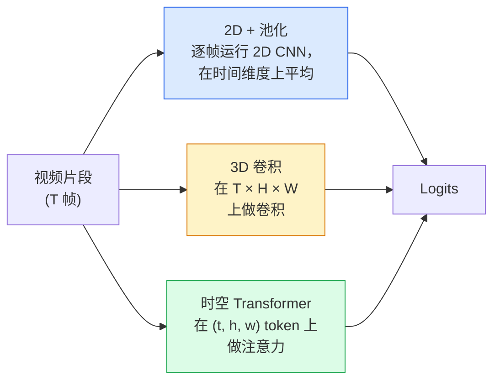

# 视频理解 — 时序建模

> 视频是一系列图像加上连接它们的物理运动规律。所有视频模型要么将时间视为额外的轴（3D 卷积），要么将其视为可以注意的序列（Transformer），要么将其视为提取一次后池化的特征（2D+池化）。

**类型：** 学习 + 构建
**语言：** Python
**前置知识：** 第4阶段第3课（CNN）、第4阶段第4课（图像分类）
**预计时间：** 约45分钟

## 学习目标

- 区分三种主要视频建模方法（2D+池化、3D 卷积、时空 Transformer），并预测各自的计算代价与精度权衡
- 用 PyTorch 实现帧采样、时序池化，以及 2D+池化基线分类器
- 解释 I3D 的"膨胀"3D 卷积核为何能很好地从 ImageNet 权重迁移，以及因式分解 (2+1)D 卷积的不同之处
- 了解标准动作识别数据集和评估指标：Kinetics-400/600、UCF101、Something-Something V2；clip 级别和视频级别的 top-1 精度

## 问题背景

一段 30fps 的 30 秒视频有 900 帧。最朴素的做法是把视频分类当成图像分类跑 900 次再做聚合。这种方法在动作几乎每帧都可见时还能用（体育、烹饪、健身视频），但当动作本身由运动定义时就会彻底失败：比如"把某物从左推到右"，在每一帧中看起来都只是两个静止的物体。

每个视频架构都要回答的核心问题是：何时、如何建模时序结构？这个答案决定了一切——计算成本、预训练策略、是否能复用 ImageNet 权重、模型在哪些数据集上训练。

本课有意比静态图像课程更短。核心图像处理机制已经到位，视频理解主要聚焦于时序这条主线：采样、建模和聚合。

## 核心概念

### 三大架构家族



### 2D + 池化

取一个 2D CNN（ResNet、EfficientNet、ViT），对每个采样帧独立运行，然后对逐帧嵌入做平均（或最大池化、注意力池化），最后将池化向量送入分类器。

优点：
- ImageNet 预训练权重可以直接迁移。
- 实现最简单。
- 计算量低：T 帧 × 单张图像推理代价。

缺点：
- 无法建模运动。动作 = 外观的聚合。
- 时序池化是顺序无关的——"开门"和"关门"看起来完全一样。

适用场景：外观主导的任务、小型视频数据集上的迁移学习、初始基线。

### 3D 卷积

将 2D（H, W）卷积核替换为 3D（T, H, W）卷积核。网络同时在空间和时间维度上做卷积。早期代表：C3D、I3D、SlowFast。

**I3D 技巧**：取一个预训练的 2D ImageNet 模型，将每个 2D 卷积核沿新的时间轴复制，进行"膨胀"。一个 3×3 的 2D 卷积变成 3×3×3 的 3D 卷积。这让 3D 模型拥有强大的预训练初始权重，而无需从头训练。

优点：
- 直接建模运动。
- I3D 膨胀提供免费的迁移学习。

缺点：
- 比 2D 对应版本多 T/8 的 FLOPs（对时间卷积核为 3 且堆叠 3 次的情况）。
- 时序感受野小；长程运动需要金字塔或双流方案。

适用场景：运动是信号的动作识别任务（Something-Something V2、Kinetics 中运动密集的类别）。

### 时空 Transformer

将视频切分为时空 patch 的网格，在所有 patch 上做注意力。代表模型：TimeSformer、ViViT、Video Swin、VideoMAE。

重要的注意力模式：
- **联合（Joint）** — 对（t, h, w）做一次大注意力。在 `T×H×W` 上是二次复杂度，代价极高。
- **分离（Divided）** — 每个 block 内做两次注意力：一次跨时间，一次跨空间。接近线性扩展。
- **因式分解（Factorised）** — 时间注意力和空间注意力在不同 block 中交替出现。

优点：
- 在所有主流基准上达到 SOTA。
- 通过 patch 膨胀从图像 Transformer（ViT）迁移。
- 支持通过稀疏注意力处理长视频。

缺点：
- 计算量大。
- 需要谨慎选择注意力模式，否则运行时间暴增。

适用场景：大规模数据集、高保真视频理解、多模态视频+文本任务。

### 帧采样

一段 30fps 的 10 秒片段有 300 帧；把全部 300 帧送入任何模型都是浪费。标准策略：

- **均匀采样** — 在片段中均匀选取 T 帧。2D+池化的默认选择。
- **稠密采样** — 随机选取连续的 T 帧窗口。常用于 3D 卷积，因为运动需要相邻帧。
- **多片段（Multi-clip）** — 从同一视频采样多个 T 帧窗口，逐个分类，测试时对预测结果取平均。

T 通常为 8、16、32 或 64。T 越大，时序信号越强，计算量也越大。

### 评估

两个层级：
- **片段级（Clip-level）精度** — 模型看一个 T 帧片段，报告 top-k。
- **视频级（Video-level）精度** — 对同一视频的多个片段预测取平均；更高且更稳定。

两者都要报告。一个模型片段级 78%/视频级 82% 说明它严重依赖测试时平均；片段级 80%/视频级 81% 则表明每个片段的预测更稳健。

### 常见数据集

- **Kinetics-400 / 600 / 700** — 通用动作数据集。40 万个片段，来自 YouTube URL（许多现已失效）。
- **Something-Something V2** — 由运动定义的动作（"把 X 从左移到右"）。2D+池化方法无法解决。
- **UCF-101、HMDB-51** — 较老、较小，仍在报告中出现。
- **AVA** — 时空中的动作**定位**；比分类更难。

## 动手实现

### 第一步：帧采样器

均匀采样器和稠密采样器，作用于帧列表（或视频 tensor）。

```python
import numpy as np

def sample_uniform(num_frames_total, T):
    if num_frames_total <= T:
        return list(range(num_frames_total)) + [num_frames_total - 1] * (T - num_frames_total)
    step = num_frames_total / T
    return [int(i * step) for i in range(T)]


def sample_dense(num_frames_total, T, rng=None):
    rng = rng or np.random.default_rng()
    if num_frames_total <= T:
        return list(range(num_frames_total)) + [num_frames_total - 1] * (T - num_frames_total)
    start = int(rng.integers(0, num_frames_total - T + 1))
    return list(range(start, start + T))
```

两者都返回 T 个索引，用于切片视频 tensor。

### 第二步：2D+池化基线

对每帧运行 2D ResNet-18，对特征做平均池化，再分类。

```python
import torch
import torch.nn as nn
from torchvision.models import resnet18, ResNet18_Weights

class FramePool(nn.Module):
    def __init__(self, num_classes=400, pretrained=True):
        super().__init__()
        weights = ResNet18_Weights.IMAGENET1K_V1 if pretrained else None
        backbone = resnet18(weights=weights)
        self.features = nn.Sequential(*(list(backbone.children())[:-1]))  # 保留全局平均池化
        self.head = nn.Linear(512, num_classes)

    def forward(self, x):
        # x: (N, T, 3, H, W)
        N, T = x.shape[:2]
        x = x.view(N * T, *x.shape[2:])
        feats = self.features(x).view(N, T, -1)
        pooled = feats.mean(dim=1)
        return self.head(pooled)

model = FramePool(num_classes=10)
x = torch.randn(2, 8, 3, 224, 224)
print(f"output: {model(x).shape}")
print(f"params: {sum(p.numel() for p in model.parameters()):,}")
```

1100 万参数，ImageNet 预训练，逐帧运行，取平均，做分类。这个基线在外观主导的任务上通常只比正规 3D 模型低 5-10 个百分点——有时甚至更好，因为它复用了更强的 ImageNet 骨干网络。

### 第三步：I3D 风格的膨胀 3D 卷积

将单个 2D 卷积沿新时间轴复制权重，转化为 3D 卷积。

```python
def inflate_2d_to_3d(conv2d, time_kernel=3):
    out_c, in_c, kh, kw = conv2d.weight.shape
    weight_3d = conv2d.weight.data.unsqueeze(2)  # (out, in, 1, kh, kw)
    weight_3d = weight_3d.repeat(1, 1, time_kernel, 1, 1) / time_kernel
    conv3d = nn.Conv3d(in_c, out_c, kernel_size=(time_kernel, kh, kw),
                        padding=(time_kernel // 2, conv2d.padding[0], conv2d.padding[1]),
                        stride=(1, conv2d.stride[0], conv2d.stride[1]),
                        bias=False)
    conv3d.weight.data = weight_3d
    return conv3d

conv2d = nn.Conv2d(3, 64, kernel_size=3, padding=1, bias=False)
conv3d = inflate_2d_to_3d(conv2d, time_kernel=3)
print(f"2D weight shape:  {tuple(conv2d.weight.shape)}")
print(f"3D weight shape:  {tuple(conv3d.weight.shape)}")
x = torch.randn(1, 3, 8, 56, 56)
print(f"3D output shape:  {tuple(conv3d(x).shape)}")
```

除以 `time_kernel` 是为了保持激活值幅度大致不变——这对于第一次前向传播时不破坏 batch normalization 的统计数据至关重要。

### 第四步：因式分解 (2+1)D 卷积

将 3D 卷积拆分为 2D（空间）卷积和 1D（时间）卷积。感受野相同，参数更少，在某些基准上精度更高。

```python
class Conv2Plus1D(nn.Module):
    def __init__(self, in_c, out_c, kernel_size=3):
        super().__init__()
        mid_c = (in_c * out_c * kernel_size * kernel_size * kernel_size) \
                // (in_c * kernel_size * kernel_size + out_c * kernel_size)
        self.spatial = nn.Conv3d(in_c, mid_c, kernel_size=(1, kernel_size, kernel_size),
                                 padding=(0, kernel_size // 2, kernel_size // 2), bias=False)
        self.bn = nn.BatchNorm3d(mid_c)
        self.act = nn.ReLU(inplace=True)
        self.temporal = nn.Conv3d(mid_c, out_c, kernel_size=(kernel_size, 1, 1),
                                  padding=(kernel_size // 2, 0, 0), bias=False)

    def forward(self, x):
        return self.temporal(self.act(self.bn(self.spatial(x))))

c = Conv2Plus1D(3, 64)
x = torch.randn(1, 3, 8, 56, 56)
print(f"(2+1)D output: {tuple(c(x).shape)}")
```

完整的 R(2+1)D 网络就是将 ResNet-18 中的每个 3×3 卷积替换为 `Conv2Plus1D`。

## 工程应用

两个库覆盖了生产级视频工作的主要需求：

- `torchvision.models.video` — R(2+1)D、MViT、Swin3D，附带 Kinetics 预训练权重。与图像模型 API 相同。
- `pytorchvideo`（Meta）— 模型库，Kinetics / SSv2 / AVA 的数据加载器，标准变换。

用于视觉-语言视频模型（视频描述生成、视频问答），使用 `transformers`（`VideoMAE`、`VideoLLaMA`、`InternVideo`）。

## 交付物

本课产出：

- `outputs/prompt-video-architecture-picker.md` — 一个提示词，根据外观vs运动程度、数据集大小和计算预算，选择 2D+池化 / I3D / (2+1)D / Transformer。
- `outputs/skill-frame-sampler-auditor.md` — 一个技能文件，检查视频流水线的采样器并标记常见 Bug：索引差一（off-by-one）、`num_frames < T` 时采样不均匀、缺少保持宽高比的裁剪等。

## 练习

1. **(简单)** 估算 T=8 时 FramePool 的 FLOPs（近似）与 T=8 的 I3D 风格 3D ResNet 的 FLOPs。证明 2D+池化为何便宜 3-5 倍。
2. **(中等)** 生成一个合成视频数据集：随机小球朝随机方向运动，按运动方向标注（"从左到右"、"从右到左"、"斜向上"）。在上面训练 FramePool，证明其精度接近随机猜测，从而验证仅靠外观不足以完成运动任务。
3. **(困难)** 通过将 ResNet-18 中的每个 Conv2d 替换为 `Conv2Plus1D`，构建一个 R(2+1)D-18。从 ImageNet 预训练的 ResNet-18 膨胀第一个卷积的权重。在练习2的运动数据集上训练，并超越 FramePool。

## 关键术语

| 术语 | 常见说法 | 真正含义 |
|------|---------|---------|
| 2D + 池化 (2D + pool) | "逐帧分类器" | 对每个采样帧运行 2D CNN，在时间维度上平均池化特征，再分类 |
| 3D 卷积 (3D convolution) | "时空卷积核" | 在（T, H, W）上做卷积的核；能原生建模运动 |
| 膨胀 (Inflation) | "把 2D 权重提升到 3D" | 将 2D 卷积权重沿新时间轴复制来初始化 3D 卷积权重，再除以时间核大小以保持激活量级 |
| (2+1)D | "因式分解卷积" | 将 3D 拆分为 2D 空间 + 1D 时间；参数更少，中间多一个非线性层 |
| 分离注意力 (Divided attention) | "先时间后空间" | Transformer block 每层做两次注意力：一次在同一帧的 token 上，一次在同一位置的 token 上 |
| 片段 (Clip) | "T 帧窗口" | 由 T 帧构成的采样子序列；视频模型消费的基本单位 |
| 片段精度 vs 视频精度 | "两种评估设置" | 片段精度 = 每个视频采一个样本，视频精度 = 对多个采样片段取平均 |
| Kinetics | "视频界的 ImageNet" | 400-700 个动作类别，30 万+ YouTube 片段，标准视频预训练语料库 |

## 延伸阅读

- [I3D: Quo Vadis, Action Recognition (Carreira & Zisserman, 2017)](https://arxiv.org/abs/1705.07750) — 提出膨胀技巧和 Kinetics 数据集
- [R(2+1)D: A Closer Look at Spatiotemporal Convolutions (Tran et al., 2018)](https://arxiv.org/abs/1711.11248) — 因式分解卷积，至今仍是强基线
- [TimeSformer: Is Space-Time Attention All You Need? (Bertasius et al., 2021)](https://arxiv.org/abs/2102.05095) — 第一个强大的视频 Transformer
- [VideoMAE (Tong et al., 2022)](https://arxiv.org/abs/2203.12602) — 视频掩码自编码器预训练；当前主流预训练方案
