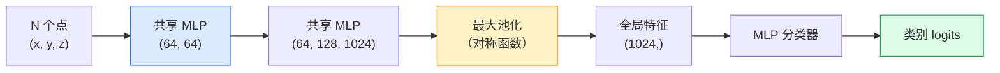

# 3D 视觉 — 点云与 NeRF

> 3D 视觉有两种主要形式。点云是传感器的原始输出，NeRF 是学到的体积场。两者都在回答"什么东西在空间的哪个位置"。

**类型：** 学习 + 构建
**语言：** Python
**前置知识：** 第4阶段第3课（CNN）、第1阶段第12课（Tensor 操作）
**预计时间：** 约45分钟

## 学习目标

- 区分显式表示（点云、网格、体素）和隐式表示（有符号距离场、NeRF），以及各自的适用场景
- 理解 PointNet 的对称函数技巧，使神经网络对无序点集具有排列不变性
- 追踪 NeRF 的前向传播过程：光线投射、体积渲染、位置编码、MLP 密度+颜色头
- 使用 `nerfstudio` 或 `instant-ngp` 从少量带姿态图像进行预训练的 3D 重建

## 问题背景

相机产生 2D 图像。激光雷达产生一组无序的 3D 点。运动恢复结构（SfM）流水线产生稀疏的 3D 关键点云。NeRF 从少量带姿态图像重建整个 3D 场景。这些都是"视觉"，但没有一个看起来像 CNN 想要的密集 tensor。

3D 视觉之所以重要，是因为几乎所有高价值机器人任务都在 3D 空间中进行：抓取、避障、导航、AR 遮挡、3D 内容捕获。只懂 2D 图像的视觉工程师将被排除在该领域增长最快的部分之外（AR/VR 内容、机器人、自动驾驶，以及面向房地产和建筑的基于 NeRF 的 3D 重建）。

这两种表示方式各有其主导地位的原因。点云是传感器免费给你的东西，NeRF 及其后继者（3D 高斯泼溅、神经 SDF）则是当你要求神经网络学习一个场景时得到的东西。

## 核心概念

### 点云

点云是 R³ 中 N 个点的无序集合，每个点可选地带有特征（颜色、强度、法向量）。

```
cloud = [
  (x1, y1, z1, r1, g1, b1),
  (x2, y2, z2, r2, g2, b2),
  ...
  (xN, yN, zN, rN, gN, bN),
]
```

没有网格，没有连通性。这对神经网络来说有两个难点：

- **排列不变性** — 输出不能依赖于点的顺序。
- **可变的 N** — 单个模型必须处理不同大小的点云。

PointNet（Qi et al., 2017）用一个核心思路解决了这两个问题：对每个点应用共享 MLP，然后用对称函数（最大池化）聚合。结果是一个不依赖于顺序的固定大小向量。

```
f(P) = max_{p ∈ P} MLP(p)
```

这就是 PointNet 的全部核心。更深的变体（PointNet++、Point Transformer）增加了层次采样和局部聚合，但对称函数技巧保持不变。

### PointNet 架构



"共享 MLP"意味着同一个 MLP 独立地作用于每个点。为了效率，实现上使用在点维度上的 1×1 卷积。

### 神经辐射场（NeRF）

NeRF（Mildenhall et al., 2020）将"能否从 N 张照片重建一个 3D 场景"这个问题，用一个**本身就是场景**的神经网络来回答。该网络将 `(x, y, z, 视角方向)` 映射为 `(密度, 颜色)`。渲染新视角就是在这个网络上循环进行光线投射。

```
NeRF MLP:  (x, y, z, theta, phi) -> (sigma, r, g, b)

渲染新视角的像素 (u, v)：
  1. 从相机通过像素 (u, v) 投射一条光线
  2. 在光线上以距离 t_1, t_2, ..., t_N 采样点
  3. 在每个点处查询 MLP
  4. 用透射率 (1 - exp(-sigma * dt)) 加权合成颜色
  5. 求和得到渲染的像素颜色
```

损失函数将渲染的像素与训练图像中的真实像素比较。通过渲染步骤进行反向传播来更新 MLP。无需 3D 真值，无需显式几何——场景存储在 MLP 的权重中。

### NeRF 中的位置编码

普通 MLP 直接处理 `(x, y, z)` 无法表示高频细节，因为 MLP 在频谱上偏向低频。NeRF 通过在输入 MLP 之前将每个坐标编码为 Fourier 特征向量来解决这个问题：

```
gamma(p) = (sin(2^0 π p), cos(2^0 π p), sin(2^1 π p), cos(2^1 π p), ...)
```

最多 L=10 个频率级别。这与 Transformer 用于位置的技巧相同，也在扩散时间条件化中出现过（第10课）。没有它，NeRF 的输出会模糊。

### 体积渲染

```
C(r) = Σ_i T_i * (1 - exp(-σ_i * δ_i)) * c_i

T_i  = exp(- Σ_{j<i} σ_j * δ_j)
δ_i = t_{i+1} - t_i
```

`T_i` 是透射率——光线到达第 i 个点时还剩多少。`(1 - exp(-σ_i * δ_i))` 是第 i 点的不透明度。`c_i` 是颜色。最终像素是沿光线的加权求和。

### NeRF 的继任者

纯 NeRF 训练慢（数小时）且渲染慢（每张图像数秒）。此后的演进路线：

- **Instant-NGP**（2022）— 用哈希网格编码取代 MLP 的位置输入；训练时间缩短到秒级。
- **Mip-NeRF 360** — 处理无界场景并实现抗锯齿。
- **3D 高斯泼溅**（2023）— 用数百万个 3D 高斯函数代替体积场；训练时间缩短到分钟级，实时渲染。当前生产默认方案。

2026 年几乎所有真实的 NeRF 产品实际上都是 3D 高斯泼溅，但底层的思维模型仍然是 NeRF。

### 数据集与基准

- **ShapeNet** — 以点云形式表示的 3D CAD 模型的分类和分割。
- **ScanNet** — 用于分割的真实室内扫描数据。
- **KITTI** — 用于自动驾驶的户外激光雷达点云。
- **NeRF Synthetic / Blended MVS** — 用于视图合成的带姿态图像数据集。
- **Mip-NeRF 360 数据集** — 无界真实场景。

## 动手实现

### 第一步：PointNet 分类器

```python
import torch
import torch.nn as nn

class PointNet(nn.Module):
    def __init__(self, num_classes=10):
        super().__init__()
        self.mlp1 = nn.Sequential(
            nn.Conv1d(3, 64, 1),    nn.BatchNorm1d(64),   nn.ReLU(inplace=True),
            nn.Conv1d(64, 64, 1),   nn.BatchNorm1d(64),   nn.ReLU(inplace=True),
        )
        self.mlp2 = nn.Sequential(
            nn.Conv1d(64, 128, 1),  nn.BatchNorm1d(128),  nn.ReLU(inplace=True),
            nn.Conv1d(128, 1024, 1), nn.BatchNorm1d(1024), nn.ReLU(inplace=True),
        )
        self.head = nn.Sequential(
            nn.Linear(1024, 512),   nn.BatchNorm1d(512),  nn.ReLU(inplace=True),
            nn.Dropout(0.3),
            nn.Linear(512, 256),    nn.BatchNorm1d(256),  nn.ReLU(inplace=True),
            nn.Dropout(0.3),
            nn.Linear(256, num_classes),
        )

    def forward(self, x):
        # x: (N, 3, num_points) — 为 Conv1d 转置
        x = self.mlp1(x)
        x = self.mlp2(x)
        x = torch.max(x, dim=-1)[0]       # (N, 1024)
        return self.head(x)

pts = torch.randn(4, 3, 1024)
net = PointNet(num_classes=10)
print(f"output: {net(pts).shape}")
print(f"params: {sum(p.numel() for p in net.parameters()):,}")
```

约 160 万参数，每个点云处理 1,024 个点。

### 第二步：位置编码

```python
def positional_encoding(x, L=10):
    """
    x: (..., D) -> (..., D * 2 * L)
    """
    freqs = 2.0 ** torch.arange(L, dtype=x.dtype, device=x.device)
    args = x.unsqueeze(-1) * freqs * 3.141592653589793
    sinc = torch.cat([args.sin(), args.cos()], dim=-1)
    return sinc.reshape(*x.shape[:-1], -1)

x = torch.randn(5, 3)
y = positional_encoding(x, L=10)
print(f"input:  {x.shape}")
print(f"encoded: {y.shape}     # (5, 60)")
```

乘以 `2^l * π` 可以产生逐渐升高的频率。

### 第三步：微型 NeRF MLP

```python
class TinyNeRF(nn.Module):
    def __init__(self, L_pos=10, L_dir=4, hidden=128):
        super().__init__()
        self.L_pos = L_pos
        self.L_dir = L_dir
        pos_dim = 3 * 2 * L_pos
        dir_dim = 3 * 2 * L_dir
        self.trunk = nn.Sequential(
            nn.Linear(pos_dim, hidden), nn.ReLU(inplace=True),
            nn.Linear(hidden, hidden),  nn.ReLU(inplace=True),
            nn.Linear(hidden, hidden),  nn.ReLU(inplace=True),
            nn.Linear(hidden, hidden),  nn.ReLU(inplace=True),
        )
        self.sigma = nn.Linear(hidden, 1)
        self.color = nn.Sequential(
            nn.Linear(hidden + dir_dim, hidden // 2), nn.ReLU(inplace=True),
            nn.Linear(hidden // 2, 3), nn.Sigmoid(),
        )

    def forward(self, x, d):
        x_enc = positional_encoding(x, self.L_pos)
        d_enc = positional_encoding(d, self.L_dir)
        h = self.trunk(x_enc)
        sigma = torch.relu(self.sigma(h)).squeeze(-1)
        rgb = self.color(torch.cat([h, d_enc], dim=-1))
        return sigma, rgb

nerf = TinyNeRF()
x = torch.randn(128, 3)
d = torch.randn(128, 3)
s, c = nerf(x, d)
print(f"sigma: {s.shape}   rgb: {c.shape}")
```

相比原版 NeRF（深度为 8 的两个 MLP 主干），这是一个简化版本，足以演示架构原理。

### 第四步：沿光线进行体积渲染

```python
def volumetric_render(sigma, rgb, t_vals):
    """
    sigma: (..., N_samples)
    rgb:   (..., N_samples, 3)
    t_vals: (N_samples,) 沿光线的距离
    """
    delta = torch.cat([t_vals[1:] - t_vals[:-1], torch.full_like(t_vals[:1], 1e10)])
    alpha = 1.0 - torch.exp(-sigma * delta)
    trans = torch.cumprod(torch.cat([torch.ones_like(alpha[..., :1]), 1.0 - alpha + 1e-10], dim=-1), dim=-1)[..., :-1]
    weights = alpha * trans
    rendered = (weights.unsqueeze(-1) * rgb).sum(dim=-2)
    depth = (weights * t_vals).sum(dim=-1)
    return rendered, depth, weights


N = 64
t_vals = torch.linspace(2.0, 6.0, N)
sigma = torch.rand(N) * 0.5
rgb = torch.rand(N, 3)
rendered, depth, weights = volumetric_render(sigma, rgb, t_vals)
print(f"rendered colour: {rendered.tolist()}")
print(f"depth:           {depth.item():.2f}")
```

一条光线，64 个采样点，合成为单个 RGB 像素和深度值。

## 工程应用

实际工作中：

- `nerfstudio`（Tancik et al.）— 目前 NeRF / Instant-NGP / 高斯泼溅的参考库。提供命令行工具和 Web 查看器。
- `pytorch3d`（Meta）— 可微渲染、点云工具、网格操作。
- `open3d` — 点云处理、配准、可视化。

对于部署，3D 高斯泼溅已基本取代纯 NeRF，因为渲染速度快 100 倍，重建质量相当。

## 交付物

本课产出：

- `outputs/prompt-3d-task-router.md` — 一个提示词，根据任务和输入数据路由到正确的 3D 表示（点云、网格、体素、NeRF、高斯泼溅）。
- `outputs/skill-point-cloud-loader.md` — 一个技能文件，为 .ply / .pcd / .xyz 文件编写 PyTorch `Dataset`，包含正确的归一化、中心化和点采样。

## 练习

1. **(简单)** 证明 PointNet 具有排列不变性：将同一个点云传入两次，第二次打乱点的顺序。验证输出在浮点误差范围内完全相同。
2. **(中等)** 实现一个最小的光线生成函数，给定相机内参和姿态，为 H×W 图像的每个像素产生光线原点和方向。
3. **(困难)** 在一个彩色立方体的合成渲染视图数据集上训练 TinyNeRF（通过可微渲染或简单光线追踪器生成）。报告第 1、10、100 个 epoch 时的渲染损失。在哪个 epoch 模型开始产生可识别的视图？

## 关键术语

| 术语 | 常见说法 | 真正含义 |
|------|---------|---------|
| 点云 (Point cloud) | "激光雷达的 3D 点" | 每个点为 (x, y, z) + 可选特征的无序集合 |
| PointNet | "首个处理点云的神经网络" | 逐点共享 MLP + 对称（最大）池化；从结构上保证排列不变性 |
| NeRF | "就是场景的 MLP" | 将 (x, y, z, 方向) 映射为（密度, 颜色）的网络；通过光线投射渲染 |
| 位置编码 (Positional encoding) | "Fourier 特征" | 将每个坐标编码为多个频率的 sin/cos，以克服 MLP 的低频偏置 |
| 体积渲染 (Volumetric rendering) | "光线积分" | 利用透射率和 alpha 将光线上的采样合成为单个像素 |
| Instant-NGP | "哈希网格 NeRF" | 用多分辨率哈希网格替代 NeRF 的坐标 MLP；速度提升 100-1000 倍 |
| 3D 高斯泼溅 (3D Gaussian splatting) | "数百万个高斯函数" | 场景 = 3D 高斯函数的集合；实时渲染，几分钟内训练完成 |
| SDF | "有符号距离场" | 返回到最近表面有符号距离的函数；另一种隐式表示 |

## 延伸阅读

- [PointNet (Qi et al., 2017)](https://arxiv.org/abs/1612.00593) — 排列不变分类器
- [NeRF (Mildenhall et al., 2020)](https://arxiv.org/abs/2003.08934) — 使从照片进行 3D 重建成为神经网络问题的论文
- [Instant-NGP (Müller et al., 2022)](https://arxiv.org/abs/2201.05989) — 哈希网格，速度提升 1000 倍
- [3D Gaussian Splatting (Kerbl et al., 2023)](https://arxiv.org/abs/2308.04079) — 在生产中取代 NeRF 的架构
