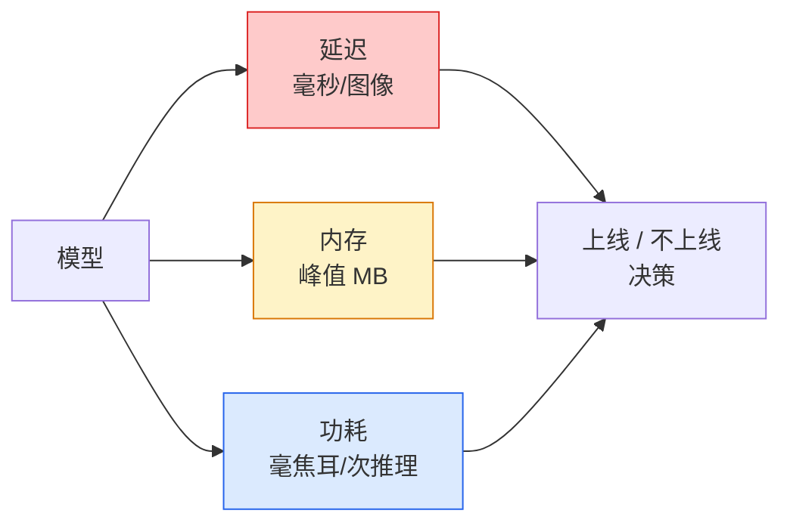

# 实时视觉 — 边缘部署

> 边缘推理是一门将"精度90%的模型"以30fps运行在2GB内存设备上的工程学科。每提升一个百分点的精度，都要用毫秒级的延迟来换。

**类型：** 学习 + 构建
**语言：** Python
**前置知识：** 第4阶段第4课（图像分类）、第10阶段第11课（量化）
**预计时间：** 约75分钟

## 学习目标

- 测量任意 PyTorch 模型的推理延迟、峰值内存和吞吐量，并读懂 FLOPs / 参数量 / 延迟的权衡关系
- 使用 PyTorch 的训练后量化（PTQ）将视觉模型量化为 INT8，并验证精度损失 < 1%
- 导出到 ONNX，使用 ONNX Runtime 或 TensorRT 编译；列出三种最常见的导出失败及其修复方法
- 解释在不同边缘约束下何时选择 MobileNetV3、EfficientNet-Lite、ConvNeXt-Tiny 或 MobileViT

## 问题背景

训练时的视觉模型是个浮点数巨兽：1亿参数，每次前向传播 10 GFLOPs，占用 2 GB 显存。这一切都无法塞进手机、汽车娱乐系统、工业相机或无人机。要交付一个视觉系统，就意味着把同样的预测塞进小 100 倍的资源预算里。

三个旋钮完成大部分工作：模型选择（更小的架构配合同等训练方案）、量化（INT8 代替 FP32），以及推理运行时（ONNX Runtime、TensorRT、Core ML、TFLite）。用好它们，是 Demo 只能跑在工作站上与产品能装进 30 美元相机模块的分水岭。

本课首先建立测量规范（无法测量的东西无法优化），然后逐一讲解这三个旋钮。目标不是学会每个边缘运行时，而是了解哪些杠杆存在，以及如何验证每个杠杆的实际效果。

## 核心概念

### 三大预算



- **延迟**：p50、p95、p99。只平均 p50 会遮盖对实时系统至关重要的尾部行为。
- **峰值内存**：设备见到的最大值，而非稳态平均值。重要原因：嵌入式目标上的 OOM 是致命的。
- **功耗/能耗**：电池供电设备上每次推理的毫焦耳数。通常用 CPU/GPU 利用率 × 时间来近似。

做边缘决策所需的是一张（模型、延迟、内存、精度）的数据表，每个数字都在目标设备上实测，而非在工作站上。

### 测量规范

每次边缘性能分析都应遵循的三条规则：

1. **预热**：测量前先进行 5-10 次虚拟前向传播，消除冷缓存和 JIT 编译带来的失真。
2. **同步**：在计时块前后调用 `torch.cuda.synchronize()`。否则你测的是 kernel 分发时间，而不是 kernel 执行时间。
3. **固定输入尺寸**：使用生产分辨率。224×224 上的延迟不等于 512×512 的延迟。

### FLOPs 作为代理指标

FLOPs（每次推理的浮点运算次数）是延迟的廉价、设备无关的代理指标。适合用于架构比较，但作为绝对的实际运行时间有误导性。FLOPs 多 10% 的模型实际上可能快 2 倍，因为它使用了对硬件友好的算子（深度可分离卷积编译效果好，大的 7×7 卷积则不然）。

规则：用 FLOPs 做架构搜索，用设备实测延迟做部署决策。

### 量化一段话讲清楚

用 INT8 替换 FP32 的权重和激活值。模型大小缩小 4 倍，内存带宽降低 4 倍，在有 INT8 内核的硬件上（每个现代移动 SoC、每块有 Tensor Core 的 NVIDIA GPU）计算量降低 2-4 倍。视觉任务上使用训练后静态量化的精度损失通常为 0.1-1 个百分点。

量化类型：

- **动态量化（Dynamic）** — 将权重量化为 INT8，激活值用浮点计算。易于实现，加速效果有限。
- **静态量化（Static/PTQ）** — 权重量化 + 在小型校准集上校准激活值范围。比动态量化快很多。
- **量化感知训练（QAT）** — 在训练中模拟量化，让模型学会绕过量化误差。精度最好，需要标注数据。

对于视觉任务，训练后静态量化以 5% 的工作量获得 95% 的收益。只有当 PTQ 的精度损失无法接受时才使用 QAT。

### 剪枝与蒸馏

- **剪枝（Pruning）** — 移除不重要的权重（基于幅度）或通道（结构化剪枝）。对过参数化模型效果好；对已经紧凑的架构用处不大。
- **蒸馏（Distillation）** — 训练小型学生模型去模仿大型教师模型的 logits。通常能恢复因缩小模型而损失的大部分精度。生产边缘模型的标准做法。

### 推理运行时

- **PyTorch eager** — 慢，不适合部署。仅用于开发。
- **TorchScript** — 遗留方案。已被 `torch.compile` 和 ONNX 导出取代。
- **ONNX Runtime** — 中立运行时。CPU、CUDA、CoreML、TensorRT、OpenVINO 都有 ONNX provider。首选起点。
- **TensorRT** — NVIDIA 的编译器。在 NVIDIA GPU（工作站和 Jetson）上延迟最优。可与 ONNX Runtime 集成，也可独立使用。
- **Core ML** — Apple 的 iOS/macOS 运行时。需要 `.mlmodel` 或 `.mlpackage`。
- **TFLite** — Google 的 Android/ARM 运行时。需要 `.tflite`。
- **OpenVINO** — Intel 的 CPU/VPU 运行时。需要 `.xml` + `.bin`。

实践中：PyTorch → ONNX → 为目标平台选择运行时。ONNX 是通用语言。

### 边缘架构选择指南

| 预算 | 模型 | 理由 |
|------|------|------|
| < 300万参数 | MobileNetV3-Small | 到处都能编译，良好基线 |
| 300-1000万 | EfficientNet-Lite-B0 | TFLite 上最佳的参数利用率 |
| 1000-2000万 | ConvNeXt-Tiny | 最佳精度/参数比，CPU 友好 |
| 2000-3000万 | MobileViT-S 或 EfficientViT | 具备 ImageNet 级精度的 Transformer |
| 3000-8000万 | Swin-V2-Tiny | 若推理栈支持窗口注意力 |

这些模型全部量化为 INT8，除非有明确的理由不这样做。

## 动手实现

### 第一步：正确测量延迟

```python
import time
import torch

def measure_latency(model, input_shape, device="cpu", warmup=10, iters=50):
    model = model.to(device).eval()
    x = torch.randn(input_shape, device=device)
    with torch.no_grad():
        for _ in range(warmup):
            model(x)
        if device == "cuda":
            torch.cuda.synchronize()
        times = []
        for _ in range(iters):
            if device == "cuda":
                torch.cuda.synchronize()
            t0 = time.perf_counter()
            model(x)
            if device == "cuda":
                torch.cuda.synchronize()
            times.append((time.perf_counter() - t0) * 1000)
    times.sort()
    return {
        "p50_ms": times[len(times) // 2],
        "p95_ms": times[int(len(times) * 0.95)],
        "p99_ms": times[int(len(times) * 0.99)],
        "mean_ms": sum(times) / len(times),
    }
```

预热、同步、使用 `time.perf_counter()`，报告百分位数而非仅报平均值。

### 第二步：参数量和 FLOPs 统计

```python
def parameter_count(model):
    return sum(p.numel() for p in model.parameters())

def flops_estimate(model, input_shape):
    """
    粗略的 FLOPs 统计，仅适用于纯卷积/线性层模型。
    生产环境请使用 `fvcore` 或 `ptflops`。
    """
    total = 0
    def conv_hook(m, inp, out):
        nonlocal total
        c_out, c_in, kh, kw = m.weight.shape
        h, w = out.shape[-2:]
        total += 2 * c_in * c_out * kh * kw * h * w
    def linear_hook(m, inp, out):
        nonlocal total
        total += 2 * m.in_features * m.out_features
    hooks = []
    for m in model.modules():
        if isinstance(m, torch.nn.Conv2d):
            hooks.append(m.register_forward_hook(conv_hook))
        elif isinstance(m, torch.nn.Linear):
            hooks.append(m.register_forward_hook(linear_hook))
    model.eval()
    with torch.no_grad():
        model(torch.randn(input_shape))
    for h in hooks:
        h.remove()
    return total
```

真实项目中使用 `fvcore.nn.FlopCountAnalysis` 或 `ptflops`；它们能正确处理所有模块类型。

### 第三步：训练后静态量化

```python
def quantise_ptq(model, calibration_loader, backend="x86"):
    import torch.ao.quantization as tq
    model = model.eval().cpu()
    model.qconfig = tq.get_default_qconfig(backend)
    tq.prepare(model, inplace=True)
    with torch.no_grad():
        for x, _ in calibration_loader:
            model(x)
    tq.convert(model, inplace=True)
    return model
```

三步流程：配置、准备（插入观察器）、用真实数据校准、转换（融合 + 量化）。要求模型已做层融合（`Conv → BN → ReLU` → `ConvBnReLU`），由 `torch.ao.quantization.fuse_modules` 处理。

### 第四步：导出为 ONNX

```python
def export_onnx(model, sample_input, path="model.onnx"):
    model = model.eval()
    torch.onnx.export(
        model,
        sample_input,
        path,
        input_names=["input"],
        output_names=["output"],
        dynamic_axes={"input": {0: "batch"}, "output": {0: "batch"}},
        opset_version=17,
    )
    return path
```

`opset_version=17` 是 2026 年的安全默认值。`dynamic_axes` 允许以任意 batch size 运行 ONNX 模型。

### 第五步：基准测试与多模式对比

```python
import torch.nn as nn
from torchvision.models import mobilenet_v3_small

def compare_regimes():
    model = mobilenet_v3_small(weights=None, num_classes=10)
    params = parameter_count(model)
    flops = flops_estimate(model, (1, 3, 224, 224))
    lat_fp32 = measure_latency(model, (1, 3, 224, 224), device="cpu")
    print(f"FP32 MobileNetV3-Small: {params:,} params  {flops/1e9:.2f} GFLOPs  "
          f"p50={lat_fp32['p50_ms']:.2f}ms  p95={lat_fp32['p95_ms']:.2f}ms")
```

对 `resnet50`、`efficientnet_v2_s` 和 `convnext_tiny` 运行同一函数，就得到了部署决策所需的对比表。

## 工程应用

生产栈收敛于三条路径之一：

- **Web / 无服务器**：PyTorch → ONNX → ONNX Runtime（CPU 或 CUDA provider）。最简单，大多数场景够用。
- **NVIDIA 边缘（Jetson、GPU 服务器）**：PyTorch → ONNX → TensorRT。最低延迟，工程投入最大。
- **移动端**：PyTorch → ONNX → Core ML（iOS）或 TFLite（Android）。导出前先量化。

测量工具：`torch-tb-profiler`、`nvprof` / `nsys`、macOS 上的 Instruments 提供逐层分解。`benchmark_app`（OpenVINO）和 `trtexec`（TensorRT）提供独立的命令行数字。

## 交付物

本课产出：

- `outputs/prompt-edge-deployment-planner.md` — 一个提示词，根据目标设备和延迟 SLA，选择骨干网络、量化策略和运行时。
- `outputs/skill-latency-profiler.md` — 一个技能文件，编写包含预热、同步、百分位数统计和内存追踪的完整延迟基准测试脚本。

## 练习

1. **(简单)** 在 CPU 上测量 `resnet18`、`mobilenet_v3_small`、`efficientnet_v2_s` 和 `convnext_tiny` 在 224×224 分辨率下的 p50 延迟，报告对比表，找出精度/毫秒比最优的架构。
2. **(中等)** 对 `mobilenet_v3_small` 应用训练后静态量化，报告 FP32 与 INT8 的延迟对比，以及在 CIFAR-10 或类似数据集的保留子集上的精度损失。
3. **(困难)** 将 `convnext_tiny` 导出为 ONNX，用 `CPUExecutionProvider` 通过 `onnxruntime` 运行，与 PyTorch eager 基线的延迟进行对比。找出 ONNX Runtime 更快的第一层，并解释原因。

## 关键术语

| 术语 | 常见说法 | 真正含义 |
|------|---------|---------|
| 延迟 (Latency) | "有多快" | 从输入到输出的时间；用 p50/p95/p99 百分位数，而非平均值 |
| FLOPs | "模型大小" | 每次前向传播的浮点运算次数；计算成本的粗略代理指标 |
| INT8 量化 (INT8 quantisation) | "8 位" | 用 8 位整数替换 FP32 权重/激活值；体积约缩小 4 倍，速度快 2-4 倍 |
| PTQ | "训练后量化" | 无需重新训练即可量化已训练模型；简单，通常足够 |
| QAT | "量化感知训练" | 在训练中模拟量化；精度最佳，需要标注数据 |
| ONNX | "中立格式" | 所有主流推理运行时都支持的模型交换格式 |
| TensorRT | "NVIDIA 编译器" | 将 ONNX 编译为针对 NVIDIA GPU 优化的引擎 |
| 蒸馏 (Distillation) | "教师→学生" | 训练小型模型模仿大型模型的 logits；恢复大部分精度损失 |

## 延伸阅读

- [EfficientNet (Tan & Le, 2019)](https://arxiv.org/abs/1905.11946) — 高效架构的复合缩放
- [MobileNetV3 (Howard et al., 2019)](https://arxiv.org/abs/1905.02244) — 带 h-swish 和 squeeze-excite 的移动优先架构
- [A Practical Guide to TensorRT Optimization (NVIDIA)](https://developer.nvidia.com/blog/accelerating-model-inference-with-tensorrt-tips-and-best-practices-for-pytorch-users/) — 如何真正获得论文中的吞吐量数字
- [ONNX Runtime 文档](https://onnxruntime.ai/docs/) — 量化、图优化、provider 选择
