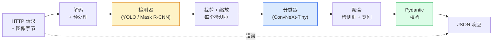

# 构建完整视觉流水线 — 综合实践

> 生产级视觉系统是一条由数据契约串联起来的模型链。本阶段的各个零件已就位；这节综合课将它们端到端地串联起来。

**类型：** 构建
**语言：** Python
**前置知识：** 第4阶段第1-15课
**预计时间：** 约120分钟

## 学习目标

- 设计一个能检测目标、对其分类并输出结构化 JSON 的生产视觉流水线，并处理所有失败路径
- 将检测器（Mask R-CNN 或 YOLO）、分类器（ConvNeXt-Tiny）和数据契约（Pydantic）集成进一个服务
- 对端到端流水线进行基准测试，找出第一个性能瓶颈（通常是预处理，其次是检测器）
- 交付一个最小化的 FastAPI 服务，接受图像上传，运行流水线，并返回带分类的检测结果

## 问题背景

单独的视觉模型是有用的，而视觉产品是多个模型的链条。零售货架审计是一个检测器 + 商品分类器 + 价格 OCR 流水线。自动驾驶是 2D 检测器 + 3D 检测器 + 分割器 + 追踪器 + 规划器。医疗预筛是分割器 + 区域分类器 + 临床 UI。

串联这些链条，是区分 ML 原型和产品的关键所在。模型之间的每个接口都是新的 Bug 温床。每一次坐标变换、每一次归一化、每一次掩码缩放都是悄无声息失败的候选点。流水线的强度取决于其最薄弱的接口。

这节综合课搭建最小可行流水线：检测 + 分类 + 结构化输出 + 服务层。第4阶段的其他一切都可以插入这个骨架：把 Mask R-CNN 换成 YOLOv8、加一个 OCR 头、加一个分割分支、加一个追踪器。架构稳定，组件可插拔。

## 核心概念

### 流水线架构



七个阶段。两个模型阶段代价高昂，其余五个阶段才是 Bug 的藏身之处。

### 用 Pydantic 定义数据契约

每个模型边界都变成一个类型化的对象。这将静默失败变成了响亮的报错。

```
Detection(
    box: tuple[float, float, float, float],   # (x1, y1, x2, y2)，绝对像素坐标
    score: float,                              # [0, 1]
    class_id: int,                             # 来自检测器的标签映射
    mask: Optional[list[list[int]]],           # 若存在则为 RLE 编码
)

PipelineResult(
    image_id: str,
    detections: list[Detection],
    classifications: list[Classification],
    inference_ms: float,
)
```

当检测器以 `(cx, cy, w, h)` 而非 `(x1, y1, x2, y2)` 格式返回框时，Pydantic 会在边界处校验失败并立即报错，而不是让你去调试一个悄无声息返回空区域的下游裁剪步骤。

### 延迟去哪了

几乎每条视觉流水线中都有三个规律：

1. **预处理往往是最大的单一耗时块**。解码 JPEG、颜色空间转换、缩放——这些是 CPU 密集型操作，容易被忽视。
2. **检测器主导 GPU 时间**。70-90% 的 GPU 时间在检测前向传播上。
3. **后处理（NMS、RLE 编码/解码）在 GPU 上便宜，在 CPU 上昂贵**。务必在真实目标设备上分析。

了解延迟分布，才能把优化变成一份有优先级的工作清单。

### 失败模式处理

- **空检测** — 返回空列表，不崩溃。记日志。
- **越界框** — 在裁剪前将坐标钳制到图像尺寸内。
- **过小裁剪** — 跳过小于分类器最小输入的框的分类。
- **损坏上传** — 返回 400 响应和具体错误码，而非 500。
- **模型加载失败** — 在服务启动时失败，而非在第一次请求时。

生产流水线在处理这些情况时，不依赖笼统的 `try/except` 来掩盖失败。每种失败都有一个具名的错误码和响应。

### 批处理

生产服务同时服务多个客户端。将多个请求的检测和分类进行批处理，能成倍提升吞吐量。权衡之处：等待批次填满会增加延迟。典型设置：收集请求最多 20ms，批量处理，分发响应。`torchserve` 和 `triton` 原生支持此功能；负载可预测的小型服务可以自己实现微批处理器。

## 动手实现

### 第一步：数据契约

```python
from pydantic import BaseModel, Field
from typing import List, Optional, Tuple

class Detection(BaseModel):
    box: Tuple[float, float, float, float]
    score: float = Field(ge=0, le=1)
    class_id: int = Field(ge=0)
    mask_rle: Optional[str] = None


class Classification(BaseModel):
    detection_index: int
    class_id: int
    class_name: str
    score: float = Field(ge=0, le=1)


class PipelineResult(BaseModel):
    image_id: str
    detections: List[Detection]
    classifications: List[Classification]
    inference_ms: float
```

五秒写出来的代码，能在任何正式流水线上节省一个小时的调试时间。

### 第二步：最小化 Pipeline 类

```python
import time
import numpy as np
import torch
from PIL import Image

class VisionPipeline:
    def __init__(self, detector, classifier, class_names,
                 device="cpu", min_crop=32):
        self.detector = detector.to(device).eval()
        self.classifier = classifier.to(device).eval()
        self.class_names = class_names
        self.device = device
        self.min_crop = min_crop

    def preprocess(self, image):
        """
        image: PIL.Image 或 np.ndarray (H, W, 3) uint8
        返回: CHW float tensor on device
        """
        if isinstance(image, Image.Image):
            image = np.asarray(image.convert("RGB"))
        tensor = torch.from_numpy(image).permute(2, 0, 1).float() / 255.0
        return tensor.to(self.device)

    @torch.no_grad()
    def detect(self, image_tensor):
        return self.detector([image_tensor])[0]

    @torch.no_grad()
    def classify(self, crops):
        if len(crops) == 0:
            return []
        batch = torch.stack(crops).to(self.device)
        logits = self.classifier(batch)
        probs = logits.softmax(-1)
        scores, cls = probs.max(-1)
        return list(zip(cls.tolist(), scores.tolist()))

    def run(self, image, image_id="anonymous"):
        t0 = time.perf_counter()
        tensor = self.preprocess(image)
        det = self.detect(tensor)

        crops = []
        detections = []
        valid_indices = []
        for i, (box, score, cls) in enumerate(zip(det["boxes"], det["scores"], det["labels"])):
            x1, y1, x2, y2 = [max(0, int(b)) for b in box.tolist()]
            x2 = min(x2, tensor.shape[-1])
            y2 = min(y2, tensor.shape[-2])
            detections.append(Detection(
                box=(x1, y1, x2, y2),
                score=float(score),
                class_id=int(cls),
            ))
            if (x2 - x1) < self.min_crop or (y2 - y1) < self.min_crop:
                continue
            crop = tensor[:, y1:y2, x1:x2]
            crop = torch.nn.functional.interpolate(
                crop.unsqueeze(0),
                size=(224, 224),
                mode="bilinear",
                align_corners=False,
            )[0]
            crops.append(crop)
            valid_indices.append(i)

        class_preds = self.classify(crops)

        classifications = []
        for valid_idx, (cls_id, cls_score) in zip(valid_indices, class_preds):
            classifications.append(Classification(
                detection_index=valid_idx,
                class_id=int(cls_id),
                class_name=self.class_names[cls_id],
                score=float(cls_score),
            ))

        return PipelineResult(
            image_id=image_id,
            detections=detections,
            classifications=classifications,
            inference_ms=(time.perf_counter() - t0) * 1000,
        )
```

每个接口都有类型约束，每条失败路径都有明确的处理决策。

### 第三步：接入检测器和分类器

```python
from torchvision.models.detection import maskrcnn_resnet50_fpn_v2
from torchvision.models import convnext_tiny

# 使用 ImageNet 预训练权重，无需训练即可构成真实的流水线
detector = maskrcnn_resnet50_fpn_v2(weights="DEFAULT")
classifier = convnext_tiny(weights="DEFAULT")
class_names = [f"imagenet_class_{i}" for i in range(1000)]

pipe = VisionPipeline(detector, classifier, class_names)

# 用合成图像做冒烟测试
test_image = (np.random.rand(400, 600, 3) * 255).astype(np.uint8)
result = pipe.run(test_image, image_id="demo")
print(result.model_dump_json(indent=2)[:500])
```

### 第四步：FastAPI 服务

```python
from fastapi import FastAPI, UploadFile, HTTPException
from io import BytesIO

app = FastAPI()
pipe = None  # 在启动时初始化

@app.on_event("startup")
def load():
    global pipe
    detector = maskrcnn_resnet50_fpn_v2(weights="DEFAULT").eval()
    classifier = convnext_tiny(weights="DEFAULT").eval()
    pipe = VisionPipeline(detector, classifier, class_names=[f"c{i}" for i in range(1000)])

@app.post("/detect")
async def detect_endpoint(file: UploadFile):
    if file.content_type not in {"image/jpeg", "image/png", "image/webp"}:
        raise HTTPException(status_code=400, detail="unsupported image type")
    data = await file.read()
    try:
        img = Image.open(BytesIO(data)).convert("RGB")
    except Exception:
        raise HTTPException(status_code=400, detail="cannot decode image")
    result = pipe.run(img, image_id=file.filename or "upload")
    return result.model_dump()
```

运行命令：`uvicorn main:app --host 0.0.0.0 --port 8000`。
测试命令：`curl -F 'file=@dog.jpg' http://localhost:8000/detect`。

### 第五步：流水线基准测试

```python
import time

def benchmark(pipe, num_runs=20, image_size=(400, 600)):
    img = (np.random.rand(*image_size, 3) * 255).astype(np.uint8)
    pipe.run(img)  # 预热

    stages = {"preprocess": [], "detect": [], "classify": [], "total": []}
    for _ in range(num_runs):
        t0 = time.perf_counter()
        tensor = pipe.preprocess(img)
        t1 = time.perf_counter()
        det = pipe.detect(tensor)
        t2 = time.perf_counter()
        crops = []
        for box in det["boxes"]:
            x1, y1, x2, y2 = [max(0, int(b)) for b in box.tolist()]
            x2 = min(x2, tensor.shape[-1])
            y2 = min(y2, tensor.shape[-2])
            if (x2 - x1) >= pipe.min_crop and (y2 - y1) >= pipe.min_crop:
                crop = tensor[:, y1:y2, x1:x2]
                crop = torch.nn.functional.interpolate(
                    crop.unsqueeze(0), size=(224, 224), mode="bilinear", align_corners=False
                )[0]
                crops.append(crop)
        pipe.classify(crops)
        t3 = time.perf_counter()
        stages["preprocess"].append((t1 - t0) * 1000)
        stages["detect"].append((t2 - t1) * 1000)
        stages["classify"].append((t3 - t2) * 1000)
        stages["total"].append((t3 - t0) * 1000)

    for stage, times in stages.items():
        times.sort()
        print(f"{stage:12s}  p50={times[len(times)//2]:7.1f} ms  p95={times[int(len(times)*0.95)]:7.1f} ms")
```

CPU 上的典型输出：预处理约 3ms，检测 300-500ms，分类 20-40ms，总计 350-550ms。GPU 上检测降至 20-40ms，预处理和分类的相对占比开始变得更重要。

## 工程应用

生产模板收敛到相同的结构，此外还有：

- **模型版本管理** — 在响应中始终记录模型名称和权重哈希。
- **按请求追踪 ID** — 记录每个请求每个阶段的耗时，以便关联慢速响应与具体阶段。
- **降级路径** — 若分类器超时，返回无分类的检测结果，而非让整个请求失败。
- **安全过滤器** — NSFW / 个人隐私过滤器在分类后、响应离开服务前运行。
- **批量端点** — 接受图像 URL 列表的 `/detect_batch`，用于批量处理。

用于生产服务的 `torchserve`、`Triton Inference Server` 和 `BentoML` 开箱即提供批处理、版本管理、指标监控和健康检查。对于原型和小规模产品，直接运行 `FastAPI` 完全够用。

## 交付物

本课产出：

- `outputs/prompt-vision-service-shape-reviewer.md` — 一个提示词，审查视觉服务代码中的契约/响应格式违规，并找出第一个破坏性 Bug。
- `outputs/skill-pipeline-budget-planner.md` — 一个技能文件，给定目标延迟和吞吐量，为每个流水线阶段分配时间预算，并标记出哪个阶段会最先超出预算。

## 练习

1. **(简单)** 在任意开放数据集的 10 张图像上运行流水线，报告每个阶段的平均时间以及每张图像检测数量的分布。
2. **(中等)** 在 `Detection` 中添加掩码输出字段，并以 RLE 编码。验证即使对于含 10 个目标的图像，JSON 也保持在 1MB 以内。
3. **(困难)** 在分类器前添加一个微批处理器：收集裁剪区域最多 10ms，一次 GPU 调用完成所有分类，再按请求返回结果。在每秒 5 个并发请求的场景下测量吞吐量提升和新增延迟。

## 关键术语

| 术语 | 常见说法 | 真正含义 |
|------|---------|---------|
| 流水线 (Pipeline) | "这个系统" | 预处理、推理和后处理步骤的有序链条，每对相邻步骤之间有类型化接口 |
| 数据契约 (Data contract) | "Schema" | 每个阶段的输入和输出都必须符合的 Pydantic / dataclass 定义；在边界处捕获集成 Bug |
| 预处理 (Preprocessing) | "模型之前" | 解码、颜色转换、缩放、归一化；通常是最大的 CPU 时间占用 |
| 后处理 (Postprocessing) | "模型之后" | NMS、掩码缩放、阈值过滤、RLE 编码；GPU 上便宜，CPU 上昂贵 |
| 微批处理器 (Microbatcher) | "收集再转发" | 等待固定时间窗口收集多个请求，执行单次批量前向传播的聚合器 |
| 追踪 ID (Trace ID) | "请求 ID" | 在每个阶段记录的按请求标识符，便于追踪慢速请求的端到端路径 |
| 失败码 (Failure code) | "具名错误" | 每类失败都有专属错误码，而非笼统的 500；使客户端能实现重试逻辑 |
| 健康检查 (Health check) | "就绪探针" | 汇报服务是否能响应请求的轻量级端点；负载均衡器依赖此机制 |

## 延伸阅读

- [Full Stack Deep Learning — Deploying Models](https://fullstackdeeplearning.com/course/2022/lecture-5-deployment/) — 生产 ML 部署的经典概览
- [BentoML 文档](https://docs.bentoml.com) — 带批处理、版本管理和指标的服务框架
- [torchserve 文档](https://pytorch.org/serve/) — PyTorch 官方服务库
- [NVIDIA Triton Inference Server](https://developer.nvidia.com/triton-inference-server) — 支持批处理和多模型的高吞吐量服务
