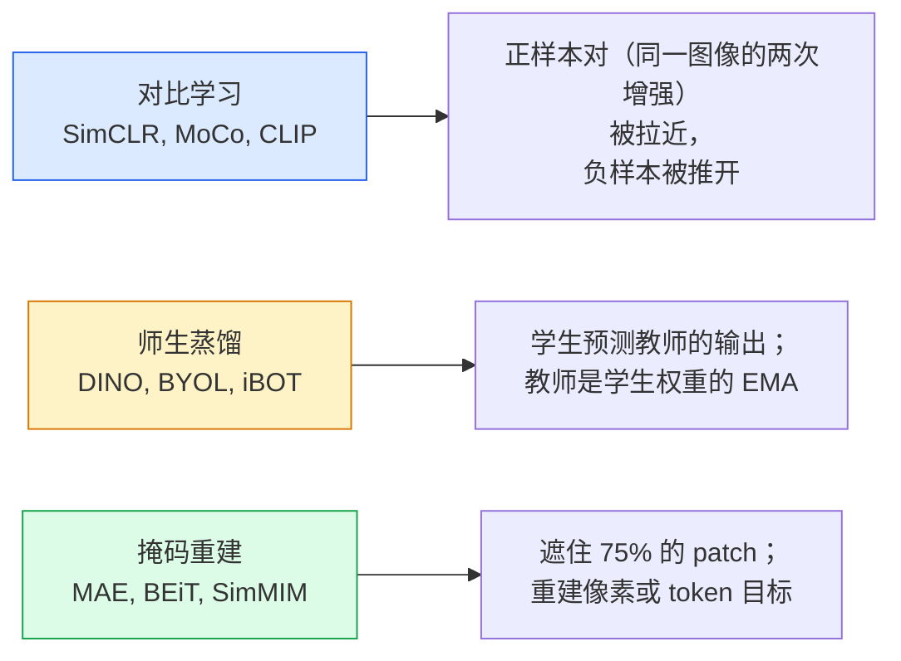

# 自监督视觉 — SimCLR、DINO、MAE

> 标注数据是有监督视觉的瓶颈。自监督预训练消除了这个瓶颈：从1亿张无标注图像中学习视觉特征，再在1万张有标注图像上微调。

**类型：** 学习 + 构建
**语言：** Python
**前置知识：** 第4阶段第4课（图像分类）、第4阶段第14课（ViT）
**预计时间：** 约75分钟

## 学习目标

- 梳理三大自监督学习家族——对比学习（SimCLR）、师生蒸馏（DINO）、掩码重建（MAE）——并说明各自优化的目标
- 从零实现 InfoNCE 损失，并解释为什么 batch size 512 管用而 32 不行
- 解释 MAE 的 75% 掩码率为何不是随意选的，以及它与 BERT 的 15% 文本掩码率有何不同
- 使用 DINOv2 或 MAE ImageNet 检查点进行线性探测和零样本检索

## 问题背景

有监督 ImageNet 有 130 万张标注图像，标注成本估计约 1000 万美元。医疗和工业数据集更小，标注成本更高。每个视觉团队都在追问：能否在廉价无标注数据（YouTube 帧、网络爬取、摄像头画面、卫星图像）上预训练，再在小型标注集上微调？

自监督学习就是答案。在 LAION 或 JFT 上训练的现代自监督 ViT，微调后能达到或超越有监督 ImageNet 的精度。它对下游任务（检测、分割、深度估计）的迁移效果也优于有监督预训练。DINOv2（Meta, 2023）和 MAE（Meta, 2022）是当前可迁移视觉特征的生产默认选项。

核心的思维转变是：**前置任务**（pretext task，即模型被训练去完成的事情）不必和下游任务相同。重要的是它能迫使模型学到有用的特征。预测灰度图的颜色、旋转图像并让模型分类旋转角度、遮住 patch 再重建——这些都有效果。能规模化的三种方法是：对比学习、师生蒸馏和掩码重建。

## 核心概念

### 三大家族



### 对比学习（SimCLR）

取一张图像，进行两次随机增强，得到两个视图。两个视图都经过同一个编码器加投影头。最小化一个损失：要求"这两个嵌入应该相近"，同时"这个嵌入应该远离 batch 中其他所有图像的嵌入"。

```
batch 中 2N 个视图里正样本对 (z_i, z_j) 的损失：

   L_ij = -log( exp(sim(z_i, z_j) / tau) / Σ_{k ≠ i} exp(sim(z_i, z_k) / tau) )

sim = 余弦相似度
tau = 温度参数（标准值 0.1）
```

这就是 InfoNCE 损失。每个正样本需要大量负样本，因此 batch size 至关重要——SimCLR 需要 512-8192。MoCo 引入了过去 batch 的动量队列，将负样本数量与 batch size 解耦。

### 师生蒸馏（DINO）

两个架构相同的网络：学生和教师。教师是学生权重的指数移动平均（EMA）。两者都看到图像的增强视图。训练学生输出匹配教师的输出——不需要显式负样本。

```
loss = CE( student_output(view_1),  teacher_output(view_2) )
     + CE( student_output(view_2),  teacher_output(view_1) )

teacher_weights = m * teacher_weights + (1 - m) * student_weights   (m ≈ 0.996)
```

为何不会坍缩为"预测常数"：教师的输出经过了中心化（减去每个维度的均值）和锐化（除以小温度值）。中心化防止某个维度主导；锐化防止输出坍缩为均匀分布。

DINO 就是 DINOv2 在 1.42 亿张精心筛选的图像上所放大的方法。得到的特征在零样本视觉检索和密集预测方面是当前的 SOTA。

### 掩码重建（MAE）

遮住 ViT 输入中 75% 的 patch，只将可见的 25% 送入编码器。小型解码器接收编码器输出加上被遮位置的 mask token，并被训练来重建被遮 patch 的像素。

```
编码器:  可见的 25% patch -> 特征
解码器:  特征 + 被遮位置的 mask token -> 重建像素
损失:     仅在被遮 patch 上计算重建像素与原始像素的 MSE
```

让 MAE 有效的关键设计选择：

- **75% 掩码率** — 很高。迫使编码器学习语义特征；重建 25% 本来近乎无意义（相邻像素的相关性很强，CNN 可以轻松做到）。
- **非对称编码器/解码器** — 大型 ViT 编码器只看可见 patch；小型解码器（8层，512维）处理重建。预训练速度比朴素 BEiT 快 3 倍。
- **像素空间重建目标** — 比 BEiT 的 token 化目标更简单，在 ViT 上效果更好。

预训练后，丢弃解码器，编码器就是特征提取器。

### 为什么是 75% 而不是 15%

BERT 遮住 15% 的 token，MAE 遮住 75%。差异来自信息密度。

- 自然语言每个 token 熵值高。预测 15% 的 token 仍然困难，因为每个被遮位置有很多合理的补全选项。
- 图像 patch 熵值低——未遮住的邻域通常几乎可以精确决定被遮 patch 的像素。要让预测任务需要语义理解，就必须激进地遮住更多区域。

75% 足够高，使得简单的空间外推无法完成任务；编码器必须表征图像内容。

### 线性探测评估

自监督预训练结束后，标准评估方式是**线性探测**：冻结编码器，在其上层训练一个单一的线性分类器用于 ImageNet 标签。报告 top-1 精度。

- SimCLR ResNet-50：约 71%（2020年）
- DINO ViT-S/16：约 77%（2021年）
- MAE ViT-L/16：约 76%（2022年）
- DINOv2 ViT-g/14：约 86%（2023年）

线性探测是特征质量的纯粹衡量；微调通常再提升 2-5 个点，但也混入了头部重新训练的影响。

## 动手实现

### 第一步：双视图增强流水线

```python
import torch
import torchvision.transforms as T

two_view_train = lambda: T.Compose([
    T.RandomResizedCrop(96, scale=(0.2, 1.0)),
    T.RandomHorizontalFlip(),
    T.ColorJitter(0.4, 0.4, 0.4, 0.1),
    T.RandomGrayscale(p=0.2),
    T.ToTensor(),
])


class TwoViewDataset(torch.utils.data.Dataset):
    def __init__(self, base):
        self.base = base
        self.aug = two_view_train()

    def __len__(self):
        return len(self.base)

    def __getitem__(self, i):
        img, _ = self.base[i]
        v1 = self.aug(img)
        v2 = self.aug(img)
        return v1, v2
```

每次 `__getitem__` 返回同一图像的两个增强视图；不需要标签。

### 第二步：InfoNCE 损失

```python
import torch.nn.functional as F

def info_nce(z1, z2, tau=0.1):
    """
    z1, z2: (N, D) L2 归一化的配对视图嵌入
    """
    N, D = z1.shape
    z = torch.cat([z1, z2], dim=0)  # (2N, D)
    sim = z @ z.T / tau              # (2N, 2N)

    mask = torch.eye(2 * N, dtype=torch.bool, device=z.device)
    sim = sim.masked_fill(mask, float("-inf"))

    targets = torch.cat([torch.arange(N, 2 * N), torch.arange(0, N)]).to(z.device)
    return F.cross_entropy(sim, targets)
```

调用前先对嵌入做 L2 归一化。`tau=0.1` 是 SimCLR 的默认值；温度越低，损失越尖锐，需要更多负样本。

### 第三步：InfoNCE 健全性检验

```python
z1 = F.normalize(torch.randn(16, 32), dim=-1)
z2 = z1.clone()
loss_same = info_nce(z1, z2, tau=0.1).item()
z2_random = F.normalize(torch.randn(16, 32), dim=-1)
loss_random = info_nce(z1, z2_random, tau=0.1).item()
print(f"InfoNCE with identical pairs:  {loss_same:.3f}")
print(f"InfoNCE with random pairs:     {loss_random:.3f}")
```

完全相同的配对应给出较低的损失（大 batch 和低温度下接近 0）。随机配对应给出约 log(2N-1) = log(31) ≈ 3.4（16 对的 batch）。

### 第四步：MAE 风格的随机遮掩

```python
def random_mask_indices(num_patches, mask_ratio=0.75, seed=0):
    g = torch.Generator().manual_seed(seed)
    n_keep = int(num_patches * (1 - mask_ratio))
    perm = torch.randperm(num_patches, generator=g)
    visible = perm[:n_keep]
    masked = perm[n_keep:]
    return visible.sort().values, masked.sort().values


num_patches = 196
visible, masked = random_mask_indices(num_patches, mask_ratio=0.75)
print(f"visible: {len(visible)} / {num_patches}")
print(f"masked:  {len(masked)} / {num_patches}")
```

简单、快速、对给定 seed 确定性。真实的 MAE 实现会对此进行批量处理，并保留每个样本的独立掩码。

## 工程应用

DINOv2 是 2026 年的生产标准：

```python
import torch
from transformers import AutoImageProcessor, AutoModel

processor = AutoImageProcessor.from_pretrained("facebook/dinov2-base")
model = AutoModel.from_pretrained("facebook/dinov2-base")
model.eval()

# 用于零样本检索的逐图像嵌入
with torch.no_grad():
    inputs = processor(images=[pil_image], return_tensors="pt")
    outputs = model(**inputs)
    embedding = outputs.last_hidden_state[:, 0]  # CLS token
```

得到的 768 维嵌入是现代图像检索、密集对应和零样本迁移流水线的骨干。下游任务微调通常只需要一个线性头。

对于图像-文本嵌入，使用 SigLIP 或 OpenCLIP；对于 MAE 风格的微调，`timm` 库提供所有 MAE 检查点。

## 交付物

本课产出：

- `outputs/prompt-ssl-pretraining-picker.md` — 一个提示词，根据数据集大小、计算资源和下游任务，在 SimCLR / MAE / DINOv2 之间做出选择。
- `outputs/skill-linear-probe-runner.md` — 一个技能文件，为任意冻结编码器 + 有标注数据集编写线性探测评估代码。

## 练习

1. **(简单)** 验证对于对齐良好的嵌入，降低温度会降低 InfoNCE 损失；对于随机嵌入，降低温度会升高损失。绘制 `tau ∈ [0.05, 0.1, 0.2, 0.5]` vs 损失的曲线图。
2. **(中等)** 实现一个 DINO 风格的中心缓冲区。证明没有中心化时，学生在几个 epoch 内就会坍缩为常数向量。
3. **(困难)** 使用第10课的 TinyUNet 作为骨干，在 CIFAR-100 上训练 MAE。报告 10、50 和 200 个 epoch 时的线性探测精度。证明 MAE 预训练后的线性探测优于在同一个 1000 张图像子集上从头训练的有监督线性探测。

## 关键术语

| 术语 | 常见说法 | 真正含义 |
|------|---------|---------|
| 自监督 (Self-supervised) | "无标签学习" | 利用无标注数据生成有用表示的前置任务 |
| 前置任务 (Pretext task) | "假任务" | SSL 期间使用的训练目标（重建 patch、匹配视图）；预训练后丢弃 |
| 线性探测 (Linear probe) | "冻结编码器 + 线性头" | SSL 的标准评估：只在冻结特征上训练一个线性分类器 |
| InfoNCE | "对比损失" | 基于余弦相似度的 softmax；正样本对是目标类，其他所有都是负样本 |
| EMA 教师 (EMA teacher) | "移动平均教师" | 权重是学生权重的指数移动平均的教师网络；BYOL、MoCo、DINO 均使用 |
| 掩码率 (Mask ratio) | "被遮住的 patch 比例" | MAE 中被遮掩的 patch 比例；视觉 75%，文本 15% |
| 表示坍缩 (Representation collapse) | "输出恒为常数" | SSL 失败模式：编码器对所有输入输出相同的常数向量；通过中心化、锐化或负样本来预防 |
| DINOv2 | "生产级 SSL 骨干" | Meta 2023 年的自监督 ViT；2026 年最强的通用图像特征 |

## 延伸阅读

- [SimCLR (Chen et al., 2020)](https://arxiv.org/abs/2002.05709) — 对比学习参考论文
- [DINO (Caron et al., 2021)](https://arxiv.org/abs/2104.14294) — 带动量、中心化和锐化的师生蒸馏
- [MAE (He et al., 2022)](https://arxiv.org/abs/2111.06377) — ViT 的掩码自编码器预训练
- [DINOv2 (Oquab et al., 2023)](https://arxiv.org/abs/2304.07193) — 将自监督 ViT 扩展到生产级特征
