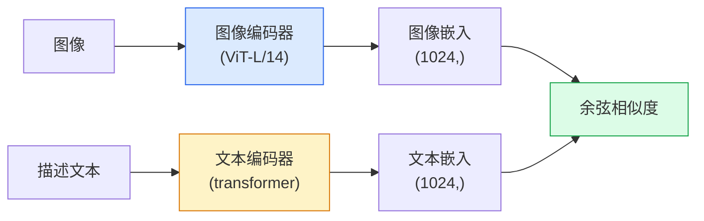

# 开放词汇视觉 — CLIP

> 联合训练一个图像编码器和一个文本编码器，使匹配的（图像, 描述）对落在共享空间的同一位置。这就是全部的技巧所在。

**类型：** 构建 + 使用
**语言：** Python
**前置知识：** 第4阶段第14课（ViT）、第4阶段第17课（自监督学习）
**预计时间：** 约45分钟

## 学习目标

- 解释 CLIP 的双塔架构和对比训练目标
- 使用预训练的 CLIP（或 SigLIP）进行零样本分类，无需任何任务特定训练
- 从零实现零样本分类：编码类别提示词、计算余弦相似度、取 argmax
- 区分 CLIP、SigLIP、OpenCLIP 和 LLaVA/LLaMA-vision 模型——各自在 2026 年的用途

## 问题背景

传统分类器是封闭词汇的：一个 1000 类 ImageNet 模型只能预测 1000 个标签。每增加一个新类别就需要有标注数据和重新训练的分类头。

CLIP（Radford et al., OpenAI 2021）证明，在从网络爬取的 4 亿（图像, 描述）对上训练，能产生一个在推理时可以分类到任意类别集合的模型，这些类别仅用自然语言描述。写一句话就能给它添加一个新类别。

这种能力——**零样本迁移**——正是所有现代视觉系统都从 CLIP 系列检查点出发的原因。检测（Grounding DINO、OWL-ViT）、分割（CLIPSeg、SAM）、检索、内容审核、VLM 和文生图，全都建立在 CLIP 风格的联合嵌入之上。

## 核心概念

### 双塔架构



两个编码器都以一个线性投影层结尾，将输出映射到相同的嵌入维度（CLIP-B/32 为 512，CLIP-L/14 为 1024）。L2 归一化后计算余弦相似度。

### 训练目标

给定一个 N 个（图像, 描述）对组成的 batch，构建一个 N×N 的相似度矩阵。训练两个编码器，使对角线（匹配对）相似度高，非对角线（不匹配）相似度低。

```
sim_matrix = image_embeddings @ text_embeddings.T / tau

loss_i2t = cross_entropy(sim_matrix,   targets=arange(N))
loss_t2i = cross_entropy(sim_matrix.T, targets=arange(N))
loss = (loss_i2t + loss_t2i) / 2
```

对称设计，因为图像到文本和文本到图像的检索都应该能工作。`tau`（温度）通常是可学习的标量参数，初始化为 0.07。

### SigLIP：更好的损失函数

SigLIP（Zhai et al., 2023）用逐对 sigmoid 替换了 softmax：

```
loss = mean over pairs of log(1 + exp(-y_ij * sim_ij))
y_ij = +1 若匹配，-1 否则
```

逐对损失去掉了 CLIP 需要的 batch 级归一化。SigLIP 在小 batch size 下训练效果更好，在相同数据量下与 CLIP 持平或更优。

### 零样本分类

给定一个训练好的 CLIP：

1. 为每个类别构造提示词："a photo of a {class}"。
2. 用文本编码器编码所有类别提示词 → `T`，形状 (C, d)。
3. 编码测试图像 → `I`，形状 (1, d)。
4. 相似度 = `I @ T.T`，形状 (1, C)。
5. Argmax → 预测类别。

提示词工程很重要。OpenAI 为 ImageNet 发布了 80 个提示词模板（"a photo of a {}"、"a blurry photo of a {}"、"a sketch of a {}"……）。对每个类别的所有模板嵌入取平均，可以额外获得 1-3% 的 top-1 精度提升。

### 2026 年 CLIP 系列模型的应用场景

- **零样本分类** — 直接使用。
- **图像检索** — 一次性编码所有图像，推理时嵌入查询。
- **文本条件检测** — Grounding DINO、OWL-ViT 将 CLIP 文本塔包裹在检测器外面。
- **文本条件分割** — CLIPSeg；SAM 通过 CLIP 接受文本提示输入。
- **VLM** — LLaVA、Qwen-VL、InternVL 将 CLIP 系列视觉编码器接入 LLM。
- **文生图** — Stable Diffusion、DALL-E 3 以 CLIP 文本嵌入为条件。

一旦拥有共享嵌入空间，每项视觉+语言任务都变成了距离计算。

## 动手实现

### 第一步：微型双塔模型

真实的 CLIP 是 ViT + transformer。本课的双塔是作用于预提取特征的小型 MLP，使训练信号在 CPU 上也清晰可见。

```python
import torch
import torch.nn as nn
import torch.nn.functional as F


class TwoTower(nn.Module):
    def __init__(self, img_in=128, txt_in=64, emb=64):
        super().__init__()
        self.image_proj = nn.Sequential(nn.Linear(img_in, 128), nn.ReLU(), nn.Linear(128, emb))
        self.text_proj = nn.Sequential(nn.Linear(txt_in, 128), nn.ReLU(), nn.Linear(128, emb))
        self.logit_scale = nn.Parameter(torch.ones([]) * 2.6592)  # ln(1/0.07)

    def forward(self, img_feats, txt_feats):
        i = F.normalize(self.image_proj(img_feats), dim=-1)
        t = F.normalize(self.text_proj(txt_feats), dim=-1)
        return i, t, self.logit_scale.exp()
```

两个投影层，共享维度输出，可学习温度。形状与真实 CLIP API 完全相同。

### 第二步：对比损失

```python
def clip_loss(image_emb, text_emb, logit_scale):
    N = image_emb.size(0)
    sim = logit_scale * image_emb @ text_emb.T
    targets = torch.arange(N, device=sim.device)
    l_i = F.cross_entropy(sim, targets)
    l_t = F.cross_entropy(sim.T, targets)
    return (l_i + l_t) / 2
```

对称设计。`logit_scale` 越高 = softmax 越尖锐 = 更自信，但有不稳定风险。

### 第三步：零样本分类器

```python
@torch.no_grad()
def zero_shot_classify(model, image_feats, class_text_feats, class_names):
    """
    image_feats:      (N, img_in)
    class_text_feats: (C, txt_in)   每个类别一个平均嵌入
    """
    i = F.normalize(model.image_proj(image_feats), dim=-1)
    t = F.normalize(model.text_proj(class_text_feats), dim=-1)
    sim = i @ t.T
    pred = sim.argmax(dim=-1)
    return [class_names[p] for p in pred.tolist()]
```

每步一行代码。这正是使用生产级 CLIP 检查点时的完整零样本流程。

### 第四步：健全性检验

```python
torch.manual_seed(0)
model = TwoTower()

img = torch.randn(8, 128)
txt = torch.randn(8, 64)
i, t, scale = model(img, txt)
loss = clip_loss(i, t, scale)
print(f"batch size: {i.size(0)}   loss: {loss.item():.3f}")
```

对于随机初始化的模型，损失应接近 `log(N) = log(8) = 2.08`——这是还没学到任何结构时对称交叉熵的期望值。

## 工程应用

OpenCLIP 是 2026 年的社区默认选择：

```python
import open_clip
import torch
from PIL import Image

model, _, preprocess = open_clip.create_model_and_transforms("ViT-B-32", pretrained="laion2b_s34b_b79k")
tokenizer = open_clip.get_tokenizer("ViT-B-32")

image = preprocess(Image.open("dog.jpg")).unsqueeze(0)
text = tokenizer(["a photo of a dog", "a photo of a cat", "a photo of a car"])

with torch.no_grad():
    image_features = model.encode_image(image)
    text_features = model.encode_text(text)
    image_features = image_features / image_features.norm(dim=-1, keepdim=True)
    text_features = text_features / text_features.norm(dim=-1, keepdim=True)
    probs = (100.0 * image_features @ text_features.T).softmax(dim=-1)

print(probs)
```

SigLIP 是更新的选择，在小规模下训练效果更好，是新项目的首选：`google/siglip-base-patch16-224`。Hugging Face 提供两者的托管。

## 交付物

本课产出：

- `outputs/prompt-zero-shot-class-picker.md` — 一个提示词，根据给定的类别列表和领域，为零样本 CLIP 设计类别模板。
- `outputs/skill-image-text-retriever.md` — 一个技能文件，使用任意 CLIP 检查点构建图像嵌入索引，支持文本查询和图像查询。

## 练习

1. **(简单)** 使用预训练的 OpenCLIP ViT-B/32，用 80 个提示词模板集合在 CIFAR-10 上进行零样本分类。报告 top-1 精度；应在 85-90% 左右。
2. **(中等)** 在相同的 CIFAR-10 任务上比较单模板（"a photo of a {}"）与 80 模板平均嵌入的效果。量化差距并解释为何多模板有帮助。
3. **(困难)** 构建一个零样本图像检索索引：用 CLIP 嵌入 1000 张图像，建立 FAISS 索引，用自然语言描述进行查询。报告 20 个手写查询的检索 recall@5。

## 关键术语

| 术语 | 常见说法 | 真正含义 |
|------|---------|---------|
| 双塔 (Two-tower) | "双编码器" | 独立的图像编码器和文本编码器，末尾都接同维投影头 |
| 零样本 (Zero-shot) | "无需任务特定训练" | 在推理时将图像分类到仅用文本描述的类别中，不接触任何标签 |
| 温度/logit_scale | "tau" | 可学习标量，在 softmax 前缩放相似度矩阵 |
| 提示词模板 (Prompt template) | "a photo of a {}" | 包裹类别名称的自然语言框架；平均多个模板可提升零样本精度 |
| CLIP | "图像+文本模型" | OpenAI 2021 年的模型；2026 年该领域的通用语 |
| SigLIP | "Sigmoid CLIP" | 将 softmax 替换为逐对 sigmoid；在小 batch 下训练效果更好 |
| OpenCLIP | "开源复现" | 在 LAION 上训练的社区 CLIP 变体；开源流水线的生产默认选项 |
| VLM | "视觉语言模型" | CLIP 系列编码器 + LLM，训练后可回答关于图像的问题 |

## 延伸阅读

- [CLIP: Learning Transferable Visual Models from Natural Language Supervision (Radford et al., 2021)](https://arxiv.org/abs/2103.00020)
- [SigLIP: Sigmoid Loss for Language-Image Pre-Training (Zhai et al., 2023)](https://arxiv.org/abs/2303.15343)
- [OpenCLIP](https://github.com/mlfoundations/open_clip) — 社区代码库
- [DINOv2 vs CLIP vs MAE: a features comparison](https://huggingface.co/blog/dinov2) — Hugging Face 并排对比各用例的指南
