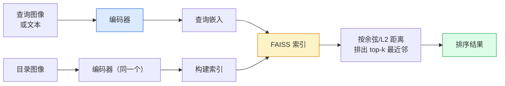

# 图像检索与度量学习

> 检索系统按嵌入空间中的距离对候选项排序。度量学习（Metric Learning）是塑造这个空间的学科，让距离的含义符合你的预期。

**类型：** 构建
**语言：** Python
**前置知识：** 第4阶段第14课（ViT）、第4阶段第18课（CLIP）
**预计时间：** 约45分钟

## 学习目标

- 解释三元组损失、对比损失和基于代理的度量学习损失，并为给定数据集选择合适的损失
- 正确实现 L2 归一化和余弦相似度，并审查"相同实例"检索与"相同类别"检索的区别
- 构建 FAISS 索引，按文本和图像查询，并报告保留查询集的 recall@K
- 使用 DINOv2、CLIP 和 SigLIP 作为开箱即用的嵌入骨干，并了解各自的适用场景

## 问题背景

检索在生产视觉系统中无处不在：重复检测、反向图像搜索、视觉搜索（"寻找相似商品"）、人脸重识别、监控中的行人重识别、电商的实例级匹配。产品问题始终相同："给定这张查询图像，在我的目录中排序。"

两个设计决策决定整个系统的面貌：**嵌入**——哪个模型产生向量；**索引**——如何在规模化场景下寻找最近邻。到 2026 年两者都是商品化的（DINOv2 做嵌入，FAISS 做索引），这使难度提升了：真正的挑战在于定义*什么算相似*，然后塑造嵌入空间使距离与之匹配。

这个塑造过程就是度量学习，一个不大但高杠杆的学科。

## 核心概念

### 检索系统全景



### 四大损失家族

| 损失 | 需要什么 | 优点 | 缺点 |
|------|---------|------|------|
| **对比损失** | (锚点, 正样本) + 负样本 | 简单，适用于任何配对标签 | 没有大量负样本时收敛慢 |
| **三元组损失** | (锚点, 正样本, 负样本) | 直观；可直接控制间隔 | 困难三元组挖掘代价高 |
| **NT-Xent / InfoNCE** | 配对 + batch 内挖掘负样本 | 可扩展到大 batch | 需要大 batch 或动量队列 |
| **基于代理（ProxyNCA）** | 仅需类别标签 | 快速稳定，无需挖掘 | 在小数据集上可能对代理过拟合 |

对于大多数生产用例，从预训练骨干出发，只有当开箱即用的嵌入在你的测试集上表现不足时，才额外加度量学习微调。

### 三元组损失的正式定义

```
L = max(0, ||f(a) - f(p)||² - ||f(a) - f(n)||² + margin)
```

将锚点 `a` 拉近正样本 `p`，推离负样本 `n`，`margin` 保证两者之间有一个间隙。三图像结构可推广到任意相似度排序。

**挖掘至关重要**：容易的三元组（`n` 已经离 `a` 很远）贡献零损失；只有困难三元组才能教会网络。半困难挖掘（`n` 比 `p` 更远但在 margin 范围内）是 2016 年 FaceNet 的方案，至今仍占主导地位。

### 余弦相似度 vs L2

两种度量，两种约定：

- **余弦**：向量之间的角度。需要 L2 归一化后的嵌入。
- **L2**：欧几里得距离。适用于原始或归一化嵌入，通常配合 L2 归一化 + 平方 L2 使用。

对于大多数现代网络，两者等价：当 `||a|| = ||b|| = 1` 时，`||a - b||² = 2 - 2 cos(a, b)`。选择与你的嵌入训练方式匹配的约定；混用它们会悄无声息地改变"最近"的含义。

### Recall@K

标准检索指标：

```
recall@K = 至少有一个正确匹配出现在 top K 结果中的查询比例
```

并排报告 recall@1、@5、@10。recall@10 高于 0.95 但 recall@1 低于 0.5，意味着嵌入空间结构正确但排序有噪声——尝试更长的微调或重排序步骤。

对于重复检测，precision@K 更重要，因为每个假阳性都是用户可见的错误。对于视觉搜索，recall@K 是产品指标。

### FAISS 一段话讲清楚

Facebook AI Similarity Search，最近邻搜索的事实标准库。三种索引选择：

- `IndexFlatIP` / `IndexFlatL2` — 暴力精确搜索，无需训练。适用于最多约 100 万向量。
- `IndexIVFFlat` — 分区到 K 个单元，只搜索最近的几个单元。近似，速度快，需要训练数据。
- `IndexHNSW` — 基于图的索引，多查询时最快，但索引体积大。

10 万向量时用 `IndexFlatIP` 做余弦相似度。1000 万时用 `IndexIVFFlat`。1 亿以上配合乘积量化（`IndexIVFPQ`）。

### 实例级检索 vs 类别级检索

同一个名字下的两个截然不同的问题：

- **类别级** — "在我的目录中找猫"。类条件相似度；开箱即用的 CLIP / DINOv2 嵌入效果良好。
- **实例级** — "在我的目录中找*这个确切商品*"。需要对同类别视觉相似物体做细粒度区分；开箱即用嵌入表现不足；度量学习微调很重要。

在选模型之前先确认自己在解决哪个问题。

## 动手实现

### 第一步：三元组损失

```python
import torch
import torch.nn.functional as F

def triplet_loss(anchor, positive, negative, margin=0.2):
    d_ap = F.pairwise_distance(anchor, positive, p=2)
    d_an = F.pairwise_distance(anchor, negative, p=2)
    return F.relu(d_ap - d_an + margin).mean()
```

一行代码。适用于 L2 归一化或原始嵌入。

### 第二步：半困难样本挖掘

给定一个 batch 的嵌入和标签，为每个锚点找到最困难的半困难负样本。

```python
def semi_hard_negatives(emb, labels, margin=0.2):
    dist = torch.cdist(emb, emb)
    same_class = labels[:, None] == labels[None, :]
    diff_class = ~same_class
    N = emb.size(0)

    positives = dist.clone()
    positives[~same_class] = float("-inf")
    positives.fill_diagonal_(float("-inf"))
    pos_idx = positives.argmax(dim=1)

    semi_hard = dist.clone()
    semi_hard[same_class] = float("inf")
    d_ap = dist[torch.arange(N), pos_idx].unsqueeze(1)
    semi_hard[dist <= d_ap] = float("inf")
    neg_idx = semi_hard.argmin(dim=1)

    fallback_mask = semi_hard[torch.arange(N), neg_idx] == float("inf")
    if fallback_mask.any():
        hardest = dist.clone()
        hardest[same_class] = float("inf")
        neg_idx = torch.where(fallback_mask, hardest.argmin(dim=1), neg_idx)
    return pos_idx, neg_idx
```

每个锚点获得类内最难的正样本，以及比正样本更远但在 margin 范围内的半困难负样本。

### 第三步：Recall@K

```python
def recall_at_k(query_emb, gallery_emb, query_labels, gallery_labels, k=1):
    sim = query_emb @ gallery_emb.T
    _, top_k = sim.topk(k, dim=-1)
    matches = (gallery_labels[top_k] == query_labels[:, None]).any(dim=-1)
    return matches.float().mean().item()
```

L2 归一化嵌入上的内积 top-k 等价于余弦 top-k。报告至少有一个正确邻居的查询比例。

### 第四步：整体串联

```python
import torch
import torch.nn as nn
from torch.optim import Adam

class Encoder(nn.Module):
    def __init__(self, in_dim=128, emb_dim=64):
        super().__init__()
        self.net = nn.Sequential(
            nn.Linear(in_dim, 128), nn.ReLU(),
            nn.Linear(128, emb_dim),
        )

    def forward(self, x):
        return F.normalize(self.net(x), dim=-1)

torch.manual_seed(0)
num_classes = 6
protos = F.normalize(torch.randn(num_classes, 128), dim=-1)

def sample_batch(bs=32):
    labels = torch.randint(0, num_classes, (bs,))
    x = protos[labels] + 0.15 * torch.randn(bs, 128)
    return x, labels

enc = Encoder()
opt = Adam(enc.parameters(), lr=3e-3)

for step in range(200):
    x, y = sample_batch(32)
    emb = enc(x)
    pos_idx, neg_idx = semi_hard_negatives(emb, y)
    loss = triplet_loss(emb, emb[pos_idx], emb[neg_idx])
    opt.zero_grad(); loss.backward(); opt.step()
```

几百步之后，嵌入聚类会形成每个类别一个集群。

## 工程应用

2026 年的生产方案：

- **DINOv2 + FAISS** — 通用视觉检索，开箱即用。
- **CLIP + FAISS** — 当查询为文本时。
- **微调 DINOv2 + FAISS** — 实例级检索、人脸重识别、时尚、电商。
- **Milvus / Weaviate / Qdrant** — 封装 FAISS 或 HNSW 的托管向量数据库。

实例级检索的 SOTA 方案：DINOv2 骨干，添加嵌入头，用实例标注的配对数据以三元组损失或 InfoNCE 微调，在 FAISS 中建索引。

## 交付物

本课产出：

- `outputs/prompt-retrieval-loss-picker.md` — 一个提示词，为给定的检索问题选择三元组损失 / InfoNCE / ProxyNCA。
- `outputs/skill-recall-at-k-runner.md` — 一个技能文件，编写带 train/val/gallery 划分和正确数据契约的干净 recall@K 评估框架。

## 练习

1. **(简单)** 运行上面的玩具示例，用 PCA 可视化训练前后的嵌入，观察六个集群的形成过程。
2. **(中等)** 添加 ProxyNCA 损失实现：每个类别一个可学习的"代理"，对代理余弦相似度做标准交叉熵。比较与三元组损失在玩具数据上的收敛速度。
3. **(困难)** 取 1000 张 ImageNet 验证图像，通过 HuggingFace 用 DINOv2 嵌入，构建 FAISS flat 索引，并报告以相同图像为查询的 recall@{1, 5, 10}（应为 1.0），以及以 ImageNet 标签为真值的保留划分上的 recall@{1, 5, 10}。

## 关键术语

| 术语 | 常见说法 | 真正含义 |
|------|---------|---------|
| 度量学习 (Metric learning) | "塑造空间" | 训练编码器，使输出空间中的距离反映目标相似性 |
| 三元组损失 (Triplet loss) | "拉近推远" | L = max(0, d(a,p) - d(a,n) + margin)；经典度量学习损失 |
| 半困难挖掘 (Semi-hard mining) | "有用的负样本" | 比锚点与正样本的距离更远但在 margin 范围内的负样本；经验上信息量最大 |
| 基于代理的损失 (Proxy-based loss) | "类原型" | 每类一个可学习代理；对代理相似度取交叉熵；无需配对挖掘 |
| Recall@K | "top-K 命中率" | 至少有一个正确结果出现在 top K 中的查询比例 |
| 实例级检索 (Instance retrieval) | "找这个确切的东西" | 细粒度匹配；开箱即用特征通常表现不足 |
| FAISS | "最近邻库" | Facebook 的近邻搜索库；支持精确和近似索引 |
| HNSW | "图索引" | 层次化可导航小世界；快速近似最近邻，内存开销小 |

## 延伸阅读

- [FaceNet: A Unified Embedding for Face Recognition (Schroff et al., 2015)](https://arxiv.org/abs/1503.03832) — 三元组损失 / 半困难挖掘论文
- [In Defense of the Triplet Loss for Person Re-Identification (Hermans et al., 2017)](https://arxiv.org/abs/1703.07737) — 三元组微调实践指南
- [FAISS 文档](https://github.com/facebookresearch/faiss/wiki) — 每种索引及其权衡
- [SMoT: Metric Learning Taxonomy (Kim et al., 2021)](https://arxiv.org/abs/2010.06927) — 现代损失及其联系的综述
