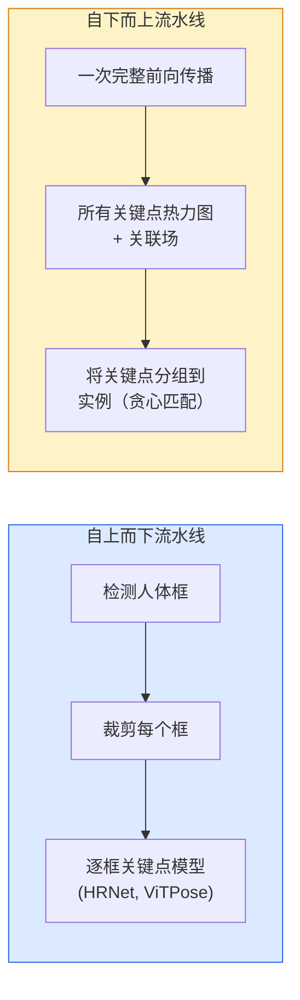

# 关键点检测与姿态估计

> 姿态是一组有序的关键点。关键点检测器是一个热力图回归器。其他一切都是记账工作。

**类型：** 构建
**语言：** Python
**前置知识：** 第4阶段第6课（目标检测）、第4阶段第7课（U-Net）
**预计时间：** 约45分钟

## 学习目标

- 区分自上而下和自下而上的姿态估计方法，并说明各自的适用场景
- 以每个关键点的高斯目标回归 K 个关键点的热力图，并在推理时提取关键点坐标
- 解释部件亲和场（PAF）以及自下而上流水线如何将关键点关联到实例
- 使用 MediaPipe Pose 或 MMPose 进行生产级关键点估计，并理解其输出格式

## 问题背景

关键点任务以各种名称出现：人体姿态（17 个身体关节）、面部特征点（68 或 478 个点）、手部（21 个点）、动物姿态、机器人物体姿态、医学解剖特征点。它们都有相同的结构：检测物体上 K 个离散点并输出其 (x, y) 坐标。

姿态估计是动作捕捉、健身应用、体育分析、手势控制、动画制作、AR 试穿和机器人抓取的基础。2D 情形已经成熟；3D 姿态估计（从单个相机估计关节在世界坐标中的位置）是当前的研究前沿。

工程问题在于规模。单张图像、单人姿态是一个 20ms 的问题。拥挤场景中 30fps 的多人姿态是另一个问题，需要不同的架构。

## 核心概念

### 自上而下 vs 自下而上



- **自上而下** — 先检测人体，再对每个裁剪区域运行单人关键点模型。精度最高；随人数线性扩展。
- **自下而上** — 单次前向传播预测所有关键点加关联场，再分组。无论人数多少，时间恒定。

自上而下（HRNet、ViTPose）是精度领先者；自下而上（OpenPose、HigherHRNet）是拥挤场景的吞吐量领先者。

### 热力图回归

不直接回归 `(x, y)`，而是为每个关键点预测一张 `H×W` 热力图，在真实位置处有一个高斯峰。

```
target[k, y, x] = exp(-((x - cx_k)² + (y - cy_k)²) / (2σ²))
```

推理时，每张热力图的 argmax 就是预测的关键点位置。

热力图比直接回归效果更好的原因：网络的空间结构（卷积特征图）与空间输出天然对齐。高斯目标也有正则化效果——小的定位误差产生小的损失，而不是零。

### 亚像素定位

argmax 给出整数坐标。对于亚像素精度，可以对 argmax 及其邻域拟合抛物线进行细化，或使用常用的偏移量公式 `(dx, dy) = 0.25 * (heatmap[y, x+1] - heatmap[y, x-1], ...)`。

### 部件亲和场（PAF）

OpenPose 自下而上关联的关键技巧。对于每对相连的关键点（例如左肩到左肘），预测一个 2 通道场，编码从一个点指向另一个点的单位向量。将肩与肘关联时，对连接候选配对的直线上积分 PAF；积分最大的配对即为匹配结果。

```
对于每个连接（肢体）：
  PAF 通道数：2（单位向量 x, y）
  线积分：对采样点求和 (PAF · 线方向)
  积分越大 = 匹配越强
```

优雅，且无需逐人裁剪即可扩展到任意人群规模。

### COCO 关键点

标准人体姿态数据集：每人 17 个关键点，PCK（正确关键点百分比）和 OKS（物体关键点相似度）作为指标。OKS 是 IoU 的关键点类比，COCO mAP@OKS 报告的就是这个指标。

### 2D vs 3D

- **2D 姿态** — 图像坐标；在生产质量上已解决（MediaPipe、HRNet、ViTPose）。
- **3D 姿态** — 世界/相机坐标；仍是活跃研究方向。常见方法：
  - 用小型 MLP 将 2D 预测提升到 3D（VideoPose3D）。
  - 从图像直接进行 3D 回归（PyMAF、MHFormer）。
  - 多视角设置（CMU Panoptic）用于获取真值。

## 动手实现

### 第一步：高斯热力图目标

```python
import numpy as np
import torch

def gaussian_heatmap(size, cx, cy, sigma=2.0):
    yy, xx = np.meshgrid(np.arange(size), np.arange(size), indexing="ij")
    return np.exp(-((xx - cx) ** 2 + (yy - cy) ** 2) / (2 * sigma ** 2)).astype(np.float32)

hm = gaussian_heatmap(64, 32, 32, sigma=2.0)
print(f"peak: {hm.max():.3f} at ({hm.argmax() % 64}, {hm.argmax() // 64})")
```

逐关键点的热力图沿通道轴堆叠，得到完整的目标 tensor。

### 第二步：微型关键点头

输出 K 个热力图通道的 U-Net 风格模型。

```python
import torch.nn as nn
import torch.nn.functional as F

class TinyKeypointNet(nn.Module):
    def __init__(self, num_keypoints=4, base=16):
        super().__init__()
        self.down1 = nn.Sequential(nn.Conv2d(3, base, 3, 2, 1), nn.ReLU(inplace=True))
        self.down2 = nn.Sequential(nn.Conv2d(base, base * 2, 3, 2, 1), nn.ReLU(inplace=True))
        self.mid = nn.Sequential(nn.Conv2d(base * 2, base * 2, 3, 1, 1), nn.ReLU(inplace=True))
        self.up1 = nn.ConvTranspose2d(base * 2, base, 2, 2)
        self.up2 = nn.ConvTranspose2d(base, num_keypoints, 2, 2)

    def forward(self, x):
        h1 = self.down1(x)
        h2 = self.down2(h1)
        h3 = self.mid(h2)
        u1 = self.up1(h3)
        return self.up2(u1)
```

输入 `(N, 3, H, W)`，输出 `(N, K, H, W)`。损失是与高斯目标的逐像素 MSE。

### 第三步：推理 — 提取关键点坐标

```python
def heatmap_to_coords(heatmaps):
    """
    heatmaps: (N, K, H, W)
    返回:     (N, K, 2) 图像像素中的浮点坐标
    """
    N, K, H, W = heatmaps.shape
    hm = heatmaps.reshape(N, K, -1)
    idx = hm.argmax(dim=-1)
    ys = (idx // W).float()
    xs = (idx % W).float()
    return torch.stack([xs, ys], dim=-1)

coords = heatmap_to_coords(torch.randn(2, 4, 32, 32))
print(f"coords: {coords.shape}")  # (2, 4, 2)
```

推理时一行代码。亚像素细化时在 argmax 周围插值。

### 第四步：合成关键点数据集

简单方案：在白色画布上画四个点，学习预测它们。

```python
def make_synthetic_sample(size=64):
    img = np.ones((3, size, size), dtype=np.float32)
    rng = np.random.default_rng()
    kps = rng.integers(8, size - 8, size=(4, 2))
    for cx, cy in kps:
        img[:, cy - 2:cy + 2, cx - 2:cx + 2] = 0.0
    hms = np.stack([gaussian_heatmap(size, cx, cy) for cx, cy in kps])
    return img, hms, kps
```

足够简单，微型模型一分钟就能学会。

### 第五步：训练

```python
model = TinyKeypointNet(num_keypoints=4)
opt = torch.optim.Adam(model.parameters(), lr=3e-3)

for step in range(200):
    batch = [make_synthetic_sample() for _ in range(16)]
    imgs = torch.from_numpy(np.stack([b[0] for b in batch]))
    hms = torch.from_numpy(np.stack([b[1] for b in batch]))
    pred = model(imgs)
    # 将预测上采样到完整分辨率
    pred = F.interpolate(pred, size=hms.shape[-2:], mode="bilinear", align_corners=False)
    loss = F.mse_loss(pred, hms)
    opt.zero_grad(); loss.backward(); opt.step()
```

## 工程应用

- **MediaPipe Pose** — Google 的生产姿态估计器；内置 WebGL + 移动端运行时，延迟低于 10ms。
- **MMPose**（OpenMMLab）— 全面的研究代码库；每个 SOTA 架构均提供预训练权重。
- **YOLOv8-pose** — 单次前向传播的最快实时多人姿态估计。
- **transformers HumanDPT / PoseAnything** — 开放词汇姿态的新型视觉语言方法（任意物体，任意关键点集合）。

## 交付物

本课产出：

- `outputs/prompt-pose-stack-picker.md` — 一个提示词，根据延迟、人群密度和 2D vs 3D 需求，在 MediaPipe / YOLOv8-pose / HRNet / ViTPose 中做出选择。
- `outputs/skill-heatmap-to-coords.md` — 一个技能文件，编写所有生产姿态模型使用的亚像素热力图到坐标转换程序。

## 练习

1. **(简单)** 在合成四点数据集上训练微型关键点模型，报告 200 步后预测关键点与真实关键点之间的平均 L2 误差。
2. **(中等)** 添加亚像素细化：给定 argmax 位置，沿 x 和 y 方向对邻近像素拟合一维抛物线，报告相比整数 argmax 的精度提升。
3. **(困难)** 构建一个双人合成数据集，每张图像展示四关键点模式的两个实例。训练一个带 PAF 的自下而上流水线，预测每个关键点属于哪个实例，并评估 OKS。

## 关键术语

| 术语 | 常见说法 | 真正含义 |
|------|---------|---------|
| 关键点 (Keypoint) | "特征点" | 物体上特定的有序点（关节、角点、特征） |
| 姿态 (Pose) | "骨架" | 属于同一实例的有序关键点集合 |
| 自上而下 (Top-down) | "先检测再定姿" | 两阶段流水线：人体检测器 + 逐裁剪关键点模型；精度最高 |
| 自下而上 (Bottom-up) | "先定姿再分组" | 单次预测所有关键点 + 分组；时间不随人群规模变化 |
| 热力图 (Heatmap) | "高斯目标" | 每个关键点的 H×W tensor，峰值在真实位置处；优选的回归目标 |
| PAF | "部件亲和场" | 编码肢体方向的 2 通道单位向量场；用于将关键点分组到实例 |
| OKS | "关键点 IoU" | 物体关键点相似度；COCO 的姿态评估指标 |
| HRNet | "高分辨率网络" | 主流自上而下关键点架构；全程保持高分辨率特征 |

## 延伸阅读

- [OpenPose (Cao et al., 2017)](https://arxiv.org/abs/1812.08008) — 使用 PAF 的自下而上方法；该方法目前最清晰的论述
- [HRNet (Sun et al., 2019)](https://arxiv.org/abs/1902.09212) — 自上而下参考架构
- [ViTPose (Xu et al., 2022)](https://arxiv.org/abs/2204.12484) — 将普通 ViT 用作姿态骨干；在多个基准上的当前 SOTA
- [MediaPipe Pose](https://developers.google.com/mediapipe/solutions/vision/pose_landmarker) — 生产实时姿态；2026 年部署最快的方案
