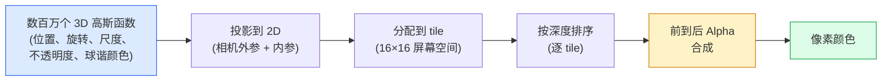

# 从零实现 3D 高斯泼溅

> 场景是数百万个 3D 高斯函数组成的点云。每个高斯函数有位置、方向、尺度、不透明度，以及随视角方向变化的颜色。对它们进行光栅化，通过光栅化过程反向传播，完成。

**类型：** 构建
**语言：** Python
**前置知识：** 第4阶段第13课（3D 视觉与 NeRF）、第1阶段第12课（Tensor 操作）、第4阶段第10课（扩散基础，可选）
**预计时间：** 约90分钟

## 学习目标

- 解释为何 3D 高斯泼溅在 2026 年取代 NeRF 成为真实感 3D 重建的生产默认方案
- 说明每个高斯函数的六组参数（位置、旋转四元数、尺度、不透明度、球谐函数颜色、可选特征）及各自占用的浮点数
- 从零实现一个使用 alpha 合成的 2D 高斯泼溅光栅化器，再展示 3D 情形如何投影到同一循环
- 使用 `nerfstudio`、`gsplat` 或 `SuperSplat` 从 20-50 张照片重建场景，并导出到 `KHR_gaussian_splatting` glTF 扩展或 OpenUSD 26.03 `UsdVolParticleField3DGaussianSplat` 规范

## 问题背景

NeRF 将场景存储在 MLP 的权重中。渲染每个像素需要沿光线进行数百次 MLP 查询。训练需要数小时，渲染需要数秒，且权重无法编辑——如果想移动场景内的一把椅子，就必须重新训练。

3D 高斯泼溅（Kerbl、Kopanas、Leimkühler、Drettakis，SIGGRAPH 2023）取代了这一切。场景是一组显式的 3D 高斯函数。渲染是 GPU 光栅化，帧率超过 100fps。训练只需几分钟。编辑是直接的：平移部分高斯函数，椅子就移走了。到 2026 年，Khronos 集团已批准高斯泼溅的 glTF 扩展，OpenUSD 26.03 内置了高斯泼溅规范，Zillow 和 Apartments.com 用它渲染房产，大多数新的 3D 重建研究论文都是核心 3DGS 思路的变体。

其思维模型简单，但数学细节多。大多数入门资料从光栅化开始，略过投影和球谐函数。本课从头构建完整内容——先做 2D 版本，再扩展到 3D。

## 核心概念

### 高斯函数携带什么

一个 3D 高斯函数是空间中带以下属性的参数化斑块：

```
位置           mu         (3,)    世界坐标中的中心
旋转           q          (4,)    编码方向的单位四元数
尺度           s          (3,)    每轴的对数尺度（渲染时取指数）
不透明度       alpha      (1,)    sigmoid 后的不透明度 [0, 1]
球谐系数       c_lm       (3 * (L+1)²,)   视角相关颜色
```

旋转 + 尺度构建 3×3 协方差矩阵：`Σ = R S Sᵀ Rᵀ`。这是高斯函数在 3D 中的形状。球谐函数让颜色随视角方向变化——镜面高光、微妙光泽、视角相关光晕——而无需存储每个视角的纹理。SH 3 阶每个颜色通道 16 个系数，仅颜色就有每个高斯函数 48 个浮点数。

一个场景通常有 100-500 万个高斯函数。每个存储约 60 个浮点数（3+4+3+1+48+杂项）。五百万高斯函数的场景约 240 MB——远小于等效的带逐点纹理的点云，比以高分辨率重渲染的 NeRF MLP 权重小一个数量级。

### 光栅化，而非光线步进



五个步骤，全部对 GPU 友好。每像素无需 MLP 查询。单张 RTX 3080 Ti 以 147fps 渲染 600 万个泼溅点。

### 投影步骤

世界位置 `mu`、3D 协方差 `Σ` 处的 3D 高斯函数，投影为屏幕位置 `mu'`、2D 协方差 `Σ'` 处的 2D 高斯函数：

```
mu' = project(mu)
Σ' = J W Σ Wᵀ Jᵀ          (2×2)

W = 视图变换（相机的旋转 + 平移）
J = 透视投影在 mu' 处的雅可比矩阵
```

2D 高斯函数的覆盖范围是一个椭圆，其轴为 `Σ'` 的特征向量。椭圆内的每个像素接收该高斯函数的贡献，权重为 `exp(-0.5 * (p - mu')ᵀ Σ'⁻¹ (p - mu'))`。

### Alpha 合成规则

对于一个像素，覆盖它的高斯函数按从后到前排序（或等价地，用倒置公式从前到后）。颜色用与 1980 年代以来所有半透明光栅化器相同的方程合成：

```
C_pixel = Σ_i α_i * T_i * c_i

T_i = Π_{j < i} (1 - α_j)                透射率
α_i = opacity_i * exp(-0.5 * dᵀ Σ'⁻¹ d)  局部贡献
c_i = eval_SH(SH_i, view_direction)       视角相关颜色
```

这与 **NeRF 的体积渲染方程完全相同**，只是作用于显式稀疏高斯函数集合，而非光线上的密集采样。这个等价性解释了为何渲染质量能与 NeRF 媲美——两者都在积分相同的辐射场方程。

### 为何可微

每个步骤——投影、tile 分配、alpha 合成、球谐函数求值——都对高斯函数参数可微。给定真值图像，计算渲染像素损失，通过光栅化器反向传播，用梯度下降更新所有 `(mu, q, s, alpha, c_lm)`。经过约 30,000 次迭代，高斯函数找到其正确的位置、尺度和颜色。

### 致密化与剪枝

固定的高斯函数集合无法覆盖复杂场景。训练包含两个自适应机制：

- **克隆（Clone）**：当梯度幅值大但尺度小时，在当前位置克隆一个高斯函数——重建在这里需要更多细节。
- **分裂（Split）**：当大尺度高斯函数的梯度很大时，将其分裂为两个较小的——单个大高斯函数太平滑，无法拟合该区域。
- **剪枝（Prune）**：删除不透明度低于阈值的高斯函数——它们没有贡献。

致密化每 N 次迭代执行一次。场景通常从约 10 万个初始高斯函数（从 SfM 点云播种）增长到训练结束时的 100-500 万个。

### 球谐函数一段话讲清楚

视角相关颜色是单位球上的函数 `c(direction)`。球谐函数是球面的傅里叶基。截断到 `L` 阶，每个通道得到 `(L+1)²` 个基函数。计算新视角的颜色是学到的球谐系数与视角方向处基函数值的点积。0 阶 = 1 个系数 = 常数颜色；3 阶 = 16 个系数 = 足以捕捉朗伯着色、镜面反射和轻微反射。3DGS 论文默认使用 3 阶。

### 2026 年的生产方案

```
1. 采集         智能手机 / DJI 无人机 / 手持扫描仪
2. SfM / MVS    COLMAP 或 GLOMAP 导出相机姿态 + 稀疏点云
3. 训练 3DGS    nerfstudio / gsplat / inria official / PostShot（RTX 4090 约 10-30 分钟）
4. 编辑         SuperSplat / SplatForge（清理浮点噪声、分割）
5. 导出         .ply -> glTF KHR_gaussian_splatting 或 .usd（OpenUSD 26.03）
6. 查看         Cesium / Unreal / Babylon.js / Three.js / Vision Pro
```

### 4D 和生成式变体

- **4D 高斯泼溅** — 高斯函数是时间的函数；用于体积视频。
- **生成式泼溅** — 文本到泼溅模型（World Labs 的 Marble），可凭空生成整个场景。
- **3D 高斯无迹变换** — NVIDIA NuRec 用于自动驾驶仿真的变体。

## 动手实现

### 第一步：2D 高斯函数

首先构建 2D 光栅化器。3D 情形在投影后归约为同一结构。

```python
import torch
import torch.nn as nn
import torch.nn.functional as F


def eval_2d_gaussian(means, covs, points):
    """
    means:  (G, 2)      中心
    covs:   (G, 2, 2)   协方差矩阵
    points: (H, W, 2)   像素坐标
    返回:  (G, H, W)   每个高斯函数在每个像素的密度
    """
    G = means.size(0)
    H, W, _ = points.shape
    flat = points.view(-1, 2)
    inv = torch.linalg.inv(covs)
    diff = flat[None, :, :] - means[:, None, :]
    d = torch.einsum("gpi,gij,gpj->gp", diff, inv, diff)
    density = torch.exp(-0.5 * d)
    return density.view(G, H, W)
```

`einsum` 对每个（高斯函数，像素）对计算二次型 `diffᵀ Σ⁻¹ diff`。

### 第二步：2D 泼溅光栅化器

从前到后的 alpha 合成。2D 中深度没有意义，因此使用每个高斯函数的可学习标量进行排序。

```python
def rasterise_2d(means, covs, colours, opacities, depths, image_size):
    """
    means:     (G, 2)
    covs:      (G, 2, 2)
    colours:   (G, 3)
    opacities: (G,)     在 [0, 1] 范围
    depths:    (G,)     用于排序的每高斯标量
    image_size: (H, W)
    返回:     (H, W, 3) 渲染图像
    """
    H, W = image_size
    yy, xx = torch.meshgrid(
        torch.arange(H, dtype=torch.float32, device=means.device),
        torch.arange(W, dtype=torch.float32, device=means.device),
        indexing="ij",
    )
    points = torch.stack([xx, yy], dim=-1)

    densities = eval_2d_gaussian(means, covs, points)
    alphas = opacities[:, None, None] * densities
    alphas = alphas.clamp(0.0, 0.99)

    order = torch.argsort(depths)
    alphas = alphas[order]
    colours_sorted = colours[order]

    T = torch.ones(H, W, device=means.device)
    out = torch.zeros(H, W, 3, device=means.device)
    for i in range(means.size(0)):
        a = alphas[i]
        out += (T * a)[..., None] * colours_sorted[i][None, None, :]
        T = T * (1.0 - a)
    return out
```

不快——真实实现使用基于 tile 的 CUDA kernel——但数学完全正确且完全可微。

### 第三步：可训练的 2D 泼溅场景

```python
class Splats2D(nn.Module):
    def __init__(self, num_splats=128, image_size=64, seed=0):
        super().__init__()
        g = torch.Generator().manual_seed(seed)
        H, W = image_size, image_size
        self.means = nn.Parameter(torch.rand(num_splats, 2, generator=g) * torch.tensor([W, H]))
        self.log_scale = nn.Parameter(torch.ones(num_splats, 2) * math.log(2.0))
        self.rot = nn.Parameter(torch.zeros(num_splats))  # 2D 中的单一旋转角
        self.colour_logits = nn.Parameter(torch.randn(num_splats, 3, generator=g) * 0.5)
        self.opacity_logit = nn.Parameter(torch.zeros(num_splats))
        self.depth = nn.Parameter(torch.rand(num_splats, generator=g))

    def covs(self):
        s = torch.exp(self.log_scale)
        c, si = torch.cos(self.rot), torch.sin(self.rot)
        R = torch.stack([
            torch.stack([c, -si], dim=-1),
            torch.stack([si, c], dim=-1),
        ], dim=-2)
        S = torch.diag_embed(s ** 2)
        return R @ S @ R.transpose(-1, -2)

    def forward(self, image_size):
        covs = self.covs()
        colours = torch.sigmoid(self.colour_logits)
        opacities = torch.sigmoid(self.opacity_logit)
        return rasterise_2d(self.means, covs, colours, opacities, self.depth, image_size)
```

`log_scale`、`opacity_logit` 和 `colour_logits` 都是无约束参数，在渲染时通过适当的激活函数映射。这是所有 3DGS 实现的标准模式。

### 第四步：将 2D 高斯函数拟合到目标图像

```python
import math
import numpy as np

def make_target(size=64):
    yy, xx = np.meshgrid(np.arange(size), np.arange(size), indexing="ij")
    img = np.zeros((size, size, 3), dtype=np.float32)
    # 红色圆形
    mask = (xx - 20) ** 2 + (yy - 20) ** 2 < 10 ** 2
    img[mask] = [1.0, 0.2, 0.2]
    # 蓝色正方形
    mask = (np.abs(xx - 45) < 8) & (np.abs(yy - 40) < 8)
    img[mask] = [0.2, 0.3, 1.0]
    return torch.from_numpy(img)


target = make_target(64)
model = Splats2D(num_splats=64, image_size=64)
opt = torch.optim.Adam(model.parameters(), lr=0.05)

for step in range(200):
    pred = model((64, 64))
    loss = F.mse_loss(pred, target)
    opt.zero_grad(); loss.backward(); opt.step()
    if step % 40 == 0:
        print(f"step {step:3d}  mse {loss.item():.4f}")
```

经过 200 步，64 个高斯函数稳定在两个形状上。这就是全部的思路——对显式几何元素进行梯度下降。

### 第五步：从 2D 到 3D

3D 扩展保持相同的循环。新增内容：

1. 每个高斯函数的旋转是四元数而非单一角度。
2. 协方差为 `R S Sᵀ Rᵀ`，`R` 由四元数构建，`S = diag(exp(log_scale))`。
3. 投影 `(mu, Σ) -> (mu', Σ')` 使用相机外参和透视投影在 `mu` 处的雅可比矩阵。
4. 颜色变为球谐函数展开；对当前视角方向求值。
5. 深度排序基于真实的相机空间 z 值，而非可学习标量。

每个生产实现（`gsplat`、`inria/gaussian-splatting`、`nerfstudio`）都在 GPU 上用基于 tile 的 CUDA kernel 做完全相同的事情。

### 第六步：球谐函数求值

3 阶以内的球谐基有每通道 16 项。求值方法：

```python
def eval_sh_degree_3(sh_coeffs, dirs):
    """
    sh_coeffs: (..., 16, 3)   最后维是 RGB 通道
    dirs:      (..., 3)       单位向量
    返回:      (..., 3)
    """
    C0 = 0.282094791773878
    C1 = 0.488602511902920
    C2 = [1.092548430592079, 1.092548430592079,
          0.315391565252520, 1.092548430592079,
          0.546274215296039]
    x, y, z = dirs[..., 0], dirs[..., 1], dirs[..., 2]
    x2, y2, z2 = x * x, y * y, z * z
    xy, yz, xz = x * y, y * z, x * z

    result = C0 * sh_coeffs[..., 0, :]
    result = result - C1 * y[..., None] * sh_coeffs[..., 1, :]
    result = result + C1 * z[..., None] * sh_coeffs[..., 2, :]
    result = result - C1 * x[..., None] * sh_coeffs[..., 3, :]

    result = result + C2[0] * xy[..., None] * sh_coeffs[..., 4, :]
    result = result + C2[1] * yz[..., None] * sh_coeffs[..., 5, :]
    result = result + C2[2] * (2.0 * z2 - x2 - y2)[..., None] * sh_coeffs[..., 6, :]
    result = result + C2[3] * xz[..., None] * sh_coeffs[..., 7, :]
    result = result + C2[4] * (x2 - y2)[..., None] * sh_coeffs[..., 8, :]

    # 为简洁起见此处省略 3 阶项；完整 16 系数版本见代码文件
    return result
```

学到的 `sh_coeffs` 存储该高斯函数"每个方向的颜色"。渲染时对当前视角方向求值，得到 3 维 RGB 向量。

## 工程应用

实际 3DGS 工作使用 `gsplat`（Meta）或 `nerfstudio`：

```bash
pip install nerfstudio gsplat
ns-download-data example
ns-train splatfacto --data path/to/data
```

`splatfacto` 是 nerfstudio 的 3DGS 训练器。典型场景在 RTX 4090 上需要 10-30 分钟。

2026 年重要的导出格式：

- `.ply` — 原始高斯函数点云（通用，文件最大）。
- `.splat` — PlayCanvas / SuperSplat 量化格式。
- glTF `KHR_gaussian_splatting` — Khronos 标准，跨查看器可移植（2026 年 2 月 RC）。
- OpenUSD `UsdVolParticleField3DGaussianSplat` — USD 原生，用于 NVIDIA Omniverse 和 Vision Pro 流水线。

4D / 动态场景使用 `4DGS` 和 `Deformable-3DGS`，用随时间变化的均值和不透明度扩展了相同机制。

## 交付物

本课产出：

- `outputs/prompt-3dgs-capture-planner.md` — 一个提示词，针对给定的场景类型规划采集流程（照片数量、相机路径、光照）。
- `outputs/skill-3dgs-export-router.md` — 一个技能文件，根据下游查看器或引擎选择正确的导出格式（`.ply` / `.splat` / glTF / USD）。

## 练习

1. **(简单)** 对不同的合成图像运行上面的 2D 泼溅训练器。将 `num_splats` 在 `[16, 64, 256]` 之间变化，绘制每种情况的 MSE vs 步数图，找出边际收益递减的点。
2. **(中等)** 扩展 2D 光栅化器，支持通过 2 阶球谐函数使每个高斯函数的 RGB 颜色依赖于标量"视角"。在一对目标图像上训练，验证模型能重建两者。
3. **(困难)** 克隆 `nerfstudio` 并在你拥有的任意场景（桌子、植物、面孔、房间）的 20 张照片上训练 `splatfacto`。导出到 glTF `KHR_gaussian_splatting`，并在查看器中打开（Three.js `GaussianSplats3D`、SuperSplat、Babylon.js V9）。报告训练时间、高斯函数数量和渲染帧率。

## 关键术语

| 术语 | 常见说法 | 真正含义 |
|------|---------|---------|
| 3DGS | "高斯泼溅" | 以数百万个 3D 高斯函数为显式场景表示，每个高斯函数有位置、旋转、尺度、不透明度、球谐颜色 |
| 协方差 (Covariance) | "高斯函数的形状" | `Σ = R S Sᵀ Rᵀ`；单个高斯函数的方向和各向异性尺度 |
| Alpha 合成 (Alpha compositing) | "从后到前混合" | 与 NeRF 体积渲染方程相同，现在作用于显式稀疏集合 |
| 致密化 (Densification) | "克隆和分裂" | 在重建欠拟合的地方自适应增加新高斯函数 |
| 剪枝 (Pruning) | "删除低不透明度" | 删除训练中不透明度接近零的高斯函数 |
| 球谐函数 (Spherical harmonics) | "视角相关颜色" | 球面的傅里叶基；将颜色存储为视角方向的函数 |
| Splatfacto | "nerfstudio 的 3DGS" | 2026 年训练 3DGS 最简单的路径 |
| `KHR_gaussian_splatting` | "glTF 标准" | Khronos 2026 扩展，使 3DGS 可在查看器和引擎间移植 |

## 延伸阅读

- [3D Gaussian Splatting for Real-Time Radiance Field Rendering (Kerbl et al., SIGGRAPH 2023)](https://repo-sam.inria.fr/fungraph/3d-gaussian-splatting/) — 原始论文
- [gsplat (Meta/nerfstudio)](https://github.com/nerfstudio-project/gsplat) — 生产质量的 CUDA 光栅化器
- [nerfstudio Splatfacto](https://docs.nerf.studio/nerfology/methods/splat.html) — 参考训练方案
- [Khronos KHR_gaussian_splatting 扩展](https://github.com/KhronosGroup/glTF/blob/main/extensions/2.0/Khronos/KHR_gaussian_splatting/README.md) — 2026 年可移植格式
- [OpenUSD 26.03 发布说明](https://openusd.org/release/) — `UsdVolParticleField3DGaussianSplat` 规范
