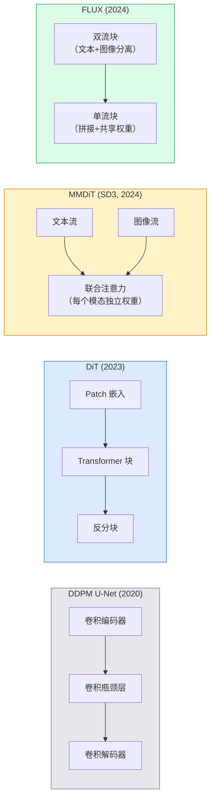

# 扩散 Transformer 与 Rectified Flow

> U-Net 并不是扩散模型的秘密所在。用 Transformer 替换它，用直线 Flow 替换噪声调度，突然之间你就拥有了 SD3、FLUX 和 2026 年的每一个文生图模型。

**类型：** 学习 + 构建
**语言：** Python
**前置知识：** 第4阶段第10课（DDPM 扩散）、第4阶段第14课（ViT）、第7阶段第2课（自注意力）
**预计时间：** 约75分钟

## 学习目标

- 梳理从 U-Net DDPM（第10课）到 Diffusion Transformer (DiT)、MMDiT（SD3）和单流+双流 DiT（FLUX）的演进历程
- 解释 Rectified Flow：为何噪声到数据的直线轨迹让模型能在 20 步内采样，而非 1000 步
- 实现一个微型 DiT 块和一个 rectified flow 训练循环，各不超过 100 行
- 按架构、参数量和许可证区分各模型变体（SD3、FLUX.1-dev、FLUX.1-schnell、Z-Image、Qwen-Image）

## 问题背景

第10课构建了一个带 U-Net 去噪器的 DDPM。这个方案主导了 2020-2023 年：U-Net + beta 调度 + 噪声预测损失。它产出了 Stable Diffusion 1.5、2.1 和 DALL-E 2。

2026 年的所有最先进文生图模型都已超越这一路线。Stable Diffusion 3、FLUX、SD4、Z-Image、Qwen-Image、Hunyuan-Image——没有一个使用 U-Net，它们都使用扩散 Transformer（DiT）。SD3 和 FLUX 还将 DDPM 噪声调度替换为 Rectified Flow，拉直了从噪声到数据的路径，使一致性或蒸馏变体能以 1-4 步推理。

这一转变之所以重要，是因为它让基于扩散的图像生成变得可控、提示词准确（SD3/SD4 解决了文字渲染问题）并且生产快速。理解 DiT + Rectified Flow 就是理解 2026 年生成图像技术栈。

## 核心概念

### 从 U-Net 到 Transformer



- **DiT**（Peebles & Xie, 2023）— 用类 ViT 的 Transformer 作用于潜向量 patch，取代 U-Net。通过自适应层归一化（AdaLN）进行条件化。
- **MMDiT**（SD3, Esser et al., 2024）— 文本和图像 token 使用独立权重的两个流，共享联合注意力。
- **FLUX**（Black Forest Labs, 2024）— 前 N 个块像 SD3 一样双流，后续块拼接并共享权重（单流），以提升较深层的效率。
- **Z-Image**（2025）— 60 亿参数的高效单流 DiT，挑战"一味堆叠规模"的路线。

### Rectified Flow 一段话讲清楚

DDPM 将前向过程定义为噪声 SDE，`x_t` 逐渐被污染。学到的逆过程是另一个 SDE，通过 1000 个小步骤求解。

Rectified Flow 定义了干净数据和纯噪声之间的**直线**插值：

```
x_t = (1 - t) * x_0 + t * ε,     t ∈ [0, 1]
```

训练网络预测速度 `v_θ(x_t, t) = ε - x_0`——即沿从干净数据到噪声的直线路径的正向方向（`dx_t/dt`）。采样时，将这个速度反向积分，从噪声步向数据。得到的 ODE 路径更接近直线，因此采样所需的积分步骤少得多。

SD3 将此称为 **Rectified Flow Matching**。FLUX、Z-Image 及 2026 年的大多数模型使用相同目标。典型推理：20-30 步 Euler（确定性），而旧 DDPM 方案需要 50+ 步 DDIM。蒸馏 / turbo / schnell / LCM 变体可进一步降到 1-4 步。

### AdaLN 条件化

DiT 通过**自适应层归一化**对时间步和类别/文本进行条件化：从条件向量预测 `scale` 和 `shift`，在 LayerNorm 之后应用。比 U-Net 中的 FiLM 风格调制更简洁，是所有现代 DiT 的默认方案。

```
cond -> MLP -> (scale, shift, gate)
norm(x) * (1 + scale) + shift，然后残差加 * gate
```

### SD3 和 FLUX 中的文本编码器

- **SD3** 使用三个文本编码器：两个 CLIP 模型 + T5-XXL。嵌入拼接后作为文本条件送入图像流。
- **FLUX** 使用一个 CLIP-L + T5-XXL。
- **Qwen-Image / Z-Image** 变体使用与其基础 LLM 对齐的自有文本编码器。

文本编码器是 SD3/FLUX 理解提示词远优于 SD1.5 的重要原因。仅 T5-XXL 本身就有 47 亿参数。

### 无分类器引导依然有效

Rectified Flow 改变的是采样器，而非条件化机制。无分类器引导（训练时以 10% 概率丢弃文本，推理时混合条件和无条件预测）与 rectified flow 工作方式完全相同。2026 年大多数模型使用引导强度 3.5-5——低于 SD1.5 的 7.5，因为 rectified flow 模型默认对提示词的跟随更紧密。

### 一致性模型、Turbo、Schnell、LCM

四个名字指向同一个思路：将慢速多步模型蒸馏成快速少步模型。

- **LCM（潜空间一致性模型）** — 训练学生从任意中间 `x_t` 一步预测最终 `x_0`。
- **SDXL Turbo / FLUX schnell** — 用对抗扩散蒸馏训练的 1-4 步模型。
- **SD Turbo** — 适配到潜空间扩散的 OpenAI 风格一致性模型。

任何新模型的生产部署都会同时提供"全质量"检查点和"turbo / schnell"变体。Schnell（德语"快"，Black Forest Labs 的命名惯例）在 1-4 步内运行，适合实时流水线。

### 2026 年的模型全景

| 模型 | 参数量 | 架构 | 许可证 |
|------|--------|------|--------|
| Stable Diffusion 3 Medium | 2B | MMDiT | SAI Community |
| Stable Diffusion 3.5 Large | 8B | MMDiT | SAI Community |
| FLUX.1-dev | 12B | 双流+单流 DiT | 非商业 |
| FLUX.1-schnell | 12B | 同上，已蒸馏 | Apache 2.0 |
| FLUX.2 | — | 迭代 FLUX.1 | 混合 |
| Z-Image | 6B | S3-DiT（可扩展单流） | 宽松许可 |
| Qwen-Image | ~20B | DiT + Qwen 文本塔 | Apache 2.0 |
| Hunyuan-Image-3.0 | ~80B | DiT | 研究用途 |
| SD4 Turbo | 3B | DiT + 蒸馏 | SAI Commercial |

FLUX.1-schnell 是 2026 年的开源默认选项，Z-Image 是效率领先者，FLUX.2 和 SD4 是当前质量天花板。

### 这次范式转移为何重要

DDPM + U-Net 可行，DiT + Rectified Flow **更好、更快、扩展更顺滑**。这次转变与 NLP 中从 RNN 到 Transformer 的转变如出一辙：两种架构都解决了同一个问题，但 Transformer 扩展性更好，最终占据主导。2026 年所有关于图像、视频或 3D 生成的论文都使用 DiT 形状的去噪器，通常还采用 rectified flow 目标。U-Net DDPM 现在主要用于教学（第10课）。

## 动手实现

### 第一步：带 AdaLN 的 DiT 块

```python
import torch
import torch.nn as nn


class AdaLNZero(nn.Module):
    """
    带门控的自适应 LayerNorm。从条件预测 (scale, shift, gate)。
    初始化使整个块从恒等映射开始（"零初始化"）。
    """

    def __init__(self, dim, cond_dim):
        super().__init__()
        self.norm = nn.LayerNorm(dim, elementwise_affine=False)
        self.mlp = nn.Linear(cond_dim, dim * 3)
        nn.init.zeros_(self.mlp.weight)
        nn.init.zeros_(self.mlp.bias)

    def forward(self, x, cond):
        scale, shift, gate = self.mlp(cond).chunk(3, dim=-1)
        h = self.norm(x) * (1 + scale.unsqueeze(1)) + shift.unsqueeze(1)
        return h, gate.unsqueeze(1)


class DiTBlock(nn.Module):
    def __init__(self, dim=192, heads=3, mlp_ratio=4, cond_dim=192):
        super().__init__()
        self.adaln1 = AdaLNZero(dim, cond_dim)
        self.attn = nn.MultiheadAttention(dim, heads, batch_first=True)
        self.adaln2 = AdaLNZero(dim, cond_dim)
        self.mlp = nn.Sequential(
            nn.Linear(dim, dim * mlp_ratio),
            nn.GELU(),
            nn.Linear(dim * mlp_ratio, dim),
        )

    def forward(self, x, cond):
        h, gate1 = self.adaln1(x, cond)
        a, _ = self.attn(h, h, h, need_weights=False)
        x = x + gate1 * a
        h, gate2 = self.adaln2(x, cond)
        x = x + gate2 * self.mlp(h)
        return x
```

`AdaLNZero` 初始为恒等映射，因为其 MLP 权重初始化为零。训练会将块从恒等映射逐渐推开；这极大地稳定了深度 Transformer 扩散模型的训练。

### 第二步：微型 DiT

```python
def timestep_embedding(t, dim):
    import math
    half = dim // 2
    freqs = torch.exp(-math.log(10000) * torch.arange(half, device=t.device) / half)
    args = t[:, None].float() * freqs[None]
    return torch.cat([args.sin(), args.cos()], dim=-1)


class TinyDiT(nn.Module):
    def __init__(self, image_size=16, patch_size=2, in_channels=3, dim=96, depth=4, heads=3):
        super().__init__()
        self.patch_size = patch_size
        self.num_patches = (image_size // patch_size) ** 2
        self.patch = nn.Conv2d(in_channels, dim, kernel_size=patch_size, stride=patch_size)
        self.pos = nn.Parameter(torch.zeros(1, self.num_patches, dim))
        self.time_mlp = nn.Sequential(
            nn.Linear(dim, dim * 2),
            nn.SiLU(),
            nn.Linear(dim * 2, dim),
        )
        self.blocks = nn.ModuleList([DiTBlock(dim, heads, cond_dim=dim) for _ in range(depth)])
        self.norm_out = nn.LayerNorm(dim, elementwise_affine=False)
        self.head = nn.Linear(dim, patch_size * patch_size * in_channels)

    def forward(self, x, t):
        n = x.size(0)
        x = self.patch(x)
        x = x.flatten(2).transpose(1, 2) + self.pos
        t_emb = self.time_mlp(timestep_embedding(t, self.pos.size(-1)))
        for blk in self.blocks:
            x = blk(x, t_emb)
        x = self.norm_out(x)
        x = self.head(x)
        return self._unpatchify(x, n)

    def _unpatchify(self, x, n):
        p = self.patch_size
        h = w = int(self.num_patches ** 0.5)
        x = x.view(n, h, w, p, p, -1).permute(0, 5, 1, 3, 2, 4).reshape(n, -1, h * p, w * p)
        return x
```

### 第三步：Rectified Flow 训练

```python
import torch.nn.functional as F

def rectified_flow_train_step(model, x0, optimizer, device):
    model.train()
    x0 = x0.to(device)
    n = x0.size(0)
    t = torch.rand(n, device=device)
    epsilon = torch.randn_like(x0)
    x_t = (1 - t[:, None, None, None]) * x0 + t[:, None, None, None] * epsilon

    target_velocity = epsilon - x0
    pred_velocity = model(x_t, t)

    loss = F.mse_loss(pred_velocity, target_velocity)
    optimizer.zero_grad()
    loss.backward()
    optimizer.step()
    return loss.item()
```

与 DDPM 的噪声预测损失（第10课）对比：结构相同，目标不同。这里不是预测噪声 `ε`，而是预测**速度** `ε - x_0`，它沿直线插值从数据指向噪声。

### 第四步：Euler 采样器

Rectified Flow 是一个 ODE。Euler 方法是最简单的，对于训练良好的 rectified flow 模型，在 20+ 步时与高阶求解器精度相当。

```python
@torch.no_grad()
def rectified_flow_sample(model, shape, steps=20, device="cpu"):
    model.eval()
    x = torch.randn(shape, device=device)
    dt = 1.0 / steps
    t = torch.ones(shape[0], device=device)
    for _ in range(steps):
        v = model(x, t)
        x = x - dt * v
        t = t - dt
    return x
```

20 步。在训练好的模型上，这与 1000 步 DDPM 产生的样本质量相当。

### 第五步：端到端冒烟测试

```python
import numpy as np

def synthetic_blobs(num=200, size=16, seed=0):
    rng = np.random.default_rng(seed)
    out = np.zeros((num, 3, size, size), dtype=np.float32)
    yy, xx = np.meshgrid(np.arange(size), np.arange(size), indexing="ij")
    for i in range(num):
        cx, cy = rng.uniform(4, size - 4, size=2)
        r = rng.uniform(2, 4)
        mask = (xx - cx) ** 2 + (yy - cy) ** 2 < r ** 2
        colour = rng.uniform(-1, 1, size=3)
        for c in range(3):
            out[i, c][mask] = colour[c]
    return torch.from_numpy(out)
```

用 rectified flow 在这个数据集上训练 `TinyDiT`。经过 500 步后，采样输出应该看起来像模糊的彩色斑块。

## 工程应用

使用 FLUX / SD3 / Z-Image 进行真实图像生成，`diffusers` 提供统一 API：

```python
from diffusers import FluxPipeline, StableDiffusion3Pipeline
import torch

pipe = FluxPipeline.from_pretrained(
    "black-forest-labs/FLUX.1-schnell",
    torch_dtype=torch.bfloat16,
).to("cuda")

out = pipe(
    prompt="a golden retriever surfing a tsunami, hyperrealistic, studio lighting",
    guidance_scale=0.0,           # schnell 训练时不使用 CFG
    num_inference_steps=4,
    max_sequence_length=256,
).images[0]
out.save("surf.png")
```

三行代码，FLUX.1-schnell，四步完成。将模型 ID 换为 `black-forest-labs/FLUX.1-dev` 可在 20-30 步配合 CFG 获得更高质量。

SD3 的使用：

```python
pipe = StableDiffusion3Pipeline.from_pretrained(
    "stabilityai/stable-diffusion-3.5-large",
    torch_dtype=torch.bfloat16,
).to("cuda")
out = pipe(prompt, guidance_scale=3.5, num_inference_steps=28).images[0]
```

## 交付物

本课产出：

- `outputs/prompt-dit-model-picker.md` — 根据质量、延迟和许可证约束，在 SD3、FLUX.1-dev、FLUX.1-schnell、Z-Image、SD4 Turbo 之间做出选择。
- `outputs/skill-rectified-flow-trainer.md` — 编写带 AdaLN DiT 和 Euler 采样的完整 rectified flow 训练循环。

## 练习

1. **(简单)** 在合成斑块数据集上训练上面的 TinyDiT 500 步。比较 10、20 和 50 个 Euler 步生成的样本。
2. **(中等)** 通过将可学习类别嵌入拼接到时间嵌入上来添加文本条件化（按颜色分 10 个斑块"类别"）。对类别 0、5 和 9 进行采样，验证颜色是否匹配。
3. **(困难)** 计算在相同数据上训练相同步数的 rectified flow 版本与 DDPM 版本同等规模网络生成样本之间的 Fréchet 距离（FID 代理）。报告哪个收敛更快。

## 关键术语

| 术语 | 常见说法 | 真正含义 |
|------|---------|---------|
| DiT | "扩散 Transformer" | 替代扩散去噪 U-Net 的 Transformer；在分块潜向量上操作 |
| AdaLN | "自适应层归一化" | 通过 LayerNorm 后应用的可学习 scale、shift、gate 进行时间步/文本条件化；所有现代 DiT 的标准 |
| MMDiT | "多模态 DiT（SD3）" | 文本和图像 token 使用独立权重流，共享联合自注意力 |
| 单流/双流 | "FLUX 技巧" | 前 N 块双流（每模态独立权重），后续块单流（拼接+共享权重）以提升效率 |
| Rectified Flow | "直线噪声到数据" | 数据与噪声之间的线性插值；网络预测速度；推理时所需 ODE 步数更少 |
| 速度目标 (Velocity target) | "ε - x_0" | rectified flow 中的回归目标；从干净数据指向噪声 |
| CFG 引导 | "无分类器引导" | 混合条件和无条件预测；在 rectified flow 模型中同样有效 |
| Schnell / turbo / LCM | "1-4 步蒸馏" | 从全质量模型蒸馏而来的少步变体；生产实时部署 |

## 延伸阅读

- [Scalable Diffusion Models with Transformers (Peebles & Xie, 2023)](https://arxiv.org/abs/2212.09748) — DiT 论文
- [Scaling Rectified Flow Transformers (Esser et al., SD3 论文)](https://arxiv.org/abs/2403.03206) — 规模化的 MMDiT 和 rectified flow
- [FLUX.1 模型卡和技术报告 (Black Forest Labs)](https://huggingface.co/black-forest-labs/FLUX.1-dev) — 双流+单流细节
- [Z-Image: Efficient Image Generation Foundation Model (2025)](https://arxiv.org/html/2511.22699v1) — 60 亿参数的单流 DiT
- [Elucidating the Design Space of Diffusion (Karras et al., 2022)](https://arxiv.org/abs/2206.00364) — 每项扩散设计权衡的参考资料
- [Latent Consistency Models (Luo et al., 2023)](https://arxiv.org/abs/2310.04378) — LCM-LoRA 如何实现 4 步推理
