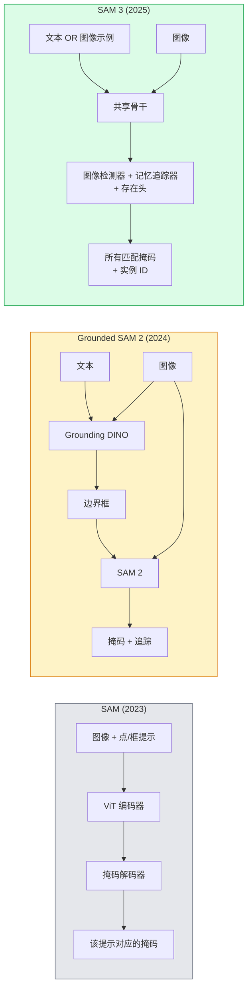

# SAM 3 与开放词汇分割

> 给模型一个文本提示词和一张图像，就能拿到所有匹配对象的掩码。SAM 3 让这一切只需一次前向传播。

**类型：** 使用 + 构建
**语言：** Python
**前置知识：** 第4阶段第7课（U-Net）、第4阶段第8课（Mask R-CNN）、第4阶段第18课（CLIP）
**预计时间：** 约60分钟

## 学习目标

- 区分 SAM（仅支持视觉提示）、Grounded SAM / SAM 2（检测器 + SAM）和 SAM 3（通过可提示概念分割支持原生文本提示）
- 解释 SAM 3 架构：共享骨干 + 图像检测器 + 基于记忆的视频追踪器 + 存在头 + 解耦检测器-追踪器设计
- 使用 Hugging Face `transformers` SAM 3 集成，实现文本提示检测、分割和视频追踪
- 根据延迟、概念复杂度和部署目标，在 SAM 3、Grounded SAM 2、YOLO-World 和 SAM-MI 之间做出选择

## 问题背景

2023 年发布的 SAM 是一个纯视觉提示模型：你点击一个点或画一个框，它返回一个掩码。要实现"给我找出照片中所有的橙子"，你需要先用检测器（Grounding DINO）生成边界框，再用 SAM 对每个框进行分割。Grounded SAM 把这些串成了流水线，但它本质上是两个冻结模型的级联，误差累积在所难免。

SAM 3（Meta，2025 年 11 月，ICLR 2026）终结了这种级联。它接受一个短名词短语或图像示例作为提示词，在单次前向传播中返回所有匹配的掩码和实例 ID。这就是**可提示概念分割（PCS）**。结合 2026 年 3 月发布的 Object Multiplex 更新（SAM 3.1），它能高效地在视频中追踪同一概念的多个实例。

这节课讨论的是这种架构转变所代表的意义。2D 分割、检测与文本-图像对齐已经合并进了一个模型。生产问题不再是"我该把哪些模块串联起来"，而是"哪个可提示模型能端到端处理我的用例"。

## 核心概念

### 三代模型



### 可提示概念分割

"概念提示"是一个短名词短语（`"黄色校车"`、`"红色条纹雨伞"`、`"手持马克杯"`）或图像示例。模型返回图像中所有匹配该概念的实例的分割掩码，并为每个匹配分配唯一的实例 ID。

这与经典视觉提示 SAM 有三点不同：

1. 无需逐实例提示——一个文本提示词返回所有匹配。
2. 开放词汇——概念可以是任何可用自然语言描述的事物。
3. 一次性返回多个实例，而不是每个提示词对应一个掩码。

### 关键架构组件

- **共享骨干** — 单个 ViT 处理图像。检测头和基于记忆的追踪器都从中读取特征。
- **存在头（Presence head）** — 预测概念是否存在于图像中。将"这里有没有？"和"在哪里？"解耦，减少缺失概念的误报。
- **解耦检测器-追踪器** — 图像级检测和视频级追踪有独立的头，互不干扰。
- **记忆库** — 跨帧存储每个实例的特征，用于视频追踪（与 SAM 2 的机制相同）。

### 大规模训练

SAM 3 在**400 万个独特概念**上训练，这些概念由一个迭代标注-修正数据引擎生成，结合 AI 与人工审核。全新的 **SA-CO 基准**包含 27 万个独特概念，比此前的基准大 50 倍。SAM 3 在 SA-CO 上达到人类表现的 75-80%，在图像 + 视频 PCS 上是现有系统的两倍。

### SAM 3.1 Object Multiplex

2026 年 3 月更新：**Object Multiplex** 引入共享记忆机制，支持同时联合追踪同一概念的多个实例。之前追踪 N 个实例需要 N 个独立记忆库，Multiplex 将其压缩为一个带有逐实例查询的共享记忆。结果：多目标追踪速度大幅提升，精度不变。

### 2026 年 Grounded SAM 仍然适用的场景

- 需要替换特定开放词汇检测器（DINO-X、Florence-2）时。
- SAM 3 的许可证（HF 上需要申请）是阻碍时。
- 需要比 SAM 3 暴露的更多检测器阈值控制权时。
- 用于检测器组件的研究/消融实验时。

模块化流水线仍有其存在价值。对于大多数生产工作，SAM 3 是更简洁的答案。

### YOLO-World vs SAM 3

- **YOLO-World** — 仅支持开放词汇检测（无掩码）。实时。最适合需要高帧率边界框的场景。
- **SAM 3** — 完整的分割 + 追踪。速度较慢，但输出更丰富。

生产分工：YOLO-World 用于快速纯检测流水线（机器人导航、快速仪表盘），SAM 3 用于任何需要掩码或追踪的场景。

### SAM-MI 效率优化

SAM-MI（2025-2026）解决了 SAM 解码器的瓶颈。核心思路：

- **稀疏点提示** — 使用少量精心挑选的点代替密集提示，将解码器调用次数减少 96%。
- **浅层掩码聚合** — 将粗粒度掩码预测合并为一个更精细的掩码。
- **解耦掩码注入** — 解码器接收预计算的掩码特征，无需重新运行。

结果：在开放词汇基准上比 Grounded-SAM 快约 1.6 倍。

### 三种模型的输出格式

三种模型返回相同的通用结构（边界框 + 标签 + 置信分数 + 掩码 + ID），这很方便——下游流水线无需根据运行的是哪个模型进行分支处理。

## 动手实现

### 第一步：构建提示词

写一个辅助函数，将用户输入的句子转换为 SAM 3 概念提示词列表。这是"用户输入"与"模型消费"之间的边界。

```python
def split_concepts(sentence):
    """
    多概念提示词的启发式拆分器。
    返回短名词短语列表。
    """
    for sep in [",", ";", "and", "or", "&"]:
        if sep in sentence:
            parts = [p.strip() for p in sentence.replace("and ", ",").split(",")]
            return [p for p in parts if p]
    return [sentence.strip()]

print(split_concepts("cats, dogs and balloons"))
```

SAM 3 每次前向传播接受一个概念；对于多概念查询，循环或批量处理。

### 第二步：后处理辅助函数

将 SAM 3 的原始输出转换为与第4阶段第16课流水线契约兼容的干净检测列表。

```python
from dataclasses import dataclass
from typing import List

@dataclass
class ConceptDetection:
    concept: str
    instance_id: int
    box: tuple          # (x1, y1, x2, y2)
    score: float
    mask_rle: str       # 游程编码


def rle_encode(binary_mask):
    flat = binary_mask.flatten().astype("uint8")
    runs = []
    prev, count = flat[0], 0
    for v in flat:
        if v == prev:
            count += 1
        else:
            runs.append((int(prev), count))
            prev, count = v, 1
    runs.append((int(prev), count))
    return ";".join(f"{v}x{c}" for v, c in runs)
```

RLE 即使对于大量高分辨率掩码也能保持响应体积小。同一格式适用于 SAM 2、SAM 3 和 Grounded SAM 2。

### 第三步：统一的开放词汇分割接口

将任何后端（SAM 3、Grounded SAM 2、YOLO-World + SAM 2）封装在单一方法背后。后端切换时，下游代码无需改动。

```python
from abc import ABC, abstractmethod
import numpy as np

class OpenVocabSeg(ABC):
    @abstractmethod
    def detect(self, image: np.ndarray, concept: str) -> List[ConceptDetection]:
        ...


class StubOpenVocabSeg(OpenVocabSeg):
    """
    未加载真实模型时用于流水线测试的确定性桩。
    """
    def detect(self, image, concept):
        h, w = image.shape[:2]
        return [
            ConceptDetection(
                concept=concept,
                instance_id=0,
                box=(w * 0.2, h * 0.3, w * 0.5, h * 0.8),
                score=0.89,
                mask_rle="0x100;1x50;0x200",
            ),
            ConceptDetection(
                concept=concept,
                instance_id=1,
                box=(w * 0.55, h * 0.25, w * 0.85, h * 0.75),
                score=0.74,
                mask_rle="0x80;1x40;0x220",
            ),
        ]
```

真实的 `SAM3OpenVocabSeg` 子类会封装 `transformers.Sam3Model` 和 `Sam3Processor`。

### 第四步：Hugging Face SAM 3 用法（参考）

使用 `transformers` 集成的真实模型调用方式：

```python
from transformers import Sam3Processor, Sam3Model
import torch

processor = Sam3Processor.from_pretrained("facebook/sam3")
model = Sam3Model.from_pretrained("facebook/sam3").eval()

inputs = processor(images=pil_image, return_tensors="pt")
inputs = processor.set_text_prompt(inputs, "yellow school bus")

with torch.no_grad():
    outputs = model(**inputs)

masks = processor.post_process_masks(
    outputs.masks, inputs.original_sizes, inputs.reshaped_input_sizes
)
boxes = outputs.boxes
scores = outputs.scores
```

一个提示词，单次调用返回所有匹配。

### 第五步：客观评估 Grounded SAM 2 的得失

诚实的对比测试：在真实流水线中用 SAM 3 替换 Grounded SAM 2 会发生什么？

- **延迟**：SAM 3 省去了一次前向传播（无独立检测器），但模型本身更重；通常持平或略有提升。
- **精度**：SAM 3 在罕见或组合概念（"红色条纹雨伞"）上明显更好。在常见单词概念上相近。
- **灵活性**：Grounded SAM 2 允许替换检测器（DINO-X、Florence-2、Grounding DINO 1.5）；SAM 3 是整体式的。

结论：SAM 3 是 2026 年开放词汇分割的默认选择。当需要检测器灵活性或不同许可证条款时，Grounded SAM 2 仍是正确答案。

## 工程应用

生产部署模式：

- **实时标注** — SAM 3 + CVAT 的文本提示标签功能。标注员选择标签名称，SAM 3 预标注所有匹配实例，再审核修正。
- **视频分析** — SAM 3.1 Object Multiplex 用于多目标追踪；将视频帧输入基于记忆的追踪器。
- **机器人** — SAM 3 用于开放词汇操作（"捡起红色杯子"）；作为规划原语运行。
- **医学影像** — 在医学概念上微调的 SAM 3；需要在 HF 上申请访问权限。

Ultralytics 在其 Python 包中集成了 SAM 3：

```python
from ultralytics import SAM

model = SAM("sam3.pt")
results = model(image_path, prompts="yellow school bus")
```

与 YOLO 和 SAM 2 接口相同。

## 交付物

本课产出：

- `outputs/prompt-open-vocab-stack-picker.md` — 一个提示词，根据延迟、概念复杂度和许可证，在 SAM 3 / Grounded SAM 2 / YOLO-World / SAM-MI 中做出选择。
- `outputs/skill-concept-prompt-designer.md` — 一个技能文件，将用户话语转换为格式良好的 SAM 3 概念提示词（拆分、消歧、回退）。

## 练习

1. **(简单)** 用自选概念提示词在 10 张图像上运行 SAM 3，与在相同图像上运行 SAM 2 + Grounding DINO 1.5 进行比较，报告各自遗漏的概念。
2. **(中等)** 在 SAM 3 之上构建"点击纳入/点击排除"UI：文本提示词返回候选实例，用户点击确定哪些为正样本，最终将概念集输出为 JSON。
3. **(困难)** 在自定义概念集（例如 5 种电子元件，每种 20 张标注图像）上微调 SAM 3，与零样本 SAM 3 在相同测试集上对比，测量掩码 IoU 提升。

## 关键术语

| 术语 | 常见说法 | 真正含义 |
|------|---------|---------|
| 开放词汇分割 (Open-vocabulary segmentation) | "按文本分割" | 为自然语言描述的对象生成掩码，而非固定标签集 |
| PCS | "可提示概念分割" | SAM 3 的核心任务——给定名词短语或图像示例，分割所有匹配实例 |
| 概念提示 (Concept prompt) | "文本输入" | 短名词短语或图像示例；不是完整句子 |
| 存在头 (Presence head) | "有没有这个？" | SAM 3 模块，在定位之前先判断概念是否存在于图像中 |
| SA-CO | "SAM 3 基准" | 27 万概念的开放词汇分割基准；比之前的基准大 50 倍 |
| Object Multiplex | "SAM 3.1 更新" | 共享记忆多目标追踪；快速联合追踪多个实例 |
| Grounded SAM 2 | "模块化流水线" | 检测器 + SAM 2 级联；需要检测器替换灵活性时仍然适用 |
| SAM-MI | "高效 SAM 变体" | 掩码注入，比 Grounded-SAM 快 1.6 倍 |

## 延伸阅读

- [SAM 3: Segment Anything with Concepts (arXiv 2511.16719)](https://arxiv.org/abs/2511.16719)
- [SAM 3.1 Object Multiplex (Meta AI, March 2026)](https://ai.meta.com/blog/segment-anything-model-3/)
- [SAM 3 model page on Hugging Face](https://huggingface.co/facebook/sam3)
- [Grounded SAM 2 tutorial (PyImageSearch)](https://pyimagesearch.com/2026/01/19/grounded-sam-2-from-open-set-detection-to-segmentation-and-tracking/)
- [Ultralytics SAM 3 docs](https://docs.ultralytics.com/models/sam-3/)
- [SAM3-I: Instruction-aware SAM (arXiv 2512.04585)](https://arxiv.org/abs/2512.04585)
