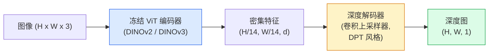

# 单目深度与几何估计

> 深度图是一张单通道图像，每个像素值代表到相机的距离。从单张 RGB 帧预测深度，过去没有双目摄像或 LiDAR 几乎是不可能的。2026 年，一个冻结的 ViT 编码器加上轻量级头部就能接近真值的几个百分点以内。

**类型：** 构建 + 使用
**语言：** Python
**前置知识：** 第4阶段第14课（ViT）、第4阶段第17课（自监督视觉）、第4阶段第7课（U-Net）
**预计时间：** 约60分钟

## 学习目标

- 区分相对深度与度量深度，并说明各主流生产模型（MiDaS、Marigold、Depth Anything V3、ZoeDepth）分别解决哪类问题
- 使用 Depth Anything V3（DINOv2 骨干）对任意单张图像预测深度，无需相机标定
- 解释单目深度为何能从单张图像奏效（透视线索、纹理梯度、习得先验），以及它无法恢复什么（绝对尺度、遮挡几何）
- 利用深度图和针孔相机内参将 2D 检测结果提升到三维空间中的点

## 问题背景

深度是 2D 计算机视觉中缺失的轴。给定 RGB，你知道物体在图像平面上的位置，但不知道它们距离多远。深度传感器（双目摄像、LiDAR、飞行时间相机）能直接解决这个问题，但价格昂贵、容易损坏且量程有限。

单目深度估计——从单张 RGB 帧预测深度——过去输出模糊且不可靠。到 2026 年，大型预训练编码器改变了局面：Depth Anything V3 使用冻结的 DINOv2 骨干，生成的深度图能泛化到室内、室外、医学和卫星图像等多种领域。Marigold 将深度估计重新定义为条件扩散问题。ZoeDepth 直接回归真实度量距离。

深度也是 2D 检测与 3D 理解之间的桥梁：将检测框内的像素乘以对应深度，就能将 2D 对象提升到三维点云中。这是每个 AR 遮挡系统、每条避障流水线以及每个"捡起杯子"机器人的核心原理。

## 核心概念

### 相对深度 vs 度量深度

- **相对深度** — 没有真实世界单位的有序 `z` 值。"像素 A 比像素 B 更近，但距离比例并不锚定到米制单位。"
- **度量深度** — 相机到物体的绝对距离（米）。要求模型学习图像线索与真实距离之间的统计关系。

MiDaS 和 Depth Anything V3 输出相对深度，Marigold 也输出相对深度；ZoeDepth、UniDepth 和 Metric3D 输出度量深度。度量模型对相机内参敏感；相对深度模型则不然。

### 编码器-解码器模式



Depth Anything V3 冻结编码器，只训练 DPT 风格的解码器。编码器提供丰富特征；解码器将其插值回图像分辨率并回归深度。

### 单张图像为何能产生深度

2D 图像包含许多与深度相关的单目线索：

- **透视** — 三维空间中的平行线在二维图像中收敛。
- **纹理梯度** — 远处的表面纹理更小、更密集。
- **遮挡顺序** — 近处的物体遮挡远处的物体。
- **尺寸恒常性** — 已知物体（汽车、人）提供近似比例。
- **大气透视** — 室外场景中，远处物体显得更模糊、更偏蓝。

在数十亿张图像上训练的 ViT 将这些线索内化。有了足够的数据和强大的骨干，单目深度无需显式 3D 监督就能达到合理精度。

### 单目深度的局限

- **没有绝对度量尺度**：除非有内参或场景中有已知大小的物体，否则网络可以预测"杯子比勺子远两倍"，但不知道杯子是 1 米还是 10 米外。
- **遮挡几何**：椅子背面不可见，无法可靠推断。
- **无纹理/反射表面**：镜子、玻璃、均匀墙壁。网络会报告看似合理但错误的深度。

### 2026 年的 Depth Anything V3

- 使用原版 DINOv2 ViT-L/14 作为编码器（冻结）。
- DPT 解码器。
- 在来自多样化来源的位姿图像对上训练（无需显式深度监督，仅依赖光度一致性）。
- 支持从**任意数量的视觉输入预测空间一致的几何**，无论是否有已知的相机位姿。
- 在单目深度、任意视角几何、视觉渲染、相机位姿估计上均达到 SOTA。

这是 2026 年需要深度时的即插即用模型。

### Marigold — 用扩散模型做深度估计

Marigold（Ke et al.，CVPR 2024）将深度估计重构为条件图像到图像扩散问题。条件：RGB。目标：深度图。使用预训练的 Stable Diffusion 2 U-Net 作为骨干。输出的深度图在物体边界处非常清晰。代价：推理比前馈模型慢（需要 10-50 个去噪步骤）。

### 内参与针孔相机

将深度为 `d` 的像素 `(u, v)` 提升到相机坐标系中的三维点 `(X, Y, Z)`：

```
fx, fy, cx, cy = 相机内参
X = (u - cx) * d / fx
Y = (v - cy) * d / fy
Z = d
```

内参来自 EXIF 元数据、标定板，或单目内参估计器（Perspective Fields、UniDepth）。没有内参时，假设 60-70° 视角和中心主点仍可生成点云——可用于可视化，但不适合测量。

### 评估指标

两个标准指标：

- **AbsRel**（绝对相对误差）：`mean(|d_pred - d_gt| / d_gt)`。越低越好。生产模型为 0.05-0.1。
- **delta < 1.25**（阈值精度）：满足 `max(d_pred/d_gt, d_gt/d_pred) < 1.25` 的像素比例。越高越好。SOTA 模型在 0.9 以上。

对于相对深度模型（Depth Anything V3、MiDaS），评估使用两个指标的尺度-偏移不变版本。

## 动手实现

### 第一步：深度评估指标

```python
import torch

def abs_rel_error(pred, target, mask=None):
    if mask is not None:
        pred = pred[mask]
        target = target[mask]
    return (torch.abs(pred - target) / target.clamp(min=1e-6)).mean().item()


def delta_accuracy(pred, target, threshold=1.25, mask=None):
    if mask is not None:
        pred = pred[mask]
        target = target[mask]
    ratio = torch.maximum(pred / target.clamp(min=1e-6), target / pred.clamp(min=1e-6))
    return (ratio < threshold).float().mean().item()
```

评估前始终屏蔽无效深度像素（零值、NaN、饱和值）。

### 第二步：尺度-偏移对齐

对于相对深度模型，计算指标之前先将预测对齐到真值。最小二乘拟合 `a * pred + b = target`：

```python
def align_scale_shift(pred, target, mask=None):
    if mask is not None:
        p = pred[mask]
        t = target[mask]
    else:
        p = pred.flatten()
        t = target.flatten()
    A = torch.stack([p, torch.ones_like(p)], dim=1)
    coeffs, *_ = torch.linalg.lstsq(A, t.unsqueeze(-1))
    a, b = coeffs[:2, 0]
    return a * pred + b
```

评估 MiDaS / Depth Anything 时，先运行 `align_scale_shift`，再调用 `abs_rel_error`。

### 第三步：将深度提升为点云

```python
import numpy as np

def depth_to_point_cloud(depth, intrinsics):
    H, W = depth.shape
    fx, fy, cx, cy = intrinsics
    v, u = np.meshgrid(np.arange(H), np.arange(W), indexing="ij")
    z = depth
    x = (u - cx) * z / fx
    y = (v - cy) * z / fy
    return np.stack([x, y, z], axis=-1)


depth = np.random.uniform(0.5, 4.0, (240, 320))
intr = (320.0, 320.0, 160.0, 120.0)
pc = depth_to_point_cloud(depth, intr)
print(f"point cloud shape: {pc.shape}  (H, W, 3)")
```

一个函数，覆盖所有三维提升应用。将点云导出为 `.ply` 文件，在 MeshLab 或 CloudCompare 中查看。

### 第四步：合成深度场景冒烟测试

```python
def synthetic_depth(size=96):
    yy, xx = np.meshgrid(np.arange(size), np.arange(size), indexing="ij")
    # 地板：从近（顶部）到远（底部）的线性梯度
    depth = 1.0 + (yy / size) * 4.0
    # 中间的盒子：更近
    mask = (np.abs(xx - size / 2) < size / 6) & (np.abs(yy - size * 0.6) < size / 6)
    depth[mask] = 2.0
    return depth.astype(np.float32)


gt = torch.from_numpy(synthetic_depth(96))
pred = gt + 0.3 * torch.randn_like(gt)  # 模拟预测
aligned = align_scale_shift(pred, gt)
print(f"对齐前  absRel = {abs_rel_error(pred, gt):.3f}")
print(f"对齐后  absRel = {abs_rel_error(aligned, gt):.3f}")
```

### 第五步：Depth Anything V3 用法（参考）

```python
import torch
from transformers import pipeline
from PIL import Image

pipe = pipeline(task="depth-estimation", model="LiheYoung/depth-anything-v2-large")

image = Image.open("street.jpg").convert("RGB")
out = pipe(image)
depth_np = np.array(out["depth"])
```

三行代码搞定。`out["depth"]` 是 PIL 灰度图；转换为 numpy 再做后续计算。Depth Anything V3 正式发布后，替换模型 ID 即可，API 不变。

## 工程应用

- **Depth Anything V3**（Meta AI / ByteDance，2024-2026）— 相对深度的默认选择。生产中速度最快的 ViT-large 骨干模型。
- **Marigold**（ETH，2024）— 视觉质量最高，推理较慢。
- **UniDepth**（ETH，2024）— 带相机内参估计的度量深度。
- **ZoeDepth**（Intel，2023）— 度量深度；较旧但仍可靠。
- **MiDaS v3.1** — 历史模型但稳定；适合作为对比基线。

典型集成模式：

1. RGB 帧到达。
2. 深度模型生成深度图。
3. 检测器生成边界框。
4. 将框的中心点通过深度提升到三维，如有点云则合并。
5. 下游：AR 遮挡、路径规划、物体尺寸估计、双目替代。

实时场景下，Depth Anything V2 Small（INT8 量化）在消费级 GPU 上处理 518x518 图像约能达到 30fps。

## 交付物

本课产出：

- `outputs/prompt-depth-model-picker.md` — 根据延迟、度量 vs 相对深度需求和场景类型，在 Depth Anything V3 / Marigold / UniDepth / MiDaS 中做出选择。
- `outputs/skill-depth-to-pointcloud.md` — 一个技能文件，从深度图构建点云，正确处理相机内参并导出为 `.ply` 格式。

## 练习

1. **(简单)** 在自己桌面的任意 10 张照片上运行 Depth Anything V2，将深度保存为灰度 PNG 并检查。找出一个深度预测明显有误的物体，解释单目线索为何失效。
2. **(中等)** 给定 RGB + Depth Anything V2 的深度图，提升为点云并用 `open3d` 渲染。比较两个场景（室内/室外），观察哪个看起来更真实。
3. **(困难)** 拍摄五组图像对，两张图的区别仅在于某个物体位置不同（例如瓶子近移 30 厘米）。用 UniDepth 在两张图上预测度量深度，报告预测距离变化量与真实 30 厘米的误差。

## 关键术语

| 术语 | 常见说法 | 真正含义 |
|------|---------|---------|
| 单目深度 (Monocular depth) | "单图深度" | 从单张 RGB 帧估计深度，无双目或 LiDAR |
| 相对深度 (Relative depth) | "有序深度" | 没有真实世界单位的有序 z 值 |
| 度量深度 (Metric depth) | "绝对距离" | 以米为单位的深度；需要标定或带度量监督训练的模型 |
| AbsRel | "绝对相对误差" | `|d_pred - d_gt| / d_gt` 的均值；标准深度指标 |
| delta 精度 (Delta accuracy) | "delta < 1.25" | 预测值在真值 25% 以内的像素比例 |
| 针孔相机 (Pinhole camera) | "fx, fy, cx, cy" | 将 (u, v, d) 提升到 (X, Y, Z) 所用的相机模型 |
| DPT | "密集预测 Transformer" | 用于冻结 ViT 编码器之上的深度估计的卷积解码器 |
| DINOv2 骨干 | "奏效的原因" | 无需深度标签即可跨域泛化的自监督特征 |

## 延伸阅读

- [Depth Anything V3 paper page](https://depth-anything.github.io/) — DINOv2 编码器的 SOTA 单目深度
- [Marigold (Ke et al., CVPR 2024)](https://marigoldmonodepth.github.io/) — 基于扩散模型的深度估计
- [UniDepth (Piccinelli et al., 2024)](https://arxiv.org/abs/2403.18913) — 带内参估计的度量深度
- [MiDaS v3.1 (Intel ISL)](https://github.com/isl-org/MiDaS) — 标准相对深度基线
- [DINOv3 blog post (Meta)](https://ai.meta.com/blog/dinov3-self-supervised-vision-model/) — 提升深度精度的编码器家族
