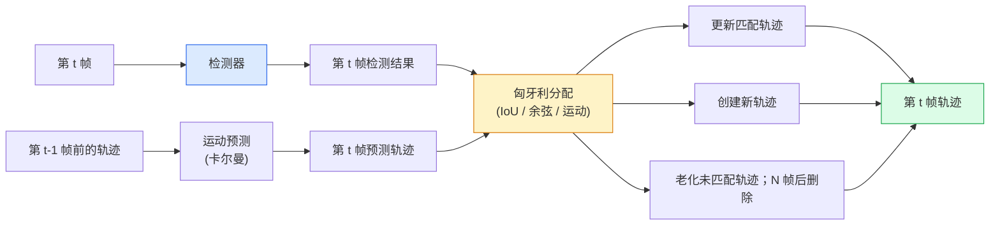

# 多目标追踪与视频记忆

> 追踪 = 检测 + 关联。逐帧检测，将当前帧的检测结果与上一帧的追踪轨迹按 ID 匹配。

**类型：** 构建
**语言：** Python
**前置知识：** 第4阶段第6课（YOLO 检测）、第4阶段第8课（Mask R-CNN）、第4阶段第24课（SAM 3）
**预计时间：** 约60分钟

## 学习目标

- 区分基于检测的追踪和基于查询的追踪，并说出各算法家族（SORT、DeepSORT、ByteTrack、BoT-SORT、SAM 2 记忆追踪器、SAM 3.1 Object Multiplex）
- 从零实现 IoU + 匈牙利算法分配，用于经典的基于检测的追踪
- 解释 SAM 2 的记忆库，以及它为何比基于 IoU 的关联更能处理遮挡
- 读懂三个追踪指标（MOTA、IDF1、HOTA），并针对特定用例选择合适的指标

## 问题背景

检测器告诉你单帧中物体在哪里；追踪器告诉你第 `t` 帧的某个检测结果与第 `t-1` 帧的哪个检测结果是同一个物体。没有追踪，你就无法统计越线的物体数量，无法跟踪球在遮挡中的运动轨迹，也无法知道"4 号车已经在车道里待了 8 秒"。

追踪是每个面向视频的产品的基础：体育分析、监控、自动驾驶、医疗视频分析、野生动物监测、字幕计数。核心构建块是共通的：逐帧检测器、运动模型（卡尔曼滤波器或更强大的方案）、关联步骤（对 IoU / 余弦 / 习得特征运行匈牙利算法）以及轨迹生命周期管理（诞生、更新、消亡）。

2026 年出现了两种新模式：**SAM 2 基于记忆的追踪**（用特征记忆代替运动模型关联）和 **SAM 3.1 Object Multiplex**（同一概念多个实例的共享记忆）。本课先讲经典方案，再讲基于记忆的方法。

## 核心概念

### 基于检测的追踪



你在 2026 年遇到的所有追踪器都是这个循环的变体。区别在于：

- **SORT**（2016）：卡尔曼滤波 + IoU 匈牙利。简单、快速，无外观模型。
- **DeepSORT**（2017）：SORT + 基于 CNN 的每轨迹外观特征（ReID 嵌入）。更好地处理交叉情况。
- **ByteTrack**（2021）：将低置信度检测结果作为第二阶段处理；无需外观特征，却在 MOT17 上名列前茅。
- **BoT-SORT**（2022）：ByteTrack + 相机运动补偿 + ReID。
- **StrongSORT / OC-SORT** — ByteTrack 后代，运动和外观建模更好。

### 卡尔曼滤波器一段话讲清楚

卡尔曼滤波器为每条轨迹维护一个带协方差的状态 `(x, y, w, h, dx, dy, dw, dh)`。每帧**预测**新状态（用匀速模型），然后用匹配的检测结果**更新**。当预测不确定性高时，更新更信任检测结果。这产生平滑的轨迹，并能在短暂遮挡（1-5 帧）中保持追踪。

所有经典追踪器都在运动预测步骤中使用卡尔曼滤波器。

### 匈牙利算法

给定一个 `M x N` 代价矩阵（轨迹 x 检测），找到最小化总代价的一对一分配。代价通常是 `1 - IoU(track_bbox, detection_bbox)` 或外观特征负余弦相似度。时间复杂度 O((M+N)^3)；M、N 最多约 1000 时，Python 中通过 `scipy.optimize.linear_sum_assignment` 计算足够快。

### ByteTrack 的关键思想

标准追踪器丢弃低置信度检测（< 0.5）。ByteTrack 将其保留为**第二阶段候选**：在将轨迹与高置信度检测匹配后，未匹配的轨迹尝试用稍宽松的 IoU 阈值匹配低置信度检测。这能恢复短暂遮挡，减少拥挤场景中的 ID 切换。

### SAM 2 基于记忆的追踪

SAM 2 通过维护**每实例时空特征的记忆库**来处理视频。给定某帧上的提示（点击、框、文本），它将该实例编码进记忆。在后续帧中，记忆与新帧的特征进行交叉注意力计算，解码器在新帧中为同一实例生成掩码。

没有卡尔曼滤波器，没有匈牙利分配。关联隐含在记忆-注意力操作中。

优点：
- 对长时间遮挡鲁棒（记忆跨多帧保持实例身份）。
- 与 SAM 3 文本提示结合时支持开放词汇。
- 不需要独立的运动模型。

缺点：
- 多目标追踪时比 ByteTrack 慢。
- 记忆库会增长，限制了上下文窗口大小。

### SAM 3.1 Object Multiplex

之前 SAM 2 / SAM 3 追踪为每个实例维护独立的记忆库。50 个对象就需要 50 个记忆库。Object Multiplex（2026 年 3 月）将其压缩为一个带**逐实例查询 token** 的共享记忆。成本随实例数量次线性增长。

Multiplex 是 2026 年拥挤场景追踪的新默认方案：演唱会人群、仓库工人、交通路口。

### 三个必知指标

- **MOTA（多目标追踪精度）** — `1 - (FN + FP + ID 切换数) / GT`。按错误类型加权；将检测失败和关联失败混合在一个指标里。
- **IDF1（ID F1）** — ID 精度和召回率的调和平均值。专注于每个真值轨迹随时间保持 ID 的能力。对 ID 切换敏感的任务比 MOTA 更好。
- **HOTA（高阶追踪精度）** — 分解为检测精度（DetA）和关联精度（AssA）。2020 年以来的社区标准；最全面。

监控场景（谁是谁）：报告 IDF1。体育分析（统计传球）：报告 HOTA。学术对比：报告 HOTA。

## 动手实现

### 第一步：基于 IoU 的代价矩阵

```python
import numpy as np


def bbox_iou(a, b):
    """
    a, b: (N, 4) 数组，格式为 [x1, y1, x2, y2]。
    返回: (N_a, N_b) IoU 矩阵。
    """
    ax1, ay1, ax2, ay2 = a[:, 0], a[:, 1], a[:, 2], a[:, 3]
    bx1, by1, bx2, by2 = b[:, 0], b[:, 1], b[:, 2], b[:, 3]
    inter_x1 = np.maximum(ax1[:, None], bx1[None, :])
    inter_y1 = np.maximum(ay1[:, None], by1[None, :])
    inter_x2 = np.minimum(ax2[:, None], bx2[None, :])
    inter_y2 = np.minimum(ay2[:, None], by2[None, :])
    inter = np.clip(inter_x2 - inter_x1, 0, None) * np.clip(inter_y2 - inter_y1, 0, None)
    area_a = (ax2 - ax1) * (ay2 - ay1)
    area_b = (bx2 - bx1) * (by2 - by1)
    union = area_a[:, None] + area_b[None, :] - inter
    return inter / np.clip(union, 1e-8, None)
```

### 第二步：极简 SORT 风格追踪器

为简洁起见省略了匀速卡尔曼——此处使用简单的 IoU 关联；生产系统中卡尔曼预测必不可少。`sort` Python 包提供完整版本。

```python
from scipy.optimize import linear_sum_assignment


class Track:
    def __init__(self, tid, bbox, frame):
        self.id = tid
        self.bbox = bbox
        self.last_frame = frame
        self.hits = 1

    def update(self, bbox, frame):
        self.bbox = bbox
        self.last_frame = frame
        self.hits += 1


class SimpleTracker:
    def __init__(self, iou_threshold=0.3, max_age=5):
        self.tracks = []
        self.next_id = 1
        self.iou_threshold = iou_threshold
        self.max_age = max_age

    def step(self, detections, frame):
        if not self.tracks:
            for d in detections:
                self.tracks.append(Track(self.next_id, d, frame))
                self.next_id += 1
            return [(t.id, t.bbox) for t in self.tracks]

        track_boxes = np.array([t.bbox for t in self.tracks])
        det_boxes = np.array(detections) if len(detections) else np.empty((0, 4))

        iou = bbox_iou(track_boxes, det_boxes) if len(det_boxes) else np.zeros((len(track_boxes), 0))
        cost = 1 - iou
        cost[iou < self.iou_threshold] = 1e6

        matched_track = set()
        matched_det = set()
        if cost.size > 0:
            row, col = linear_sum_assignment(cost)
            for r, c in zip(row, col):
                if cost[r, c] < 1.0:
                    self.tracks[r].update(det_boxes[c], frame)
                    matched_track.add(r); matched_det.add(c)

        for i, d in enumerate(det_boxes):
            if i not in matched_det:
                self.tracks.append(Track(self.next_id, d, frame))
                self.next_id += 1

        self.tracks = [t for t in self.tracks if frame - t.last_frame <= self.max_age]
        return [(t.id, t.bbox) for t in self.tracks]
```

60 行代码。接受逐帧检测结果，返回逐帧追踪 ID。真实系统还需加入卡尔曼预测、ByteTrack 的第二阶段重匹配和外观特征。

### 第三步：合成轨迹测试

```python
def synthetic_frames(num_frames=20, num_objects=3, H=240, W=320, seed=0):
    rng = np.random.default_rng(seed)
    starts = rng.uniform(20, 200, size=(num_objects, 2))
    velocities = rng.uniform(-5, 5, size=(num_objects, 2))
    frames = []
    for f in range(num_frames):
        dets = []
        for i in range(num_objects):
            cx, cy = starts[i] + f * velocities[i]
            dets.append([cx - 10, cy - 10, cx + 10, cy + 10])
        frames.append(dets)
    return frames


tracker = SimpleTracker()
for f, dets in enumerate(synthetic_frames()):
    tracks = tracker.step(dets, f)
```

三个沿直线运动的物体应该在全部 20 帧中保持各自的 ID。

### 第四步：ID 切换指标

```python
def count_id_switches(tracks_per_frame, gt_per_frame):
    """
    tracks_per_frame:  每帧的 (track_id, bbox) 列表的列表
    gt_per_frame:      每帧的 (gt_id, bbox) 列表的列表
    返回: ID 切换次数
    """
    prev_assignment = {}
    switches = 0
    for tracks, gts in zip(tracks_per_frame, gt_per_frame):
        if not tracks or not gts:
            continue
        t_boxes = np.array([b for _, b in tracks])
        g_boxes = np.array([b for _, b in gts])
        iou = bbox_iou(g_boxes, t_boxes)
        for g_idx, (gt_id, _) in enumerate(gts):
            j = iou[g_idx].argmax()
            if iou[g_idx, j] > 0.5:
                t_id = tracks[j][0]
                if gt_id in prev_assignment and prev_assignment[gt_id] != t_id:
                    switches += 1
                prev_assignment[gt_id] = t_id
    return switches
```

这是一个简化的类 IDF1 指标：统计真值对象改变其分配的预测追踪 ID 的次数。真正的 MOTA / IDF1 / HOTA 工具在 `py-motmetrics` 和 `TrackEval` 中。

## 工程应用

2026 年的生产追踪器：

- `ultralytics` — YOLOv8 内置 ByteTrack / BoT-SORT。`results = model.track(source, tracker="bytetrack.yaml")`。默认选择。
- `supervision`（Roboflow）— ByteTrack 封装 + 标注工具。
- SAM 2 / SAM 3.1 — 通过 `processor.track()` 实现基于记忆的追踪。
- 自定义方案：检测器（YOLOv8 / RT-DETR）+ `sort-tracker` / `OC-SORT` / `StrongSORT`。

选择建议：

- **行人 / 汽车 / 30fps+ 的一般对象**：ByteTrack + ultralytics。
- **拥挤场景中同一类别的多个实例**：SAM 3.1 Object Multiplex。
- **有可辨别外观的长时间遮挡**：DeepSORT / StrongSORT（ReID 特征）。
- **体育 / 复杂交互**：BoT-SORT 或习得追踪器（MOTRv3）。

## 交付物

本课产出：

- `outputs/prompt-tracker-picker.md` — 根据场景类型、遮挡模式和延迟预算，在 SORT / ByteTrack / BoT-SORT / SAM 2 / SAM 3.1 中做出选择。
- `outputs/skill-mot-evaluator.md` — 编写完整的 MOTA / IDF1 / HOTA 评估框架，对比真值轨迹。

## 练习

1. **(简单)** 用上面的合成追踪器分别测试 3、10、30 个对象，报告各情况下的 ID 切换次数，找出纯 IoU 关联开始失效的临界点。
2. **(中等)** 在关联之前加入匀速卡尔曼预测步骤，验证短暂（2-3 帧）遮挡不再导致 ID 切换。
3. **(困难)** 通过 `transformers` 集成 SAM 2 的基于记忆的追踪器作为备选后端。在一段 30 秒人群视频上同时运行 SimpleTracker 和 SAM 2，比较 ID 切换次数，手动为 5 个显著人物标注真值 ID。

## 关键术语

| 术语 | 常见说法 | 真正含义 |
|------|---------|---------|
| 基于检测的追踪 (Tracking-by-detection) | "先检测再关联" | 逐帧检测器 + 基于 IoU / 外观的匈牙利分配 |
| 卡尔曼滤波器 (Kalman filter) | "运动预测" | 线性动力学 + 协方差，用于平滑轨迹预测和处理遮挡 |
| 匈牙利算法 (Hungarian algorithm) | "最优分配" | 解决最小代价二分匹配问题；`scipy.optimize.linear_sum_assignment` |
| ByteTrack | "低置信度第二轮" | 将未匹配轨迹与低置信度检测重新匹配，恢复短暂遮挡 |
| DeepSORT | "SORT + 外观" | 添加 ReID 特征用于跨帧匹配；更好地保持 ID |
| 记忆库 (Memory bank) | "SAM 2 技巧" | 跨帧存储的每实例时空特征；交叉注意力替代显式关联 |
| Object Multiplex | "SAM 3.1 共享记忆" | 带逐实例查询的单一共享记忆，用于快速多目标追踪 |
| HOTA | "现代追踪指标" | 分解为检测精度和关联精度；社区标准 |

## 延伸阅读

- [SORT (Bewley et al., 2016)](https://arxiv.org/abs/1602.00763) — 极简基于检测的追踪论文
- [DeepSORT (Wojke et al., 2017)](https://arxiv.org/abs/1703.07402) — 加入外观特征
- [ByteTrack (Zhang et al., 2022)](https://arxiv.org/abs/2110.06864) — 低置信度第二轮
- [BoT-SORT (Aharon et al., 2022)](https://arxiv.org/abs/2206.14651) — 相机运动补偿
- [HOTA (Luiten et al., 2020)](https://arxiv.org/abs/2009.07736) — 分解式追踪指标
- [SAM 2 video segmentation (Meta, 2024)](https://ai.meta.com/sam2/) — 基于记忆的追踪器
- [SAM 3.1 Object Multiplex (Meta, March 2026)](https://ai.meta.com/blog/segment-anything-model-3/)
