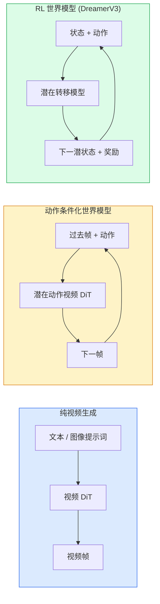

# 世界模型与视频扩散

> 能预测场景未来几秒画面的视频模型就是世界模拟器。将预测条件化于动作，就得到了一个可学习的游戏引擎。

**类型：** 学习 + 构建
**语言：** Python
**前置知识：** 第4阶段第10课（扩散模型）、第4阶段第12课（视频理解）、第4阶段第23课（DiT + 整流流）
**预计时间：** 约75分钟

## 学习目标

- 解释纯视频生成模型（Sora 2）与动作条件化世界模型（Genie 3、DreamerV3）的区别
- 描述视频 DiT：时空 patch、3D 位置编码、跨 (T, H, W) token 的联合注意力
- 追踪世界模型如何嵌入机器人技术：VLM 规划 → 视频模型模拟 → 逆动力学发出动作
- 针对给定用例（创意视频、交互仿真、自动驾驶合成），在 Sora 2、Genie 3、Runway GWM-1 Worlds、Wan-Video 和 HunyuanVideo 之间做出选择

## 问题背景

2026 年，视频生成与世界建模已经融合。一个能生成连贯一分钟视频的模型，在某种意义上已经学会了世界的运作规律：物体持久性、重力、因果关系、风格。如果将这种预测条件化于动作（向左走、打开门），视频模型就成了一个可学习的仿真器，能替代游戏引擎、驾驶仿真器或机器人环境。

意义是具体的。Genie 3 从单张图像生成可玩的游戏环境。Runway GWM-1 Worlds 合成无限可探索的场景。Sora 2 生成带同步音频和物理建模的分钟级视频。NVIDIA Cosmos-Drive、Wayve Gaia-2 和特斯拉 DrivingWorld 为自动驾驶训练数据生成逼真的驾驶视频。世界模型范式正在悄然接管机器人技术的仿真到现实迁移（sim-to-real）。

本课是第4阶段的"全景"课。它将图像生成、视频理解和智能体推理整合为主流研究正在朝向的架构模式。

## 核心概念

### 世界建模的三个家族



- **Sora 2** 是由提示词条件化的纯视频生成。没有动作接口，你无法在生成过程中"操控"它。
- **Genie 3**、**GWM-1 Worlds**、**Mirage / Magica** 是动作条件化世界模型。从观察到的视频中推断潜在动作，再以动作条件化未来帧预测。可交互——你按键或移动摄像机，场景即时响应。
- **DreamerV3** 和经典 RL 世界模型家族在潜在空间中进行显式动作条件化预测，以奖励信号训练。视觉效果较弱，但对样本高效的强化学习更有用。

### 视频 DiT 架构

```
视频潜表示:          (C, T, H, W)
空间 Patchify:       每帧划分 P_h x P_w 的 patch 网格
时序 Patchify:       将 P_t 帧分为一个时序 patch
最终 token 数量:     (T / P_t) * (H / P_h) * (W / P_w) 个 token
```

位置编码是三维的：每个 (t, h, w) 坐标用旋转或习得嵌入表示。注意力机制可以是：

- **全联合注意力** — 所有 token 互相注意。N 个 token 时复杂度 O(N^2)，长视频时代价过高。
- **分离注意力** — 时序注意力（相同空间位置，跨时间：`(H*W) * T^2`）与空间注意力（相同时间步，跨空间：`T * (H*W)^2`）交替执行。TimeSformer 及大多数视频 DiT 使用此方式。
- **窗口注意力** — 在 (t, h, w) 的局部窗口内计算。Video Swin 使用此方式。

2026 年所有视频扩散模型都采用这三种模式之一，加上 AdaLN 条件化（第23课）和整流流。

### 动作条件化：潜在动作模型

Genie 通过判别性地预测连续两帧之间的动作来学习**潜在动作**。模型的解码器以推断的潜在动作为条件——而非显式的键盘按键。推理时，用户可以指定一个潜在动作（或从先验中采样），模型生成与该动作一致的下一帧。

Sora 完全跳过了动作接口。其解码器从过去的时空 token 预测下一个时空 token。提示词决定开头；没有任何东西能在生成过程中操控它的方向。

### 物理可信度

Sora 2 的 2026 版本明确宣传了**物理可信度**：重量、平衡、物体持久性、因果关系。团队通过人工评分的可信度分数来衡量；与 Sora 1 相比，模型在坠落物体、角色碰撞和故意失败（跳跃失手）等场景上明显改善。

可信度仍然是主要的失败模式。2024-2025 年的人物吃意大利面或喝水视频揭示了模型缺乏持久对象表示。2026 年的模型（Sora 2、Runway Gen-5、HunyuanVideo）减少但尚未消除这些问题。

### 自动驾驶世界模型

驾驶世界模型基于轨迹、边界框或导航地图，生成逼真的道路场景。用途：

- **Cosmos-Drive-Dreams**（NVIDIA）— 生成分钟级驾驶视频用于强化学习训练。
- **Gaia-2**（Wayve）— 轨迹条件化的场景合成，用于策略评估。
- **DrivingWorld**（特斯拉）— 模拟多样的天气、时间、交通状况。
- **Vista**（字节跳动）— 响应式驾驶场景合成。

它们替代了对极端场景（夜间行人横穿马路、结冰路口、非常规车型）代价高昂的真实数据采集，否则需要数百万英里的驾驶才能收集到这些数据。

### 机器人技术栈：VLM + 视频模型 + 逆动力学

正在涌现的三组件机器人循环：

1. **VLM** 解析目标（"捡起红色杯子"），规划高层动作序列。
2. **视频生成模型** 模拟执行每个动作的样子——向前预测 N 帧的观测。
3. **逆动力学模型** 提取能产生这些观测的具体电机指令。

这替代了奖励塑形和样本密集的强化学习。世界模型负责"想象"；逆动力学关闭执行回路。Genie Envisioner 是一个实现案例；许多研究团队正在向这个结构收敛。

### 评估指标

- **视觉质量** — FVD（Fréchet 视频距离）、用户研究。
- **提示对齐** — 逐帧 CLIPScore、VQA 风格评估。
- **物理可信度** — 人工标注基准集评分（Sora 2 内部基准、VBench）。
- **可控性**（针对交互式世界模型）— 动作 → 观测一致性；能否回到先前状态？

### 2026 年模型全景

| 模型 | 用途 | 参数量 | 输出 | 许可证 |
|------|------|--------|------|--------|
| Sora 2 | 文本到视频，带音频 | — | 1 分钟 1080p + 音频 | 仅 API |
| Runway Gen-5 | 文本/图像到视频 | — | 10 秒片段 | API |
| Runway GWM-1 Worlds | 交互式世界 | — | 无限 3D 推演 | API |
| Genie 3 | 从图像生成交互式世界 | 11B+ | 可玩帧 | 研究预览 |
| Wan-Video 2.1 | 开源文本到视频 | 14B | 高质量片段 | 非商业 |
| HunyuanVideo | 开源文本到视频 | 13B | 10 秒片段 | 宽松许可 |
| Cosmos / Cosmos-Drive | 自动驾驶仿真 | 7-14B | 驾驶场景 | NVIDIA 开源 |
| Magica / Mirage 2 | AI 原生游戏引擎 | — | 可修改世界 | 商业产品 |

## 动手实现

### 第一步：视频的三维 Patchify

```python
import torch
import torch.nn as nn


class VideoPatch3D(nn.Module):
    def __init__(self, in_channels=4, dim=64, patch_t=2, patch_h=2, patch_w=2):
        super().__init__()
        self.proj = nn.Conv3d(
            in_channels, dim,
            kernel_size=(patch_t, patch_h, patch_w),
            stride=(patch_t, patch_h, patch_w),
        )
        self.patch_t = patch_t
        self.patch_h = patch_h
        self.patch_w = patch_w

    def forward(self, x):
        # x: (N, C, T, H, W)
        x = self.proj(x)
        n, c, t, h, w = x.shape
        tokens = x.reshape(n, c, t * h * w).transpose(1, 2)
        return tokens, (t, h, w)
```

步幅等于卷积核的 3D 卷积起到时空分块器的作用。`(T, H, W) -> (T/2, H/2, W/2)` token 网格。

### 第二步：三维旋转位置编码

沿 `t`、`h`、`w` 轴分别应用旋转位置嵌入（RoPE）：

```python
def rope_3d(tokens, t_dim, h_dim, w_dim, grid):
    """
    tokens: (N, T*H*W, D)
    grid: (T, H, W) 尺寸
    t_dim + h_dim + w_dim == D
    """
    T, H, W = grid
    n, seq, d = tokens.shape
    if t_dim + h_dim + w_dim != d:
        raise ValueError(f"t_dim+h_dim+w_dim ({t_dim}+{h_dim}+{w_dim}) must equal D={d}")
    assert seq == T * H * W
    t_idx = torch.arange(T, device=tokens.device).repeat_interleave(H * W)
    h_idx = torch.arange(H, device=tokens.device).repeat_interleave(W).repeat(T)
    w_idx = torch.arange(W, device=tokens.device).repeat(T * H)
    # 简化版：用频率缩放通道。真实 RoPE 会旋转通道对。
    freqs_t = torch.exp(-torch.log(torch.tensor(10000.0)) * torch.arange(t_dim // 2, device=tokens.device) / (t_dim // 2))
    freqs_h = torch.exp(-torch.log(torch.tensor(10000.0)) * torch.arange(h_dim // 2, device=tokens.device) / (h_dim // 2))
    freqs_w = torch.exp(-torch.log(torch.tensor(10000.0)) * torch.arange(w_dim // 2, device=tokens.device) / (w_dim // 2))
    emb_t = torch.cat([torch.sin(t_idx[:, None] * freqs_t), torch.cos(t_idx[:, None] * freqs_t)], dim=-1)
    emb_h = torch.cat([torch.sin(h_idx[:, None] * freqs_h), torch.cos(h_idx[:, None] * freqs_h)], dim=-1)
    emb_w = torch.cat([torch.sin(w_idx[:, None] * freqs_w), torch.cos(w_idx[:, None] * freqs_w)], dim=-1)
    return tokens + torch.cat([emb_t, emb_h, emb_w], dim=-1)
```

简化的加性形式。真实 RoPE 以频率旋转通道对；位置信息相同。

### 第三步：分离注意力块

```python
class DividedAttentionBlock(nn.Module):
    def __init__(self, dim=64, heads=2):
        super().__init__()
        self.time_attn = nn.MultiheadAttention(dim, heads, batch_first=True)
        self.space_attn = nn.MultiheadAttention(dim, heads, batch_first=True)
        self.ln1 = nn.LayerNorm(dim)
        self.ln2 = nn.LayerNorm(dim)
        self.ln3 = nn.LayerNorm(dim)
        self.mlp = nn.Sequential(nn.Linear(dim, 4 * dim), nn.GELU(), nn.Linear(4 * dim, dim))

    def forward(self, x, grid):
        T, H, W = grid
        n, seq, d = x.shape
        # 时序注意力：相同 (h, w)，跨时间
        xt = x.view(n, T, H * W, d).permute(0, 2, 1, 3).reshape(n * H * W, T, d)
        a, _ = self.time_attn(self.ln1(xt), self.ln1(xt), self.ln1(xt), need_weights=False)
        xt = (xt + a).reshape(n, H * W, T, d).permute(0, 2, 1, 3).reshape(n, seq, d)
        # 空间注意力：相同时间步，跨 (h, w)
        xs = xt.view(n, T, H * W, d).reshape(n * T, H * W, d)
        a, _ = self.space_attn(self.ln2(xs), self.ln2(xs), self.ln2(xs), need_weights=False)
        xs = (xs + a).reshape(n, T, H * W, d).reshape(n, seq, d)
        xs = xs + self.mlp(self.ln3(xs))
        return xs
```

时序注意力在每个空间位置跨时间计算；空间注意力在每个时间步跨位置计算。两个 O(T^2 + (HW)^2) 操作代替一个 O((THW)^2)。这是 TimeSformer 和所有现代视频 DiT 的核心。

### 第四步：组装微型视频 DiT

```python
class TinyVideoDiT(nn.Module):
    def __init__(self, in_channels=4, dim=64, depth=2, heads=2):
        super().__init__()
        self.patch = VideoPatch3D(in_channels=in_channels, dim=dim, patch_t=2, patch_h=2, patch_w=2)
        self.blocks = nn.ModuleList([DividedAttentionBlock(dim, heads) for _ in range(depth)])
        self.out = nn.Linear(dim, in_channels * 2 * 2 * 2)

    def forward(self, x):
        tokens, grid = self.patch(x)
        for blk in self.blocks:
            tokens = blk(tokens, grid)
        return self.out(tokens), grid
```

这不是一个可工作的视频生成器，而是一个结构演示，展示每个组件如何正确拼合。

### 第五步：检查形状

```python
vid = torch.randn(1, 4, 8, 16, 16)  # (N, C, T, H, W)
model = TinyVideoDiT()
out, grid = model(vid)
print(f"input  {tuple(vid.shape)}")
print(f"tokens grid {grid}")
print(f"output {tuple(out.shape)}")
```

分块后预期 `grid = (4, 8, 8)`，`out = (1, 256, 32)`；头部将每个 token 投影到对应的时空 patch，准备反分块还原为视频。

## 工程应用

2026 年的生产访问方式：

- **Sora 2 API**（OpenAI）— 文本到视频，同步音频。高级定价。
- **Runway Gen-5 / GWM-1**（Runway）— 图像到视频，交互式世界。
- **Wan-Video 2.1 / HunyuanVideo** — 开源自托管。
- **Cosmos / Cosmos-Drive**（NVIDIA）— 驾驶仿真开放权重。
- **Genie 3** — 研究预览，需申请访问。

构建交互式世界模型演示：从 Wan-Video 获取质量，叠加潜在动作适配器实现交互。自动驾驶仿真：Cosmos-Drive 是 2026 年的开源参考方案。

机器人技术领域的实际应用栈：

1. 语言目标 → VLM（Qwen3-VL）→ 高层规划。
2. 规划 → 潜在动作视频模型 → 想象的推演。
3. 推演 → 逆动力学模型 → 底层动作。
4. 执行动作 → 观测反馈回第 1 步。

## 交付物

本课产出：

- `outputs/prompt-video-model-picker.md` — 根据任务、许可证和延迟，在 Sora 2 / Runway / Wan / HunyuanVideo / Cosmos 中做出选择。
- `outputs/skill-physical-plausibility-checks.md` — 一个技能文件，定义自动化检查（物体持久性、重力、连续性），在任何生成视频发布前运行。

## 练习

1. **(简单)** 计算一段 5 秒 360p 视频在 patch_t=2、patch_h=8、patch_w=8 时的 token 数量，推理该规模下注意力计算的内存需求。
2. **(中等)** 将上面的分离注意力块替换为全联合注意力块，测量形状和参数量的变化。解释为什么真实视频模型必须使用分离注意力。
3. **(困难)** 构建一个极简潜在动作视频模型：取一个 (frame_t, action_t, frame_{t+1}) 三元组数据集（任何简单的 2D 游戏），训练以动作嵌入为条件的微型视频 DiT，验证不同动作确实产生不同的下一帧。

## 关键术语

| 术语 | 常见说法 | 真正含义 |
|------|---------|---------|
| 世界模型 (World model) | "可学习的仿真器" | 给定状态和动作，预测未来观测的模型 |
| 视频 DiT (Video DiT) | "时空 Transformer" | 带三维分块和分离注意力的扩散 Transformer |
| 潜在动作 (Latent action) | "推断的控制信号" | 从帧对中推断的离散或连续动作潜变量；用于条件化下一帧生成 |
| 分离注意力 (Divided attention) | "先时间后空间" | 每块两次注意力操作——先跨时间再跨空间——将 O(N^2) 保持在可控范围 |
| 物体持久性 (Object permanence) | "东西仍然存在" | 视频模型必须学习的场景属性；食物、玻璃器皿上的经典失败模式 |
| FVD | "Fréchet 视频距离" | FID 的视频版本；主要视觉质量指标 |
| 逆动力学模型 (Inverse dynamics model) | "观测到动作" | 给定（状态，下一状态），输出连接两者的动作；关闭机器人回路 |
| Cosmos-Drive | "NVIDIA 驾驶仿真" | 用于强化学习和评估的开放权重自动驾驶世界模型 |

## 延伸阅读

- [Sora technical report (OpenAI)](https://openai.com/index/video-generation-models-as-world-simulators/)
- [Genie: Generative Interactive Environments (Bruce et al., 2024)](https://arxiv.org/abs/2402.15391) — 潜在动作世界模型
- [TimeSformer (Bertasius et al., 2021)](https://arxiv.org/abs/2102.05095) — 视频 Transformer 的分离注意力
- [DreamerV3 (Hafner et al., 2023)](https://arxiv.org/abs/2301.04104) — 强化学习世界模型
- [Cosmos-Drive-Dreams (NVIDIA, 2025)](https://research.nvidia.com/labs/toronto-ai/cosmos-drive-dreams/) — 驾驶世界模型
- [Top 10 Video Generation Models 2026 (DataCamp)](https://www.datacamp.com/blog/top-video-generation-models)
- [From Video Generation to World Model — survey repo](https://github.com/ziqihuangg/Awesome-From-Video-Generation-to-World-Model/)
