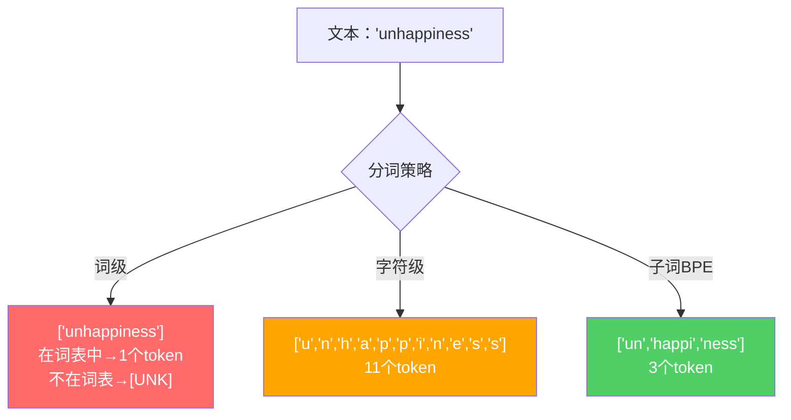
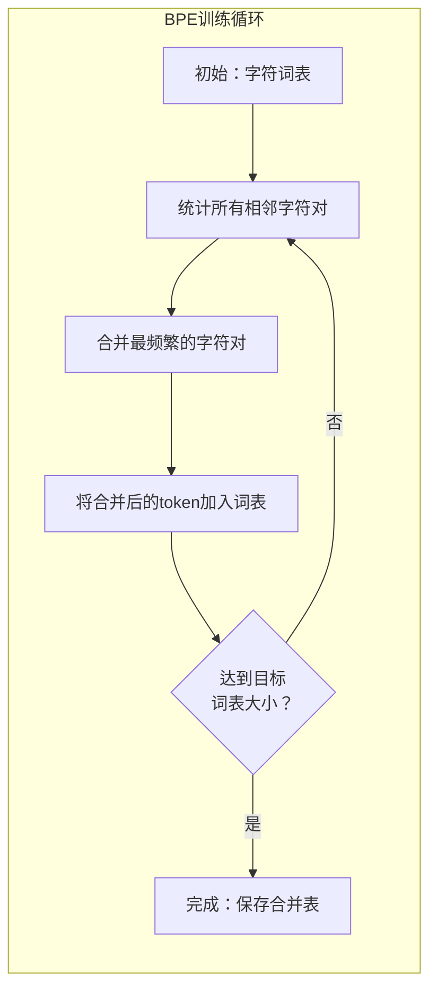
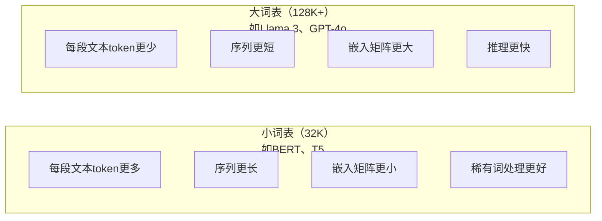

# 分词器：BPE、WordPiece、SentencePiece

> 你的大语言模型不读英文，它读整数。分词器决定这些整数是否承载意义，还是白白浪费。

**类型：** 构建
**语言：** Python
**前置知识：** 第5阶段（NLP基础）
**预计时间：** 约90分钟

## 学习目标

- 从零实现BPE、WordPiece和Unigram分词算法，比较它们的合并策略
- 解释词表大小如何影响模型效率：太小导致序列过长，太大浪费嵌入参数
- 分析跨语言和代码场景下的分词异常，找出各类分词器的边界情况
- 使用tiktoken和sentencepiece库对文本分词并检查对应的token ID

## 问题背景

你的大语言模型不读英文，它不读任何语言，它读数字。

"Hello, world!"和 [15496, 11, 995, 0] 之间的鸿沟，就是分词器。每个单词、每个空格、每个标点符号，都必须先转换成整数，模型才能处理。这个转换不是中立的——它把假设烙进模型，之后再也改不掉。

搞错了，模型就在把常见词编码成多个token上浪费容量。"unfortunately"变成四个token而不是一个。你的128K上下文窗口，对于多音节词密集的文本，实际上缩水了75%。搞对了，同样的上下文窗口能承载两倍的信息量。"这个模型处理代码很好"和"这个模型在Python上卡死"之间的差别，往往就出在分词器的训练方式上。

你每次调用GPT-4或Claude API都按token计费，模型生成的每个token都消耗算力。表示同一段输出所需的token越少，端到端推理就越快。分词不是预处理，它是架构。

## 核心概念

### 三种失败的方案（以及一种成功的）

把文本转换成数字，有三种显而易见的方式，其中两种在大规模场景下行不通。

**词级分词**按空格和标点切分。"The cat sat"变成 ["The", "cat", "sat"]。很简单。但"tokenization"怎么办？"GPT-4o"怎么办？德语复合词"Geschwindigkeitsbegrenzung"又怎么办？词级分词需要巨大的词表才能覆盖所有语言的所有词形。遇到不认识的词就产生可怕的 `[UNK]` token——模型表示"我完全不知道这是什么"。仅英语就有超过一百万种词形，再加上代码、URL、科学记数法和其他100种语言，你需要无限大的词表。

**字符级分词**走向另一个极端。"hello"变成 ["h", "e", "l", "l", "o"]。词表很小（几百个字符），永远没有未知token。但序列变得极长——原本10个词级token的句子，变成50个字符级token。模型必须自己学习"t"、"h"、"e"放在一起是"the"——把注意力容量浪费在三岁小孩就知道的事情上。

**子词分词**找到了甜蜜点。常见词保持完整："the"是一个token。罕见词分解为有意义的片段："unhappiness"变成 ["un", "happi", "ness"]。词表保持可控（30K到128K个token），序列保持简短，未知token基本消失——因为任何词都能从子词片段组合而成。

所有现代大语言模型都使用子词分词：GPT-2、GPT-4、BERT、Llama 3、Claude，全部如此。问题只在于用哪种算法。



### BPE：字节对编码

BPE是一种贪心压缩算法，被改造用于分词。思路简单到可以写在一张索引卡上。

从单个字符开始，统计训练语料中所有相邻字符对，把最频繁的对合并成一个新token，重复这个过程直到达到目标词表大小。

下面是BPE在包含"lower"、"lowest"和"newest"的小语料上的运行过程：

```
语料（含词频）：
  "lower"  x5
  "lowest" x2
  "newest" x6

步骤0 — 从字符开始：
  l o w e r       (x5)
  l o w e s t     (x2)
  n e w e s t     (x6)

步骤1 — 统计相邻字符对：
  (e,s): 8    (s,t): 8    (l,o): 7    (o,w): 7
  (w,e): 13   (e,r): 5    (n,e): 6    ...

步骤2 — 合并最频繁的字符对 (w,e) -> "we"：
  l o we r        (x5)
  l o we s t      (x2)
  n e we s t      (x6)

步骤3 — 重新统计，合并 (we,s) -> "wes" 或 (s,t) -> "st"（并列8次，取第一个）：
  合并 (we,s) -> "wes"：
  l o we r        (x5)
  l o wes t       (x2)
  n e wes t       (x6)

步骤4 — 合并 (wes,t) -> "west"：
  l o we r        (x5)
  l o west        (x2)
  n e west        (x6)

…继续直到达到目标词表大小。
```

合并表就是分词器。对新文本编码时，按照学习到的顺序依次应用合并规则。训练语料决定了哪些合并存在，这个选择永久地塑造了模型看到的东西。



### 字节级BPE（GPT-2、GPT-3、GPT-4）

标准BPE操作Unicode字符，字节级BPE操作原始字节（0-255）。这给你一个恰好256个token的基础词表，能处理任何语言或编码，永远不会产生未知token。

GPT-2引入了这种方式。基础词表覆盖所有可能的字节，BPE合并在此之上构建。OpenAI的tiktoken库实现了字节级BPE，词表大小如下：

- GPT-2：50,257个token
- GPT-3.5/GPT-4：约100,256个token（cl100k_base编码）
- GPT-4o：200,019个token（o200k_base编码）

### WordPiece（BERT）

WordPiece看起来和BPE相似，但挑选合并的方式不同。它不是看原始频率，而是最大化训练数据的似然：

```
BPE合并准则：      count(A, B)
WordPiece合并准则：count(AB) / (count(A) * count(B))
```

BPE问的是："哪对出现最频繁？"WordPiece问的是："哪对共同出现的频率比随机情况下期望的更高？"这个微妙的差异产生不同的词表。WordPiece偏好那些共现让人惊喜、而不仅仅是频繁的合并。

WordPiece还对续接子词使用"##"前缀：

```
"unhappiness" -> ["un", "##happi", "##ness"]
"embedding"   -> ["em", "##bed", "##ding"]
```

"##"前缀告诉你这个片段是前一个token的延续。BERT使用WordPiece，词表大小为30,522个token。

### SentencePiece（Llama、T5）

SentencePiece将输入视为包含空白符的原始Unicode字符流，没有预分词步骤，没有关于词边界的语言特定规则。这让它真正做到语言无关——适用于中文、日文、泰文和其他不用空格分隔词语的语言。

SentencePiece支持两种算法：
- **BPE模式**：与标准BPE相同的合并逻辑，应用于原始字符序列
- **Unigram模式**：从大词表开始，迭代删除对整体似然影响最小的token。BPE的逆向——剪枝而非合并。

Llama 2使用SentencePiece BPE，词表大小32,000个token。T5使用SentencePiece Unigram，词表大小32,000个token。注意：Llama 3改用了基于tiktoken的字节级BPE分词器，词表大小128,256个token。

### 词表大小的权衡

这是一个有可测量后果的真实工程决策。



具体数字：对于128K词表、4096维嵌入，仅嵌入矩阵就有128,000 × 4,096 = 5.24亿参数。32K词表则是1.31亿参数——仅分词器选择就相差4亿参数。

但更大的词表能更激进地压缩文本。同样一段英文，32K词表需要100个token，128K词表可能只需要70个token，少了30%的前向传播。对于服务数百万请求的模型，这直接转化为算力成本的降低。

趋势很明显：词表大小在增长。GPT-2是50,257，GPT-4约10万，Llama 3是128K，GPT-4o是20万。

| 模型 | 词表大小 | 分词器类型 | 平均每个英语单词的token数 |
|------|---------|-----------|------------------------|
| BERT | 30,522 | WordPiece | ~1.4 |
| GPT-2 | 50,257 | 字节级BPE | ~1.3 |
| Llama 2 | 32,000 | SentencePiece BPE | ~1.4 |
| GPT-4 | ~100,256 | 字节级BPE | ~1.2 |
| Llama 3 | 128,256 | 字节级BPE (tiktoken) | ~1.1 |
| GPT-4o | 200,019 | 字节级BPE | ~1.0 |

### 多语言税

主要在英语上训练的分词器对其他语言非常不友好。GPT-2分词器处理韩语文本，平均每个词产生2-3个token，中文可能更多。这意味着一个韩语用户的实际上下文窗口只有英语用户的一半——花同样的钱，获得更少的信息密度。

这就是Llama 3把词表从32K扩展到128K的原因。更多token用于非英语文字，意味着跨语言压缩更公平。

## 动手实现

### 第一步：字符级分词器

从基础开始。字符级分词器把每个字符映射到其Unicode码位。不需要训练，没有未知token，只是一个直接的映射。

```python
class CharTokenizer:
    def encode(self, text):
        return [ord(c) for c in text]

    def decode(self, tokens):
        return "".join(chr(t) for t in tokens)
```

"hello"变成 [104, 101, 108, 108, 111]。每个字符都是独立的token。这是我们要改进的基线。

### 第二步：从零实现BPE分词器

真正的实现。我们在原始字节上训练（像GPT-2一样），统计字符对，合并最频繁的，按顺序记录每次合并。合并表就是分词器。

```python
from collections import Counter

class BPETokenizer:
    def __init__(self):
        self.merges = {}
        self.vocab = {}

    def _get_pairs(self, tokens):
        pairs = Counter()
        for i in range(len(tokens) - 1):
            pairs[(tokens[i], tokens[i + 1])] += 1
        return pairs

    def _merge_pair(self, tokens, pair, new_token):
        merged = []
        i = 0
        while i < len(tokens):
            if i < len(tokens) - 1 and tokens[i] == pair[0] and tokens[i + 1] == pair[1]:
                merged.append(new_token)
                i += 2
            else:
                merged.append(tokens[i])
                i += 1
        return merged

    def train(self, text, num_merges):
        tokens = list(text.encode("utf-8"))
        self.vocab = {i: bytes([i]) for i in range(256)}

        for i in range(num_merges):
            pairs = self._get_pairs(tokens)
            if not pairs:
                break
            best_pair = max(pairs, key=pairs.get)
            new_token = 256 + i
            tokens = self._merge_pair(tokens, best_pair, new_token)
            self.merges[best_pair] = new_token
            self.vocab[new_token] = self.vocab[best_pair[0]] + self.vocab[best_pair[1]]

        return self

    def encode(self, text):
        tokens = list(text.encode("utf-8"))
        for pair, new_token in self.merges.items():
            tokens = self._merge_pair(tokens, pair, new_token)
        return tokens

    def decode(self, tokens):
        byte_sequence = b"".join(self.vocab[t] for t in tokens)
        return byte_sequence.decode("utf-8", errors="replace")
```

训练循环是BPE的核心：统计字符对、合并胜者、重复。每次合并减少总token数。经过`num_merges`轮，词表从256（基础字节）增长到256 + num_merges。

编码时按照学习到的顺序依次应用合并规则，这很重要。如果合并1产生了"th"，合并5产生了"the"，编码必须先应用合并1，这样"the"才能在合并5中由"th"+"e"组成。

解码是逆向操作：查找每个token ID对应的词表条目，拼接字节，解码为UTF-8。

### 第三步：编码解码往返测试

```python
corpus = (
    "The cat sat on the mat. The cat ate the rat. "
    "The dog sat on the log. The dog ate the frog. "
    "Natural language processing is the study of how computers "
    "understand and generate human language. "
    "Tokenization is the first step in any NLP pipeline."
)

tokenizer = BPETokenizer()
tokenizer.train(corpus, num_merges=40)

test_sentences = [
    "The cat sat on the mat.",
    "Natural language processing",
    "tokenization pipeline",
    "unhappiness",
]

for sentence in test_sentences:
    encoded = tokenizer.encode(sentence)
    decoded = tokenizer.decode(encoded)
    raw_bytes = len(sentence.encode("utf-8"))
    ratio = len(encoded) / raw_bytes
    print(f"'{sentence}'")
    print(f"  Token数：{len(encoded)}（原始字节数：{raw_bytes}）— 压缩比：{ratio:.2f}")
    print(f"  往返测试：{'通过' if decoded == sentence else '失败'}")
```

压缩比告诉你分词器的效率。比值0.50表示分词器将文本压缩到原始字节数的一半token数量，越低越好。在训练语料上比值会比较好；在分布外文本（如"unhappiness"，语料中未出现）上比值会更差——分词器对未见模式退化为字符级编码。

### 第四步：与tiktoken对比

```python
import tiktoken

enc = tiktoken.get_encoding("cl100k_base")

texts = [
    "The cat sat on the mat.",
    "unhappiness",
    "Hello, world!",
    "def fibonacci(n): return n if n < 2 else fibonacci(n-1) + fibonacci(n-2)",
    "Geschwindigkeitsbegrenzung",
]

for text in texts:
    our_tokens = tokenizer.encode(text)
    tiktoken_tokens = enc.encode(text)
    tiktoken_pieces = [enc.decode([t]) for t in tiktoken_tokens]
    print(f"'{text}'")
    print(f"  我们的BPE：{len(our_tokens)}个token")
    print(f"  tiktoken：{len(tiktoken_tokens)}个token -> {tiktoken_pieces}")
```

tiktoken使用完全相同的算法，但在数百GB文本上训练，进行了100,000次合并。算法一样，差别在于训练数据和合并次数。你的分词器在一段语料上用40次合并训练，当然无法与tiktoken的10万次合并竞争——但机制完全相同。

### 第五步：词表分析

```python
def analyze_vocabulary(tokenizer, test_texts):
    total_tokens = 0
    total_chars = 0
    token_usage = Counter()

    for text in test_texts:
        encoded = tokenizer.encode(text)
        total_tokens += len(encoded)
        total_chars += len(text)
        for t in encoded:
            token_usage[t] += 1

    print(f"词表大小：{len(tokenizer.vocab)}")
    print(f"所有文本的总token数：{total_tokens}")
    print(f"总字符数：{total_chars}")
    print(f"平均每个字符的token数：{total_tokens / total_chars:.2f}")

    print(f"\n最常用的token：")
    for token_id, count in token_usage.most_common(10):
        token_bytes = tokenizer.vocab[token_id]
        display = token_bytes.decode("utf-8", errors="replace")
        print(f"  Token {token_id:4d}：'{display}'（使用了{count}次）")

    unused = [t for t in tokenizer.vocab if t not in token_usage]
    print(f"\n未使用token数：{len(unused)}（共{len(tokenizer.vocab)}个）")
```

这揭示了词表中的齐夫分布。少数token占据主导（空格、"the"、"e"），大多数token很少使用。生产分词器针对这种分布优化——常见模式获得短的token ID，稀有模式获得更长的表示。

## 使用生产工具

你的从零实现BPE能正常工作了。现在来看看生产工具长什么样。

### tiktoken（OpenAI）

```python
import tiktoken

enc = tiktoken.get_encoding("cl100k_base")

text = "Tokenizers convert text to integers"
tokens = enc.encode(text)
print(f"Tokens: {tokens}")
print(f"Pieces: {[enc.decode([t]) for t in tokens]}")
print(f"Roundtrip: {enc.decode(tokens)}")
```

tiktoken用Rust编写，提供Python绑定，每秒能编码数百万个token。算法完全相同，只是工业级实现。

### Hugging Face tokenizers

```python
from tokenizers import Tokenizer
from tokenizers.models import BPE
from tokenizers.trainers import BpeTrainer
from tokenizers.pre_tokenizers import ByteLevel

tokenizer = Tokenizer(BPE())
tokenizer.pre_tokenizer = ByteLevel()

trainer = BpeTrainer(vocab_size=1000, special_tokens=["<pad>", "<eos>", "<unk>"])
tokenizer.train(["corpus.txt"], trainer)

output = tokenizer.encode("The cat sat on the mat.")
print(f"Tokens: {output.tokens}")
print(f"IDs: {output.ids}")
```

Hugging Face tokenizers库底层也是Rust，几秒钟内就能在GB级语料上训练BPE。这是你训练自己的模型时会用到的工具。

### 加载Llama的分词器

```python
from transformers import AutoTokenizer

tokenizer = AutoTokenizer.from_pretrained("meta-llama/Llama-3.1-8B")

text = "Tokenizers are the unsung heroes of LLMs"
tokens = tokenizer.encode(text)
print(f"Token IDs: {tokens}")
print(f"Tokens: {tokenizer.convert_ids_to_tokens(tokens)}")
print(f"Vocab size: {tokenizer.vocab_size}")

multilingual = ["Hello world", "Hola mundo", "Bonjour le monde"]
for text in multilingual:
    ids = tokenizer.encode(text)
    print(f"'{text}' -> {len(ids)}个token")
```

Llama 3的128K词表比GPT-2的50K词表能更好地压缩非英语文本。你可以自己验证——对同一个句子用多种语言编码，数数token数量。

## 交付物

本课产出 `outputs/prompt-tokenizer-analyzer.md`——一个可复用的提示词，用于分析任意文本和模型组合的分词效率。输入一段文本样本，它告诉你哪个模型的分词器处理效果最好。

## 练习

1. 修改BPE分词器，在每次合并步骤时打印词表。观察"t"+"h"变成"th"，再变成"the"的过程，追踪常见英语单词是如何一块块组合出来的。

2. 在BPE分词器中添加特殊token（`<pad>`、`<eos>`、`<unk>`），将其ID指定为0、1、2，并相应调整其他所有token的ID。实现一个在BPE前按空格切分的预分词步骤。

3. 实现WordPiece合并准则（用似然比代替频率）。在相同语料上用相同合并次数训练BPE和WordPiece，比较生成的词表——哪个产生了语言学上更有意义的子词？

4. 构建一个多语言分词器效率基准测试。取10个英语、西班牙语、中文、韩语和阿拉伯语句子，用tiktoken（cl100k_base）对每个句子分词，测量平均每个字符的token数，量化每种语言的"多语言税"。

5. 在更大的语料上（下载一篇维基百科文章）训练你的BPE分词器，调整合并次数，使压缩比与tiktoken在同一段文本上的差距在10%以内。这会让你深入理解语料大小、合并次数和压缩质量之间的关系。

## 关键术语

| 术语 | 常见说法 | 真正含义 |
|------|---------|---------|
| 令牌/Token | "一个词" | 模型词表中的一个单元——可以是字符、子词、单词或多词短语 |
| BPE（字节对编码） | "某种压缩技术" | 迭代合并最频繁的相邻token对，直到达到目标词表大小 |
| WordPiece | "BERT的分词器" | 类似BPE，但合并时最大化似然比 count(AB)/(count(A)*count(B)) 而非原始频率 |
| SentencePiece | "一个分词器库" | 语言无关的分词器，在原始Unicode上操作，无需预分词，支持BPE和Unigram算法 |
| 词表大小（Vocabulary size） | "它认识多少词" | 唯一token的总数：GPT-2有50,257个，BERT有30,522个，Llama 3有128,256个 |
| 生育率（Fertility） | "不是分词术语" | 每个词的平均token数——衡量分词器跨语言效率（1.0最好，3.0意味着模型工作量是理想值的三倍） |
| 字节级BPE（Byte-level BPE） | "GPT的分词器" | 在原始字节（0-255）而非Unicode字符上进行BPE，保证任何输入都不产生未知token |
| 合并表（Merge table） | "分词器文件" | 训练期间学习到的有序字符对合并列表——这就是分词器本身，顺序至关重要 |
| 预分词（Pre-tokenization） | "按空格切分" | 子词分词前应用的规则：空白切分、数字分离、标点处理 |
| 压缩比（Compression ratio） | "分词器效率" | 产生的token数除以输入字节数——越低表示压缩越好、推理越快 |

## 延伸阅读

- [Sennrich et al., 2016 — "Neural Machine Translation of Rare Words with Subword Units"](https://arxiv.org/abs/1508.07909) — 将BPE引入NLP的论文，把1994年的压缩算法变成了现代分词的基础
- [Kudo & Richardson, 2018 — "SentencePiece: A simple and language independent subword tokenizer"](https://arxiv.org/abs/1808.06226) — 使多语言模型成为可能的语言无关分词
- [OpenAI tiktoken仓库](https://github.com/openai/tiktoken) — 用Rust实现的生产级BPE，提供Python绑定，用于GPT-3.5/4/4o
- [Hugging Face Tokenizers文档](https://huggingface.co/docs/tokenizers) — 具备Rust性能的生产级分词器训练工具
