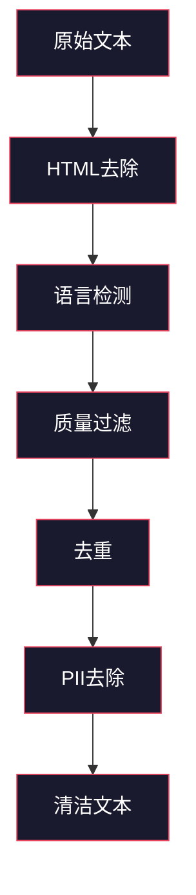
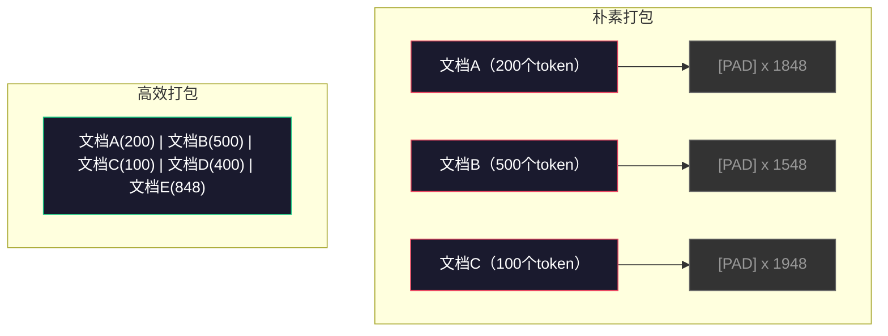

# 预训练数据流水线

> 模型是一面镜子，它反映你喂给它的一切。喂它垃圾，它就用完美的流利度反射垃圾。

**类型：** 构建
**语言：** Python
**前置知识：** 第10阶段第01-02课（分词器、构建分词器）
**预计时间：** 约90分钟

## 学习目标

- 构建流式数据流水线，能够在不将全部数据加载到内存的情况下对TB级文本进行分词、分块、打乱和批处理
- 实现真实预训练流水线中使用的数据质量过滤器（去重、语言检测、内容过滤）
- 创建具有正确注意力掩码和文档边界处理的固定长度训练序列
- 对流水线吞吐量进行分析，确保数据加载器跟得上GPU训练速度

## 问题背景

你有了分词器，现在需要数据。

不是数据集，不是CSV文件——而是TB级的文本：已清洗、已去重、经过质量过滤、分词成固定长度序列、以随机批次快速提供，速度要快到8-GPU集群永远不用等下一个批次。

大多数人认为训练大语言模型的关键在于模型架构，并非如此。Llama 3用了15.6万亿个token，GPT-3用了3000亿，DeepSeek-V2用了8.1万亿。三者的架构大体相同：堆叠的Transformer块，包含注意力层和前馈层。输出质量的差异，绝大部分来自数据。

DeepMind的Chinchilla论文对此做了精确描述。在固定计算预算下，存在最优的模型参数量与训练token数之比。Chinchilla表明，2022年大多数模型的训练严重不足——相对于它们看到的数据量，参数太多了。在1.4万亿token上训练的70B参数模型（Chinchilla最优）胜过了在3000亿token上训练的280B参数模型（Gopher）。

你的数据流水线决定模型学到的是语言还是噪声。

## 核心概念

### 数据从哪里来

每个大语言模型都在混合来源上训练。对大多数实验室来说，确切的组成是严格保密的，但我们了解足够多的信息来理解各类数据源。

| 来源 | 大小 | 质量 | 使用者 |
|------|------|------|--------|
| Common Crawl | ~250 TB原始 | 低（需要大量过滤） | GPT-3、Llama、大多数开源模型 |
| Wikipedia | ~20 GB | 高 | 所有主要大语言模型 |
| GitHub代码 | ~1 TB+ | 中（大量重复、死代码） | StarCoder、CodeLlama、DeepSeek-Coder |
| 书籍（BookCorpus、Pile） | ~100 GB | 高 | GPT-2、GPT-3、早期模型 |
| 学术论文（arXiv、S2ORC） | ~100 GB | 对STEM领域高 | Llama、Galactica |
| StackOverflow、Reddit | ~100 GB | 中 | Llama、Falcon |
| 精选网页（C4、RefinedWeb） | ~5 TB | 中高（预过滤） | T5、Falcon |

Llama 3公开了其数据混合比例：约50%网页数据、25%代码、13%书籍和学术论文、8%数学数据、4%多语言网页数据，总计来自超过5TB原始文本的15.6万亿token。

比例和总量同样重要。网页数据太多，模型就变成Reddit鹦鹉；代码太少，就不能编程；数学太少，推理就会失败。调对这个混合比例是训练大语言模型最难的部分之一，没有公式，只能靠实验和评估。

### 数据清洗

原始网页数据很脏。一次典型的Common Crawl抓取包含：

- HTML标签和JavaScript
- 样板页眉、页脚、导航菜单
- 重复页面（精确重复和近似重复）
- 机器生成的垃圾内容
- 个人可识别信息（PII）
- 低质量文本（关键词列表、SEO垃圾）
- 编码为文本的非文本内容

清洗不是可选项，它是"能生成连贯段落的模型"和"输出掺杂HTML标签的商品列表的模型"之间的分水岭。



每个步骤消除一类噪声：

**HTML去除：** 移除所有标记，只保留可见文本内容。`trafilatura`或`readability`等库在提取文章内容的同时丢弃导航、广告和样板内容。

**语言检测：** 使用fastText的语言识别模型（lid.176.bin）对每个文档分类。过滤到目标语言。置信度低于0.8的英语文档很可能不是干净的英语。

**质量过滤：** 这里开始有趣了。RefinedWeb（Falcon背后的数据集）使用基于困惑度的过滤器：在Wikipedia上训练一个小型语言模型，然后对每个文档评分。高困惑度意味着文档与Wikipedia不像——可能是垃圾内容、关键词列表或机器生成内容。困惑度超过阈值的文档被移除。

**去重：** 单一影响最大的清洗步骤。Common Crawl包含大量重复页面——法律免责声明、cookie提示、服务条款。在重复数据上训练会浪费算力，还可能导致模型逐字记忆和复现特定段落。

**PII去除：** 姓名、电子邮件地址、电话号码、社会安全号码。结构化PII用正则表达式检测，上下文中的姓名用NER模型。

### MinHash去重

精确去重很简单：对每个文档取哈希，删除重复项。但近似重复才是真正的问题。同一篇新闻文章的两个副本，周围广告略有不同，就是近似重复。内容95%相同，但逐字节比较它们不同。

MinHash + 局部敏感哈希（LSH）高效地解决了这个问题。


思路：

1. **Shingling（切片）：** 将每个文档转换为n-gram的集合（如词级5-gram或字符5-gram）。"the quick brown fox"用3词shingle变成 {"the quick brown", "quick brown fox"}。

2. **MinHash：** 对每个文档的shingle集合，计算k个哈希值。每个哈希值是在不同哈希函数下所有shingle的最小哈希值。这产生一个固定大小的"签名"，近似估计任意两个文档之间的Jaccard相似度。

3. **LSH：** 基于MinHash签名的分段将文档分到桶中。同一个桶里的文档是候选近似重复。这避免了逐对比较——只需比较候选对。

4. **验证：** 对每个候选对计算精确Jaccard相似度。如果相似度超过阈值（通常0.8），删除一个副本。

Llama团队报告称，通过去重移除了约38%的网页数据。这不是小数目——超过三分之一的Common Crawl是重复或近似重复内容。

### 序列打包

你的模型期望固定长度的输入序列，而你的文档长度各不相同——有的50个token，有的50000个。

朴素方法：把每个文档填充到最大序列长度。这在对学习毫无贡献的填充token上浪费了大量算力。

更好的方法：把多个文档打包到一个序列中，用序列结束token分隔。一个2048 token的序列可能包含三个短文档，中间用[EOS] token连接。



注意力掩码必须设置正确。文档A的token不应该关注同一打包序列中文档B的token。这需要块对角注意力掩码。

长文档在序列边界处被截断或切分。切分点很重要：在句子中间切分会强迫模型看到不完整的思想。有些流水线在可能的情况下将切分点对齐到段落或句子边界。

### Chinchilla缩放定律

对于固定计算预算C（以FLOP为单位），最优模型大小N和数据集大小D满足：

```
N_opt ~ C^0.5
D_opt ~ C^0.5
```

实际上，这意味着你应该大致等比例地扩展模型大小和数据集大小。参数量多10倍的模型，大约需要10倍多的训练token才能达到相同的损失。

| 模型 | 参数量 | 训练Token数 | Chinchilla最优？ |
|------|-------|------------|----------------|
| GPT-3 | 175B | 3000亿 | 否（训练不足3-4倍） |
| Chinchilla | 70B | 1.4万亿 | 是（按设计） |
| Llama 2 | 70B | 2万亿 | 过度训练（有意为之） |
| Llama 3 | 70B | 15万亿 | 大幅过度训练 |

Llama 3有意违背Chinchilla定律。Meta发现，在更多数据上过度训练——远超计算最优比例——能产生更好的推理模型。额外的训练成本只需支付一次，但更小的模型可以永远以更低成本提供服务。这有时被称为"推理最优"缩放方法，自2024年以来已成为行业标准。

## 动手实现

### 第一步：文本清洗

去除HTML，规范化空白，移除非文本内容。我们使用公共领域文本（Project Gutenberg）作为小型语料。

```python
import re

def clean_text(text):
    text = re.sub(r"<[^>]+>", "", text)
    text = re.sub(r"http\S+", "", text)
    text = re.sub(r"[^\x20-\x7E\n]", "", text)
    text = re.sub(r"\n{3,}", "\n\n", text)
    text = re.sub(r" {2,}", " ", text)
    return text.strip()

def quality_filter(text, min_words=50, max_ratio_caps=0.3, max_ratio_special=0.1):
    words = text.split()
    if len(words) < min_words:
        return False
    caps_ratio = sum(1 for w in words if w.isupper()) / len(words)
    if caps_ratio > max_ratio_caps:
        return False
    special_chars = sum(1 for c in text if not c.isalnum() and not c.isspace())
    if special_chars / max(len(text), 1) > max_ratio_special:
        return False
    return True
```

质量过滤器捕获SEO垃圾（全大写）、机器生成噪声（高特殊字符比例）和存根页面（太短）。仅这三个检查就能从网页抓取中过滤掉大量垃圾。

### 第二步：MinHash去重

从零实现MinHash，无需外部库，只需`hashlib`。

```python
import hashlib
from collections import defaultdict

def get_shingles(text, k=5):
    words = text.lower().split()
    if len(words) < k:
        return set()
    return {" ".join(words[i:i+k]) for i in range(len(words) - k + 1)}

def minhash_signature(shingles, num_hashes=128):
    signature = []
    for i in range(num_hashes):
        min_hash = float("inf")
        for shingle in shingles:
            h = int(hashlib.sha256(f"{i}:{shingle}".encode()).hexdigest(), 16)
            min_hash = min(min_hash, h)
        signature.append(min_hash)
    return signature

def lsh_buckets(signature, bands=16):
    rows_per_band = len(signature) // bands
    buckets = []
    for b in range(bands):
        start = b * rows_per_band
        band_data = tuple(signature[start:start + rows_per_band])
        bucket_hash = hashlib.md5(str(band_data).encode()).hexdigest()
        buckets.append((b, bucket_hash))
    return buckets

def deduplicate(documents, threshold=0.8, num_hashes=128, bands=16):
    signatures = []
    shingle_sets = []
    for doc in documents:
        shingles = get_shingles(doc)
        shingle_sets.append(shingles)
        signatures.append(minhash_signature(shingles, num_hashes))

    bucket_map = defaultdict(list)
    for doc_idx, sig in enumerate(signatures):
        for band_id, bucket_hash in lsh_buckets(sig, bands):
            bucket_map[(band_id, bucket_hash)].append(doc_idx)

    duplicate_pairs = set()
    for bucket_docs in bucket_map.values():
        if len(bucket_docs) < 2:
            continue
        for i in range(len(bucket_docs)):
            for j in range(i + 1, len(bucket_docs)):
                duplicate_pairs.add((bucket_docs[i], bucket_docs[j]))

    removed = set()
    for i, j in duplicate_pairs:
        if i in removed or j in removed:
            continue
        s1, s2 = shingle_sets[i], shingle_sets[j]
        if not s1 or not s2:
            continue
        jaccard = len(s1 & s2) / len(s1 | s2)
        if jaccard >= threshold:
            removed.add(j)

    return [doc for idx, doc in enumerate(documents) if idx not in removed], len(removed)
```

`num_hashes=128`和`bands=16`参数控制精确率-召回率的权衡。哈希数越多，相似度估计越准确。分段越多，召回率越高（捕获更多重复），但也会增加假阳性。这些数值对典型网页文本效果良好。

### 第三步：分词并打包序列

对清洗去重后的文本分词，并打包成训练用的固定长度序列。

```python
def tokenize_corpus(documents, tokenizer):
    all_tokens = []
    for doc in documents:
        tokens = tokenizer.encode(doc)
        all_tokens.extend(tokens)
        all_tokens.append(tokenizer.eos_id)
    return all_tokens

def pack_sequences(token_ids, seq_length, pad_id=0):
    sequences = []
    attention_masks = []
    for i in range(0, len(token_ids), seq_length):
        seq = token_ids[i:i + seq_length]
        mask = [1] * len(seq)
        if len(seq) < seq_length:
            pad_count = seq_length - len(seq)
            seq = seq + [pad_id] * pad_count
            mask = mask + [0] * pad_count
        sequences.append(seq)
        attention_masks.append(mask)
    return sequences, attention_masks
```

### 第四步：训练用DataLoader

产出打包序列的随机批次，这是训练循环消费的内容。

```python
import random

class PreTrainingDataLoader:
    def __init__(self, sequences, attention_masks, batch_size, shuffle=True):
        self.sequences = sequences
        self.attention_masks = attention_masks
        self.batch_size = batch_size
        self.shuffle = shuffle

    def __len__(self):
        return (len(self.sequences) + self.batch_size - 1) // self.batch_size

    def __iter__(self):
        indices = list(range(len(self.sequences)))
        if self.shuffle:
            random.shuffle(indices)
        for start in range(0, len(indices), self.batch_size):
            batch_idx = indices[start:start + self.batch_size]
            batch_seqs = [self.sequences[i] for i in batch_idx]
            batch_masks = [self.attention_masks[i] for i in batch_idx]
            yield batch_seqs, batch_masks
```

### 第五步：数据集统计

计算关键数字：总token数、唯一token数、压缩比、文档长度分布。

```python
from collections import Counter

def compute_statistics(documents, token_ids, sequences, tokenizer_vocab_size):
    total_chars = sum(len(d) for d in documents)
    total_tokens = len(token_ids)
    unique_tokens = len(set(token_ids))
    compression_ratio = total_chars / total_tokens

    doc_lengths = [len(d.split()) for d in documents]
    avg_doc_length = sum(doc_lengths) / max(len(doc_lengths), 1)
    max_doc_length = max(doc_lengths) if doc_lengths else 0
    min_doc_length = min(doc_lengths) if doc_lengths else 0

    token_counts = Counter(token_ids)
    top_tokens = token_counts.most_common(10)

    non_pad_tokens = sum(sum(1 for t in seq if t != 0) for seq in sequences)
    total_positions = sum(len(seq) for seq in sequences)
    utilization = non_pad_tokens / max(total_positions, 1)

    stats = {
        "total_documents": len(documents),
        "total_characters": total_chars,
        "total_tokens": total_tokens,
        "unique_tokens": unique_tokens,
        "vocab_utilization": unique_tokens / tokenizer_vocab_size,
        "compression_ratio": compression_ratio,
        "avg_doc_length_words": avg_doc_length,
        "max_doc_length_words": max_doc_length,
        "min_doc_length_words": min_doc_length,
        "num_sequences": len(sequences),
        "sequence_utilization": utilization,
        "top_10_tokens": top_tokens,
    }
    return stats
```

压缩比告诉你分词器在这个语料上的效率。英文文本通常每个token压缩约3-4个字符。如果你看到每个token1.5个字符，说明分词器切分太激进。如果超过8个，说明它学到了非常领域特定的合并规则。

序列利用率告诉你打包序列中有多大比例是真实数据而不是填充。低于90%意味着打包效率不高——你在填充token上浪费了算力。

## 与HuggingFace Datasets对比

通过HuggingFace的datasets库加载同一语料，对比流水线速度。

```python
from datasets import load_dataset
from transformers import AutoTokenizer

ds = load_dataset("wikitext", "wikitext-2-raw-v1", split="train")
tokenizer = AutoTokenizer.from_pretrained("meta-llama/Meta-Llama-3-8B")

import time

start = time.time()
tokenized = ds.map(
    lambda x: tokenizer(x["text"], truncation=True, max_length=2048),
    batched=True,
    num_proc=4,
)
hf_time = time.time() - start
total_tokens = sum(len(t) for t in tokenized["input_ids"])
print(f"HuggingFace：{total_tokens:,}个token，用时{hf_time:.2f}秒（{total_tokens/hf_time:,.0f} token/秒）")
```

HuggingFace流水线底层使用Rust分词器，跨4核并行处理。你的纯Python流水线会慢10-50倍。这个差距正是生产团队使用编译分词器的原因。算法是一样的，不同的是实现语言。

## 交付物

本课产出用于验证和调试大语言模型训练流水线数据质量的提示词，见 `outputs/prompt-data-quality-checker.md`。

## 练习

1. **（简单）** 使用简单启发式方法（字符集分析）向清洗流水线添加语言检测。过滤为仅保留英文文档，并测量有多少文档被删除。
2. **（中等）** 与MinHash近似去重一起，使用SHA-256哈希实现精确去重。在网页抓取语料上比较两种方法各自捕获的重复数量。
3. **（困难）** 构建基于困惑度的质量过滤器。在Wikipedia文本上训练一个小型二元语言模型，按困惑度对每个文档评分，删除后20%。对比在过滤和未过滤数据上训练时的模型输出质量。

## 关键术语

| 术语 | 常见说法 | 真正含义 |
|------|---------|---------|
| Common Crawl | "互联网" | 一个每月爬取网页的非营利组织——约250TB原始数据，大多数大语言模型训练数据的起点 |
| MinHash | "某种哈希技巧" | 使用固定大小签名估计集合之间Jaccard相似度的技术——实现大规模近似重复检测 |
| LSH（局部敏感哈希） | "Locality-Sensitive Hashing" | 将相似项分到同一桶的方法——将成对比较从O(n²)减少到近线性 |
| 序列打包（Sequence packing） | "拼接文档" | 将多个文档放入固定长度序列，使用正确的注意力掩码——消除填充浪费 |
| Chinchilla缩放（Chinchilla scaling） | "在更多数据上训练" | 在固定计算预算下，最优性能需要大致等比例地扩展模型大小和训练token数 |
| 生育率（Fertility） | "每个词的token数" | 每个词的平均token数——GPT-4中英文是1.3，非拉丁文字更高 |
| 数据混合（Data mixing） | "选择训练数据" | 代码、文本、数学、多语言数据的比例——没有公式，需要实验 |
| 困惑度过滤（Perplexity filter） | "质量评分" | 用小型语言模型对文档评分——高困惑度意味着文本与干净参考数据不像 |
| 去重（Deduplication） | "删除副本" | 消除精确和近似重复的文档——通常删除30-40%的原始网页数据 |
| 注意力掩码（Attention mask） | "看哪些token" | 防止在打包序列中跨文档边界注意的二进制掩码 |

## 延伸阅读

- [Hoffmann et al., 2022 — Training Compute-Optimal Large Language Models（Chinchilla）](https://arxiv.org/abs/2203.15556) — 改变我们思考数据规模方式的论文
- [Penedo et al., 2023 — The RefinedWeb Dataset for Falcon LLM](https://arxiv.org/abs/2306.01116) — 如何将Common Crawl过滤为高质量数据
- [Touvron et al., 2023 — Llama 2: Open Foundation and Fine-Tuned Chat Models](https://arxiv.org/abs/2307.09288) — Llama 2的数据流水线详情
- [Lee et al., 2022 — Deduplicating Training Data Makes Language Models Better](https://arxiv.org/abs/2107.06499) — 为什么去重比你想象的更重要
- [Broder, 1997 — On the Resemblance and Containment of Documents](https://ieeexplore.ieee.org/document/666900) — 原始MinHash论文
- [Meta, 2024 — Llama 3 Technical Report](https://arxiv.org/abs/2407.21783) — 15.6万亿token、数据混合比例、过滤流水线
