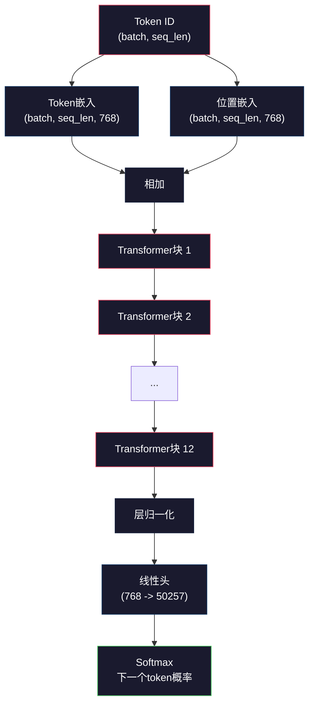
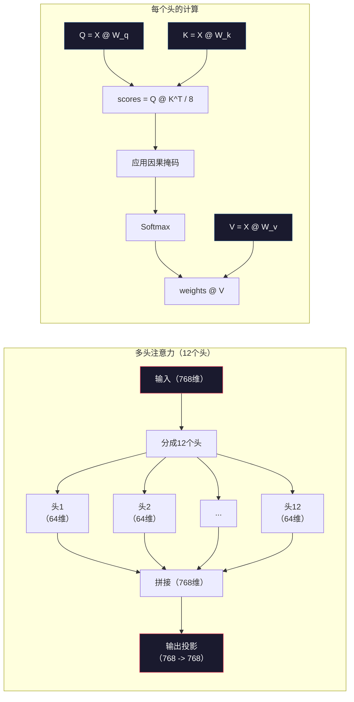
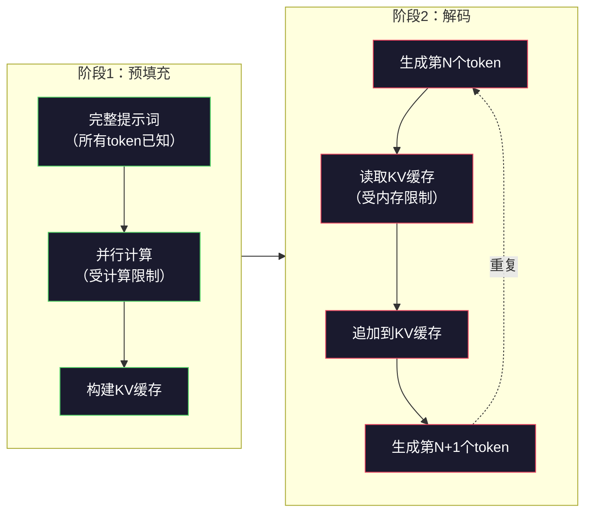

# 预训练迷你GPT（1.24亿参数）

> GPT-2 Small有1.24亿个参数——12个Transformer层、12个注意力头、768维嵌入。你可以在单张GPU上从零开始训练，只需几小时。大多数人从不这么做，他们直接使用预训练检查点。但如果你没有亲手训练过一个，你其实并不真正理解你用来构建产品的模型内部发生了什么。

**类型：** 构建
**语言：** Python（使用numpy）
**前置知识：** 第10阶段第01-03课（分词器、构建分词器、数据流水线）
**预计时间：** 约120分钟

## 学习目标

- 从零实现完整的GPT-2架构（1.24亿参数）：token嵌入、位置嵌入、Transformer块和语言模型头
- 使用下一个token预测和交叉熵损失在文本语料上训练GPT模型
- 实现带温度采样和top-k/top-p过滤的自回归文本生成
- 监控训练损失曲线，验证模型学到了连贯的语言模式

## 问题背景

你知道什么是Transformer。你读过那些图，能背诵"注意力就是全部"，能在白板上画出标着"多头注意力"的方框。

但这些都不等于你理解了模型生成文本时究竟发生了什么。

GPT-2 Small有124,438,272个参数，每一个都是通过运行训练循环设置的：前向传播、计算损失、反向传播、更新权重。十二个Transformer块，每块十二个注意力头，768维嵌入空间，50,257个token的词表。每次模型生成一个token，全部1.24亿个参数都参与一条矩阵乘法链，将一个token ID序列转化为下一个token的概率分布。

如果你从未自己构建过这个，你就是在与黑盒打交道。你可以调用API，可以微调，但当出错时——当模型产生幻觉、不停重复、拒绝遵循指令——你没有关于"为什么"的心智模型。

本课从零构建GPT-2 Small，不用PyTorch，用numpy。每一次矩阵乘法都清晰可见，每一个梯度都由你的代码计算。你将亲眼看到1.24亿个数字如何共谋预测下一个词。

## 核心概念

### GPT架构

GPT是自回归语言模型。"自回归"意味着它一次生成一个token，每个token以所有前驱token为条件。架构是一叠Transformer解码器块。

从token ID到下一个token概率的完整计算图：

1. 输入token ID，形状：(batch_size, seq_len)
2. Token嵌入查找，每个ID映射到768维向量，形状：(batch_size, seq_len, 768)
3. 位置嵌入查找，每个位置（0, 1, 2, ...）映射到768维向量，形状相同
4. 相加token嵌入和位置嵌入
5. 通过12个Transformer块
6. 最终层归一化
7. 线性投影到词表大小，形状：(batch_size, seq_len, vocab_size)
8. Softmax得到概率

这就是整个模型——没有卷积，没有循环，只是嵌入、注意力、前馈网络和层归一化叠加了12次。



### Transformer块

12个块中的每一个遵循相同的模式。预归一化架构（GPT-2使用预归一化，而非原始Transformer的后归一化）：

1. 层归一化（LayerNorm）
2. 多头自注意力
3. 残差连接（将输入加回）
4. 层归一化
5. 前馈网络（MLP）
6. 残差连接（将输入加回）

残差连接至关重要。没有它们，反向传播时梯度在到达第1块之前就会消失。有了它们，梯度可以通过"跳跃"路径直接从损失流向任何层。这就是为什么可以叠加12、32甚至96个块（GPT-4据传使用120个）。

### 注意力：核心机制

自注意力让每个token可以关注所有前驱token，并决定对每个的关注程度。数学如下：

对每个token位置，从输入计算三个向量：
- **查询（Q）**："我在寻找什么？"
- **键（K）**："我包含什么？"
- **值（V）**："我携带什么信息？"

```
Q = input @ W_q    (768 -> 768)
K = input @ W_k    (768 -> 768)
V = input @ W_v    (768 -> 768)

attention_scores = Q @ K^T / sqrt(d_k)
attention_scores = mask(attention_scores)   # 因果掩码：未来位置设为-inf
attention_weights = softmax(attention_scores)
output = attention_weights @ V
```

因果掩码使GPT成为自回归的。位置5可以关注位置0-5，但不能关注6、7、8及之后的位置。这防止模型在训练时通过"作弊"查看未来token。

**多头注意力**将768维空间分成12个64维的头。每个头学习不同的注意力模式：有的头可能追踪句法关系（主谓一致），有的追踪语义相似性（同义词），有的追踪位置临近性（相邻词）。所有12个头的输出被拼接后投影回768维。



除以sqrt(d_k)——sqrt(64) = 8——是缩放。没有它，高维向量的点积会变得很大，把softmax推入梯度几乎为零的区域。这是原始"Attention Is All You Need"论文中的关键洞察之一。

### KV缓存：为什么推理很快

训练时，你一次性处理整个序列；推理时，你一次生成一个token。没有优化的话，生成第N个token需要对前N-1个token重新计算注意力。这是每个生成token O(N²)，或者对长度为N的序列总计O(N³)。

KV缓存解决了这个问题。计算每个token的K和V后，存储起来。生成第N+1个token时，只需为新token计算Q，然后查找所有前驱token的缓存K和V。这将K和V计算的每token成本从O(N)降到O(1)。注意力分数计算仍然是O(N)（因为要关注所有前驱位置），但避免了在输入上的冗余矩阵乘法。

对于有12层和12个头的GPT-2，KV缓存每个token存储 2（K+V）× 12层 × 12头 × 64维 = 18,432个值。1024 token的序列约需75MB（FP32）。对于有128层的Llama 3 405B，单条序列的KV缓存可能超过10GB。这就是长上下文推理受内存限制的原因。

### 预填充与解码：推理的两个阶段

当你向大语言模型发送提示词时，推理分两个截然不同的阶段进行。

**预填充**并行处理你的整个提示词。所有token都已知，所以模型可以同时计算所有位置的注意力。这个阶段受计算限制——GPU正在满负荷进行矩阵乘法。A100上一个1000 token的提示词，预填充大约需要20-50毫秒。

**解码**一次生成一个token。每个新token依赖所有前驱token。这个阶段受内存限制——瓶颈是从GPU内存读取模型权重和KV缓存，而非矩阵数学本身。GPU的计算核心大部分时间在等待内存读取。对GPT-2来说，每步解码时间大致相同，无论矩阵乘法需要多少FLOP，因为内存带宽是制约因素。

这个区别对生产系统很重要。预填充吞吐量随GPU算力扩展（更多FLOPS = 更快预填充）；解码吞吐量随内存带宽扩展（更快内存 = 更快生成token）。这就是NVIDIA H100相比A100着重提升内存带宽的原因——直接加速token生成。



### 训练循环

训练大语言模型就是下一个token预测。给定token序列 [0, 1, 2, ..., N-1]，预测 [1, 2, 3, ..., N]。损失函数是模型预测的概率分布与实际下一个token之间的交叉熵。

一个训练步骤：

1. **前向传播**：将批次通过所有12个块，得到每个位置的logit（softmax前的分数）。
2. **计算损失**：logit与目标token（输入序列向右移动一位）之间的交叉熵。
3. **反向传播**：使用反向传播计算全部1.24亿参数的梯度。
4. **优化器步骤**：更新权重。GPT-2使用带学习率预热和余弦衰减的Adam。

学习率调度比你预期的更重要。GPT-2在前2000步从0升温到峰值学习率，然后按余弦曲线衰减。从高学习率开始会导致模型发散，保持恒定高学习率会在后期训练中造成振荡。预热后衰减的模式被每个主要大语言模型采用。

### GPT-2 Small：数字

| 组件 | 形状 | 参数量 |
|------|------|--------|
| Token嵌入 | (50257, 768) | 38,597,376 |
| 位置嵌入 | (1024, 768) | 786,432 |
| 每块注意力（W_q, W_k, W_v, W_out） | 4 × (768, 768) | 2,359,296 |
| 每块FFN（上升 + 下降） | (768, 3072) + (3072, 768) | 4,718,592 |
| 每块LayerNorm（2个） | 2 × 768 × 2 | 3,072 |
| 最终LayerNorm | 768 × 2 | 1,536 |
| **每块合计** | | **7,080,960** |
| **总计（12块）** | | **85,054,464 + 39,383,808 = 124,438,272** |

输出投影（logit头）与token嵌入矩阵共享权重，称为权重绑定——减少了3800万参数，并提升了性能，因为它迫使模型对输入和输出使用相同的表示空间。

## 动手实现

### 第一步：嵌入层

Token嵌入将50,257个可能的token中的每一个映射到768维向量。位置嵌入添加每个token在序列中所在位置的信息。两者相加。

```python
import numpy as np

class Embedding:
    def __init__(self, vocab_size, embed_dim, max_seq_len):
        self.token_embed = np.random.randn(vocab_size, embed_dim) * 0.02
        self.pos_embed = np.random.randn(max_seq_len, embed_dim) * 0.02

    def forward(self, token_ids):
        seq_len = token_ids.shape[-1]
        tok_emb = self.token_embed[token_ids]
        pos_emb = self.pos_embed[:seq_len]
        return tok_emb + pos_emb
```

初始化标准差0.02来自GPT-2论文。太大会导致初始前向传播产生极端值，破坏训练稳定性；太小则所有输入的初始输出几乎相同，使早期梯度信号毫无用处。

### 第二步：带因果掩码的自注意力

先实现单头注意力。因果掩码在softmax前将未来位置设为负无穷，确保每个位置只能关注自身和更早的位置。

```python
def attention(Q, K, V, mask=None):
    d_k = Q.shape[-1]
    scores = Q @ K.transpose(0, -1, -2 if Q.ndim == 4 else 1) / np.sqrt(d_k)
    if mask is not None:
        scores = scores + mask
    weights = np.exp(scores - scores.max(axis=-1, keepdims=True))
    weights = weights / weights.sum(axis=-1, keepdims=True)
    return weights @ V
```

softmax实现在指数化前减去最大值。不这么做的话，exp(大数)会溢出为无穷。这是数值稳定性技巧，不改变输出，因为对任何常数c，softmax(x - c) = softmax(x)。

### 第三步：多头注意力

将768维输入分成12个64维的头，每个头独立计算注意力，拼接结果后投影回768维。

```python
class MultiHeadAttention:
    def __init__(self, embed_dim, num_heads):
        self.num_heads = num_heads
        self.head_dim = embed_dim // num_heads
        self.W_q = np.random.randn(embed_dim, embed_dim) * 0.02
        self.W_k = np.random.randn(embed_dim, embed_dim) * 0.02
        self.W_v = np.random.randn(embed_dim, embed_dim) * 0.02
        self.W_out = np.random.randn(embed_dim, embed_dim) * 0.02

    def forward(self, x, mask=None):
        batch, seq_len, d = x.shape
        Q = (x @ self.W_q).reshape(batch, seq_len, self.num_heads, self.head_dim).transpose(0, 2, 1, 3)
        K = (x @ self.W_k).reshape(batch, seq_len, self.num_heads, self.head_dim).transpose(0, 2, 1, 3)
        V = (x @ self.W_v).reshape(batch, seq_len, self.num_heads, self.head_dim).transpose(0, 2, 1, 3)

        scores = Q @ K.transpose(0, 1, 3, 2) / np.sqrt(self.head_dim)
        if mask is not None:
            scores = scores + mask
        weights = np.exp(scores - scores.max(axis=-1, keepdims=True))
        weights = weights / weights.sum(axis=-1, keepdims=True)
        attn_out = weights @ V

        attn_out = attn_out.transpose(0, 2, 1, 3).reshape(batch, seq_len, d)
        return attn_out @ self.W_out
```

reshape-transpose-reshape的过程是多头注意力最令人困惑的部分。发生了什么：(batch, seq_len, 768)张量变为(batch, seq_len, 12, 64)，再变为(batch, 12, seq_len, 64)。现在12个头各自有自己的(seq_len, 64)矩阵来运行注意力。注意力计算后，逆向操作：(batch, 12, seq_len, 64)变为(batch, seq_len, 12, 64)，再变为(batch, seq_len, 768)。

### 第四步：Transformer块

一个完整的Transformer块：LayerNorm、带残差的多头注意力、LayerNorm、带残差的前馈网络。

```python
class LayerNorm:
    def __init__(self, dim, eps=1e-5):
        self.gamma = np.ones(dim)
        self.beta = np.zeros(dim)
        self.eps = eps

    def forward(self, x):
        mean = x.mean(axis=-1, keepdims=True)
        var = x.var(axis=-1, keepdims=True)
        return self.gamma * (x - mean) / np.sqrt(var + self.eps) + self.beta


class FeedForward:
    def __init__(self, embed_dim, ff_dim):
        self.W1 = np.random.randn(embed_dim, ff_dim) * 0.02
        self.b1 = np.zeros(ff_dim)
        self.W2 = np.random.randn(ff_dim, embed_dim) * 0.02
        self.b2 = np.zeros(embed_dim)

    def forward(self, x):
        h = x @ self.W1 + self.b1
        h = np.maximum(0, h)  # GELU近似：为简单起见使用ReLU
        return h @ self.W2 + self.b2


class TransformerBlock:
    def __init__(self, embed_dim, num_heads, ff_dim):
        self.ln1 = LayerNorm(embed_dim)
        self.attn = MultiHeadAttention(embed_dim, num_heads)
        self.ln2 = LayerNorm(embed_dim)
        self.ffn = FeedForward(embed_dim, ff_dim)

    def forward(self, x, mask=None):
        x = x + self.attn.forward(self.ln1.forward(x), mask)
        x = x + self.ffn.forward(self.ln2.forward(x))
        return x
```

前馈网络将768维输入扩展到3,072维（4倍），应用非线性，再投影回768维。这种扩展-收缩的模式让模型在每个位置有更"宽"的内部表示可以利用。GPT-2使用GELU激活，但这里为简单起见使用ReLU——对理解架构来说差别不大。

### 第五步：完整GPT模型

叠加12个Transformer块，前面加嵌入层，后面加输出投影。

```python
class MiniGPT:
    def __init__(self, vocab_size=50257, embed_dim=768, num_heads=12,
                 num_layers=12, max_seq_len=1024, ff_dim=3072):
        self.embedding = Embedding(vocab_size, embed_dim, max_seq_len)
        self.blocks = [
            TransformerBlock(embed_dim, num_heads, ff_dim)
            for _ in range(num_layers)
        ]
        self.ln_f = LayerNorm(embed_dim)
        self.vocab_size = vocab_size
        self.embed_dim = embed_dim

    def forward(self, token_ids):
        seq_len = token_ids.shape[-1]
        mask = np.triu(np.full((seq_len, seq_len), -1e9), k=1)

        x = self.embedding.forward(token_ids)
        for block in self.blocks:
            x = block.forward(x, mask)
        x = self.ln_f.forward(x)

        logits = x @ self.embedding.token_embed.T
        return logits

    def count_parameters(self):
        total = 0
        total += self.embedding.token_embed.size
        total += self.embedding.pos_embed.size
        for block in self.blocks:
            total += block.attn.W_q.size + block.attn.W_k.size
            total += block.attn.W_v.size + block.attn.W_out.size
            total += block.ffn.W1.size + block.ffn.b1.size
            total += block.ffn.W2.size + block.ffn.b2.size
            total += block.ln1.gamma.size + block.ln1.beta.size
            total += block.ln2.gamma.size + block.ln2.beta.size
        total += self.ln_f.gamma.size + self.ln_f.beta.size
        return total
```

注意权重绑定：`logits = x @ self.embedding.token_embed.T`。输出投影复用了（转置的）token嵌入矩阵。这不仅仅是节省参数的技巧——它意味着模型对理解token（嵌入）和预测token（输出）使用相同的向量空间。

### 第六步：训练循环

对1.24亿参数的真实训练运行，你需要GPU和PyTorch。这个训练循环在纯numpy的小型模型上演示机制，使用极小模型（4层、4头、128维）使其可运行。

```python
def cross_entropy_loss(logits, targets):
    batch, seq_len, vocab_size = logits.shape
    logits_flat = logits.reshape(-1, vocab_size)
    targets_flat = targets.reshape(-1)

    max_logits = logits_flat.max(axis=-1, keepdims=True)
    log_softmax = logits_flat - max_logits - np.log(
        np.exp(logits_flat - max_logits).sum(axis=-1, keepdims=True)
    )

    loss = -log_softmax[np.arange(len(targets_flat)), targets_flat].mean()
    return loss


def train_mini_gpt(text, vocab_size=256, embed_dim=128, num_heads=4,
                   num_layers=4, seq_len=64, num_steps=200, lr=3e-4):
    tokens = np.array(list(text.encode("utf-8")[:2048]))
    model = MiniGPT(
        vocab_size=vocab_size, embed_dim=embed_dim, num_heads=num_heads,
        num_layers=num_layers, max_seq_len=seq_len, ff_dim=embed_dim * 4
    )

    print(f"模型参数量：{model.count_parameters():,}")
    print(f"训练token数：{len(tokens):,}")
    print(f"配置：{num_layers}层、{num_heads}头、{embed_dim}维")
    print()

    for step in range(num_steps):
        start_idx = np.random.randint(0, max(1, len(tokens) - seq_len - 1))
        batch_tokens = tokens[start_idx:start_idx + seq_len + 1]

        input_ids = batch_tokens[:-1].reshape(1, -1)
        target_ids = batch_tokens[1:].reshape(1, -1)

        logits = model.forward(input_ids)
        loss = cross_entropy_loss(logits, target_ids)

        if step % 20 == 0:
            print(f"步骤 {step:4d} | 损失：{loss:.4f}")

    return model
```

损失从ln(vocab_size)附近开始——对于256 token的字节级词表，这是ln(256) = 5.55。随机模型对每个token分配相等概率。随着训练进行，损失下降，因为模型学到了预测常见模式："t"后跟"h"，句号后跟空格，等等。

在生产中，你会使用带梯度累积、学习率预热和梯度裁剪的Adam优化器。前向传播-损失-反向传播-更新的循环是相同的，只是优化器更复杂。

### 第七步：文本生成

生成使用训练好的模型一次预测一个token。每次预测从输出分布中采样（或贪心地取argmax）。

```python
def generate(model, prompt_tokens, max_new_tokens=100, temperature=0.8):
    tokens = list(prompt_tokens)
    seq_len = model.embedding.pos_embed.shape[0]

    for _ in range(max_new_tokens):
        context = np.array(tokens[-seq_len:]).reshape(1, -1)
        logits = model.forward(context)
        next_logits = logits[0, -1, :]

        next_logits = next_logits / temperature
        probs = np.exp(next_logits - next_logits.max())
        probs = probs / probs.sum()

        next_token = np.random.choice(len(probs), p=probs)
        tokens.append(next_token)

    return tokens
```

温度控制随机性。温度1.0使用原始分布；温度0.5使分布更尖锐（更确定性——模型更频繁选择其顶部选项）；温度1.5使分布更平坦（更随机——低概率token获得更大机会）；温度0.0是贪心解码（总是选择最高概率token）。

`tokens[-seq_len:]`窗口是必要的，因为模型有最大上下文长度（GPT-2是1024）。一旦超过，你必须丢弃最旧的token。这就是每个人都在谈论的"上下文窗口"。

## 完整训练和生成示例

```python
corpus = """The transformer architecture has revolutionized natural language processing.
Attention mechanisms allow the model to focus on relevant parts of the input.
Self-attention computes relationships between all pairs of positions in a sequence.
Multi-head attention splits the representation into multiple subspaces.
Each attention head can learn different types of relationships.
The feedforward network provides nonlinear transformations at each position.
Residual connections enable gradient flow through deep networks.
Layer normalization stabilizes training by normalizing activations.
Position embeddings give the model information about token ordering.
The causal mask ensures autoregressive generation during training.
Pre-training on large text corpora teaches the model general language understanding.
Fine-tuning adapts the pre-trained model to specific downstream tasks."""

model = train_mini_gpt(corpus, num_steps=200)

prompt = list("The transformer".encode("utf-8"))
output_tokens = generate(model, prompt, max_new_tokens=100, temperature=0.8)
generated_text = bytes(output_tokens).decode("utf-8", errors="replace")
print(f"\n生成文本：{generated_text}")
```

在小语料和小模型上，生成的文本顶多是半连贯的。它能学到一些来自训练文本的字节级模式，但无法像GPT-2（训练了40GB数据和完整1.24亿参数架构）那样泛化。关键不在于输出质量，而在于你可以追踪每一步：嵌入查找、注意力计算、前馈变换、logit投影、softmax和采样——每个操作都清晰可见。

## 交付物

本课产出 `outputs/prompt-gpt-architecture-analyzer.md`——一个分析任何GPT风格模型架构选择的提示词。输入模型卡或技术报告，它会分解参数分配、注意力设计和缩放决策。

## 练习

1. 将模型改为24层、16头，而不是12/12。计算参数量。倍增深度与倍增宽度（嵌入维度）相比如何？

2. 实现GELU激活函数（GELU(x) = x × 0.5 × (1 + erf(x / sqrt(2)))），替换前馈网络中的ReLU。用每种激活函数各训练500步，对比最终损失。

3. 向生成函数添加KV缓存。在首次前向传播后存储每层的K和V张量，并在后续token中复用。测量加速效果：分别带缓存和不带缓存生成200个token，对比实际用时。

4. 实现top-k采样（只考虑概率最高的k个token）和top-p采样（核采样：考虑累积概率超过p的最小token集合）。在温度0.8下对比top-k=50和top-p=0.95的输出质量。

5. 构建训练损失曲线绘图器。训练模型1000步并绘制损失-步数曲线。识别三个阶段：快速初始下降（学习常见字节）、较慢的中间阶段（学习字节模式）和平台期（在小语料上过拟合）。这条曲线的形状无论是训练128维模型还是GPT-4都是相同的。

## 关键术语

| 术语 | 常见说法 | 真正含义 |
|------|---------|---------|
| 自回归（Autoregressive） | "一次生成一个词" | 每个输出token以所有前驱token为条件——模型预测 P(token_n \| token_0, ..., token_{n-1}) |
| 因果掩码（Causal mask） | "看不到未来" | 防止训练时关注未来位置的上三角负无穷矩阵 |
| 多头注意力（Multi-head attention） | "多种注意力模式" | 将Q、K、V分成并行的头（GPT-2中12个64维的头），每个头学习不同的关系类型 |
| KV缓存（KV Cache） | "缓存加速" | 存储前驱token的已计算Key和Value张量，避免自回归生成中的冗余计算 |
| 预填充（Prefill） | "处理提示词" | 第一个推理阶段，所有提示词token并行处理——受GPU FLOPS限制 |
| 解码（Decode） | "生成token" | 第二个推理阶段，一次生成一个token——受GPU带宽限制 |
| 权重绑定（Weight tying） | "共享嵌入" | 对输入token嵌入和输出投影头使用同一矩阵——GPT-2节省了3800万参数 |
| 残差连接（Residual connection） | "跳跃连接" | 将输入直接加到子层输出（x + sublayer(x)）——在深层网络中支持梯度流动 |
| 层归一化（Layer normalization） | "归一化激活值" | 在特征维度上归一化到均值0、方差1，带可学习的缩放和偏置参数 |
| 交叉熵损失（Cross-entropy loss） | "预测有多错" | 分配给正确下一个token的概率的负对数，在所有位置平均——标准大语言模型训练目标 |

## 延伸阅读

- [Radford et al., 2019 — "Language Models are Unsupervised Multitask Learners"（GPT-2）](https://cdn.openai.com/better-language-models/language_models_are_unsupervised_multitask_learners.pdf) — 引入124M到1.5B参数系列的GPT-2论文
- [Vaswani et al., 2017 — "Attention Is All You Need"](https://arxiv.org/abs/1706.03762) — 提出缩放点积注意力和多头注意力的原始Transformer论文
- [Llama 3技术报告](https://arxiv.org/abs/2407.21783) — Meta如何使用16K GPU将GPT架构扩展到4050亿参数
- [Pope et al., 2022 — "Efficiently Scaling Transformer Inference"](https://arxiv.org/abs/2211.05102) — 形式化预填充与解码及KV缓存分析的论文
