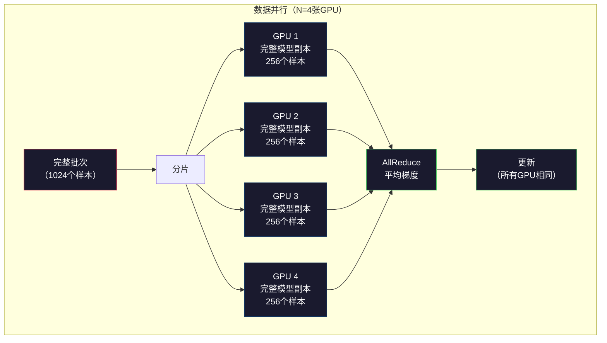
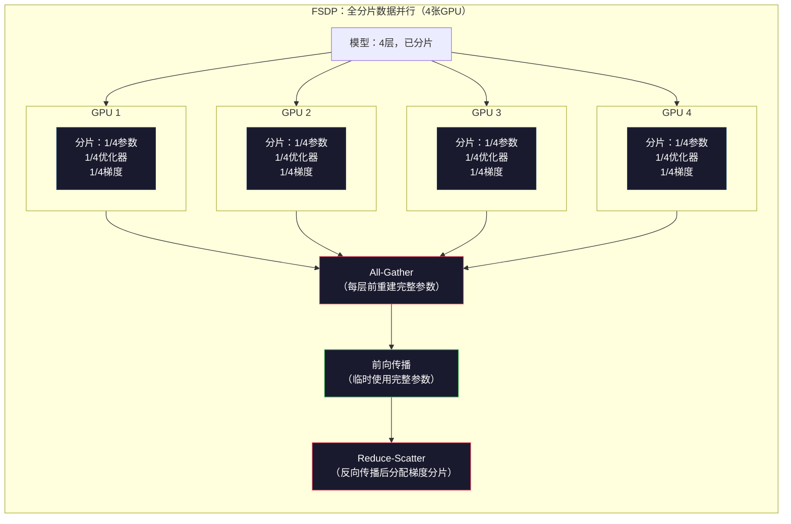
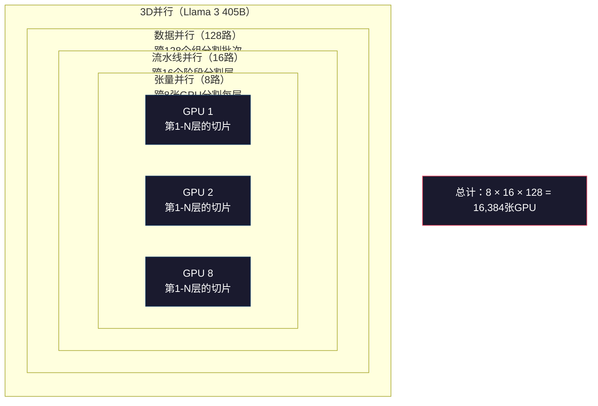

# 扩展规模：分布式训练、FSDP、DeepSpeed

> 你的1.24亿参数模型在单张GPU上跑通了。现在试试70亿参数。模型装不进内存，单机跑数据要几周。规模化训练里，分布式不是可选项，而是唯一出路。

**类型：** 构建
**语言：** Python
**前置知识：** 第10阶段第04课（预训练迷你GPT）
**预计时间：** 约120分钟

## 学习目标

- 解释三种并行方式（数据并行、张量并行、流水线并行）以及基于模型和集群规模何时需要各种方式
- 使用PyTorch DDP实现数据并行训练，跨多GPU同步梯度
- 计算给定模型大小的内存预算（权重+优化器状态+梯度+激活值），确定最低硬件需求
- 配置FSDP或DeepSpeed ZeRO分片，跨GPU分片模型状态，使超过单GPU内存的模型能够训练

## 问题背景

FP16格式的70亿参数模型，仅权重就需要14GB。Adam优化器为每个参数存储两份额外副本（一阶矩和二阶矩估计），还需要28GB。反向传播期间的梯度再加14GB。在存储一个激活值之前，你已经用了56GB。

NVIDIA A100有80GB内存。

56GB已用，还剩24GB给激活值——前向传播期间计算的、反向传播必须保留的中间值。对于4096维模型的2048 token序列，单层激活值约占64MB。32层需要每个样本2GB，批大小8需要16GB，刚好有24GB——批大小12就爆了。

现在试试700亿参数。仅权重：FP16格式140GB。一张GPU装不下，光装权重就至少需要2张A100（2×80GB=160GB），加上优化器状态和梯度还需要更多：最低3张GPU，实际上根据分片策略需要8-16张。

Llama 3 405B在16,384张NVIDIA H100上训练，估计算力成本1亿美元。DeepSeek V3通过在架构（混合专家架构意味着每个token只激活一小部分参数）和训练效率上动脑筋，用约560万美元训练了一个差不多的模型。

本课介绍四种使大规模训练成为可能的策略：数据并行、张量并行、流水线并行和全分片数据并行。你将用纯Python模拟每一种，在接触分布式训练框架之前理解其机制。

## 核心概念

### 为什么需要分布式

以下是真实模型的内存计算，每个数字都是算出来的，不是估计值。

| 模型 | 参数量 | 权重（FP16） | Adam状态 | 梯度（FP16） | 合计（不含激活值） |
|------|-------|------------|---------|------------|-----------------|
| GPT-2 Small | 1.24亿 | 248 MB | 992 MB | 248 MB | 1.5 GB |
| Llama 3 8B | 80亿 | 16 GB | 64 GB | 16 GB | 96 GB |
| Llama 3 70B | 700亿 | 140 GB | 560 GB | 140 GB | 840 GB |
| Llama 3 405B | 4050亿 | 810 GB | 3,240 GB | 810 GB | 4,860 GB |

"Adam状态"这列是杀手。Adam以FP32格式为每个参数存储运行均值（m）和运行方差（v）。对于700亿参数模型，那是700亿×4字节×2=560GB——仅优化器就需要7张A100。

单张H100有80GB，Llama 3 405B至少需要61张H100才能容纳权重、优化器和梯度。加上激活值数量还会增加。Meta使用16,384张GPU不是因为他们想要——而是因为他们不得不。

### 数据并行

最简单的分布式策略。将完整模型复制到N张GPU，将每个训练批次分成N份，每张GPU对其数据分片进行前向和反向传播。反向传播后，跨所有GPU平均梯度。每张GPU用相同的平均梯度更新其权重副本，保持所有副本同步。

**优点：** 线性吞吐量扩展。N张GPU每步处理N倍数据。通信仅限于梯度平均，可与计算重叠。

**缺点：** 每张GPU都持有完整的模型、优化器状态和梯度副本。对于700亿参数模型，每张GPU需要840GB。数据并行对降低单GPU内存毫无帮助，只减少训练时间。

**数学：** 有效批大小 = 每GPU批大小 × N。N=64张GPU，每GPU批大小16，有效批大小为1024。Llama 3每步使用1600万token的有效批大小。



### 张量并行

将单个层分布到多张GPU上。单次矩阵乘法在GPU间分割，每张GPU计算部分结果。

考虑前馈层中形状为(8192, 8192)的权重矩阵。4路张量并行时，每张GPU持有(8192, 2048)的分片。每张GPU将输入乘以其分片，得到部分结果。部分结果通过all-reduce或all-gather合并，产生完整输出。

**优点：** 减少每GPU的模型权重内存。700亿模型分布到8张GPU，每张GPU持有约87.5亿参数的权重。

**缺点：** 每层后都需要快速GPU间通信。每次矩阵乘法后的all-reduce增加延迟。NVLink（同节点GPU间900 GB/s）效果好，但InfiniBand跨节点（400 Gb/s，约50 GB/s）效果差。张量并行几乎总是限制在单节点内（8张GPU）。

**实际应用：** Megatron-LM开创了张量并行。Llama 3 405B在每个节点内使用8路张量并行。

### 流水线并行

按层分割模型。GPU 1运行第1-8层，GPU 2运行第9-16层，GPU 3运行第17-24层，GPU 4运行第25-32层。数据流过流水线：GPU 1计算其层后将激活值发给GPU 2，GPU 2计算后发给GPU 3，以此类推。

**优点：** GPU间通信最少——只有层边界处的激活值，比梯度或权重小得多。因为带宽要求低，可以跨节点工作。

**缺点：** 流水线气泡。当GPU 4在对第1个微批次做前向传播时，GPU 1、2、3处于空闲（它们已经完成了前向传播）。反向传播时模式相反。朴素流水线，N个流水线阶段时GPU利用率只有1/N。

**GPipe和PipeDream**通过将批次分成微批次解决气泡问题。GPU 1完成微批次1的前向传播后立即开始微批次2。M个微批次和N个阶段，气泡比例降至(N-1)/M。N=4阶段、M=16微批次，气泡是3/16=18.75%的空闲时间。

### FSDP：全分片数据并行

FSDP结合了数据并行的可扩展性和分片的内存效率。不是每张GPU持有完整的模型副本，而是每张GPU只持有1/N的参数、梯度和优化器状态。

在某层前向传播前，FSDP运行**all-gather**将完整参数从所有GPU收集到每张GPU的内存中。前向传播后，每张GPU丢弃非本地参数。反向传播时，all-gather再次运行重建参数以计算梯度。反向传播后，**reduce-scatter**分配梯度分片，每张GPU只存储1/N的梯度。

**8张GPU上700亿模型的计算：**

| 组件 | 无FSDP | 有FSDP |
|------|--------|--------|
| 权重（FP16） | 每GPU 140 GB | 每GPU 17.5 GB |
| Adam状态（FP32） | 每GPU 560 GB | 每GPU 70 GB |
| 梯度（FP16） | 每GPU 140 GB | 每GPU 17.5 GB |
| **合计** | **每GPU 840 GB** | **每GPU 105 GB** |

没有FSDP，700亿模型装不进单张80GB GPU。8张GPU开FSDP，每张105GB——等一下，还是装不下。你至少需要16张GPU才能让每GPU低于80GB，或者结合FSDP和激活检查点（反向传播时重新计算激活值而不是存储它们）。

通信成本比朴素数据并行更高，因为每层前都要all-gather。但内存节省使以前不可能的训练成为可能。



### DeepSpeed ZeRO

DeepSpeed的ZeRO（零冗余优化器）在概念上与FSDP完全相同，但由微软独立开发。它定义了三个阶段，每个阶段分片更激进：

| 阶段 | 分片内容 | 内存节省 | 通信 |
|------|---------|---------|------|
| ZeRO-1 | 仅优化器状态 | ~4倍减少 | 与数据并行相同 |
| ZeRO-2 | +梯度 | ~8倍减少 | 略多 |
| ZeRO-3 | +参数 | ~N倍减少（N张GPU） | 每层all-gather |

ZeRO-3等同于FSDP，名称不同，机制相同。DeepSpeed证明了这个概念后，PyTorch将FSDP作为原生实现加入。

DeepSpeed还引入了ZeRO-Offload（将优化器状态卸载到CPU RAM，更便宜且更大）和ZeRO-Infinity（卸载到NVMe SSD）。这些方案以计算速度换取内存容量——卸载的操作更慢，但释放了GPU内存。

### 混合精度训练

现代训练同时使用多种浮点格式：

- **前向传播**：FP16或BF16（16位）。内存是FP32的一半，矩阵乘法在张量核心上快2倍。
- **主权重**：FP32（32位）。优化器在权重更新时为数值精度保留FP32。
- **损失缩放**：反向传播前将损失乘以一个大常数，防止FP16梯度下溢到零。优化器步骤前除以同一常数。

BF16（脑浮点16）与FP32的指数范围相同（8位指数），但精度降低（7位尾数，vs FP32的23位）。很少需要损失缩放，因为它能表示相同的数值范围。FP16有5位指数和10位尾数——能表示精细值，但在极端量级下会溢出/下溢。

Google的TPU原生使用BF16，NVIDIA的A100和H100都支持FP16和BF16。行业已基本转向BF16，因为它消除了损失缩放的麻烦。

**70亿模型的内存对比：**

| 精度 | 权重 | 优化器 | 梯度 | 合计 |
|------|------|--------|------|------|
| 全FP32 | 28 GB | 56 GB | 28 GB | 112 GB |
| 混合（BF16 + FP32主权重） | 14 GB | 56 GB | 14 GB | 84 GB |

混合精度节省了28GB。优化器状态无论如何都保持FP32——这就是大部分内存的去向。

### Megatron-LM与3D并行

真正的大规模训练结合了全部三种并行方式：

- **数据并行**：跨节点组（扩展批大小）
- **张量并行**：节点内（将层分布到8张GPU）
- **流水线并行**：跨节点（将层组分布到不同机器）

16,384张H100上的Llama 3 405B：
- 节点内8路张量并行（每节点8张GPU）
- 跨节点16路流水线并行（16个流水线阶段）
- 剩余维度128路数据并行（16,384 / 8 / 16 = 128）

这种3D分解（8 × 16 × 128 = 16,384）是扩展到数千张GPU的方式。每张GPU看到不同的数据分片（数据并行）、持有每层的一个切片（张量并行）、计算不同的层组（流水线并行）。

DeepSeek V3采用了不同的方法。其混合专家架构每个token只激活6710亿参数中的370亿。这意味着每张GPU只需要计算（并存储激活值）活跃参数。他们在2048张H800 GPU上训练——不到Meta GPU数量的1/8——花费560万美元，而Meta估计花费1亿美元。



## 动手实现

### 第一步：模拟数据并行

将批次分配到模拟GPU上，每张GPU对其数据分片做前向传播，对"梯度"（我们用损失值模拟）取平均。

```python
import numpy as np

def simulate_data_parallelism(data, num_gpus, model_fn):
    batch_size = len(data)
    shard_size = batch_size // num_gpus
    remainder = batch_size % num_gpus

    gpu_losses = []
    gpu_gradients = []

    offset = 0
    for gpu_id in range(num_gpus):
        extra = 1 if gpu_id < remainder else 0
        shard = data[offset:offset + shard_size + extra]
        offset += shard_size + extra

        loss, grad = model_fn(shard)
        gpu_losses.append(loss)
        gpu_gradients.append(grad)

    avg_loss = np.mean(gpu_losses)
    avg_gradient = np.mean(gpu_gradients, axis=0)

    return avg_loss, avg_gradient
```

all-reduce操作（平均梯度）是数据并行中唯一的通信。实际中，这在NVIDIA GPU上使用NCCL库，实现环形all-reduce：每张GPU将其1/N的梯度发给邻居，从另一个邻居接收1/N，经过N-1步后每张GPU都有完整的平均值。总通信量：2 × 梯度大小 × (N-1)/N，对大N趋近于2倍梯度大小。

### 第二步：模拟张量并行

跨GPU分割权重矩阵，每张GPU计算部分矩阵乘法，然后合并结果。

```python
def simulate_tensor_parallelism(input_data, weight_matrix, num_gpus):
    d_in, d_out = weight_matrix.shape
    assert d_out % num_gpus == 0, f"d_out {d_out} 不能被 num_gpus {num_gpus} 整除"
    shard_size = d_out // num_gpus

    partial_results = []
    for gpu_id in range(num_gpus):
        start = gpu_id * shard_size
        end = start + shard_size
        weight_shard = weight_matrix[:, start:end]

        partial = input_data @ weight_shard
        partial_results.append(partial)

    full_output = np.concatenate(partial_results, axis=-1)

    direct_output = input_data @ weight_matrix
    error = np.abs(full_output - direct_output).max()

    return full_output, error
```

误差应该为零（或机器精度误差）。张量并行在数学上是精确的——结果与在单张GPU上计算完整矩阵乘法完全相同。沿输出维度分割，每张GPU产生不同的列块，拼接重建完整结果。

对于列并行线性层（分割输出维度），用拼接；对于行并行（分割输入维度），用求和。在Transformer FFN中，第一个线性层（扩展）使用列并行，第二个（收缩）使用行并行——避免了两层之间的all-reduce。

### 第三步：模拟流水线并行

将模型层分布到虚拟GPU上，展示早期阶段等待后期阶段计算时的气泡问题。

```python
def simulate_pipeline_parallelism(num_layers, num_stages, num_microbatches):
    layers_per_stage = num_layers // num_stages

    timeline = {}
    clock = 0

    for mb in range(num_microbatches):
        for stage in range(num_stages):
            start_time = max(
                timeline.get((stage, mb - 1, "fwd"), (0, 0))[1] if mb > 0 else 0,
                timeline.get((stage - 1, mb, "fwd"), (0, 0))[1] if stage > 0 else 0,
            )
            end_time = start_time + layers_per_stage
            timeline[(stage, mb, "fwd")] = (start_time, end_time)

    last_fwd_end = max(v[1] for v in timeline.values())

    for mb in range(num_microbatches - 1, -1, -1):
        for stage in range(num_stages - 1, -1, -1):
            deps = [last_fwd_end]
            if mb < num_microbatches - 1 and (stage, mb + 1, "bwd") in timeline:
                deps.append(timeline[(stage, mb + 1, "bwd")][1])
            if stage < num_stages - 1 and (stage + 1, mb, "bwd") in timeline:
                deps.append(timeline[(stage + 1, mb, "bwd")][1])
            start_time = max(deps)
            end_time = start_time + layers_per_stage
            timeline[(stage, mb, "bwd")] = (start_time, end_time)

    total_time = max(v[1] for v in timeline.values())
    compute_time = num_microbatches * num_stages * layers_per_stage * 2
    bubble_fraction = 1.0 - compute_time / (total_time * num_stages)

    return timeline, total_time, bubble_fraction
```

4个阶段1个微批次时，气泡比例为75%——任意时刻有四分之三的GPU空闲。16个微批次时，降到约19%。消除气泡的代价是内存：必须同时存储所有进行中的微批次的激活值。

### 第四步：内存计算器

精确计算任意模型大小的训练内存需求。

```python
def memory_calculator(
    params_billions,
    precision_bytes=2,
    optimizer="adam",
    num_gpus=1,
    sharding="none",
    sequence_length=2048,
    batch_size_per_gpu=1,
    hidden_dim=None,
    num_layers=None,
):
    params = params_billions * 1e9

    weight_memory = params * precision_bytes

    if optimizer == "adam":
        optimizer_memory = params * 4 * 2
    elif optimizer == "sgd":
        optimizer_memory = params * 4
    else:
        optimizer_memory = 0

    gradient_memory = params * precision_bytes

    total_no_activation = weight_memory + optimizer_memory + gradient_memory

    if hidden_dim and num_layers:
        activation_per_layer = (
            sequence_length * batch_size_per_gpu * hidden_dim * precision_bytes * 4
        )
        activation_memory = activation_per_layer * num_layers
    else:
        activation_memory = params * precision_bytes * 0.5

    if sharding == "fsdp" or sharding == "zero3":
        weight_memory /= num_gpus
        optimizer_memory /= num_gpus
        gradient_memory /= num_gpus
    elif sharding == "zero2":
        optimizer_memory /= num_gpus
        gradient_memory /= num_gpus
    elif sharding == "zero1":
        optimizer_memory /= num_gpus

    per_gpu_total = weight_memory + optimizer_memory + gradient_memory + activation_memory

    return {
        "params_billions": params_billions,
        "weights_gb": weight_memory / 1e9,
        "optimizer_gb": optimizer_memory / 1e9,
        "gradients_gb": gradient_memory / 1e9,
        "activations_gb": activation_memory / 1e9,
        "per_gpu_total_gb": per_gpu_total / 1e9,
        "total_across_gpus_gb": per_gpu_total * num_gpus / 1e9,
        "fits_on_80gb": per_gpu_total / 1e9 <= 80,
        "num_gpus": num_gpus,
        "sharding": sharding,
    }
```

这个计算器回答了每个ML工程师都会问的问题："我需要多少张GPU？"输入模型大小，看是否放得下。调整分片策略，直到每GPU总量降到80GB以下。

### 第五步：混合精度模拟

对比FP32、FP16和混合精度训练的内存使用。

```python
def mixed_precision_comparison(params_billions):
    params = params_billions * 1e9

    fp32_weights = params * 4
    fp32_optimizer = params * 4 * 2
    fp32_gradients = params * 4
    fp32_total = fp32_weights + fp32_optimizer + fp32_gradients

    fp16_weights = params * 2
    fp16_master = params * 4
    fp16_optimizer = params * 4 * 2
    fp16_gradients = params * 2
    fp16_total = fp16_weights + fp16_master + fp16_optimizer + fp16_gradients

    mixed_weights = params * 2
    mixed_optimizer = params * 4 * 2
    mixed_gradients = params * 2
    mixed_total = mixed_weights + mixed_optimizer + mixed_gradients

    return {
        "fp32_total_gb": fp32_total / 1e9,
        "fp16_with_master_gb": fp16_total / 1e9,
        "mixed_bf16_gb": mixed_total / 1e9,
        "savings_vs_fp32": 1 - mixed_total / fp32_total,
    }
```

大多数人最惊讶的是：混合精度并没有让内存减半。Adam的m和v（优化器状态）无论精度如何都保持FP32。对于70亿参数模型，FP32训练需要112GB，混合精度需要84GB——降低了25%而不是50%。优化器才是大头。

## 运行所有模拟

```python
def run_all_demos():
    print("=" * 70)
    print("数据并行模拟")
    print("=" * 70)

    np.random.seed(42)
    data = np.random.randn(64, 32)
    weight = np.random.randn(32, 16)

    def model_fn(batch):
        output = batch @ weight
        loss = np.mean(output ** 2)
        grad = 2 * batch.T @ (batch @ weight) / len(batch)
        return loss, grad

    for n_gpus in [1, 2, 4, 8]:
        loss, grad = simulate_data_parallelism(data, n_gpus, model_fn)
        print(f"  {n_gpus}张GPU：loss={loss:.4f}，grad_norm={np.linalg.norm(grad):.4f}")

    print()
    print("=" * 70)
    print("张量并行模拟")
    print("=" * 70)

    x = np.random.randn(4, 8192)
    W = np.random.randn(8192, 8192)

    for n_gpus in [1, 2, 4, 8]:
        output, error = simulate_tensor_parallelism(x, W, n_gpus)
        print(f"  {n_gpus}张GPU：output_shape={output.shape}，max_error={error:.2e}")

    print()
    print("=" * 70)
    print("流水线并行模拟")
    print("=" * 70)

    for n_mb in [1, 4, 8, 16, 32]:
        _, total_t, bubble = simulate_pipeline_parallelism(32, 4, n_mb)
        print(f"  {n_mb:2d}个微批次：total_time={total_t:4d}，bubble={bubble:.1%}")

    print()
    print("=" * 70)
    print("内存计算器")
    print("=" * 70)

    configs = [
        (7, "none", 1),
        (7, "fsdp", 8),
        (70, "none", 1),
        (70, "fsdp", 8),
        (70, "fsdp", 16),
        (405, "fsdp", 64),
        (405, "fsdp", 128),
    ]

    print(f"  {'模型':>8} {'分片':>8} {'GPU数':>5} {'每GPU':>10} {'适合80GB':>10}")
    print("  " + "-" * 50)
    for params, shard, gpus in configs:
        result = memory_calculator(params, num_gpus=gpus, sharding=shard)
        fits = "是" if result["fits_on_80gb"] else "否"
        print(f"  {params:>6}B {shard:>8} {gpus:>5} {result['per_gpu_total_gb']:>8.1f}GB {fits:>10}")

    print()
    print("=" * 70)
    print("混合精度对比")
    print("=" * 70)

    for params_b in [7, 13, 70, 405]:
        result = mixed_precision_comparison(params_b)
        print(f"  {params_b}B：FP32={result['fp32_total_gb']:.0f}GB，"
              f"混合BF16={result['mixed_bf16_gb']:.0f}GB，"
              f"节省={result['savings_vs_fp32']:.0%}")
```

## 交付物

本课产出 `outputs/prompt-distributed-training-planner.md`——一个接受模型大小和可用硬件、生成完整分布式训练方案的提示词：并行策略、内存预算、通信开销和预期吞吐量。

## 练习

1. 修改内存计算器以包含激活检查点。使用检查点时，只存储每K层的激活值（典型K=1，即重新计算全部）。展示内存-计算权衡：检查点节省多少内存，训练慢了多少（全检查点大约多30%计算量）？

2. 扩展流水线并行模拟以实现PipeDream使用的1F1B（一前向一反向）调度。对比4个阶段和8个微批次下与朴素调度的气泡比例。1F1B调度应该有更小的峰值内存，因为它更早开始反向传播。

3. 实现梯度累积模拟器。不是每个微批次后都做all-reduce，而是在本地累积K步的梯度后再all-reduce。展示这如何将通信减少K倍，同时产生相同的最终梯度（以及相同的训练）。

4. 构建成本估算器。给定模型大小、目标token数、GPU类型（A100 $2/小时，H100 $3.50/小时）和并行策略，估算总训练成本。与已知成本验证：Llama 3 405B报告约1亿美元，DeepSeek V3约560万美元。

5. 在内存计算器中添加ZeRO-Offload。假设CPU RAM每节点512GB，NVMe为2TB。展示将优化器状态卸载到CPU如何让700亿模型能在4张GPU而非16张GPU上训练，代价是优化器步骤慢30-50%。

## 关键术语

| 术语 | 常见说法 | 真正含义 |
|------|---------|---------|
| 数据并行（Data parallelism） | "把模型复制到每张GPU" | 每张GPU处理不同的数据分片；每步后通过all-reduce平均梯度 |
| 张量并行（Tensor parallelism） | "把层分到多张GPU" | 分割权重矩阵，每张GPU计算部分矩阵乘法；需要快速NVLink互联 |
| 流水线并行（Pipeline parallelism） | "把层分到多张GPU" | 每张GPU运行不同的层组；数据流过流水线，用微批次减少气泡 |
| FSDP | "分片所有东西" | 全分片数据并行——每张GPU持有1/N的权重、梯度和优化器状态；计算前all-gather |
| ZeRO | "DeepSpeed版FSDP" | 零冗余优化器，分三个阶段：分片优化器（阶段1）+梯度（阶段2）+参数（阶段3） |
| All-reduce | "跨GPU求平均" | 集合操作，每张GPU最终获得所有GPU输入的和（或平均值）——通常实现为环形all-reduce |
| All-gather | "从所有GPU收集" | 集合操作，每张GPU最终获得所有GPU数据的拼接——FSDP中用于重建完整参数 |
| Reduce-scatter | "求和并分发" | 归约（求和）数据并将不同块分散到不同GPU的集合操作——FSDP中用于梯度分片 |
| 混合精度（Mixed precision） | "用半精度训练" | 前向/反向用FP16/BF16，优化器状态用FP32——节省约25%内存，不是50%，因为优化器占主导 |
| 流水线气泡（Pipeline bubble） | "流水线中的空闲时间" | GPU等待上一阶段数据的空闲时间比例——用更多微批次减少 |

## 延伸阅读

- [Rajbhandari et al., 2020 — "ZeRO: Memory Optimizations Toward Training Trillion Parameter Models"](https://arxiv.org/abs/1910.02054) — 定义了三个分片阶段的DeepSpeed ZeRO论文
- [Shoeybi et al., 2020 — "Megatron-LM: Training Multi-Billion Parameter Language Models Using Model Parallelism"](https://arxiv.org/abs/1909.08053) — NVIDIA的Transformer张量并行
- [Narayanan et al., 2021 — "Efficient Large-Scale Language Model Training on GPU Clusters Using Megatron-LM"](https://arxiv.org/abs/2104.04473) — 结合数据、张量和流水线的3D并行
- [Zhao et al., 2023 — "PyTorch FSDP: Experiences on Scaling Fully Sharded Data Parallel"](https://arxiv.org/abs/2304.11277) — PyTorch原生FSDP实现
- [Llama 3技术报告](https://arxiv.org/abs/2407.21783) — 16,384 GPU训练与3D并行详情
- [DeepSeek-V3技术报告](https://arxiv.org/abs/2412.19437) — MoE架构如何将训练成本降低一个数量级
