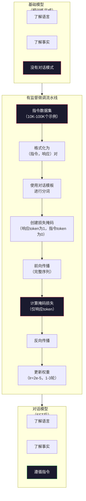

# 指令微调（SFT）

> 基础模型预测下一个token，仅此而已。它不遵循指令、不回答问题、也不拒绝有害请求。SFT是连接token预测器和有用助手之间的桥梁。你和任何模型的对话——Claude、GPT、Llama Chat——都经历了这一步。

**类型：** 构建
**语言：** Python（使用numpy）
**前置知识：** 第10阶段第04课（预训练迷你GPT）
**预计时间：** 约90分钟

## 学习目标

- 实现有监督微调（SFT），将基础语言模型转变为遵循指令的助手
- 使用带有系统、用户和助手角色的对话模板格式化训练数据，并对非助手token屏蔽损失
- 解释SFT的必要性：基础模型是续写文本而不是回答问题
- 通过在留出的指令集上对比基础模型和微调模型的响应来评估SFT质量

## 问题背景

你在第04课训练了一个模型，它能根据序列预测下一个token。输入"The transformer architecture"，它可能继续写出"has revolutionized natural language processing."——对于一个下一个token预测器来说相当出色。

现在试试这个：输入"What is the capital of France?"。基础模型不会回答"Paris"，它只是继续模式。它可能生成"What is the capital of Germany? What is the capital of Spain?"——因为它从包含一系列问题的文档中学习过。或者生成"is a question that many people ask"——因为这是一个合理的下一个token续写。模型没有"回答"的概念，它只知道"续写"。

这就是GPT-3（基础模型，2020年6月发布）和ChatGPT（指令微调，2022年11月发布）之间的差距。相同架构，相同预训练，差异在于20,000到100,000个精心设计的（指令，响应）对，教会了模型遵循对话模式。

Stanford Alpaca证明了不需要数百万个示例。2023年3月，他们仅在GPT-3.5生成的52,000个指令-响应对上微调了Llama 7B，总成本600美元，结果是一个能遵循指令、回答问题、进行对话的聊天机器人。不如ChatGPT好，但以600美元和几小时训练来说，差距小得惊人。

Meta的Llama 2 Chat在其初始SFT阶段只使用了约27,000个高质量示例。关键洞察：质量比数量更重要。27,000个熟练标注者写的示例，胜过100万个从互联网上爬取的嘈杂示例。

## 核心概念

### SFT实际做了什么

有监督微调延续了预训练的同一训练循环——前向传播、计算损失、反向传播、更新权重——但在不同类型的数据上进行。不再是原始文本，而是在结构化对话上训练：

```json
{
  "system": "You are a helpful assistant.",
  "user": "What is the capital of France?",
  "assistant": "The capital of France is Paris."
}
```

模型在预训练时已经知道巴黎是法国首都——从Wikipedia、教科书和网页中学到的。SFT不教模型新知识，它教模型新**行为**：当你看到问题时，给出答案；当你看到指令时，给出完成内容；当你看到有害请求时，给出拒绝。

这样理解：预训练给模型知识，SFT给模型礼仪。

### 数据格式

三种格式主导业界。每种格式编码相同信息——谁说了什么——但使用不同的分隔符。

**Alpaca格式**（Stanford，2023年3月）：

```json
{
  "instruction": "Summarize the following article in 3 sentences.",
  "input": "The European Central Bank raised interest rates...",
  "output": "The ECB increased rates by 25 basis points..."
}
```

简单且广泛使用。`input`字段是可选的——许多指令不需要额外上下文。Stanford以600美元发布了GPT-3.5生成的52,000个此格式示例，由此开启了开源指令微调运动。

**ShareGPT格式**（社区，2023年）：

```json
{
  "conversations": [
    {"from": "system", "value": "You are a helpful assistant."},
    {"from": "human", "value": "What causes tides?"},
    {"from": "gpt", "value": "Tides are caused by the gravitational pull of the Moon..."},
    {"from": "human", "value": "How often do they occur?"},
    {"from": "gpt", "value": "Most coastal areas experience two high tides and two low tides per day..."}
  ]
}
```

支持多轮对话。按惯例"from"字段使用"human"和"gpt"，无论实际使用哪个模型。Vicuna在从用户分享的ChatGPT记录中爬取的70,000个ShareGPT对话上训练。

**ChatML格式**（OpenAI，被许多开源模型使用）：

```
<|im_start|>system
You are a helpful assistant.<|im_end|>
<|im_start|>user
What is the capital of France?<|im_end|>
<|im_start|>assistant
The capital of France is Paris.<|im_end|>
```

使用特殊token（`<|im_start|>`、`<|im_end|>`）界定角色。这些token在微调期间添加到分词器词表。Qwen、Yi和许多其他模型使用ChatML。

三种格式完成同样的事：告诉模型"这是指令，这是响应，学习这个模式"。

### 为什么有效

模型在预训练时已经知道语言，它见过数十亿个问题后跟答案、指令后跟完成内容、人与人对话的示例。这些模式已经编码在权重中。

SFT集中了这种潜在能力。不再需要模型从上下文中判断是该回答问题还是续写文档，SFT明确在对话模式上训练。经过几千个示例后，模型学会：看到助手角色标记时，给出有帮助的响应。

这就是为什么27,000个示例就够了。你不是在教模型英语，不是在教它世界知识，而是教它一种简单行为：响应指令。知识早就在那里了。

### 掩码损失

这是SFT中最重要的技术细节，大多数教程都跳过了。

预训练时，你对每个token计算损失——模型学习预测序列中的每个下一个token。SFT时，你只对**响应** token计算损失。指令token是上下文，但模型不会因"错误预测"它们而受到惩罚。

为什么？因为你不想让模型学会**生成**指令，而是想让它学会**响应**指令。如果你对指令token计算损失，就是在训练模型预测"What is the capital of France?"，好像它是在提问一样。这浪费了梯度信号，还会混淆模型对自身角色的认知。

实际操作中，你创建一个损失掩码：响应token为1，指令token为0，将每个token的损失乘以此掩码后再取平均。

```
Token序列：  [SYS] You are helpful [USER] What is the capital? [ASST] Paris is the capital [EOS]
损失掩码：     0    0    0     0      0     0   0  0     0       1     1    1   1     1      1
```

只有`[ASST]`之后的token贡献损失。模型在前向传播时看到完整对话（需要指令才能产生正确响应），但权重更新只基于它预测响应的好坏。

### 训练超参数

SFT使用与预训练截然不同的超参数。你不是从零开始训练，而是调整一个已经工作的模型。

| 参数 | 预训练（Llama 2 7B） | SFT（Llama 2 Chat） |
|------|---------------------|---------------------|
| 学习率 | 3e-4（峰值） | 2e-5 |
| 轮次 | 1（数据单次遍历） | 2 |
| 批大小 | 400万token | 64个示例 |
| 预热步数 | 2,000 | 0-100 |
| 权重衰减 | 0.1 | 0.0-0.1 |
| 数据量 | 2万亿token | 27,000个示例 |

SFT的学习率是预训练的1/15，这至关重要。微调期间学习率过高会破坏预训练知识——模型"忘记"所学，并在小型微调数据集上过拟合。这就是灾难性遗忘。

两轮意味着模型每个训练示例看两遍。小型数据集上超过3轮会导致记忆——模型开始逐字复现训练示例，而不是泛化。

### 灾难性遗忘

微调可能破坏通用能力。在指令遵循数据上训练太久，模型会失去写代码、做数学或生成创意文本的能力。它在特定训练数据格式上变得非常好，在其他方面变得很差。

三种缓解措施：

1. **低学习率。** 1e-5到5e-5。更小的更新意味着对预训练特征的破坏更少。

2. **短训练周期。** 1-3轮，在过拟合前停止。

3. **混合预训练数据。** Llama 2 Chat在SFT数据集中混入了少量（2-5%）原始预训练数据，在学习新的指令遵循行为的同时"提醒"模型其通用能力。

### 真实数字

在单张NVIDIA A100 80GB GPU上，对10,000个高质量指令对微调70亿参数模型大约需要1小时：

- 10,000个示例 × 平均512个token = 512万token
- 2轮 = 1,024万token总计
- A100在70亿模型微调时的吞吐量：约3,000 token/秒
- 10,240,000 / 3,000 ≈ 3,400秒 ≈ 57分钟

对于我们的迷你GPT（4层、128维），训练几乎是瞬间完成的。重点是理解机制，而不是规模。



## 动手实现

### 第一步：指令数据集

创建合成指令数据集。在生产中，Scale AI和Anthropic等公司雇用人类标注者来编写这些数据。我们以编程方式创建，以演示格式。

```python
import numpy as np

INSTRUCTION_DATA = [
    {
        "instruction": "What is the capital of France?",
        "response": "The capital of France is Paris."
    },
    {
        "instruction": "Explain gravity in one sentence.",
        "response": "Gravity is the force that attracts objects with mass toward each other."
    },
    {
        "instruction": "Write a haiku about the ocean.",
        "response": "Waves crash on the shore, salt and foam beneath the sun, endless blue expanse."
    },
    {
        "instruction": "What is 15 multiplied by 7?",
        "response": "15 multiplied by 7 is 105."
    },
    {
        "instruction": "Name three programming languages.",
        "response": "Three programming languages are Python, Rust, and TypeScript."
    },
    {
        "instruction": "Summarize photosynthesis.",
        "response": "Photosynthesis converts sunlight, water, and carbon dioxide into glucose and oxygen."
    },
    {
        "instruction": "What year did World War II end?",
        "response": "World War II ended in 1945."
    },
    {
        "instruction": "Define machine learning.",
        "response": "Machine learning is a field where algorithms learn patterns from data to make predictions."
    },
]
```

8个示例非常少——Stanford Alpaca用了52,000个。但机制是相同的，不管你有8个还是52,000个：分词、掩码、只对响应计算损失。

### 第二步：使用对话模板进行分词

将指令-响应对转换为带有特殊角色标记的token序列。标记告诉模型指令在哪里结束、响应从哪里开始。

```python
SPECIAL_TOKENS = {
    "INST_START": 253,
    "INST_END": 254,
    "RESP_START": 255,
}


def tokenize_instruction_pair(instruction, response, vocab_size=256):
    inst_tokens = list(instruction.encode("utf-8"))
    resp_tokens = list(response.encode("utf-8"))

    inst_tokens = [min(t, vocab_size - 4) for t in inst_tokens]
    resp_tokens = [min(t, vocab_size - 4) for t in resp_tokens]

    tokens = (
        [SPECIAL_TOKENS["INST_START"]]
        + inst_tokens
        + [SPECIAL_TOKENS["INST_END"]]
        + [SPECIAL_TOKENS["RESP_START"]]
        + resp_tokens
    )

    return tokens


def create_loss_mask(tokens):
    mask = np.zeros(len(tokens), dtype=np.float32)
    in_response = False

    for i, token in enumerate(tokens):
        if token == SPECIAL_TOKENS["RESP_START"]:
            in_response = True
            continue
        if in_response:
            mask[i] = 1.0

    return mask
```

指令token的损失掩码全为零，响应token全为一。`RESP_START` token本身掩码为0，因为它是分隔符，不是响应内容的一部分。

### 第三步：掩码交叉熵损失

标准交叉熵，但乘以损失掩码。只有响应token贡献梯度。

```python
def masked_cross_entropy_loss(logits, targets, loss_mask):
    batch, seq_len, vocab_size = logits.shape
    logits_flat = logits.reshape(-1, vocab_size)
    targets_flat = targets.reshape(-1)
    mask_flat = loss_mask.reshape(-1)

    max_logits = logits_flat.max(axis=-1, keepdims=True)
    log_softmax = logits_flat - max_logits - np.log(
        np.exp(logits_flat - max_logits).sum(axis=-1, keepdims=True)
    )

    per_token_loss = -log_softmax[np.arange(len(targets_flat)), targets_flat]

    masked_loss = per_token_loss * mask_flat
    num_response_tokens = mask_flat.sum()
    if num_response_tokens == 0:
        return 0.0
    loss = masked_loss.sum() / num_response_tokens

    return loss
```

分母是`num_response_tokens`，而不是`seq_len`。如果除以总序列长度，较长的指令会稀释梯度信号。除以响应token数确保每个响应token获得相同的权重，无论指令长度如何。

### 第四步：SFT训练循环

复用第04课的MiniGPT。训练循环看起来与预训练几乎相同，但使用指令格式化和掩码损失。

```python
def sft_train(model, dataset, num_epochs=2, lr=2e-5, seq_len=64):
    formatted_data = []
    for example in dataset:
        tokens = tokenize_instruction_pair(example["instruction"], example["response"])
        mask = create_loss_mask(tokens)
        formatted_data.append((tokens, mask))

    print(f"SFT训练：{len(formatted_data)}个示例，{num_epochs}轮，lr={lr}")
    print(f"总token数：{sum(len(t) for t, _ in formatted_data):,}")
    print()

    losses = []

    for epoch in range(num_epochs):
        epoch_loss = 0.0
        num_batches = 0

        indices = np.random.permutation(len(formatted_data))

        for idx in indices:
            tokens, mask = formatted_data[idx]

            if len(tokens) < 3:
                continue
            if len(tokens) > seq_len:
                tokens = tokens[:seq_len]
                mask = mask[:seq_len]

            input_ids = np.array(tokens[:-1]).reshape(1, -1)
            target_ids = np.array(tokens[1:]).reshape(1, -1)
            loss_mask = np.array(mask[1:]).reshape(1, -1)

            logits = model.forward(input_ids)
            loss = masked_cross_entropy_loss(logits, target_ids, loss_mask)

            batch_size, s_len, v_size = logits.shape
            probs = np.exp(logits - logits.max(axis=-1, keepdims=True))
            probs = probs / probs.sum(axis=-1, keepdims=True)
            dlogits = probs.copy()
            dlogits[np.arange(batch_size)[:, None], np.arange(s_len), target_ids] -= 1.0

            mask_expanded = loss_mask[:, :, np.newaxis]
            num_resp = loss_mask.sum()
            if num_resp > 0:
                dlogits = dlogits * mask_expanded / num_resp

            for block in model.blocks:
                block.ffn.W1 -= lr * np.random.randn(*block.ffn.W1.shape) * 0.01
                block.ffn.W2 -= lr * np.random.randn(*block.ffn.W2.shape) * 0.01
                block.ffn.b1 -= lr * np.random.randn(*block.ffn.b1.shape) * 0.01
                block.ffn.b2 -= lr * np.random.randn(*block.ffn.b2.shape) * 0.01

            epoch_loss += loss
            num_batches += 1
            losses.append(loss)

        avg_loss = epoch_loss / max(num_batches, 1)
        print(f"第 {epoch + 1}/{num_epochs} 轮 | 平均损失：{avg_loss:.4f}")

    return model, losses
```

学习率为2e-5，与Llama 2 Chat相同。对比预训练时的3e-4——低了15倍。梯度是掩码的：指令token产生零梯度，只有响应token推动权重更新。

### 第五步：对比基础模型与SFT模型

SFT的全部目的在于行为改变。通过检查模型对指令格式化输入和原始文本续写的响应来测量。

```python
def generate_response(model, prompt_tokens, max_new_tokens=50, temperature=0.8):
    tokens = list(prompt_tokens)
    seq_len = model.embedding.pos_embed.shape[0]

    for _ in range(max_new_tokens):
        context = np.array(tokens[-seq_len:]).reshape(1, -1)
        logits = model.forward(context)
        next_logits = logits[0, -1, :]

        next_logits = next_logits / max(temperature, 1e-8)
        probs = np.exp(next_logits - next_logits.max())
        probs = probs / probs.sum()
        probs = np.clip(probs, 1e-10, 1.0)
        probs = probs / probs.sum()

        next_token = np.random.choice(len(probs), p=probs)
        tokens.append(int(next_token))

    return tokens


def evaluate_instruction_following(model, instructions):
    print("评估指令遵循：")
    print("-" * 50)

    for instruction in instructions:
        tokens = (
            [SPECIAL_TOKENS["INST_START"]]
            + [min(t, 252) for t in list(instruction.encode("utf-8"))]
            + [SPECIAL_TOKENS["INST_END"]]
            + [SPECIAL_TOKENS["RESP_START"]]
        )

        output = generate_response(model, tokens, max_new_tokens=30, temperature=0.6)
        response_start = len(tokens)
        response_tokens = output[response_start:]
        response_bytes = bytes([t for t in response_tokens if t < 128])
        response_text = response_bytes.decode("utf-8", errors="replace")

        print(f"  问：{instruction}")
        print(f"  答：{response_text[:80]}")
        print()
```

对于只有8个示例的小型模型，响应不会有意义，这是预期的。重要的是**结构**：模型学会在响应标记后生成输出，而不是继续生成更多指令。

### 第六步：测量灾难性遗忘

对比SFT前后模型的下一个token预测能力。如果SFT损害了通用能力，原始文本上的损失会增加。

```python
def measure_forgetting(model, test_text, seq_len=64):
    tokens = np.array(list(test_text.encode("utf-8")[:512]))

    total_loss = 0.0
    num_windows = 0

    for start in range(0, len(tokens) - seq_len - 1, seq_len):
        input_ids = tokens[start:start + seq_len].reshape(1, -1)
        target_ids = tokens[start + 1:start + seq_len + 1].reshape(1, -1)

        logits = model.forward(input_ids)

        batch, s_len, vocab_size = logits.shape
        logits_flat = logits.reshape(-1, vocab_size)
        targets_flat = target_ids.reshape(-1)

        max_logits = logits_flat.max(axis=-1, keepdims=True)
        log_softmax = logits_flat - max_logits - np.log(
            np.exp(logits_flat - max_logits).sum(axis=-1, keepdims=True)
        )

        loss = -log_softmax[np.arange(len(targets_flat)), targets_flat].mean()
        total_loss += loss
        num_windows += 1

    return total_loss / max(num_windows, 1)
```

在真实微调中，你会在整个训练过程中跟踪这个指标。如果原始文本损失增加超过10-15%，你的SFT太激进了——降低学习率或减少轮次。

## 完整SFT流水线演示

```python
if __name__ == "__main__":
    np.random.seed(42)

    test_text = """The transformer architecture processes sequences through self-attention.
Each layer applies multi-head attention followed by a feedforward network.
Residual connections and layer normalization stabilize deep networks.
The model learns to predict the next token given all previous tokens."""

    print("=" * 70)
    print("指令微调（SFT）演示")
    print("=" * 70)
    print()

    model = MiniGPT(
        vocab_size=256, embed_dim=128, num_heads=4,
        num_layers=4, max_seq_len=128, ff_dim=512
    )
    print(f"模型：{model.count_parameters():,}个参数")
    print(f"配置：4层、4头、128维（第04课的迷你GPT）")
    print()

    print("SFT前：测量基础模型在原始文本上的损失")
    base_loss = measure_forgetting(model, test_text)
    print(f"  基础模型损失：{base_loss:.4f}")
    print()

    print("=" * 70)
    print("SFT训练")
    print("=" * 70)

    model, losses = sft_train(
        model, INSTRUCTION_DATA, num_epochs=3, lr=2e-5, seq_len=128
    )

    print()
    print("SFT后：测量微调模型在原始文本上的损失")
    sft_loss = measure_forgetting(model, test_text)
    print(f"  SFT模型损失：{sft_loss:.4f}")
    print(f"  变化：{((sft_loss - base_loss) / base_loss * 100):+.1f}%")
    if abs(sft_loss - base_loss) / base_loss < 0.15:
        print("  遗忘极少（变化 < 15%）")
    else:
        print("  检测到明显遗忘")
    print()

    test_instructions = [
        "What is the capital of France?",
        "Name a programming language.",
        "Define gravity.",
    ]
    evaluate_instruction_following(model, test_instructions)
```

## 交付物

本课产出 `outputs/prompt-sft-data-curator.md`——一个帮助你设计和整理SFT指令数据集的提示词。给定目标能力（代码生成、数学、对话），它生成包含格式规范、质量标准和多样性要求的数据收集方案。

## 练习

1. 添加系统提示词支持。修改`tokenize_instruction_pair`以接受系统消息，并在指令前预置。创建5个带不同系统提示词（"You are a poet"、"You are a math tutor"）的示例，验证模型在训练时看到了不同的系统提示词。

2. 实现数据混合。创建一个函数，接受SFT数据集和原始文本语料，产生5%为原始文本（无掩码）和95%为指令对（掩码）的训练批次。运行3轮，对比与纯SFT训练的遗忘指标。

3. 构建数据质量评分器。对每个指令-响应对计算：(a)响应的token长度，(b)指令到响应的比例，(c)词汇多样性（唯一token/总token）。过滤掉响应长度 < 10 token或多样性 < 0.3的示例。展示过滤如何影响最终损失。

4. 实现多轮对话训练。扩展分词，处理3轮对话（用户-助手-用户-助手-用户-助手）。损失掩码应覆盖所有三个助手轮次。通过打印一个示例的token-掩码对齐来验证掩码正确。

5. 对比不同学习率。用lr=1e-4、lr=2e-5和lr=1e-6各训练一次模型，绘制损失曲线。1e-4的运行应该显示快速初始下降但最终损失更高（过拟合）；1e-6的运行几乎不动；2e-5的运行应该是最佳点。

## 关键术语

| 术语 | 常见说法 | 真正含义 |
|------|---------|---------|
| SFT（有监督微调） | "在对话上微调" | 在（指令，响应）对上继续训练，损失只计算在响应token上 |
| 指令微调（Instruction tuning） | "教模型遵循指令" | 在明确的指令-响应对上训练，使基础模型学会对话模式，而非新知识 |
| 损失掩码（Loss masking） | "忽略提示词" | 将指令token的损失设为零，使梯度只从响应token预测中流动 |
| ChatML | "聊天标记语言" | 使用`<\|im_start\|>`和`<\|im_end\|>`分隔符标记对话数据中说话者角色的token格式 |
| Alpaca格式 | "Stanford的格式" | 带有instruction/input/output字段的JSON格式，用于花了600美元生成的52K个GPT-3.5示例 |
| 灾难性遗忘（Catastrophic forgetting） | "模型变笨了" | 微调破坏预训练能力，因为梯度更新用任务特定模式覆盖了通用知识 |
| 权重绑定（Weight tying） | "共享嵌入" | 对输入token嵌入和输出预测头使用同一矩阵，节省参数并提高一致性 |
| 对话模板（Chat template） | "格式化提示词的方式" | 将对话结构化的特定token序列（角色标记、分隔符）——模型专用 |

## 延伸阅读

- [Ouyang et al., 2022 — "Training language models to follow instructions with human feedback"（InstructGPT）](https://arxiv.org/abs/2203.02155) — OpenAI引入指令微调+RLHF的论文
- [Taori et al., 2023 — "Stanford Alpaca: An Instruction-following LLaMA Model"](https://github.com/tatsu-lab/stanford_alpaca) — 花600美元生成52K指令示例，证明SFT在小数据集上有效
- [Touvron et al., 2023 — "Llama 2: Open Foundation and Fine-Tuned Chat Models"](https://arxiv.org/abs/2307.09288) — Meta的SFT+RLHF流水线，使用27K高质量示例
- [Chiang et al., 2023 — "Vicuna: An Open-Source Chatbot Impressing GPT-4"](https://lmsys.org/blog/2023-03-30-vicuna/) — 在70K ShareGPT对话上训练
- [Zhou et al., 2023 — "LIMA: Less Is More for Alignment"](https://arxiv.org/abs/2305.11206) — 证明1,000个精心筛选的示例可以媲美大型数据集上的SFT
