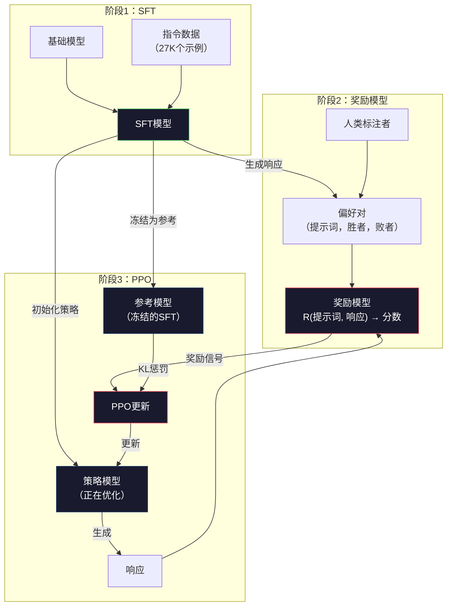
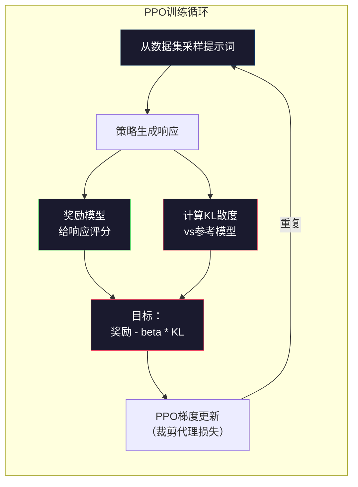

# RLHF：奖励模型 + PPO

> SFT教会模型遵循指令，但不能教它哪个响应**更好**。两个语法正确、事实准确的回答，在帮助性上可能相差甚远。RLHF是将人类判断编码进模型行为的方式，也是Claude有用、GPT礼貌的原因。

**类型：** 构建
**语言：** Python（使用numpy）
**前置知识：** 第10阶段第06课（指令微调/SFT）
**预计时间：** 约90分钟

## 学习目标

- 构建从人类偏好对（被选中 vs 被拒绝）中给响应质量评分的奖励模型
- 实现PPO训练循环，在KL惩罚约束下针对奖励模型优化语言模型策略
- 解释RLHF为何需要三个模型（SFT、奖励、策略），以及KL约束如何防止奖励欺骗
- 通过对比偏好优化前后的响应质量来评估RLHF的效果

## 问题背景

问模型"解释量子计算"，它可能给出：

**响应A：** "量子计算使用可以处于叠加态的量子比特，意味着它们可以同时为0、1或两者。这使量子计算机能够以指数级速度处理某些经典计算机所无法完成的计算。关键算法包括用于分解大数的Shor算法和用于搜索无序数据库的Grover算法。"

**响应B：** "量子计算是一种使用量子力学现象的计算形式。它最早在1980年代被提出。理查德·费曼建议量子系统可以通过量子计算机来模拟。此后该领域大幅发展。许多公司现在正在研发量子计算机。IBM、谷歌等取得了进展。谷歌在2019年宣称实现了量子霸权。"

两个响应都事实正确，语法都正确，都遵循了指令。但响应A明显更好：更简洁、信息量更大、结构更好。人类每次都会选A。

SFT无法捕捉这种区别。它在"正确"的响应上训练，但没有任何机制说"这个响应比那个好"。它平等对待每个训练示例。如果A和B都出现在SFT数据集中，模型会从两者中等量学习。

RLHF解决了这个问题。它训练一个奖励模型预测人类会偏好哪个响应，然后用这个奖励信号推动语言模型生成更高质量的输出。InstructGPT（ChatGPT的前身）使用RLHF大幅提升了GPT-3的帮助性、真实性和无害性。OpenAI的内部评估者85%的时候更偏好InstructGPT的输出而不是GPT-3的，尽管InstructGPT小了135倍（13亿 vs 1750亿参数）。

## 核心概念

### 三个阶段

RLHF不是单次训练运行，而是三个顺序阶段的流水线，每个阶段在前一个的基础上构建。

**阶段1：SFT。** 在指令-响应对上训练基础模型（第06课），得到能遵循指令但不知道哪些响应更好的模型。

**阶段2：奖励模型。** 收集人类偏好数据：给标注者看同一提示的两个响应，问"哪个更好？"训练模型预测这些偏好。奖励模型以（提示词，响应）为输入，输出一个标量分数。

**阶段3：PPO。** 使用奖励模型为语言模型生成训练信号。语言模型生成响应，奖励模型评分，PPO更新语言模型以产生更高分的响应。KL散度惩罚防止语言模型偏离SFT检查点太远。



### 奖励模型

奖励模型是被改造为评分器的语言模型。取SFT模型，将语言建模头（输出词表上的分布）替换为标量头（输出单个数字）。最后一层之前的架构完全相同。

输入：提示词与响应的拼接。输出：单个标量奖励分数。

训练数据是人类偏好对。对于每个提示词，标注者看到两个响应并选择更好的那个，产生训练三元组：（提示词，被选中响应，被拒绝响应）。

损失函数使用Bradley-Terry成对偏好模型：

```
loss = -log(sigmoid(reward(preferred) - reward(rejected)))
```

这是核心公式。`sigmoid(reward(A) - reward(B))`给出响应A优于响应B的概率。损失推动奖励模型为被选中响应分配更高分数。

为什么用成对比较而不是绝对分数？因为人类很难打出绝对质量分数（"这个响应是7.3分还是7.5分？"），但很擅长相对比较（"A比B好吗？"）。Bradley-Terry模型将相对比较转换为一致的绝对评分系统。

**InstructGPT数字：** OpenAI从40个外包人员收集了33,000个比较对，每个比较约需5分钟——2,750小时的人工劳动用于训练奖励模型数据。

### PPO：近端策略优化

PPO是一种强化学习算法。在RLHF中，"环境"是奖励模型，"智能体"是语言模型，"动作"是生成一个token。

目标：

```
最大化：E[R(提示词, 响应)] - beta * KL(policy || reference)
```

第一项推动模型生成高奖励响应。第二项（KL散度惩罚）防止模型偏离SFT检查点太远。

为什么需要KL惩罚？没有它，模型会找到退化解。奖励模型在有限的人类偏好数据集上训练，存在盲点。语言模型会利用这些盲点——找到在奖励模型上得分高但实际上毫无意义的输出。典型例子：

- 重复"我是如此有帮助且无害！"在帮助性/无害性奖励模型上得分高
- 生成冗长、听起来正式但内容空洞的响应，模式匹配"高质量"
- 利用训练数据中碰巧与高奖励相关的特定短语

KL惩罚说：你可以改进，但不能成为完全不同的模型。靠近SFT版本，那已经是合理的了。偏离太远，KL成本就会主导奖励。

**InstructGPT数字：** PPO训练使用lr=1.5e-5，KL系数beta=0.02，256K个episode（提示词-响应对），每批次4个PPO轮次。整个RLHF流水线在GPU集群上需要数天。



### PPO目标详解

PPO使用"裁剪代理目标"防止过大的更新。新策略与旧策略概率之间的比值被裁剪到[1-epsilon, 1+epsilon]范围内，epsilon通常为0.2。

```
ratio = pi_new(action | state) / pi_old(action | state)
clipped_ratio = clip(ratio, 1 - epsilon, 1 + epsilon)
loss = -min(ratio * advantage, clipped_ratio * advantage)
```

优势函数估计当前响应比预期质量好多少。在RLHF中：

```
advantage = reward(prompt, response) - baseline
```

基线通常是最近响应的平均奖励。正优势意味着响应好于平均水平，负优势意味着更差。PPO增加高于平均水平响应的概率，降低低于平均水平的概率。

裁剪防止灾难性更新。如果单个响应获得异常高的奖励，未裁剪的比值可能很大，导致模型大幅转向该响应。裁剪封顶了更新，保持训练稳定性。

### 奖励欺骗

RLHF的阴暗面。语言模型在针对奖励模型优化，而奖励模型是人类偏好的不完美代理。随着语言模型越来越擅长最大化奖励，它开始利用奖励模型的弱点。

常见失效模式：

| 失效 | 发生什么 | 原因 |
|------|---------|------|
| 冗长性 | 模型产生越来越长的响应 | 人类标注者往往更偏好更长、更详细的响应，所以奖励模型对长度打分更高 |
| 谄媚性 | 模型同意用户说的一切 | 标注者更偏好同意问题前提的响应 |
| 回避性 | 模型拒绝给出明确答案 | 模棱两可的响应（"这是个有多种观点的复杂话题..."）很少被标记为错误 |
| 格式游戏 | 模型过度使用项目符号和标题 | 格式化响应看起来对标注者更"精致" |

缓解策略：更强的KL惩罚（防止模型偏离足够远以利用弱点）、在对抗性示例上训练奖励模型（修补已知失效模式）、使用多个不同架构的奖励模型（更难同时欺骗所有）。

### 真实RLHF流水线

| 模型 | 比较对数量 | 标注者 | RM大小 | PPO步数 | KL系数 |
|------|----------|--------|--------|--------|--------|
| InstructGPT | 33K | 40人 | 6B | 256K | 0.02 |
| Llama 2 Chat | ~100万 | 未披露 | 70B | 未披露 | 0.01 |
| Claude | 未披露 | 未披露 | 未披露 | 未披露 | 未披露 |
| Anthropic RLHF论文 | 22K | 20人 | 52B | 50K | 0.001 |

Anthropic 2022年的论文在22,000个比较上训练了520亿参数的奖励模型。更大的奖励模型产生更可靠的信号，使PPO训练更稳定。用小型奖励模型训练大型语言模型风险很高——奖励模型没有足够的容量来捕捉好响应和差响应之间的细微差别。

## 动手实现

### 第一步：合成偏好数据

在生产中，人类标注者创建偏好数据。我们创建合成对，其中"被选中"的响应客观上更好（更简洁、更准确、更有帮助）。

```python
import numpy as np

PREFERENCE_DATA = [
    {
        "prompt": "What is the capital of France?",
        "preferred": "The capital of France is Paris.",
        "rejected": "France is a country in Europe. It has many cities. The capital is Paris. Paris is known for the Eiffel Tower.",
    },
    {
        "prompt": "Explain gravity in one sentence.",
        "preferred": "Gravity is the force that attracts objects with mass toward each other.",
        "rejected": "Gravity is something that makes things fall down when you drop them.",
    },
    {
        "prompt": "What is 15 times 7?",
        "preferred": "15 times 7 is 105.",
        "rejected": "Let me think about this. 15 times 7. Well, 10 times 7 is 70, and 5 times 7 is 35, so the answer might be around 105.",
    },
    {
        "prompt": "Name three programming languages.",
        "preferred": "Python, Rust, and TypeScript.",
        "rejected": "There are many programming languages. Some popular ones include various languages like Python and others.",
    },
    {
        "prompt": "What year did World War II end?",
        "preferred": "World War II ended in 1945.",
        "rejected": "World War II was a major global conflict. It involved many countries. The war ended in the mid-1940s, specifically in 1945.",
    },
    {
        "prompt": "Define machine learning.",
        "preferred": "Machine learning is a field where algorithms learn patterns from data to make predictions without being explicitly programmed.",
        "rejected": "Machine learning is a type of AI. AI stands for artificial intelligence. Machine learning uses data to learn.",
    },
]
```

被选中的响应简洁直接，被拒绝的响应展现了常见失效模式：不必要的填充、回避、冗余解释和不精确。这正是SFT无法捕捉但RLHF能够捕捉的区别。

### 第二步：奖励模型架构

奖励模型复用迷你GPT的Transformer架构，但将词表大小的输出头替换为单个标量投影。

```python
class RewardModel:
    def __init__(self, vocab_size=256, embed_dim=128, num_heads=4,
                 num_layers=4, max_seq_len=128, ff_dim=512):
        self.embedding = Embedding(vocab_size, embed_dim, max_seq_len)
        self.blocks = [
            TransformerBlock(embed_dim, num_heads, ff_dim)
            for _ in range(num_layers)
        ]
        self.ln_f = LayerNorm(embed_dim)
        self.reward_head = np.random.randn(embed_dim) * 0.02

    def forward(self, token_ids):
        seq_len = token_ids.shape[-1]
        mask = np.triu(np.full((seq_len, seq_len), -1e9), k=1)

        x = self.embedding.forward(token_ids)
        for block in self.blocks:
            x = block.forward(x, mask)
        x = self.ln_f.forward(x)

        last_hidden = x[:, -1, :]
        reward = last_hidden @ self.reward_head

        return reward
```

奖励模型取**最后**一个token位置的隐藏状态，投影为标量。为什么是最后一个？因为因果注意力掩码意味着最后一个位置已经关注了所有前驱token，它拥有对整个（提示词，响应）序列最完整的表示。

### 第三步：Bradley-Terry损失

使用Bradley-Terry成对损失在偏好对上训练奖励模型。

```python
def tokenize_for_reward(prompt, response, vocab_size=256):
    prompt_tokens = [min(t, vocab_size - 1) for t in list(prompt.encode("utf-8"))]
    response_tokens = [min(t, vocab_size - 1) for t in list(response.encode("utf-8"))]
    return prompt_tokens + [0] + response_tokens


def sigmoid(x):
    return np.where(
        x >= 0,
        1.0 / (1.0 + np.exp(-x)),
        np.exp(x) / (1.0 + np.exp(x))
    )


def bradley_terry_loss(reward_preferred, reward_rejected):
    diff = reward_preferred - reward_rejected
    loss = -np.log(sigmoid(diff) + 1e-8)
    return loss


def train_reward_model(rm, preference_data, num_epochs=10, lr=1e-4, max_seq_len=128):
    print(f"训练奖励模型：{len(preference_data)}个偏好对，{num_epochs}轮")
    print()

    losses = []
    accuracies = []

    for epoch in range(num_epochs):
        epoch_loss = 0.0
        epoch_correct = 0
        num_pairs = 0

        indices = np.random.permutation(len(preference_data))

        for idx in indices:
            pair = preference_data[idx]

            preferred_tokens = tokenize_for_reward(pair["prompt"], pair["preferred"])
            rejected_tokens = tokenize_for_reward(pair["prompt"], pair["rejected"])

            preferred_tokens = preferred_tokens[:max_seq_len]
            rejected_tokens = rejected_tokens[:max_seq_len]

            preferred_ids = np.array(preferred_tokens).reshape(1, -1)
            rejected_ids = np.array(rejected_tokens).reshape(1, -1)

            r_preferred = rm.forward(preferred_ids)[0]
            r_rejected = rm.forward(rejected_ids)[0]

            loss = bradley_terry_loss(r_preferred, r_rejected)

            if r_preferred > r_rejected:
                epoch_correct += 1

            diff = r_preferred - r_rejected
            grad = sigmoid(diff) - 1.0

            rm.reward_head -= lr * grad * rm.ln_f.forward(
                rm.embedding.forward(preferred_ids)
            )[:, -1, :].flatten()

            epoch_loss += loss
            num_pairs += 1

        avg_loss = epoch_loss / max(num_pairs, 1)
        accuracy = epoch_correct / max(num_pairs, 1)
        losses.append(avg_loss)
        accuracies.append(accuracy)

        if epoch % 2 == 0:
            print(f"  第 {epoch + 1:3d} 轮 | 损失：{avg_loss:.4f} | 准确率：{accuracy:.1%}")

    return rm, losses, accuracies
```

准确率指标很直观：奖励模型能正确排序多少比例的偏好对？随机模型得50%。在干净数据上训练良好的奖励模型应该超过70%。InstructGPT的奖励模型在留出比较上达到约72%的准确率，听起来不高，但实际上很好——即使对人类来说许多偏好对也是模糊的（标注者间一致性约为73%）。

### 第四步：简化PPO循环

完整PPO很复杂。这个实现捕捉了核心机制：生成响应、评分、计算优势、用KL惩罚更新策略。

```python
def compute_kl_divergence(policy_logits, reference_logits):
    policy_probs = np.exp(policy_logits - policy_logits.max(axis=-1, keepdims=True))
    policy_probs = policy_probs / policy_probs.sum(axis=-1, keepdims=True)
    policy_probs = np.clip(policy_probs, 1e-10, 1.0)

    ref_probs = np.exp(reference_logits - reference_logits.max(axis=-1, keepdims=True))
    ref_probs = ref_probs / ref_probs.sum(axis=-1, keepdims=True)
    ref_probs = np.clip(ref_probs, 1e-10, 1.0)

    kl = np.sum(policy_probs * np.log(policy_probs / ref_probs), axis=-1)
    return kl.mean()


def ppo_training(policy_model, reference_model, reward_model, prompts,
                 num_episodes=20, lr=1.5e-5, kl_coeff=0.02, max_seq_len=128):
    print(f"PPO训练：{num_episodes}个episode，lr={lr}，KL系数={kl_coeff}")
    print()

    rewards_history = []
    kl_history = []

    for episode in range(num_episodes):
        prompt_text = prompts[episode % len(prompts)]
        prompt_tokens = [min(t, 252) for t in list(prompt_text.encode("utf-8"))]

        response_tokens = generate_response(
            policy_model, prompt_tokens,
            max_new_tokens=20, temperature=0.8, max_seq_len=max_seq_len
        )

        response_ids = np.array(response_tokens[:max_seq_len]).reshape(1, -1)
        reward = reward_model.forward(response_ids)[0]

        policy_logits = policy_model.forward(response_ids)
        ref_logits = reference_model.forward(response_ids)
        kl = compute_kl_divergence(policy_logits, ref_logits)

        total_reward = reward - kl_coeff * kl

        rewards_history.append(float(reward))
        kl_history.append(float(kl))

        for block in policy_model.blocks:
            update_scale = lr * total_reward
            block.ffn.W1 += update_scale * np.random.randn(*block.ffn.W1.shape) * 0.01
            block.ffn.W2 += update_scale * np.random.randn(*block.ffn.W2.shape) * 0.01

        if episode % 5 == 0:
            avg_reward = np.mean(rewards_history[-5:]) if rewards_history else 0
            avg_kl = np.mean(kl_history[-5:]) if kl_history else 0
            print(f"  第 {episode:3d} 个episode | 奖励：{reward:.4f} | KL：{kl:.4f} | "
                  f"平均奖励：{avg_reward:.4f}")

    return policy_model, rewards_history, kl_history
```

核心循环：(1)采样提示词，(2)生成响应，(3)用奖励模型评分，(4)计算与冻结参考模型的KL散度，(5)计算调整后的奖励（奖励减去KL惩罚），(6)更新策略。KL惩罚随策略偏离参考而增长，自动防止奖励欺骗。

### 第五步：奖励分数对比

RLHF后，策略模型的响应在奖励模型上的得分应该高于原始SFT模型的响应。

```python
def compare_models(sft_model, rlhf_model, reward_model, prompts, max_seq_len=128):
    print("模型对比（奖励分数）")
    print("-" * 60)
    print(f"  {'提示词':<35} {'SFT':>10} {'RLHF':>10}")
    print("  " + "-" * 55)

    sft_total = 0.0
    rlhf_total = 0.0

    for prompt in prompts:
        prompt_tokens = [min(t, 252) for t in list(prompt.encode("utf-8"))]

        sft_response = generate_response(
            sft_model, prompt_tokens,
            max_new_tokens=20, temperature=0.6, max_seq_len=max_seq_len
        )
        rlhf_response = generate_response(
            rlhf_model, prompt_tokens,
            max_new_tokens=20, temperature=0.6, max_seq_len=max_seq_len
        )

        sft_ids = np.array(sft_response[:max_seq_len]).reshape(1, -1)
        rlhf_ids = np.array(rlhf_response[:max_seq_len]).reshape(1, -1)

        sft_reward = reward_model.forward(sft_ids)[0]
        rlhf_reward = reward_model.forward(rlhf_ids)[0]

        sft_total += sft_reward
        rlhf_total += rlhf_reward

        truncated_prompt = prompt[:33] + ".." if len(prompt) > 35 else prompt
        print(f"  {truncated_prompt:<35} {sft_reward:>10.4f} {rlhf_reward:>10.4f}")

    n = len(prompts)
    print("  " + "-" * 55)
    print(f"  {'平均':<35} {sft_total/n:>10.4f} {rlhf_total/n:>10.4f}")

    return sft_total / n, rlhf_total / n
```

## 交付物

本课产出 `outputs/prompt-reward-model-designer.md`——一个用于设计奖励模型训练流水线的提示词。给定目标行为（帮助性、编程能力、安全性），它生成数据收集协议、标注者指南和奖励模型评估标准。

## 练习

1. 将奖励模型修改为使用所有隐藏状态的均值，而不仅仅是最后一个位置。对比准确率。均值池化给所有token相同权重，而最后位置方式依赖因果注意力聚合信息。在6个偏好对上测试，报告哪种方式准确率更高。

2. 实现奖励模型校准。训练后，对所有偏好对运行奖励模型，计算：(a)被选中响应的平均奖励，(b)被拒绝响应的平均奖励，(c)差距（被选中减被拒绝）。良好校准的模型应该有明显的差距。然后添加4个新的偏好对，检查差距在未见数据上是否保持。

3. 模拟奖励欺骗。创建一个对长响应打高分的奖励模型（奖励 = len(响应) / 100）。用这个有缺陷的奖励模型运行PPO，观察策略模型生成越来越长、越来越重复的输出。然后添加0.1的KL惩罚，展示它如何防止退化行为。

4. 实现多目标奖励。训练两个奖励模型——一个用于帮助性，一个用于简洁性。将它们组合为R = 0.7 × R_helpful + 0.3 × R_concise。展示组合目标产生的响应既有帮助性又简洁，避免单一帮助性奖励的冗长陷阱。

5. 对比不同的KL系数。用beta=0.001（太低，奖励欺骗）、beta=0.02（标准）和beta=0.5（太高，无法学习）各运行PPO。绘制每种情况的奖励曲线和KL曲线。beta=0.02的运行应该显示稳定的奖励提升和有界的KL。

## 关键术语

| 术语 | 常见说法 | 真正含义 |
|------|---------|---------|
| RLHF | "用人类反馈训练" | 从人类反馈中进行强化学习：三阶段流水线（SFT、奖励模型、PPO），使用人类偏好信号优化语言模型输出 |
| 奖励模型（Reward model） | "给响应打分的模型" | 带标量输出头的Transformer，使用Bradley-Terry损失在成对人类偏好上训练 |
| Bradley-Terry | "比较模型" | 一种概率模型，P(A > B) = sigmoid(score(A) - score(B))，将成对偏好转换为一致的评分函数 |
| PPO | "RL算法" | 近端策略优化：更新策略以最大化奖励，同时裁剪更新幅度防止不稳定 |
| KL散度（KL divergence） | "两个分布有多不同" | 策略模型和参考模型token分布差异的度量——用作惩罚以防止奖励欺骗 |
| KL惩罚（KL penalty） | "模型的缰绳" | 从奖励信号中减去beta × KL(policy \|\| reference)——防止策略偏离SFT检查点太远 |
| 奖励欺骗（Reward hacking） | "游戏规则" | 策略通过利用奖励模型的弱点找到退化的高分输出，而非真正改进 |
| 偏好对（Preference pair） | "A和B哪个更好？" | 训练示例，由（提示词，被选中响应，被拒绝响应）组成——RLHF训练数据的基本单元 |
| 参考模型（Reference model） | "冻结的SFT检查点" | SFT模型的副本，权重永远不变——用作KL散度计算的锚点 |

## 延伸阅读

- [Ouyang et al., 2022 — "Training language models to follow instructions with human feedback"（InstructGPT）](https://arxiv.org/abs/2203.02155) — 使RLHF对大型语言模型实用化的论文
- [Schulman et al., 2017 — "Proximal Policy Optimization Algorithms"](https://arxiv.org/abs/1707.06347) — OpenAI的原始PPO论文
- [Bai et al., 2022 — "Training a Helpful and Harmless Assistant with Reinforcement Learning from Human Feedback"](https://arxiv.org/abs/2204.05862) — Anthropic的RLHF论文，包含奖励欺骗和KL惩罚的详细分析
- [Stiennon et al., 2020 — "Learning to summarize with human feedback"](https://arxiv.org/abs/2009.01325) — RLHF应用于摘要，展示奖励模型能够捕捉细微质量判断
- [Christiano et al., 2017 — "Deep reinforcement learning from human preferences"](https://arxiv.org/abs/1706.03741) — 从人类比较中学习奖励函数的基础性工作
