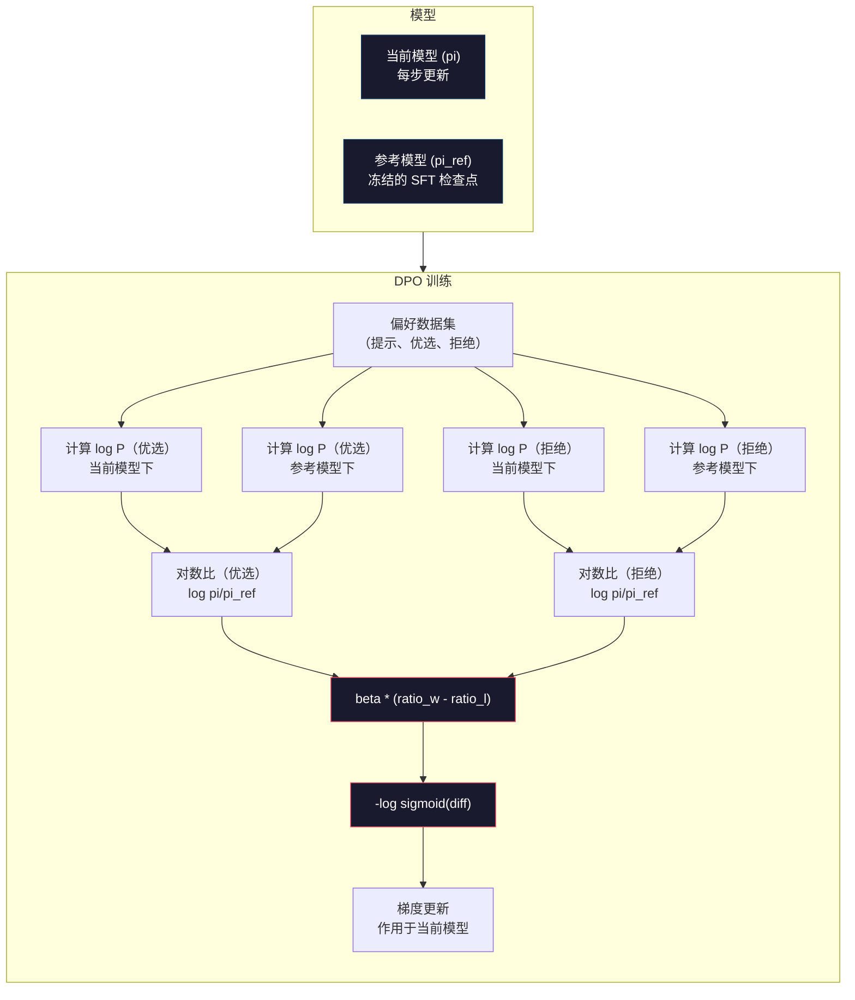

# DPO：直接偏好优化

> RLHF 确实有效。但它需要训练三个模型（SFT、奖励模型、策略模型），还要应对 PPO 的不稳定性，以及调整 KL 惩罚系数。DPO 提出了一个问题：如果能跳过这一切呢？DPO 直接在偏好对上优化语言模型。不需要奖励模型。不需要 PPO。一个训练循环。同样的效果。

**类型：** 构建  
**语言：** Python（使用 numpy）  
**前置条件：** 第十阶段，第 07 课（RLHF）  
**时间：** 约 90 分钟

## 学习目标

- 实现 DPO 训练，直接在偏好对上优化语言模型，无需单独的奖励模型
- 推导 DPO 损失函数，解释它如何通过策略的对数概率隐式表示奖励模型
- 从训练稳定性、计算成本和所需模型数量等方面比较 DPO 与 RLHF
- 调整 beta 参数，控制训练后的策略偏离参考模型的程度

## 问题所在

你在第 07 课构建了一个 RLHF 流程。三个阶段。三个模型。SFT 模型、奖励模型，以及用 PPO 优化的策略模型。光是奖励模型就需要数千个人类偏好对和一个独立的训练循环。PPO 还需要仔细调整 KL 系数、学习率、裁剪比率和训练轮数。

在实践中，PPO 训练以不稳定著称。超参数的微小变化就会导致训练发散。奖励模型是人类偏好的不完美代理，策略模型总能找到利用其弱点的方法。KL 惩罚有帮助，但本身也需要调整——太低会导致奖励黑客攻击，太高又让模型几乎学不到东西。

这种复杂性正是为什么大多数开源模型在 InstructGPT 发布后多年里一直在 RLHF 上苦苦挣扎。三阶段流程非常脆弱。每个阶段都有自己的失败模式，错误会不断累积。

2023 年 5 月，斯坦福的 Rafael Rafailov、Archit Sharma 及其同事发表了《直接偏好优化：你的语言模型本质上是一个奖励模型》。核心洞见：你不需要单独的奖励模型。最优奖励函数在数学上由语言模型自身的词元概率决定。你可以完全跳过奖励模型，直接在偏好对上优化语言模型。

DPO 将 RLHF 简化为单个监督学习步骤。一个模型。一个损失函数。一个训练循环。没有强化学习。Zephyr-7B 是首批大规模使用 DPO 的模型之一，在多个基准测试上匹配甚至超越了使用完整 RLHF 训练的模型。Meta 将 DPO 作为 Llama 3 对齐流程的一部分。Anthropic 在其对齐研究中引用了 DPO 类方法。

## 概念

### 核心洞见

RLHF 优化如下目标：

```
maximize: E[R(x, y)] - beta * KL(pi || pi_ref)
```

其中 R 是奖励模型，pi 是策略，pi_ref 是参考模型，beta 是 KL 系数。

DPO 论文证明，这个目标具有闭合形式的最优解。对于任意奖励函数 R，最优策略为：

```
pi*(y | x) = pi_ref(y | x) * exp(R(x, y) / beta) / Z(x)
```

其中 Z(x) 是归一化常数。重新整理：

```
R(x, y) = beta * log(pi*(y | x) / pi_ref(y | x)) + beta * log Z(x)
```

这就是突破所在。奖励完全用策略模型概率和参考模型概率来表达。你不需要训练单独的奖励模型。奖励*隐含*在概率比值中。

将其代入 Bradley-Terry 偏好模型：

```
P(y_w > y_l | x) = sigmoid(R(x, y_w) - R(x, y_l))
                  = sigmoid(beta * (log pi(y_w|x)/pi_ref(y_w|x) - log pi(y_l|x)/pi_ref(y_l|x)))
```

Z(x) 项相消，因为两个响应都以相同的提示 x 为条件。剩下的只是策略模型和参考模型在优选与拒绝响应上的对数概率函数。

### DPO 损失

```
L_DPO = -log(sigmoid(beta * (log pi(y_w|x)/pi_ref(y_w|x) - log pi(y_l|x)/pi_ref(y_l|x))))
```

逐项解析：

- **y_w** = 优选（获胜）响应
- **y_l** = 拒绝（失败）响应
- **x** = 提示
- **pi** = 当前模型（正在训练）
- **pi_ref** = 参考模型（冻结的 SFT 检查点）
- **beta** = 控制偏离参考程度的温度参数（通常为 0.1 到 0.5）

比值 `log pi(y|x) / pi_ref(y|x)` 是对数概率比。当此比值为正时，当前模型给响应 y 分配的概率高于参考模型。为负时，当前模型分配的概率更低。

DPO 损失推动模型提高优选响应的对数概率比，降低拒绝响应的对数概率比。beta 参数控制模型偏离参考的激进程度——beta 小意味着允许大幅偏离，beta 大则使模型保持接近参考。



### 为什么 DPO 更简单

| 方面 | RLHF（PPO） | DPO |
|------|------------|-----|
| 需要训练的模型数 | 3（SFT + 奖励模型 + 策略模型） | 1（仅策略模型） |
| 训练循环数 | 3（SFT、RM 训练、PPO） | 2（SFT、DPO） |
| 超参数 | lr、KL 系数、裁剪比率、RM lr、各阶段轮数 | lr、beta、轮数 |
| 奖励模型 | 必须（需独立训练） | 隐含于模型概率中 |
| RL 算法 | PPO（复杂、不稳定） | 监督学习（稳定） |
| GPU 内存 | PPO 期间 3-4 个模型同时驻留 | 2 个模型（当前 + 参考） |
| 训练稳定性 | 对超参数敏感 | 稳健，类似 SFT |

DPO 训练期间需要两个模型驻留在内存中——当前模型和冻结的参考模型。RLHF 需要三到四个：策略模型、参考模型、奖励模型，以及可选的价值函数基线。对于 70B 模型，每个副本在 FP16 下占用 140GB。消除奖励模型带来的内存节省非常可观。

### DPO 胜过 RLHF 的场景

**小数据集。** 当偏好对在 5,000 到 20,000 之间时，DPO 通常能匹配甚至超越 RLHF。RLHF 中的奖励模型需要足够多的数据才能泛化——数据有限时，它会过拟合并产生不可靠的奖励信号。DPO 完全不需要奖励模型，从根本上绕开了这个问题。

**计算资源有限。** DPO 所需的计算量约为完整 RLHF 的三分之一（一个训练循环而非三个）。对于没有大型 GPU 集群的团队，这是实用的选择。

**快速迭代。** 想尝试 10 个不同的偏好数据集，看哪个效果最好？DPO 让每次实验在几小时内完成。RLHF 则需要为每个数据集重新训练奖励模型。

### RLHF 胜过 DPO 的场景

**大规模训练。** 在 GPT-4 或 Claude 的规模上，RLHF 独立的奖励模型能捕获更细腻的偏好信号。奖励模型充当学习到的损失函数，能适应复杂的质量标准。

**复杂奖励信号。** 当"更好"涉及多个维度（有用性、无害性、诚实性）时，奖励模型可以学习这种多目标权衡。DPO 将每个偏好对视为二元信号——一个更好，一个更差——而不建模原因。

**迭代对齐。** RLHF 流程可以用当前策略生成新响应，让人类评分，然后在在线循环中重新训练奖励模型。DPO 只能在固定的偏好对数据集上运行。Anthropic 的宪法 AI 方法就广泛利用了 RLHF 的这种迭代特性。

### DPO 之后：KTO、ORPO、SimPO

DPO 启发了一系列简化对齐方法。

**KTO（Kahneman-Tversky 优化，2024）：** 甚至不需要偏好对。KTO 使用非配对反馈——只需将每个响应标记为"好"或"坏"，无需与其他响应比较。这极大地简化了数据收集。不需要向标注者展示两个响应然后问"哪个更好"，只需展示一个响应然后问"这个好吗"。损失函数应用了前景理论的损失厌恶：坏响应受到的惩罚大于好响应获得的奖励。

**ORPO（赔率比偏好优化，2024）：** 将 SFT 和对齐合并为单个训练步骤。不再先做 SFT 再做 DPO，ORPO 修改了 SFT 损失以包含偏好信号。损失有两项：优选响应上的标准下一词元预测损失，加上增大优选与拒绝响应概率差距的赔率比项。一个训练循环而非两个。

**SimPO（简单偏好优化，2024）：** 完全消除参考模型。SimPO 不再计算与冻结参考模型的对数概率比，而是使用响应的平均对数概率（按长度归一化）作为隐式奖励。这节省了内存（不需要参考模型），并简化了训练。长度归一化防止模型偏好更短的响应。

| 方法 | 年份 | 内存中的模型数 | 需要偏好对？ | 需要参考模型？ | 训练循环数 |
|------|------|--------------|------------|--------------|----------|
| RLHF | 2022 | 3-4 | 是（用于 RM） | 是 | 3 |
| DPO | 2023 | 2 | 是 | 是 | 2 |
| KTO | 2024 | 2 | 否（非配对） | 是 | 2 |
| ORPO | 2024 | 1 | 是 | 否 | 1 |
| SimPO | 2024 | 1 | 是 | 否 | 1 |

趋势很明显：每种方法都消除了一层复杂性。RLHF 需要奖励模型和 PPO。DPO 消除了两者。KTO 消除了配对数据。ORPO 消除了独立的 SFT 阶段。SimPO 消除了参考模型。"对齐税"——从基础模型到对齐模型所需的计算和复杂度成本——持续下降。

### 真实 DPO 部署案例

**Zephyr-7B（HuggingFace，2023 年 10 月）：** 以 Mistral 7B 为基础，在 UltraChat（20 万样本）上做 SFT，然后在 UltraFeedback（6 万偏好对）上做 DPO。MT-Bench 得分 6.47——当时最高的 7B 模型。相比之下，Llama 2 Chat 70B 得分 6.86，这意味着 Zephyr 仅使用 DPO 对齐就达到了参数量是其 10 倍的模型 94% 的水平。

**Llama 3（Meta，2024 年 4 月）：** 在初始 RLHF 阶段后使用了 DPO。这种组合表明 DPO 和 RLHF 可以互补——RLHF 用于广泛对齐，DPO 用于精细调整。

**Neural Magic / nm-chat（2024）：** 将 DPO 应用于多个开源模型，在对齐基准测试上相比仅 SFT 的基线持续提升 5-15%。

## 动手构建

### 第一步：偏好数据集

与 RLHF 格式相同——（提示、优选、拒绝）三元组。DPO 直接使用这些数据，无需中间的奖励模型。

```python
import numpy as np
import sys
import os
sys.path.insert(0, os.path.join(os.path.dirname(__file__), "..", "..", "04-pre-training-mini-gpt", "code"))
from main import MiniGPT, LayerNorm, Embedding, TransformerBlock

PREFERENCE_DATA = [
    {
        "prompt": "What is the capital of France?",
        "preferred": "The capital of France is Paris.",
        "rejected": "France is a country in Europe. It has many cities. The capital is Paris. Paris is known for the Eiffel Tower.",
    },
    {
        "prompt": "Explain gravity in one sentence.",
        "preferred": "Gravity is the force that attracts objects with mass toward each other.",
        "rejected": "Gravity is something that makes things fall down when you drop them.",
    },
    {
        "prompt": "What is 15 times 7?",
        "preferred": "15 times 7 is 105.",
        "rejected": "Let me think about this. 15 times 7. Well, 10 times 7 is 70, and 5 times 7 is 35, so the answer might be around 105.",
    },
    {
        "prompt": "Name three programming languages.",
        "preferred": "Python, Rust, and TypeScript.",
        "rejected": "There are many programming languages. Some popular ones include various languages like Python and others.",
    },
    {
        "prompt": "What year did World War II end?",
        "preferred": "World War II ended in 1945.",
        "rejected": "World War II was a major global conflict. It involved many countries. The war ended in the mid-1940s, specifically in 1945.",
    },
    {
        "prompt": "Define machine learning.",
        "preferred": "Machine learning is a field where algorithms learn patterns from data to make predictions without being explicitly programmed.",
        "rejected": "Machine learning is a type of AI. AI stands for artificial intelligence. Machine learning uses data to learn.",
    },
]
```

### 第二步：序列对数概率

DPO 损失需要计算给定提示下响应的总对数概率。这意味着在完整的（提示 + 响应）序列上运行模型，并对每个响应词元的对数概率求和。

```python
def tokenize_sequence(text, vocab_size=256):
    return [min(t, vocab_size - 1) for t in list(text.encode("utf-8"))]


def compute_sequence_log_prob(model, prompt_tokens, response_tokens, max_seq_len=128):
    full_sequence = prompt_tokens + response_tokens
    if len(full_sequence) > max_seq_len:
        full_sequence = full_sequence[:max_seq_len]

    if len(full_sequence) < 2:
        return 0.0

    input_ids = np.array(full_sequence[:-1]).reshape(1, -1)
    target_ids = np.array(full_sequence[1:])

    logits = model.forward(input_ids)
    logits = logits[0]

    max_logits = logits.max(axis=-1, keepdims=True)
    log_probs = logits - max_logits - np.log(
        np.exp(logits - max_logits).sum(axis=-1, keepdims=True)
    )

    prompt_len = len(prompt_tokens)
    response_start = max(0, prompt_len - 1)
    response_end = len(target_ids)

    if response_start >= response_end:
        return 0.0

    response_log_probs = log_probs[response_start:response_end, :]
    response_targets = target_ids[response_start:response_end]

    total_log_prob = 0.0
    for i, target in enumerate(response_targets):
        total_log_prob += response_log_probs[i, target]

    return total_log_prob
```

这个函数是 DPO 的核心。对于每个偏好对，它运行四次：当前模型在优选响应上，当前模型在拒绝响应上，参考模型在优选响应上，参考模型在拒绝响应上。每个训练样本 4 次前向传播，而 RLHF 则需要生成 + 奖励评分 + 价值估计 + PPO 更新。更简单、更快、更稳定。

### 第三步：DPO 损失

论文的核心以代码实现。一个函数。一个损失。没有奖励模型。

```python
def sigmoid(x):
    return np.where(
        x >= 0,
        1.0 / (1.0 + np.exp(-x)),
        np.exp(x) / (1.0 + np.exp(x))
    )


def dpo_loss(policy_logprob_preferred, policy_logprob_rejected,
             ref_logprob_preferred, ref_logprob_rejected, beta=0.1):
    preferred_ratio = policy_logprob_preferred - ref_logprob_preferred
    rejected_ratio = policy_logprob_rejected - ref_logprob_rejected

    logit = beta * (preferred_ratio - rejected_ratio)

    loss = -np.log(sigmoid(logit) + 1e-8)

    preferred_reward = beta * preferred_ratio
    rejected_reward = beta * rejected_ratio

    return loss, {
        "preferred_ratio": float(preferred_ratio),
        "rejected_ratio": float(rejected_ratio),
        "logit": float(logit),
        "implicit_preferred_reward": float(preferred_reward),
        "implicit_rejected_reward": float(rejected_reward),
        "reward_margin": float(preferred_reward - rejected_reward),
    }
```

`preferred_ratio` 和 `rejected_ratio` 就是 DPO 推导中的对数概率比。当当前模型给优选响应分配的概率高于参考（相对而言），且给拒绝响应分配的概率低于参考时，logit 为正，损失较低。训练信号正是推动模型朝这个方向走。

`implicit_preferred_reward` 和 `implicit_rejected_reward` 是 DPO 损失隐式分配的奖励。你可以提取它们来验证训练是否有效——优选和拒绝奖励之间的差距应该在训练过程中增大。

### 第四步：DPO 训练循环

标准的监督训练循环。没有 PPO。没有奖励模型。只有前向传播和梯度更新。

```python
def copy_model_weights(source, target):
    target.embedding.token_embed = source.embedding.token_embed.copy()
    target.embedding.pos_embed = source.embedding.pos_embed.copy()
    target.ln_f.gamma = source.ln_f.gamma.copy()
    target.ln_f.beta = source.ln_f.beta.copy()
    for s_block, t_block in zip(source.blocks, target.blocks):
        t_block.attn.W_q = s_block.attn.W_q.copy()
        t_block.attn.W_k = s_block.attn.W_k.copy()
        t_block.attn.W_v = s_block.attn.W_v.copy()
        t_block.attn.W_out = s_block.attn.W_out.copy()
        t_block.ffn.W1 = s_block.ffn.W1.copy()
        t_block.ffn.W2 = s_block.ffn.W2.copy()
        t_block.ffn.b1 = s_block.ffn.b1.copy()
        t_block.ffn.b2 = s_block.ffn.b2.copy()
        t_block.ln1.gamma = s_block.ln1.gamma.copy()
        t_block.ln1.beta = s_block.ln1.beta.copy()
        t_block.ln2.gamma = s_block.ln2.gamma.copy()
        t_block.ln2.beta = s_block.ln2.beta.copy()


def dpo_train(policy_model, reference_model, preference_data,
              num_epochs=5, lr=5e-6, beta=0.1, max_seq_len=128):
    print(f"DPO 训练：{len(preference_data)} 对，{num_epochs} 轮，"
          f"lr={lr}，beta={beta}")
    print()

    losses = []
    margins = []

    for epoch in range(num_epochs):
        epoch_loss = 0.0
        epoch_margin = 0.0
        num_examples = 0

        indices = np.random.permutation(len(preference_data))

        for idx in indices:
            pair = preference_data[idx]

            prompt_tokens = tokenize_sequence(pair["prompt"])
            preferred_tokens = tokenize_sequence(pair["preferred"])
            rejected_tokens = tokenize_sequence(pair["rejected"])

            pi_logprob_w = compute_sequence_log_prob(
                policy_model, prompt_tokens, preferred_tokens, max_seq_len
            )
            pi_logprob_l = compute_sequence_log_prob(
                policy_model, prompt_tokens, rejected_tokens, max_seq_len
            )
            ref_logprob_w = compute_sequence_log_prob(
                reference_model, prompt_tokens, preferred_tokens, max_seq_len
            )
            ref_logprob_l = compute_sequence_log_prob(
                reference_model, prompt_tokens, rejected_tokens, max_seq_len
            )

            loss, metrics = dpo_loss(
                pi_logprob_w, pi_logprob_l,
                ref_logprob_w, ref_logprob_l, beta
            )

            update_direction = 1.0 if metrics["logit"] < 0 else -0.1
            for block in policy_model.blocks:
                block.ffn.W1 += lr * update_direction * np.random.randn(*block.ffn.W1.shape) * 0.01
                block.ffn.W2 += lr * update_direction * np.random.randn(*block.ffn.W2.shape) * 0.01

            epoch_loss += loss
            epoch_margin += metrics["reward_margin"]
            num_examples += 1
            losses.append(float(loss))
            margins.append(metrics["reward_margin"])

        avg_loss = epoch_loss / max(num_examples, 1)
        avg_margin = epoch_margin / max(num_examples, 1)

        print(f"  第 {epoch + 1}/{num_epochs} 轮 | 损失：{avg_loss:.4f} | "
              f"平均差距：{avg_margin:.4f}")

    return policy_model, losses, margins
```

与 RLHF 相比，这个训练循环简洁得令人耳目一新。对于每个偏好对：计算四个对数概率（两个模型，两个响应），代入 DPO 损失，计算梯度，更新策略。没有生成步骤。没有奖励模型推理。没有优势估计。没有裁剪。

### 第五步：对比 DPO 与 RLHF

通过测量隐式奖励差距和对数概率偏移，将 DPO 与第 07 课的 RLHF 模型进行比较。

```python
def evaluate_preference_accuracy(model, reference_model, preference_data, beta=0.1, max_seq_len=128):
    correct = 0
    total = 0

    for pair in preference_data:
        prompt_tokens = tokenize_sequence(pair["prompt"])
        preferred_tokens = tokenize_sequence(pair["preferred"])
        rejected_tokens = tokenize_sequence(pair["rejected"])

        pi_w = compute_sequence_log_prob(model, prompt_tokens, preferred_tokens, max_seq_len)
        pi_l = compute_sequence_log_prob(model, prompt_tokens, rejected_tokens, max_seq_len)
        ref_w = compute_sequence_log_prob(reference_model, prompt_tokens, preferred_tokens, max_seq_len)
        ref_l = compute_sequence_log_prob(reference_model, prompt_tokens, rejected_tokens, max_seq_len)

        preferred_reward = beta * (pi_w - ref_w)
        rejected_reward = beta * (pi_l - ref_l)

        if preferred_reward > rejected_reward:
            correct += 1
        total += 1

    return correct / max(total, 1)


def analyze_implicit_rewards(model, reference_model, preference_data, beta=0.1, max_seq_len=128):
    print("隐式奖励分析：")
    print("-" * 65)
    print(f"  {'提示':<30} {'优选奖励':>12} {'拒绝奖励':>12} {'差距':>10}")
    print("  " + "-" * 60)

    for pair in preference_data:
        prompt_tokens = tokenize_sequence(pair["prompt"])
        preferred_tokens = tokenize_sequence(pair["preferred"])
        rejected_tokens = tokenize_sequence(pair["rejected"])

        pi_w = compute_sequence_log_prob(model, prompt_tokens, preferred_tokens, max_seq_len)
        pi_l = compute_sequence_log_prob(model, prompt_tokens, rejected_tokens, max_seq_len)
        ref_w = compute_sequence_log_prob(reference_model, prompt_tokens, preferred_tokens, max_seq_len)
        ref_l = compute_sequence_log_prob(reference_model, prompt_tokens, rejected_tokens, max_seq_len)

        pref_reward = beta * (pi_w - ref_w)
        rej_reward = beta * (pi_l - ref_l)
        margin = pref_reward - rej_reward

        truncated = pair["prompt"][:28] + ".." if len(pair["prompt"]) > 30 else pair["prompt"]
        print(f"  {truncated:<30} {pref_reward:>12.4f} {rej_reward:>12.4f} {margin:>10.4f}")

    print()
```

### 第六步：Beta 敏感性分析

beta 参数是 DPO 中对应 RLHF KL 系数的参数。它控制模型偏离参考的程度。这个实验展示其效果。

```python
def beta_sensitivity_analysis(sft_model, preference_data, betas, max_seq_len=128):
    print("Beta 敏感性分析")
    print("-" * 60)
    print(f"  {'Beta':>8} {'最终损失':>12} {'最终差距':>14} {'准确率':>10}")
    print("  " + "-" * 55)

    results = []

    for beta in betas:
        policy = MiniGPT(
            vocab_size=256, embed_dim=128, num_heads=4,
            num_layers=4, max_seq_len=max_seq_len, ff_dim=512
        )
        reference = MiniGPT(
            vocab_size=256, embed_dim=128, num_heads=4,
            num_layers=4, max_seq_len=max_seq_len, ff_dim=512
        )
        copy_model_weights(sft_model, policy)
        copy_model_weights(sft_model, reference)

        policy, losses, margins_list = dpo_train(
            policy, reference, preference_data,
            num_epochs=3, lr=5e-6, beta=beta, max_seq_len=max_seq_len
        )

        accuracy = evaluate_preference_accuracy(
            policy, reference, preference_data, beta, max_seq_len
        )

        final_loss = losses[-1] if losses else 0
        final_margin = margins_list[-1] if margins_list else 0

        print(f"  {beta:>8.3f} {final_loss:>12.4f} {final_margin:>14.4f} {accuracy:>10.1%}")
        results.append({
            "beta": beta,
            "final_loss": final_loss,
            "final_margin": final_margin,
            "accuracy": accuracy,
        })

        print()

    return results
```

小 beta（0.01）让模型自由偏离参考——学习快但有退化解的风险。大 beta（1.0）使模型紧贴参考——稳定但学习慢。大多数应用的最佳点在 0.1 到 0.3 之间。

## 运行演示

### 完整 DPO 流程演示

```python
if __name__ == "__main__":
    np.random.seed(42)

    print("=" * 70)
    print("DPO：直接偏好优化")
    print("=" * 70)
    print()

    print("第一步：初始化 SFT 模型（来自第 06 课）")
    print("-" * 50)
    sft_model = MiniGPT(
        vocab_size=256, embed_dim=128, num_heads=4,
        num_layers=4, max_seq_len=128, ff_dim=512
    )
    print(f"  参数量：{sft_model.count_parameters():,}")
    print()

    print("第二步：DPO 训练")
    print("-" * 50)

    policy_model = MiniGPT(
        vocab_size=256, embed_dim=128, num_heads=4,
        num_layers=4, max_seq_len=128, ff_dim=512
    )
    reference_model = MiniGPT(
        vocab_size=256, embed_dim=128, num_heads=4,
        num_layers=4, max_seq_len=128, ff_dim=512
    )
    copy_model_weights(sft_model, policy_model)
    copy_model_weights(sft_model, reference_model)

    policy_model, losses, margins = dpo_train(
        policy_model, reference_model, PREFERENCE_DATA,
        num_epochs=5, lr=5e-6, beta=0.1
    )
    print()

    print("=" * 70)
    print("第三步：评估")
    print("=" * 70)
    print()

    pre_accuracy = evaluate_preference_accuracy(
        sft_model, reference_model, PREFERENCE_DATA, beta=0.1
    )
    post_accuracy = evaluate_preference_accuracy(
        policy_model, reference_model, PREFERENCE_DATA, beta=0.1
    )

    print(f"  偏好准确率（DPO 前）：{pre_accuracy:.1%}")
    print(f"  偏好准确率（DPO 后）：{post_accuracy:.1%}")
    print()

    analyze_implicit_rewards(policy_model, reference_model, PREFERENCE_DATA, beta=0.1)

    print("=" * 70)
    print("第四步：训练动态")
    print("=" * 70)
    print()

    if losses:
        print("  损失曲线：")
        window = max(1, len(losses) // 5)
        for i in range(0, len(losses), window):
            chunk = losses[i:i + window]
            avg = sum(chunk) / len(chunk)
            print(f"    步骤 {i:3d}-{i + len(chunk) - 1:3d}：损失 = {avg:.4f}")
        print()

    if margins:
        print("  奖励差距曲线：")
        window = max(1, len(margins) // 5)
        for i in range(0, len(margins), window):
            chunk = margins[i:i + window]
            avg = sum(chunk) / len(chunk)
            print(f"    步骤 {i:3d}-{i + len(chunk) - 1:3d}：差距 = {avg:.4f}")
        print()

    print("=" * 70)
    print("第五步：Beta 敏感性")
    print("=" * 70)
    print()

    beta_results = beta_sensitivity_analysis(
        sft_model, PREFERENCE_DATA, betas=[0.01, 0.1, 0.3, 1.0]
    )

    print("=" * 70)
    print("DPO 与 RLHF 对比")
    print("=" * 70)
    print()
    print("  DPO 的优势：")
    print("    - 1 个训练循环（RLHF 需要 3 个）")
    print("    - 内存中 2 个模型（RLHF 需要 3-4 个）")
    print("    - 监督学习（不是强化学习，更稳定）")
    print("    - 不需要训练或维护奖励模型")
    print()
    print("  RLHF 的优势：")
    print("    - 独立奖励模型能捕获复杂偏好")
    print("    - 在线学习：生成、评分、重训练")
    print("    - 更适合多目标对齐")
    print("    - 在最大规模上已得到验证（GPT-4、Claude）")
    print()
    print("  实践建议：")
    print("    - 从 DPO 开始。它更简单，通常已经足够。")
    print("    - 如果 DPO 在评估指标上遇到瓶颈，再切换到 RLHF。")
    print("    - 许多生产系统两者都用：先 RLHF，再用 DPO 精调。")
```

## 延伸输出

本课产出 `outputs/prompt-alignment-method-selector.md`——一个帮助你为具体场景选择正确对齐方法（SFT、RLHF、DPO、KTO、ORPO、SimPO）的提示词。根据你的数据量、计算预算和对齐目标，它会推荐一种方法和训练方案。

## 练习

1. 实现 KTO（Kahneman-Tversky 优化）。KTO 不需要偏好对——只需将每个响应标记为"好"或"坏"。好响应的损失是 `-log(sigmoid(beta * log_ratio))`，坏响应的损失是 `-log(1 - sigmoid(beta * log_ratio))`，并对坏响应的损失应用损失厌恶乘数（通常为 1.5 倍）。在相同数据上训练（将优选视为"好"，拒绝视为"坏"，独立处理），并与 DPO 的准确率对比。

2. 实现长度归一化 DPO。不使用原始对数概率，而是除以响应词元数：`normalized_logprob = total_logprob / num_tokens`。这防止模型偏好更短的响应（总对数概率更高）。比较归一化前后的隐式奖励差距。

3. 构建 ORPO 风格的组合损失。在 DPO 损失中加入优选响应上的标准下一词元预测损失：`L = L_sft(preferred) + alpha * L_dpo`。尝试 alpha 值 0.1、0.5 和 1.0。组合损失应该产生一个既遵循指令（来自 SFT 项）又偏好更好响应（来自 DPO 项）的模型，从而消除单独 SFT 阶段的需要。

4. 实现迭代 DPO。运行 3 轮 DPO，然后从训练后的模型生成新响应，将它们与原始优选响应配对作为新的偏好对，再次运行 DPO。两轮这种"自博弈"过程。比较第一轮和第二轮后的偏好准确率，看迭代精细化是否有帮助。

5. 使用不同参考模型比较 DPO。不使用 SFT 检查点作为参考，尝试：（a）基础模型（SFT 前），（b）DPO 第一轮的检查点，（c）策略模型的指数移动平均。报告哪种参考产生最高的偏好准确率和最稳定的训练曲线。

## 关键术语

| 术语 | 人们的说法 | 实际含义 |
|------|-----------|---------|
| DPO（直接偏好优化） | "没有强化学习的 RLHF" | 一种监督学习算法，直接在偏好对上优化语言模型，绕过奖励模型和 PPO |
| 隐式奖励 (Implicit reward) | "奖励在模型里" | 奖励函数由策略模型和参考模型的对数概率比决定——不需要单独的奖励模型 |
| Beta（DPO） | "温度参数" | 控制策略偏离参考模型的程度——小 beta 允许大幅偏离，大 beta 使模型保持接近 |
| 对数概率比 (Log-probability ratio) | "模型变化了多少" | `log pi(y\|x) - log pi_ref(y\|x)`——正值意味着当前模型比参考模型分配更高的概率 |
| 参考模型 (Reference model) | "冻结的检查点" | SFT 模型的副本，权重永不改变——作为计算概率比的锚点 |
| KTO | "无需偏好对的 DPO" | Kahneman-Tversky 优化：使用非配对的"好"或"坏"标签，而非偏好对 |
| ORPO | "一步对齐" | 赔率比偏好优化：通过在 SFT 损失中加入偏好项，将 SFT 和对齐合并为单个训练循环 |
| SimPO | "不需要参考模型" | 简单偏好优化：使用长度归一化的平均对数概率作为隐式奖励，消除参考模型 |
| 对齐税 (Alignment tax) | "让模型安全的代价" | 从基础模型到对齐模型所需的额外计算、数据和复杂度——DPO 显著降低了这一成本 |

## 延伸阅读

- [Rafailov et al., 2023 -- "Direct Preference Optimization: Your Language Model is Secretly a Reward Model"](https://arxiv.org/abs/2305.18290) -- DPO 论文，将对齐从 RLHF 简化为监督学习
- [Tunstall et al., 2023 -- "Zephyr: Direct Distillation of LM Alignment"](https://arxiv.org/abs/2310.16944) -- Zephyr-7B，展示 DPO 在 UltraFeedback 上与 RLHF 基准测试相当
- [Ethayarajh et al., 2024 -- "KTO: Model Alignment as Prospect Theoretic Optimization"](https://arxiv.org/abs/2402.01306) -- 消除配对偏好的需求
- [Hong et al., 2024 -- "ORPO: Monolithic Preference Optimization without Reference Model"](https://arxiv.org/abs/2403.07691) -- 一步合并 SFT 和对齐
- [Meng et al., 2024 -- "SimPO: Simple Preference Optimization with a Reference-Free Reward"](https://arxiv.org/abs/2405.14734) -- 完全消除参考模型
- [Llama 3 Technical Report](https://arxiv.org/abs/2407.21783) -- Meta 结合 RLHF 和 DPO 的对齐流程
