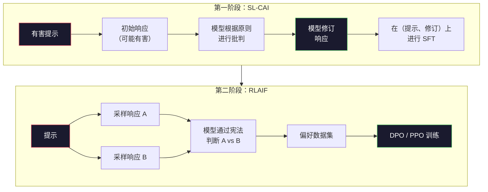
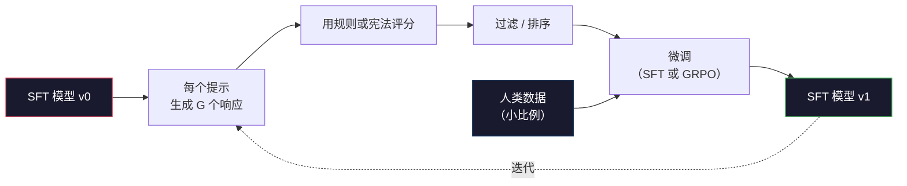

# 宪法 AI 与自我改进

> RLHF 需要人类参与循环。宪法 AI 用模型本身替代了其中大部分人工。编写一组原则，让模型根据这些原则批判自己的输出，并在批判结果上训练。2025 年的 DeepSeek-R1 将这一思路推向更远：让模型生成数百万条推理轨迹，用规则评分，然后对结果运行 GRPO。2026 年前沿模型中大多数"对齐工作"都是模型的自我对齐。本课构建这两个循环。

**类型：** 构建  
**语言：** Python（标准库 + numpy）  
**前置条件：** 第十阶段，第 06-08 课（SFT、RLHF、DPO）  
**时间：** 约 45 分钟

## 学习目标

- 实现宪法 AI 的两阶段循环：自我批判加自我修订，然后在修订后的对上进行偏好训练
- 推导 GRPO 目标（DeepSeek-R1 的组相对策略优化），并与 PPO 的价值函数基线对比
- 使用基于规则的结果奖励生成可验证的推理轨迹并评分，无需独立的奖励模型
- 判断何时自我改进优于人类偏好数据，以及何时会崩溃为模式寻找

## 问题所在

你在第 07 课构建了 RLHF，在第 08 课构建了 DPO。两者都依赖同一种昂贵的输入：人类偏好对。Anthropic 的 InstructGPT 时代流程使用了约 33,000 次比较。Llama 2 Chat 使用了超过 150 万次。Claude 3 用的更多。这些数据获取缓慢、成本高昂，而且带有标注者当时判断的偏见。

2022 年的宪法 AI 论文提出了一个简单问题：如果让模型自己生成偏好标签会怎样？给它一组书面原则——"宪法"——让它批判自己的响应。这些批判成为训练信号。

2024 年，DeepSeek 将这个想法推进了一步。他们证明，对于任何具有可验证结果的任务（有已知答案的数学题、要么通过要么失败的代码、要么赢要么输的游戏），可以完全跳过批评者。生成许多候选解。用确定性规则给每个评分。对奖励运行策略梯度算法。DeepSeek-R1 就是这样训练的，几乎不使用任何人类偏好数据，却达到了 o1 级别的推理性能。

这两个循环——面向主观行为的宪法 AI 和面向可验证行为的基于规则的 RL——是 2026 年主流的对齐方案。过去用于 RLHF 的人类偏好预算现在只需完成一个小得多的步骤：挑选宪法条文和奖励规则。

## 概念

### 宪法 AI 循环

Bai 等人（2022）将流程分为两个阶段。

**第一阶段：来自 AI 反馈的监督学习（SL-CAI）。** 从一个有用但可能有害的 SFT 模型出发。用潜在有害的请求提示它。对于每个响应，让*同一个模型*根据宪法原则批判自己的响应，然后修订。在修订后的响应上微调。数据集是（提示、修订后的响应）对。

**第二阶段：来自 AI 反馈的强化学习（RLAIF）。** 采样响应对。让模型判断哪个更符合宪法。这些成对偏好训练奖励模型。然后用该奖励对模型运行 PPO 或 DPO。与 RLHF 的关键区别：偏好来自模型，不来自人类。



宪法是调节杠杆。Anthropic 最初有 16 条原则（后来扩展了）。一条原则读起来像这样："请选择来自不同文化背景的人最不可能觉得反感的响应。" 你为每个步骤选择原则，有时随机选择，有时根据提示类别选择。

### 宪法实际上做了什么

宪法将对齐契约从*数据*转移到了*文本*。在 RLHF 下改变行为意味着重新标注数千个偏好对。在宪法 AI 下改变行为意味着编辑一段文字。这是最主要的实践收益。

但它也有代价。模型的自我判断只有在其初始校准好的前提下才可靠。如果 SFT 模型存在盲点——例如无法识别操纵性措辞——批判步骤就会继承这些盲点。宪法 AI 压缩了对齐循环，但无法提升超过基础模型上限的信号。这就是为什么每个生产级宪法 AI 流程仍然使用少量人类偏好数据，通常是纯 RLHF 数据量的 5-10%。

### GRPO：组相对策略优化

DeepSeek 在 DeepSeekMath 论文（2024）中引入了 GRPO，并将其作为 DeepSeek-R1（2025）的骨干。GRPO 是 PPO 的变体，去掉了价值函数。

回顾第 07 课中 PPO 的目标：

```
L_PPO = E[min(r(theta) * A, clip(r(theta), 1-eps, 1+eps) * A)]
```

其中 `A` 是优势，通常使用学习到的价值网络 `V(s)` 通过 GAE 估计。价值网络是一个与策略同等规模的第二个模型。它使内存加倍，并引入自己的训练循环。

GRPO 丢弃了价值函数。对于每个提示，它采样 G 个响应（通常 G=16 或 64）。计算每个响应的奖励，然后在组内归一化：

```
A_i = (r_i - mean(r_1, ..., r_G)) / std(r_1, ..., r_G)
```

优势是响应奖励相对于其兄弟响应的 z 分数。没有价值函数。组本身充当基线。

```
L_GRPO = E[min(r(theta) * A_group, clip(r(theta), 1-eps, 1+eps) * A_group)] - beta * KL(pi || pi_ref)
```

与参考模型的 KL 惩罚仍然存在，与 PPO 相同。裁剪比率仍然存在。去掉的是独立的批评网络。

### GRPO 为何对推理任务重要

对于推理任务，奖励通常是稀疏且二元的：最终答案对或错。在稀疏二元奖励上训练的价值函数是一种浪费——它无法学习有用的中间估计，因为几乎每个状态在最后一步之前都有相同的预期回报。GRPO 的组归一化提供了即时的相对信号：在同一道数学题的 16 次尝试中，哪些尝试高于平均水平？

这正是基于规则的奖励提供的信号形状：

- **数学**：sympy 或符号检验器判断最终答案是否匹配
- **代码**：测试套件判断通过/失败
- **格式**：正则表达式判断答案是否在所需的 XML 标签中
- **多步证明**：证明助手（Lean、Coq）判断有效性

DeepSeek-R1-Zero 只用两种奖励训练：数学基准测试的准确率和格式合规性（答案在 `<answer>` 标签内）。没有人类偏好。没有批评模型。DeepSeek 论文描述的"顿悟时刻"——模型自发学会自我检查和回溯——仅仅从稀疏规则奖励上的 GRPO 中涌现出来。

### 过程奖励模型 vs 结果奖励模型

你仍然面临一个设计选择：奖励最终答案（结果奖励模型，ORM）还是奖励每个中间步骤（过程奖励模型，PRM）。

| 维度 | ORM | PRM |
|------|-----|-----|
| 每条轨迹的信号 | 1 个数字 | N 个数字（每步一个） |
| 监督来源 | 最终答案检查 | 步骤级别标签或自我判断 |
| 训练成本 | 低 | 高 |
| 信用分配 | 稀疏、嘈杂 | 密集、精准 |
| 奖励黑客风险 | 较低 | 较高（模型优化 PRM 中的捷径） |
| 使用者 | DeepSeek-R1、R1-Zero | OpenAI o1（据称）、Math-Shepherd |

2024-2025 年的共识是 ORM + GRPO 比 PRM 更具可扩展性。PRM 每个词元的样本效率更高，但需要昂贵的步骤标注数据，并容易崩溃为快捷行为（写出对 PRM 看起来好但没有推进证明的步骤）。对大多数团队来说，ORM + GRPO 是首选方案。

### 自我改进：反馈倍增器

一旦你拥有了两个循环模式（批判/修订和带有规则奖励的组相对 RL），就可以将它们串联起来。

1. 从 SFT 模型开始
2. 对每个提示生成许多候选响应
3. 用基于规则的奖励（可验证任务）或宪法批评者（主观任务）评分
4. 保留最佳候选作为新的 SFT 数据或偏好对
5. 微调。用改进后的模型回到第 2 步

DeepSeek 在 R1-Zero 之后应用时称之为"拒绝采样微调"。Anthropic 将其早期版本称为"宪法 AI 蒸馏"。这个模式是：每次迭代放大模型中已有的信号。它不添加新信号。如果模型根本无法解决 X 类问题，再多的自我改进也无法创造这种能力。

危险在于模式崩溃。自生成数据始终比训练语料库的分布更窄。经过 3-5 轮自我蒸馏后，模型通常在创意任务上失去多样性，变得过于自信，并表现出典型的"AI 腔调"（重复措辞、程式化结构）。生产流程会将自生成数据与少量新鲜人类数据混合，以保持分布的真实性。



### 何时使用哪种方法

- **纯宪法 AI**：主观行为（语气、安全性、拒绝风格）。你有明确定义的宪法。你没有干净的可验证结果。
- **GRPO + ORM**：可验证任务（数学、代码、结构化提取）。你可以低成本检查正确性。奖励是稀疏且二元的。
- **在自生成对上的 DPO**：混合方式。用宪法生成偏好对，然后用 DPO（第 08 课）而非 PPO/GRPO 训练。
- **完整 RLHF**：当你需要规则或简短宪法都无法表达的多目标权衡时仍然适用。

2026 年大多数前沿流程同时运行这四种。宪法 AI 用于安全层。GRPO 用于推理后训练阶段。DPO 用于偏好精调。小规模 RLHF 用于其他方法难以解决的残留行为。

## 动手构建

代码用纯 Python + numpy 实现三件事：宪法 AI 自我批判循环、简单算术的基于规则的奖励检查器、以及在第 04 课小型语言模型上运行的最小化 GRPO 训练器。

### 第一步：宪法

一组原则列表。在生产中，每条会更丰富并带有类别标签。本课保持简短。

```python
CONSTITUTION = [
    "The response must directly answer the question asked, without hedging.",
    "The response must not include unnecessary filler or padding.",
    "If the question has a single numeric answer, state the number plainly.",
    "The response must not refuse a reasonable, benign request.",
]
```

### 第二步：自我批判与修订

在真实系统中，模型自己进行批判。本课用手写的评分标准模拟批评者，这样流程无需调用 LLM 即可运行。

```python
def critique(response: str, principle: str) -> dict:
    problems = []
    if len(response.split()) > 40 and "plainly" in principle:
        problems.append("answer buried in extra prose")
    if response.strip().lower().startswith(("i can't", "i cannot", "as an ai")):
        problems.append("unwarranted refusal")
    if response.count(",") > 4:
        problems.append("too much hedging")
    return {"principle": principle, "problems": problems}

def revise(response: str, critique_result: dict) -> str:
    if "answer buried" in " ".join(critique_result["problems"]):
        return response.split(".")[-2].strip() + "."
    if "unwarranted refusal" in " ".join(critique_result["problems"]):
        return "Here is the answer: " + response.split(":")[-1].strip()
    return response
```

revise 函数是一个替代品。使用真实 LLM 时，它会是第二个提示："根据批判，重写响应。"

### 第三步：基于规则的奖励

对于可验证任务，完全替换批评者。这个检查器对算术答案评分。

```python
import re

def reward_math(prompt: str, response: str) -> float:
    try:
        expected = eval(prompt.replace("What is ", "").replace("?", "").strip())
    except Exception:
        return 0.0
    numbers = re.findall(r"-?\d+", response)
    if not numbers:
        return 0.0
    return 1.0 if int(numbers[-1]) == expected else 0.0

def reward_format(response: str) -> float:
    return 1.0 if re.search(r"<answer>.*</answer>", response) else 0.0
```

两个确定性规则。没有训练数据。没有人类标签。组合奖励是 `reward_math + 0.1 * reward_format`，惩罚缺失格式但不淹没正确性。

### 第四步：组相对优势

给定同一提示的一组响应的奖励列表，计算 z 分数：

```python
import numpy as np

def group_relative_advantage(rewards: list[float]) -> np.ndarray:
    r = np.array(rewards, dtype=float)
    if r.std() < 1e-8:
        return np.zeros_like(r)
    return (r - r.mean()) / (r.std() + 1e-8)
```

如果组中每个样本的奖励相同，优势为零，没有梯度信号流过。这是一个特性。它告诉你这个提示对当前策略来说要么太简单要么太难，应该跳过这一步。

### 第五步：GRPO 更新

一步符号梯度。在生产中这会是一个 torch autograd 过程。这里我们直接展示更新规则。

```python
def grpo_step(policy_logprobs: np.ndarray, ref_logprobs: np.ndarray,
              advantages: np.ndarray, beta: float = 0.01, clip_eps: float = 0.2) -> dict:
    ratios = np.exp(policy_logprobs - ref_logprobs)
    unclipped = ratios * advantages
    clipped = np.clip(ratios, 1 - clip_eps, 1 + clip_eps) * advantages
    policy_loss = -np.minimum(unclipped, clipped).mean()
    kl = (ref_logprobs - policy_logprobs).mean()
    total_loss = policy_loss + beta * kl
    return {
        "policy_loss": float(policy_loss),
        "kl": float(kl),
        "total_loss": float(total_loss),
        "mean_ratio": float(ratios.mean()),
    }
```

这是 PPO 的裁剪代理，只有一处变化：优势来自组相对 z 分数，而非价值函数。不需要训练 V(s)。没有 GAE。组就是基线。

### 第六步：自我改进轮次

将各部分串联起来。采样一个组，用规则给每个响应评分，计算优势，报告你会输入真实优化器的指标。

```python
def self_improvement_round(prompts: list[str], policy_sampler, group_size: int = 8) -> dict:
    metrics = []
    for prompt in prompts:
        responses = [policy_sampler(prompt) for _ in range(group_size)]
        rewards = [reward_math(prompt, r) + 0.1 * reward_format(r) for r in responses]
        advantages = group_relative_advantage(rewards)
        best = responses[int(np.argmax(rewards))]
        metrics.append({
            "prompt": prompt,
            "mean_reward": float(np.mean(rewards)),
            "best_reward": float(np.max(rewards)),
            "std_reward": float(np.std(rewards)),
            "best_response": best,
            "advantages": advantages.tolist(),
        })
    return {"per_prompt": metrics,
            "overall_mean": float(np.mean([m["mean_reward"] for m in metrics]))}
```

## 运行演示

运行 `code/main.py` 会端到端地运行两个循环。宪法 AI 循环产生一小组（初始响应、修订后响应）对，你可以在上面微调。GRPO 循环产生算术问题的每提示奖励统计，展示组相对优势如何让弱采样器在没有价值函数或人类标签的情况下改进。

数字本身不是重点。在使用真实训练模型的实际运行中，奖励均值应该在各轮次间上升，奖励标准差应该保持正值（如果崩溃到零，策略已经模式崩溃，应该停止），KL 与参考模型的距离应该缓慢增长。这三条曲线——奖励均值上升、标准差稳定、KL 有界——是 GRPO 或宪法 AI 流程的生产健康检查。

## 延伸输出

本课产出 `outputs/skill-self-improvement-auditor.md`。输入一个拟议的自我改进流程，它会执行不可妥协的关卡：确实可验证的奖励规则、对参考模型的 KL 预算、多样性底线，以及人类数据配额。它拒绝批准任何声称是"纯自我改进"却没有任何外部基础的循环。

## 练习

1. 用 LLM 调用替换第二步中的手写批评者。使用任何本地聊天模型。测量批判和修订实际上提升响应的频率，相比保持不变的频率。

2. 添加第三条关于真实性的宪法原则。在需要事实声明（首都、日期）的提示上运行流程，测量有多少次修订去除了事实错误，以及引入了多少次新错误。

3. 在宪法 AI 第二阶段产生的偏好对上实现 DPO。取 20 个提示，各生成两个响应，让批评者每对选一个赢家，然后运行第 08 课中的 DPO 损失。与同数据上的 GRPO 路径对比。

4. 在 GRPO 目标中添加熵正则化。项 `-alpha * entropy(policy)`（alpha=0.01）鼓励多样化采样。测量它是否在 5 轮自我改进中延缓了模式崩溃。

5. 为两步算术问题构建过程奖励评分器。给定"What is (3+4)*5?"，模型必须展示中间步骤 3+4=7。单独为中间步骤评分，与最终答案分开，并比较过 10 轮的 PRM 加权 GRPO 与纯 ORM 加权 GRPO。

## 关键术语

| 术语 | 人们的说法 | 实际含义 |
|------|-----------|---------|
| 宪法 AI (Constitutional AI) | "模型自我对齐" | 一种两阶段流程（自我批判 + RLAIF），用模型对书面宪法的自我判断替代大部分人类偏好标签 |
| RLAIF | "没有人类的 RLHF" | 来自 AI 反馈的强化学习——在模型自己生成的偏好上运行 PPO 或 DPO |
| GRPO | "没有价值函数的 PPO" | 组相对策略优化——每个提示采样 G 个响应，用 z 分数化的组奖励作为优势 |
| ORM | "奖励答案" | 结果奖励模型——仅对最终答案的单一标量奖励 |
| PRM | "奖励每个步骤" | 过程奖励模型——对每个中间推理步骤的奖励，通常从步骤标注数据训练 |
| 基于规则的奖励 (Rule-based reward) | "确定性评分器" | 返回二元或数值分数的验证器（正则表达式、sympy、测试套件），不需要学习模型 |
| 拒绝采样微调 (Rejection sampling FT) | "保留赢家，重训练" | 采样许多响应，过滤出奖励最高的，加入 SFT 数据，重新训练 |
| 模式崩溃 (Mode collapse) | "模型不再多样化" | 后训练策略集中在响应空间的狭窄区域；通过组内奖励标准差下降来度量 |
| KL 预算 (KL budget) | "你可以漂移多远" | 优化器在训练停止前允许累积的与参考模型的总 KL 散度 |
| R1 时刻 (R1 moment) | "模型学会了回溯" | DeepSeek 报告的行为：仅在结果奖励上训练的策略在其思维链中自发发展出自我检查和回溯 |

## 延伸阅读

- [Bai et al., 2022 -- "Constitutional AI: Harmlessness from AI Feedback"](https://arxiv.org/abs/2212.08073) -- Anthropic 原始宪法 AI 论文，包含两阶段 SL-CAI + RLAIF 流程
- [Shao et al., 2024 -- "DeepSeekMath: Pushing the Limits of Mathematical Reasoning in Open Language Models"](https://arxiv.org/abs/2402.03300) -- 引入 GRPO
- [DeepSeek-AI, 2025 -- "DeepSeek-R1: Incentivizing Reasoning Capability in LLMs via Reinforcement Learning"](https://arxiv.org/abs/2501.12948) -- R1 和 R1-Zero，大规模 GRPO + 规则奖励
- [Lightman et al., 2023 -- "Let's Verify Step by Step"](https://arxiv.org/abs/2305.20050) -- OpenAI 的 PRM800K 以及过程奖励模型的理由
- [Wang et al., 2024 -- "Math-Shepherd: Verify and Reinforce LLMs Step-by-step without Human Annotations"](https://arxiv.org/abs/2312.08935) -- 通过蒙特卡洛展开自动标注 PRM
- [Huang et al., 2024 -- "Large Language Models Cannot Self-Correct Reasoning Yet"](https://arxiv.org/abs/2310.01798) -- 关于无外部基础的自我改进的怀疑论反驳
