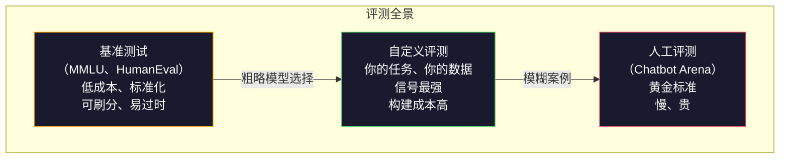
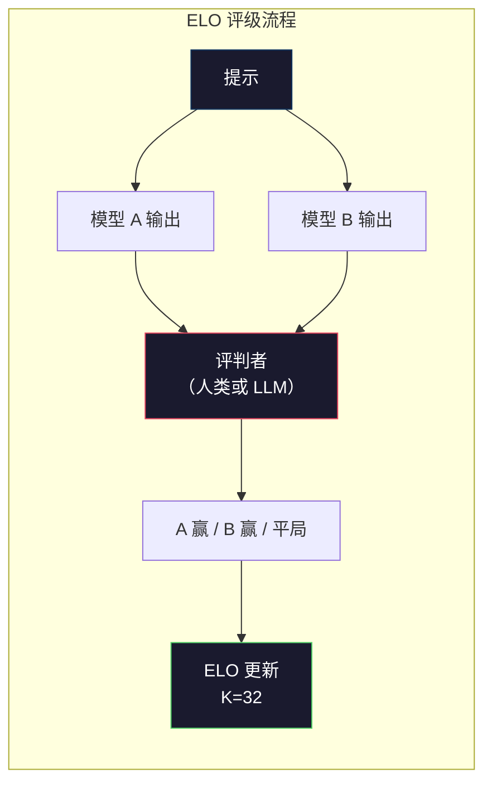

# 评估：基准测试、评测套件、LM Harness

> 古德哈特定律：当一个指标变成目标时，它就不再是好指标了。每个前沿实验室都在刷基准分数。MMLU 分数不断攀升，但模型仍然无法可靠地数出"strawberry"里有几个 R。唯一重要的评测是你自己的评测——针对你的任务、使用你的数据。

**类型：** 构建  
**语言：** Python  
**前置条件：** 第十阶段，第 01-05 课（从零构建 LLM）  
**时间：** 约 90 分钟

## 学习目标

- 构建一个自定义评测框架，对语言模型运行多选题和开放式基准测试
- 解释为何标准基准测试（MMLU、HumanEval）会饱和并无法区分前沿模型
- 使用恰当的指标实现特定任务评测：精确匹配、F1、BLEU 和 LLM-as-judge 评分
- 设计针对你具体用例的自定义评测套件，而非仅依赖公开排行榜

## 问题所在

MMLU 于 2020 年发布，涵盖 57 个学科的 15,908 道题目。不到三年，前沿模型就使其饱和。GPT-4 得分 86.4%，Claude 3 Opus 得分 86.8%，Llama 3 405B 得分 88.6%。排行榜压缩到 3 个百分点的范围内，差异已是统计噪声，而非真实能力差距。

与此同时，那些相同的模型在 10 岁孩子不假思索就能完成的任务上屡屡失败。得了 MMLU 88.7% 的 Claude 3.5 Sonnet，最初无法数出"strawberry"里的字母——这个任务不需要任何世界知识和推理，只需字符级遍历。HumanEval 用 164 道题测试代码生成。模型得分超过 90%，同时仍然产出在任何初级开发者都能捕获的边缘情况下崩溃的代码。

基准性能与真实世界可靠性之间的鸿沟，是 LLM 评估的核心问题。基准测试告诉你模型在基准上的表现。它们几乎不能告诉你模型在你的具体任务、具体数据、具体失败模式下的表现。如果你在构建客户支持机器人，MMLU 就无关紧要。如果你在构建代码助手，HumanEval 只涵盖函数级生成——它对跨文件的调试、重构或代码解释什么也说不了。

你需要自定义评测。不是因为基准测试没用——它们对粗略的模型选择有用——而是因为最终评测必须与你的部署条件完全匹配。

## 概念

### 评测全景

评测分为三类，各有不同的成本和信号质量。

**基准测试**是标准化测试套件。MMLU、HumanEval、SWE-bench、MATH、ARC、HellaSwag。你对基准运行模型并获得分数。优点：所有人使用相同的测试，因此可以比较模型。缺点：模型和训练数据越来越多地污染这些基准。实验室在包含基准题目的数据上训练。分数上升。能力未必如此。

**自定义评测**是你为具体用例构建的测试套件。你定义输入、预期输出和评分函数。法律文档摘要器在法律文档上评估。SQL 生成器在你的数据库 schema 上评估。创建成本高，但这是唯一能预测生产性能的评测。

**人工评测**使用付费标注者根据有用性、正确性、流畅性和安全性等标准判断模型输出。对自动评分失败的开放式任务来说是黄金标准。Chatbot Arena 已收集了 100+ 个模型的 200 万+ 人类偏好投票。缺点：成本（每次判断 0.10-2.00 美元）和速度（数小时到数天）。



### 基准测试为何失效

三种机制导致基准分数不再反映真实能力。

**数据污染。** 训练语料库爬取互联网。基准题目存在于互联网上。模型在训练期间看到了答案。这不是传统意义上的作弊——实验室并非故意纳入基准数据。但网络规模的爬取使排除它们几乎不可能。

**应试教学。** 实验室为基准性能优化训练混合。如果训练混合中有 5% 是 MMLU 风格的多选题，模型就会学习格式和答案分布。MMLU 是四选一多选题。模型学到答案分布在 A/B/C/D 之间大致均匀，这有助于提分，即使模型不知道答案。

**饱和。** 当每个前沿模型在基准上都得了 85-90% 时，基准就失去了区分能力。剩余的 10-15% 的题目可能存在歧义、标注错误，或需要冷僻的领域知识。从 MMLU 87% 提升到 89% 可能意味着模型多记住了两道冷门题，而非变得更聪明。

### 困惑度：快速健康检查

困惑度（Perplexity）衡量模型对一个词元序列有多"惊讶"。形式上，它是指数化的平均负对数似然：

```
PPL = exp(-1/N * sum(log P(token_i | context)))
```

困惑度为 10 意味着模型在每个词元位置上平均不确定程度等同于从 10 个选项中均匀选择。越低越好。GPT-2 在 WikiText-103 上的困惑度约为 30，GPT-3 约为 20，Llama 3 8B 约为 7。

困惑度对在同一测试集上比较模型很有用，但有盲点。模型可以通过擅长预测常见模式而困惑度很低，但在稀有但重要的模式上表现极差。它对指令遵循、推理或事实准确性也什么都说不了。把它当作健全性检查，而非最终裁决。

### LLM-as-Judge

用强模型评估弱模型的输出。思路很简单：让 GPT-4o 或 Claude Sonnet 在 1-5 分的量表上评价响应的正确性、有用性和安全性。用 GPT-4o-mini 每次判断约花 0.01 美元，与人类判断的吻合度令人惊讶地高——在大多数任务上约有 80% 一致性。

评分提示词比模型更重要。模糊的提示（"给这个响应评分"）产生嘈杂的分数。带有评分标准的结构化提示（"若答案事实正确且引用了来源则打 5 分，正确但未引用来源打 4 分，部分正确打 3 分……"）产生一致、可重现的分数。

失败模式：评判模型表现出位置偏见（在成对比较中偏爱第一个响应）、冗长偏见（偏爱更长的响应）和自我偏好（GPT-4 给 GPT-4 输出打的分高于等效 Claude 输出）。缓解措施：随机化顺序、对长度归一化、使用与被评估模型不同的评判模型。

### 基于成对比较的 ELO 评级

Chatbot Arena 的方法。向不同模型展示同一提示的两个响应。人类（或 LLM 评判者）选出更好的一个。从数千次这样的比较中，为每个模型计算 ELO 评级——与国际象棋中使用的系统相同。

ELO 的优点：相对排名比绝对评分更可靠，优雅处理平局，收敛所需的比较次数少于独立评分每个输出。截至 2026 年初，Chatbot Arena 排名显示 GPT-4o、Claude 3.5 Sonnet 和 Gemini 1.5 Pro 在顶部彼此相差 20 个 ELO 分以内。



### 评测框架

**lm-evaluation-harness**（EleutherAI）：标准开源评测框架。支持 200+ 个基准测试。用一条命令对任何 Hugging Face 模型运行 MMLU、HellaSwag、ARC 等。Open LLM Leaderboard 使用它。

**RAGAS**：专门针对 RAG 流程的评测框架。测量忠实度（答案是否与检索到的上下文匹配）、相关性（检索到的上下文是否与问题相关）和答案正确性。

**promptfoo**：配置驱动的提示工程评测。在 YAML 中定义测试用例，对多个模型运行，得到通过/失败报告。对提示回归测试很有用——确保提示更改不会破坏现有测试用例。

### 构建自定义评测

这是生产中唯一重要的评测。流程：

1. **定义任务。** 模型应该做什么？要精确。"回答问题"太模糊。"给定一封客户投诉邮件，提取产品名称、问题类别和情感倾向"是可评测的任务。

2. **创建测试用例。** 原型评测至少 50 个，生产评测 200 个以上。每个测试用例是一个（输入、预期输出）对。包含边缘情况：空输入、对抗性输入、模糊输入、其他语言的输入。

3. **定义评分。** 结构化输出用精确匹配。文本相似度用 BLEU/ROUGE。开放式质量用 LLM-as-judge。提取任务用 F1。用权重组合多个指标。

4. **自动化。** 每次评测用一条命令运行。没有手动步骤。以支持随时间比较的格式存储结果。

5. **随时间追踪。** 孤立的评测分数没有意义。你需要趋势线。上次提示更改后分数提高了吗？切换模型后有没有回退？将评测与提示一起版本化。

| 评测类型 | 每次判断成本 | 与人类的一致性 | 最适用于 |
|---------|------------|-------------|--------|
| 精确匹配 | ~$0 | 100%（适用时） | 结构化输出、分类 |
| BLEU/ROUGE | ~$0 | ~60% | 翻译、摘要 |
| LLM-as-judge | ~$0.01 | ~80% | 开放式生成 |
| 人工评测 | $0.10-$2.00 | N/A（就是真实标准） | 模糊、高风险任务 |

## 动手构建

### 第一步：最小化评测框架

定义核心抽象。评测用例有输入、预期输出和可选的元数据字典。评分器接受预测和参考，返回 0 到 1 之间的分数。

```python
import json
from collections import Counter

class EvalCase:
    def __init__(self, input_text, expected, metadata=None):
        self.input_text = input_text
        self.expected = expected
        self.metadata = metadata or {}

class EvalSuite:
    def __init__(self, name, cases, scorers):
        self.name = name
        self.cases = cases
        self.scorers = scorers

    def run(self, model_fn):
        results = []
        for case in self.cases:
            prediction = model_fn(case.input_text)
            scores = {}
            for scorer_name, scorer_fn in self.scorers.items():
                scores[scorer_name] = scorer_fn(prediction, case.expected)
            results.append({
                "input": case.input_text,
                "expected": case.expected,
                "prediction": prediction,
                "scores": scores,
            })
        return results
```

### 第二步：评分函数

构建精确匹配、词元 F1 和模拟 LLM-as-judge 评分器。

```python
def exact_match(prediction, expected):
    return 1.0 if prediction.strip().lower() == expected.strip().lower() else 0.0

def token_f1(prediction, expected):
    pred_tokens = set(prediction.lower().split())
    exp_tokens = set(expected.lower().split())
    if not pred_tokens or not exp_tokens:
        return 0.0
    common = pred_tokens & exp_tokens
    precision = len(common) / len(pred_tokens)
    recall = len(common) / len(exp_tokens)
    if precision + recall == 0:
        return 0.0
    return 2 * (precision * recall) / (precision + recall)

def llm_judge_simulated(prediction, expected):
    pred_words = set(prediction.lower().split())
    exp_words = set(expected.lower().split())
    if not exp_words:
        return 0.0
    overlap = len(pred_words & exp_words) / len(exp_words)
    length_penalty = min(1.0, len(prediction) / max(len(expected), 1))
    return round(overlap * 0.7 + length_penalty * 0.3, 3)
```

### 第三步：ELO 评级系统

实现带 ELO 更新的成对比较。这正是 Chatbot Arena 用来排名模型的系统。

```python
class ELOTracker:
    def __init__(self, k=32, initial_rating=1500):
        self.ratings = {}
        self.k = k
        self.initial_rating = initial_rating
        self.history = []

    def _ensure_player(self, name):
        if name not in self.ratings:
            self.ratings[name] = self.initial_rating

    def expected_score(self, rating_a, rating_b):
        return 1 / (1 + 10 ** ((rating_b - rating_a) / 400))

    def record_match(self, player_a, player_b, outcome):
        self._ensure_player(player_a)
        self._ensure_player(player_b)

        ea = self.expected_score(self.ratings[player_a], self.ratings[player_b])
        eb = 1 - ea

        if outcome == "a":
            sa, sb = 1.0, 0.0
        elif outcome == "b":
            sa, sb = 0.0, 1.0
        else:
            sa, sb = 0.5, 0.5

        self.ratings[player_a] += self.k * (sa - ea)
        self.ratings[player_b] += self.k * (sb - eb)

        self.history.append({
            "a": player_a, "b": player_b,
            "outcome": outcome,
            "rating_a": round(self.ratings[player_a], 1),
            "rating_b": round(self.ratings[player_b], 1),
        })

    def leaderboard(self):
        return sorted(self.ratings.items(), key=lambda x: -x[1])
```

### 第四步：困惑度计算

使用词元概率计算困惑度。实践中你会从模型的 logits 获取这些数据。这里用概率分布模拟。

```python
import numpy as np

def perplexity(log_probs):
    if not log_probs:
        return float("inf")
    avg_neg_log_prob = -np.mean(log_probs)
    return float(np.exp(avg_neg_log_prob))

def token_log_probs_simulated(text, model_quality=0.8):
    np.random.seed(hash(text) % 2**31)
    tokens = text.split()
    log_probs = []
    for i, token in enumerate(tokens):
        base_prob = model_quality
        if len(token) > 8:
            base_prob *= 0.6
        if i == 0:
            base_prob *= 0.7
        prob = np.clip(base_prob + np.random.normal(0, 0.1), 0.01, 0.99)
        log_probs.append(float(np.log(prob)))
    return log_probs
```

### 第五步：汇总结果

计算评测运行的汇总统计：均值、中位数、阈值下的通过率和各指标细分。

```python
def summarize_results(results, threshold=0.8):
    all_scores = {}
    for r in results:
        for metric, score in r["scores"].items():
            all_scores.setdefault(metric, []).append(score)

    summary = {}
    for metric, scores in all_scores.items():
        arr = np.array(scores)
        summary[metric] = {
            "mean": round(float(np.mean(arr)), 3),
            "median": round(float(np.median(arr)), 3),
            "std": round(float(np.std(arr)), 3),
            "min": round(float(np.min(arr)), 3),
            "max": round(float(np.max(arr)), 3),
            "pass_rate": round(float(np.mean(arr >= threshold)), 3),
            "n": len(scores),
        }
    return summary

def print_summary(summary, suite_name="Eval"):
    print(f"\n{'=' * 60}")
    print(f"  {suite_name} 摘要")
    print(f"{'=' * 60}")
    for metric, stats in summary.items():
        print(f"\n  {metric}：")
        print(f"    均值：      {stats['mean']:.3f}")
        print(f"    中位数：    {stats['median']:.3f}")
        print(f"    标准差：    {stats['std']:.3f}")
        print(f"    范围：      [{stats['min']:.3f}, {stats['max']:.3f}]")
        print(f"    通过率：    {stats['pass_rate']:.1%}（阈值 >= 0.8）")
        print(f"    样本数：    {stats['n']}")
```

### 第六步：运行完整流程

将所有部分串联起来。定义任务，创建测试用例，模拟两个模型，运行评测，从成对比较中计算 ELO，打印排行榜。

```python
def demo_model_good(prompt):
    responses = {
        "What is the capital of France?": "Paris",
        "What is 2 + 2?": "4",
        "Who wrote Hamlet?": "William Shakespeare",
        "What language is PyTorch written in?": "Python and C++",
        "What is the boiling point of water?": "100 degrees Celsius",
    }
    return responses.get(prompt, "I don't know")

def demo_model_bad(prompt):
    responses = {
        "What is the capital of France?": "Paris is the capital city of France",
        "What is 2 + 2?": "The answer is four",
        "Who wrote Hamlet?": "Shakespeare",
        "What language is PyTorch written in?": "Python",
        "What is the boiling point of water?": "212 Fahrenheit",
    }
    return responses.get(prompt, "Unknown")

cases = [
    EvalCase("What is the capital of France?", "Paris"),
    EvalCase("What is 2 + 2?", "4"),
    EvalCase("Who wrote Hamlet?", "William Shakespeare"),
    EvalCase("What language is PyTorch written in?", "Python and C++"),
    EvalCase("What is the boiling point of water?", "100 degrees Celsius"),
]

suite = EvalSuite(
    name="General Knowledge",
    cases=cases,
    scorers={
        "exact_match": exact_match,
        "token_f1": token_f1,
        "llm_judge": llm_judge_simulated,
    },
)

results_good = suite.run(demo_model_good)
results_bad = suite.run(demo_model_bad)

print_summary(summarize_results(results_good), "模型 A（简洁）")
print_summary(summarize_results(results_bad), "模型 B（冗长）")
```

"好"模型给出精确答案。"坏"模型给出冗长的释义。精确匹配严重惩罚冗长模型。词元 F1 和 LLM-as-judge 则更宽容。这说明了为什么指标选择很重要：同一个模型根据你如何评分，看起来可以很好也可以很差。

### 第七步：ELO 锦标赛

在多轮对比中运行模型间的成对比较。

```python
elo = ELOTracker(k=32)

for case in cases:
    pred_a = demo_model_good(case.input_text)
    pred_b = demo_model_bad(case.input_text)

    score_a = token_f1(pred_a, case.expected)
    score_b = token_f1(pred_b, case.expected)

    if score_a > score_b:
        outcome = "a"
    elif score_b > score_a:
        outcome = "b"
    else:
        outcome = "tie"

    elo.record_match("model_a_concise", "model_b_verbose", outcome)

print("\nELO 排行榜：")
for name, rating in elo.leaderboard():
    print(f"  {name}: {rating:.0f}")
```

### 第八步：困惑度比较

对比不同质量级别"模型"的困惑度。

```python
test_text = "The quick brown fox jumps over the lazy dog in the garden"

for quality, label in [(0.9, "强模型"), (0.7, "中等模型"), (0.4, "弱模型")]:
    log_probs = token_log_probs_simulated(test_text, model_quality=quality)
    ppl = perplexity(log_probs)
    print(f"  {label}（quality={quality}）：困惑度 = {ppl:.2f}")
```

## 使用工具

### lm-evaluation-harness（EleutherAI）

对任何模型运行基准测试的标准工具。

```python
# pip install lm-eval
# 命令行：
# lm_eval --model hf --model_args pretrained=meta-llama/Llama-3.1-8B --tasks mmlu --batch_size 8

# Python API：
# import lm_eval
# results = lm_eval.simple_evaluate(
#     model="hf",
#     model_args="pretrained=meta-llama/Llama-3.1-8B",
#     tasks=["mmlu", "hellaswag", "arc_easy"],
#     batch_size=8,
# )
# print(results["results"])
```

### promptfoo

配置驱动的提示工程评测。在 YAML 中定义测试，对多个提供商运行。

```yaml
# promptfoo.yaml
providers:
  - openai:gpt-4o-mini
  - anthropic:claude-3-haiku

prompts:
  - "Answer in one word: {{question}}"

tests:
  - vars:
      question: "What is the capital of France?"
    assert:
      - type: contains
        value: "Paris"
  - vars:
      question: "What is 2 + 2?"
    assert:
      - type: equals
        value: "4"
```

### 用于 RAG 评估的 RAGAS

```python
# pip install ragas
# from ragas import evaluate
# from ragas.metrics import faithfulness, answer_relevancy, context_precision
#
# result = evaluate(
#     dataset,
#     metrics=[faithfulness, answer_relevancy, context_precision],
# )
# print(result)
```

RAGAS 测量通用评测所忽略的东西：模型的答案是否基于检索到的上下文，而不仅仅是答案抽象上是否"正确"。

## 延伸输出

本课产出 `outputs/prompt-eval-designer.md`——一个为任何任务设计自定义评测套件的可复用提示词。给它一个任务描述，它会生成测试用例、评分函数和通过/失败阈值建议。

还产出 `outputs/skill-llm-evaluation.md`——一个根据你的任务类型、预算和延迟要求选择正确评测策略的决策框架。

## 练习

1. 添加一个"一致性"评分器，将同一输入通过模型运行 5 次，测量输出匹配的频率。在确定性输入上的不一致答案揭示了脆弱的提示词或过高的温度设置。

2. 扩展 ELO 追踪器以支持多个评判函数（精确匹配、F1、LLM-as-judge）并对它们加权。比较当你大权重偏向精确匹配与大权重偏向 F1 时排行榜如何变化。

3. 为具体任务构建评测套件：将邮件分类为 5 个类别。创建 100 个测试用例，包含多样的样本和边缘情况（可能属于多个类别的邮件、空邮件、其他语言的邮件）。测量不同"模型"（基于规则、关键词匹配、模拟 LLM）的表现。

4. 实现污染检测：给定一组评测问题和一个训练语料库，检查有多少百分比的评测问题（或近似释义）出现在训练数据中。这是研究人员审计基准有效性的方法。

5. 构建"模型差异"工具。给定两个模型版本的评测结果，高亮显示哪些具体测试用例提升了、哪些退步了、哪些保持不变。这是代码差异对应的评测版本——对于理解某次更改是否有帮助至关重要。

## 关键术语

| 术语 | 人们的说法 | 实际含义 |
|------|-----------|---------|
| MMLU | "那个基准测试" | 大规模多任务语言理解——57 个学科的 15,908 道多选题，2025 年被前沿模型饱和在 88% 以上 |
| HumanEval | "代码评测" | OpenAI 的 164 道 Python 函数补全题，仅测试孤立的函数生成 |
| SWE-bench | "真实编程评测" | 来自 12 个 Python 仓库的 2,294 个 GitHub issue，测量包括测试生成在内的端到端错误修复 |
| 困惑度 (Perplexity) | "模型有多困惑" | `exp(-avg(log P(token_i given context)))`——越低意味着模型给实际词元分配的概率越高 |
| ELO 评级 | "模型的象棋排名" | 从成对胜负记录计算的相对技能评级，Chatbot Arena 用它对 100+ 个模型排名 |
| LLM-as-judge | "用 AI 给 AI 打分" | 强模型根据评分标准给弱模型的输出打分，与人类评判约 80% 一致，约 0.01 美元/次 |
| 数据污染 (Data contamination) | "模型看过试题" | 训练数据包含基准题目，在没有提升真实能力的情况下虚增分数 |
| 评测套件 (Eval suite) | "一堆测试" | 测量特定能力的版本化（输入、预期输出、评分器）三元组集合 |
| 通过率 (Pass rate) | "答对了多少百分比" | 评测用例中超过阈值的比例——比均值分数更具可操作性，因为它衡量可靠性 |
| Chatbot Arena | "模型排名网站" | LMSYS 平台，拥有 200 万+ 人类偏好投票，通过 ELO 评级产生最可信的 LLM 排行榜 |

## 延伸阅读

- [Hendrycks et al., 2021 -- "Measuring Massive Multitask Language Understanding"](https://arxiv.org/abs/2009.03300) -- MMLU 论文，尽管已饱和仍是被引用最多的 LLM 基准
- [Chen et al., 2021 -- "Evaluating Large Language Models Trained on Code"](https://arxiv.org/abs/2107.03374) -- OpenAI 的 HumanEval 论文，建立了代码生成评估方法论
- [Zheng et al., 2023 -- "Judging LLM-as-a-Judge"](https://arxiv.org/abs/2306.05685) -- 用 LLM 评估 LLM 的系统分析，包括位置偏见和冗长偏见的发现
- [LMSYS Chatbot Arena](https://chat.lmsys.org/) -- 众包模型比较平台，拥有 200 万+ 投票，是最可信的真实世界 LLM 排名
