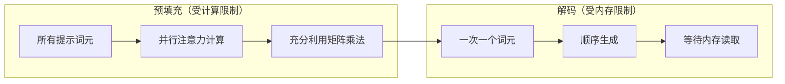
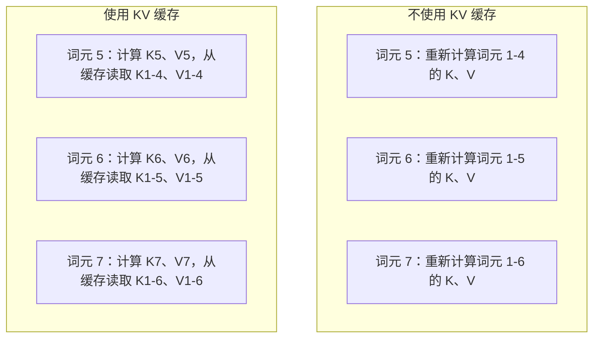
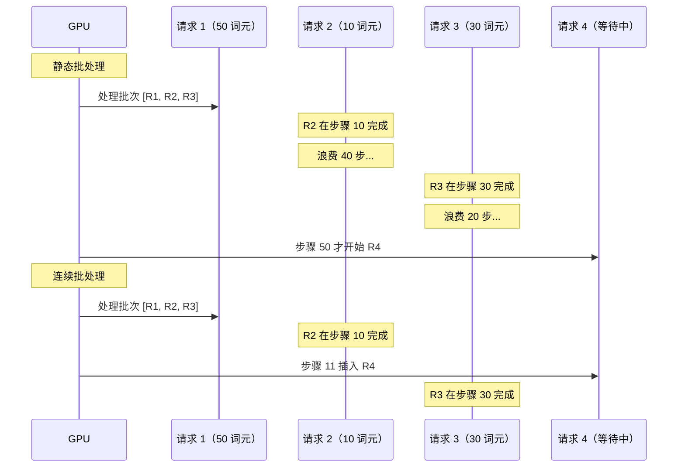
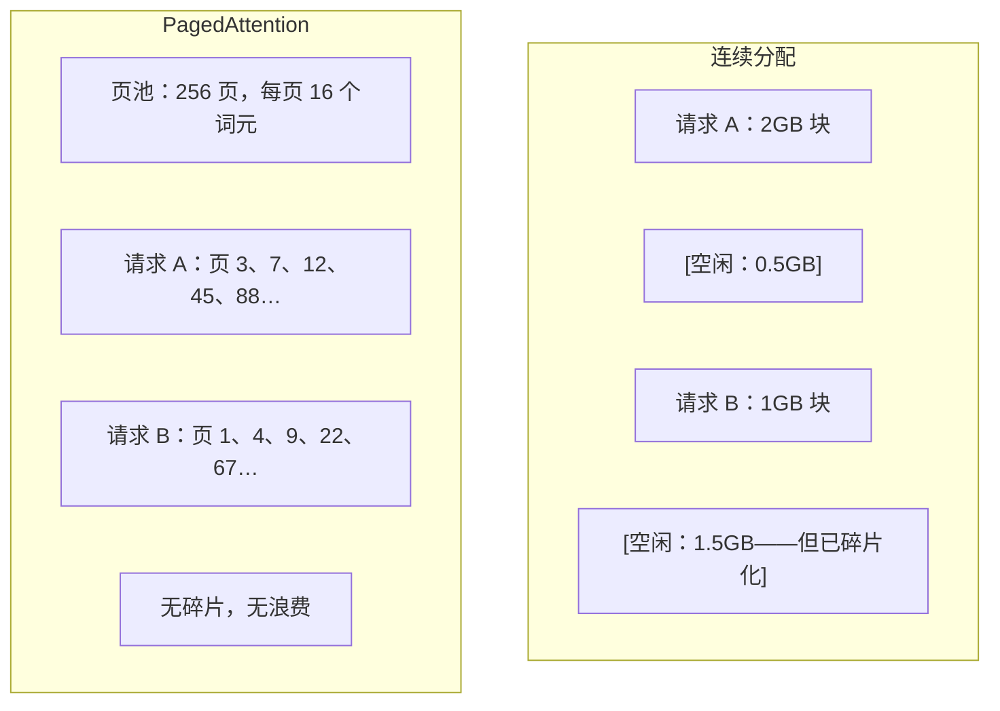
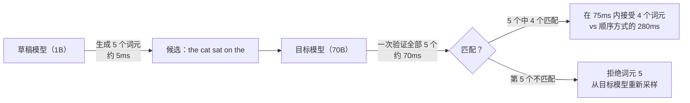

# 推理优化

> LLM 推理由两个阶段定义。预填充并行处理你的提示——受计算限制。解码一次生成一个词元——受内存限制。每种优化都针对其中一个或两者。

**类型：** 构建  
**语言：** Python  
**前置条件：** 第十阶段，第 01-08 课（Transformer 架构、注意力机制）  
**时间：** 约 120 分钟

## 学习目标

- 实现 KV 缓存，消除自回归词元生成期间的冗余计算
- 解释 LLM 推理的预填充与解码阶段，以及为什么各有不同的瓶颈（受计算限制 vs 受内存限制）
- 实现连续批处理和 PagedAttention 概念，在并发请求下最大化 GPU 利用率
- 比较推理优化技术（KV 缓存、投机解码、Flash Attention）及其吞吐量/延迟权衡

## 问题所在

你在 4 张 A100 上部署 Llama 3 70B。单个用户获得约 50 词元/秒的速度。感觉很快。然后 100 个用户同时访问端点。吞吐量降到每用户 3 词元/秒。你每月 25,000 美元的 GPU 账单正在以比人类打字还慢的速度提供响应。

模型本身在 1 个用户和 100 个用户之间没有任何变化。相同的权重，相同的架构，相同的数学运算。改变的是你如何调度工作。朴素推理浪费了 90% 以上的可用 GPU 算力。等待第 47 个词元的用户占据整个批次槽位，而 GPU 内存总线在矩阵乘法之间空闲着。与此同时，一个新用户的 2,000 词元提示本可以填满那段空闲时间来做有用的计算。

这不是扩展问题。这是调度问题。本课的技术——KV 缓存、连续批处理、PagedAttention、投机解码、前缀缓存——正是将每月 25,000 美元推理账单降至 5,000 美元同时服务相同流量的关键。

vLLM 在 4 张 A100-80GB 上服务 Llama 3 70B，低并发时实现约 50 词元/秒/用户，通过连续批处理和 PagedAttention 在 100 个并发请求时维持 15-25 TPS/用户。没有这些优化，同一硬件在该并发度下仅服务 5 TPS/用户。同样的 GPU，同样的模型，4 倍的吞吐量。

## 概念

### 预填充与解码

每个 LLM 推理请求有两个不同的阶段。

**预填充**处理整个输入提示。所有词元都已知，因此可以在完整序列上并行计算注意力。这是一个大型矩阵乘法——GPU 核心保持忙碌。瓶颈是算力：你的硬件每秒能提供多少 FLOPS。A100 能达到 312 TFLOPS（BF16）。在单张 A100 上对 70B 模型进行 4,096 词元提示的预填充需要约 400 毫秒。

**解码**一次生成一个输出词元。每个新词元都要关注所有前面的词元，但每次前向传播只生成一个词元。权重矩阵的大小与预填充时相同，但你在用一个向量而非矩阵乘以它们。GPU 核心在微秒内完成，然后等待下一批权重从内存到来。瓶颈是内存带宽：你能多快将模型权重从 HBM 流式传输到计算单元。A100 有 2 TB/s 带宽。FP16 的 70B 模型是 140 GB。读取整个模型一次需要 70 毫秒——这是单步解码的底限。



**算力/字节比**（也称算术强度）捕获了这种权衡。它衡量每字节内存数据你执行多少次运算。

```
算力/字节比 = 每词元 FLOP 数 / 从内存读取的字节数
```

预填充时批次为 4,096 个词元，每加载一个权重执行约 4,096 次乘加运算。比值很高——受计算限制。解码时批次大小为 1，每加载一个权重执行约 1 次运算。比值很低——受内存限制。

核心洞见：*解码受内存限制，因为你为了生成单个词元而读取整个模型*。下面的每种优化要么减少读取量，要么增加每次读取处理的词元批次，要么完全避免读取。

### KV 缓存

在注意力计算中，每个词元的查询向量需要关注每个前序词元的键和值向量。不使用缓存时，生成第 N 个词元需要重新计算前面所有 N-1 个词元的键和值映射。生成第 2 个词元时计算词元 1 的映射，生成第 3 个词元时再计算一次，第 4 个词元时再计算一次。到第 1,000 个词元时，词元 1 已被映射了 999 次。

KV 缓存存储所有前序词元的键和值映射。生成第 N 个词元时，你只需计算第 N 个词元的键和值，然后将它们与缓存中词元 1 到 N-1 的 K/V 拼接。



**KV 缓存的内存公式：**

```
KV 缓存大小 = 2 * 层数 * KV 头数 * 头维度 * 序列长度 * 每参数字节数
```

对于 Llama 3 70B（80 层、8 个 KV 头（使用 GQA）、head_dim=128、BF16）：

```
每词元：2 * 80 * 8 * 128 * 2 字节 = 327,680 字节 = 320 KB
4,096 词元时：320 KB * 4,096 = 1.28 GB
128K 词元时：320 KB * 131,072 = 40 GB
```

Llama 3 70B 的单个 128K 上下文对话消耗 40 GB KV 缓存——半张 A100 的内存。100 个并发用户各用 4K 词元时，仅 KV 缓存就需要 128 GB。这就是为什么 KV 缓存管理是推理优化的核心挑战。

### 连续批处理

静态批处理等待 N 个请求到达，一起处理，然后等待*全部*完成后再接受新请求。如果一个请求需要 500 个词元，另一个需要 10 个，短请求在完成后会在 490 个解码步骤中空闲等待。

连续批处理（也称迭代级批处理）在任何请求完成时立即将新请求插入批次。每个解码步骤都重新评估批次。10 个词元后完成的请求立即被等待中的请求替换。



吞吐量提升取决于输出长度的变化程度。长度均匀时，连续批处理与静态批处理相当。长度不均匀时（常见情况），连续批处理可以提供 2-5 倍的吞吐量，因为 GPU 槽位永远不会空置。

### PagedAttention

每个请求的 KV 缓存是一块连续的内存。随着请求的到来和离开，内存会碎片化——就像操作系统中的 RAM 碎片化一样。4K 词元的请求需要 1.28 GB 连续空间。即使你总共有 2 GB 空闲，你可能没有 1.28 GB*连续*的。你要么浪费内存，要么拒绝请求。

PagedAttention（来自 vLLM）将操作系统式的虚拟内存应用于 KV 缓存。不是为每个请求分配一块连续空间，而是分配固定大小的"页"（通常每页 16 个词元）。页可以位于 GPU 物理内存的任何位置。页表将每个请求的逻辑序列位置映射到物理页位置。



PagedAttention 还支持共享前缀的**写时复制**。如果 50 个请求共享相同的系统提示，该系统提示的 KV 缓存页只存储一次，被所有 50 个请求引用。只有当请求产生分歧（不同的用户消息）时，它才获得自己的页。这对于有共享系统提示的应用程序来说极大地减少了内存使用。

vLLM 报告通过 PagedAttention 实现几乎零内存浪费（约 4%，而朴素分配为 60-80%）。

### 投机解码

解码很慢，因为它是顺序的——你生成一个词元，将其反馈回去，再生成下一个。但如果你能廉价地猜测接下来的 5 个词元，然后一次全部验证呢？

投机解码使用一个小型、快速的**草稿模型**生成 K 个候选词元。然后大型**目标模型**在单次前向传播中处理所有 K 个候选（看起来像预填充——并行、受计算限制、高效）。如果目标模型同意草稿模型的预测，你以一次目标前向传播的时间接受所有 K 个词元。如果在位置 j 上不一致，你接受词元 1 到 j-1，丢弃其余。



加速取决于**接受率**——草稿模型预测与目标匹配的频率。以 Llama 3 8B 为 Llama 3 70B 起草，自然语言的典型接受率为 70-85%，转化为 2-3 倍的解码加速。

三种投机解码方法：

| 方法 | 草稿来源 | 接受率 | 开销 |
|------|---------|--------|------|
| 草稿-目标（Leviathan 等） | 独立的小模型 | 70-85% | 草稿模型内存 |
| EAGLE（Li 等） | 目标模型上的轻量头 | 75-90% | 约 1% 额外参数 |
| N-gram 查找 | 词元 n-gram 表 | 40-60% | 可忽略不计 |

**EAGLE** 在目标模型的隐藏状态上训练一个小型自回归头。它使用目标模型倒数第二层的特征来预测下一个词元的嵌入。由于它基于目标模型自身的表示（而非独立模型），以极少的额外内存实现了更高的接受率。EAGLE-2 添加了根据上下文动态调整候选数量的树形草稿。

**N-gram 投机解码**维护一张来自当前上下文或预构建语料库的 n-gram 续写表。如果草稿与同一对话中之前出现的内容匹配（重复模式、代码、结构化输出），它以零神经网络开销触发。平均接受率较低，但每次投机的成本几乎为零。

投机解码在数学上是*精确的*——输出分布与目标模型的分布完全相同。这不是近似。验证步骤确保每个被接受的词元具有目标模型本应分配的精确概率。

### 前缀缓存

许多请求共享相同的前缀。聊天机器人的系统提示。RAG 上下文块。少样本示例集。没有前缀缓存，每个请求从头开始重新计算这些共享词元的 KV 缓存。

前缀缓存存储常见前缀的 KV 缓存，并在请求间复用。当新请求到达时带有已知前缀，系统复制（或引用）缓存的 KV 条目，只计算唯一后缀的 KV。

对于所有请求共享的 2,000 词元系统提示，前缀缓存每个请求节省约 400 毫秒的预填充时间。在 100 请求/秒时，每秒节省 40 秒的 GPU 算力——超过一整张 GPU 的工作量。

SGLang 的 RadixAttention 使用基数树（字典树）实现前缀缓存，按词元内容索引前缀。任何与存储前缀匹配的请求都能免费获得其 KV 缓存。树支持部分前缀匹配——如果你与缓存条目共享 1,500 个（总共 2,000 个）前缀词元，你复用那 1,500 个，只重新计算 500 个。

### 推理引擎

三个引擎主导生产 LLM 服务：

| 引擎 | 核心创新 | 最适合 |
|------|---------|--------|
| vLLM | PagedAttention、连续批处理 | 通用服务，最高兼容性 |
| SGLang | RadixAttention（前缀缓存）、结构化生成 | 多轮聊天机器人、约束解码 |
| TensorRT-LLM | NVIDIA 核融合、FP8 量化 | NVIDIA 硬件上的最高单 GPU 吞吐量 |

**vLLM** 是默认起点。它支持最广泛的模型，可在任何 GPU 厂商（NVIDIA、AMD、Intel）上运行，并通过 PagedAttention + 连续批处理实现强劲吞吐量。兼容 OpenAI API 意味着你可以直接替换任何 OpenAI API 调用。

**SGLang** 建立在与 vLLM 相同的基础上，但添加了用于前缀缓存的 RadixAttention 和结构化 LLM 程序的领域特定语言。如果你的工作负载涉及多轮对话、工具使用或约束解码（JSON 输出、正则表达式引导的生成），SGLang 通过前缀复用通常比 vLLM 快 2-5 倍。

**TensorRT-LLM** 将模型编译为优化的 NVIDIA GPU 内核。它融合操作（一个内核中的注意力 + 线性 + 激活），在 H100 GPU 上使用 FP8，并与 NVIDIA Triton 推理服务器集成用于生产部署。它在 NVIDIA 硬件上实现最高的单 GPU 吞吐量，但需要更多设置且仅适用于 NVIDIA GPU。

Llama 3 70B 的真实数据（4 张 A100-80GB，BF16）：

| 指标 | vLLM | SGLang | TensorRT-LLM |
|------|------|--------|---------------|
| 吞吐量（1 用户） | 约 50 TPS | 约 55 TPS | 约 65 TPS |
| 吞吐量（100 用户） | 约 2,500 总 TPS | 约 3,200 总 TPS | 约 3,000 总 TPS |
| 首词元时间 | 约 400ms | 约 300ms（前缀命中） | 约 350ms |
| 最大上下文 | 128K | 128K | 128K |

### 算力/字节框架

你无法优化你不测量的东西。算力/字节比告诉你是受计算限制还是受内存限制，这决定了哪些优化有效。

```
计算上限：GPU 的峰值 FLOPS
内存上限：峰值带宽 * 算力/字节比
```

当算力/字节比低（解码、小批次）时，你触碰内存带宽上限。添加更多算力（更高时钟、更多核心）没有帮助。你需要减少内存读取（量化、KV 缓存压缩）或增加批次大小来将读取摊销到更多有用工作上。

当算力/字节比高（预填充、大批次）时，你触碰计算上限。内存带宽优化没有帮助。你需要更快的 GPU、核融合或降低精度来榨取更多 FLOPS。

| 场景 | 算力/字节比 | 瓶颈 | 优化方式 |
|------|------------|-----|---------|
| 预填充，批次=1 | 约 4,096 | 计算 | 核融合、FP8 |
| 解码，批次=1 | 约 1 | 内存 | 量化、KV 压缩 |
| 解码，批次=32 | 约 32 | 内存 | 更大批次、连续批处理 |
| 解码，批次=256 | 约 256 | 过渡中 | 两者都重要 |
| 解码，批次=1024 | 约 1,024 | 计算 | 核融合、张量并行 |

A100 上的交叉点约为算力/字节比 = 156（312 TFLOPS / 2 TB/s）。低于 156，受内存限制。高于 156，受计算限制。连续批处理通过每次迭代打包更多词元将解码推向这个交叉点。

## 动手构建

### 第一步：从零实现 KV 缓存

构建一个多头 KV 缓存，存储每层每头的键和值映射，并演示内存增长模式。

```python
import numpy as np

class KVCache:
    def __init__(self, num_layers, num_heads, head_dim, max_seq_len, dtype=np.float16):
        self.num_layers = num_layers
        self.num_heads = num_heads
        self.head_dim = head_dim
        self.max_seq_len = max_seq_len
        self.dtype = dtype

        self.k_cache = np.zeros(
            (num_layers, num_heads, max_seq_len, head_dim), dtype=dtype
        )
        self.v_cache = np.zeros(
            (num_layers, num_heads, max_seq_len, head_dim), dtype=dtype
        )
        self.seq_len = 0

    def update(self, layer_idx, new_keys, new_values):
        num_new = new_keys.shape[1]
        end = self.seq_len + num_new
        self.k_cache[layer_idx, :, self.seq_len:end, :] = new_keys
        self.v_cache[layer_idx, :, self.seq_len:end, :] = new_values
        return (
            self.k_cache[layer_idx, :, :end, :],
            self.v_cache[layer_idx, :, :end, :]
        )

    def advance(self, num_tokens):
        self.seq_len += num_tokens

    def memory_bytes(self):
        return self.k_cache.nbytes + self.v_cache.nbytes

    def used_bytes(self):
        per_token = 2 * self.num_layers * self.num_heads * self.head_dim * np.dtype(self.dtype).itemsize
        return per_token * self.seq_len
```

### 第二步：带 KV 缓存的注意力

简化的多头注意力，在解码步骤中使用 KV 缓存。

```python
def scaled_dot_product_attention(query, keys, values):
    head_dim = query.shape[-1]
    scores = np.matmul(query, keys.transpose(0, 1, 3, 2)) / np.sqrt(head_dim)
    seq_len_q = scores.shape[-2]
    seq_len_k = scores.shape[-1]
    if seq_len_q > 1:
        mask = np.triu(np.ones((seq_len_q, seq_len_k), dtype=np.float32), k=seq_len_k - seq_len_q + 1)
        scores = scores + mask * (-1e9)
    max_scores = np.max(scores, axis=-1, keepdims=True)
    exp_scores = np.exp(scores - max_scores)
    attn_weights = exp_scores / np.sum(exp_scores, axis=-1, keepdims=True)
    return np.matmul(attn_weights, values)


class MultiHeadAttention:
    def __init__(self, d_model, num_heads):
        self.num_heads = num_heads
        self.head_dim = d_model // num_heads
        scale = np.sqrt(2.0 / d_model)
        self.W_q = np.random.randn(d_model, d_model).astype(np.float32) * scale
        self.W_k = np.random.randn(d_model, d_model).astype(np.float32) * scale
        self.W_v = np.random.randn(d_model, d_model).astype(np.float32) * scale
        self.W_o = np.random.randn(d_model, d_model).astype(np.float32) * scale

    def forward(self, x, kv_cache=None, layer_idx=0):
        batch, seq_len, d_model = x.shape
        Q = np.matmul(x, self.W_q).reshape(batch, seq_len, self.num_heads, self.head_dim).transpose(0, 2, 1, 3)
        K = np.matmul(x, self.W_k).reshape(batch, seq_len, self.num_heads, self.head_dim).transpose(0, 2, 1, 3)
        V = np.matmul(x, self.W_v).reshape(batch, seq_len, self.num_heads, self.head_dim).transpose(0, 2, 1, 3)

        if kv_cache is not None:
            K_full, V_full = kv_cache.update(layer_idx, K[0], V[0])
            K = K_full[np.newaxis, :, :, :]
            V = V_full[np.newaxis, :, :, :]
            if seq_len == 1:
                kv_cache.advance(1)

        attn_out = scaled_dot_product_attention(Q, K, V)
        attn_out = attn_out.transpose(0, 2, 1, 3).reshape(batch, -1, d_model)
        return np.matmul(attn_out, self.W_o)
```

### 第三步：连续批处理模拟器

模拟静态批处理与连续批处理之间的调度差异。

```python
import heapq

class Request:
    def __init__(self, request_id, prompt_tokens, output_tokens, arrival_step):
        self.request_id = request_id
        self.prompt_tokens = prompt_tokens
        self.output_tokens = output_tokens
        self.arrival_step = arrival_step
        self.tokens_generated = 0
        self.start_step = None
        self.end_step = None

    def is_done(self):
        return self.tokens_generated >= self.output_tokens


def simulate_static_batching(requests, batch_size):
    step = 0
    completed = []
    queue = list(requests)
    queue.sort(key=lambda r: r.arrival_step)

    while queue:
        batch = []
        while queue and len(batch) < batch_size:
            r = queue.pop(0)
            r.start_step = max(step, r.arrival_step)
            batch.append(r)

        if batch:
            step = max(step, max(r.start_step for r in batch))
            max_output = max(r.output_tokens for r in batch)
            for r in batch:
                r.tokens_generated = r.output_tokens
                r.end_step = step + max_output
            step += max_output
            completed.extend(batch)

    return completed


def simulate_continuous_batching(requests, batch_size):
    step = 0
    completed = []
    queue = sorted(requests, key=lambda r: r.arrival_step)
    queue_idx = 0
    active = []
    waiting = []

    while queue_idx < len(queue) or active or waiting:
        while queue_idx < len(queue) and queue[queue_idx].arrival_step <= step:
            waiting.append(queue[queue_idx])
            queue_idx += 1

        while waiting and len(active) < batch_size:
            r = waiting.pop(0)
            r.start_step = step
            active.append(r)

        if not active:
            if waiting:
                step += 1
                continue
            elif queue_idx < len(queue):
                step = queue[queue_idx].arrival_step
                continue
            else:
                break

        for r in active:
            r.tokens_generated += 1

        done = [r for r in active if r.is_done()]
        for r in done:
            r.end_step = step + 1
            completed.append(r)
        active = [r for r in active if not r.is_done()]

        step += 1

    return completed


def batching_stats(completed):
    latencies = [r.end_step - r.arrival_step for r in completed]
    total_time = max(r.end_step for r in completed) - min(r.arrival_step for r in completed)
    total_tokens = sum(r.output_tokens for r in completed)
    return {
        "avg_latency": np.mean(latencies),
        "p50_latency": np.median(latencies),
        "p99_latency": np.percentile(latencies, 99),
        "total_time": total_time,
        "throughput": total_tokens / total_time if total_time > 0 else 0,
    }
```

### 第四步：前缀缓存

基于字典树的前缀缓存，存储共享前缀的 KV 条目。

```python
class TrieNode:
    def __init__(self):
        self.children = {}
        self.kv_data = None
        self.hit_count = 0


class PrefixCache:
    def __init__(self, max_entries=1000):
        self.root = TrieNode()
        self.max_entries = max_entries
        self.total_entries = 0
        self.hits = 0
        self.misses = 0

    def _walk(self, token_ids):
        node = self.root
        depth = 0
        for tid in token_ids:
            if tid not in node.children:
                break
            node = node.children[tid]
            depth += 1
        return node, depth

    def lookup(self, token_ids):
        node, depth = self._walk(token_ids)
        if depth > 0:
            self.hits += 1
            current = self.root
            for tid in token_ids[:depth]:
                current = current.children[tid]
                current.hit_count += 1
            kv_entries = []
            current = self.root
            for tid in token_ids[:depth]:
                current = current.children[tid]
                if current.kv_data is not None:
                    kv_entries.append(current.kv_data)
            return depth, kv_entries
        self.misses += 1
        return 0, []

    def insert(self, token_ids, kv_per_token):
        node = self.root
        for i, tid in enumerate(token_ids):
            if tid not in node.children:
                if self.total_entries >= self.max_entries:
                    return i
                node.children[tid] = TrieNode()
                self.total_entries += 1
            node = node.children[tid]
            if i < len(kv_per_token):
                node.kv_data = kv_per_token[i]
        return len(token_ids)

    def hit_rate(self):
        total = self.hits + self.misses
        return self.hits / total if total > 0 else 0.0
```

### 第五步：投机解码模拟器

用可配置的接受率模拟草稿-目标投机解码。

```python
class DraftModel:
    def __init__(self, vocab_size, acceptance_rate=0.8):
        self.vocab_size = vocab_size
        self.acceptance_rate = acceptance_rate

    def generate(self, context, num_tokens):
        tokens = np.random.randint(0, self.vocab_size, size=num_tokens)
        return tokens

    def get_probs(self, context, token):
        probs = np.random.dirichlet(np.ones(self.vocab_size))
        return probs


class TargetModel:
    def __init__(self, vocab_size):
        self.vocab_size = vocab_size

    def get_probs(self, context, tokens=None):
        if tokens is not None:
            return [np.random.dirichlet(np.ones(self.vocab_size)) for _ in tokens]
        return np.random.dirichlet(np.ones(self.vocab_size))


def speculative_decode(draft_model, target_model, context, num_speculative=5,
                       draft_cost=1.0, target_cost=10.0, verify_cost=12.0):
    total_tokens = 0
    total_cost = 0.0
    accepted_counts = []
    context = list(context)

    max_tokens = 100

    while total_tokens < max_tokens:
        draft_tokens = draft_model.generate(context, num_speculative)
        total_cost += draft_cost * num_speculative

        target_probs = target_model.get_probs(context, draft_tokens)
        total_cost += verify_cost

        accepted = 0
        for i, token in enumerate(draft_tokens):
            draft_p = draft_model.get_probs(context + list(draft_tokens[:i]), token)
            target_p = target_probs[i]

            r = np.random.random()
            acceptance_prob = min(1.0, target_p[token] / (draft_p[token] + 1e-10))

            if r < draft_model.acceptance_rate:
                accepted += 1
                context.append(token)
                total_tokens += 1
            else:
                new_token = np.random.choice(draft_model.vocab_size, p=target_p)
                context.append(new_token)
                total_tokens += 1
                break

        accepted_counts.append(accepted)

        if accepted == num_speculative:
            bonus_probs = target_model.get_probs(context)
            bonus_token = np.random.choice(draft_model.vocab_size, p=bonus_probs)
            context.append(bonus_token)
            total_tokens += 1

    sequential_cost = total_tokens * target_cost
    return {
        "total_tokens": total_tokens,
        "speculative_cost": total_cost,
        "sequential_cost": sequential_cost,
        "speedup": sequential_cost / total_cost if total_cost > 0 else 1.0,
        "avg_accepted": np.mean(accepted_counts),
        "acceptance_rate": np.mean(accepted_counts) / num_speculative,
    }


def compare_speculation_strategies(vocab_size=1000, num_trials=20):
    results = {}

    for name, acceptance_rate, spec_tokens in [
        ("草稿-目标（8B->70B）", 0.78, 5),
        ("EAGLE", 0.85, 6),
        ("N-gram", 0.50, 4),
        ("无投机", 0.0, 0),
    ]:
        if spec_tokens == 0:
            results[name] = {
                "speedup": 1.0,
                "acceptance_rate": 0.0,
                "avg_accepted": 0.0,
            }
            continue

        trial_results = []
        for _ in range(num_trials):
            draft = DraftModel(vocab_size, acceptance_rate=acceptance_rate)
            target = TargetModel(vocab_size)
            context = list(np.random.randint(0, vocab_size, size=10))
            result = speculative_decode(draft, target, context, num_speculative=spec_tokens)
            trial_results.append(result)

        results[name] = {
            "speedup": np.mean([r["speedup"] for r in trial_results]),
            "acceptance_rate": np.mean([r["acceptance_rate"] for r in trial_results]),
            "avg_accepted": np.mean([r["avg_accepted"] for r in trial_results]),
        }

    return results
```

### 第六步：KV 缓存内存分析器

计算真实模型配置的 KV 缓存内存需求。

```python
MODEL_CONFIGS = {
    "Llama-3-8B": {
        "num_layers": 32, "num_kv_heads": 8, "head_dim": 128,
        "model_params_b": 8, "gqa": True,
    },
    "Llama-3-70B": {
        "num_layers": 80, "num_kv_heads": 8, "head_dim": 128,
        "model_params_b": 70, "gqa": True,
    },
    "Llama-3-405B": {
        "num_layers": 126, "num_kv_heads": 8, "head_dim": 128,
        "model_params_b": 405, "gqa": True,
    },
    "Mistral-7B": {
        "num_layers": 32, "num_kv_heads": 8, "head_dim": 128,
        "model_params_b": 7, "gqa": True,
    },
    "GPT-4-est": {
        "num_layers": 120, "num_kv_heads": 96, "head_dim": 128,
        "model_params_b": 1800, "gqa": False,
    },
}


def kv_cache_memory(config, seq_len, dtype_bytes=2):
    per_token = 2 * config["num_layers"] * config["num_kv_heads"] * config["head_dim"] * dtype_bytes
    total = per_token * seq_len
    return {
        "per_token_bytes": per_token,
        "per_token_kb": per_token / 1024,
        "total_bytes": total,
        "total_mb": total / (1024 ** 2),
        "total_gb": total / (1024 ** 3),
    }


def memory_budget(config, gpu_memory_gb, model_dtype_bytes=2, kv_dtype_bytes=2):
    model_memory_gb = config["model_params_b"] * 1e9 * model_dtype_bytes / (1024 ** 3)
    overhead_gb = gpu_memory_gb * 0.1
    available_for_kv = gpu_memory_gb - model_memory_gb - overhead_gb

    if available_for_kv <= 0:
        return {"error": "模型无法装入 GPU 内存", "model_memory_gb": model_memory_gb}

    per_token = 2 * config["num_layers"] * config["num_kv_heads"] * config["head_dim"] * kv_dtype_bytes
    max_tokens = int(available_for_kv * (1024 ** 3) / per_token)

    return {
        "gpu_memory_gb": gpu_memory_gb,
        "model_memory_gb": round(model_memory_gb, 1),
        "overhead_gb": round(overhead_gb, 1),
        "available_for_kv_gb": round(available_for_kv, 1),
        "max_total_tokens": max_tokens,
        "max_users_at_2k": max_tokens // 2048,
        "max_users_at_4k": max_tokens // 4096,
        "max_users_at_32k": max_tokens // 32768,
    }
```

## 使用工具

使用 vLLM：

```python
from vllm import LLM, SamplingParams

llm = LLM(
    model="meta-llama/Llama-3-70B-Instruct",
    tensor_parallel_size=4,
    enable_prefix_caching=True,
    max_model_len=8192,
    gpu_memory_utilization=0.9,
)

params = SamplingParams(temperature=0.7, max_tokens=256)
outputs = llm.generate(["用一段话解释推理优化。"], params)
```

使用 SGLang 进行前缀缓存 + 结构化输出：

```python
import sglang as sgl

@sgl.function
def classify(s, text):
    s += sgl.system("你是一个分类器，只输出 JSON。")
    s += sgl.user(f"分类这段文本：{text}")
    s += sgl.assistant(sgl.gen("result", regex=r'\{"label": "(positive|negative|neutral)"\}'))

runtime = sgl.Runtime(model_path="meta-llama/Llama-3-70B-Instruct", tp_size=4)
sgl.set_default_backend(runtime)

results = classify.run_batch([
    {"text": "这个产品太棒了！"},
    {"text": "体验非常糟糕。"},
    {"text": "还凑合吧。"},
])
```

使用 TensorRT-LLM：

```python
import tensorrt_llm
from tensorrt_llm.runtime import ModelRunner

runner = ModelRunner.from_dir("./llama-70b-trt-engine/", rank=0)

outputs = runner.generate(
    batch_input_ids=[tokenizer.encode("解释 KV 缓存。")],
    max_new_tokens=256,
    temperature=0.7,
)
```

## 延伸输出

本课产出：
- `outputs/skill-inference-optimization.md` — 诊断和优化 LLM 推理服务的技能文档

## 练习

1. 修改 KV 缓存分析器，比较 FP16 vs FP8 vs INT4 的 KV 缓存量化。对于 4K 上下文的 Llama 3 70B，计算 4 张 A100-80GB 上每种精度的最大并发用户数。KV 量化到 INT4 应该大约 4 倍地增加用户容量。

2. 扩展连续批处理模拟器以追踪 GPU 利用率（每步批次槽位填充比例）。对 50 个输出长度遵循帕累托分布（shape=1.5，scale=20）的请求，绘制静态批处理和连续批处理随时间变化的利用率曲线。连续批处理应维持 >80% 的利用率。

3. 实现 KV 缓存的分组查询注意力（GQA）版本，其中 `num_kv_heads < num_query_heads`。Llama 3 70B 使用 64 个查询头但只有 8 个 KV 头。计算与完整多头注意力相比的内存节省（KV 缓存大小减少 8 倍）。

4. 构建使用 LRU 驱逐的前缀缓存。将 max_entries 设为 500，生成 1,000 个请求，其中 60% 共享 5 个常见前缀之一。测量命中率并与无限缓存比较。有了好的驱逐策略，命中率应该保持在 55% 以上。

5. 扩展投机解码模拟器以实现树形投机（EAGLE-2 风格）。不是单链的 K 个草稿词元，而是生成候选树（例如，每 3 个级别 2 个分支 = 8 个叶节点候选）。比较每次验证轮次接受的总词元数与线性投机的差异。

## 关键术语

| 术语 | 人们的说法 | 实际含义 |
|------|-----------|---------|
| 预填充 (Prefill) | "处理提示" | 并行计算所有输入词元的注意力——受计算限制，因为完整的矩阵乘法让 GPU 核心保持忙碌 |
| 解码 (Decode) | "生成词元" | 每次前向传播生成一个词元，每次读取完整模型权重——受内存限制，因为计算在下一批权重到来前就完成了 |
| KV 缓存 (KV cache) | "缓存注意力状态" | 存储所有前序词元的键和值映射，避免每步解码时重新计算——以内存换算力 |
| 连续批处理 (Continuous batching) | "动态批处理" | 任何请求完成时立即将新请求插入批次，每次解码迭代时评估，而非等待整个批次 |
| PagedAttention | "KV 缓存的虚拟内存" | 用固定大小的页而非连续块分配 KV 缓存，消除内存碎片，支持共享前缀的写时复制 |
| 投机解码 (Speculative decoding) | "草稿与验证" | 使用快速草稿模型提议多个词元，然后在一次目标模型前向传播中验证——数学精确，加速 2-3 倍 |
| EAGLE | "自投机解码" | 一种投机解码变体，在目标模型自身的隐藏状态上训练轻量头，比独立草稿模型实现更高接受率 |
| 前缀缓存 (Prefix caching) | "复用系统提示 KV" | 存储常见前缀（系统提示、少样本示例）的计算 KV 缓存条目，跨请求复用以跳过冗余预填充 |
| 算力/字节比 (Ops:byte ratio) | "算术强度" | 计算操作数与内存读取字节数之比——决定工作负载是受计算限制（高比值）还是受内存限制（低比值） |
| 首词元时间 (Time to first token) | "TTFT" | 从接收请求到生成第一个输出词元的延迟——对长提示主要由预填充时间决定 |

## 延伸阅读

- Kwon 等，"Efficient Memory Management for Large Language Model Serving with PagedAttention"（2023）—— 引入分页 KV 缓存管理的 vLLM 论文，现已成为推理服务的行业标准
- Leviathan 等，"Fast Inference from Transformers via Speculative Decoding"（2023）—— 证明草稿-验证投机生成与目标模型完全相同分布同时实现 2-3 倍加速的基础论文
- Li 等，"EAGLE: Speculative Sampling Requires Rethinking Feature Uncertainty"（2024）—— 通过在目标模型自身特征上训练头而非使用独立草稿模型实现更高接受率
- Zheng 等，"SGLang: Efficient Execution of Structured Language Model Programs"（2024）—— 引入 RadixAttention 用于前缀缓存以及多调用 LLM 程序的编程模型
- Williams 等，"Roofline: An Insightful Visual Performance Model for Multicore Architectures"（2009）—— 正式化算力/字节框架用于推断计算与内存瓶颈的原始屋顶线论文
