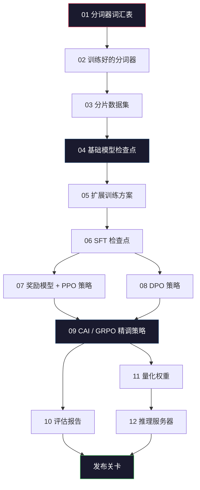
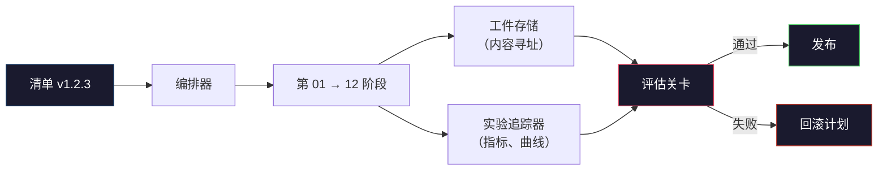

# 构建完整的 LLM 流程

> 第 01 到 12 课的所有内容，都是一个流程中的一个阶段。本课是将这些阶段组合成单次端到端运行的脚手架：分词、预训练、扩展、SFT、对齐、评估、量化、服务。你不会在笔记本电脑上训练 70B 的模型。你将产出编排层、清单、评估关卡，以及 2026 年前沿团队用来决定发布内容的回滚计划。这是压轴之作。

**类型：** 构建  
**语言：** Python（标准库）  
**前置条件：** 第十阶段所有第 01-12 课  
**时间：** 约 120 分钟

## 学习目标

- 将前十一课（分词器、数据、预训练、扩展、SFT、RLHF、DPO、CAI、评估、量化、推理）组合成单个可重现的流程规格
- 定义各阶段之间的工件契约：每个阶段消耗什么、产生什么，以及下一阶段如何验证输入
- 构建一个追踪实验、哈希工件，并根据评估阈值控制发布决策的编排器
- 设计回滚计划：哪些工件重新运行成本低，哪些成本高，一个损坏的检查点要付出多大代价

## 问题所在

前面每一课都能独立运行。分词器训练好了。微型 GPT 预训练完了。SFT 数据集组装好了。奖励模型训练完了。DPO 跑完了。评估测量了。量化权重导出了。推理服务器启动了。每一步都是一个 notebook，每一步都有自己的约定、自己的输出路径、自己的随机种子。

前沿训练运行不是一个 notebook。Llama 3 405B 大约花了 3000 万 H100 小时，历时约 54 天。DeepSeek-V3 使用了约 280 万 H800 小时。在此期间，一个损坏的检查点、一次数据污染、一次评估回退都可能让团队损失一周实际时间和一个月的 GPU 预算。团队在这种情况下得以存活的方式是流程纪律：每个阶段有确定性的输入、确定性的输出、清单、哈希和关卡。

这是压轴之作。你不会在笔记本电脑上端到端运行这个流程。你将编写协调各阶段的编排器、描述运行的清单、控制发布决策的验证器，以及让第三方能从单个文件重现你工作的重放计划。代码量不大；纪律性很大。

这个模式从 1 亿参数扩展到 1 万亿参数而不发生变化。同样的四个组件——清单、编排器、评估关卡、工件存储——既运行 Llama 3，也运行你的业余 GPT。区别在于每个阶段配置里的数字大小，而非流程的形状。

## 概念

### 十二个阶段

第十阶段的每一课都是一个阶段。完整的依赖关系图如下。



第 07 和 08 阶段可以并行运行。其余都是硬依赖。第 02 阶段（分词器）的变更会使每个下游工件失效。第 10 阶段（评估）的变更只影响发布决策。

### 清单

清单是一个单独的文件，描述一次运行完整到足以重放。流程产生的任何内容都不应该依赖于清单中未包含的状态。字段内容枯燥但必须具备。

```
pipeline_version: 1.2.3
seed: 42
git_commit: a1b2c3d4
stages:
  01_tokenizer:
    recipe: bpe_32k
    input_hash: sha256:...
    output_hash: sha256:...
    wall_clock_sec: 3600
    cost_usd: 12
```

第 N 阶段的输出哈希就是第 N+1 阶段的输入哈希。任何偏差都会让流程停止。这是你早期发现数据损坏的方式，也是不同地方的队友验证他们的重放产生了与你相同工件的方式。

在实践中，团队使用小型 YAML 模式加上清单检查器，将其与上一次成功运行进行差异对比。任何在预期字段（成本、实际时间）之外的差异都是红色警报。

### 工件类型

每个阶段的输出是一个有类型的工件。不是目录 blob，不是 pickle 文件，而是具有已知模式的命名类型。

| 阶段 | 工件类型 | 关键字段 |
|------|---------|---------|
| 01-02 | 分词器 | vocab.json、merges.txt、config.json、哈希 |
| 03 | 数据集 | 分片[]、行数、词元数、去重统计 |
| 04-05 | 检查点 | weights.safetensors、config.json、优化器状态、步数 |
| 06 | SFT 模型 | 检查点 + SFT 方案 + 数据混合 |
| 07 | 奖励模型 | RM 检查点 + 偏好数据哈希 |
| 08-09 | 策略 | 检查点 + 参考哈希 + beta + 已消耗 KL 预算 |
| 10 | 评估报告 | 基准分数 + 回退差异 + 评估数据哈希 |
| 11 | 量化模型 | 量化权重 + 校准数据 + 相对 FP16 的精度差 |
| 12 | 服务器规格 | 端点 + 模型哈希 + 配置 + 可观测性钩子 |

类型化防止了最常见的失败模式：将第 08 阶段的输出用作第 06 阶段的输入，通过 SFT 路径发布经过 DPO 训练的模型。类型化工件和类型化阶段签名使这些错误在"编译时"就失败，而不是在第五天才失败。

### 评估关卡

发布不是"训练完成了"。发布是"训练完成了，且评估关卡通过了"。关卡在运行开始之前就已定义。

```
gates:
  mmlu:      >= baseline + 0.5   # 不能回退
  humaneval: >= baseline + 1.0
  truthfulqa: >= baseline         # 不能下降
  safety_refusal_rate: <= 0.05
  kl_from_reference: <= 25.0
  cost_total_usd: <= 50000
```

每个关卡都是数字阈值。没有"看起来不错"的关卡，没有主观审批。如果每个关卡都通过，工件被标记为可发布。如果任何关卡失败，运行被搁置，等待指定审查者的明确覆盖，覆盖本身也被记录在清单中。

两个关卡能发现大多数灾难。*回退关卡*（新模型在核心基准上至少与之前一样好）捕获训练错误。*KL 预算关卡*（对齐后的策略不能偏离其参考超过 X）捕获对齐过度。每个生产流程都有这两个。

### 编排器

一小段代码，读取清单，分发阶段，追踪工件，在任何契约违反时停止。这不是 Airflow，不是 Kubeflow。为了流程纪律，你需要自己写的简单东西。

编排器的工作很窄：

1. 从清单解析 DAG
2. 对每个阶段，检查预期输出是否已以正确哈希存在（如果是则跳过）
3. 运行阶段，捕获 stdout/stderr，测量实际时间和成本
4. 验证输出哈希是否与下游阶段预期的输入哈希匹配
5. 失败时，写入带有确切失败阶段的部分清单并退出非零

这是 200 行 Python。它会看起来像本课的 `code/main.py` 文件。实际生产中，真实流程使用 `torchrun` 或 `ray` 在集群上执行各阶段，但编排器本身在单台机器上运行。

### 实验追踪和工件存储

两个外部系统是流程的锚点。

**实验追踪器（wandb、neptune、mlflow）。** 记录每个阶段的损失曲线、评估指标、系统遥测数据。追踪器是你三周后需要比较运行 A 和运行 B 时去的地方。团队几乎总是为此使用托管追踪器——自己写会浪费本应用于训练的时间。

**工件存储（S3、R2、GCS）。** 用于检查点、数据集、分词器、评估报告的不可变对象存储。工件按哈希寻址，而非按文件名。`latest.pt` 这样的文件名是一颗地雷；`ckpt-7b-step-20000-sha256:abc123.safetensors` 是一份契约。

编排器同时写入两者。追踪器供人类查看图表，工件存储供下一阶段查找输入。

### 成本核算

前沿训练运行有一个金额。预算纪律在两个地方落实。

**运行前估算。** 从清单计算预期的 FLOP（预训练：6 × 参数量 × 词元数），预期的 GPU 时（FLOP / 峰值吞吐量 / 利用率），以及按当前租用价格计算的美元成本。如果估算超过预算关卡，流程拒绝启动。

**运行中追踪。** 逐阶段的实际时间和成本记录到清单中。每个阶段后检查剩余预算。如果某阶段超支，下一阶段的关卡用新的剩余预算评估。你不会在 VC 打电话时才发现资金耗尽。

Llama 3 报告成本为 6100 万美元。DeepSeek-V3 主预训练运行报告 560 万美元。这个比例主要来自硬件效率加上混合专家——但具体成本是可见的，因为两个团队都按阶段追踪，而非按整次运行。

### 可重现性 vs 确定性

这两个概念不同。*可重现*意味着相同的清单加上相同的代码加上相同的基础设施产生一个下游指标等效的检查点。*确定性*意味着逐位相同的输出。

现代 LLM 训练是可重现的，但不是确定性的。分布式训练的归约顺序、GPU 核的非确定性（cuBLAS、flash-attn）和混合精度舍入结合起来，在不同运行之间产生 1e-5 级别不同的浮点数。这对最终指标来说没问题，指标不会移动。如果你试图用位级差异调试，就会是致命的。解决方法是记录每个阶段的输入哈希、输出哈希和标题指标——如果这些匹配，即使权重不是逐位相同，运行也算"已重现"。



### 回滚计划

在运行开始前，写下每个阶段失败时的处理方法。三个类别：

- **重新运行成本低**（小时级）：分词器、评估、量化、推理服务器。直接重新运行。
- **中等成本**（天级）：SFT、DPO、CAI。保留基础模型；只重新运行对齐阶段。
- **昂贵**（周级和数百万美元）：预训练。这里的回滚计划不是"重新运行"，而是"使用最后一个好的检查点，用修订后的数据重新运行成本更低的下游阶段"。

因为阶段依赖关系是类型化且哈希化的，编排器可以自动计算回滚集：使失败的阶段加上每个后代阶段失效。第 06 阶段（SFT）失败会使 06、07、08、09、10、11、12 失效。第 11 阶段（量化）失败只使 11 和 12 失效。事先命名这些，避免团队在凌晨 4 点精疲力竭时即兴发挥。

### 2026 年观察到的生产方案

大多数前沿团队收敛到了同样的骨架。

- 分词器：128k BPE 带字节回退。在小型、均衡的多语言切片上训练。
- 预训练：10-20T 词元，主要是网页加代码加合成数据。Muon 或 AdamW 优化器。FSDP2 或 DeepSpeed ZeRO-3。梯度检查点。BF16 权重，FP32 主权重。
- SFT：50 万到 200 万指令对，人类和合成混合，严格去重对抗评估集。
- 对齐：DPO 或 CAI + GRPO。只有当偏好信号对 DPO 来说维度太多时才用 RLHF。
- 评估：MMLU-Pro、MATH、HumanEval+、GPQA、SWE-Bench Verified、LiveBench，加上公众永远看不到的私有保留集。
- 量化：服务用 4 位 GPTQ 或 AWQ，安全评估用 8 位（精度差异很重要时）。
- 服务：vLLM、TensorRT-LLM 或内部系统。连续批处理。投机解码。KV 缓存驱逐。

数字每六个月变一次。骨架不变。

## 动手构建

本课的代码是一个编排器和清单检查器，而非十二个训练脚本。每个阶段用一个占位符模拟，产生形状和哈希正确的输出工件。端到端运行编排器，在花费 GPU 资金进行真实阶段之前，证明流程的管道能正常工作。

完整实现见 `code/main.py`。关键部分：

- `Manifest` 数据类：流程版本、种子、git 提交、阶段、关卡
- `Stage` 数据类：名称、类型、输入（哈希）、输出（哈希）、实际时间、成本
- `Orchestrator.run()`：解析 DAG，分发阶段，验证哈希，更新清单
- `EvalGate.check()`：读取阈值，与最新评估报告比较，返回通过/失败
- `ArtifactStore`（内存存根）：按哈希存取，模拟 S3
- `CostTracker`：逐阶段和累计，超出上限时停止

`main.py` 中的流程运行十二个占位符阶段，产生清单，并演示一个失败的评估关卡以展示搁置运行的样子。将每个占位符替换为相应课的真实训练脚本，你就得到了真实前沿流程使用的骨架。

## 使用方式

规范工作流有三个命令：

```
python code/main.py plan    # 验证清单，计算成本估算，打印 DAG
python code/main.py run     # 执行阶段，写入 manifest.out.yaml
python code/main.py gate    # 读取 manifest.out.yaml，应用评估关卡，发布或搁置
```

每次都先运行 `plan`。大多数流程错误在计划阶段就会出现——缺少关卡阈值、过期的哈希、预算超支。运行 `plan` 是免费的。运行 `run` 是昂贵的。通过在成本低的阶段捕获错误来省钱。

`gate` 的输出要么是 `SHIP`，要么是 `HOLD: <原因>`。搁置的运行不是失败，而是一个决策点。指定的审查者要么覆盖（覆盖被记录），要么批准回滚。

## 延伸输出

本课产出 `outputs/skill-llm-pipeline-reviewer.md`。输入一个拟议的流程清单，它检查所有契约：阶段类型、哈希链、关卡、回滚计划、成本估算。它拒绝批准缺少评估关卡、KL 预算无界、或混合评估与训练数据的清单。

## 练习

1. 扩展编排器以支持第 07 和 08 阶段的并行执行。使用标准库的 `concurrent.futures` 模块。确认最终清单记录了两个阶段的输出，并且第 09 阶段的输入哈希是两者的确定性组合。

2. 添加"污染检查"关卡。给定评估数据集哈希和训练数据集分片，计算重叠（精确字符串匹配或 13-gram 匹配）。如果重叠超过 0.1%，关卡失败。输入一个被污染的训练集并确认关卡搁置了运行。

3. 从第一原理实现成本估算器。对于第 04 阶段（预训练），按 6 × 参数量 × 词元数估算 FLOP，假设 H100 BF16 下 40% MFU（模型 FLOP 利用率），峰值 989 TFLOP，每 GPU 小时 2.50 美元。报告 7B 模型在 2T 词元上训练的估算值。与已发布的 Llama 2 数据比较。

4. 构建部分回滚。模拟第 09 阶段（CAI）失败，然后在保留第 01-08 阶段缓存的情况下重新运行第 09 到 12 阶段。编排器应该通过哈希检测到缓存的工件并跳过它们。测量相比完整重新运行节省的实际时间。

5. 添加可观测性。为每个阶段发出 OpenTelemetry span，带有参数量、已见词元、损失和成本的属性。将 span 导入本地收集器。重点不是仪表盘，而是每个阶段的健康状态可以从单个追踪 ID 追溯。

## 关键术语

| 术语 | 人们的说法 | 实际含义 |
|------|-----------|---------|
| 清单 (Manifest) | "那个配方文件" | 描述流程版本、种子、每阶段配置和关卡阈值的 YAML 或 JSON——足以重放一次运行 |
| 内容寻址 (Content-addressed) | "按哈希而非名称" | 按内容的 SHA-256 存储工件，这样你永远不会混淆版本 A 和版本 B |
| 评估关卡 (Eval gate) | "发布标准" | 基准指标和安全分数的数字阈值，工件被标记为可发布前必须通过 |
| KL 预算 (KL budget) | "对齐偏移了多远" | 对齐阶段累积 KL（策略 ‖ 参考）的上限，作为关卡执行 |
| MFU | "GPU 利用了多少" | 模型 FLOP 利用率——实际 FLOP 除以理论峰值。70B 规模典型为 40%，7B 规模为 55% |
| 回滚计划 (Rollback plan) | "出问题时怎么办" | 每个阶段失败时的预写动作集：重新运行、回退、用修订输入重新训练 |
| 编排器 (Orchestrator) | "指挥者" | 读取清单、分发阶段、验证哈希、在任何契约违反时停止的进程 |
| 工件存储 (Artifact store) | "权重的版本化 S3" | 不可变的内容寻址对象存储——检查点、数据集、评估报告的唯一真实来源 |
| 可重现 (Reproducible) | "重放时指标相同" | 位级不同的权重，但等效的下游指标——分布式 LLM 训练的现实目标 |
| 成本关卡 (Cost gate) | "不能超过 X" | 运行前成本估算加上运行中追踪器——如果估算超过预算，流程拒绝启动 |

## 延伸阅读

- [Dubey et al., 2024 -- "The Llama 3 Herd of Models"](https://arxiv.org/abs/2407.21783) -- 对前沿流程最详细的公开描述，包括数据、训练、对齐、评估
- [DeepSeek-AI, 2024 -- "DeepSeek-V3 Technical Report"](https://arxiv.org/abs/2412.19437) -- 以约十分之一的 Llama 3 级训练成本实现的效率优先流程
- [Kaplan et al., 2020 -- "Scaling Laws for Neural Language Models"](https://arxiv.org/abs/2001.08361) -- 原始的计算-数据-参数扩展关系
- [Hoffmann et al., 2022 -- "Training Compute-Optimal Large Language Models (Chinchilla)"](https://arxiv.org/abs/2203.15556) -- 对 Kaplan 的修正，重新校准了现代数据预算
- [PyTorch FSDP2 文档](https://pytorch.org/docs/stable/fsdp.html) -- PyTorch 2.4+ 中替换 FSDP1 的分布式训练原语
- [Weights & Biases LLM Reports](https://wandb.ai/site/llms) -- 开源 LLM 运行的真实清单和实验追踪器输出，可作为参考模板
