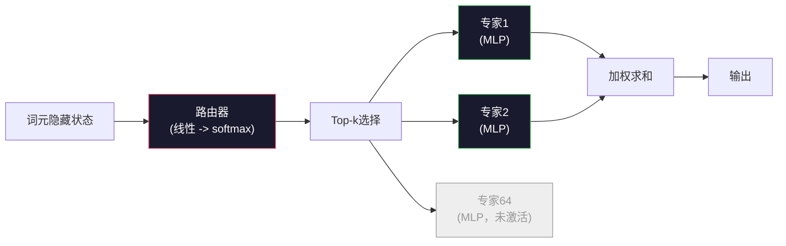

# 开源模型：架构逐一解析

> 你在第04课从零构建了一个GPT-2 Small。2026年的前沿开源模型和它是同一个家族，只是做了五六处具体的改动。RMSNorm代替了LayerNorm。SwiGLU代替了GELU。RoPE代替了学习式位置编码。GQA或MLA代替了完整的多头注意力。再加上规模化的混合专家机制。你已经掌握的数学知识覆盖了95%的内容。本课并排阅读Llama 3、DeepSeek-V3、Mixtral、Qwen和Gemma，精确指出每个架构在哪一行代码上走了不同的路。

**类型：** 学习  
**语言：** Python（标准库）  
**前置知识：** Phase 10，第04、05、12课（预训练、扩展规律、推理）  
**用时：** 约45分钟

## 学习目标

- 阅读Llama 3、Mistral、Mixtral、Gemma 2、Qwen 2.5和DeepSeek-V3的config.json，能解释每一个字段
- 说出每个模型相对于GPT-2 Small做了哪些具体的架构改动，并从第一性原理说明原因
- 仅凭config就能计算任意开源模型的参数量、KV缓存大小和激活内存
- 根据延迟、内存和能力约束，为给定的部署目标选择合适的开源模型

## 问题所在

第04课你写了350行numpy，得到一个GPT-2形状的模型。Llama 3 405B有一份200页的技术报告。你的直觉是这两者是完全不同的东西。其实不是。那200页描述的是同一个对象，只不过有五六处经过充分论证的改动，再加上一千个关于规模化的实现细节。骨架——嵌入层、Transformer块、注意力、MLP、归一化、头部——一点没变。

本课是一个diff。对于每个主要的开源模型家族，我们列出它相对于GPT-2改了什么、为什么改、代价是什么。学完之后，你拿到一张新的模型卡就能在脑子里把它映射回GPT-2的基线。

实际的收益是：当Meta发布Llama 5或DeepSeek发布V4时，你不需要建立新的心智模型。你看看config，看看哪些已知的旋钮动了，就知道下游影响是什么。2026年的架构是一个有限的工具箱。每个新模型只是从中选了不同的子集。

## 核心概念

### 不变的内核

所有自回归开源模型共享：

- 词元嵌入矩阵（vocab_size × hidden_dim）
- N个解码器块的堆叠：归一化、自注意力、残差、归一化、MLP、残差
- 最终的归一化层和线性头部，投影到vocab_size（通常与嵌入权重共享）
- 因果掩码，下一词元交叉熵损失

这就是形状。其余的都是旋钮。

### 真正会动的六个旋钮

纵观2024至2026年所有前沿开源模型，同样的六个设计选择被反复使用：

1. **归一化。** LayerNorm → RMSNorm
2. **位置编码。** 学习式绝对位置 → RoPE（及变体：YaRN、NTK）
3. **激活函数。** GELU → SwiGLU（或GeGLU）
4. **注意力头共享。** MHA → GQA → MQA → MLA
5. **密集vs稀疏MLP。** 全连接 → 混合专家（MoE）
6. **Pre-norm位置。** Pre-norm保留，Post-norm消失

其他一切（学习率调度、数据配比、批大小、上下文长度）都在训练配置里，不在架构里。六个旋钮。

### 旋钮一：RMSNorm

LayerNorm会减去均值、除以标准差、缩放、再偏移。RMSNorm只保留缩放：

```
RMSNorm(x) = x / sqrt(mean(x^2) + eps) * gamma
```

不减均值，没有偏置，每个词元少一次矩阵乘法。Zhang和Sennrich（2019年）论证了它在机器翻译上与LayerNorm持平，同时快了10%。所有现代开源模型都在用它。

代价：无。收益：小幅吞吐量提升，代码更简洁。

### 旋钮二：RoPE

GPT-2的学习式位置嵌入是一张1024槽的查找表。位置1025超出了表的范围，模型无法外推到训练长度之外。

旋转位置编码（RoPE，Su等人2021年）通过在注意力点积之前将每个Q和K向量成对旋转来注入位置信息。旋转角度是位置的确定性函数，没有任何需要学习的参数，也不会耗尽。配合缩放技巧（NTK感知插值、YaRN），一个在8k上下文上训练的模型在推理时可以延伸到128k，精度损失有限。

```
q_rotated = rotate(q, angle(pos))
k_rotated = rotate(k, angle(pos))
score = q_rotated . k_rotated
```

所有Llama、Mistral、Qwen、DeepSeek和Gemma都用RoPE。Gemma 2采用了混合方案（大多数层用RoPE，其他层用局部滑动窗口注意力）。

### 旋钮三：SwiGLU

GPT-2的MLP是`x -> gelu(xW1 + b1) -> (...)W2 + b2`。SwiGLU（Shazeer 2020年）用门控乘积替换了激活函数：

```
SwiGLU(x) = (xW1) * sigmoid(xW1) * xV
```

并行的两个投影，由Swish激活函数门控。在每参数困惑度上实测效果更好。Llama 2采用了它，随后所有模型跟进。MLP的隐藏层大小通常设定为与原始密集MLP的总参数量相当：如果GPT-2用`ff_dim = 4 * hidden`，SwiGLU就用`ff_dim = (2/3) * 4 * hidden = 8/3 * hidden`。

### 旋钮四：注意力头共享

GPT-2用的是**多头注意力（MHA）**：每个头都有自己的Q、K、V投影。

**多查询注意力（MQA，Shazeer 2019年）** 在所有头之间共享一个K和一个V。KV缓存缩减了num_heads倍，对典型模型来说是12倍到32倍的缩减。在难度较高的基准测试上精度略有下降。

**分组查询注意力（GQA，Ainslie等人2023年）** 是中间方案：G组Q头共享一个K和一个V。Llama 3 8B用GQA，32个Q头和8个KV头（G=8），KV缓存比完整MHA缩小了4倍。

**多头潜在注意力（MLA，DeepSeek 2024年）** 将K和V压缩进一个共享的低秩潜在表示，再按头解压。进一步减少KV缓存，同时保留每头的表达能力。DeepSeek-V2和V3靠它实现长上下文性能。

| 方案 | KV头数 | KV缓存 | 精度 |
|------|--------|--------|------|
| MHA  | num_heads | 完整 | 最优 |
| GQA  | num_groups（G < num_heads） | 缩减num_heads/G倍 | 接近MHA |
| MQA  | 1 | 缩减num_heads倍 | 小幅损失 |
| MLA  | 潜在表示，按头解压 | 小于MQA | 接近MHA |

对于参数量超过约13B的模型，GQA或MLA实际上是必须的。大规模下的完整MHA会导致KV缓存灾难。

### 旋钮五：混合专家

密集MLP对每个词元激活它所有的参数。MoE MLP每个块有K个专家，路由器每个词元选top-k个专家（通常是top-2）。只有那些被选中的专家权重才会参与该词元的前向传播。

```
router_logits = xW_r
indices, weights = top_k(router_logits, k=2)
output = sum_i weights[i] * expert[indices[i]](x)
```

吸引力在于：你可以有64个各7B大小的专家（总参数量巨大），但每个词元只运行其中2个（所以每词元的计算量与7B密集模型相当）。Mixtral 8x7B总参数量47B，但每个词元只激活13B。DeepSeek-V3总参数量671B，但每个词元只激活37B。



优点：相同计算量，更多参数，更强容量。缺点：专家的内存仍然要存放在某处（所以服务所需的VRAM比同等密集模型多），路由器的负载均衡很难处理，对齐阶段微调路由器本身就是一个研究领域。

### 旋钮六：Pre-norm保留

原始Transformer在每个子层之后应用层归一化。GPT-2之后的所有开源模型都把它放在每个子层*之前*。Pre-norm在深度训练时严格更稳定。没什么可争论的。

### 逐模型差异对比

下面这张表让上述内容具体起来。

| 模型 | 年份 | 总参数量 | 激活参数量 | 归一化 | 激活函数 | 位置编码 | 注意力 | MoE | 上下文 |
|------|------|---------|-----------|--------|---------|---------|--------|-----|--------|
| GPT-2 Small | 2019 | 124M | 124M | LayerNorm | GELU | 学习式 | MHA (12头) | 否 | 1k |
| Llama 3 8B | 2024 | 8B | 8B | RMSNorm | SwiGLU | RoPE | GQA (32/8) | 否 | 128k |
| Llama 3 70B | 2024 | 70B | 70B | RMSNorm | SwiGLU | RoPE | GQA (64/8) | 否 | 128k |
| Llama 3 405B | 2024 | 405B | 405B | RMSNorm | SwiGLU | RoPE | GQA (128/16) | 否 | 128k |
| Mistral 7B | 2023 | 7.2B | 7.2B | RMSNorm | SwiGLU | RoPE | GQA | 否 | 32k |
| Mixtral 8x7B | 2023 | 47B | 13B | RMSNorm | SwiGLU | RoPE | GQA | 是（8专家，top-2） | 32k |
| Gemma 2 9B | 2024 | 9B | 9B | RMSNorm（前+后） | GeGLU | RoPE+滑动窗口 | GQA | 否 | 8k |
| Qwen 2.5 72B | 2024 | 72B | 72B | RMSNorm | SwiGLU | RoPE (YaRN) | GQA (64/8) | 否 | 128k |
| DeepSeek V2 236B | 2024 | 236B | 21B | RMSNorm | SwiGLU | RoPE | MLA | 是（160专家，top-6） | 128k |
| DeepSeek V3 | 2024 | 671B | 37B | RMSNorm | SwiGLU | RoPE | MLA | 是（256专家，top-8） | 128k |

扫一眼各列。RMSNorm是通用的。SwiGLU或其GeGLU变体是通用的。RoPE是通用的。7B以上除被MLA取代的情况外，GQA是通用的。MoE是顶端模型的差异化因素。

### 读懂config.json

Llama 3 8B的配置：

```
{
  "hidden_size": 4096,
  "intermediate_size": 14336,
  "num_hidden_layers": 32,
  "num_attention_heads": 32,
  "num_key_value_heads": 8,
  "max_position_embeddings": 131072,
  "rope_theta": 500000.0,
  "rms_norm_eps": 1e-5,
  "vocab_size": 128256
}
```

每个字段都对应你已经实现过的东西。

- `hidden_size`：嵌入维度
- `intermediate_size`：MLP隐藏层大小（是hidden的3.5倍——SwiGLU的数学决定的）
- `num_hidden_layers`：堆叠深度
- `num_attention_heads`：Q头数量
- `num_key_value_heads`：KV头数量（GQA）
- `max_position_embeddings`：训练上下文长度
- `rope_theta`：RoPE基础频率。Meta将默认的10k调到了500k，以支持长上下文外推
- `rms_norm_eps`：数值稳定性
- `vocab_size`：词元数

仅凭这些就能计算总参数量、KV缓存和峰值激活内存。具体公式见`code/main.py`。

### 激活内存预算

在超过几十亿参数的规模下，激活内存在训练内存中占主导地位。预训练（使用梯度检查点）的经验公式：

```
activation_mem ~ batch_size * seq_len * hidden_size * num_layers * bytes_per_element
```

对于Llama 3 8B，批大小1、序列长度8192、BF16、32层、隐藏维度4096：使用检查点时激活内存约8 GB，不使用时约40 GB。这就是为什么Flash Attention和Ring Attention很重要——它们重写了注意力计算，使激活内存得以装下。

### KV缓存预算

最大上下文下的推理：

```
kv_cache = 2 * num_layers * num_kv_heads * head_dim * max_seq_len * bytes_per_element
```

Llama 3 8B在128k上下文下，BF16，head_dim = hidden / num_heads = 128：
`2 * 32 * 8 * 128 * 131072 * 2 = 17.2 GB`，每个序列。

8B的权重在BF16下是16 GB。单个128k序列的KV缓存比权重还大。这就是推动GQA、MLA和KV缓存量化研究的内存压力。

### 什么情况下各模型占优

- **单张80GB GPU，不用MoE**：Llama 3 8B、Mistral 7B、Gemma 2 9B。易于部署，工具链成熟
- **单节点（8×80GB），大容量**：Llama 3 70B、Qwen 2.5 72B。最强的密集开源能力
- **追求最大开源能力，接受MoE复杂度**：DeepSeek V3、Mixtral 8x22B。每激活FLOP的能力最强
- **长上下文需求**：Llama 3（RoPE缩放，128k）、DeepSeek（MLA优势）
- **低延迟服务**：Gemma 2 9B（滑动窗口降低长上下文计算量）

## 动手构建

本课的代码是一个计算器。给定任意config.json，它会打印各组件的参数量、最大上下文下的KV缓存、SwiGLU MLP比例，以及对架构的简短描述（密集 / GQA / MLA / MoE）。

```python
config = {
    "hidden_size": 4096, "intermediate_size": 14336,
    "num_hidden_layers": 32, "num_attention_heads": 32,
    "num_key_value_heads": 8, "vocab_size": 128256,
    "max_position_embeddings": 131072,
}
```

脚本逐字段遍历架构，计算嵌入层、注意力（含GQA缩减）、MLP（含SwiGLU扩展）、层归一化和头部的参数量，然后计算指定上下文长度下的KV缓存并打印摘要。

具体实现见`code/main.py`。

## 实际使用

对脚本内置的Llama 3 8B、Mistral 7B、Mixtral 8x7B和DeepSeek V3配置运行计算器，比较参数分解结果。注意MoE模型的总参数量远超密集模型，但激活参数量往往更小。注意DeepSeek V3的KV缓存比Llama 3 405B更小，尽管总参数量更多——这就是MLA的效果。

然后把你本地有的任意模型的config插进去，读一下摘要，判断它是否适合你的GPU。

## 交付成果

本课产出`outputs/skill-open-model-picker.md`。给定一个部署目标（GPU类型、VRAM、上下文长度、延迟预算）和任务描述（对话、代码、推理、长上下文），它会推荐一个开源模型、第11课中的量化方案和第12课中的推理栈，并附上关于六个架构旋钮的明确推理过程。

## 练习

1. 从HuggingFace读取Qwen 2.5 72B的config。从头计算总参数量。与HF报告的值对比，找出差异来源（头维度舍入、KV共享系数等）。

2. DeepSeek V3使用256个专家，top-8路由。计算激活专家与总专家的比例，与Mixtral 8x7B的8选2对比。从稀疏（25%）到更密稀疏（3%）的转变，意味着每FLOP容量发生了什么变化？

3. 计算Llama 3 405B在128k上下文下FP8和BF16格式的KV缓存。FP8是BF16数值的一半。在单个8×H100节点（每张80GB，共640GB，减去权重内存）上，你能并行服务多少个序列？

4. Gemma 2交替使用全注意力层和滑动窗口注意力层。写出当一半层使用4096词元滑动窗口而非完整上下文时KV缓存的数学公式。在8k总上下文下能节省多少内存？

5. 找一个在本课编写后发布的近期前沿开源模型，识别它选了哪六个旋钮，以及它是否引入了第七个旋钮。课程内容会在新架构发布的瞬间显得过时——目标是不重建心智模型的情况下更新你的对比表。

## 关键术语

| 术语（英文） | 人们怎么说 | 实际含义 |
|-------------|-----------|---------|
| RMSNorm | "没有均值的LayerNorm" | 仅用均方根归一化，加上一个学习式缩放——比LayerNorm更快，效果相当 |
| RoPE（旋转位置编码） | "旋转位置" | 在注意力前将每个Q和K向量按位置决定的角度成对旋转——通过缩放技巧可外推到训练长度之外 |
| SwiGLU | "新的MLP激活函数" | 带Swish的门控线性单元：`(xW1) * sigmoid(xW1) * xV`——2024年后所有开源模型的标配 |
| GQA（分组查询注意力） | "中间方案注意力" | G组Q头共享一个K和V头——缩减KV缓存，不像MQA那样损失精度 |
| MLA（多头潜在注意力） | "DeepSeek的注意力" | 将K/V压缩进共享低秩潜在表示，按头解压——大模型中KV缓存最小 |
| MoE（混合专家） | "稀疏专家" | 每块N个MLP，路由器每词元选top-k——总参数巨大，激活参数很小 |
| Top-k路由 | "每词元选k个专家" | 路由器为每个专家计算得分，激活最高的k个——典型k从2（Mixtral）到8（DeepSeek） |
| YaRN | "拉伸RoPE" | Yet Another RoPE eNhancement的缩写——插值旋转角度，在推理时将上下文从8k扩展到128k及以上 |
| 滑动窗口注意力 | "不看所有内容" | 每个词元只关注最近W个词元——将注意力代价上限固定在每词元O(W)，Gemma 2和早期Mistral有用 |
| 激活参数量 | "每词元实际运行的参数量" | MoE模型中每词元参与前向传播的参数量（远小于总参数量）——决定每词元的FLOP数 |

## 延伸阅读

- [Dubey等，2024——《The Llama 3 Herd of Models》](https://arxiv.org/abs/2407.21783)——密集Llama 3家族的架构和训练参考
- [DeepSeek-AI，2024——《DeepSeek-V3 Technical Report》](https://arxiv.org/abs/2412.19437)——MLA加无辅助损失负载均衡加671B MoE
- [Jiang等，2024——《Mixtral of Experts》](https://arxiv.org/abs/2401.04088)——标准MoE开源模型论文
- [Su等，2021——《RoFormer: Enhanced Transformer with Rotary Position Embedding》](https://arxiv.org/abs/2104.09864)——RoPE论文
- [Shazeer，2020——《GLU Variants Improve Transformer》](https://arxiv.org/abs/2002.05202)——SwiGLU、GeGLU及其变体
- [Ainslie等，2023——《GQA: Training Generalized Multi-Query Transformer Models》](https://arxiv.org/abs/2305.13245)——GQA论文
- [Gemma 2团队，2024——《Gemma 2: Improving Open Language Models at a Practical Size》](https://arxiv.org/abs/2408.00118)——混合全+滑动窗口注意力，前+后归一化
- [Qwen团队，2024——《Qwen 2.5 Technical Report》](https://arxiv.org/abs/2412.15115)——YaRN上下文扩展和长上下文训练方案
