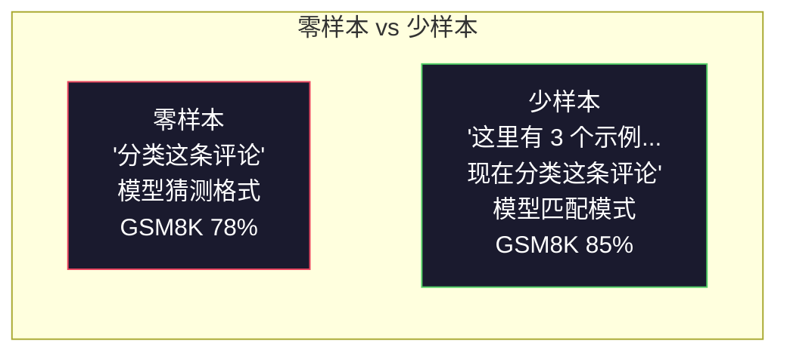
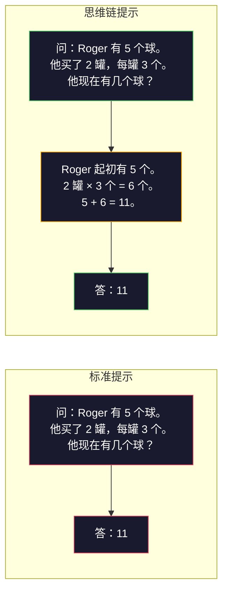
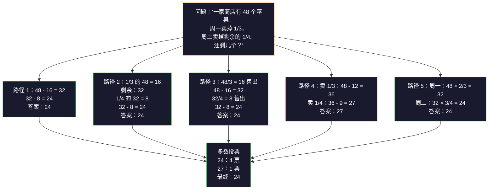
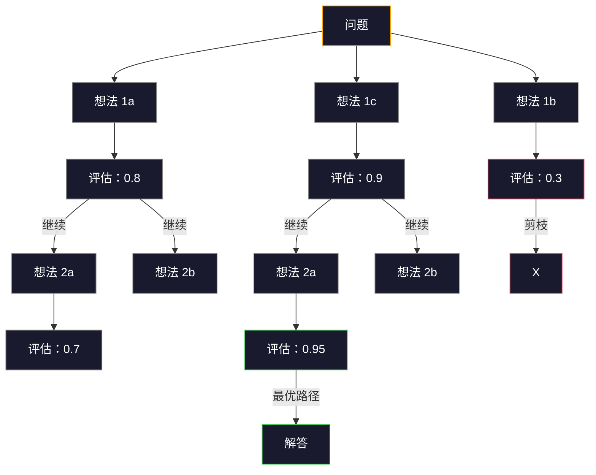
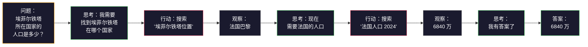

# 少样本提示、思维链、思维树

> 告诉模型做什么，是提示。教会模型如何思考，才是工程。同一个模型、同一个任务、同一份数据——78% 和 91% 准确率之间的差距，不是更好的模型，而是更好的推理策略。

**类型：** 构建
**语言：** Python
**前置课程：** 第 11.01 课（提示工程）
**时长：** ~45 分钟

## 学习目标

- 通过选择和格式化示例演示来实现少样本提示（few-shot prompting），最大化任务准确率
- 应用思维链（CoT）推理，提升多步骤问题（如数学应用题）的准确性
- 构建思维树（ToT）提示，探索多条推理路径并选出最优解
- 测量零样本、少样本、CoT 在标准基准上的准确率提升幅度

## 问题背景

你在开发一款数学辅导应用。提示词只写了"解这道应用题"。GPT-5 在 GSM8K（标准小学数学基准，含 8500 道题）上能达到 94% 的准确率。你以为已经到头了——但没有，思维链还能再涨 3-4 个百分点。

加上五个字——"让我们一步一步地思考"——准确率跳到 91%。再加几个解题示例，达到 95%。同一个模型，同样的温度，同样的 API 成本。唯一的区别是：你给了模型一张草稿纸。

这不是技巧，这就是推理的本质。人类解多步骤问题不会一步跳到答案，Transformer 也一样。当你让模型生成中间推理 token 时，这些 token 就成了下一个 token 的上下文。每一步推理都在为下一步铺路。模型是真的在一步步"算"出答案的。

但"一步一步地思考"只是起点，不是终点。如果采样五条推理路径再投票呢？如果让模型探索一棵可能性的树，评估并剪枝呢？如果把推理和工具调用交织在一起呢？这些不是假设，都是有实测改进的已发表技术，本课将全部实现。

## 概念讲解

### 零样本 vs 少样本：什么时候示例比指令更有效？

零样本提示（zero-shot prompting）只给模型任务，别的什么都不给。少样本提示（few-shot prompting）先给示例，再提问。

Wei 等人（2022）在 8 个基准上进行了测量。对于简单任务（如情感分类），零样本和少样本相差不超过 2%。对于复杂任务（如多步算术和符号推理），少样本的准确率提升了 10-25%。

直觉上：示例是压缩版的指令。与其描述输出格式，不如直接展示。与其解释推理过程，不如直接演示。模型对示例的模式匹配，比解读抽象指令更可靠。



**少样本占优的场景：** 格式敏感任务、分类、结构化抽取、领域专业术语、任何需要匹配特定模式的任务。

**零样本占优的场景：** 简单事实问题、创意任务（示例会限制创意空间）、找好示例比写好指令更难的任务。

### 示例选择：相似的比随机的更好

示例之间存在质量差异。选择与目标输入语义相似的示例，在分类任务上比随机选择高出 5-15%（Liu 等人，2022）。三条原则：

1. **语义相似性**：选择在嵌入空间中与输入最近的示例
2. **标签多样性**：示例要覆盖所有输出类别
3. **难度匹配**：示例复杂度与目标问题保持一致

大多数任务的最优示例数量是 3-5 个。少于 3 个，模型信号不足以提取规律；超过 5 个，边际收益递减，白白消耗上下文窗口。对于多标签分类，每个标签配一个示例即可。

### 思维链：给模型一张草稿纸

思维链（Chain-of-Thought，CoT）提示由 Google Brain 的 Wei 等人（2022）提出。核心思路很简单：不只要求模型给出答案，而是让它先展示推理步骤。



这在机制上为什么有效？Transformer 生成的每个 token 都会成为下一个 token 的上下文。没有 CoT，模型必须在单次前向传播的隐状态中压缩全部推理。有了 CoT，模型将中间计算外化为 token，每个推理 token 都延伸了有效的计算深度。

**GSM8K 基准（小学数学，8500 道题）：**

| 模型 | 零样本 | 零样本 CoT | 少样本 CoT |
|-------|-----------|---------------|--------------|
| GPT-4o | 78% | 91% | 95% |
| GPT-5 | 94% | 97% | 98% |
| o4-mini（推理模型） | 97% | — | — |
| Claude Opus 4.7 | 93% | 97% | 98% |
| Gemini 3 Pro | 92% | 96% | 98% |
| Llama 4 70B | 80% | 89% | 94% |
| DeepSeek-V3.1 | 89% | 94% | 96% |

**关于推理模型的说明。** o 系列（o3、o4-mini）和 DeepSeek-R1 等推理模型在输出答案前会在内部运行思维链。对这类模型添加"让我们一步一步地思考"是多余的，有时甚至适得其反——它们已经在做了。

CoT 有两种形式：

**零样本 CoT**：在提示末尾加上"让我们一步一步地思考"，无需示例。Kojima 等人（2022）证明，这一句话能在算术、常识和符号推理任务上全面提升准确率。

**少样本 CoT**：提供包含推理步骤的示例。比零样本 CoT 更有效，因为模型能看到你期望的确切推理格式。

**CoT 适得其反的情形**：简单事实问答（"法国的首都是哪里？"）、单步分类、速度优先于准确率的任务。CoT 每次查询会额外产生 50-200 个推理 token。对于高吞吐量、低复杂度的任务，这是浪费。

### 自洽性：多次采样，一次投票

Wang 等人（2023）提出了自洽性（self-consistency）。核心洞察：单条 CoT 路径可能包含推理错误，但如果用高温度采样 N 条独立推理路径，再对最终答案进行多数投票，错误就会相互抵消。



在原始 PaLM 540B 实验中，N=40 时自洽性将 GSM8K 准确率从 56.5%（单次 CoT）提升到 74.4%。在 GPT-5 上提升很小（97% 到 98%），因为基础准确率已接近饱和。该技术在单次 CoT 准确率为 60-85% 的模型上效果最好——这是错误频繁但非系统性的甜蜜区间。对于推理模型（o 系列、R1），自洽性被内置的内部采样所取代。

代价：N 次采样意味着 N 倍的 API 成本和延迟。实践中，N=5 已能获得大部分收益；N=3 是有意义投票的最低门槛；N>10 对大多数任务边际收益递减。

### 思维树：分支探索

Yao 等人（2023）提出了思维树（Tree-of-Thought，ToT）。CoT 沿一条线性推理路径前进，ToT 则探索多个分支，先评估哪个方向最有潜力，再决定是否继续深入。



ToT 包含三个组件：

1. **想法生成（Thought generation）**：生成多个候选下一步
2. **状态评估（State evaluation）**：为每个候选打分（可以用 LLM 自身作为评估者）
3. **搜索算法（Search algorithm）**：通过 BFS 或 DFS 遍历树结构，剪去低分分支

在 24 点游戏任务（用四个数字通过四则运算得到 24）上，GPT-4 标准提示只能解决 7.3% 的问题；CoT 反而降到 4.0%（因为搜索空间太宽，线性推理在这里帮了倒忙）；ToT 达到 74%。

ToT 代价高昂。树上每个节点都需要一次 LLM 调用。分支因子 3、深度 3 的树最多需要 39 次调用。仅在搜索空间大且可评估的问题上使用——规划、谜题求解、有约束的创意问题。

### ReAct：思考 + 行动

Yao 等人（2022）将推理轨迹与行动结合在一起。模型在思考（生成推理）和行动（调用工具、搜索、计算）之间交替进行。



ReAct 在知识密集型任务上优于纯 CoT，因为它能将推理锚定在真实数据上。在 HotpotQA（多跳问答）上，ReAct 配合 GPT-4 的精确匹配率为 35.1%，纯 CoT 只有 29.4%。真正的价值在于：推理错误可被观察结果纠正——模型可以在执行中途更新计划。

ReAct 是现代 AI 智能体的基础。所有智能体框架（LangChain、CrewAI、AutoGen）都实现了某种变体的"思考-行动-观察"循环。第 14 阶段会构建完整的智能体，本课专注于提示模式本身。

### 结构化提示：XML 标签、分隔符、标题

当提示变得复杂，结构可以防止模型混淆各个部分。三种方法：

**XML 标签**（在 Claude 中效果最佳，其他模型也适用）：
```
<context>
You are reviewing a pull request.
The codebase uses TypeScript and React.
</context>

<task>
Review the following diff for bugs, security issues, and style violations.
</task>

<diff>
{diff_content}
</diff>

<output_format>
List each issue with: file, line, severity (critical/warning/info), description.
</output_format>
```

**Markdown 标题**（通用）：
```
## Role
Senior security engineer at a fintech company.

## Task
Analyze this API endpoint for vulnerabilities.

## Input
{api_code}

## Rules
- Focus on OWASP Top 10
- Rate each finding: critical, high, medium, low
- Include remediation steps
```

**分隔符**（简洁但有效）：
```
---INPUT---
{user_text}
---END INPUT---

---INSTRUCTIONS---
Summarize the above in 3 bullet points.
---END INSTRUCTIONS---
```

### 提示链：顺序分解

有些任务对单一提示来说太复杂。提示链（prompt chaining）将任务拆分为多步，上一步的输出成为下一步的输入。


提示链优于单提示有三个原因：

1. **每一步更简单**：模型只处理一个专注任务，而非同时兼顾一切
2. **中间输出可检查**：可以在步骤之间验证并修正
3. **不同步骤可用不同模型**：提取用廉价模型，推理用昂贵模型

### 性能对比

| 技术 | 最适合 | GSM8K 准确率（GPT-5） | API 调用次数 | Token 开销 | 复杂度 |
|-----------|----------|------------------------|-----------|----------------|------------|
| 零样本 | 简单任务 | 94% | 1 | 无 | 极低 |
| 少样本 | 格式匹配 | 96% | 1 | 200-500 token | 低 |
| 零样本 CoT | 快速推理提升 | 97% | 1 | 50-200 token | 极低 |
| 少样本 CoT | 单次调用最高准确率 | 98% | 1 | 300-600 token | 低 |
| 自洽性（N=5） | 高风险推理 | 98.5% | 5 | 5 倍 token 成本 | 中 |
| 推理模型（o4-mini） | CoT 即插即用替代品 | 97% | 1 | 隐藏（内部 2-10 倍） | 极低 |
| 思维树 | 搜索/规划问题 | 不适用（24 点 74%） | 10-40+ | 10-40 倍 token 成本 | 高 |
| ReAct | 知识锚定推理 | 不适用（HotpotQA 35.1%） | 3-10+ | 可变 | 高 |
| 提示链 | 复杂多步任务 | 96%（流水线） | 2-5 | 2-5 倍 token 成本 | 中 |

选择哪种技术取决于三个因素：准确率要求、延迟预算、成本承受能力。对大多数生产系统而言，少样本 CoT 加上 3 次采样的自洽性兜底，能覆盖 90% 的使用场景。

## 构建实现

我们将构建一个数学题求解器，将少样本提示、思维链推理和自洽性投票整合进一条流水线，再为难题加入思维树。

完整实现在 `code/advanced_prompting.py`，以下是关键组件。

### 第一步：少样本示例库

第一个组件管理少样本示例，并为给定问题选出最相关的示例。

```python
GSM8K_EXAMPLES = [
    {
        "question": "Janet's ducks lay 16 eggs per day. She eats three for breakfast every morning and bakes muffins for her friends every day with four. She sells every egg at the farmers' market for $2. How much does she make every day at the farmers' market?",
        "reasoning": "Janet's ducks lay 16 eggs per day. She eats 3 and bakes 4, using 3 + 4 = 7 eggs. So she has 16 - 7 = 9 eggs left. She sells each for $2, so she makes 9 * 2 = $18 per day.",
        "answer": "18"
    },
    ...
]
```

每个示例包含三个部分：问题、推理链和最终答案。推理链是将普通少样本示例转变为 CoT 少样本示例的关键。

### 第二步：思维链提示构建器

提示构建器将系统消息、带推理链的少样本示例和目标问题组合成一条完整提示。

```python
def build_cot_prompt(question, examples, num_examples=3):
    system = (
        "You are a math problem solver. "
        "For each problem, show your step-by-step reasoning, "
        "then give the final numerical answer on the last line "
        "in the format: 'The answer is [number]'."
    )

    example_text = ""
    for ex in examples[:num_examples]:
        example_text += f"Q: {ex['question']}\n"
        example_text += f"A: {ex['reasoning']} The answer is {ex['answer']}.\n\n"

    user = f"{example_text}Q: {question}\nA:"
    return system, user
```

格式约束（"The answer is [number]"）至关重要。没有它，自洽性无法从各次采样中提取并比较答案。

### 第三步：自洽性投票

采样 N 条推理路径，取多数答案。

```python
def self_consistency_solve(question, examples, client, model, n_samples=5):
    system, user = build_cot_prompt(question, examples)

    answers = []
    reasonings = []
    for _ in range(n_samples):
        response = client.chat.completions.create(
            model=model,
            messages=[
                {"role": "system", "content": system},
                {"role": "user", "content": user}
            ],
            temperature=0.7
        )
        text = response.choices[0].message.content
        reasonings.append(text)
        answer = extract_answer(text)
        if answer is not None:
            answers.append(answer)

    vote_counts = Counter(answers)
    best_answer = vote_counts.most_common(1)[0][0] if vote_counts else None
    confidence = vote_counts[best_answer] / len(answers) if best_answer else 0

    return best_answer, confidence, reasonings, vote_counts
```

温度 0.7 很关键。温度 0.0 时，N 次采样会完全相同，失去意义。需要足够的随机性来产生多样的推理路径，但又不能多到模型胡言乱语。

### 第四步：思维树求解器

对于线性推理失效的问题，ToT 探索多种解题思路，评估哪个方向最有希望。

```python
def tree_of_thought_solve(question, client, model, breadth=3, depth=3):
    thoughts = generate_initial_thoughts(question, client, model, breadth)
    scored = [(t, evaluate_thought(t, question, client, model)) for t in thoughts]
    scored.sort(key=lambda x: x[1], reverse=True)

    for current_depth in range(1, depth):
        next_thoughts = []
        for thought, score in scored[:2]:
            extensions = extend_thought(thought, question, client, model, breadth)
            for ext in extensions:
                ext_score = evaluate_thought(ext, question, client, model)
                next_thoughts.append((ext, ext_score))
        scored = sorted(next_thoughts, key=lambda x: x[1], reverse=True)

    best_thought = scored[0][0] if scored else ""
    return extract_answer(best_thought), best_thought
```

评估器本身是一次 LLM 调用。你问模型："从 0.0 到 1.0，这条推理路径解题的前景如何？"这是 ToT 的核心洞察——模型在评估自己的部分解答。

### 第五步：完整流水线

流水线将所有技术整合，采用逐级升级策略。

```python
def solve_with_escalation(question, examples, client, model):
    system, user = build_cot_prompt(question, examples)
    single_response = call_llm(client, model, system, user, temperature=0.0)
    single_answer = extract_answer(single_response)

    sc_answer, confidence, _, _ = self_consistency_solve(
        question, examples, client, model, n_samples=5
    )

    if confidence >= 0.8:
        return sc_answer, "self_consistency", confidence

    tot_answer, _ = tree_of_thought_solve(question, client, model)
    return tot_answer, "tree_of_thought", None
```

升级逻辑：先尝试最廉价的方案（单次 CoT）；如果自洽性置信度低于 0.8（5 次采样中有 2 次以上不同意），升级到 ToT。这在成本和准确率之间取得平衡——大多数问题便宜解决，难题获得更多算力。

## 使用方法

### 配合 LangChain

LangChain 内置了提示模板和输出解析支持，简化了少样本和 CoT 模式：

```python
from langchain_core.prompts import FewShotPromptTemplate, PromptTemplate
from langchain_openai import ChatOpenAI

example_prompt = PromptTemplate(
    input_variables=["question", "reasoning", "answer"],
    template="Q: {question}\nA: {reasoning} The answer is {answer}."
)

few_shot_prompt = FewShotPromptTemplate(
    examples=examples,
    example_prompt=example_prompt,
    suffix="Q: {input}\nA: Let's think step by step.",
    input_variables=["input"]
)

llm = ChatOpenAI(model="gpt-4o", temperature=0.7)
chain = few_shot_prompt | llm
result = chain.invoke({"input": "If a train travels 120 km in 2 hours..."})
```

LangChain 还提供了 `ExampleSelector` 类，支持语义相似性选择：

```python
from langchain_core.example_selectors import SemanticSimilarityExampleSelector
from langchain_openai import OpenAIEmbeddings

selector = SemanticSimilarityExampleSelector.from_examples(
    examples,
    OpenAIEmbeddings(),
    k=3
)
```

### 配合 DSPy

DSPy 将提示策略视为可优化的模块。不需要手工制作 CoT 提示，只需定义签名，让 DSPy 自动优化：

```python
import dspy

dspy.configure(lm=dspy.LM("openai/gpt-4o", temperature=0.7))

class MathSolver(dspy.Module):
    def __init__(self):
        self.solve = dspy.ChainOfThought("question -> answer")

    def forward(self, question):
        return self.solve(question=question)

solver = MathSolver()
result = solver(question="Janet's ducks lay 16 eggs per day...")
```

DSPy 的 `ChainOfThought` 自动添加推理轨迹；`dspy.majority` 实现自洽性：

```python
result = dspy.majority(
    [solver(question=q) for _ in range(5)],
    field="answer"
)
```

### 对比：从头构建 vs 框架

| 功能 | 从头构建（本课） | LangChain | DSPy |
|---------|--------------------------|-----------|------|
| 提示格式控制 | 完全可控 | 基于模板 | 自动生成 |
| 自洽性 | 手动投票 | 手动 | 内置（`dspy.majority`） |
| 示例选择 | 自定义逻辑 | `ExampleSelector` | `dspy.BootstrapFewShot` |
| 思维树 | 自定义树搜索 | 社区 chain | 无内置支持 |
| 提示优化 | 手动迭代 | 手动 | 自动编译 |
| 最适合 | 学习、定制流水线 | 标准工作流 | 研究、优化 |

## 交付物

本课产出两个工件。

**1. 推理链提示**（`outputs/prompt-reasoning-chain.md`）：生产可用的少样本 CoT 提示模板（含自洽性），插入你的示例和问题领域即可使用。

**2. CoT 模式选择技能**（`outputs/skill-cot-patterns.md`）：根据任务类型、准确率要求和成本约束，选择合适推理技术的决策框架。

## 练习

1. **测量差距**：取 10 道 GSM8K 题目，分别用零样本、少样本、零样本 CoT 和少样本 CoT 求解，记录每种方法的准确率。哪种技术在你的模型上提升最大？

2. **示例选择实验**：对同样 10 道题，对比随机选择示例与人工挑选相似示例的效果，测量准确率差异。示例质量什么时候比示例数量更重要？

3. **自洽性成本曲线**：在 20 道 GSM8K 题上分别用 N=1、3、5、7、10 运行自洽性，绘制准确率与成本（总 token 数）的关系图。你的模型的"拐点"在哪里？

4. **构建 ReAct 循环**：在流水线中加入计算器工具。当模型生成数学表达式时，用 Python `eval()`（在沙箱中）执行并将结果反馈。测量工具锚定的推理是否优于纯 CoT。

5. **创意任务上的思维树**：将思维树求解器改造用于创意写作任务："写一个既好笑又悲伤的六字故事。"用 LLM 作评估者。分支探索能否比单次生成产出更好的创意输出？

## 关键术语

| 术语 | 人们怎么说 | 实际含义 |
|------|----------------|----------------------|
| 少样本提示（Few-shot prompting） | "给它一些示例" | 在提示中包含输入-输出演示，锚定模型的输出格式和行为 |
| 思维链（Chain-of-Thought） | "让它一步一步思考" | 引导模型生成中间推理 token，在得出最终答案前延伸有效计算深度 |
| 自洽性（Self-Consistency） | "多运行几次" | 用高温度采样 N 条多样化推理路径，以多数投票选出最常见的最终答案 |
| 思维树（Tree-of-Thought） | "让它探索多种选项" | 在推理分支上进行结构化搜索，对每个局部解进行评估，只展开有潜力的路径 |
| ReAct | "思考 + 工具调用" | 在"思考-行动-观察"循环中交替进行推理轨迹和外部行动（搜索、计算、API 调用） |
| 提示链（Prompt chaining） | "把它拆成步骤" | 将复杂任务分解为顺序提示，每步输出作为下一步输入 |
| 零样本 CoT（Zero-shot CoT） | "只加'一步一步想'" | 在提示末尾附加推理触发短语，无需示例，依赖模型潜在的推理能力 |

## 延伸阅读

- [Chain-of-Thought Prompting Elicits Reasoning in Large Language Models](https://arxiv.org/abs/2201.11903) — Wei 等，2022。Google Brain 的原始 CoT 论文，阅读第 2-3 节获取核心结果。
- [Self-Consistency Improves Chain of Thought Reasoning in Language Models](https://arxiv.org/abs/2203.11171) — Wang 等，2023。自洽性论文，表 1 包含所有关键数据。
- [Tree of Thoughts: Deliberate Problem Solving with Large Language Models](https://arxiv.org/abs/2305.10601) — Yao 等，2023。ToT 论文，第 4 节的 24 点游戏结果是亮点。
- [ReAct: Synergizing Reasoning and Acting in Language Models](https://arxiv.org/abs/2210.03629) — Yao 等，2022。现代 AI 智能体的基础，第 3 节解释了"思考-行动-观察"循环。
- [Large Language Models are Zero-Shot Reasoners](https://arxiv.org/abs/2205.11916) — Kojima 等，2022。"让我们一步一步地思考"论文，出奇地简单，效果出奇地好。
- [DSPy: Compiling Declarative Language Model Calls into Self-Improving Pipelines](https://arxiv.org/abs/2310.03714) — Khattab 等，2023。将提示视为编译问题，想超越手工提示工程的必读。
- [OpenAI — Reasoning models guide](https://platform.openai.com/docs/guides/reasoning) — 供应商关于思维链何时变成内部按 token 计费的"推理"模式（而非提示层技巧）的指南。
- [Lightman 等，"Let's Verify Step by Step"（2023）](https://arxiv.org/abs/2305.20050) — 过程奖励模型（PRM），对推理链每一步评分；优于纯结果奖励的推理监督信号。
- [Snell 等，"Scaling LLM Test-Time Compute Optimally"（2024）](https://arxiv.org/abs/2408.03314) — 对 CoT 长度、自洽性采样和 MCTS 的系统研究；当准确率优先于延迟时，"一步一步想"的极限在哪里。
