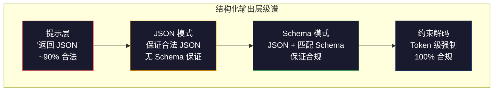
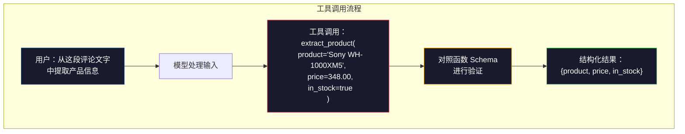

# 结构化输出：JSON、Schema 验证、约束解码

> 你的 LLM 返回的是字符串，你的应用需要的是 JSON。这道鸿沟导致的生产系统崩溃，比任何模型幻觉都多。结构化输出是自然语言与类型化数据之间的桥梁。做对了，LLM 就是一个可靠的 API；做错了，你就得在凌晨三点用正则表达式解析自由文本。

**类型：** 构建
**语言：** Python
**前置课程：** 第 10 阶段，第 01-05 课（从零构建 LLM）
**时长：** ~90 分钟
**相关内容：** 第 5 阶段 · 第 20 课（结构化输出与约束解码）涵盖解码器层面的理论（FSM/CFG 逻辑处理器、Outlines、XGrammar），本课聚焦生产 SDK 接口（OpenAI `response_format`、Anthropic 工具调用、Instructor）——如需了解 API 背后的原理，请先阅读第 5 阶段 · 第 20 课。

## 学习目标

- 使用 OpenAI 和 Anthropic API 参数实现 JSON 模式和 Schema 约束输出
- 构建 Pydantic 验证层，拒绝格式不合法的 LLM 输出并带错误反馈重试
- 解释约束解码如何在 token 层面强制产生合法 JSON，无需后处理
- 设计稳健的抽取提示，将非结构化文本可靠地转化为类型化数据结构

## 问题背景

你问 LLM："从这段文字中提取产品名称、价格和库存状态。"它回答：

```
The product is the Sony WH-1000XM5 headphones, which cost $348.00 and are currently in stock.
```

这个答案完全正确，对你的应用却毫无用处。你的库存系统需要的是 `{"product": "Sony WH-1000XM5", "price": 348.00, "in_stock": true}`——一个具有特定键、特定类型、特定值约束的 JSON 对象，不是一句话。

简单的解决方案：在提示中加上"用 JSON 格式回答"。90% 的情况下有效，另外 10% 模型会把 JSON 包在 Markdown 代码块里，或者加上"这是 JSON："之类的前缀，或者因为提前关闭了括号而产生语法错误的 JSON。JSON 解析器崩溃，流水线中断，你加了 try/except 和重试循环，重试有时产生不同的数据，于是你的一致性问题堆在了解析问题之上。

这不是提示工程问题，而是解码问题。模型从左到右逐个生成 token，每个位置从超过 10 万个词汇选项中挑最可能的下一个。对于给定位置，大多数选项都会产生无效的 JSON。如果模型刚输出了 `{"price":`，下一个 token 必须是数字、引号（字符串）、`null`、`true`、`false` 或负号，其他任何 token 都会产生无效 JSON。但没有约束的情况下，模型可能选择一个在英语里完全合理的单词，却在语法上是灾难性的错误。

## 概念讲解

### 结构化输出的四个层级

结构化输出有四个控制层级，可靠性依次递增。



**提示层**（"用合法 JSON 格式回答"）：无强制。模型通常遵守，有时不遵守。可靠性约 90%。常见失败：Markdown 代码块、前言文字、输出截断、结构错误。

**JSON 模式**：API 保证输出是合法 JSON。OpenAI 的 `response_format: { type: "json_object" }` 启用此模式。输出能正确解析，但不保证匹配你预期的 Schema——可能有额外的键、错误的类型、缺少的字段。

**Schema 模式**：API 接受 JSON Schema 并保证输出与之匹配。2026 年，所有主流提供商都原生支持：OpenAI 的 `response_format: { type: "json_schema", json_schema: {...} }`（也可用 `tool_choice="required"`），Anthropic 的工具调用与 `input_schema`，以及 Gemini 的 `response_schema` + `response_mime_type: "application/json"`。输出将具有你指定的确切键、类型和约束。

**约束解码**：在生成过程中的每个 token 位置，解码器屏蔽所有会产生无效输出的 token。如果 Schema 要求数字而模型即将输出字母，那个 token 的概率被设为零。模型只能产生能导向合法输出的 token。这是 OpenAI 结构化输出模式和 Outlines、Guidance 等库的底层实现。

### JSON Schema：契约语言

JSON Schema 是你告诉模型（或验证层）输出必须是什么形状的语言。所有主流结构化输出系统都使用它。

```json
{
  "type": "object",
  "properties": {
    "product": { "type": "string" },
    "price": { "type": "number", "minimum": 0 },
    "in_stock": { "type": "boolean" },
    "categories": {
      "type": "array",
      "items": { "type": "string" }
    }
  },
  "required": ["product", "price", "in_stock"]
}
```

这个 Schema 表示：输出必须是一个对象，包含字符串类型的 `product`、非负数的 `price`、布尔型的 `in_stock`，以及可选的字符串数组 `categories`。不匹配的输出会被拒绝。

Schema 能处理复杂情形：嵌套对象、有类型元素的数组、枚举（将字符串限定为特定值）、模式匹配（对字符串使用正则）、组合器（用于多态输出的 oneOf、anyOf、allOf）。

### Pydantic 模式

在 Python 中，不需要手写 JSON Schema。定义一个 Pydantic 模型，它会自动生成 Schema。

```python
from pydantic import BaseModel

class Product(BaseModel):
    product: str
    price: float
    in_stock: bool
    categories: list[str] = []
```

这会产生与上面相同的 JSON Schema。Instructor 库（以及 OpenAI 的 SDK）直接接受 Pydantic 模型类，返回已验证的实例。如果 LLM 输出不匹配，Instructor 会自动重试。

### 函数调用 / 工具调用

解决同一问题的另一种接口。不是让模型直接产生 JSON，而是定义带有类型化参数的"工具"（函数），模型输出一个带有结构化参数的函数调用。OpenAI 称之为"函数调用"，Anthropic 称之为"工具调用"，结果相同：结构化数据。



当模型需要根据输入选择调用哪个函数（而不只是填写参数）时，优先使用工具调用。如果你有 10 种不同的抽取 Schema，且模型必须根据输入选择正确的那个，工具调用同时提供了 Schema 选择和结构化输出。

### 常见失败模式

即使有 Schema 强制，结构化输出仍可能以隐蔽的方式失败。

**幻觉值**：输出符合 Schema，但包含虚构数据。文字中写的是 $348，模型却产生 `{"price": 299.99}`。Schema 验证无法发现这一点——类型正确，值错误。

**枚举混淆**：将字段约束为 `["in_stock", "out_of_stock", "preorder"]`，模型输出 `"available"`——语义上正确，但不在允许集合内。良好的约束解码能防止这一点，提示层方法不能。

**嵌套对象深度**：深度嵌套的 Schema（4 层以上）产生更多错误，每一层嵌套都是模型丢失结构的额外风险点。

**数组长度**：模型可能在数组中产生过多或过少的元素。Schema 支持 `minItems` 和 `maxItems`，但并非所有提供商都在解码层面强制执行。

**可选字段遗漏**：模型省略了技术上可选但对你的使用场景语义上重要的字段。在 Schema 中将这些字段设为必填，即使数据有时缺失——强制模型显式输出 `null`。

## 构建实现

### 第一步：JSON Schema 验证器

从头构建一个验证器，检查 Python 对象是否符合 JSON Schema。这是在输出侧运行以验证合规性的组件。

```python
import json

def validate_schema(data, schema):
    errors = []
    _validate(data, schema, "", errors)
    return errors

def _validate(data, schema, path, errors):
    schema_type = schema.get("type")

    if schema_type == "object":
        if not isinstance(data, dict):
            errors.append(f"{path}: expected object, got {type(data).__name__}")
            return
        for key in schema.get("required", []):
            if key not in data:
                errors.append(f"{path}.{key}: required field missing")
        properties = schema.get("properties", {})
        for key, value in data.items():
            if key in properties:
                _validate(value, properties[key], f"{path}.{key}", errors)

    elif schema_type == "array":
        if not isinstance(data, list):
            errors.append(f"{path}: expected array, got {type(data).__name__}")
            return
        min_items = schema.get("minItems", 0)
        max_items = schema.get("maxItems", float("inf"))
        if len(data) < min_items:
            errors.append(f"{path}: array has {len(data)} items, minimum is {min_items}")
        if len(data) > max_items:
            errors.append(f"{path}: array has {len(data)} items, maximum is {max_items}")
        items_schema = schema.get("items", {})
        for i, item in enumerate(data):
            _validate(item, items_schema, f"{path}[{i}]", errors)

    elif schema_type == "string":
        if not isinstance(data, str):
            errors.append(f"{path}: expected string, got {type(data).__name__}")
            return
        enum_values = schema.get("enum")
        if enum_values and data not in enum_values:
            errors.append(f"{path}: '{data}' not in allowed values {enum_values}")

    elif schema_type == "number":
        if not isinstance(data, (int, float)):
            errors.append(f"{path}: expected number, got {type(data).__name__}")
            return
        minimum = schema.get("minimum")
        maximum = schema.get("maximum")
        if minimum is not None and data < minimum:
            errors.append(f"{path}: {data} is less than minimum {minimum}")
        if maximum is not None and data > maximum:
            errors.append(f"{path}: {data} is greater than maximum {maximum}")

    elif schema_type == "boolean":
        if not isinstance(data, bool):
            errors.append(f"{path}: expected boolean, got {type(data).__name__}")

    elif schema_type == "integer":
        if not isinstance(data, int) or isinstance(data, bool):
            errors.append(f"{path}: expected integer, got {type(data).__name__}")
```

### 第二步：Pydantic 风格的模型转 Schema

构建一个极简的类到 Schema 转换器。定义 Python 类，自动生成其 JSON Schema。

```python
class SchemaField:
    def __init__(self, field_type, required=True, default=None, enum=None, minimum=None, maximum=None):
        self.field_type = field_type
        self.required = required
        self.default = default
        self.enum = enum
        self.minimum = minimum
        self.maximum = maximum

def python_type_to_schema(field):
    type_map = {
        str: "string",
        int: "integer",
        float: "number",
        bool: "boolean",
    }

    schema = {}

    if field.field_type in type_map:
        schema["type"] = type_map[field.field_type]
    elif field.field_type == list:
        schema["type"] = "array"
        schema["items"] = {"type": "string"}
    elif isinstance(field.field_type, dict):
        schema = field.field_type

    if field.enum:
        schema["enum"] = field.enum
    if field.minimum is not None:
        schema["minimum"] = field.minimum
    if field.maximum is not None:
        schema["maximum"] = field.maximum

    return schema

def model_to_schema(name, fields):
    properties = {}
    required = []

    for field_name, field in fields.items():
        properties[field_name] = python_type_to_schema(field)
        if field.required:
            required.append(field_name)

    return {
        "type": "object",
        "properties": properties,
        "required": required,
    }
```

### 第三步：约束 Token 过滤器

模拟约束解码。给定一个部分 JSON 字符串和一个 Schema，确定当前位置哪些 token 类别是合法的。

```python
def next_valid_tokens(partial_json, schema):
    stripped = partial_json.strip()

    if not stripped:
        return ["{"]

    try:
        json.loads(stripped)
        return ["<EOS>"]
    except json.JSONDecodeError:
        pass

    last_char = stripped[-1] if stripped else ""

    if last_char == "{":
        return ['"', "}"]
    elif last_char == '"':
        if stripped.endswith('":'):
            return ['"', "0-9", "true", "false", "null", "[", "{"]
        return ["a-z", '"']
    elif last_char == ":":
        return [" ", '"', "0-9", "true", "false", "null", "[", "{"]
    elif last_char == ",":
        return [" ", '"', "{", "["]
    elif last_char in "0123456789":
        return ["0-9", ".", ",", "}", "]"]
    elif last_char == "}":
        return [",", "}", "]", "<EOS>"]
    elif last_char == "]":
        return [",", "}", "<EOS>"]
    elif last_char == "[":
        return ['"', "0-9", "true", "false", "null", "{", "[", "]"]
    else:
        return ["any"]

def demonstrate_constrained_decoding():
    partial_states = [
        '',
        '{',
        '{"product"',
        '{"product":',
        '{"product": "Sony"',
        '{"product": "Sony",',
        '{"product": "Sony", "price":',
        '{"product": "Sony", "price": 348',
        '{"product": "Sony", "price": 348}',
    ]

    print(f"{'部分 JSON':<45} {'合法下一个 Token'}")
    print("-" * 80)
    for state in partial_states:
        valid = next_valid_tokens(state, {})
        display = state if state else "(空)"
        print(f"{display:<45} {valid}")
```

### 第四步：抽取流水线

将所有组件整合成一条抽取流水线：定义 Schema，模拟 LLM 产生结构化输出，验证输出，处理重试。

```python
def simulate_llm_extraction(text, schema, attempt=0):
    if "headphones" in text.lower() or "sony" in text.lower():
        if attempt == 0:
            return '{"product": "Sony WH-1000XM5", "price": 348.00, "in_stock": true, "categories": ["audio", "headphones"]}'
        return '{"product": "Sony WH-1000XM5", "price": 348.00, "in_stock": true}'

    if "laptop" in text.lower():
        return '{"product": "MacBook Pro 16", "price": 2499.00, "in_stock": false, "categories": ["computers"]}'

    return '{"product": "Unknown", "price": 0, "in_stock": false}'

def extract_with_retry(text, schema, max_retries=3):
    for attempt in range(max_retries):
        raw = simulate_llm_extraction(text, schema, attempt)

        try:
            data = json.loads(raw)
        except json.JSONDecodeError as e:
            print(f"  第 {attempt + 1} 次：JSON 解析错误 -- {e}")
            continue

        errors = validate_schema(data, schema)
        if not errors:
            return data

        print(f"  第 {attempt + 1} 次：Schema 验证错误 -- {errors}")

    return None

product_schema = {
    "type": "object",
    "properties": {
        "product": {"type": "string"},
        "price": {"type": "number", "minimum": 0},
        "in_stock": {"type": "boolean"},
        "categories": {"type": "array", "items": {"type": "string"}},
    },
    "required": ["product", "price", "in_stock"],
}
```

### 第五步：运行完整流水线

```python
def run_demo():
    print("=" * 60)
    print("  结构化输出流水线演示")
    print("=" * 60)

    print("\n--- Schema 定义 ---")
    product_fields = {
        "product": SchemaField(str),
        "price": SchemaField(float, minimum=0),
        "in_stock": SchemaField(bool),
        "categories": SchemaField(list, required=False),
    }
    generated_schema = model_to_schema("Product", product_fields)
    print(json.dumps(generated_schema, indent=2))

    print("\n--- Schema 验证 ---")
    test_cases = [
        ({"product": "Test", "price": 10.0, "in_stock": True}, "合法对象"),
        ({"product": "Test", "price": -5.0, "in_stock": True}, "价格为负"),
        ({"product": "Test", "in_stock": True}, "缺少 price"),
        ({"product": "Test", "price": "ten", "in_stock": True}, "price 为字符串"),
        ("not an object", "字符串代替对象"),
    ]

    for data, label in test_cases:
        errors = validate_schema(data, product_schema)
        status = "通过" if not errors else f"失败：{errors}"
        print(f"  {label}: {status}")

    print("\n--- 约束解码模拟 ---")
    demonstrate_constrained_decoding()

    print("\n--- 抽取流水线 ---")
    texts = [
        "The Sony WH-1000XM5 headphones are priced at $348 and currently available.",
        "The new MacBook Pro 16-inch laptop costs $2499 but is sold out.",
        "This is a random sentence with no product info.",
    ]

    for text in texts:
        print(f"\n  输入：{text[:60]}...")
        result = extract_with_retry(text, product_schema)
        if result:
            print(f"  输出：{json.dumps(result)}")
        else:
            print(f"  输出：重试后仍失败")
```

## 使用方法

### OpenAI 结构化输出

```python
# from openai import OpenAI
# from pydantic import BaseModel
#
# client = OpenAI()
#
# class Product(BaseModel):
#     product: str
#     price: float
#     in_stock: bool
#
# response = client.beta.chat.completions.parse(
#     model="gpt-5-mini",
#     messages=[
#         {"role": "system", "content": "Extract product information."},
#         {"role": "user", "content": "Sony WH-1000XM5, $348, in stock"},
#     ],
#     response_format=Product,
# )
#
# product = response.choices[0].message.parsed
# print(product.product, product.price, product.in_stock)
```

OpenAI 的结构化输出模式在内部使用约束解码。模型生成的每个 token 都保证产生符合 Pydantic Schema 的输出，无需重试，无需验证——约束已内嵌到解码过程中。

### Anthropic 工具调用

```python
# import anthropic
#
# client = anthropic.Anthropic()
#
# response = client.messages.create(
#     model="claude-opus-4-7",
#     max_tokens=1024,
#     tools=[{
#         "name": "extract_product",
#         "description": "Extract product information from text",
#         "input_schema": {
#             "type": "object",
#             "properties": {
#                 "product": {"type": "string"},
#                 "price": {"type": "number"},
#                 "in_stock": {"type": "boolean"},
#             },
#             "required": ["product", "price", "in_stock"],
#         },
#     }],
#     messages=[{"role": "user", "content": "Extract: Sony WH-1000XM5, $348, in stock"}],
# )
```

Anthropic 通过工具调用实现结构化输出。模型产生一个工具调用，其结构化参数与 `input_schema` 匹配。结果相同，API 接口不同。

### Instructor 库

```python
# pip install instructor
# import instructor
# from openai import OpenAI
# from pydantic import BaseModel
#
# client = instructor.from_openai(OpenAI())
#
# class Product(BaseModel):
#     product: str
#     price: float
#     in_stock: bool
#
# product = client.chat.completions.create(
#     model="gpt-5-mini",
#     response_model=Product,
#     messages=[{"role": "user", "content": "Sony WH-1000XM5, $348, in stock"}],
# )
```

Instructor 封装任意 LLM 客户端，添加自动重试与验证。若第一次尝试验证失败，它将错误信息作为上下文发回给模型并要求修正输出。适用于任何提供商，不限于 OpenAI。

## 交付物

本课产出 `outputs/prompt-structured-extractor.md`——一个可复用的提示模板，给定 Schema 定义和非结构化文本，返回经验证的 JSON。

还产出 `outputs/skill-structured-outputs.md`——根据你的提供商、可靠性要求和 Schema 复杂度，选择合适结构化输出策略的决策框架。

## 练习

1. 扩展 Schema 验证器以支持 `oneOf`（数据必须匹配多个 Schema 中的恰好一个）。这可以处理多态输出，例如一个字段可以是具有不同形状的 `Product` 或 `Service` 对象。

2. 构建一个"Schema diff"工具，比较两个 Schema 并区分破坏性变更（删除必填字段、修改类型）和非破坏性变更（添加可选字段、放宽约束）。这对于在生产环境中对抽取 Schema 进行版本控制至关重要。

3. 实现一个更真实的约束解码模拟器。给定一个 JSON Schema 和一个包含 100 个 token（字母、数字、标点、关键字）的词汇表，逐步走过生成过程，在每个位置屏蔽无效 token，测量每一步有多少比例的词汇是合法的。

4. 构建一个抽取评估套件。创建 50 条带有手工标注 JSON 输出的产品描述，在所有 50 条上运行抽取流水线，测量精确匹配率、字段级准确率和类型合规率，找出哪些字段最难正确抽取。

5. 为抽取流水线添加"置信度分数"。对于每个抽取的字段，估计模型的置信度（基于 token 概率，或通过运行三次抽取并测量一致性）。对置信度低的字段标记为需要人工审核。

## 关键术语

| 术语 | 人们怎么说 | 实际含义 |
|------|----------------|----------------------|
| JSON 模式（JSON mode） | "返回 JSON" | 保证输出是语法合法 JSON 的 API 标志，但不强制特定 Schema |
| 结构化输出（Structured output） | "类型化 JSON" | 匹配特定 JSON Schema 的输出，具有正确的键、类型和约束 |
| 约束解码（Constrained decoding） | "引导生成" | 在每个 token 位置屏蔽会产生无效输出的 token，保证 100% Schema 合规 |
| JSON Schema | "JSON 模板" | 用于描述 JSON 数据结构、类型和约束的声明式语言（OpenAPI、JSON Forms 等均使用） |
| Pydantic | "加强版 Python 数据类" | 用类型验证定义数据模型的 Python 库，被 FastAPI 和 Instructor 用于生成 JSON Schema |
| 函数调用（Function calling） | "工具调用" | LLM 输出一个结构化函数调用（名称 + 类型化参数）而非自由文本，OpenAI 和 Anthropic 均支持 |
| Instructor | "LLM 的 Pydantic" | 封装 LLM 客户端以返回经验证的 Pydantic 实例的 Python 库，验证失败时自动重试 |
| Token 屏蔽（Token masking） | "过滤词汇表" | 在生成时将特定 token 的概率设为零，使模型无法产生它们 |
| Schema 合规（Schema compliance） | "形状匹配" | 输出包含每个必填字段、正确的类型、约束范围内的值，且无额外的禁止字段 |
| 重试循环（Retry loop） | "再试一次直到成功" | 将验证错误发回给模型，要求修正输出——Instructor 自动执行此操作，可配置最大次数 |

## 延伸阅读

- [OpenAI 结构化输出指南](https://platform.openai.com/docs/guides/structured-outputs) — OpenAI API 中基于 JSON Schema 的约束解码官方文档
- [Willard & Louf，2023 — "Efficient Guided Generation for Large Language Models"](https://arxiv.org/abs/2307.09702) — Outlines 论文，描述如何将 JSON Schema 编译为有限状态机以实现 token 级约束
- [Instructor 文档](https://python.useinstructor.com/) — 使用 Pydantic 验证和重试从任意 LLM 获取结构化输出的标准库
- [Anthropic 工具调用指南](https://docs.anthropic.com/en/docs/tool-use) — Claude 如何通过带 JSON Schema input_schema 的工具调用实现结构化输出
- [JSON Schema 规范](https://json-schema.org/) — 所有主流结构化输出系统使用的 Schema 语言完整规范
- [Outlines 库](https://github.com/outlines-dev/outlines) — 使用编译为有限状态机的正则和 JSON Schema 的开源约束生成库
- [Dong 等，"XGrammar: Flexible and Efficient Structured Generation Engine for Large Language Models"（MLSys 2025）](https://arxiv.org/abs/2411.15100) — 当前最先进的语法引擎，下推自动机编译，每 token 约 100 纳秒的屏蔽速度
- [Beurer-Kellner 等，"Prompting Is Programming: A Query Language for Large Language Models"（LMQL）](https://arxiv.org/abs/2212.06094) — LMQL 论文，将约束解码框架为带类型和值约束的查询语言
- [Microsoft Guidance（框架文档）](https://github.com/guidance-ai/guidance) — 模板驱动的约束生成，与 Outlines 和 XGrammar 互补的厂商无关方案
