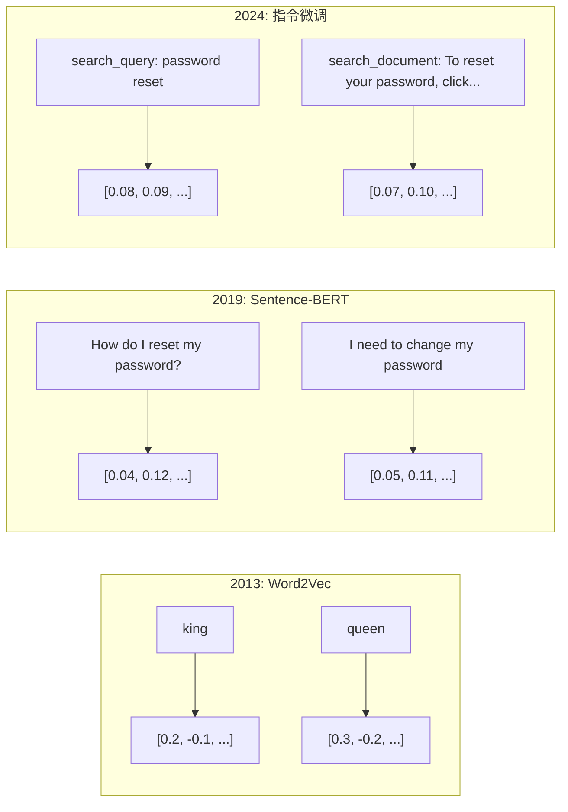
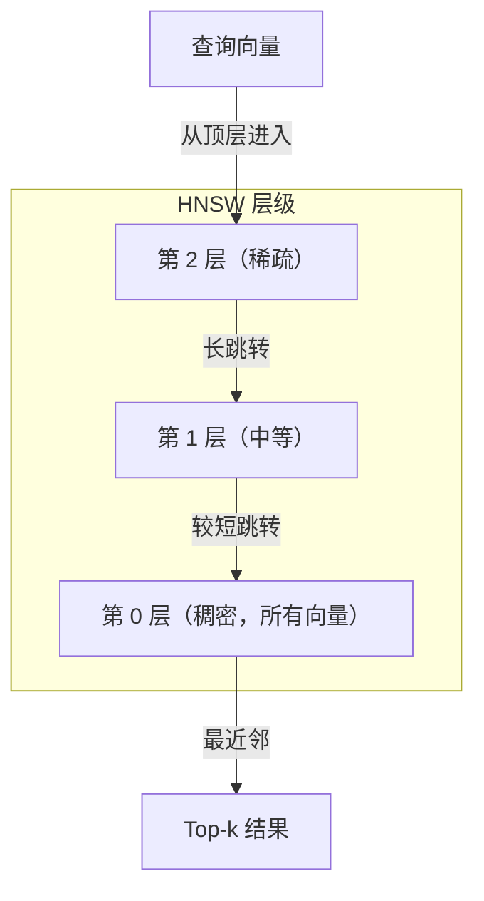

# 嵌入与向量表示

> 文本是离散的，数学是连续的。每次你让 LLM 查找"相似"文档、比较语义或跳出关键词搜索，你依赖的都是连接这两个世界的桥梁。那座桥梁就是嵌入（embedding）。不理解嵌入，你就不是在理解现代 AI，只是在使用它。

**类型：** 构建
**语言：** Python
**前置课程：** 第 11 阶段，第 01 课（提示工程）
**时长：** ~75 分钟
**相关内容：** 第 5 阶段 · 第 22 课（嵌入模型深度解析）涵盖稠密/稀疏/多向量、Matryoshka 截断和按轴选模型。本课聚焦生产管道（向量数据库、HNSW、相似度数学）——在选择模型前请先阅读第 5 阶段 · 第 22 课。

## 学习目标

- 使用 API 提供商和开源模型生成文本嵌入，并计算它们之间的余弦相似度
- 解释嵌入为何能解决关键词搜索无法处理的词汇不匹配问题
- 构建按语义（而非精确关键词匹配）检索文档的语义搜索索引
- 使用检索基准（precision@k、recall）评估嵌入质量，并为任务选择合适的嵌入模型

## 问题背景

你有 10,000 张客户支持工单。一位客户写道"my payment didn't go through"。你需要找到相似的历史工单。关键词搜索能找到包含"payment"和"didn't go through"的工单，但会漏掉"transaction failed"、"charge was declined"、"billing error"。这些工单描述的是完全相同的问题，只是用了完全不同的词。

这就是词汇不匹配问题（vocabulary mismatch problem）。人类语言有数十种表达同一含义的方式，关键词搜索把每个词当作独立符号，完全不考虑意义，它无法知道"declined"和"didn't go through"指向同一个概念。

你需要一种文本表示方式，让意义而非拼写决定相似性。你需要一种方法，将"my payment didn't go through"和"transaction was declined"在某个数学空间中放在一起，同时把"my payment arrived on time"推远——尽管它们共享了"payment"这个词。

这种表示就是嵌入（embedding）。

## 概念讲解

### 什么是嵌入？

嵌入是一个表示文本含义的稠密浮点向量。"稠密"这个词很关键——每个维度都携带信息，不像稀疏表示（词袋、TF-IDF）那样大多数维度为零。

"The cat sat on the mat"会变成类似 `[0.023, -0.041, 0.087, ..., 0.012]` 的东西——一个包含 768 到 3072 个数字的列表，具体取决于模型。这些数字编码了含义，你不会直接检查它们，只会比较它们。

### Word2Vec 的突破

2013 年，Google 的 Tomas Mikolov 等人发表了 Word2Vec。核心洞察：训练神经网络从邻近词预测某个词（或从某个词预测邻近词），隐藏层权重就会成为有意义的向量表示。

最著名的结果：

```
king - man + woman = queen
```

词嵌入上的向量运算能捕捉语义关系。从"man"到"woman"的方向与从"king"到"queen"的方向大致相同。正是在这一刻，该领域意识到几何可以编码意义。

Word2Vec 产生 300 维向量，每个词得到一个向量，与上下文无关。"Bank"在"river bank"（河岸）和"bank account"（银行账户）中有相同的嵌入。这个局限推动了此后十年的研究。

### 从词到句子

词嵌入表示单个 token，生产系统需要嵌入整个句子、段落或文档。四种方法应运而生：

**平均法（Averaging）**：取句子中所有词向量的均值。廉价、有损，但对短文本出奇地好。完全丢失词序——"dog bites man"和"man bites dog"会得到相同的嵌入。

**CLS token**：Transformer 模型（BERT，2018）输出一个代表整个输入的特殊 [CLS] token 嵌入。优于平均法，但 [CLS] token 是为下句预测而训练的，并非为相似度而训练。

**对比学习（Contrastive learning）**：显式训练模型，将相似对推近、不相似对推远。Sentence-BERT（Reimers & Gurevych，2019）使用此方法，成为现代嵌入模型的基础。给定"How do I reset my password?"和"I need to change my password"，模型学习让这两句话的向量几乎相同。

**指令微调嵌入（Instruction-tuned embeddings）**：最新方法。E5、GTE 等模型接受任务前缀（"search_query:"、"search_document:"），告诉模型产生哪种嵌入。这让一个模型可以服务多种任务。



### 现代嵌入模型

市场已形成若干生产级选项（2026 年初 MTEB v2 分数）：

| 模型 | 提供商 | 维度 | MTEB | 上下文 | 每百万 token 成本 |
|-------|----------|-----------|------|---------|------------------|
| Gemini Embedding 2 | Google | 3072（Matryoshka） | 67.7（检索） | 8192 | $0.15 |
| embed-v4 | Cohere | 1024（Matryoshka） | 65.2 | 128K | $0.12 |
| voyage-4 | Voyage AI | 1024/2048（Matryoshka） | 66.8 | 32K | $0.12 |
| text-embedding-3-large | OpenAI | 3072（Matryoshka） | 64.6 | 8192 | $0.13 |
| text-embedding-3-small | OpenAI | 1536（Matryoshka） | 62.3 | 8192 | $0.02 |
| BGE-M3 | BAAI | 1024（稠密+稀疏+ColBERT） | 63.0 多语言 | 8192 | 开源权重 |
| Qwen3-Embedding | 阿里巴巴 | 4096（Matryoshka） | 66.9 | 32K | 开源权重 |
| Nomic-embed-v2 | Nomic | 768（Matryoshka） | 63.1 | 8192 | 开源权重 |

MTEB（大规模文本嵌入基准）v2 涵盖检索、分类、聚类、重排序、摘要等 100 多个任务。分越高越好。到 2026 年，开源权重模型（Qwen3-Embedding、BGE-M3）在大多数维度上已与闭源托管模型持平甚至超越。Gemini Embedding 2 在纯检索上领先，Voyage/Cohere 在特定领域（金融、法律、代码）表现更好。在确定选择前，务必在自己的查询上做基准测试。

### 相似度度量

给定两个嵌入向量，有三种方式衡量相似度：

**余弦相似度（Cosine similarity）**：两个向量之间夹角的余弦值。范围从 -1（方向相反）到 1（方向相同）。忽略向量长度——10 词的句子和 500 词的文档，如果指向相同方向就可以得到 1.0。这是 90% 使用场景的默认选择。

```
cosine_sim(a, b) = dot(a, b) / (||a|| * ||b||)
```

**点积（Dot product）**：两个向量的内积。当向量已归一化（单位长度）时，与余弦相似度等价。计算更快。OpenAI 的嵌入已归一化，所以点积和余弦会给出相同的排序。

```
dot(a, b) = sum(a_i * b_i)
```

**欧氏距离（Euclidean / L2 distance）**：向量空间中的直线距离。越小越相似。对长度差异敏感。当空间中的绝对位置（而非方向）有意义时使用。

```
L2(a, b) = sqrt(sum((a_i - b_i)^2))
```

如何选择：

| 度量 | 适用场景 | 避免场景 |
|--------|----------|------------|
| 余弦相似度 | 比较不同长度的文本；大多数检索任务 | 向量长度携带信息时 |
| 点积 | 嵌入已归一化；追求最快速度 | 向量长度差异较大时 |
| 欧氏距离 | 聚类；空间近邻问题 | 比较长度差异极大的文档 |

### 向量数据库与 HNSW

暴力搜索（brute-force）把查询与每个存储的向量逐一比较。100 万个向量、1536 维，每次查询就需要 15 亿次乘加运算——太慢了。

向量数据库用近似最近邻（ANN）算法解决这个问题。最主流的算法是 HNSW（Hierarchical Navigable Small World，层级可导航小世界）：

1. 建立向量的多层图结构
2. 顶层稀疏——远距簇之间的长距离连接
3. 底层稠密——邻近向量之间的细粒度连接
4. 搜索从顶层开始，贪心下降以精细化结果
5. 以 O(log n) 的时间返回近似的 top-k 结果，而非 O(n)

HNSW 以少量准确率损失（通常 95-99% 召回率）换取巨大的速度提升。1000 万个向量时，暴力搜索需要数秒，HNSW 只需数毫秒。



生产选项：

| 数据库 | 类型 | 最适合 | 最大规模 |
|----------|------|----------|-----------|
| Pinecone | 托管 SaaS | 零运维生产 | 十亿级 |
| Weaviate | 开源 | 自托管、混合搜索 | 1 亿+ |
| Qdrant | 开源 | 高性能、带过滤 | 1 亿+ |
| ChromaDB | 嵌入式 | 原型开发、本地 | 100 万 |
| pgvector | Postgres 扩展 | 已在用 Postgres | 1000 万 |
| FAISS | 库 | 进程内、研究用 | 10 亿+ |

### 分块策略

文档太长，无法作为单一向量嵌入。一个 50 页的 PDF 涵盖数十个主题，其嵌入会成为所有内容的平均，与任何具体内容都不相似。你需要把文档拆成块（chunk），逐块嵌入。

**固定大小分块（Fixed-size chunking）**：每 N 个 token 分一块，相邻块重叠 M 个 token。简单可预测，适合无明显结构的文档。512 token 块、50 token 重叠：第 1 块是 token 0-511，第 2 块是 token 462-973。

**基于句子的分块（Sentence-based chunking）**：在句子边界处分割，将句子累积到达到 token 上限。每块至少包含一个完整句子。比固定大小好，因为不会从中间切断一个想法。

**递归分块（Recursive chunking）**：先尝试按最大边界（章节标题）分割，如果还太长，再按段落边界，再按句子边界，最后按字符上限。这是 LangChain 的 `RecursiveCharacterTextSplitter`，适用于混合格式的文档集合。

**语义分块（Semantic chunking）**：对每个句子嵌入，然后将嵌入相似的连续句子合并成块。当嵌入相似度低于阈值时开始新块。成本高（需要逐句嵌入），但产生最连贯的块。

| 策略 | 复杂度 | 质量 | 最适合 |
|----------|-----------|---------|----------|
| 固定大小 | 低 | 一般 | 非结构化文本、日志 |
| 基于句子 | 低 | 好 | 文章、邮件 |
| 递归 | 中 | 好 | Markdown、HTML、混合文档 |
| 语义 | 高 | 最好 | 高要求的检索质量 |

大多数系统的最优选择：256-512 token 块，50 token 重叠。

### 双编码器 vs 交叉编码器

**双编码器（Bi-encoder）** 独立嵌入查询和文档，再比较向量。速度快——查询只需嵌入一次，与预先计算好的文档嵌入比较。这是你用于检索的方案。

**交叉编码器（Cross-encoder）** 将查询和文档作为单一输入，输出一个相关性分数。速度慢——需要将每个查询-文档对完整地过一遍模型。但准确率高得多，因为它能同时关注查询和文档的 token。

生产模式：双编码器检索前 100 个候选，交叉编码器重排序到前 10。这是先检索再重排序（retrieve-then-rerank）的流水线。


重排序模型：Cohere Rerank 3.5（每 1000 次查询 $2），BGE-reranker-v2（免费、开源），Jina Reranker v2（免费、开源）。

### Matryoshka 嵌入

传统嵌入是全有或全无。1536 维向量用 1536 个浮点数，无法在不重新训练的情况下截断到 256 维。

Matryoshka 表示学习（Kusupati 等，2022）解决了这个问题。该模型经过训练，使前 N 个维度捕获最重要的信息，就像俄罗斯套娃一样。将 1536 维 Matryoshka 嵌入截断到 256 维会损失一些准确率，但仍能正常工作。

OpenAI 的 text-embedding-3-small 和 text-embedding-3-large 通过 `dimensions` 参数支持 Matryoshka 截断。请求 256 维而非 1536 维可将存储减少 6 倍，在 MTEB 基准上准确率损失约 3-5%。

### 二值量化

一个 1536 维嵌入以 float32 存储需要 6,144 字节。乘以 1000 万个文档：仅向量就需要 61 GB。

二值量化（binary quantization）将每个浮点数转换为一个比特：正值变为 1，负值变为 0。存储从 6,144 字节降至 192 字节——减少 32 倍。相似度用汉明距离（Hamming distance，计算不同比特数）计算，CPU 可以用单条指令完成。

准确率损失约 5-10% 的检索召回率。常见模式：对百万级向量的初步搜索使用二值量化，再用全精度向量对前 1000 个结果重新打分。这样能以 32 倍更少的内存获得 95%+ 的全精度准确率。

## 构建实现

我们从零构建一个语义搜索引擎。不用向量数据库，不用外部嵌入 API，纯 Python + numpy 做数学运算。

### 第一步：文本分块

```python
def chunk_text(text, chunk_size=200, overlap=50):
    words = text.split()
    chunks = []
    start = 0
    while start < len(words):
        end = start + chunk_size
        chunk = " ".join(words[start:end])
        chunks.append(chunk)
        start += chunk_size - overlap
    return chunks


def chunk_by_sentences(text, max_chunk_tokens=200):
    sentences = text.replace("\n", " ").split(".")
    sentences = [s.strip() + "." for s in sentences if s.strip()]
    chunks = []
    current_chunk = []
    current_length = 0
    for sentence in sentences:
        sentence_length = len(sentence.split())
        if current_length + sentence_length > max_chunk_tokens and current_chunk:
            chunks.append(" ".join(current_chunk))
            current_chunk = []
            current_length = 0
        current_chunk.append(sentence)
        current_length += sentence_length
    if current_chunk:
        chunks.append(" ".join(current_chunk))
    return chunks
```

### 第二步：从头构建嵌入

我们用带 L2 归一化的 TF-IDF 实现一个简单的稠密嵌入。这不是神经嵌入，但遵循相同的契约：文本输入，固定大小向量输出，相似文本产生相似向量。

```python
import math
import numpy as np
from collections import Counter

class SimpleEmbedder:
    def __init__(self):
        self.vocab = []
        self.idf = []
        self.word_to_idx = {}

    def fit(self, documents):
        vocab_set = set()
        for doc in documents:
            vocab_set.update(doc.lower().split())
        self.vocab = sorted(vocab_set)
        self.word_to_idx = {w: i for i, w in enumerate(self.vocab)}
        n = len(documents)
        self.idf = np.zeros(len(self.vocab))
        for i, word in enumerate(self.vocab):
            doc_count = sum(1 for doc in documents if word in doc.lower().split())
            self.idf[i] = math.log((n + 1) / (doc_count + 1)) + 1

    def embed(self, text):
        words = text.lower().split()
        count = Counter(words)
        total = len(words) if words else 1
        vec = np.zeros(len(self.vocab))
        for word, freq in count.items():
            if word in self.word_to_idx:
                tf = freq / total
                vec[self.word_to_idx[word]] = tf * self.idf[self.word_to_idx[word]]
        norm = np.linalg.norm(vec)
        if norm > 0:
            vec = vec / norm
        return vec
```

### 第三步：相似度函数

```python
def cosine_similarity(a, b):
    dot = np.dot(a, b)
    norm_a = np.linalg.norm(a)
    norm_b = np.linalg.norm(b)
    if norm_a == 0 or norm_b == 0:
        return 0.0
    return float(dot / (norm_a * norm_b))


def dot_product(a, b):
    return float(np.dot(a, b))


def euclidean_distance(a, b):
    return float(np.linalg.norm(a - b))
```

### 第四步：带暴力搜索的向量索引

```python
class VectorIndex:
    def __init__(self):
        self.vectors = []
        self.texts = []
        self.metadata = []

    def add(self, vector, text, meta=None):
        self.vectors.append(vector)
        self.texts.append(text)
        self.metadata.append(meta or {})

    def search(self, query_vector, top_k=5, metric="cosine"):
        scores = []
        for i, vec in enumerate(self.vectors):
            if metric == "cosine":
                score = cosine_similarity(query_vector, vec)
            elif metric == "dot":
                score = dot_product(query_vector, vec)
            elif metric == "euclidean":
                score = -euclidean_distance(query_vector, vec)
            else:
                raise ValueError(f"Unknown metric: {metric}")
            scores.append((i, score))
        scores.sort(key=lambda x: x[1], reverse=True)
        results = []
        for idx, score in scores[:top_k]:
            results.append({
                "text": self.texts[idx],
                "score": score,
                "metadata": self.metadata[idx],
                "index": idx
            })
        return results

    def size(self):
        return len(self.vectors)
```

### 第五步：语义搜索引擎

```python
class SemanticSearchEngine:
    def __init__(self, chunk_size=200, overlap=50):
        self.embedder = SimpleEmbedder()
        self.index = VectorIndex()
        self.chunk_size = chunk_size
        self.overlap = overlap

    def index_documents(self, documents, source_names=None):
        all_chunks = []
        all_sources = []
        for i, doc in enumerate(documents):
            chunks = chunk_text(doc, self.chunk_size, self.overlap)
            all_chunks.extend(chunks)
            name = source_names[i] if source_names else f"doc_{i}"
            all_sources.extend([name] * len(chunks))
        self.embedder.fit(all_chunks)
        for chunk, source in zip(all_chunks, all_sources):
            vec = self.embedder.embed(chunk)
            self.index.add(vec, chunk, {"source": source})
        return len(all_chunks)

    def search(self, query, top_k=5, metric="cosine"):
        query_vec = self.embedder.embed(query)
        return self.index.search(query_vec, top_k, metric)

    def search_with_scores(self, query, top_k=5):
        results = self.search(query, top_k)
        return [
            {
                "text": r["text"][:200],
                "source": r["metadata"].get("source", "unknown"),
                "score": round(r["score"], 4)
            }
            for r in results
        ]
```

### 第六步：比较相似度度量

```python
def compare_metrics(engine, query, top_k=3):
    results = {}
    for metric in ["cosine", "dot", "euclidean"]:
        hits = engine.search(query, top_k=top_k, metric=metric)
        results[metric] = [
            {"score": round(h["score"], 4), "preview": h["text"][:80]}
            for h in hits
        ]
    return results
```

## 使用方法

使用生产嵌入 API 时，架构完全一样，只需更换嵌入器：

```python
from openai import OpenAI

client = OpenAI()

def openai_embed(texts, model="text-embedding-3-small", dimensions=None):
    kwargs = {"model": model, "input": texts}
    if dimensions:
        kwargs["dimensions"] = dimensions
    response = client.embeddings.create(**kwargs)
    return [item.embedding for item in response.data]
```

使用 OpenAI 的 Matryoshka 截断——同一模型，更少维度，更低存储：

```python
full = openai_embed(["semantic search query"], dimensions=1536)
compact = openai_embed(["semantic search query"], dimensions=256)
```

256 维向量使用的存储是 1536 维的 1/6。1000 万个文档，就是 10 GB vs 61 GB。在标准基准上准确率损失约 3-5%。

使用 Cohere 进行重排序：

```python
import cohere

co = cohere.ClientV2()

results = co.rerank(
    model="rerank-v3.5",
    query="What is the refund policy?",
    documents=["Full refund within 30 days...", "No refunds after 90 days..."],
    top_n=3
)
```

使用本地嵌入，无需 API 依赖：

```python
from sentence_transformers import SentenceTransformer

model = SentenceTransformer("BAAI/bge-small-en-v1.5")
embeddings = model.encode(["semantic search query", "another document"])
```

我们构建的 VectorIndex 类适用于以上任意方案。更换嵌入函数，保留搜索逻辑不变。

## 交付物

本课产出：
- `outputs/prompt-embedding-advisor.md` — 用于为特定使用场景选择嵌入模型和策略的提示
- `outputs/skill-embedding-patterns.md` — 教会智能体如何在生产中高效使用嵌入的技能

## 练习

1. **度量对比**：用余弦相似度、点积和欧氏距离对样本文档运行相同的 5 个查询，记录每种度量的前 3 个结果。哪些查询的三种度量结果存在分歧？为什么？

2. **分块大小实验**：分别用 50、100、200、500 词的分块大小对样本文档建立索引。对每种大小运行 5 个查询并记录 top-1 相似度分数。绘制分块大小与检索质量的关系图。找出更大分块开始变差的拐点。

3. **Matryoshka 模拟**：构建一个产生 500 维向量的 SimpleEmbedder，截断到 50、100、200 和 500 维，测量每个截断处检索召回率的下降情况。这模拟了 Matryoshka 的行为，无需真实的训练技巧。

4. **二值量化**：取搜索引擎中的嵌入，转换为二进制（正值为 1，负值为 0），实现汉明距离搜索。比较 top-10 结果与全精度余弦相似度的结果，测量重叠比例。

5. **基于句子的分块**：用 `chunk_by_sentences` 替换固定大小分块，运行相同查询并比较检索分数。尊重句子边界是否能改善结果？

## 关键术语

| 术语 | 人们怎么说 | 实际含义 |
|------|----------------|----------------------|
| 嵌入（Embedding） | "把文本变成数字" | 稠密向量，几何距离编码语义相似性 |
| Word2Vec | "最初的嵌入" | 2013 年通过预测上下文词学习词向量的模型，证明了向量运算能编码意义 |
| 余弦相似度（Cosine similarity） | "两个向量有多相似" | 向量夹角的余弦；1=方向相同，0=正交，-1=方向相反 |
| HNSW | "快速向量搜索" | 层级可导航小世界图——多层结构，实现 O(log n) 的近似最近邻搜索 |
| 双编码器（Bi-encoder） | "分别嵌入，快速比较" | 独立将查询和文档编码为向量，支持预计算和快速检索 |
| 交叉编码器（Cross-encoder） | "慢但准确的重排序器" | 将查询-文档对作为整体输入模型处理，准确率更高，但无法预计算 |
| Matryoshka 嵌入 | "可截断的向量" | 训练使前 N 维捕获最重要信息，支持可变大小存储 |
| 二值量化（Binary quantization） | "1 比特嵌入" | 将浮点向量转为二进制（仅符号位），存储减少 32 倍，改用汉明距离搜索 |
| 分块（Chunking） | "拆文档再嵌入" | 将文档分割为 256-512 token 的片段，每段独立嵌入和检索 |
| 向量数据库（Vector database） | "嵌入的搜索引擎" | 专为存储向量并大规模执行近似最近邻搜索优化的数据存储 |
| 对比学习（Contrastive learning） | "通过比较训练" | 训练方法，将相似对的嵌入推近，将不相似对的嵌入推远 |
| MTEB | "嵌入基准" | 大规模文本嵌入基准，涵盖 8 类任务的 56 个数据集，是比较嵌入模型的标准 |

## 延伸阅读

- Mikolov 等，"Efficient Estimation of Word Representations in Vector Space"（2013）— 开启嵌入革命的 Word2Vec 论文，包含"国王-王后"类比
- Reimers & Gurevych，"Sentence-BERT: Sentence Embeddings using Siamese BERT-Networks"（2019）— 如何训练句子级相似度的双编码器，现代嵌入模型的基础
- Kusupati 等，"Matryoshka Representation Learning"（2022）— OpenAI 用于 text-embedding-3 的可变维度嵌入技术
- Malkov & Yashunin，"Efficient and Robust Approximate Nearest Neighbor using Hierarchical Navigable Small World Graphs"（2018）— HNSW 论文，大多数生产向量搜索背后的算法
- OpenAI 嵌入指南（platform.openai.com/docs/guides/embeddings）— text-embedding-3 模型（包含 Matryoshka 降维）的实用参考
- MTEB 排行榜（huggingface.co/spaces/mteb/leaderboard）— 跨任务和语言比较所有嵌入模型的实时基准
- [Muennighoff 等，"MTEB: Massive Text Embedding Benchmark"（EACL 2023）](https://arxiv.org/abs/2210.07316) — 定义 8 类任务（分类、聚类、对分类、重排序、检索、STS、摘要、双语文本挖掘）的基准论文，读后再信任 MTEB 分数
- [Sentence Transformers 文档](https://www.sbert.net/) — 双编码器 vs 交叉编码器、池化策略、RAG 管道（摄入-分块-嵌入-存储）的权威参考
