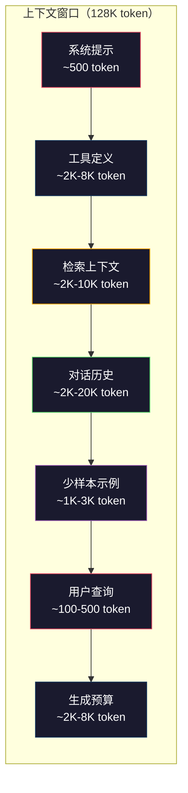
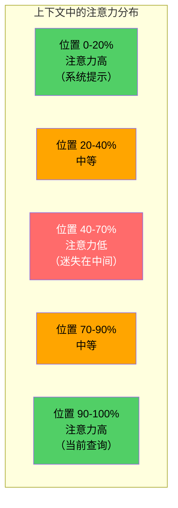
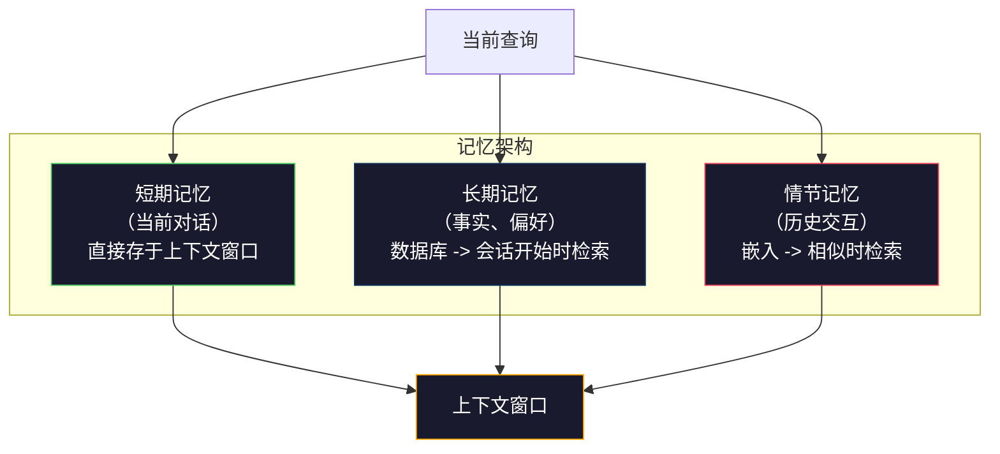

# 上下文工程：窗口、预算、记忆与检索

> 提示工程是子集，上下文工程才是全局。提示是你输入的字符串，上下文是进入模型窗口的一切：系统指令、检索文档、工具定义、对话历史、少样本示例以及提示本身。2026 年最优秀的 AI 工程师是上下文工程师——他们决定放入什么、排除什么、以什么顺序排列。

**类型：** 构建
**语言：** Python
**前置课程：** 第 10 阶段（从零构建 LLM），第 11 阶段第 01-02 课
**时长：** ~90 分钟
**相关内容：** 第 11 阶段 · 第 15 课（提示缓存）——对缓存友好的布局是上下文工程的延伸。第 5 阶段 · 第 28 课（长上下文评估）——如何用 NIAH/RULER 测量"迷失在中间"问题。

## 学习目标

- 计算所有上下文窗口组件（系统提示、工具、历史记录、检索文档、生成余量）的 token 预算
- 实现上下文窗口管理策略：截断、摘要化和对话历史的滑动窗口
- 对上下文组件进行优先级排序，最大化模型对最相关信息的注意力
- 构建根据查询类型和可用窗口空间动态分配 token 的上下文组装器

## 问题背景

Claude Opus 4.7 有 20 万 token 窗口（测试版达 100 万）。GPT-5 有 40 万。Gemini 3 Pro 有 200 万。Llama 4 声称 1000 万。这些数字听起来很大，直到你把它们填满。

以下是一个编程助手的真实分解：系统提示 500 token，50 个工具的定义 8,000 token，检索到的文档 4,000 token，对话历史（10 轮）6,000 token，当前用户查询 200 token，生成预算（最大输出）4,000 token。总计 22,700 token——仅占 128K 窗口的 18%。

但注意力不随上下文长度线性扩展。拥有 128K token 上下文的模型需要二次方的注意力成本（原始 Transformer 为 O(n²)，虽然大多数生产模型使用高效注意力变体）。更重要的是，检索准确率会下降。"大海捞针"测试表明，模型难以找到放置在长上下文中间的信息。Liu 等（2023）的研究表明，LLM 能以接近完美的准确率检索上下文开头和结尾的信息，但对于放置在中间（上下文 40-70% 位置）的信息，准确率下降 10-20%。这种"迷失在中间"效应因模型而异，但影响所有当前架构。

实践教训：有 20 万 token 可用，不代表使用 20 万 token 就有效。精心策划的 1 万 token 上下文，往往优于堆砌的 10 万 token 上下文。上下文工程就是在上下文窗口内最大化信噪比的学科。

你放入窗口的每个 token，都在取代一个可以携带更多相关信息的 token。每一条不相关的工具定义、每一轮过时的对话、每一块没有回答问题的检索文本——每一个都让模型在任务上稍微变差。

## 概念讲解

### 上下文窗口是稀缺资源

把上下文窗口想象成 RAM，而不是磁盘。它快速且可直接访问，但有限。你无法放入所有内容，必须做选择。



每个组件都在争夺空间。添加更多工具定义意味着对话历史空间减少；添加更多检索上下文意味着少样本示例空间减少。上下文工程就是为了最大化任务表现而分配这份预算的艺术。

### 迷失在中间（Lost-in-the-Middle）

上下文工程中最重要的实证发现。模型对上下文开头和结尾的信息注意力更好，中间的信息注意力分数更低，更容易被忽视。

Liu 等（2023）进行了系统测试。他们将一份相关文档放在 20 份无关文档的不同位置，测量回答准确率。相关文档排第一或最后时，准确率为 85-90%；排在中间（20 份中的第 10 份）时，准确率降至 60-70%。

这对工程有直接影响：

- 将最重要的信息放在最前面（系统提示、关键指令）
- 将当前查询和最相关上下文放在最后（近因偏差有帮助）
- 将上下文的中间部分视为最低优先级区域
- 如果必须在中间放置信息，在结尾重复关键要点



### 上下文组件

**系统提示**：设置人格、约束和行为规则，放在最前面，在多轮对话中保持不变。Claude Code 的系统提示（包括工具定义和行为指令）大约占 6,000 token。保持简洁——系统提示的每个词都会在每次 API 调用时重复出现。

**工具定义**：每个工具添加 50-200 token（名称、描述、参数 Schema）。50 个工具每个 150 token，还没开始任何对话就已占用 7,500 token。动态工具选择——只包含与当前查询相关的工具——可以减少 60-80%。

**检索上下文**：来自向量数据库的文档、搜索结果、文件内容。检索质量直接决定响应质量。糟糕的检索比没有检索更糟——它用噪声填充窗口，还会主动误导模型。

**对话历史**：所有之前的用户消息和助手回复。随对话轮数线性增长。50 轮对话，每轮 200 token，就是 10,000 token 的历史。其中大部分与当前查询无关。

**少样本示例**：展示期望行为的输入/输出对。两三个精心挑选的示例，往往比数千 token 的指令更能提升输出质量。但它们消耗空间。

**生成预算**：为模型响应预留的 token。如果把窗口填满，模型就没有回答的空间。至少预留 2,000-4,000 token 用于生成。

### 上下文压缩策略

**历史摘要化（History summarization）**：不保留所有前轮对话的原文，而是定期摘要对话。"我们讨论了 X，决定了 Y，用户想要 Z"占 100 token，可替换占了 2,000 token 的 10 轮对话。当历史超过阈值（如 5,000 token）时执行摘要。

**相关性过滤（Relevance filtering）**：对每份检索文档与当前查询打分，丢弃低于阈值的文档。如果检索到 10 个块但只有 3 个相关，放弃其余 7 个。3 个高度相关的块，胜过 10 个平庸的块。

**工具剪枝（Tool pruning）**：对用户查询意图分类，只包含与该意图相关的工具。代码问题不需要日历工具，日程安排问题不需要文件系统工具。这可以将工具定义从 8,000 token 减少到 1,000 token。

**递归摘要（Recursive summarization）**：对于非常长的文档，分阶段摘要。先摘要每个章节，再摘要摘要。一个 50 页的文档变成 500 token 的摘要，捕捉要点。

### 记忆系统

上下文工程横跨三个时间维度。

**短期记忆（Short-term memory）**：当前对话，直接存储在上下文窗口中，随每轮增长，通过摘要和截断管理。

**长期记忆（Long-term memory）**：跨对话持久化的事实和偏好，如"用户偏好 TypeScript"、"项目使用 PostgreSQL"。存储在数据库中，在会话开始时检索。Claude Code 将其存储在 CLAUDE.md 文件中，ChatGPT 存储在其记忆功能中。

**情节记忆（Episodic memory）**：可能与当前相关的具体历史交互，如"上周二，我们在 auth 模块调试了类似的问题"。以嵌入形式存储，当前对话与历史情节相似时检索。



### 动态上下文组装

核心洞察：不同查询需要不同的上下文。静态系统提示 + 静态工具 + 静态历史是浪费。最好的系统按查询动态组装上下文。

1. 对查询意图分类
2. 选择相关工具（不是所有工具）
3. 检索相关文档（不是固定集合）
4. 包含相关历史轮次（不是所有历史）
5. 添加与任务类型匹配的少样本示例
6. 按重要性排序：关键内容放最前，重要内容放最后，可选内容放中间

这就是优秀 AI 应用与卓越 AI 应用之间的区别。模型是一样的，上下文才是差异化因素。

## 构建实现

### 第一步：Token 计数器

不能度量的就无法预算。构建一个简单的 token 计数器（使用空格分词的近似计数，因为精确计数取决于 tokenizer）。

```python
import json
import numpy as np
from collections import OrderedDict

def count_tokens(text):
    if not text:
        return 0
    return int(len(text.split()) * 1.3)

def count_tokens_json(obj):
    return count_tokens(json.dumps(obj))
```

### 第二步：上下文预算管理器

核心抽象。预算管理器追踪每个组件使用了多少 token，并强制执行限制。

```python
class ContextBudget:
    def __init__(self, max_tokens=128000, generation_reserve=4000):
        self.max_tokens = max_tokens
        self.generation_reserve = generation_reserve
        self.available = max_tokens - generation_reserve
        self.allocations = OrderedDict()

    def allocate(self, component, content, max_tokens=None):
        tokens = count_tokens(content)
        if max_tokens and tokens > max_tokens:
            words = content.split()
            target_words = int(max_tokens / 1.3)
            content = " ".join(words[:target_words])
            tokens = count_tokens(content)

        used = sum(self.allocations.values())
        if used + tokens > self.available:
            allowed = self.available - used
            if allowed <= 0:
                return None, 0
            words = content.split()
            target_words = int(allowed / 1.3)
            content = " ".join(words[:target_words])
            tokens = count_tokens(content)

        self.allocations[component] = tokens
        return content, tokens

    def remaining(self):
        used = sum(self.allocations.values())
        return self.available - used

    def utilization(self):
        used = sum(self.allocations.values())
        return used / self.max_tokens

    def report(self):
        total_used = sum(self.allocations.values())
        lines = []
        lines.append(f"上下文预算报告（{self.max_tokens:,} token 窗口）")
        lines.append("-" * 50)
        for component, tokens in self.allocations.items():
            pct = tokens / self.max_tokens * 100
            bar = "#" * int(pct / 2)
            lines.append(f"  {component:<25} {tokens:>6} token（{pct:>5.1f}%）{bar}")
        lines.append("-" * 50)
        lines.append(f"  {'已使用':<25} {total_used:>6} token（{total_used/self.max_tokens*100:.1f}%）")
        lines.append(f"  {'生成预留':<25} {self.generation_reserve:>6} token")
        lines.append(f"  {'剩余':<25} {self.remaining():>6} token")
        return "\n".join(lines)
```

### 第三步：迷失在中间重排序

实现重排序策略：最重要的内容放最前和最后，最不重要的放中间。

```python
def reorder_lost_in_middle(items, scores):
    paired = sorted(zip(scores, items), reverse=True)
    sorted_items = [item for _, item in paired]

    if len(sorted_items) <= 2:
        return sorted_items

    first_half = sorted_items[::2]
    second_half = sorted_items[1::2]
    second_half.reverse()

    return first_half + second_half

def score_relevance(query, documents):
    query_words = set(query.lower().split())
    scores = []
    for doc in documents:
        doc_words = set(doc.lower().split())
        if not query_words:
            scores.append(0.0)
            continue
        overlap = len(query_words & doc_words) / len(query_words)
        scores.append(round(overlap, 3))
    return scores
```

### 第四步：对话历史压缩器

摘要旧的对话轮次，回收 token 预算。

```python
class ConversationManager:
    def __init__(self, max_history_tokens=5000):
        self.turns = []
        self.summaries = []
        self.max_history_tokens = max_history_tokens

    def add_turn(self, role, content):
        self.turns.append({"role": role, "content": content})
        self._compress_if_needed()

    def _compress_if_needed(self):
        total = sum(count_tokens(t["content"]) for t in self.turns)
        if total <= self.max_history_tokens:
            return

        while total > self.max_history_tokens and len(self.turns) > 4:
            old_turns = self.turns[:2]
            summary = self._summarize_turns(old_turns)
            self.summaries.append(summary)
            self.turns = self.turns[2:]
            total = sum(count_tokens(t["content"]) for t in self.turns)

    def _summarize_turns(self, turns):
        parts = []
        for t in turns:
            content = t["content"]
            if len(content) > 100:
                content = content[:100] + "..."
            parts.append(f"{t['role']}: {content}")
        return "Previous: " + " | ".join(parts)

    def get_context(self):
        parts = []
        if self.summaries:
            parts.append("[对话摘要]")
            for s in self.summaries:
                parts.append(s)
        parts.append("[近期对话]")
        for t in self.turns:
            parts.append(f"{t['role']}: {t['content']}")
        return "\n".join(parts)

    def token_count(self):
        return count_tokens(self.get_context())
```

### 第五步：动态工具选择器

只包含与当前查询相关的工具。对意图分类，再过滤。

```python
TOOL_REGISTRY = {
    "read_file": {
        "description": "Read contents of a file",
        "tokens": 120,
        "categories": ["code", "files"],
    },
    "write_file": {
        "description": "Write content to a file",
        "tokens": 150,
        "categories": ["code", "files"],
    },
    "search_code": {
        "description": "Search for patterns in codebase",
        "tokens": 130,
        "categories": ["code"],
    },
    "run_command": {
        "description": "Execute a shell command",
        "tokens": 140,
        "categories": ["code", "system"],
    },
    "create_calendar_event": {
        "description": "Create a new calendar event",
        "tokens": 180,
        "categories": ["calendar"],
    },
    "list_emails": {
        "description": "List recent emails",
        "tokens": 160,
        "categories": ["email"],
    },
    "send_email": {
        "description": "Send an email message",
        "tokens": 200,
        "categories": ["email"],
    },
    "web_search": {
        "description": "Search the web for information",
        "tokens": 140,
        "categories": ["research"],
    },
    "query_database": {
        "description": "Run a SQL query on the database",
        "tokens": 170,
        "categories": ["code", "data"],
    },
    "generate_chart": {
        "description": "Generate a chart from data",
        "tokens": 190,
        "categories": ["data", "visualization"],
    },
}

def classify_intent(query):
    query_lower = query.lower()

    intent_keywords = {
        "code": ["code", "function", "bug", "error", "file", "implement", "refactor", "debug", "test"],
        "calendar": ["meeting", "schedule", "calendar", "appointment", "event"],
        "email": ["email", "mail", "send", "inbox", "message"],
        "research": ["search", "find", "what is", "how does", "explain", "look up"],
        "data": ["data", "query", "database", "chart", "graph", "analytics", "sql"],
    }

    scores = {}
    for intent, keywords in intent_keywords.items():
        score = sum(1 for kw in keywords if kw in query_lower)
        if score > 0:
            scores[intent] = score

    if not scores:
        return ["code"]

    max_score = max(scores.values())
    return [intent for intent, score in scores.items() if score >= max_score * 0.5]

def select_tools(query, token_budget=2000):
    intents = classify_intent(query)
    relevant = {}
    total_tokens = 0

    for name, tool in TOOL_REGISTRY.items():
        if any(cat in intents for cat in tool["categories"]):
            if total_tokens + tool["tokens"] <= token_budget:
                relevant[name] = tool
                total_tokens += tool["tokens"]

    return relevant, total_tokens
```

### 第六步：完整上下文组装流水线

将所有内容串联起来。给定一个查询，动态组装最优上下文。

```python
class ContextEngine:
    def __init__(self, max_tokens=128000, generation_reserve=4000):
        self.budget = ContextBudget(max_tokens, generation_reserve)
        self.conversation = ConversationManager(max_history_tokens=5000)
        self.system_prompt = (
            "You are a helpful AI assistant. You have access to tools for "
            "code editing, file management, web search, and data analysis. "
            "Use the appropriate tools for each task. Be concise and accurate."
        )
        self.knowledge_base = [
            "Python 3.12 introduced type parameter syntax for generic classes using bracket notation.",
            "The project uses PostgreSQL 16 with pgvector for embedding storage.",
            "Authentication is handled by Supabase Auth with JWT tokens.",
            "The frontend is built with Next.js 15 using the App Router.",
            "API rate limits are set to 100 requests per minute per user.",
            "The deployment pipeline uses GitHub Actions with Docker multi-stage builds.",
            "Test coverage must be above 80% for all new modules.",
            "The codebase follows the repository pattern for data access.",
        ]

    def assemble(self, query):
        self.budget = ContextBudget(self.budget.max_tokens, self.budget.generation_reserve)

        system_content, _ = self.budget.allocate("system_prompt", self.system_prompt, max_tokens=1000)

        tools, tool_tokens = select_tools(query, token_budget=2000)
        tool_text = json.dumps(list(tools.keys()))
        tool_content, _ = self.budget.allocate("tools", tool_text, max_tokens=2000)

        relevance = score_relevance(query, self.knowledge_base)
        threshold = 0.1
        relevant_docs = [
            doc for doc, score in zip(self.knowledge_base, relevance)
            if score >= threshold
        ]

        if relevant_docs:
            doc_scores = [s for s in relevance if s >= threshold]
            reordered = reorder_lost_in_middle(relevant_docs, doc_scores)
            doc_text = "\n".join(reordered)
            doc_content, _ = self.budget.allocate("retrieved_context", doc_text, max_tokens=3000)

        history_text = self.conversation.get_context()
        if history_text.strip():
            history_content, _ = self.budget.allocate("conversation_history", history_text, max_tokens=5000)

        query_content, _ = self.budget.allocate("user_query", query, max_tokens=500)

        return self.budget

    def chat(self, query):
        self.conversation.add_turn("user", query)
        budget = self.assemble(query)
        response = f"[Response to: {query[:50]}...]"
        self.conversation.add_turn("assistant", response)
        return budget


def run_demo():
    print("=" * 60)
    print("  上下文工程流水线演示")
    print("=" * 60)

    engine = ContextEngine(max_tokens=128000, generation_reserve=4000)

    print("\n--- 查询 1：代码任务 ---")
    budget = engine.chat("Fix the bug in the authentication module where JWT tokens expire too early")
    print(budget.report())

    print("\n--- 查询 2：研究任务 ---")
    budget = engine.chat("What is the best approach for implementing vector search in PostgreSQL?")
    print(budget.report())

    print("\n--- 查询 3：对话历史积累后 ---")
    for i in range(8):
        engine.conversation.add_turn("user", f"Follow-up question number {i+1} about the implementation details of the system")
        engine.conversation.add_turn("assistant", f"Here is the response to follow-up {i+1} with technical details about the architecture")

    budget = engine.chat("Now implement the changes we discussed")
    print(budget.report())

    print("\n--- 工具选择示例 ---")
    test_queries = [
        "Fix the bug in auth.py",
        "Schedule a meeting with the team for Tuesday",
        "Show me the database query performance stats",
        "Search for best practices on error handling",
    ]

    for q in test_queries:
        tools, tokens = select_tools(q)
        intents = classify_intent(q)
        print(f"\n  查询：{q}")
        print(f"  意图：{intents}")
        print(f"  工具：{list(tools.keys())}（{tokens} token）")

    print("\n--- 迷失在中间重排序 ---")
    docs = ["文档 A（最相关）", "文档 B（较相关）", "文档 C（最不相关）",
            "文档 D（相关）", "文档 E（中等相关）"]
    scores = [0.95, 0.60, 0.20, 0.80, 0.50]
    reordered = reorder_lost_in_middle(docs, scores)
    print(f"  原始顺序：{docs}")
    print(f"  分数：    {scores}")
    print(f"  重排序后：{reordered}")
    print(f"  （最相关的在首尾，最不相关的在中间）")
```

## 使用方法

### Claude Code 的上下文策略

Claude Code 使用分层方式管理上下文。系统提示包含行为规则和工具定义（约 6K token）。打开文件时，内容作为上下文注入；搜索时，结果会添加进来；旧的对话轮次被摘要化；CLAUDE.md 提供跨会话持久化的长期记忆。

关键工程决策：Claude Code 不会把整个代码库倒进上下文，而是按需检索相关文件。这就是实践中的上下文工程。

### Cursor 的动态上下文加载

Cursor 将整个代码库索引为嵌入。当你输入查询时，它用向量相似度检索最相关的文件和代码块，只有这些片段才进入上下文窗口。一个 50 万行的代码库被压缩成最相关的 5-10 个代码块。

这就是模式：嵌入所有内容，按需检索，只包含重要的。

### ChatGPT 的记忆

ChatGPT 将用户偏好和事实存储为长期记忆。每次对话开始时，相关记忆被检索并包含在系统提示中。"用户偏好 Python"花费 5 个 token，但能在多次对话中节省数百 token 的重复指令。

### RAG 作为上下文工程

检索增强生成（RAG）是形式化的上下文工程。与其将知识塞入模型权重（训练）或系统提示（静态上下文），不如在查询时检索相关文档并注入上下文窗口。整个 RAG 流水线——分块、嵌入、检索、重排序——都是为了解决一个问题：把正确的信息放进上下文窗口。

## 交付物

本课产出 `outputs/prompt-context-optimizer.md`——一个可复用的提示，用于审计上下文组装策略并推荐优化方案。输入你的系统提示、工具数量、平均历史长度和检索策略，它会识别 token 浪费并提出改进建议。

还产出 `outputs/skill-context-engineering.md`——根据任务类型、上下文窗口大小和延迟预算，设计上下文组装流水线的决策框架。

## 练习

1. 为 ContextBudget 类添加"token 浪费检测器"。它应该标记使用超过 30% 预算的组件，并针对每种组件类型提供具体的压缩建议（摘要历史、剪枝工具、重排文档）。

2. 为检索上下文实现语义去重。如果两份检索文档的相似度超过 80%（通过词重叠或嵌入余弦相似度），只保留得分更高的那份。测量这能回收多少 token 预算。

3. 构建"上下文回放"工具。给定一段对话记录，通过 ContextEngine 回放并可视化预算分配随每轮的变化情况。绘制每个组件随时间的 token 使用量，找出上下文开始被压缩的那一轮。

4. 实现基于优先级的工具选择器。不是简单的包含/排除，而是为每个工具对当前查询的相关性打分，按相关性降序包含工具直到工具预算耗尽。比较包含 5、10、20 和 50 个工具时的任务表现。

5. 构建多策略上下文压缩器。实现三种压缩策略（截断、摘要、关键句抽取），在 20 份文档上进行基准测试，测量压缩比与信息保留（压缩版本是否仍包含查询答案）之间的权衡。

## 关键术语

| 术语 | 人们怎么说 | 实际含义 |
|------|----------------|----------------------|
| 上下文窗口（Context window） | "模型能读多少" | 模型在单次前向传播中处理的最大 token 数（输入+输出）——GPT-5 40 万，Claude Opus 4.7 20 万（测试版 100 万），Gemini 3 Pro 200 万 |
| 上下文工程（Context engineering） | "高级提示工程" | 决定上下文窗口中放什么、以什么顺序、以什么优先级的学科——涵盖检索、压缩、工具选择和记忆管理 |
| 迷失在中间（Lost-in-the-middle） | "模型忘记中间的内容" | 实证发现：LLM 对上下文开头和结尾的注意力更好，中间位置的信息准确率下降 10-20% |
| Token 预算（Token budget） | "还剩多少 token" | 对各组件（系统提示、工具、历史、检索、生成）明确分配上下文窗口容量，并设定各组件上限 |
| 动态上下文（Dynamic context） | "实时加载" | 根据意图分类、相关工具选择和检索结果，为每个查询不同地组装上下文窗口 |
| 历史摘要化（History summarization） | "压缩对话" | 用简洁摘要替换旧对话轮次的原文，降低 token 成本同时保留关键信息 |
| 工具剪枝（Tool pruning） | "只包含相关工具" | 对查询意图分类，只包含匹配的工具定义，将工具 token 成本降低 60-80% |
| 长期记忆（Long-term memory） | "跨会话记忆" | 存储在数据库中并在会话开始时检索的事实和偏好——CLAUDE.md、ChatGPT 记忆等 |
| 情节记忆（Episodic memory） | "记住特定历史事件" | 以嵌入形式存储的历史交互，当前查询与历史对话相似时检索 |
| 生成预算（Generation budget） | "回答的空间" | 为模型输出预留的 token——如果上下文填满窗口，模型就没有回答的空间 |

## 延伸阅读

- [Liu 等，2023 — "Lost in the Middle: How Language Models Use Long Contexts"](https://arxiv.org/abs/2307.03172) — 关于位置依赖注意力的权威研究，证明模型难以利用长上下文中间的信息
- [Anthropic 的上下文检索博客文章](https://www.anthropic.com/news/contextual-retrieval) — Anthropic 如何进行上下文感知的块检索，将检索失败率降低 49%
- [Simon Willison 的"Context Engineering"](https://simonwillison.net/2025/Jun/27/context-engineering/) — 命名这门学科并将其与提示工程区分开来的博客文章
- [LangChain RAG 文档](https://python.langchain.com/docs/tutorials/rag/) — 作为上下文工程模式的 RAG 实践实现
- [Greg Kamradt 的大海捞针测试](https://github.com/gkamradt/LLMTest_NeedleInAHaystack) — 揭示所有主流模型位置依赖检索失败的基准测试
- [Pope 等，"Efficiently Scaling Transformer Inference"（2022）](https://arxiv.org/abs/2211.05102) — 为何上下文长度驱动内存和延迟，KV 缓存、MQA 和 GQA 如何改变预算计算
- [Agrawal 等，"SARATHI: Efficient LLM Inference by Piggybacking Decodes with Chunked Prefills"（2023）](https://arxiv.org/abs/2308.16369) — 推理的两个阶段为何使长提示在 TTFT 上昂贵但在 TPOT 上廉价；上下文打包权衡的底层原理
- [Ainslie 等，"GQA: Training Generalized Multi-Query Transformer Models from Multi-Head Checkpoints"（EMNLP 2023）](https://arxiv.org/abs/2305.13245) — 分组查询注意力论文，在不损失质量的情况下将生产解码器的 KV 内存减少 8 倍
