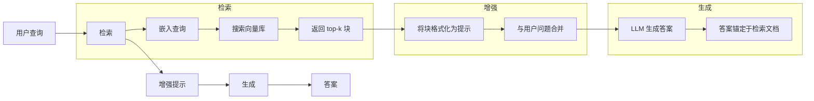
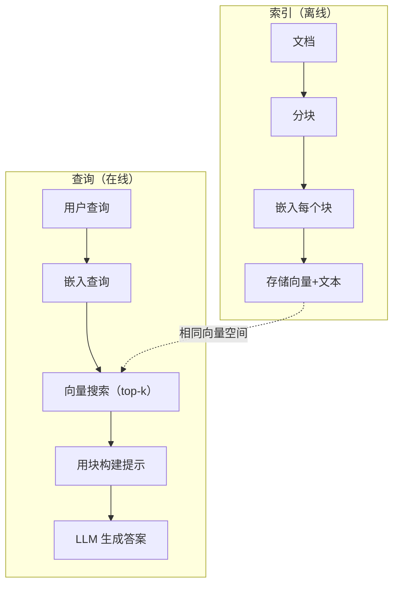

# RAG（检索增强生成）

> 你的 LLM 知道训练截止日期前的一切，对你的公司文档、代码库或上周的会议记录一无所知。RAG 通过检索相关文档并将其注入提示来解决这个问题。这是生产 AI 中部署最广泛的模式。如果这门课你只构建一件事，就构建一条 RAG 流水线。

**类型：** 构建
**语言：** Python
**前置课程：** 第 10 阶段（从零构建 LLM），第 11 阶段第 01-05 课
**时长：** ~90 分钟
**相关内容：** 第 5 阶段 · 第 23 课（RAG 分块策略）——六种分块算法及各自的适用场景。第 5 阶段 · 第 22 课（嵌入模型深度解析）——如何选择嵌入器。第 11 阶段 · 第 07 课（高级 RAG）——混合搜索、重排序和查询转换。

## 学习目标

- 构建完整的 RAG 流水线：文档加载、分块、嵌入、向量存储、检索和生成
- 使用向量数据库（ChromaDB、FAISS 或 Pinecone）实现带正确索引的语义搜索
- 解释为什么知识锚定应用中 RAG 优于微调（成本、时效性、可溯源性）
- 使用检索指标（精确率、召回率）和生成指标（忠实性、相关性）评估 RAG 质量

## 问题背景

你为公司构建了一个聊天机器人。客户问："企业套餐的退款政策是什么？"LLM 给出了一个关于典型 SaaS 退款政策的通用答案。而实际政策——埋在 200 页内部 Wiki 中——规定企业客户享有 60 天按比例退款窗口。LLM 从未见过这份文档，它无法知道未经训练的内容。

微调（fine-tuning）是一种解决方案：把 LLM 在你的内部文档上训练一遍，部署更新后的模型。这可行，但有严重问题。微调需要花费数千美元的算力；文档一旦变更，模型就过时了；你无法知道模型从哪个来源得出的答案；下个月公司收购了另一条产品线，你还要重新微调。

RAG 是另一种解决方案。让模型保持不变，问题到来时，在文档库中搜索相关段落，将其粘贴在问题前面，让模型基于这些段落作为上下文来回答。文档库可以在几分钟内更新，你能看到确切检索到了哪些文档，模型本身永远不变。这就是为什么 RAG 是生产主流模式：更便宜、更新鲜、更可审计，并且适用于任何 LLM。

## 概念讲解

### RAG 模式

整个模式浓缩为四个步骤：



查询 → 检索 → 增强提示 → 生成。每个 RAG 系统都遵循这个模式。生产 RAG 系统之间的差异在于每个步骤的细节：如何分块、如何嵌入、如何搜索，以及如何构建提示。

### 为什么 RAG 优于微调

| 关注点 | 微调 | RAG |
|---------|------------|-----|
| 成本 | 每次训练 $1,000-$100,000+ | 每次查询 $0.01-$0.10（嵌入+LLM） |
| 时效性 | 重新训练前一直过时 | 重新索引文档后几分钟内更新 |
| 可溯源性 | 无法追踪答案来源 | 可以展示确切检索到的段落 |
| 幻觉 | 仍然自由幻觉 | 锚定于检索文档 |
| 数据隐私 | 训练数据烘焙进权重 | 文档留在你的向量库中 |

微调永久改变模型的权重；RAG 临时改变模型的上下文。对大多数应用而言，临时上下文才是你需要的。

微调胜出的唯一情况：当你需要模型采用仅靠提示无法实现的特定风格、语气或推理模式时。对于事实性知识检索，RAG 每次都赢。

### 嵌入模型

嵌入模型将文本转换为稠密向量。相似文本在这个高维空间中产生距离近的向量。"How do I reset my password?"和"I need to change my password"尽管共享词语很少，但产生几乎相同的向量；"The cat sat on the mat"则产生截然不同的向量。

常用嵌入模型（2026 年阵容——详细分析见第 5 阶段 · 第 22 课）：

| 模型 | 维度 | 提供商 | 说明 |
|-------|-----------|----------|-------|
| text-embedding-3-small | 1536（Matryoshka） | OpenAI | 大多数场景最佳性价比 |
| text-embedding-3-large | 3072（Matryoshka） | OpenAI | 更高精度，可截断到 256/512/1024 |
| Gemini Embedding 2 | 3072（Matryoshka） | Google | MTEB 检索最高分；8K 上下文 |
| voyage-4 | 1024/2048（Matryoshka） | Voyage AI | 领域变体（代码、金融、法律） |
| Cohere embed-v4 | 1024（Matryoshka） | Cohere | 多语言强，128K 上下文 |
| BGE-M3 | 1024（稠密+稀疏+ColBERT） | BAAI（开源权重） | 一个模型三种视角 |
| Qwen3-Embedding | 4096（Matryoshka） | 阿里巴巴（开源权重） | 开源权重最高检索分 |
| all-MiniLM-L6-v2 | 384 | 开源权重（Sentence Transformers） | 原型开发基线 |

本课我们自己用 TF-IDF 构建简单嵌入。不是因为生产系统用 TF-IDF，而是因为它能让概念具体化：文本进入，向量出来，相似文本产生相似向量。

### 向量相似度

给定两个向量，如何衡量相似度？三种选择：

**余弦相似度**：两个向量夹角的余弦值。范围从 -1（方向相反）到 1（方向相同）。忽略向量长度，只关注方向。这是 RAG 的默认选择。

```
cosine_sim(a, b) = dot(a, b) / (||a|| * ||b||)
```

**点积**：原始内积。向量越大得分越高。当向量长度携带信息时有用（更长的文档可能更相关）。

```
dot(a, b) = sum(a_i * b_i)
```

**L2（欧氏）距离**：向量空间中的直线距离。距离越小越相似，对向量长度差异敏感。

```
L2(a, b) = sqrt(sum((a_i - b_i)^2))
```

余弦相似度是标准选择。它通过长度归一化，优雅地处理不同长度的文档。当人们说"向量搜索"时，几乎总是指余弦相似度。

### 分块策略

文档太长，无法作为单一向量嵌入。一个 50 页的 PDF 可能产生糟糕的嵌入，因为它涵盖了几十个主题。你需要将文档拆成块，逐块分别嵌入。

**固定大小分块**：每 N 个 token 分一块。简单可预测。512 token 块、50 token 重叠：第 1 块是 token 0-511，第 2 块是 token 462-973，以此类推。重叠确保不会在不恰当的边界截断句子。

**语义分块**：在自然边界处分割——段落、章节或 Markdown 标题。每块是连贯的意义单元。实现更复杂，但检索质量更好。

**递归分块**：先尝试在最大边界（章节标题）处分割；如果章节还是太大，在段落边界处分割；如果段落还是太大，在句子边界处分割。这是 LangChain RecursiveCharacterTextSplitter 的方法，实践中效果很好。

分块大小比人们想象的更重要：

- 太小（64-128 token）：每块缺少上下文。"上季度增长了 15%"——不知道"它"指的是什么。
- 太大（2048+ token）：每块涵盖多个主题，稀释相关性。搜索营收数据时，得到的块 10% 关于营收，90% 关于人员。
- 最优（256-512 token）：足够自包含，又足够聚焦。

大多数生产 RAG 系统使用 256-512 token 块、50 token 重叠。Anthropic 的 RAG 指南推荐这个范围。

### 向量数据库

有了嵌入，你需要一个地方存储和搜索它们。选项：

| 数据库 | 类型 | 最适合 |
|----------|------|----------|
| FAISS | 库（进程内） | 原型开发，小到中等数据集 |
| Chroma | 轻量级数据库 | 本地开发，小型部署 |
| Pinecone | 托管服务 | 无运维压力的生产环境 |
| Weaviate | 开源数据库 | 自托管生产 |
| pgvector | Postgres 扩展 | 已在用 Postgres |
| Qdrant | 开源数据库 | 高性能自托管 |

本课我们构建一个简单的内存向量库，在列表中存储向量，用暴力法做余弦相似度搜索。这等效于带平面索引的 FAISS。约 10 万个向量前速度不成问题。生产系统使用 HNSW 等近似最近邻（ANN）算法，毫秒级搜索数百万向量。

### 完整流水线



索引阶段每个文档运行一次（或文档更新时）。查询阶段在每次用户请求时运行。生产环境中，索引可能需要数小时处理数百万文档，而查询必须在一秒内响应。

### 真实数字

大多数生产 RAG 系统使用以下参数：

- **k = 5 到 10**：每次查询检索的块数
- **分块大小 = 256 到 512 token**，50 token 重叠
- **上下文预算**：每次查询 2,500-5,000 token 的检索内容
- **总提示**：约 8,000-16,000 token（系统提示+检索块+对话历史+用户查询）
- **嵌入维度**：384-3072，取决于模型
- **索引吞吐量**：使用 API 嵌入时每秒 100-1000 个文档
- **查询延迟**：检索 50-200ms，生成 500-3000ms

## 构建实现

### 第一步：文档分块

```python
def chunk_text(text, chunk_size=200, overlap=50):
    words = text.split()
    chunks = []
    start = 0
    while start < len(words):
        end = start + chunk_size
        chunk = " ".join(words[start:end])
        chunks.append(chunk)
        start += chunk_size - overlap
    return chunks
```

### 第二步：TF-IDF 嵌入

我们构建一个简单的嵌入函数。TF-IDF（词频-逆文档频率）不是神经嵌入，但它以捕捉词语重要性的方式将文本转换为向量。文档中频繁出现的词获得更高的 TF；在语料库中稀少的词获得更高的 IDF。两者的乘积给出一个向量，重要且具有辨别性的词具有更高的值。

```python
import math
from collections import Counter

def build_vocabulary(documents):
    vocab = set()
    for doc in documents:
        vocab.update(doc.lower().split())
    return sorted(vocab)

def compute_tf(text, vocab):
    words = text.lower().split()
    count = Counter(words)
    total = len(words)
    return [count.get(word, 0) / total for word in vocab]

def compute_idf(documents, vocab):
    n = len(documents)
    idf = []
    for word in vocab:
        doc_count = sum(1 for doc in documents if word in doc.lower().split())
        idf.append(math.log((n + 1) / (doc_count + 1)) + 1)
    return idf

def tfidf_embed(text, vocab, idf):
    tf = compute_tf(text, vocab)
    return [t * i for t, i in zip(tf, idf)]
```

### 第三步：余弦相似度搜索

```python
def cosine_similarity(a, b):
    dot = sum(x * y for x, y in zip(a, b))
    norm_a = math.sqrt(sum(x * x for x in a))
    norm_b = math.sqrt(sum(x * x for x in b))
    if norm_a == 0 or norm_b == 0:
        return 0.0
    return dot / (norm_a * norm_b)

def search(query_embedding, stored_embeddings, top_k=5):
    scores = []
    for i, emb in enumerate(stored_embeddings):
        sim = cosine_similarity(query_embedding, emb)
        scores.append((i, sim))
    scores.sort(key=lambda x: x[1], reverse=True)
    return scores[:top_k]
```

### 第四步：提示构建

这就是 RAG 中"增强"（Augmented）发生的地方。取检索到的块，将它们格式化成提示，让 LLM 基于提供的上下文回答。

```python
def build_rag_prompt(query, retrieved_chunks):
    context = "\n\n---\n\n".join(
        f"[来源 {i+1}]\n{chunk}"
        for i, chunk in enumerate(retrieved_chunks)
    )
    return f"""仅根据以下上下文回答问题。
如果上下文包含的信息不足，请说"我没有足够的信息来回答这个问题。"

上下文：
{context}

问题：{query}

答案："""
```

### 第五步：完整 RAG 流水线

```python
class RAGPipeline:
    def __init__(self):
        self.chunks = []
        self.embeddings = []
        self.vocab = []
        self.idf = []

    def index(self, documents):
        all_chunks = []
        for doc in documents:
            all_chunks.extend(chunk_text(doc))
        self.chunks = all_chunks
        self.vocab = build_vocabulary(all_chunks)
        self.idf = compute_idf(all_chunks, self.vocab)
        self.embeddings = [
            tfidf_embed(chunk, self.vocab, self.idf)
            for chunk in all_chunks
        ]

    def query(self, question, top_k=5):
        query_emb = tfidf_embed(question, self.vocab, self.idf)
        results = search(query_emb, self.embeddings, top_k)
        retrieved = [(self.chunks[i], score) for i, score in results]
        prompt = build_rag_prompt(
            question, [chunk for chunk, _ in retrieved]
        )
        return prompt, retrieved
```

### 第六步：生成（模拟）

生产中，这里是调用 LLM API 的地方。本课我们通过从检索上下文中提取最相关的句子来模拟生成。

```python
def simple_generate(prompt, retrieved_chunks):
    query_words = set(prompt.lower().split("question:")[-1].split())
    best_sentence = ""
    best_score = 0
    for chunk in retrieved_chunks:
        for sentence in chunk.split("."):
            sentence = sentence.strip()
            if not sentence:
                continue
            words = set(sentence.lower().split())
            overlap = len(query_words & words)
            if overlap > best_score:
                best_score = overlap
                best_sentence = sentence
    return best_sentence if best_sentence else "我没有足够的信息。"
```

## 使用方法

使用真实的嵌入模型和 LLM，代码几乎不变：

```python
from openai import OpenAI

client = OpenAI()

def embed(text):
    response = client.embeddings.create(
        model="text-embedding-3-small",
        input=text
    )
    return response.data[0].embedding

def generate(prompt):
    response = client.chat.completions.create(
        model="gpt-4o-mini",
        messages=[{"role": "user", "content": prompt}],
        temperature=0
    )
    return response.choices[0].message.content
```

或使用 Anthropic：

```python
import anthropic

client = anthropic.Anthropic()

def generate(prompt):
    response = client.messages.create(
        model="claude-sonnet-4-20250514",
        max_tokens=1024,
        messages=[{"role": "user", "content": prompt}]
    )
    return response.content[0].text
```

流水线是相同的。替换嵌入函数，替换生成函数，检索逻辑、分块、提示构建——无论使用哪个模型都完全相同。

对于大规模向量存储，用正规的向量数据库替换暴力搜索：

```python
import chromadb

client = chromadb.Client()
collection = client.create_collection("my_docs")

collection.add(
    documents=chunks,
    ids=[f"chunk_{i}" for i in range(len(chunks))]
)

results = collection.query(
    query_texts=["What is the refund policy?"],
    n_results=5
)
```

Chroma 内部处理嵌入（默认使用 all-MiniLM-L6-v2）并将向量存储在本地数据库中。相同的模式，不同的管道。

## 交付物

本课产出：
- `outputs/prompt-rag-architect.md` — 用于为特定使用场景设计 RAG 系统的提示
- `outputs/skill-rag-pipeline.md` — 教会智能体如何构建和调试 RAG 流水线的技能

## 练习

1. 用简单的词袋方法（二值：词语存在为 1，不存在为 0）替换 TF-IDF 嵌入。在样本文档上比较检索质量。TF-IDF 应该更好，因为它对稀有词赋予更高权重。

2. 实验分块大小：在同一文档集上尝试 50、100、200 和 500 词。对每种大小运行相同的 5 个查询，统计有多少次在前 3 中返回了相关块。找出检索质量峰值处的最优大小。

3. 为每个块添加元数据（来源文档名称、块位置）。修改提示模板以包含来源归属，让 LLM 引用其来源。

4. 实现简单评估：给定 10 个问答对，通过 RAG 流水线运行每个问题，测量检索到的块中包含答案的比例。这是 k 处的检索召回率。

5. 构建具有对话意识的 RAG 流水线：维护最近 3 轮对话的历史，将其与检索块一起包含在提示中。用追问（如询问定价后追问"企业版呢？"）测试。

## 关键术语

| 术语 | 人们怎么说 | 实际含义 |
|------|----------------|----------------------|
| RAG | "能读取你文档的 AI" | 检索相关文档，粘贴到提示中，生成锚定于这些文档的答案 |
| 嵌入（Embedding） | "把文本变成数字" | 文本的稠密向量表示，相似含义产生相似向量 |
| 向量数据库（Vector database） | "AI 的搜索引擎" | 专为存储向量并按相似度查找最近邻优化的数据存储 |
| 分块（Chunking） | "把文档切成片段" | 将文档分割为更小的片段（通常 256-512 token），使每个片段能独立嵌入和检索 |
| 余弦相似度（Cosine similarity） | "两个向量有多相似" | 两个向量夹角的余弦；1=方向相同，0=正交，-1=方向相反 |
| Top-k 检索 | "获取 k 个最佳匹配" | 从向量库中返回与查询最相似的 k 个块 |
| 上下文窗口（Context window） | "LLM 能看多少文字" | LLM 在单次请求中能处理的最大 token 数；检索到的块必须在此范围内 |
| 增强生成（Augmented generation） | "基于给定上下文回答" | 使用检索文档作为上下文生成响应，而非仅依赖训练知识 |
| TF-IDF | "词语重要性评分" | 词频乘以逆文档频率；按词语在语料库中的独特性加权 |
| 索引（Indexing） | "为搜索准备文档" | 对文档进行分块、嵌入和存储的离线过程，使其能在查询时被搜索 |

## 延伸阅读

- Lewis 等，"Retrieval-Augmented Generation for Knowledge-Intensive NLP Tasks"（2020）— Facebook AI Research 的原始 RAG 论文，正式化了先检索后生成的模式
- Anthropic RAG 文档（docs.anthropic.com）— 分块大小、提示构建和评估的实用指南
- Pinecone Learning Center，"What is RAG?" — 带生产考量的 RAG 流水线清晰可视化解释
- Sentence-BERT：Reimers & Gurevych（2019）— all-MiniLM 嵌入模型背后的论文，展示如何训练语义相似度的双编码器
- [Karpukhin 等，"Dense Passage Retrieval for Open-Domain Question Answering"（EMNLP 2020）](https://arxiv.org/abs/2004.04906) — DPR 论文，证明了稠密双编码器检索在开放域问答上胜过 BM25，确立了现代 RAG 检索器的模式
- [LlamaIndex 高级概念](https://docs.llamaindex.ai/en/stable/getting_started/concepts.html) — 构建 RAG 流水线必知的主要概念：数据加载器、节点解析器、索引、检索器、响应合成器
- [LangChain RAG 教程](https://python.langchain.com/docs/tutorials/rag/) — 另一风格的编排器；以链式可运行视角看待相同的先检索后生成模式
