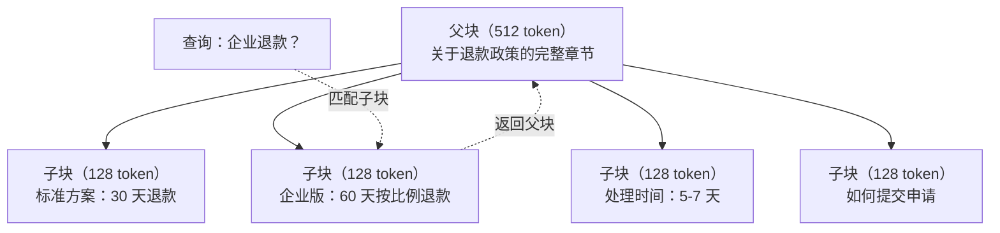
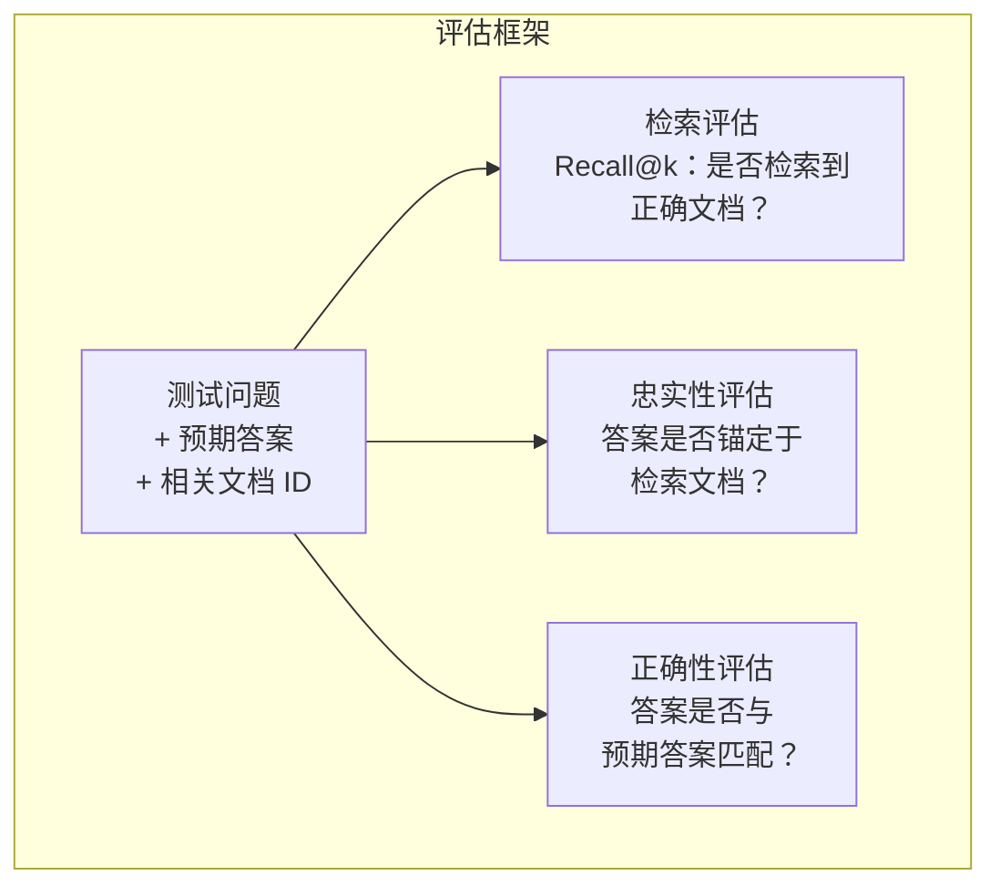

# 高级 RAG（分块、重排序、混合搜索）

> 基础 RAG 检索最相似的 top-k 块，简单问题够用，复杂推理时就会崩溃。高级 RAG 是"在 10 个文档上能跑的 demo"和"在 1000 万个文档上也能用的系统"之间的差距。

**类型：** 构建
**语言：** Python
**前置课程：** 第 11 阶段，第 06 课（RAG）
**时长：** ~90 分钟
**相关内容：** 第 5 阶段 · 第 23 课（RAG 分块策略）涵盖全部六种分块算法——递归、语义、句子、父子文档、延迟分块、上下文检索——及各自的适用场景（含 Vectara/Anthropic 基准）。本课在此基础上构建混合搜索、重排序和查询转换。

## 学习目标

- 实现能保留文档结构和上下文的高级分块策略（语义、递归、父子）
- 构建将 BM25 关键词匹配与语义向量搜索结合、附带交叉编码器重排序的混合搜索流水线
- 应用查询转换技术（HyDE、多查询、后退提问）改善模糊或复杂问题的检索效果
- 诊断并修复常见 RAG 失败：检索到错误的块、上下文中没有答案、多跳推理断裂

## 问题背景

你在第 06 课构建了一条基础 RAG 流水线，在小语料库上的直接问题表现良好。现在试试这些：

**模糊查询**："上个季度的营收是多少？"语义搜索返回关于营收策略、营收预测和 CFO 对营收增长看法的块——所有这些在语义上都与"营收"相似，却没有一块包含实际数字。正确的块写着"2025 年 Q3 营收 $4720 万"，但用的是"收益"而非"营收"。嵌入模型认为"营收策略"比"Q3 收益为 $4720 万"更接近查询。

**多跳问题**："哪个团队的客户满意度分数提升幅度最大？"这需要找到每个团队的满意度分数、相互比较、找出最大值。没有任何单块包含答案，信息分散在各个团队报告中。

**大语料库问题**：你有 200 万个块，正确答案在第 1,847,293 块。你的 top-5 检索拉出了第 14、89,201、1,200,000、44 和 901,333 块——在嵌入空间中很近，但没有一块包含答案。在这种规模下，近似最近邻搜索引入了足够的误差，把相关结果推出了 top-k。

基础 RAG 失败，因为向量相似度不等于相关性。一个块可以在语义上与查询相似，却对回答问题毫无帮助。高级 RAG 用四种技术解决这个问题：混合搜索（加入关键词匹配）、重排序（更仔细地对候选打分）、查询转换（搜索前修复查询）和更好的分块（在合适的粒度检索）。

## 概念讲解

### 混合搜索：语义 + 关键词

语义搜索（向量相似度）擅长理解意义。"How do I cancel my subscription?"能匹配"Steps to terminate your plan"，即使它们没有共同词语。但它会漏掉精确匹配。"Error code E-4021"如果嵌入模型把它当作噪音处理，可能就无法匹配包含"E-4021"的块。

关键词搜索（BM25）恰恰相反，擅长精确匹配。"E-4021"能完美匹配，但如果文档写的是"terminate your plan"，"cancel my subscription"就会返回零结果。

混合搜索两者都跑，再合并结果。

**BM25**（最佳匹配 25）是标准的关键词搜索算法，自 1990 年代以来一直是搜索引擎的骨架。公式：

```
BM25(q, d) = 对查询 q 中每个词项 t 求和：
    IDF(t) * (tf(t,d) * (k1 + 1)) / (tf(t,d) + k1 * (1 - b + b * |d| / avgdl))
```

其中 tf(t,d) 是词项 t 在文档 d 中的词频，IDF(t) 是逆文档频率，|d| 是文档长度，avgdl 是平均文档长度，k1 控制词频饱和（默认 1.2），b 控制长度归一化（默认 0.75）。

通俗理解：BM25 对包含查询词的文档（尤其是稀有词）评分更高，但重复词的边际收益递减。一个词"营收"出现 50 次的文档，不会比出现一次的文档相关 50 倍。

### 倒数排名融合（RRF）

你有两个排名列表：一个来自向量搜索，一个来自 BM25。如何合并它们？倒数排名融合（Reciprocal Rank Fusion）是标准方法。

```
RRF_score(d) = 对每个排名 R 求和：
    1 / (k + rank_R(d))
```

其中 k 是一个常数（通常为 60），防止排名第一的结果占据主导。

在向量搜索中排第 1、BM25 中排第 5 的文档得分：1/(60+1) + 1/(60+5) = 0.0164 + 0.0154 = 0.0318

在向量搜索中排第 3、BM25 中排第 2 的文档得分：1/(60+3) + 1/(60+2) = 0.0159 + 0.0161 = 0.0320

RRF 自然地平衡两个信号。在两个列表中都排名高的文档得到最好的分数；在某一列表排第 1 但在另一列表缺席的文档得到中等分数。它很鲁棒，因为使用排名而非原始分数，所以两个系统之间得分分布的差异无关紧要。

### 重排序

检索（无论向量、关键词还是混合）速度快但不精确。它使用双编码器：查询和每个文档独立嵌入，再比较。嵌入只计算一次并缓存，能扩展到数百万文档。

重排序使用交叉编码器：查询和候选文档一起输入模型，输出一个相关性分数。模型同时看到两段文本，能捕捉它们之间细粒度的交互。交叉编码器能理解"Q3 收益是多少？"与包含"Q3 $4720 万"的块高度相关，即使双编码器漏掉了这个联系。

权衡：交叉编码器比双编码器慢 100-1000 倍，因为它联合处理查询-文档对，无法为百万文档预计算分数。解决方案：检索较大的候选集（混合搜索的前 50 个），再用交叉编码器重排序得到最终前 5 个。


常用重排序模型（2026 年阵容）：
- Cohere Rerank 3.5：托管 API，多语言，混合语料召回提升最佳
- Voyage rerank-2.5：托管 API，托管选项中延迟最低
- Jina-Reranker-v2 Multilingual：开源权重，100+ 语言
- bge-reranker-v2-m3：开源权重，强基线
- cross-encoder/ms-marco-MiniLM-L-6-v2：开源权重，可在 CPU 上运行，适合原型开发
- ColBERTv2 / Jina-ColBERT-v2：延迟交互多向量重排序——打分时复杂度 O(token)，不是 O(文档)

### 查询转换

有时问题不在于检索，而在于查询本身。"那个关于新政策变化的事是什么？"是一个糟糕的搜索查询——没有具体词项，嵌入模糊，任何检索系统都无法从中找到正确文档。

**查询改写**：用 LLM 将用户查询重写为更好的搜索查询：

```
用户："那个关于新政策变化的事是什么？"
改写后："最近的政策变化和更新"
```

**HyDE（假设文档嵌入）**：不用查询本身搜索，而是生成一个假设答案，嵌入它，再搜索相似的真实文档。

```
查询："企业套餐的退款政策是什么？"
假设答案："企业客户有权在购买后 60 天内获得全额退款。
退款按剩余订阅期按比例计算，5-7 个工作日内处理完毕。"
```

嵌入假设答案，搜索与之相似的真实文档。直觉上：假设答案在嵌入空间中比原始问题更接近真实答案——问题和答案有不同的语言结构，通过生成假设答案，可以弥合"问题空间"和"答案空间"之间的差距。

HyDE 在检索前增加一次 LLM 调用，延迟增加 500-2000ms。当直接查询检索质量差时值得一用。

### 父子分块

标准分块面临权衡：小块精确检索，大块提供足够上下文。父子分块消除了这个权衡。

索引小块（128 token）用于检索；检索到小块时，返回其父块（512 token）用于提示。小块精确匹配查询，父块提供足够的上下文让 LLM 生成好的答案。



查询"企业退款？"精确匹配子块 C2，但提示接收完整的父块 P，其中包含关于处理时间和提交流程的周围上下文。

### 元数据过滤

在运行向量搜索之前，按元数据过滤语料库：日期、来源、类别、作者、语言。这减少了搜索空间，防止出现不相关的结果。

"上个月安全政策有什么变化？"应该只搜索过去 30 天内安全类别的文档。没有元数据过滤，就会搜索整个语料库，可能检索到一份碰巧在语义上相似的两年前的安全文档。

生产 RAG 系统为每个块存储元数据：来源文档、创建日期、类别、作者、版本。向量数据库支持在相似度搜索前按元数据预过滤，这对大规模性能至关重要。

### 评估

你构建了一个 RAG 系统，如何知道它是否有效？三个指标：

**检索相关性（Recall@k）**：对于一组有已知相关文档的测试问题，相关文档出现在 top-k 结果中的比例是多少？如果某个问题的答案在第 47 块，第 47 块是否出现在前 5 个结果中？

**忠实性（Faithfulness）**：生成的答案是否锚定于检索到的文档？如果检索到的块说"60 天退款窗口"，而模型说"90 天退款窗口"，这就是忠实性失败——模型在有正确上下文的情况下仍然产生了幻觉。

**答案正确性（Answer correctness）**：生成的答案是否与预期答案匹配？这是端到端指标，结合了检索质量和生成质量。

简单的忠实性检查：取生成答案中的每个声明，验证它（在实质上）出现在检索到的块中。如果答案包含任何检索块中都没有的事实，很可能是幻觉。



## 构建实现

### 第一步：BM25 实现

```python
import math
from collections import Counter

class BM25:
    def __init__(self, k1=1.2, b=0.75):
        self.k1 = k1
        self.b = b
        self.docs = []
        self.doc_lengths = []
        self.avg_dl = 0
        self.doc_freqs = {}
        self.n_docs = 0

    def index(self, documents):
        self.docs = documents
        self.n_docs = len(documents)
        self.doc_lengths = []
        self.doc_freqs = {}

        for doc in documents:
            words = doc.lower().split()
            self.doc_lengths.append(len(words))
            unique_words = set(words)
            for word in unique_words:
                self.doc_freqs[word] = self.doc_freqs.get(word, 0) + 1

        self.avg_dl = sum(self.doc_lengths) / self.n_docs if self.n_docs else 1

    def score(self, query, doc_idx):
        query_words = query.lower().split()
        doc_words = self.docs[doc_idx].lower().split()
        doc_len = self.doc_lengths[doc_idx]
        word_counts = Counter(doc_words)
        score = 0.0

        for term in query_words:
            if term not in word_counts:
                continue
            tf = word_counts[term]
            df = self.doc_freqs.get(term, 0)
            idf = math.log((self.n_docs - df + 0.5) / (df + 0.5) + 1)
            numerator = tf * (self.k1 + 1)
            denominator = tf + self.k1 * (1 - self.b + self.b * doc_len / self.avg_dl)
            score += idf * numerator / denominator

        return score

    def search(self, query, top_k=10):
        scores = [(i, self.score(query, i)) for i in range(self.n_docs)]
        scores.sort(key=lambda x: x[1], reverse=True)
        return scores[:top_k]
```

### 第二步：倒数排名融合

```python
def reciprocal_rank_fusion(ranked_lists, k=60):
    scores = {}
    for ranked_list in ranked_lists:
        for rank, (doc_id, _) in enumerate(ranked_list):
            if doc_id not in scores:
                scores[doc_id] = 0.0
            scores[doc_id] += 1.0 / (k + rank + 1)
    fused = sorted(scores.items(), key=lambda x: x[1], reverse=True)
    return fused
```

### 第三步：混合搜索流水线

```python
def hybrid_search(query, chunks, vector_embeddings, vocab, idf, bm25_index, top_k=5, fusion_k=60):
    query_emb = tfidf_embed(query, vocab, idf)
    vector_results = search(query_emb, vector_embeddings, top_k=top_k * 3)
    bm25_results = bm25_index.search(query, top_k=top_k * 3)
    fused = reciprocal_rank_fusion([vector_results, bm25_results], k=fusion_k)
    return fused[:top_k]
```

### 第四步：简单重排序器

生产中你会使用交叉编码器模型。这里我们构建一个重排序器，使用词重叠、词项重要性和短语匹配来对查询-文档相关性打分。

```python
def rerank(query, candidates, chunks):
    query_words = set(query.lower().split())
    stop_words = {"the", "a", "an", "is", "are", "was", "were", "what", "how",
                  "why", "when", "where", "do", "does", "for", "of", "in", "to",
                  "and", "or", "on", "at", "by", "it", "its", "this", "that",
                  "with", "from", "be", "has", "have", "had", "not", "but"}
    query_terms = query_words - stop_words

    scored = []
    for doc_id, initial_score in candidates:
        chunk = chunks[doc_id].lower()
        chunk_words = set(chunk.split())

        term_overlap = len(query_terms & chunk_words)

        query_bigrams = set()
        q_list = [w for w in query.lower().split() if w not in stop_words]
        for i in range(len(q_list) - 1):
            query_bigrams.add(q_list[i] + " " + q_list[i + 1])
        bigram_matches = sum(1 for bg in query_bigrams if bg in chunk)

        position_boost = 0
        for term in query_terms:
            pos = chunk.find(term)
            if pos != -1 and pos < len(chunk) // 3:
                position_boost += 0.5

        rerank_score = (
            term_overlap * 1.0
            + bigram_matches * 2.0
            + position_boost
            + initial_score * 5.0
        )
        scored.append((doc_id, rerank_score))

    scored.sort(key=lambda x: x[1], reverse=True)
    return scored
```

### 第五步：HyDE（假设文档嵌入）

```python
def hyde_generate_hypothesis(query):
    templates = {
        "what": "The answer to '{query}' is as follows: Based on our documentation, {topic} involves specific policies and procedures that define how the process works.",
        "how": "To address '{query}': The process involves several steps. First, you need to initiate the request. Then, the system processes it according to the defined rules.",
        "default": "Regarding '{query}': Our records indicate specific details and policies related to this topic that provide a comprehensive answer."
    }
    query_lower = query.lower()
    if query_lower.startswith("what"):
        template = templates["what"]
    elif query_lower.startswith("how"):
        template = templates["how"]
    else:
        template = templates["default"]

    topic_words = [w for w in query.lower().split()
                   if w not in {"what", "is", "the", "how", "do", "does", "a", "an",
                                "for", "of", "to", "in", "on", "at", "by", "and", "or"}]
    topic = " ".join(topic_words) if topic_words else "this topic"

    return template.format(query=query, topic=topic)


def hyde_search(query, chunks, vector_embeddings, vocab, idf, top_k=5):
    hypothesis = hyde_generate_hypothesis(query)
    hypothesis_emb = tfidf_embed(hypothesis, vocab, idf)
    results = search(hypothesis_emb, vector_embeddings, top_k)
    return results, hypothesis
```

### 第六步：父子分块

```python
def create_parent_child_chunks(text, parent_size=200, child_size=50):
    words = text.split()
    parents = []
    children = []
    child_to_parent = {}

    parent_idx = 0
    start = 0
    while start < len(words):
        parent_end = min(start + parent_size, len(words))
        parent_text = " ".join(words[start:parent_end])
        parents.append(parent_text)

        child_start = start
        while child_start < parent_end:
            child_end = min(child_start + child_size, parent_end)
            child_text = " ".join(words[child_start:child_end])
            child_idx = len(children)
            children.append(child_text)
            child_to_parent[child_idx] = parent_idx
            child_start += child_size

        parent_idx += 1
        start += parent_size

    return parents, children, child_to_parent
```

### 第七步：忠实性评估

```python
def evaluate_faithfulness(answer, retrieved_chunks):
    answer_sentences = [s.strip() for s in answer.split(".") if len(s.strip()) > 10]
    if not answer_sentences:
        return 1.0, []

    grounded = 0
    ungrounded = []
    context = " ".join(retrieved_chunks).lower()

    for sentence in answer_sentences:
        words = set(sentence.lower().split())
        stop_words = {"the", "a", "an", "is", "are", "was", "were", "and", "or",
                      "to", "of", "in", "for", "on", "at", "by", "it", "this", "that"}
        content_words = words - stop_words
        if not content_words:
            grounded += 1
            continue

        matched = sum(1 for w in content_words if w in context)
        ratio = matched / len(content_words) if content_words else 0

        if ratio >= 0.5:
            grounded += 1
        else:
            ungrounded.append(sentence)

    score = grounded / len(answer_sentences) if answer_sentences else 1.0
    return score, ungrounded


def evaluate_retrieval_recall(queries_with_relevant, retrieval_fn, k=5):
    total_recall = 0.0
    results = []

    for query, relevant_indices in queries_with_relevant:
        retrieved = retrieval_fn(query, k)
        retrieved_indices = set(idx for idx, _ in retrieved)
        relevant_set = set(relevant_indices)
        hits = len(retrieved_indices & relevant_set)
        recall = hits / len(relevant_set) if relevant_set else 1.0
        total_recall += recall
        results.append({
            "query": query,
            "recall": recall,
            "hits": hits,
            "total_relevant": len(relevant_set)
        })

    avg_recall = total_recall / len(queries_with_relevant) if queries_with_relevant else 0
    return avg_recall, results
```

## 使用方法

使用真实的交叉编码器进行重排序：

```python
from sentence_transformers import CrossEncoder

reranker = CrossEncoder("cross-encoder/ms-marco-MiniLM-L-6-v2")

def rerank_with_cross_encoder(query, candidates, chunks, top_k=5):
    pairs = [(query, chunks[doc_id]) for doc_id, _ in candidates]
    scores = reranker.predict(pairs)
    scored = list(zip([doc_id for doc_id, _ in candidates], scores))
    scored.sort(key=lambda x: x[1], reverse=True)
    return scored[:top_k]
```

使用 Cohere 托管重排序器：

```python
import cohere

co = cohere.Client()

def rerank_with_cohere(query, candidates, chunks, top_k=5):
    docs = [chunks[doc_id] for doc_id, _ in candidates]
    response = co.rerank(
        model="rerank-english-v3.0",
        query=query,
        documents=docs,
        top_n=top_k
    )
    return [(candidates[r.index][0], r.relevance_score) for r in response.results]
```

使用真实 LLM 进行 HyDE：

```python
import anthropic

client = anthropic.Anthropic()

def hyde_with_llm(query):
    response = client.messages.create(
        model="claude-sonnet-4-20250514",
        max_tokens=256,
        messages=[{
            "role": "user",
            "content": f"Write a short paragraph that would be a good answer to this question. Do not say you don't know. Just write what the answer would look like.\n\nQuestion: {query}"
        }]
    )
    return response.content[0].text
```

使用 Weaviate 进行生产混合搜索：

```python
import weaviate

client = weaviate.connect_to_local()

collection = client.collections.get("Documents")
response = collection.query.hybrid(
    query="enterprise refund policy",
    alpha=0.5,
    limit=10
)
```

`alpha` 参数控制平衡：0.0 = 纯关键词（BM25），1.0 = 纯向量，0.5 = 等权。大多数生产系统使用 0.3 到 0.7 之间的 alpha。

## 交付物

本课产出：
- `outputs/prompt-advanced-rag-debugger.md` — 用于诊断和修复 RAG 质量问题的提示
- `outputs/skill-advanced-rag.md` — 构建带混合搜索和重排序的生产级 RAG 的技能

## 练习

1. 在样本文档上比较 BM25、向量搜索和混合搜索。对于 5 个测试查询，记录哪种方法在第 1 位返回了最相关的块。混合搜索应该在至少 3/5 的查询上获胜。

2. 实现元数据过滤。为每个文档添加"类别"字段（安全、计费、API、产品）。在运行向量搜索之前，将块过滤到相关类别。用"使用什么加密方式？"测试，验证它只搜索安全类别的块。

3. 用第 06 课的简单生成函数构建完整的 HyDE 流水线。比较所有 5 个测试查询上直接查询搜索和 HyDE 搜索的检索质量（前 3 的相关性）。HyDE 应该改善模糊查询的结果。

4. 在样本文档上实现父子分块策略（child_size=30，parent_size=100）。用子块搜索，但在提示中返回父块。将生成的答案与 chunk_size=50 的标准分块进行比较。

5. 创建评估数据集：10 个有已知答案块的问题。测量以下方案的 Recall@3、Recall@5 和 Recall@10：(a) 仅向量搜索，(b) 仅 BM25，(c) 混合搜索，(d) 混合+重排序。绘制结果，找出重排序最有帮助的地方。

## 关键术语

| 术语 | 人们怎么说 | 实际含义 |
|------|----------------|----------------------|
| BM25 | "关键词搜索" | 概率排名算法，根据词频、逆文档频率和文档长度归一化对文档打分 |
| 混合搜索（Hybrid search） | "两全其美" | 并行运行语义（向量）和关键词（BM25）搜索，再用排名融合合并结果 |
| 倒数排名融合（Reciprocal Rank Fusion） | "合并排名列表" | 通过对每个文档在所有列表中的 1/(k+排名) 求和来合并多个排名列表 |
| 重排序（Reranking） | "第二次打分" | 使用更昂贵的交叉编码器模型对初次检索的候选集重新打分 |
| 交叉编码器（Cross-encoder） | "联合查询-文档模型" | 将查询和文档作为单一输入，输出相关性分数的模型；比双编码器更准确，但太慢无法搜索全部语料库 |
| 双编码器（Bi-encoder） | "独立嵌入模型" | 独立嵌入查询和文档的模型；因为嵌入可预计算所以速度快，但准确率低于交叉编码器 |
| HyDE | "用假答案搜索" | 为查询生成假设答案，嵌入它，再搜索与之相似的真实文档 |
| 父子分块（Parent-child chunking） | "小搜索，大上下文" | 用小块进行精确检索，但返回更大的父块以提供足够的上下文 |
| 元数据过滤（Metadata filtering） | "先缩小再搜索" | 在运行向量搜索之前按属性（日期、来源、类别）过滤文档，以减小搜索空间 |
| 忠实性（Faithfulness） | "是否保持锚定" | 生成的答案是否由检索文档支持，而非来自模型训练数据的幻觉 |

## 延伸阅读

- Robertson & Zaragoza，"The Probabilistic Relevance Framework: BM25 and Beyond"（2009）— BM25 的权威参考，解释公式背后的概率基础
- Cormack 等，"Reciprocal Rank Fusion Outperforms Condorcet and Individual Rank Learning Methods"（2009）— 原始 RRF 论文，证明它优于更复杂的融合方法
- Gao 等，"Precise Zero-Shot Dense Retrieval without Relevance Labels"（2022）— HyDE 论文，证明假设文档嵌入在无需任何训练数据的情况下改善检索
- Nogueira & Cho，"Passage Re-ranking with BERT"（2019）— 证明在 BM25 之上使用交叉编码器重排序能显著提升检索质量
- [Khattab 等，"DSPy: Compiling Declarative Language Model Calls into Self-Improving Pipelines"（2023）](https://arxiv.org/abs/2310.03714) — 将提示构建和权重选择视为检索流水线的优化问题；"编程 LLM"而非"提示 LLM"
- [Edge 等，"From Local to Global: A Graph RAG Approach to Query-Focused Summarization"（Microsoft Research 2024）](https://arxiv.org/abs/2404.16130) — GraphRAG 论文：实体关系抽取 + Leiden 社区检测用于以查询为中心的摘要；全局与局部检索的区别
- [Asai 等，"Self-RAG: Learning to Retrieve, Generate, and Critique through Self-Reflection"（ICLR 2024）](https://arxiv.org/abs/2310.11511) — 带反思 token 的自评估 RAG；超越静态先检索后生成的智能体前沿
- [LangChain 查询构建博客](https://blog.langchain.dev/query-construction/) — 如何将自然语言查询转换为结构化数据库查询（Text-to-SQL、Cypher）作为预检索步骤
