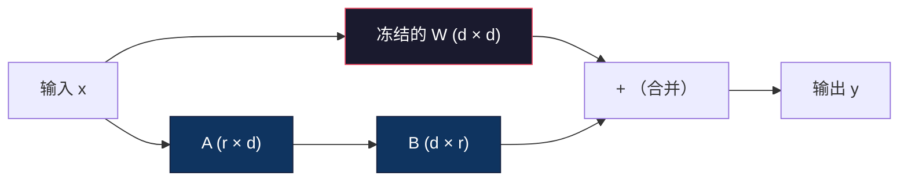
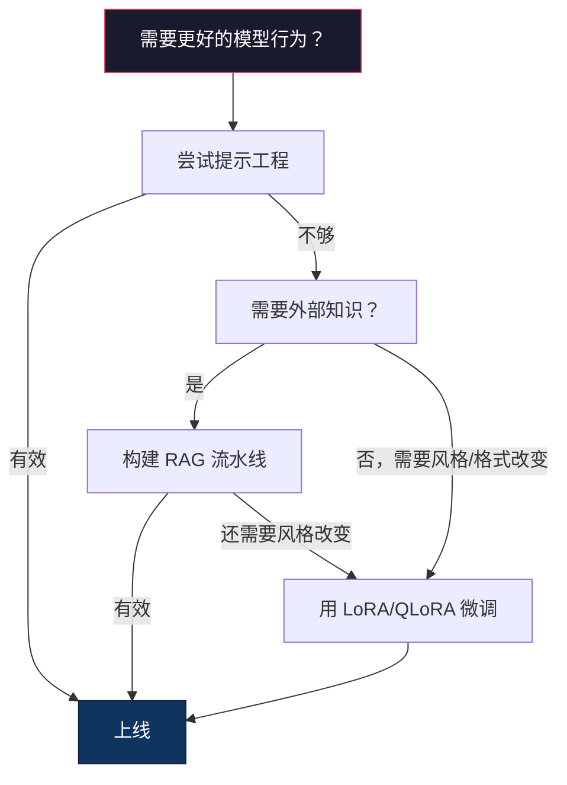

# 使用 LoRA 和 QLoRA 微调

> 全量微调一个 7B 模型需要 56GB 显存，你没有这个条件，大多数公司也没有。LoRA 允许你在 6GB 显存内微调同一个模型，只需训练不到 1% 的参数。这不是折中方案——它在大多数任务上能媲美全量微调的质量。整个开源微调生态都建立在这一个技巧之上。

**类型：** 构建
**语言：** Python
**前置课程：** 第 10 阶段，第 06 课（指令微调 / SFT）
**时长：** ~75 分钟
**相关内容：** 第 10 阶段从零实现 SFT/DPO 循环。本课将它们接入 2026 年的 PEFT 工具链（PEFT、TRL、Unsloth、Axolotl、LLaMA-Factory）。

## 学习目标

- 通过向预训练模型的注意力层注入低秩适配器矩阵（A 和 B）来实现 LoRA
- 计算 LoRA 与全量微调的参数节省：在模型维度 d_model 下，秩为 r 的 LoRA 只训练 2*r*d 个参数，而非 d²
- 使用 QLoRA（4 位量化基础模型 + LoRA 适配器）在消费级 GPU 显存内完成微调
- 将 LoRA 权重合并回基础模型以供部署，并比较有无适配器时的推理速度

## 问题背景

你有一个基础模型——Llama 3 8B。你想让它用公司的口吻回答客户支持工单。SFT 是答案，但 SFT 有成本问题。

全量微调会更新模型中的每个参数。Llama 3 8B 有 80 亿个参数，fp16 下每个参数占 2 字节，光加载权重就需要 16GB。训练时还需要梯度（16GB）、Adam 的优化器状态（动量+方差 32GB）以及激活值。总计：单个 8B 模型大约需要 56GB 显存。

A100 80GB 勉强能装下。两张 A100 在云服务商上每小时约 $3-4。在 5 万个样本上训练 3 个 epoch 需要 6-10 小时，每次实验约 $30-40。跑 10 次实验调好超参数，还没部署任何东西就花了 $400。

扩展到 Llama 3 70B，数字就更荒唐了——仅权重就需要 140GB，你需要一个集群，每次实验 $100+。

还有一个更深层的问题：全量微调会修改模型中的每一个权重。在客服数据上微调后，可能会损害模型的通用能力，这叫灾难性遗忘（catastrophic forgetting）——模型在你的任务上变好，在其他所有事情上变差。

你需要一种方法：训练更少的参数、使用更少的内存，同时不破坏模型已有的知识。

## 概念讲解

### LoRA：低秩适配

微软的 Edward Hu 等人于 2021 年 6 月发表了 LoRA。论文的核心洞察：微调过程中的权重更新具有低内在秩。你不需要更新 4096×4096 权重矩阵中全部 1677 万个参数，更新中的有用信息可以用秩 16 或 32 的矩阵来捕捉。

数学推导如下。标准线性层计算：

```
y = Wx
```

其中 W 是一个 d_out × d_in 矩阵。对于 4096×4096 的注意力投影层，这意味着 16,777,216 个参数。

LoRA 冻结 W，并添加一个低秩分解：

```
y = Wx + BAx
```

其中 B 是 (d_out × r)，A 是 (r × d_in)。秩 r 远小于 d，通常为 8、16 或 32。

对 4096×4096 层使用 r=16：
- 原始参数：4096 × 4096 = 16,777,216
- LoRA 参数：(4096 × 16) + (16 × 4096) = 65,536 + 65,536 = 131,072
- 比例：131,072 / 16,777,216 = 0.78%

你训练了 0.78% 的参数，却获得了 95-100% 的质量。



A 用缩放后的随机值初始化，B 初始化为零。这意味着 LoRA 的贡献从零开始——模型从原始行为开始训练，逐渐学习适配。

### 缩放因子：Alpha

LoRA 引入了缩放因子 alpha 来控制低秩更新对输出的影响程度：

```
y = Wx + (alpha / r) * BAx
```

当 alpha = r 时，缩放为 1×；当 alpha = 2r（常见默认值）时，缩放为 2×。这个超参数独立于基础学习率，控制 LoRA 路径的学习速率。

实用指导：
- alpha = 2 × rank 是社区常规（原论文在大多数实验中使用 alpha = rank）
- alpha = rank 给出 1× 缩放，保守但稳定
- 更高的 alpha 意味着每步更新更大，可能加速收敛或导致不稳定

### 在哪里应用 LoRA

Transformer 有许多线性层，不需要全部添加 LoRA。原论文测试了不同的组合：

| 目标层 | 可训练参数（7B） | 质量 |
|--------------|----------------------|---------|
| 仅 q_proj | 4.7M | 好 |
| q_proj + v_proj | 9.4M | 更好 |
| q_proj + k_proj + v_proj + o_proj | 18.9M | 注意力最优 |
| 所有线性层（注意力 + MLP） | 37.7M | 边际提升，参数翻倍 |

大多数任务的最优选择：q_proj + v_proj。这针对自注意力中的查询和值投影，控制模型关注什么以及提取什么信息。加入 MLP 层有助于代码生成等复杂任务，但对更简单的任务参数数量翻倍，边际收益递减。

### 秩的选择

秩 r 控制适配的表达能力：

| 秩 | 每层可训练参数 | 最适合 |
|------|---------------------------|----------|
| 4 | 32,768 | 简单分类、情感分析 |
| 8 | 65,536 | 单领域问答、摘要 |
| 16 | 131,072 | 多领域任务、指令跟随 |
| 32 | 262,144 | 复杂推理、代码生成 |
| 64 | 524,288 | 大多数任务边际收益递减 |
| 128 | 1,048,576 | 极少有理由使用 |

Hu 等人证明，对于简单任务，r=4 已经能捕捉大部分适配效果。r=8 和 r=16 是实践中最常见的选择。超过 r=64 很少能改善质量，还会逐渐失去 LoRA 的内存优势。

### QLoRA：4 位量化 + LoRA

华盛顿大学的 Tim Dettmers 等人于 2023 年 5 月发表了 QLoRA。核心思路：将冻结的基础模型量化到 4 位精度，再在顶部附加 fp16 的 LoRA 适配器。

这显著改变了内存方程：

| 方法 | 权重内存（7B） | 训练内存（7B） | 所需 GPU |
|--------|-------------------|---------------------|-------------|
| 全量微调（fp16） | 14GB | ~56GB | 1× A100 80GB |
| LoRA（fp16 基础） | 14GB | ~18GB | 1× A100 40GB |
| QLoRA（4 位基础） | 3.5GB | ~6GB | 1× RTX 3090 24GB |

QLoRA 做出三项技术贡献：

**NF4（Normal Float 4 位）**：专为神经网络权重设计的新数据类型。神经网络权重大致遵循正态分布。NF4 将其 16 个量化级别放置在标准正态分布的分位数处，对正态分布数据而言在信息论上是最优的，比均匀 4 位量化（INT4）或标准 Float4 损失更少信息。

**双重量化（Double quantization）**：量化常数本身也占内存。每 64 个权重组成的块需要一个 fp32 的缩放因子（4 字节），7B 模型额外占用约 0.4GB。双重量化将这些常数量化为 fp8，开销降至 0.1GB——虽小但积少成多。

**分页优化器（Paged optimizers）**：在训练过程中，优化器状态（Adam 的动量和方差）在长序列时可能超出 GPU 内存。分页优化器利用 NVIDIA 的统一内存，在 GPU 内存耗尽时自动将优化器状态分页到 CPU 内存，需要时再分页回来，以一定的吞吐量损失防止 OOM 崩溃。

### 质量问题

减少参数或量化基础模型会损害质量吗？多篇论文的结果：

| 方法 | MMLU（5-shot） | MT-Bench | HumanEval |
|--------|--------------|----------|-----------|
| 全量微调（Llama 2 7B） | 48.3 | 6.72 | 14.6 |
| LoRA r=16 | 47.9 | 6.68 | 14.0 |
| QLoRA r=16（NF4） | 47.5 | 6.61 | 13.4 |
| QLoRA r=64（NF4） | 48.1 | 6.70 | 14.2 |

LoRA r=16 在大多数基准上与全量微调相差不超过 1%。QLoRA r=16 再损失几分之一。QLoRA r=64 基本上与全量微调持平，同时使用的内存减少 90%。

### 真实成本

在 5 万个样本上微调 Llama 3 8B（3 个 epoch）：

| 方法 | GPU | 时间 | 成本 |
|--------|-----|------|------|
| 全量微调 | 2× A100 80GB | 8 小时 | ~$32 |
| LoRA r=16 | 1× A100 40GB | 4 小时 | ~$8 |
| QLoRA r=16 | 1× RTX 4090 24GB | 6 小时 | ~$5 |
| QLoRA r=16（Unsloth） | 1× RTX 4090 24GB | 2.5 小时 | ~$2 |
| QLoRA r=16 | 1× T4 16GB | 12 小时 | ~$4 |

在单张消费级 GPU 上用 QLoRA 的成本不到一顿午饭。这就是为什么开源权重微调社区在 2023 年爆发，也是为什么 2026 年以下所有训练框架都默认支持 QLoRA。

### 2026 年的 PEFT 技术栈

| 框架 | 是什么 | 什么时候用 |
|-----------|-----------|-----------|
| **Hugging Face PEFT** | 正统的 LoRA/QLoRA/DoRA/IA3 库 | 需要完全控制、训练循环已在 `transformers.Trainer` 上 |
| **TRL** | HF 的强化反馈训练器（SFT、DPO、GRPO、PPO、ORPO） | SFT 后需要 DPO/GRPO；基于 PEFT 构建 |
| **Unsloth** | Triton 内核重写的前向/反向传播 | 需要 2-5× 速度提升 + 减半显存且不损失精度；支持 Llama/Mistral/Qwen 系列 |
| **Axolotl** | PEFT + TRL + DeepSpeed + Unsloth 的 YAML 配置封装 | 需要可复现、版本控制的训练运行 |
| **LLaMA-Factory** | PEFT + TRL 的 GUI/CLI/API | 需要零代码微调；支持 100+ 模型系列 |
| **torchtune** | 原生 PyTorch 配方，无 `transformers` 依赖 | 需要最少依赖，组织已标准化 PyTorch |

经验法则：研究用途或一次性实验 → PEFT。可重复的生产流水线 → 启用 Unsloth 内核的 Axolotl。一次性原型 → LLaMA-Factory。

### 合并适配器

训练后，你有两样东西：冻结的基础模型和一个小的 LoRA 适配器（通常 10-100MB）。你可以：

1. **保持分离**：加载基础模型，再加载适配器。为不同任务切换适配器。这是从一个基础模型提供多个微调变体的方式。

2. **永久合并**：计算 W' = W + (alpha/r) * BA 并将结果保存为新的完整模型。合并后的模型与原模型大小相同，没有推理开销，没有适配器需要管理。

服务多个任务（客服适配器、代码适配器、翻译适配器）时，保持分离。部署单个专用模型时，合并。

合并多个适配器的高级技术：

- **TIES-Merging**（Yadav 等，2023）：修剪小量级参数，解决符号冲突，再合并，减少适配器间的干扰。
- **DARE**（Yu 等，2023）：合并前随机丢弃适配器参数并重新缩放其余参数，出奇地有效地组合能力。
- **任务算术（Task arithmetic）**：直接加减适配器权重。添加"代码"适配器和"数学"适配器通常能产生两者都擅长的模型。

### 什么时候不该微调

微调是第三选项，不是第一选项。

**第一：提示工程。** 写更好的系统提示，添加少样本示例，使用思维链。这不花任何成本，几分钟内完成。如果提示工程能达到 80% 的效果，你可能不需要微调。

**第二：RAG。** 如果模型需要了解你的特定数据（文档、知识库、产品目录），检索比烘焙到权重中更便宜、更易维护。见第 06 课。

**第三：微调。** 当需要模型采用无法通过提示实现的特定风格、格式或推理模式时使用。当需要一致的结构化输出时。当需要将大模型蒸馏成小模型时。当延迟至关重要且无法承受少样本提示的额外 token 时。



## 构建实现

我们用纯 PyTorch 从零实现 LoRA，不用任何库，没有任何魔法。你将构建 LoRA 层，将其注入模型，训练它，再将权重合并回去。

### 第一步：LoRA 层

```python
import torch
import torch.nn as nn
import math

class LoRALayer(nn.Module):
    def __init__(self, in_features, out_features, rank=8, alpha=16):
        super().__init__()
        self.rank = rank
        self.alpha = alpha
        self.scaling = alpha / rank

        self.A = nn.Parameter(torch.randn(in_features, rank) * (1 / math.sqrt(rank)))
        self.B = nn.Parameter(torch.zeros(rank, out_features))

    def forward(self, x):
        return (x @ self.A @ self.B) * self.scaling
```

A 用缩放后的随机值初始化，B 初始化为零。BA 的乘积从零开始——模型从原始行为开始训练。

### 第二步：带 LoRA 的线性层包装

```python
class LinearWithLoRA(nn.Module):
    def __init__(self, linear, rank=8, alpha=16):
        super().__init__()
        self.linear = linear
        self.lora = LoRALayer(
            linear.in_features, linear.out_features, rank, alpha
        )

        for param in self.linear.parameters():
            param.requires_grad = False

    def forward(self, x):
        return self.linear(x) + self.lora(x)
```

原始线性层被冻结，只有 LoRA 参数（A 和 B）是可训练的。

### 第三步：向模型注入 LoRA

```python
def inject_lora(model, target_modules, rank=8, alpha=16):
    for param in model.parameters():
        param.requires_grad = False

    lora_layers = {}
    for name, module in model.named_modules():
        if isinstance(module, nn.Linear):
            if any(t in name for t in target_modules):
                parent_name = ".".join(name.split(".")[:-1])
                child_name = name.split(".")[-1]
                parent = dict(model.named_modules())[parent_name]
                lora_linear = LinearWithLoRA(module, rank, alpha)
                setattr(parent, child_name, lora_linear)
                lora_layers[name] = lora_linear
    return lora_layers
```

首先冻结模型中的每个参数，然后遍历模型树，找到与目标名称匹配的线性层，将其替换为 LoRA 包装版本。LoRA 的 A 和 B 矩阵是整个模型中唯一可训练的参数。

### 第四步：计算参数数量

```python
def count_parameters(model):
    total = sum(p.numel() for p in model.parameters())
    trainable = sum(p.numel() for p in model.parameters() if p.requires_grad)
    frozen = total - trainable
    return {
        "total": total,
        "trainable": trainable,
        "frozen": frozen,
        "trainable_pct": 100 * trainable / total if total > 0 else 0
    }
```

### 第五步：将权重合并回去

```python
def merge_lora_weights(model):
    for name, module in model.named_modules():
        if isinstance(module, LinearWithLoRA):
            with torch.no_grad():
                merged = (
                    module.lora.A @ module.lora.B
                ) * module.lora.scaling
                module.linear.weight.data += merged.T
            parent_name = ".".join(name.split(".")[:-1])
            child_name = name.split(".")[-1]
            if parent_name:
                parent = dict(model.named_modules())[parent_name]
            else:
                parent = model
            setattr(parent, child_name, module.linear)
```

合并后，LoRA 层消失。模型与原始模型大小相同，适配已烘焙进权重，没有推理开销。

### 第六步：模拟 QLoRA 量化

```python
def quantize_to_nf4(tensor, block_size=64):
    blocks = tensor.reshape(-1, block_size)
    scales = blocks.abs().max(dim=1, keepdim=True).values / 7.0
    scales = torch.clamp(scales, min=1e-8)
    quantized = torch.round(blocks / scales).clamp(-8, 7).to(torch.int8)
    return quantized, scales

def dequantize_from_nf4(quantized, scales, original_shape):
    dequantized = quantized.float() * scales
    return dequantized.reshape(original_shape)
```

通过将权重映射到 64 个权重块内的 16 个离散级别来模拟 4 位量化。生产 QLoRA 在 GPU 上使用 bitsandbytes 库实现真正的 NF4。

### 第七步：训练循环

```python
def train_lora(model, data, epochs=5, lr=1e-3, batch_size=4):
    optimizer = torch.optim.AdamW(
        [p for p in model.parameters() if p.requires_grad], lr=lr
    )
    criterion = nn.MSELoss()

    losses = []
    for epoch in range(epochs):
        epoch_loss = 0.0
        n_batches = 0
        indices = torch.randperm(len(data["inputs"]))

        for i in range(0, len(indices), batch_size):
            batch_idx = indices[i:i + batch_size]
            x = data["inputs"][batch_idx]
            y = data["targets"][batch_idx]

            output = model(x)
            loss = criterion(output, y)

            optimizer.zero_grad()
            loss.backward()
            optimizer.step()

            epoch_loss += loss.item()
            n_batches += 1

        avg_loss = epoch_loss / n_batches
        losses.append(avg_loss)

    return losses
```

### 第八步：完整演示

```python
def demo():
    torch.manual_seed(42)
    d_model = 256
    n_classes = 10

    model = nn.Sequential(
        nn.Linear(d_model, 512),
        nn.ReLU(),
        nn.Linear(512, 512),
        nn.ReLU(),
        nn.Linear(512, n_classes),
    )

    n_samples = 500
    x = torch.randn(n_samples, d_model)
    y = torch.randint(0, n_classes, (n_samples,))
    y_onehot = torch.zeros(n_samples, n_classes).scatter_(1, y.unsqueeze(1), 1.0)

    data = {"inputs": x, "targets": y_onehot}

    params_before = count_parameters(model)

    lora_layers = inject_lora(
        model, target_modules=["0", "2"], rank=8, alpha=16
    )

    params_after = count_parameters(model)

    losses = train_lora(model, data, epochs=20, lr=1e-3)

    merge_lora_weights(model)
    params_merged = count_parameters(model)

    return {
        "params_before": params_before,
        "params_after": params_after,
        "params_merged": params_merged,
        "losses": losses,
    }
```

演示创建一个小模型，将 LoRA 注入两层，训练它，再将权重合并回去。LoRA 训练期间参数数量从全部可训练降至约 1% 可训练，合并后恢复到原始架构。

## 使用方法

使用 Hugging Face 生态，在真实模型上进行 LoRA 只需约 20 行代码：

```python
from transformers import AutoModelForCausalLM, AutoTokenizer
from peft import LoraConfig, get_peft_model, TaskType

model = AutoModelForCausalLM.from_pretrained("meta-llama/Llama-3.1-8B")
tokenizer = AutoTokenizer.from_pretrained("meta-llama/Llama-3.1-8B")

lora_config = LoraConfig(
    task_type=TaskType.CAUSAL_LM,
    r=16,
    lora_alpha=32,
    lora_dropout=0.05,
    target_modules=["q_proj", "v_proj"],
)

model = get_peft_model(model, lora_config)
model.print_trainable_parameters()
```

对于 QLoRA，添加 bitsandbytes 量化：

```python
from transformers import BitsAndBytesConfig

bnb_config = BitsAndBytesConfig(
    load_in_4bit=True,
    bnb_4bit_quant_type="nf4",
    bnb_4bit_compute_dtype=torch.bfloat16,
    bnb_4bit_use_double_quant=True,
)

model = AutoModelForCausalLM.from_pretrained(
    "meta-llama/Llama-3.1-8B",
    quantization_config=bnb_config,
    device_map="auto",
)

model = get_peft_model(model, lora_config)
```

就这些。相同的训练循环，相同的数据流水线。基础模型现在以 4 位存储，LoRA 适配器以 fp16 训练，整体只需 6GB 显存。

使用 Hugging Face Trainer 进行训练：

```python
from transformers import TrainingArguments, Trainer
from datasets import load_dataset

dataset = load_dataset("tatsu-lab/alpaca", split="train[:5000]")

training_args = TrainingArguments(
    output_dir="./lora-llama",
    num_train_epochs=3,
    per_device_train_batch_size=4,
    gradient_accumulation_steps=4,
    learning_rate=2e-4,
    fp16=True,
    logging_steps=10,
    save_strategy="epoch",
    optim="paged_adamw_8bit",
)

trainer = Trainer(
    model=model,
    args=training_args,
    train_dataset=dataset,
)

trainer.train()

model.save_pretrained("./lora-adapter")
```

保存的适配器只有 10-100MB，基础模型保持不变。你可以在 Hugging Face Hub 上分享适配器，无需重新分发完整模型。

## 交付物

本课产出：
- `outputs/prompt-lora-advisor.md` — 帮助你为特定任务决定 LoRA 秩、目标模块和超参数的提示
- `outputs/skill-fine-tuning-guide.md` — 教会智能体何时以及如何微调的决策树技能

## 练习

1. **秩消融研究。** 用秩 2、4、8、16、32、64 运行演示，绘制最终损失与秩的关系图，找出双倍秩不再使损失减半的边际收益递减点。对于 256 维特征的简单分类任务，这应该在 r=8-16 左右。

2. **目标模块比较。** 修改 inject_lora 分别只针对层"0"、只针对层"2"、只针对层"4"以及同时针对三层。各训练 20 个 epoch，比较收敛速度和最终损失。这与真实决策（针对 q_proj vs v_proj vs 所有线性层）相对应。

3. **量化误差分析。** 取训练好的模型权重矩阵，在 quantize_to_nf4 / dequantize_from_nf4 前后计算均方误差、最大绝对误差以及原始权重与重建权重之间的相关性。用 block_size 值 32、64、128 和 256 实验。

4. **多适配器服务。** 在数据的不同子集（偶数索引 vs 奇数索引）上训练两个 LoRA 适配器，保存两个适配器。加载一次基础模型，然后切换适配器，验证每个适配器对相同输入产生不同输出。这就是生产系统从一个基础模型服务多个微调模型的方式。

5. **合并 vs 非合并推理。** 在相同的 100 个输入上比较 merge_lora_weights 前后的 LoRA 模型输出，验证输出相同（浮点容差 1e-5 以内）。然后对两者进行推理速度基准测试——合并后应该略快，因为它是单矩阵乘法而非两次。

## 关键术语

| 术语 | 人们怎么说 | 实际含义 |
|------|----------------|----------------------|
| LoRA | "高效微调" | 低秩适配：冻结基础权重，训练两个小矩阵 A 和 B，其乘积近似完整的权重更新 |
| QLoRA | "在笔记本上微调" | 量化 LoRA：将基础模型以 4 位 NF4 加载，在顶部以 fp16 训练 LoRA 适配器，使 7B 微调只需 6GB 显存 |
| 秩（Rank / r） | "模型能学多少" | A 和 B 矩阵的内维度；控制表达能力与参数数量的平衡 |
| Alpha | "LoRA 学习率" | 应用于 LoRA 输出的缩放因子；alpha/r 缩放适配对最终输出的贡献 |
| NF4 | "4 位量化" | Normal Float 4：量化级别位于正态分布分位数处的 4 位数据类型，对神经网络权重最优 |
| 适配器（Adapter） | "小的训练部分" | LoRA 的 A 和 B 矩阵以独立文件保存（10-100MB），可加载到基础模型的任何副本之上 |
| 目标模块（Target modules） | "对哪些层使用 LoRA" | 注入 LoRA 适配器的特定线性层（q_proj、v_proj 等） |
| 合并（Merging） | "烘焙进去" | 计算 W + (alpha/r) * BA 并替换原始权重，消除推理时的适配器开销 |
| 分页优化器（Paged optimizers） | "不要在训练时 OOM" | 当 GPU 内存耗尽时，将优化器状态（Adam 的动量、方差）卸载到 CPU |
| 灾难性遗忘（Catastrophic forgetting） | "微调破坏了其他所有能力" | 更新所有权重导致模型丢失先前学到的能力 |

## 延伸阅读

- Hu 等，"LoRA: Low-Rank Adaptation of Large Language Models"（2021）— 原始论文，在 GPT-3 175B 上测试了最低秩为 4 的低秩分解方法
- Dettmers 等，"QLoRA: Efficient Finetuning of Quantized Language Models"（2023）— 引入 NF4、双重量化和分页优化器，在单张 48GB GPU 上实现 65B 微调
- PEFT 库文档（huggingface.co/docs/peft）— Hugging Face 生态中 LoRA、QLoRA 和其他参数高效方法的标准库
- Yadav 等，"TIES-Merging: Resolving Interference When Merging Models"（2023）— 无质量损失地组合多个 LoRA 适配器的技术
- [Rafailov 等，"Direct Preference Optimization: Your Language Model is Secretly a Reward Model"（NeurIPS 2023）](https://arxiv.org/abs/2305.18290) — DPO 推导；SFT 之后的偏好微调阶段，无需奖励模型
- [TRL 文档](https://huggingface.co/docs/trl/) — `SFTTrainer`、`DPOTrainer`、`KTOTrainer` 的官方参考，以及与 PEFT/bitsandbytes/Unsloth 的集成接口
- [Unsloth 文档](https://docs.unsloth.ai/) — 使微调吞吐量翻倍、内存减半的融合内核；TRL 下层的性能优化层
- [Axolotl 文档](https://axolotl-ai-cloud.github.io/axolotl/) — YAML 配置的多 GPU SFT/DPO/QLoRA 训练器；手写脚本的配置即代码替代方案
