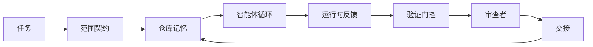

# 智能体工作台工程：为什么有能力的模型仍然失败（Agent Workbench Engineering: Why Capable Models Still Fail）

> 有能力的模型还不够。可靠的智能体需要一个工作台：指令、状态、范围、反馈、验证、审查和交接。去掉这些，即使是前沿模型也会产生不安全的工作。

**类型：** 学习 + 构建  
**语言：** Python（标准库）  
**前置知识：** Phase 14 · 01（智能体循环）、Phase 14 · 26（失败模式）  
**预计时间：** 约 45 分钟

## 学习目标

- 将模型能力与执行可靠性分开。
- 说出决定智能体能否交付的七个工作台表面。
- 在一个小型仓库任务上比较纯提示词运行与工作台引导运行。
- 生成一份失败模式报告，将每个遗漏的表面映射到它导致的症状。

## 问题所在

你将一个前沿模型投入真实仓库，要求它添加输入验证。它打开四个文件，编写了看似合理的代码，宣布成功，然后停止。你运行测试。两个失败了。第三个文件被修改了，而它与验证毫无关系。没有记录智能体假设了什么，它首先尝试了什么，或者还剩什么要做。

这个模型对 Python 没有错。它对工作的理解是错误的。它不知道什么算完成，允许在哪里写入，哪些测试是权威的，或者下一个会话应该如何继续。

这不是模型错误。这是工作台错误。智能体周围的环境缺少将一次性生成转变为可靠、可恢复工程所需的部件。

## 核心概念

工作台是在任务期间包裹模型的操作环境。它有七个表面：

| 表面 | 承载的内容 | 缺失时的失败 |
|------|------------|------------|
| 指令（Instructions） | 启动规则、禁止动作、完成定义 | 智能体猜测什么叫交付 |
| 状态（State） | 当前任务、已触及文件、阻碍因素、下一步动作 | 每个会话从零重新开始 |
| 范围（Scope） | 允许文件、禁止文件、验收标准 | 编辑泄漏到无关代码中 |
| 反馈（Feedback） | 捕获进循环的真实命令输出 | 智能体在 400 错误上宣称成功 |
| 验证（Verification） | 测试、lint、冒烟运行、范围检查 | "看起来不错"进入主分支 |
| 审查（Review） | 用不同角色进行第二轮检查 | 构建者给自己的作业打分 |
| 交接（Handoff） | 更改了什么、为什么、剩什么 | 下一个会话重新发现一切 |

工作台与模型无关。你可以换模型并保留表面。你不能换表面并保留可靠性。



循环在状态文件上闭合，而非在聊天历史上。聊天是易失的。仓库是系统记录。

### 工作台 vs 提示词工程

提示词告诉模型这一轮你想要什么。工作台告诉模型如何跨轮次和跨会话做工作。大多数智能体失败故事是工作台失败穿着提示词工程的外衣。

### 工作台 vs 框架

框架给你一个运行时（LangGraph、AutoGen、Agents SDK）。工作台在那个运行时内给智能体一个工作场所。两者都需要。这个小型主题是关于第二个的。

### 从基本元素推理，而非从供应商分类法推理

目前关于"框架工程"有很多写作。Addy Osmani、OpenAI、Anthropic、LangChain、Martin Fowler、MongoDB、HumanLayer、Augment Code、Thoughtworks、walkinglabs 的精选列表，以及 Medium 和 Hacker News 上的持续报道，都在讨论它。它们对框架是什么、范围是什么、使用哪种词汇意见不一。我们不需要选边站。七个表面是一个 UX 层；每个工作台的底层是支撑任何可靠后端的同一套分布式系统基本元素。

暂时去掉智能体标签。智能体运行是跨越时间、进程和机器的计算。要使其可靠，你需要任何生产系统都需要的同样基本元素。

| 基本元素 | 是什么 | 对智能体承载什么 |
|----------|--------|----------------|
| 函数（Function） | 类型化处理器。尽可能纯函数。拥有其输入和输出。 | 工具调用、规则检查、验证步骤、模型调用 |
| 工作者（Worker） | 拥有一个或多个函数和生命周期的长生命周期进程 | 构建者、审查者、验证者、MCP 服务器 |
| 触发器（Trigger） | 调用函数的事件源 | 智能体循环tick、HTTP 请求、队列消息、定时任务、文件变更、钩子 |
| 运行时（Runtime） | 决定什么在哪里运行、带什么超时和资源的边界 | Claude Code 的进程、LangGraph 的运行时、工作者容器 |
| HTTP / RPC | 调用者和工作者之间的线路 | 工具调用协议、MCP 请求、模型 API |
| 队列（Queue） | 触发器和工作者之间的持久缓冲区；反压、重试、幂等性 | 任务板、反馈日志、审查收件箱 |
| 会话持久化（Session persistence） | 在崩溃、重启、模型交换后存活的状态 | `agent_state.json`、检查点、KV 存储、仓库本身 |
| 授权策略（Authorization policy） | 谁可以用什么范围调用什么函数 | 允许/禁止文件、审批边界、MCP 能力列表 |

现在将七个工作台表面映射到这些基本元素上：

- **指令** — 策略 + 函数元数据。规则是检查（函数）。路由器（`AGENTS.md`）是附加到运行时启动的策略。
- **状态** — 会话持久化。运行时在每一步读取的键值存储。文件、KV 或 DB；持久化语义重要，存储后端不重要。
- **范围** — 每个任务的授权策略。允许/禁止的 glob 是 ACL。需要审批是权限格。
- **反馈** — 写入队列的调用日志。每个 Shell 调用都是一条记录，持久，可重放。
- **验证** — 一个函数。对输入确定性。在任务关闭时触发。失败时关闭。
- **审查** — 一个对构建者工件有只读授权、对审查报告有只写授权的独立工作者。
- **交接** — 由会话结束触发器发射的持久记录。下一个会话的启动触发器读取它。

智能体循环本身是一个工作者，它消费事件（用户消息、工具结果、定时器tick），调用函数（模型，然后是模型选择的工具），写记录（状态、反馈），并发射触发器（验证、审查、交接）。没有神秘；与任务处理器形态相同。

### 流行框架中的模式，翻译为基本元素

每种流行的框架模式都可以归结为八个基本元素：

| 供应商或社区模式 | 实际上是什么 |
|-----------------|------------|
| Ralph Loop（Claude Code、Codex、agentic_harness 书）——当智能体试图提前停止时，将原始意图重新注入新的上下文窗口 | 以干净上下文重新入队任务的触发器；会话持久化携带目标前进 |
| Plan / Execute / Verify（PEV） | 三个工作者，每个角色一个，通过状态和阶段间的队列通信 |
| 框架-计算分离（OpenAI Agents SDK，2026 年 4 月）——将控制平面与执行平面分离 | 重申控制平面/数据平面。比智能体标签早几十年 |
| Open Agent Passport（OAP，2026 年 3 月）——在执行前对照声明性策略签名和审计每个工具调用 | 由预动作工作者执行的授权策略，带签名审计队列 |
| 指南和传感器（Birgitta Böckeler / Thoughtworks）——前馈规则 + 反馈可观测性 | 授权策略 + 验证函数 + 可观测性追踪 |
| 渐进压缩，5 阶段（Claude Code 逆向工程，2026 年 4 月） | 在会话持久化上类 cron 运行的状态管理工作者，使其保持在预算内 |
| 钩子/中间件（LangChain、Claude Code）——拦截模型和工具调用 | 包裹运行时调用路径的触发器 + 函数 |
| 技能作为带渐进披露的 Markdown（Anthropic、Flue） | 函数注册表，其中函数元数据即时加载到上下文中 |
| 沙箱智能体（Codex、Sandcastle、Vercel Sandbox） | 计算平面：带隔离文件系统、网络和生命周期的运行时 |
| MCP 服务器 | 通过稳定 RPC 暴露函数的工作者，能力列表作为授权 |

该表中的每个条目都是智能体社区到达一个在分布式系统中已有名称的基本元素，并给它一个新名称。对于营销有用；作为工程词汇无用。

### 收据实际说明了什么

框架优于模型的声明现在有了数字支持。值得了解，因为它们也是反对"只需等待更聪明的模型"的唯一诚实论据。

- Terminal Bench 2.0——相同的模型，框架更改将编程智能体从前 30 名之外移到了第五名（LangChain，《智能体框架的解剖》）。
- Vercel——删除了 80% 的智能体工具；成功率从 80% 跳升到 100%（MongoDB）。
- Harvey——法律智能体通过纯框架优化将准确性翻倍（MongoDB）。
- 88% 的企业 AI 智能体项目未能到达生产。失败聚集在运行时周围，而非推理（preprints.org，《语言智能体的框架工程》，2026 年 3 月）。
- 2025 年跨三个流行开源框架的基准测试研究报告约 50% 任务完成率；长上下文 WebAgent 在长上下文条件下从 40-50% 崩溃到 10% 以下，主要来自无限循环和目标丢失（2026 年初广泛报道）。

要点不是"框架永远胜出"。模型确实会随时间吸收框架技巧。要点是，今天，承重工程在模型周围，而非模型内部，承载这种负载的基本元素是每个生产系统一直需要的基本元素。

### 供应商写作停下来的地方

- LangChain 的《智能体框架的解剖》列举了十一个组件——提示词、工具、钩子、沙箱、编排、记忆、技能、子智能体和运行时"哑循环"。它没有命名队列、工作者作为部署单元、触发器语义、会话持久化作为独立关注点或授权策略。它将框架视为你配置的对象，而非你部署的系统。
- Addy Osmani 的《智能体框架工程》建立了 `Agent = Model + Harness` 框架和棘轮模式，但没有说明框架由什么构成。它读起来像一个立场，而非规范。
- Anthropic 和 OpenAI 对表面讲得最深，但停留在自己的运行时内。2026 年 4 月 Agents SDK 中的"框架-计算分离"公告是第一个明确认可控制平面/数据平面分离的供应商文章。这是一个基本元素想法，而非新想法。
- agentic_harness 书将框架视为配置对象（Jaymin West 的《智能体工程》，第 6 章），其中最有力的一句话是"框架是智能体系统中的主要安全边界。"这只是授权策略的重新表述。
- Hacker News 线程不断到达同一个地方。2026 年 4 月的线程《智能体框架属于沙箱之外》认为框架应该"更像一个坐在所有东西之外并根据上下文和用户授权访问的虚拟机监控程序。"这同样还是授权策略作为独立平面。

你不需要与这些文章中的任何一个不同意，也能注意到这个差距。它们是对一个已经存在的系统的 UX 描述。我们在编写这个系统。当系统构建正确时，七个表面从基本元素中自然涌现。当它构建错误时，没有多少 `AGENTS.md` 打磨能修复缺失的队列。

所以当你在其他地方听到"框架工程"时，翻译为基本元素。提示词和规则是策略和函数。脚手架是运行时。护栏是授权 + 验证。钩子是触发器。记忆是会话持久化。Ralph Loop 是重新入队。子智能体是工作者。沙箱是计算平面。词汇变化；工程不变。工作台是面向智能体的 UX；在能经受下一次供应商重新框架意义上的框架，是函数、工作者、触发器、运行时、队列、持久化和策略正确连接在一起。

## 构建它

`code/main.py` 运行一个小型仓库任务两次。首先作为纯提示词，然后连接七个表面。相同的模型，相同的任务。脚本统计失败运行中缺失了哪些表面，并打印失败模式报告。

仓库任务刻意很小：向一个单文件 FastAPI 风格的处理器添加输入验证，并编写一个通过的测试。

运行：

```
python3 code/main.py
```

输出：两次运行的并排日志、总结纯提示词运行的 `failure_modes.json`，以及工作台运行的一行判决。

智能体是一个微小的基于规则的存根；重点是表面，而非模型。在这个小型主题的其余部分，你将把每个表面重建为真实的、可复用的工件。

## 使用它

工作台表面已经在野外存在的三个地方，即使没有人这样称呼它们：

- **Claude Code、Codex、Cursor。** `AGENTS.md` 和 `CLAUDE.md` 是指令表面。斜杠命令是范围。钩子是验证。
- **LangGraph、OpenAI Agents SDK。** 检查点和会话存储是状态表面。交接是交接表面。
- **真实仓库的 CI。** 测试、lint 和类型检查是验证。PR 模板是交接。CODEOWNERS 是审查。

工作台工程是使这些表面明确和可复用的学科，而不是让每个团队重新发现它们。

## 交付它

`outputs/skill-workbench-audit.md` 是一个可移植技能，它审计现有仓库的七个工作台表面，并报告哪些缺失、哪些不完整、哪些健康。将它放在任何智能体设置旁边；它告诉你首先修复什么。

## 练习

1. 选择你已经运行智能体的仓库。从 0（缺失）到 2（健康）对七个表面评分。你最弱的表面是哪个？
2. 扩展 `main.py`，使纯提示词运行也产生虚假的"成功"声明。验证验证门控会捕获它。
3. 为你自己的产品添加第八个表面。证明为什么它不能折叠到现有七个之一中。
4. 用一个幻觉额外文件写入的不同存根智能体重新运行脚本。哪个表面首先捕获它？
5. 将 Phase 14 · 26 中的五种行业反复出现的失败模式映射到七个表面。每个表面设计用来吸收哪种模式？

## 关键术语

| 术语 | 通俗说法 | 准确含义 |
|------|----------|----------|
| Workbench（工作台） | "设置" | 使工作可靠的模型周围的工程化表面 |
| Surface（表面） | "文档"或"脚本" | 智能体每轮读取或写入的命名、机器可读输入 |
| System of record（系统记录） | "笔记" | 聊天历史消失时智能体视为真相的文件 |
| Definition of done（完成定义） | "验收" | 智能体无法伪造的客观、文件支持的清单 |
| Workbench audit（工作台审计） | "仓库就绪检查" | 对七个表面的遍历，在工作开始前标记缺失的部分 |

## 延伸阅读

将这些作为数据点，而非权威。每一个都是部分分类法。在决定是否采用之前，将每个概念翻译回基本元素（函数、工作者、触发器、运行时、HTTP/RPC、队列、持久化、策略）。

供应商框架：

- [Addy Osmani，智能体框架工程](https://addyosmani.com/blog/agent-harness-engineering/) — `Agent = Model + Harness` 和棘轮模式；基础设施部分薄弱
- [LangChain，智能体框架的解剖](https://blog.langchain.com/the-anatomy-of-an-agent-harness/) — 十一个组件：提示词、工具、钩子、编排、沙箱、记忆、技能、子智能体、运行时；省略了队列、部署、授权
- [OpenAI，框架工程：在智能体优先世界中利用 Codex](https://openai.com/index/harness-engineering/) — Codex 团队对其运行时周围表面的看法
- [OpenAI，展开 Codex 智能体循环](https://openai.com/index/unrolling-the-codex-agent-loop/) — 将智能体循环归结为函数调用上的 `while`
- [Anthropic，长时间运行智能体的有效框架](https://www.anthropic.com/engineering/effective-harnesses-for-long-running-agents) — 特定运行时内的长期表面
- [Anthropic，长时间运行应用开发的框架设计](https://www.anthropic.com/engineering/harness-design-long-running-apps) — 应用设计说明
- [LangChain Deep Agents 框架能力](https://docs.langchain.com/oss/python/deepagents/harness) — 运行时配置表面

有可用细节的从业者文章：

- [Martin Fowler / Birgitta Böckeler，编程智能体用户的框架工程](https://martinfowler.com/articles/harness-engineering.html) — 指南（前馈）+ 传感器（反馈）；最清晰的控制论框架
- [HumanLayer，技能问题：编程智能体的框架工程](https://www.humanlayer.dev/blog/skill-issue-harness-engineering-for-coding-agents) — "这不是模型问题，这是配置问题"
- [MongoDB，智能体框架：为什么 LLM 是你智能体系统中最小的部分](https://www.mongodb.com/company/blog/technical/agent-harness-why-llm-is-smallest-part-of-your-agent-system) — 收据：Vercel 80% 到 100%，Harvey 2 倍准确性，Terminal Bench 前 30 到前 5
- [Augment Code，AI 编程智能体的框架工程](https://www.augmentcode.com/guides/harness-engineering-ai-coding-agents) — 约束优先的演练
- [Sequoia 播客，Harrison Chase 关于长期智能体的上下文工程](https://sequoiacap.com/podcast/context-engineering-our-way-to-long-horizon-agents-langchains-harrison-chase/) — 运行时问题优于模型问题

书籍、论文和参考实现：

- [Jaymin West，智能体工程——第 6 章：框架](https://www.jayminwest.com/agentic-engineering-book/6-harnesses) — 书籍长度的处理，将框架视为主要安全边界
- [preprints.org，语言智能体的框架工程（2026 年 3 月）](https://www.preprints.org/manuscript/202603.1756) — 作为控制/代理/运行时的学术框架
- [walkinglabs/awesome-harness-engineering](https://github.com/walkinglabs/awesome-harness-engineering) — 跨上下文、评估、可观测性、编排的精选阅读列表
- [ai-boost/awesome-harness-engineering](https://github.com/ai-boost/awesome-harness-engineering) — 替代精选列表（工具、评估、记忆、MCP、权限）
- [andrewgarst/agentic_harness](https://github.com/andrewgarst/agentic_harness) — 带 Redis 支持记忆和评估套件的生产就绪参考实现
- [HKUDS/OpenHarness](https://github.com/HKUDS/OpenHarness) — 带内置个人智能体的开放智能体框架
