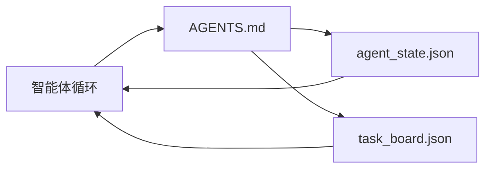

# 最小智能体工作台（The Minimal Agent Workbench）

> 最小有用的工作台是三个文件：一个根指令路由器、一个状态文件和一个任务板。其他一切都叠加在上面。如果一个仓库不能承载这三个，没有任何模型能拯救它。

**类型：** 构建  
**语言：** Python（标准库）  
**前置知识：** Phase 14 · 31（为什么有能力的模型仍然失败）  
**预计时间：** 约 45 分钟

## 学习目标

- 定义构成最小可行工作台的三个文件。
- 解释为什么简短的根路由器优于冗长的整体 `AGENTS.md`。
- 构建一个智能体可以在每轮读取并在最后写入的状态文件。
- 构建一个在没有聊天历史的情况下能跨多个会话存活的任务板。

## 问题所在

大多数团队通过编写 3000 行的 `AGENTS.md` 来获取工作台，并称之为完成。模型加载它，忽略它无法总结的部分，然后在它一直失败的相同表面上继续失败。

你需要相反的东西。一个微小的根文件，仅在相关时将智能体路由到更深层的文件。智能体在行动前读取、行动后写入的持久状态。一个说明进行中、受阻和下一步的任务板。

三个文件。每个都有一个职责。每个都足够机器可读，以便以后演化为真正的系统。

## 核心概念



### AGENTS.md 是路由器，不是手册

一个好的 `AGENTS.md` 是简短的。它将智能体指向：

- 状态文件（你在哪里）。
- 任务板（还剩什么）。
- 更深层的规则（在 `docs/agent-rules.md` 下）。
- 验证命令（如何知道它工作了）。

任何更长的内容放在更深层的文档中，仅在需要时加载。长手册会被忽略。短路由器会被遵循。

### agent_state.json 是系统记录

状态承载：活跃任务 ID、已触及文件、所做假设、阻碍因素和下一步动作。智能体在每一轮读取它。下一个会话读取它而不是重放聊天。

状态存在于文件中，因为聊天历史是不可靠的。会话会死亡。对话会被裁剪。文件不会。

### task_board.json 是队列

任务板承载每个任务，状态为 `todo | in_progress | done | blocked`。当状态为空时，智能体从中拉取的队列，以及当你想知道智能体是否在正轨时读取的队列。

板上的任务有 ID、目标、所有者（`builder`、`reviewer` 或 `human`）和验收标准。板刻意保持小：当它超过一屏时，你有规划问题，而非板问题。

### 三个文件是底线，不是天花板

后续课程增加范围契约、反馈运行器、验证门控、审查者清单和交接包。这里的三个文件是它们都假设存在的。

## 构建它

`code/main.py` 将最小工作台写入一个空仓库，并演示单个智能体轮次，该轮次：

1. 读取 `agent_state.json`。
2. 如果状态为空，从 `task_board.json` 拉取下一个任务。
3. 在范围内触及单个文件。
4. 写回更新的状态。

运行：

```
python3 code/main.py
```

脚本在自身旁边创建 `workdir/`，放置三个文件，运行一轮，并打印差异。再次运行以查看第二轮如何从第一轮停下来的地方继续。

## 使用它

在生产级智能体产品中，相同的三个文件以不同的名称出现：

- **Claude Code：** 路由器用 `AGENTS.md` 或 `CLAUDE.md`，状态用 `.claude/state.json` 风格存储，板用钩子。
- **Codex / Cursor：** 路由器用工作区规则，状态用会话记忆，板用聊天侧边栏中的排队任务。
- **自定义 Python 智能体：** 就是你刚写的文件。

名称变化。形态不变。

## 野外的生产模式

当三种模式叠加在上面时，最小工作台能在真实的单体仓库中存活。它们是独立的；选择你的仓库实际需要的。

**带最近优先优先级的嵌套 `AGENTS.md`。** OpenAI 在其主仓库中发布了 88 个 `AGENTS.md` 文件，每个子组件一个。Codex、Cursor、Claude Code 和 Copilot 都从工作文件向仓库根目录走，并连接沿途找到的每个 `AGENTS.md`。子目录文件扩展根文件。Codex 添加 `AGENTS.override.md` 来替换而非扩展；覆盖机制是 Codex 特定的，跨工具工作要避免它。Augment Code 的测量是最重要的一行：最好的 `AGENTS.md` 文件带来相当于从 Haiku 升级到 Opus 的质量跃升；最差的比没有文件还糟。

**即使它们看起来有覆盖，也要拒绝的反模式。** 冲突的指令悄悄地将智能体从交互模式降为贪心模式（ICLR 2026 AMBIG-SWE：48.8% → 28% 解决率）；给优先级编号而不是平铺它们。没有执行命令的不可验证样式规则（"遵循 Google Python 风格指南"）让智能体发明合规；每条样式规则都与精确的 lint 命令配对。以样式而非命令开头会埋藏验证路径；命令优先，样式最后。为人类而非智能体写作浪费上下文预算；简洁是特性。

**跨工具符号链接。** 带符号链接（`ln -s AGENTS.md CLAUDE.md`、`ln -s AGENTS.md .github/copilot-instructions.md`、`ln -s AGENTS.md .cursorrules`）的单一根文件让每个编程智能体保持在同一真相来源上。Nx 的 `nx ai-setup` 从单一配置自动化跨 Claude Code、Cursor、Copilot、Gemini、Codex 和 OpenCode 的这一操作。

## 交付它

`outputs/skill-minimal-workbench.md` 为任何新仓库生成三文件工作台：针对项目调整的 `AGENTS.md` 路由器、带正确键的 `agent_state.json`，以及用当前待办事项播种的 `task_board.json`。

## 练习

1. 在 `agent_state.json` 中添加 `last_run` 时间戳。如果文件超过 24 小时旧，除非操作员确认，否则拒绝运行。
2. 在任务板中添加 `priority` 字段，并将拉取器改为始终选择最高优先级的 `todo`。
3. 将 `task_board.json` 迁移到 JSON Lines，以便每个任务是一行，差异在版本控制中是干净的。
4. 编写一个 `lint_workbench.py`，如果 `AGENTS.md` 超过 80 行或引用不存在的文件，则失败。
5. 决定这三个文件中哪一个丢失了最痛苦。为它辩护。

## 关键术语

| 术语 | 通俗说法 | 准确含义 |
|------|----------|----------|
| Router（路由器） | `AGENTS.md` | 将智能体指向更深层文档和文件的简短根文件 |
| State file（状态文件） | "笔记" | 智能体位置的机器可读记录，每轮写入 |
| Task board（任务板） | "待办事项" | 带状态、所有者、验收的 JSON 工作队列 |
| System of record（系统记录） | "真相来源" | 当聊天消失时工作台视为权威的文件 |

## 延伸阅读

- [agents.md — 开放规范](https://agents.md/) — 被 Cursor、Codex、Claude Code、Copilot、Gemini、OpenCode 采用
- [Augment Code，好的 AGENTS.md 是模型升级。坏的比没有文档还差](https://www.augmentcode.com/blog/how-to-write-good-agents-dot-md-files) — 测量的质量跃升
- [Blake Crosley，AGENTS.md 模式：什么真正改变了智能体行为](https://blakecrosley.com/blog/agents-md-patterns) — 经验上有效的和无效的
- [Datadog Frontend，用 AGENTS.md 在单体仓库中引导 AI 智能体](https://dev.to/datadog-frontend-dev/steering-ai-agents-in-monorepos-with-agentsmd-13g0) — 嵌套优先级的实践
- [Nx Blog，教你的 AI 智能体如何在单体仓库中工作](https://nx.dev/blog/nx-ai-agent-skills) — 跨六个工具的单一来源生成
- [The Prompt Shelf，AGENTS.md 最佳实践：结构、范围和真实示例](https://thepromptshelf.dev/blog/agents-md-best-practices/) — 能经受审查的章节排序
- [Anthropic，Claude Code 子智能体和会话存储](https://docs.anthropic.com/en/docs/agents-and-tools/claude-code/sub-agents)
- Phase 14 · 31 — 这个最小工作台吸收的失败模式
- Phase 14 · 34 — 本课预览的持久状态 schema
