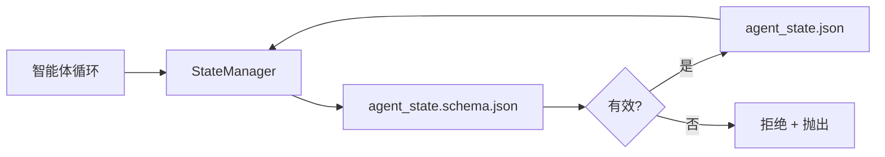

# 仓库记忆与持久状态（Repo Memory and Durable State）

> 聊天历史是易失的。仓库是持久的。工作台将智能体状态存储在版本化文件中，以便下一个会话、下一个智能体和下一个审查者都从同一个真相来源读取。

**类型：** 构建  
**语言：** Python（标准库 + 可选 `jsonschema`）  
**前置知识：** Phase 14 · 32（最小工作台）  
**预计时间：** 约 60 分钟

## 学习目标

- 定义什么属于仓库记忆，什么属于聊天历史。
- 为 `agent_state.json` 和 `task_board.json` 创作 JSON Schema。
- 构建一个原子性地加载、验证、变异和持久化状态的状态管理器。
- 使用 schema 在损坏工作台之前拒绝错误写入。

## 问题所在

智能体完成了一个会话。聊天关闭。下一个会话打开并询问从哪里开始。模型说"让我检查文件"，读取了过时的笔记，并重做了已经完成的工作。或者更糟糕的是，它重写了一个已完成的文件，因为没有人告诉它这个文件已经完成。

工作台的解决方法是仓库记忆：状态存在于仓库中的 JSON 文件里，在 schema 下写入，原子性持久化，在代码审查中对差异友好。聊天是一个临时 feed；仓库是系统记录。

## 核心概念



### 什么属于仓库记忆

| 属于 | 不属于 |
|------|--------|
| 活跃任务 ID | 原始聊天记录 |
| 本会话触及的文件 | Token 级推理追踪 |
| 智能体做出的假设 | "用户似乎很沮丧" |
| 开放的阻碍因素 | 采样补全 |
| 下一步动作 | 供应商特定的模型 ID |

测试是持久性：三个月后在 CI 重跑中这会有用吗？如果是，放仓库。如果不是，放遥测。

### Schema 优先的状态

JSON Schema 是契约。没有它，每个智能体发明新字段，每个审查者学习新形状，每个 CI 脚本都必须为过去的版本特殊处理。有了它，错误写入就是被拒绝的写入。

Schema 覆盖：

- 必需键。
- 允许的 `status` 值。
- 禁止值（例如数组的 `null`）。
- 模式约束（任务 ID 匹配 `T-\d{3,}`）。
- 用于迁移的版本字段。

### 原子写入

状态写入需要在部分失败中存活：写入临时文件，fsync，重命名到目标。状态文件是真相来源；半写的文件比没有文件更糟。

### 迁移

当 schema 更改时，在 schema 升级旁边发布迁移脚本。状态文件携带 `schema_version` 字段；管理器拒绝加载来自它无法迁移的版本的文件。

## 构建它

`code/main.py` 实现：

- `agent_state.schema.json` 和 `task_board.schema.json`。
- 仅标准库的验证器（JSON Schema 子集：required、type、enum、pattern、items）。
- `StateManager.load`、`StateManager.update`、`StateManager.commit`，带有原子临时文件和重命名写入。
- 一个变异状态、持久化、重新加载并证明往返的演示。

运行：

```
python3 code/main.py
```

脚本写入 `workdir/agent_state.json` 和 `workdir/task_board.json`，跨两轮变异它们，并在每步打印验证后的状态。

## 野外的生产模式

四种模式将本课的最小实现变为多智能体单体仓库能够存活的东西。

**原子临时文件和重命名不是可选的。** 2026 年 3 月的一个 Hive 项目 bug 报告清楚地记录了失败模式：`state.json` 通过 `write_text()` 写入，异常被捕获和静默。部分写入使会话针对损坏的状态恢复，没有任何信号。解决方法总是：在目标文件所在的同一目录中 `tempfile.mkstemp`，写入，`fsync`，`os.replace`（POSIX 和 Windows 上的原子重命名）。本课的 `atomic_write` 正是这样做的。

**每个非幂等工具调用的幂等性键。** 如果智能体在调用工具后崩溃但在检查点记录结果之前，恢复时会重试工具调用。对读取安全；对邮件、数据库插入、文件上传危险。模式：在执行前将每个工具调用 ID 记录到 `pending_calls.jsonl` 中。重试时，检查 ID；如果存在，跳过调用并使用缓存结果。Anthropic 和 LangChain 在 2026 年指南中都指出了这一点；LangGraph 的检查点器出于同样原因持久化待处理写入。

**将大型工件与状态分离。** 不要在 `agent_state.json` 中存储 CSV、长记录或生成的文件。将工件保存为单独文件（或上传到对象存储），在状态中只保留路径。检查点保持小而快；工件独立增长。

**事件溯源用于审计，快照用于恢复。** 在每次变异时追加到事件日志（`state.events.jsonl`）；定期快照到 `state.json`。恢复读取快照，然后重放快照时间戳之后的任何事件。这消耗更多磁盘但允许你逐字重放智能体决策——调试长期运行时必不可少。Postgres 内部使用 WAL 的形态相同。

**Schema 迁移或拒绝加载。** `schema_version` 整数是契约。当管理器加载未知版本的文件时，它拒绝读取。在 schema 升级旁边发布迁移脚本；`tools/migrate_state.py` 在每次启动时幂等运行。

## 使用它

在生产中：

- **LangGraph 检查点器。** 相同的想法，不同的存储。检查点器将图状态持久化到 SQLite、Postgres 或自定义后端。本课教授的 schema 是当检查点器死亡时你需要手动读取状态时用到的。
- **Letta 记忆块。** 带有结构化 schema 的持久块（Phase 14 · 08）。相同的规范范围限定于长期运行的角色。
- **OpenAI Agents SDK 会话存储。** 可插拔后端，Schema 感知。本课中的状态文件是本地文件后端。

## 交付它

`outputs/skill-state-schema.md` 生成项目特定的 JSON Schema 对（状态 + 板）、连接到原子写入的 Python `StateManager`，以及一个迁移脚手架，使下一次 schema 升级不会破坏工作台。

## 练习

1. 添加 `last_human_touch` 时间戳。拒绝在人工编辑后五秒内的任何智能体写入。
2. 扩展验证器以支持 `oneOf`，使任务可以是构建任务或审查任务，具有不同的必需字段。
3. 添加 `schema_version` 字段，并编写从 v1 到 v2 的迁移（将 `blockers` 重命名为 `risks`）。
4. 将存储后端从本地文件移到 SQLite。保持 `StateManager` API 不变。
5. 以 50 毫秒写入竞争对同一状态文件运行两个智能体。发生了什么问题，原子重命名如何拯救你？

## 关键术语

| 术语 | 通俗说法 | 准确含义 |
|------|----------|----------|
| Repo memory（仓库记忆） | "笔记文件" | 存储在仓库跟踪文件中的状态，在 schema 下 |
| Schema-first（Schema 优先） | "验证输入" | 在写入者之前定义契约，拒绝漂移 |
| Atomic write（原子写入） | "只是重命名" | 写入临时文件，fsync，重命名，使部分失败无法损坏 |
| Migration（迁移） | "Schema 升级" | 将 vN 状态转换为 v(N+1) 状态的脚本 |
| System of record（系统记录） | "真相来源" | 工作台视为权威的工件 |

## 延伸阅读

- [JSON Schema 规范](https://json-schema.org/specification.html)
- [LangGraph 检查点器](https://langchain-ai.github.io/langgraph/concepts/persistence/)
- [Letta 记忆块](https://docs.letta.com/concepts/memory)
- [Fast.io，AI 智能体状态检查点：实践指南](https://fast.io/resources/ai-agent-state-checkpointing/) — 带幂等性的 Schema 优先检查点
- [Fast.io，AI 智能体工作流状态持久化：2026 年最佳实践](https://fast.io/resources/ai-agent-workflow-state-persistence/) — 并发控制、TTL、事件溯源
- [Hive Issue #6263 — 非原子 state.json 写入被静默忽略](https://github.com/aden-hive/hive/issues/6263) — 真实项目中的失败模式
- [eunomia，检查点/恢复系统：演化、技术、应用](https://eunomia.dev/blog/2025/05/11/checkpointrestore-systems-evolution-techniques-and-applications-in-ai-agents/) — 从 OS 历史到智能体的 CR 基本元素
- [Indium，2026 年长时间运行 AI 智能体的 7 种状态持久化策略](https://www.indium.tech/blog/7-state-persistence-strategies-ai-agents-2026/)
- [Microsoft Agent Framework，压缩](https://learn.microsoft.com/en-us/agent-framework/agents/conversations/compaction) — 供应商检查点管理器
- Phase 14 · 08 — 记忆块和睡眠时计算
- Phase 14 · 32 — 本课对其进行 Schema 化的三文件最小实现
- Phase 14 · 40 — 从同一 schema 读取的交接包
