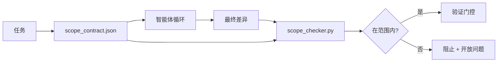

# 范围契约与任务边界（Scope Contracts and Task Boundaries）

> 模型不知道工作在哪里结束。范围契约是一个每任务文件，说明工作从哪里开始、到哪里结束，以及如果溢出如何回滚。契约将"保持在范围内"从一个愿望变成一个检查。

**类型：** 构建  
**语言：** Python（标准库）  
**前置知识：** Phase 14 · 32（最小工作台）、Phase 14 · 33（规则即约束）  
**预计时间：** 约 50 分钟

## 学习目标

- 编写智能体在任务开始时读取、验证器在任务结束时读取的范围契约。
- 指定允许的文件、禁止的文件、验收标准、回滚计划和审批边界。
- 实现一个将差异与契约比较并标记违规的范围检查器。
- 使范围蔓延可见、自动化且可审查。

## 问题所在

智能体会蔓延。任务是"修复登录 bug"。差异触及了登录路由、邮件助手、数据库驱动、README 和发布脚本。每个触点在当时都有合理的理由。但合在一起，它们是一个与被审查的变更完全不同的东西。

范围蔓延是智能体工作中监控最不足的失败模式，因为智能体以善意叙述每一步。解决方法不是更严格的提示词。解决方法是磁盘上的一个契约，说明承诺了什么，以及一个将结果与承诺相比较的检查。

## 核心概念



### 范围契约包含什么

| 字段 | 用途 |
|------|------|
| `task_id` | 链接到板上的任务 |
| `goal` | 审查者可以验证的一句话 |
| `allowed_files` | 智能体可以写入的 Glob 模式 |
| `forbidden_files` | 智能体即使偶然也不得触碰的 Glob 模式 |
| `acceptance_criteria` | 证明完成的测试命令或断言行 |
| `rollback_plan` | 如果需要停止，操作员可以执行的一段话 |
| `approvals_required` | 需要明确人工签字的范围外动作 |

没有 `forbidden_files` 的契约是不完整的。负空间是契约的一半。

### Glob 模式，而非原始路径

真实的仓库会移动文件。将契约固定到 Glob 模式（`app/**/*.py`、`tests/test_signup*.py`），这样会话之间的重构不会使契约失效。

### 回滚是范围的一部分

列出如何回滚迫使契约作者思考可能出什么问题。你无法从中回滚的契约是不应该被批准的契约。

### 范围检查是差异检查

智能体写入差异。检查器读取差异、允许的 Glob 模式、禁止的 Glob 模式，以及运行的任何验收命令列表。每个违规都是一个带标签的发现，验证门控可以拒绝它。

## 构建它

`code/main.py` 实现：

- `scope_contract.json` 模式（JSON Schema 子集，Glob 数组）。
- 将触碰的文件列表加上运行命令列表转换为 `RunSummary` 的差异解析器。
- 针对契约返回 `(violations, in_scope, off_scope)` 的 `scope_check`。
- 两次演示运行：一次保持在范围内，一次蔓延。检查器用确切的文件和原因标记蔓延。

运行：

```
python3 code/main.py
```

输出：契约、两次运行、每次运行的判决，以及保存的 `scope_report.json`。

## 野外的生产模式

一位实践者运行"规范最大化"（在调用智能体之前用 YAML 写范围契约）报告说，在三周内兔子洞率从 52% 降至 21%，而没有更改智能体。契约做了工作，而非模型。三种模式让收益持久。

**违规预算，而非二元失败。** `agent-guardrails`（Claude Code、Cursor、Windsurf、Codex 通过 MCP 使用的 OSS 合并门控）为每个任务附带 `violationBudget`：预算内的轻微范围偏移以警告形式呈现；只有当预算超出时，合并门控才拒绝。与 `violationSeverity: "error" | "warning"` 配对。预算是能够落地的门控与被讨厌它的团队禁用的门控之间的区别。

**按路径族的严重程度不对称。** 对 `docs/**` 的范围外写入通常是 `warn`；对 `scripts/**`、`migrations/**`、`config/prod/**` 的范围外写入始终是 `block`。这种不对称必须存在于契约中，而非运行时，因为它是特定于项目的，并且每个任务都在变化。

**时间和网络预算与文件预算并列。** `time_budget_minutes` 字段限制挂钟时间；运行时拒绝在不重新批准的情况下继续超过它。主机名上的 `network_egress` 允许列表防止智能体悄悄访问不属于任务的外部 API。这些也是范围维度；文件 Glob 是必要的，但还不够。

**多契约合并语义（最小权限）。** 当两个范围契约适用时（例如，一个项目范围的契约加上一个任务特定的契约），合并是：**交集** `allowed_files`（两个契约必须允许该路径），**联集** `forbidden_files`（任一都可以禁止），`time_budget_minutes` 最严格（最小值），`approvals_required` 累积。`network_egress` 是 `None` 表示不执行，`[]` 表示全拒，`[...]` 作为允许列表；在合并下，`None` 服从另一方，两个列表取交集，全拒保持全拒。在契约模式中声明这一点，使合并是机械的且可审查的。

## 使用它

生产模式：

- **Claude Code 斜杠命令。** `/scope` 命令写入契约并将其固定为会话上下文。子智能体在行动前读取契约。
- **GitHub PR。** 将契约作为 PR 正文中的 JSON 文件或签入工件推送。CI 针对合并差异运行范围检查器。
- **LangGraph 中断。** 范围违规触发中断；处理器询问人类契约是否需要增长，或智能体是否需要退后。

契约与任务一起移动。任务关闭时，契约归档在 `outputs/scope/closed/` 下。

## 交付它

`outputs/skill-scope-contract.md` 为任务描述生成范围契约，以及一个在每次智能体差异时在 CI 中运行的 Glob 感知检查器。

## 练习

1. 添加 `network_egress` 字段，列出允许的外部主机。拒绝触及其他主机的运行。
2. 扩展检查器，对 `docs/**` 软失败，对 `scripts/**` 硬失败。为这种不对称辩护。
3. 使契约使用静态规则集（无 LLM）从 `goal` 字段派生 `allowed_files`。在第一个边缘案例上会出什么问题？
4. 添加 `time_budget_minutes`，一旦挂钟超过它就拒绝继续。
5. 针对同一差异运行两个契约。当两者都适用时，正确的合并语义是什么？

## 关键术语

| 术语 | 通俗说法 | 准确含义 |
|------|----------|----------|
| Scope contract（范围契约） | "任务简报" | 每任务 JSON，列出允许/禁止的文件、验收、回滚 |
| Scope creep（范围蔓延） | "它还触碰了..." | 在同一任务中契约外的文件被更改 |
| Rollback plan（回滚计划） | "我们可以恢复" | 停止的单段操作员运行手册 |
| Approval boundary（审批边界） | "需要签字" | 契约中列为需要明确人工批准的动作 |
| Diff check（差异检查） | "路径审计" | 将触碰的文件与契约 Glob 比较 |

## 延伸阅读

- [LangGraph 人工循环中断](https://langchain-ai.github.io/langgraph/concepts/human_in_the_loop/)
- [OpenAI Agents SDK 工具审批策略](https://platform.openai.com/docs/guides/agents-sdk)
- [logi-cmd/agent-guardrails — 合并门控和范围验证](https://github.com/logi-cmd/agent-guardrails) — 违规预算、严重程度层级
- [Dev|Journal，用智能体契约测试防止 AI 智能体配置漂移](https://earezki.com/ai-news/2026-05-05-i-built-a-tiny-ci-tool-to-keep-ai-agent-configs-from-drifting-in-my-repo/) — 无外部依赖的 `--strict` 模式
- [主动编码不是陷阱（生产日志）](https://dev.to/jtorchia/agentic-coding-is-not-a-trap-i-answered-the-viral-hn-post-with-my-own-production-logs-33d9) — 规范最大化收据：52% → 21%
- [OpenCode 权限 Glob](https://opencode.ai/docs/agents/) — 细粒度的每权限范围
- [Knostic，AI 编码智能体安全：威胁模型和保护策略](https://www.knostic.ai/blog/ai-coding-agent-security) — 范围作为最小权限的一部分
- [Augment Code，AI 规范模板](https://www.augmentcode.com/guides/ai-spec-template) — 三层边界系统（必须/询问/永不）
- Phase 14 · 27 — 与范围锁配对的提示词注入防御
- Phase 14 · 33 — 此契约每任务特化的规则集
- Phase 14 · 38 — 检查器报告到的验证门控
