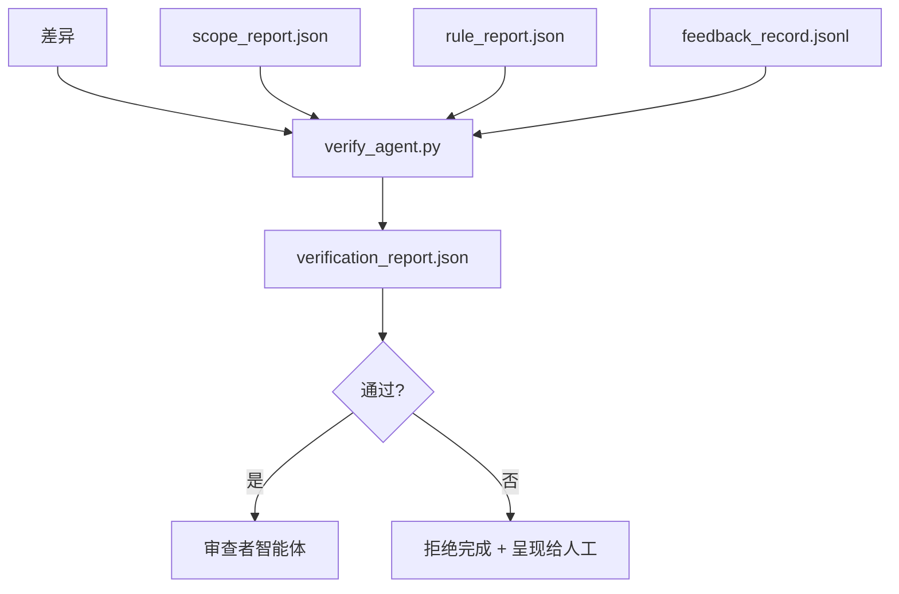

# 验证门控（Verification Gates）

> 智能体无权将自己的工作标记为已完成。验证门控读取范围契约、反馈日志、规则报告和差异，并回答一个问题：这个任务是否真的完成了？如果门控说不，任务就没有完成，无论聊天里说什么。

**类型：** 构建  
**语言：** Python（标准库）  
**前置知识：** Phase 14 · 33（规则）、Phase 14 · 36（范围）、Phase 14 · 37（反馈）  
**预计时间：** 约 55 分钟

## 学习目标

- 将验证门控定义为工作台工件上的确定性函数。
- 将规则报告、范围报告、反馈记录和差异合并为单一判决。
- 发出审查者智能体和 CI 都可以读取的 `verification_report.json`。
- 在任何 block 严重程度的失败时，无例外地拒绝推进任务。

## 问题所在

智能体太容易宣告成功。三种失败模式占主导：

- "看起来不错。"模型读取了自己的差异并决定它是正确的。
- "测试通过了。"充满信心地说。没有测试真正运行的记录。
- "验收已满足。"验收标准被宽泛地解释为"任何类似完成的东西"。

工作台的解决方法是一个单一验证门控，读取智能体已经生产的工件并做出决定。门控是确定性的。门控在版本控制中。门控连接到 CI。智能体无法收买它。

## 核心概念



### 门控检查什么

| 检查 | 来源工件 | 严重程度 |
|------|---------|---------|
| 所有验收命令已运行 | `feedback_record.jsonl` | block |
| 所有验收命令以零退出 | `feedback_record.jsonl` | block |
| 范围检查没有禁止写入 | `scope_report.json` | block |
| 范围检查没有范围外写入 | `scope_report.json` | block 或 warn |
| 所有 block 严重程度的规则通过 | `rule_report.json` | block |
| 反馈中没有 `null` 退出码 | `feedback_record.jsonl` | block |
| 触碰的文件匹配 `scope.allowed_files` | 两者 | warn |

`warn` 发现注释判决；`block` 发现阻止 `passed: true`。

### 确定性的，而非概率性的

门控必须对相同的工件集每次产生相同的判决。没有 LLM 评判。LLM 评判属于审查者侧（Phase 14 · 39），那里的目标是定性评估，而非状态判断。

### 一份报告，一条路径

门控每次任务关闭发出一份 `verification_report.json`，写入 `outputs/verification/<task_id>.json` 下。CI 消费相同路径。具有不同路径的多个门控分叉了真相来源。

### 无例外拒绝

Block 严重程度的发现不能被智能体覆盖。它们只能被人类覆盖，带有记录的 `override_reason` 和 `overridden_by` 用户 ID。覆盖是一个已签名的变更，而非智能体决策。

## 构建它

`code/main.py` 实现：

- 每个输入工件的加载器，都在本地存根，使课程自包含。
- 纯函数 `verify(task_id, artifacts) -> VerdictReport`。
- 显示每项检查结果和最终通过/失败的打印器。
- 三种任务场景的演示：干净通过、范围蔓延、缺失验收。

运行：

```
python3 code/main.py
```

输出：三份判决报告，每份保存在脚本旁边。

## 野外的生产模式

四种模式将门控从"另一个 lint 作业"提升到"决定性边缘"。

**纵深防御，而非单一门控。** 预提交钩子 → CI 状态检查 → 工具前授权钩子 → 预合并门控。每层都是确定性的，所以一层的失败会被下一层捕获。microservices.io 2026 年 3 月的手册明确指出：预提交钩子是不可绕过的，因为与模型侧技能不同，它不依赖于智能体遵循指令。验证门控位于 CI / 预合并层。

**确定性检查防御，模型评判仅用于细微差别。** Anthropic 的 2026 年混合规范配对：可验证的奖励（单元测试、模式检查、退出码）回答"代码是否解决了问题？"——LLM 评分回答"代码是否可读、安全、符合风格？"门控运行第一类；审查者（Phase 14 · 39）运行第二类。混合它们会使信号崩溃。

**签名覆盖日志，而非 Slack 线程。** 每次覆盖在 `outputs/verification/overrides.jsonl` 中发出一行，包含：时间戳、发现码、原因、签名用户、当前 HEAD 提交。运行时拒绝任何缺少签名的覆盖；审计追踪是 git 跟踪的。这是覆盖策略与覆盖戏剧之间的界线。

**覆盖率底线作为一等检查。** `coverage_report.json` 馈送 `coverage_floor`（默认 80%）检查。如果测量的覆盖率低于底线或低于上次合并的底线超过 1 个百分点，门控失败。没有这个检查，智能体会悄悄删除失败的测试，验证报告保持绿色。

**`--strict` 模式将 warn 提升为 block。** 对于发布分支、阻止发布的 PR 或事后分类，`--strict` 使每个警告成为硬失败。该标志按分支选择加入；不是全局默认值，因为严格对一切会侵蚀日常流程。

## 使用它

生产模式：

- **CI 步骤。** `verify_agent` 作业针对智能体的最终工件运行门控。合并保护在没有 `passed: true` 时拒绝。
- **交接前钩子。** 智能体运行时在生成交接文档之前调用门控。没有绿色判决，没有交接。
- **手动分类。** 当智能体声称成功而人类怀疑时，操作员读取报告。

门控是工作台流程中的决定性边缘。所有其他表面都在它的上游。

## 交付它

`outputs/skill-verification-gate.md` 将门控连接到特定项目：哪些验收命令馈送它、哪些规则是 block 严重程度、哪些范围外写入是可容忍的、覆盖审计日志如何存储。

## 练习

1. 添加 `coverage_floor` 检查：测试命令必须产生覆盖率至少 80% 的覆盖率报告。决定哪个工件携带底线。
2. 支持 `--strict` 模式，将每个 `warn` 提升为 `block`。记录严格模式是正确默认值的情况。
3. 使门控除 JSON 外还生成 Markdown 摘要。为哪些字段属于摘要辩护。
4. 添加 `time_since_last_human_touch` 检查：在人工按键 60 秒内编辑的任何文件都免于范围外标记。
5. 在你产品的真实智能体差异上运行门控。有多少发现是真实的，有多少是噪音？门控需要在哪里增长？

## 关键术语

| 术语 | 通俗说法 | 准确含义 |
|------|----------|----------|
| Verification gate（验证门控） | "阻止事情的检查" | 工作台工件上的确定性函数，产生通过/失败判决 |
| Block severity（Block 严重程度） | "硬失败" | 阻止 `passed: true` 且需要签名覆盖的发现 |
| Override log（覆盖日志） | "为什么我们让它通过" | 带原因和用户 ID 的签名条目，由审查审计 |
| Acceptance command（验收命令） | "证明" | 零退出即为"完成"意义的 shell 命令 |
| One report path（单一报告路径） | "真相来源" | `outputs/verification/<task_id>.json`，由 CI 和人类共同消费 |

## 延伸阅读

- [Anthropic，长期运行应用程序开发的框架设计](https://www.anthropic.com/engineering/harness-design-long-running-apps)
- [OpenAI Agents SDK 护栏](https://platform.openai.com/docs/guides/agents-sdk/guardrails)
- [microservices.io，GenAI 开发平台：护栏](https://microservices.io/post/architecture/2026/03/09/genai-development-platform-part-1-development-guardrails.html) — 预提交和 CI 之间的纵深防御
- [ICMD，2026 年主动式 AI 运营手册](https://icmd.app/article/the-2026-playbook-for-agentic-ai-ops-guardrails-costs-and-reliability-at-scale-1776661990431) — 批准门控阶梯（草稿 → 批准 → 阈值下自动）
- [类型检查合规性：确定性护栏（arXiv 2604.01483）](https://arxiv.org/pdf/2604.01483) — Lean 4 作为确定性门控的上界
- [logi-cmd/agent-guardrails — 合并门控规范](https://github.com/logi-cmd/agent-guardrails) — 范围 + 变异测试门控
- [Guardrails AI x MLflow](https://guardrailsai.com/blog/guardrails-mlflow) — 确定性验证器作为 CI 评分器
- [Akira，主动式系统的实时护栏](https://www.akira.ai/blog/real-time-guardrails-agentic-systems) — 工具前后门控
- Phase 14 · 27 — 提示词注入防御（门控的对抗配对）
- Phase 14 · 36 — 此门控执行的范围契约
- Phase 14 · 37 — 此门控评分的反馈日志
- Phase 14 · 39 — 门控移交给的审查者智能体
