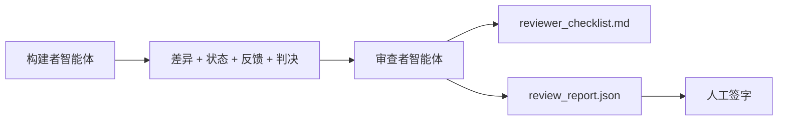

# 审查者智能体：将构建者与评分者分开（Reviewer Agent: Separate Builder from Marker）

> 写了代码的智能体不能给它打分。审查者是一个具有不同系统提示词、不同目标，以及对构建者生产的所有内容只读访问权限的第二个循环。构建者与审查者之间的差距是大多数可靠性所在之处。

**类型：** 构建  
**语言：** Python（标准库）  
**前置知识：** Phase 14 · 38（验证门控）  
**预计时间：** 约 55 分钟

## 学习目标

- 说明为什么同一个智能体无法可靠地审查自己的工作。
- 构建一个消费构建者工件并发出结构化审查报告的审查者智能体循环。
- 编写一个对具体维度而非感觉打分的审查者评分标准。
- 将审查者连接到工作台，使人工审查步骤从真实工件开始。

## 问题所在

你要求智能体修复一个 bug。它编辑了四个文件，运行了测试，并报告完成。验证门控（Phase 14 · 38）确认验收已运行，范围已保持。门控说 `passed: true`。你合并了。两天后你发现这个修复解决了 bug 的错误一半。

验收是必要的，但不充分。审查者提出验收无法提问的问题：这是否解决了正确的问题？它是否在未标记的情况下扩展了范围？它是否记录了应该被质疑的假设？它是否使工作台处于下一个会话可以接手的状态？

## 核心概念



### 审查者评分标准

五个维度，每个评分 0 到 2。

| 维度 | 问题 |
|------|------|
| 问题契合度（Problem fit） | 变更是否解决了所述任务，而非邻近任务？ |
| 范围纪律（Scope discipline） | 编辑是否限于契约，或者契约是否有意增长？ |
| 假设（Assumptions） | 所有隐藏假设是否写在可审查的地方？ |
| 验证质量（Verification quality） | 验收命令是否真正证明了目标，还是证明了更弱的版本？ |
| 交接准备度（Handoff readiness） | 下一个会话能否从当前状态干净地接手？ |

总分 10 分。低于 7 分是软失败；低于 5 分是硬失败。

### 审查者是独立角色，而非独立模型

你可以用与构建者相同的模型运行审查者。纪律在于角色分离：不同的系统提示词、不同的输入、对差异没有写访问权限。姿态的变化就是信号的变化。

### 审查者不能编辑差异

审查者读取差异、状态、反馈、判决。它写一份报告。它不修补差异。如果报告说"修复这个"，下一个构建者轮次做修复；审查者回到审查。混合角色会消除差距。

### 审查者评分标准与验证门控的比较

门控（Phase 14 · 38）检查确定性事实：验收是否运行，测试是否通过，范围是否保持。审查者做出定性判断：这是否是正确的工作，是否有记录，交接是否可用。两者都是必需的。

## 构建它

`code/main.py` 实现：

- 捆绑审查者读取的工件的 `ReviewerInputs` 数据类。
- 每个维度一个函数的评分标准评分器。每个函数对课程而言是确定性的存根级别；真实实现会调用 LLM。
- 带有五个评分、总分和判决（`pass`、`soft_fail`、`hard_fail`）的 `review_report.json` 写入器。
- 两个演示案例：一个干净的变更和一个"正确的测试，错误的问题"变更。

运行：

```
python3 code/main.py
```

输出：两份审查报告写入磁盘，以及维度评分的控制台表格。

## 野外的生产模式

数据：Cloudflare 2026 年 4 月的 AI 代码审查系统在 30 天内跨 5,169 个仓库的 48,095 个合并请求运行了 131,246 次审查。中位审查在 3 分 39 秒内完成。多达七位专业审查者（安全、性能、代码质量、文档、发布管理、合规、工程 Codex）在一个审查协调者下并行运行，该协调者去重发现并判断严重程度。顶级模型专门保留给协调者；专业者在更便宜的层级上运行。

四种模式使其在规模上有效。

**专业者池，而非一个大审查者。** 一个带 5 维度评分标准的审查者适用于单人仓库。一旦代码库有安全关键、性能关键和文档表面，分成带有更小提示词的专业者。协调者做去重；专业者从不运行完整评分标准。模型层级分离随之而来：便宜的专业者，昂贵的协调者。

**偏差缓解作为设计要求，而非优化。** LLM 评判显示四种可靠偏差（Adnan Masood，2026 年 4 月）：位置偏差（GPT-4 在 (A,B) 与 (B,A) 排序上约 40% 不一致）、冗长偏差（对更长输出的评分通胀约 15%）、自我偏好（评判者偏爱同一模型家族的输出）、权威性（评判者过度评价对知名作者的引用）。缓解措施：评估两种排序，只计算一致的胜利；使用明确奖励简洁的 1-4 量表；跨模型家族轮换评判者；评分前去除作者姓名。

**校准集，而非感觉。** 一个 10-20 个任务的历史集，带有已知的正确判决。每次提示词变更时在其上运行审查者。如果与历史记录的一致性低于 80%，评分标准需要修订才能发布审查者。这是每个团队最终重新发现的；最好从一开始就有它。

**与门控的混合规范。** 验证门控（Phase 14 · 38）处理确定性检查（验收是否运行，测试是否通过，范围是否保持）。审查者处理语义检查（这是否是正确的工作，假设是否有记录，交接是否可用）。Anthropic 的 2026 年指导明确了这种分工：不要要求审查者重做门控已经证明的内容。

## 使用它

生产模式：

- **Claude Code 子智能体。** 审查者子智能体在构建者关闭任务后运行。它在 PR 上发表带有评分标准评分的评论。
- **OpenAI Agents SDK 移交。** 构建者在任务完成时移交给审查者。审查者可以带着发现列表移交回去，或移交给人工。
- **双模型配对。** 构建者在更快更便宜的模型上运行。审查者在更强的模型上运行，有更小的上下文，专注于判断。

审查者是当人类无法亲自审查每项时工作台培养的第二双眼睛。

## 交付它

`outputs/skill-reviewer-agent.md` 生成一个项目特定的审查者评分标准、一个连接到构建者工件的审查者智能体存根，以及与验证门控的集成，使人工审查从书面报告而非空白页开始。

## 练习

1. 添加特定于你产品领域的第六个维度。为什么它不被现有五个吸收辩护。
2. 用两个不同的系统提示词（简洁、冗长）运行审查者。哪个产生人类更可能读取的报告？
3. 每个维度添加 `confidence` 字段。当最低维度的置信度低于 0.6 时，拒绝发布报告。
4. 构建一个校准集：10 个历史任务关闭，带有已知的正确判决。在其上运行审查者。它在哪里与历史记录不一致？
5. 添加"请求更多证据"功能：审查者可以在评分前要求构建者进行特定的测试运行。正确的退避是什么，以防止循环？

## 关键术语

| 术语 | 通俗说法 | 准确含义 |
|------|----------|----------|
| Reviewer rubric（审查者评分标准） | "清单" | 每个维度带有书面问题的五维度 0-2 评分 |
| Soft fail（软失败） | "需要修改" | 总分低于 7；构建者获得要解决的发现 |
| Hard fail（硬失败） | "拒绝" | 总分低于 5 或任何维度为 0；停止并呈现给人工 |
| Role separation（角色分离） | "不同提示词" | 同一模型可以担任两个角色；纪律在于输入和姿态 |
| Confidence floor（置信度底线） | "不发布低信号报告" | 当评分标准不确定时拒绝发出判决 |

## 延伸阅读

- [OpenAI Agents SDK 移交](https://platform.openai.com/docs/guides/agents-sdk/handoffs)
- [Anthropic Claude Code 子智能体](https://docs.anthropic.com/en/docs/agents-and-tools/claude-code/sub-agents)
- [Cloudflare，大规模编排 AI 代码审查](https://blog.cloudflare.com/ai-code-review/) — 7 专业者 + 协调者架构，30 天 131k 次运行
- [Agent-as-a-Judge：用智能体评估智能体（OpenReview / ICLR）](https://openreview.net/forum?id=DeVm3YUnpj) — DevAI 基准，366 个分层解决方案要求
- [Adnan Masood，基于评分标准的评估和 LLM 作为评判者：方法论、偏差、实证验证](https://medium.com/@adnanmasood/rubric-based-evals-llm-as-a-judge-methodologies-and-empirical-validation-in-domain-context-71936b989e80) — 四种偏差和缓解措施
- [MLflow，LLM 作为评判者评估](https://mlflow.org/llm-as-a-judge) — 分离构建者/评估者的生产工具
- [LangChain，如何用人工更正校准 LLM 作为评判者](https://www.langchain.com/articles/llm-as-a-judge) — 校准集工作流
- [Evidently AI，LLM 作为评判者：完整指南](https://www.evidentlyai.com/llm-guide/llm-as-a-judge)
- [Arize，LLM 作为评判者 — 入门和预构建评估器](https://arize.com/llm-as-a-judge/)
- Phase 14 · 05 — 自我精炼和 CRITIC（单智能体自我审查基线）
- Phase 14 · 30 — 评估驱动的智能体开发（校准集生成器）
- Phase 14 · 38 — 审查者读取的验证门控
- Phase 14 · 40 — 审查者报告馈送的交接包
