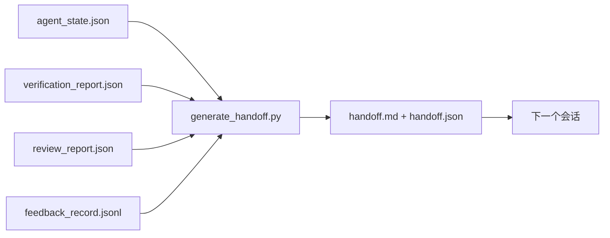

# 多会话交接（Multi-Session Handoff）

> 会话将会结束。工作不会。交接包是将"智能体工作了一个小时"变为"下一个会话在第一分钟就有成效"的工件。有目的地构建它，而非事后诸葛亮。

**类型：** 构建  
**语言：** Python（标准库）  
**前置知识：** Phase 14 · 34（仓库记忆）、Phase 14 · 38（验证）、Phase 14 · 39（审查者）  
**预计时间：** 约 50 分钟

## 学习目标

- 识别每个交接包需要的七个字段。
- 从工作台工件生成交接，而无需手写散文。
- 将大型反馈日志修剪为交接大小的摘要。
- 使下一个会话的第一个动作是确定性的。

## 问题所在

会话结束了。智能体说"很好，我们取得了进展。"下一个会话打开了。下一个智能体问"我们停在哪里了？"第一个智能体的答案消失了。下一个智能体重新发现、重新运行相同的命令、重新问人类相同的问题，花了三十分钟恢复上一个会话最后三十秒的内容。

糟糕交接的代价在任务生命周期中的每次会话都要支付。解决方法是在会话结束时自动生成的包：改变了什么、为什么、尝试了什么、失败了什么、还剩什么、下次首先做什么。

## 核心概念



### 每个交接携带的七个字段

| 字段 | 它回答的问题 |
|------|------------|
| `summary` | 完成了什么的一段话 |
| `changed_files` | 一目了然的差异 |
| `commands_run` | 实际执行了什么 |
| `failed_attempts` | 尝试了什么以及为什么没有成功 |
| `open_risks` | 下一个会话可能遇到的问题，带严重程度 |
| `next_action` | 下一个会话采取的第一个具体步骤 |
| `verdict_pointer` | 验证 + 审查报告的路径 |

`next_action` 字段是承重的那个。缺少 `next_action` 的交接是状态报告，而非交接。

### 交接是生成的，而非手写的

手写的交接是在艰难一天会被跳过的交接。生成器读取工作台工件并发出包。智能体的工作是使工作台处于生成器可以总结的状态，而不是写摘要。

### 两种形式：人类可读和机器可读

`handoff.md` 是人类读取的内容。`handoff.json` 是下一个智能体加载的内容。两者来自相同的源工件。如果它们发散，JSON 胜出。

### 反馈日志修剪

完整的 `feedback_record.jsonl` 可能有数百条记录。交接只携带最后 K 条加上每条非零退出的记录。下一个会话如果需要可以加载完整日志，但包保持小。

## 构建它

`code/main.py` 实现：

- 将状态、判决、审查和反馈收集到单个 `WorkbenchSnapshot` 的加载器。
- `generate_handoff(snapshot) -> (markdown, payload)` 函数。
- 选取最后 K 条反馈记录加上所有非零退出的过滤器。
- 将 `handoff.md` 和 `handoff.json` 写入脚本旁边的演示运行。

运行：

```
python3 code/main.py
```

输出：打印的交接正文，加上磁盘上的两个文件。

## 野外的生产模式

Codex CLI、Claude Code 和 OpenCode 各自提供不同的压缩方案；结构化交接包位于所有三者之上。

**压缩策略各异；包模式不变。** Codex CLI 的 POST /v1/responses/compact 是服务器端不透明的 AES blob（OpenAI 模型的快速路径）；回退是一个作为 `_summary` 用户角色消息追加的本地"交接摘要"。Claude Code 在 95% 上下文时运行五阶段渐进压缩。OpenCode 执行基于时间戳的消息隐藏加上一个 5 标题 LLM 摘要。三种不同机制，相同需求：将压缩后存活的内容序列化为可移植工件。包就是那个工件。

**新会话交接不是压缩。** 压缩延长会话；交接干净地关闭一个并开始下一个。Hermes Issue #20372 的框架（2026 年 4 月）是正确的：当就地压缩开始降级时，智能体应该写一个紧凑的交接，结束会话，并在新鲜上下文中恢复。包使这种过渡变得廉价。错误是继续压缩直到质量崩溃；解决方法是提早预算一个干净的交接。

**每个分支和主题一个活跃交接。** 多智能体协调在过时交接上的故障比在糟糕模型输出上更多。始终包括 `branch`、`last_known_good_commit` 和 `status`（`active | superseded | archived`）。过时的交接被归档；只有活跃的驱动下一个会话。这是交接作为笔记与交接作为状态之间的区别。

**在 50-75% 上下文时收尾，而非到达上限。** 手写模式手册（CLAUDE.md + HANDOVER.md）报告当会话在 50-75% 上下文预算而非 95% 时结束有最佳结果。包生成器在压缩工件污染源状态之前干净运行。在上下文完整时写入便宜；当模型已经失去位置时昂贵。

## 使用它

生产模式：

- **会话结束钩子。** 当用户关闭聊天时，运行时触发生成器。包进入 `outputs/handoff/<session_id>/`。
- **PR 模板。** 生成器的 markdown 也是 PR 正文。审查者无需打开五个其他文件即可读取它。
- **跨智能体交接。** 用一个产品构建（Claude Code），用另一个继续（Codex）。包是通用语言。

包小、规律、生成廉价。节省的成本在每次会话中复利增长。

## 交付它

`outputs/skill-handoff-generator.md` 生成一个针对项目工件路径调整的生成器、一个运行它的会话结束钩子，以及下一个智能体在启动时读取的 `handoff.json` 模式。

## 练习

1. 添加 `assumptions_to_validate` 字段，浮出构建者记录但审查者没有评分超过 1 的每个假设。
2. 对失败运行与通过运行的反馈摘要使用不同的修剪方式。为这种不对称辩护。
3. 包括"给人类的问题"列表。问题进入包而非聊天消息的阈值是什么？
4. 使生成器幂等：运行两次产生相同的包。什么需要稳定才能使其成立？
5. 添加"下一个会话前置条件"部分，列出下一个会话在行动前必须加载的确切工件。

## 关键术语

| 术语 | 通俗说法 | 准确含义 |
|------|----------|----------|
| Handoff packet（交接包） | "会话摘要" | 携带七个字段的生成工件，包括 markdown 和 JSON |
| Next action（下一步动作） | "首先做什么" | 启动下一个会话的一个具体步骤 |
| Feedback trim（反馈修剪） | "日志摘要" | 最后 K 条记录加上每条非零退出 |
| Status report（状态报告） | "我们做了什么" | 缺少 `next_action` 的文档；有用，但不是交接 |
| Verdict pointer（判决指针） | "收据" | 用于可追溯性的验证 + 审查报告路径 |

## 延伸阅读

- [Anthropic，长时间运行智能体的有效框架](https://www.anthropic.com/engineering/effective-harnesses-for-long-running-agents)
- [OpenAI Agents SDK 移交](https://platform.openai.com/docs/guides/agents-sdk/handoffs)
- [Codex Blog，Codex CLI 上下文压缩：架构、配置、管理长会话](https://codex.danielvaughan.com/2026/03/31/codex-cli-context-compaction-architecture/) — POST /v1/responses/compact 和本地回退
- [Justin3go，摆脱沉重记忆：Codex、Claude Code、OpenCode 中的上下文压缩](https://justin3go.com/en/posts/2026/04/09-context-compaction-in-codex-claude-code-and-opencode) — 三家厂商压缩比较
- [JD Hodges，Claude 交接提示词：如何跨会话保持上下文（2026）](https://www.jdhodges.com/blog/ai-session-handoffs-keep-context-across-conversations/) — CLAUDE.md + HANDOVER.md，50-75% 上下文预算
- [Mervin Praison，管理多智能体编码会话中的交接：不丢失连续性的新鲜上下文](https://mer.vin/2026/04/managing-handoffs-in-multi-agent-coding-sessions-fresh-context-without-losing-continuity/) — 分布式系统框架
- [Hermes Issue #20372 — 压缩变得有风险时自动新会话交接](https://github.com/NousResearch/hermes-agent/issues/20372)
- [Microsoft Agent Framework，压缩](https://learn.microsoft.com/en-us/agent-framework/agents/conversations/compaction)
- [LangChain，智能体的上下文工程](https://www.langchain.com/blog/context-engineering-for-agents)
- Phase 14 · 34 — 生成器读取的状态文件
- Phase 14 · 38 — 包指向的验证判决
- Phase 14 · 39 — 捆绑进包的审查者报告
