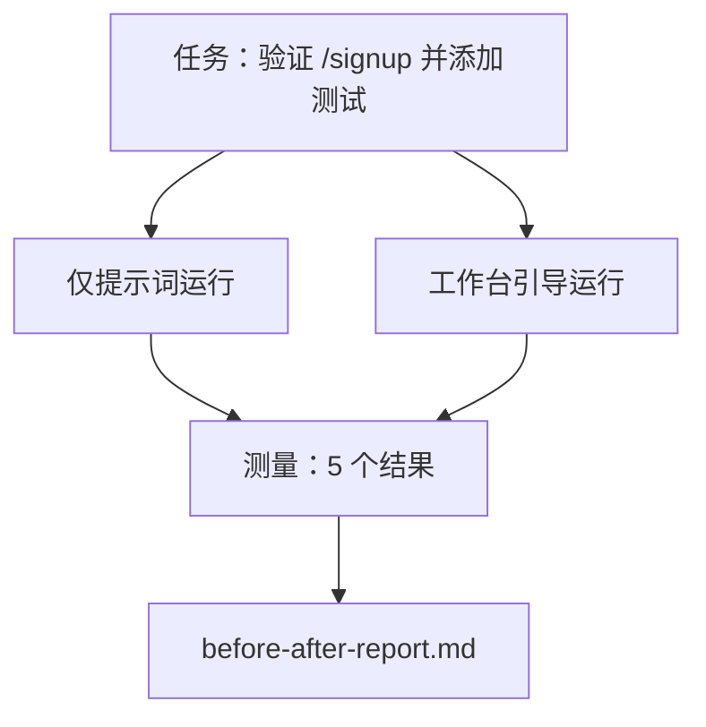

# 真实仓库上的工作台（The Workbench on a Real Repo）

> 十一节课的表面价值为零，如果它们无法在真实代码库上存活。本课在一个小型示例应用上对同一任务运行两次：仅提示词与工作台引导。数字会说话。

**类型：** 构建  
**语言：** Python（标准库）  
**前置知识：** Phase 14 · 32 到 Phase 14 · 40  
**预计时间：** 约 60 分钟

## 学习目标

- 在一个小型应用上将七个工作台表面汇聚在一起。
- 对同一任务运行两次（仅提示词和工作台引导），并测量五个结果。
- 阅读前后报告，决定哪些表面提供了最大杠杆。
- 面对"但我的模型足够好"的质疑为工作台辩护。

## 问题所在

玩具任务上的演示说服不了任何人。当真实感任务在真实感仓库上以更少的失败、更少的回滚登陆生产，并且有下一个会话可以使用的包时，工作台的案例才能成立。

本课提供那个真实感仓库，并通过两个管道运行同一任务。结果是一份你可以交给怀疑者的前后报告。

## 核心概念



### 示例应用

`sample_app/` 中的一个最小 FastAPI 风格处理器：

- `app.py`，带 `/signup`（尚无验证）。
- `test_app.py`，带一个快乐路径测试。
- `README.md` 和 `scripts/release.sh` 作为禁止区域诱饵。

### 任务

> 为 `/signup` 添加输入验证：拒绝短于 8 个字符的密码，返回 422 和类型化错误信封。添加一个证明新行为的测试。

### 两个管道

仅提示词：

1. 读取 README。
2. 读取 `app.py`。
3. 编辑文件。
4. 声称完成。

工作台引导：

1. 运行初始化脚本（第 35 课）。
2. 读取范围契约（第 36 课）。
3. 读取状态（第 34 课）。
4. 只编辑允许的文件。
5. 通过反馈运行器运行验收命令（第 37 课）。
6. 运行验证门控（第 38 课）。
7. 运行审查者（第 39 课）。
8. 生成交接（第 40 课）。

### 测量的五个结果

| 结果 | 为什么重要 |
|------|-----------|
| `tests_actually_run` | 大多数"测试通过"声明无法验证 |
| `acceptance_met` | 证明目标的测试必须是运行的测试 |
| `files_outside_scope` | 范围蔓延是主要的静默失败 |
| `handoff_quality` | 下一个会话为此付出代价或从中受益 |
| `reviewer_total` | 门控之上的定性判断 |

## 构建它

`code/main.py` 针对同一示例应用固件编排两个管道。两个管道都是脚本化的（循环中没有 LLM），所以测量是可重现的。脚本将比较写入 `before-after-report.md` 和 `comparison.json`。

运行：

```
python3 code/main.py
```

输出：每个管道结果的控制台表格、保存在脚本旁边的 markdown 报告，以及任何想要绘制图表的人使用的 JSON。

## 野外的生产模式

怀疑者的问题是"工作台实际上有多大帮助？"2026 年的数字说得比解释更多。

**同一模型从 Terminal Bench 前 30 到前 5。** LangChain 的《智能体框架剖析》（2026 年 4 月）：一个编码智能体仅通过更改框架就从 Terminal Bench 2.0 前 30 之外跳到第五名。同一模型。不同表面。二十五名的差距。

**Vercel 通过删除工具从 80% 到 100%。** Vercel 报告删除其智能体 80% 的工具将成功率从 80% 移动到 100%。更小的工具表面，更精确的范围，更少的失败方式。负空间获胜。

**Harvey 仅通过框架将准确率翻倍。** 法律智能体仅通过框架优化，没有模型更改，将准确率提高了两倍以上。

**88% 的企业 AI 智能体项目无法达到生产。** preprints.org 的《语言智能体的框架工程》论文（2026 年 3 月）将失败追溯到运行时，而非推理：过时的状态、脆弱的重试、过度增长的上下文、从中间错误中糟糕的恢复。

**长上下文崩溃。** WebAgent 基线 40-50% 的成功率在长上下文条件下降至 10% 以下，主要来自无限循环和目标丢失。Ralph 循环和交接包的存在是为了吸收这一点。

**假阴性仍然存在。** 单步事实任务、单行 lint、格式化器运行、模型逐字记忆的任何内容——这些运行仅提示词更快。基准应该诚实地列举它们，以免工作台被框架为过度设计。

要点不是"框架永远获胜"。模型确实会随时间吸收框架技巧。要点是今天，工程负荷在七个表面，数字证明了这一点。

## 使用它

本课是你引用的案例文件，当：

- 有人问为什么每个 PR 都携带 `agent-rules.md` 和范围契约。
- 团队想要"就这个冲刺"取消验证门控。
- 新的智能体产品发布，你需要一个可移植的基准来评估它是否真正节省时间。

数字比解释传播得更远。

## 交付它

`outputs/skill-workbench-benchmark.md` 是一个可移植的评估框架，通过两个管道针对项目自己的示例应用运行任何智能体产品，并报告五个结果。

## 练习

1. 添加第六个结果：首次有意义编辑的时间。你如何干净地测量它？
2. 在你代码库中的真实第二天任务上运行比较。工作台数字在哪里滑落？
3. 添加"假阴性"通过：仅提示词会更快且工作台开销是实际成本的任务。为仍然保留工作台辩护。
4. 用真实的 LLM 调用替换脚本化的"智能体"。哪些结果变得更嘈杂？
5. 为非工程师撰写一页摘要。什么在删减后还留存？

## 关键术语

| 术语 | 通俗说法 | 准确含义 |
|------|----------|----------|
| Sample app（示例应用） | "玩具仓库" | 足够小但足够真实以练习所有七个表面 |
| Pipeline（管道） | "工作流" | 智能体遵循的有序表面读写序列 |
| Before/after report（前后报告） | "收据" | 你交给怀疑者的工件 |
| False negative（假阴性） | "工作台过度设计" | 仅提示词更快的任务；诚实列举有用 |
| Workbench benchmark（工作台基准） | "可靠性评分" | 在你的代码库上运行比较的可移植框架 |

## 延伸阅读

- [LangChain，智能体框架的剖析](https://blog.langchain.com/the-anatomy-of-an-agent-harness/) — Terminal Bench 前 30 到前 5 的收据
- [MongoDB，智能体框架：为什么 LLM 是你智能体系统中最小的部分](https://www.mongodb.com/company/blog/technical/agent-harness-why-llm-is-smallest-part-of-your-agent-system) — Vercel + Harvey 数字
- [preprints.org，语言智能体的框架工程](https://www.preprints.org/manuscript/202603.1756) — 88% 企业失败率，运行时根因
- [HN：一个下午改进 15 个 LLM 的编码能力。只有框架改变了](https://news.ycombinator.com/item?id=46988596) — 跨 15 个模型复制
- [Cloudflare，大规模编排 AI 代码审查](https://blog.cloudflare.com/ai-code-review/) — 生产中 30 天 131k 次审查运行
- [Anthropic，构建有效智能体](https://www.anthropic.com/research/building-effective-agents)
- Phase 14 · 32 到 Phase 14 · 40 — 本课端到端练习的表面
- Phase 14 · 19 — SWE-bench、GAIA、AgentBench 作为本课补充的宏观基准
- Phase 14 · 30 — 同一框架插入的评估驱动智能体开发
