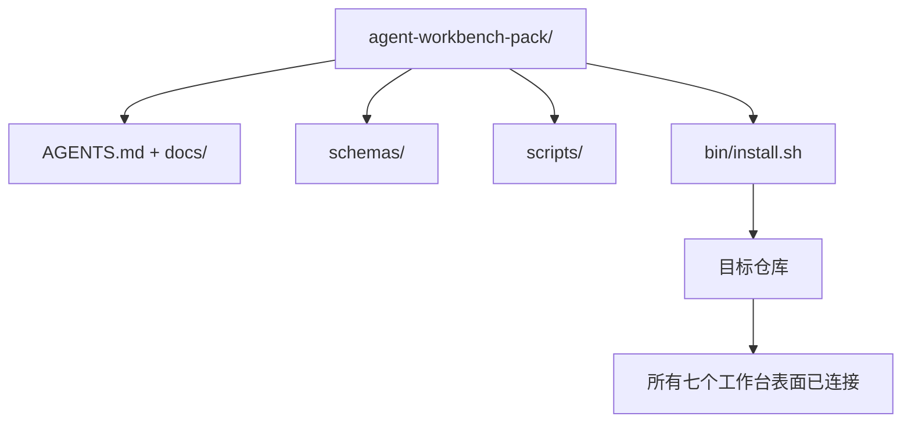

# 终章：发布可重用的智能体工作台包（Capstone: Ship a Reusable Agent Workbench Pack）

> 小型课程轨以一个你放入任何仓库的包结束。十一节课的表面压缩成一个你可以 `cp -r` 的目录，第二天早上就能让智能体可靠地工作。这个终章就是这门课程交付的工件。

**类型：** 构建  
**语言：** Python（标准库）  
**前置知识：** Phase 14 · 31 到 Phase 14 · 41  
**预计时间：** 约 75 分钟

## 学习目标

- 将七个工作台表面打包成一个即插即用的目录。
- 固定模式、脚本和模板，使新仓库获得已知良好的基线。
- 添加一个幂等地安装包的单一安装程序脚本。
- 决定什么留在包里、什么留在包外，为每个决定辩护。

## 问题所在

一个存在于 Google Doc、聊天历史和三个半记忆脚本中的工作台，是一个每季度都要重建的工作台。解决方法是一个版本化的包：一个带有表面、模式、脚本和一键安装程序的仓库或目录。

本课结束时，你将在磁盘上发布 `outputs/agent-workbench-pack/` 和一个将其放入任何目标仓库的 `bin/install.sh`。

## 核心概念



### 包布局

```
outputs/agent-workbench-pack/
├── AGENTS.md
├── docs/
│   ├── agent-rules.md
│   ├── reliability-policy.md
│   ├── handoff-protocol.md
│   └── reviewer-rubric.md
├── schemas/
│   ├── agent_state.schema.json
│   ├── task_board.schema.json
│   └── scope_contract.schema.json
├── scripts/
│   ├── init_agent.py
│   ├── run_with_feedback.py
│   ├── verify_agent.py
│   └── generate_handoff.py
├── bin/
│   └── install.sh
└── README.md
```

### 什么留在包里，什么留在包外

留在包里：

- 表面模式。它们是契约。
- 上述四个脚本。它们是运行时。
- 四份文档。它们是规则和评分标准。

留在包外：

- 特定于项目的任务。任务属于目标仓库的板，而不是包。
- 供应商 SDK 调用。包与框架无关。
- 入职散文。包与团队现有的入职材料并列，而非包含在其中。

### 安装程序

一个简短的 `bin/install.sh`（或 `bin/install.py`）：

1. 拒绝在没有 `--force` 的情况下在现有包上安装。
2. 将包复制到目标仓库。
3. 如果存在 `.github/workflows/`，连接 CI。
4. 打印后续步骤：填充板、设置验收命令、运行初始化脚本。

### 版本控制

包携带一个 `VERSION` 文件。需要迁移的模式升级和脚本更改会升级主版本号。仅文档更改升级补丁号。目标仓库的 `agent_state.json` 记录它是针对哪个包版本初始化的。

## 构建它

`code/main.py` 将包组装到课程旁边的 `outputs/agent-workbench-pack/` 中，使用来自这个小型课程轨前几节课的模式和脚本，以及你已经写好的文档。

运行：

```
python3 code/main.py
```

脚本复制并固定表面，写入 README，打印包树，以零退出。重新运行是幂等的。

## 野外的生产模式

包只有在能在分叉、更新和不友好的上游中存活时才有价值。四种模式使其有效。

**`VERSION` 是契约，而非营销。** 主版本升级需要状态迁移。次版本升级需要重新运行检查器。补丁升级仅是文档。安装程序在每次安装时将 `.workbench-version` 写入目标仓库；`lint_pack.py` 如果目标的锁与包的 `VERSION` 不一致则拒绝发布。这是 `npm`、`Cargo` 和 `pyproject.toml` 在 10 年变化中存活的方式；关于智能体的任何事情都不会改变规则。

**跨工具分发的单一来源。** Nx 提供一个 `nx ai-setup`，从单一配置铺设 `AGENTS.md`、`CLAUDE.md`、`.cursor/rules/`、`.github/copilot-instructions.md` 和 MCP 服务器。包应该做同样的事；安装程序发出符号链接（`ln -s AGENTS.md CLAUDE.md`），这样一个真相来源扇出到每个编码智能体。为支持一个工具而非另一个而分叉包是一种失败模式。

**`uninstall.sh` 在非平凡状态下拒绝。** 卸载包不得删除用户的 `agent_state.json`、`task_board.json` 或 `outputs/`。卸载程序删除模式、脚本、文档和 `AGENTS.md`（带 `--keep-agents-md` 退出选项），如果状态文件有任何未提交的更改则拒绝继续。状态属于用户；包不拥有它。

**技能即可发布。SkillKit 风格分发。** 包作为 SkillKit 技能发布：`skillkit install agent-workbench-pack` 从单一来源在 32 个 AI 智能体上铺设它。包仓库是真相来源；SkillKit 是分发渠道。供应商锁定崩溃；七个表面保持不变。

## 使用它

包发布的三个地方：

- **作为你放入仓库的目录。** `cp -r outputs/agent-workbench-pack /path/to/repo`。
- **作为公共模板仓库。** Fork 并自定义，用 `VERSION` 控制漂移。
- **作为 SkillKit 技能。** 连接到你的智能体产品，这样一个命令就铺设它。

包是配方。每次安装都是一份。

## 交付它

`outputs/skill-workbench-pack.md` 生成一个项目调整的包：规则针对团队历史锐化，范围 Glob 与仓库匹配，评分标准维度扩展了一个领域特定条目。

## 练习

1. 决定哪个可选的第五份文档值得升级到规范包中。为这个决定辩护。
2. 将安装程序重写为带有 `--dry-run` 标志的 Python。与 bash 相比较人机工程学。
3. 添加一个 `bin/uninstall.sh`，安全地删除包，如果状态文件有非平凡历史则拒绝。什么算作非平凡？
4. 添加一个 `lint_pack.py`，当包偏离 `VERSION` 时失败。将其连接到包自己仓库的 CI 中。
5. 编写从手工工作台到这个包的迁移运行手册。最小化停机时间的操作顺序是什么？

## 关键术语

| 术语 | 通俗说法 | 准确含义 |
|------|----------|----------|
| Workbench pack（工作台包） | "入门套件" | 携带所有七个表面的版本化目录 |
| Installer（安装程序） | "设置脚本" | `bin/install.sh`，幂等地铺设包 |
| Pack version（包版本） | "VERSION" | 模式/脚本更改升级主版本，仅文档升级补丁 |
| Drop-in pack（即插即用包） | "cp -r 即可" | 包在第一天无需每仓库自定义即可工作 |
| Forkable template（可分叉模板） | "GitHub 模板" | 公共仓库，GitHub 的"使用此模板"可以从中克隆 |

## 延伸阅读

- Phase 14 · 31 到 Phase 14 · 41 — 此包捆绑的每个表面
- [SkillKit](https://github.com/rohitg00/skillkit) — 在 32 个 AI 智能体上安装此技能
- [Nx Blog，教你的 AI 智能体如何在单体仓库中工作](https://nx.dev/blog/nx-ai-agent-skills) — 跨六个工具的单一来源生成器
- [agents.md — 开放规范](https://agents.md/) — 你的包路由器必须实现的内容
- [HKUDS/OpenHarness](https://github.com/HKUDS/OpenHarness) — 等效包的参考实现
- [andrewgarst/agentic_harness](https://github.com/andrewgarst/agentic_harness) — 带评估套件的 Redis 支持参考
- [Augment Code，好的 AGENTS.md 是模型升级](https://www.augmentcode.com/blog/how-to-write-good-agents-dot-md-files) — 包文档质量标准
- [Anthropic，长时间运行智能体的有效框架](https://www.anthropic.com/engineering/effective-harnesses-for-long-running-agents)
- [Anthropic，长期运行应用程序开发的框架设计](https://www.anthropic.com/engineering/harness-design-long-running-apps)
- Phase 14 · 30 — 消费包的验证门控的评估驱动智能体开发
- Phase 14 · 41 — 此包改进的前后基准
