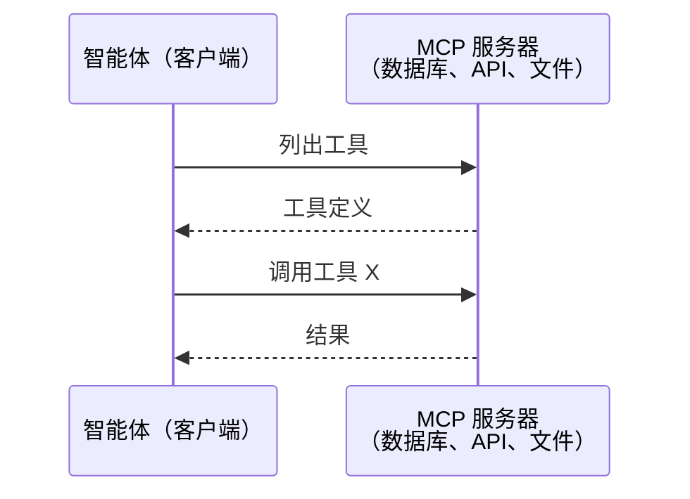
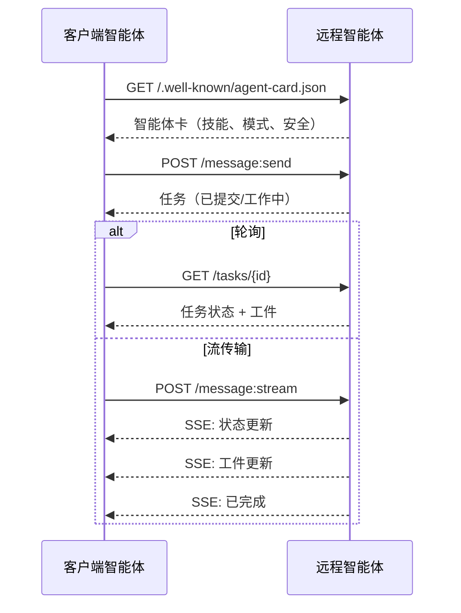
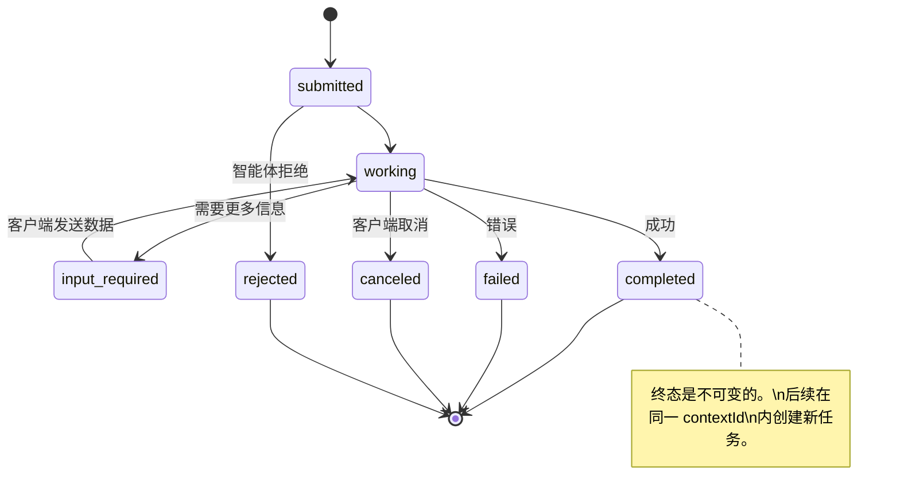
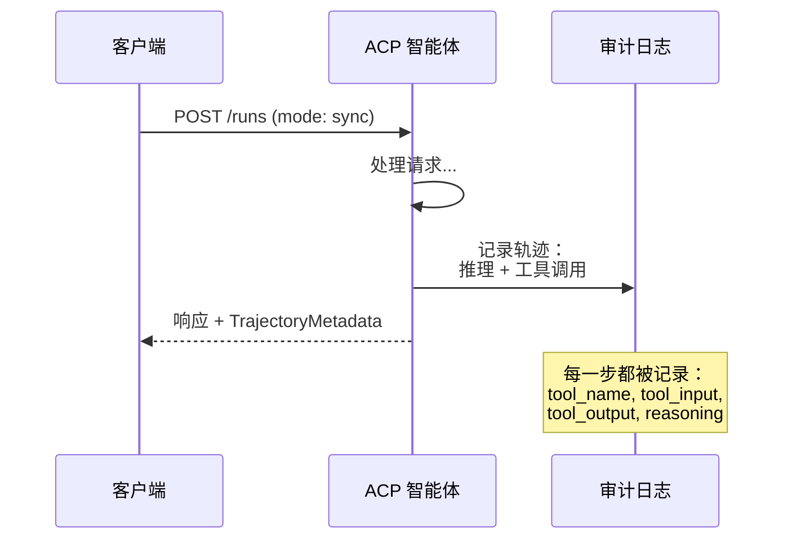
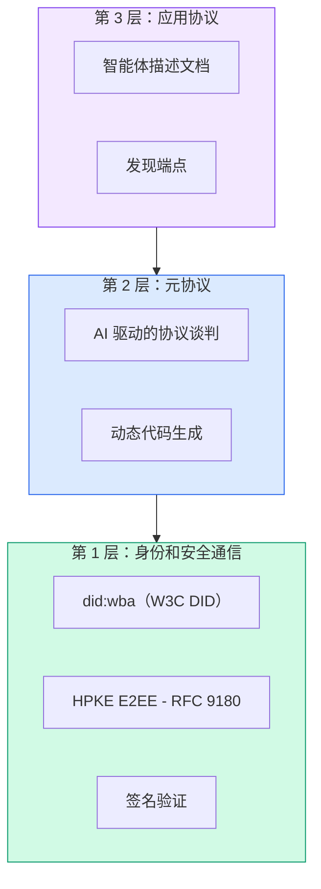
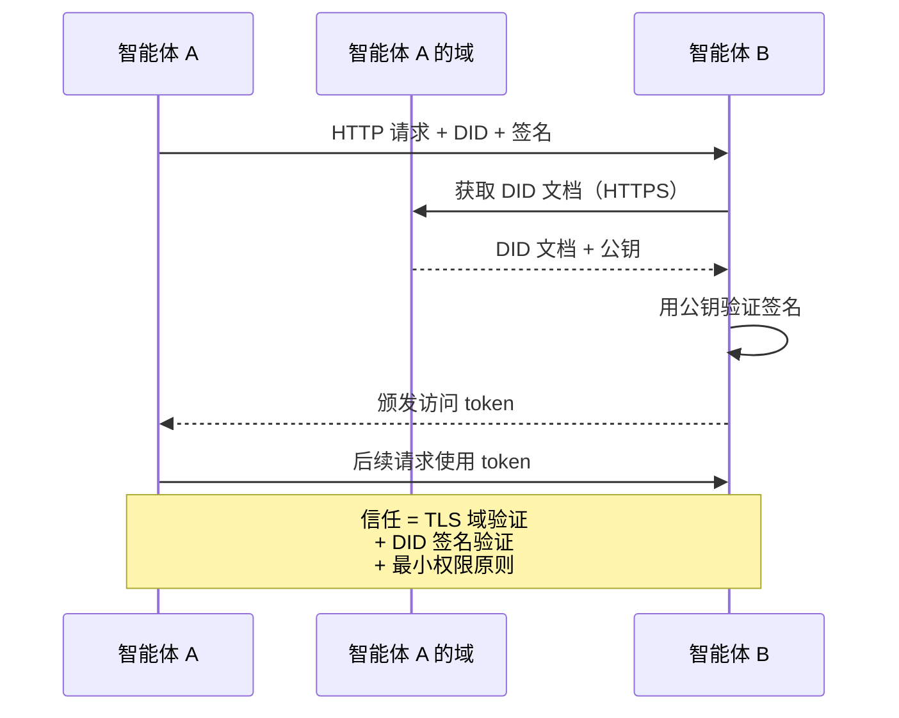
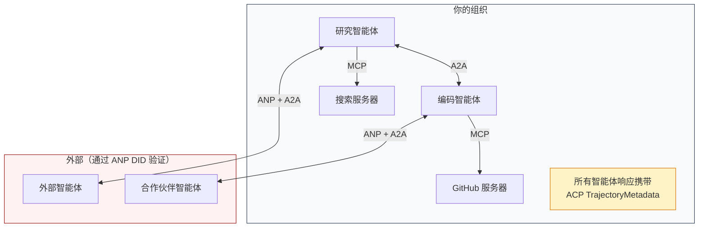
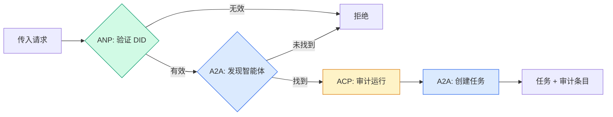
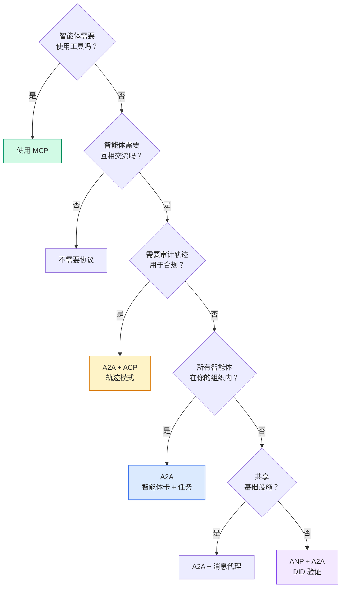

# 通信协议（Communication Protocols）

> 无法说同一种语言的智能体不是一个团队。它们只是陌生人对着虚空呐喊。

**类型：** 构建  
**语言：** TypeScript  
**前置知识：** Phase 14（智能体工程）、第 16.01 课（为什么需要多智能体）  
**预计时间：** 约 120 分钟

## 学习目标

- 实现 MCP 工具发现和调用，使智能体可以使用外部服务器暴露的工具
- 构建 A2A 智能体卡和任务端点，允许一个智能体通过 HTTP 向另一个委托工作
- 比较 MCP（工具访问）、A2A（智能体对智能体）、ACP（企业审计）和 ANP（去中心化信任），并解释哪个协议解决哪个问题
- 将多个协议连接到一个系统中，其中智能体通过 MCP 发现工具并通过 A2A 委托任务

## 问题所在

你将系统拆分为多个智能体：研究员、编码员、审查者。它们各自擅长自己的工作。但现在你需要让它们实际互相交流。

你的第一次尝试很明显：传递字符串。研究员返回一大段文本，编码员尽其所能地解析它。这行得通，直到编码员误解了研究摘要，或两个智能体互相等待陷入死锁，或者你需要不同团队构建的智能体协作。突然间"只是传递字符串"就崩溃了。

这是通信协议问题。没有智能体如何交换信息的共享契约，多智能体系统是脆弱的、不可审计的，并且无法扩展到超出你亲自编写的少数几个智能体。

AI 生态系统用四种协议响应了这一需求，每种解决问题的不同片段：

- **MCP** 用于工具访问
- **A2A** 用于智能体对智能体协作
- **ACP** 用于企业可审计性
- **ANP** 用于去中心化身份和信任

## 核心概念

### 协议格局

将这四种协议视为层次，每层解决不同的问题：

```mermaid
block-beta
  columns 1
  block:ANP["ANP — 智能体如何信任陌生人？\n去中心化身份（DID）、E2EE、元协议"]
  end
  block:A2A["A2A — 智能体如何在目标上协作？\n智能体卡、任务生命周期、流传输、谈判"]
  end
  block:ACP["ACP — 智能体如何在可审计系统中通信？\n运行、轨迹元数据、会话连续性"]
  end
  block:MCP["MCP — 智能体如何使用工具？\n工具发现、执行、上下文共享"]
  end

  style ANP fill:#f3e8ff,stroke:#7c3aed
  style A2A fill:#dbeafe,stroke:#2563eb
  style ACP fill:#fef3c7,stroke:#d97706
  style MCP fill:#d1fae5,stroke:#059669
```

它们不是竞争者。它们在不同层次解决不同的问题。

### MCP（回顾）

MCP 在 Phase 13 中深入介绍。快速回顾：MCP 标准化了 LLM 如何连接到外部工具和数据源。它是一个**客户端-服务器**协议，智能体（客户端）发现并调用服务器暴露的工具。



MCP 是**智能体对工具**通信。它不帮助智能体互相交流。

### A2A（智能体对智能体协议）

**创建者：** Google（现在在 Linux Foundation 下为 `lf.a2a.v1`）  
**规范版本：** 1.0.0  
**问题：** 自主智能体如何协作、谈判和互相委托任务？

A2A 是**点对点智能体协作**协议。MCP 将智能体连接到工具，A2A 将智能体连接到其他智能体。每个智能体在知名 URL 发布**智能体卡**，其他智能体通过它发现、谈判并委托任务。

#### A2A 如何工作



#### 真实的智能体卡

这是真实环境中 A2A 智能体卡的样子。在 `GET /.well-known/agent-card.json` 提供：

```json
{
  "name": "Research Agent",
  "description": "Searches documentation and summarizes findings",
  "version": "1.0.0",
  "supportedInterfaces": [
    {
      "url": "https://research-agent.example.com/a2a/v1",
      "protocolBinding": "JSONRPC",
      "protocolVersion": "1.0"
    }
  ],
  "provider": {
    "organization": "Your Company",
    "url": "https://example.com"
  },
  "capabilities": {
    "streaming": true,
    "pushNotifications": false
  },
  "defaultInputModes": ["text/plain", "application/json"],
  "defaultOutputModes": ["text/plain", "application/json"],
  "skills": [
    {
      "id": "web-research",
      "name": "Web Research",
      "description": "Searches the web and synthesizes findings",
      "tags": ["research", "search", "summarization"]
    }
  ],
  "securitySchemes": {
    "bearer": {
      "httpAuthSecurityScheme": {
        "scheme": "Bearer",
        "bearerFormat": "JWT"
      }
    }
  },
  "security": [{ "bearer": [] }]
}
```

注意事项：
- **技能**是智能体能做的事。每个都有 ID、标签和支持的输入/输出 MIME 类型。这是客户端智能体决定这个远程智能体是否能处理其请求的方式。
- **supportedInterfaces** 列出多个协议绑定。单个智能体可以同时支持 JSON-RPC、REST 和 gRPC。
- **安全**内置于卡中。客户端在发出任何请求之前就知道需要什么认证。

#### 任务生命周期

任务是 A2A 中的核心工作单元。它们通过定义的状态移动：



所有 8 种状态：

| 状态 | 是终态？ | 含义 |
|------|---------|------|
| `TASK_STATE_SUBMITTED` | 否 | 已确认，尚未处理 |
| `TASK_STATE_WORKING` | 否 | 正在主动处理 |
| `TASK_STATE_INPUT_REQUIRED` | 否 | 智能体需要更多来自客户端的信息 |
| `TASK_STATE_AUTH_REQUIRED` | 否 | 需要认证 |
| `TASK_STATE_COMPLETED` | 是 | 成功完成 |
| `TASK_STATE_FAILED` | 是 | 以错误结束 |
| `TASK_STATE_CANCELED` | 是 | 在完成前被取消 |
| `TASK_STATE_REJECTED` | 是 | 智能体拒绝了任务 |

一旦任务达到终态，它是不可变的。没有进一步的消息。后续操作在同一 `contextId` 内创建新任务。

### ACP（智能体通信协议）

**创建者：** IBM / BeeAI  
**规范版本：** 0.2.0（OpenAPI 3.1.1）  
**状态：** 在 Linux Foundation 下合并到 A2A  
**问题：** 智能体如何以完全可审计性、会话连续性和轨迹追踪进行通信？

ACP 是**企业协议**。它的关键差异化是 **TrajectoryMetadata**：每个智能体响应都可以携带产生它的推理步骤和工具调用的详细日志。



**TrajectoryMetadata（审计轨迹）示例：**

```json
{
  "role": "agent/researcher",
  "parts": [
    {
      "content_type": "text/plain",
      "content": "旧金山的天气是 72F，晴天。",
      "metadata": {
        "kind": "trajectory",
        "message": "我需要检查这个位置的天气",
        "tool_name": "weather_api",
        "tool_input": { "location": "San Francisco, CA" },
        "tool_output": { "temperature": 72, "condition": "sunny" }
      }
    }
  ]
}
```

对于受监管行业，这是黄金标准。每个答案都附带可证明的推理链：调用了哪些工具、使用了什么输入、收到了什么输出。没有黑盒。

### ANP（智能体网络协议）

**创建者：** 开源社区  
**问题：** 来自不同组织的智能体如何在没有中央权威的情况下互相信任？

ANP 是**去中心化身份协议**。它使用 W3C 去中心化标识符（DID）和端到端加密构建信任。ANP 有三层：



**ANP 信任工作方式：**



ANP 最新颖的特性是**元协议谈判**：当来自不同生态系统的两个智能体相遇时，它们无需预先商定数据格式，可以用自然语言谈判并动态生成代码来处理商定的格式。

### 协议比较

| | MCP | A2A | ACP | ANP |
|---|---|---|---|---|
| **创建者** | Anthropic | Google / Linux Foundation | IBM / BeeAI | 社区 |
| **规范格式** | JSON-RPC | JSON-RPC / REST / gRPC | OpenAPI 3.1（REST） | JSON-RPC |
| **主要用途** | 智能体对工具 | 智能体对智能体 | 智能体对智能体 | 智能体对智能体 |
| **发现** | 工具列表 | `/.well-known/agent-card.json` | `GET /agents`，`/.well-known/agent.yml` | DID 服务端点 |
| **身份** | 隐式（本地） | 安全方案（OAuth、mTLS） | 服务器级别 | W3C DID（`did:wba`）+ E2EE |
| **审计轨迹** | 无 | 基本（任务历史） | TrajectoryMetadata（工具调用、推理） | 未正式规定 |
| **独特功能** | 工具模式 | 智能体卡 + 技能 | 轨迹审计轨迹 | 元协议谈判 |
| **最适用于** | 工具和数据 | 动态协作 | 受监管行业 | 跨组织信任 |

### 四种协议如何协同工作



- **MCP** 将每个智能体连接到其工具
- **A2A** 处理智能体之间的协作（内部和外部）
- **ACP** 将响应包装在轨迹元数据中以供审计
- **ANP** 为你不控制的智能体提供身份验证

## 构建它

### 步骤 1：核心消息类型

```typescript
import crypto from "node:crypto";

type MessageRole = "user" | "agent";

type MessagePart =
  | { kind: "text"; text: string }
  | { kind: "data"; data: unknown; mediaType: string }
  | { kind: "file"; name: string; url: string; mediaType: string };

type TrajectoryEntry = {
  reasoning: string;
  toolName?: string;
  toolInput?: unknown;
  toolOutput?: unknown;
  timestamp: number;
};

type AgentMessage = {
  id: string;
  role: MessageRole;
  parts: MessagePart[];
  trajectory?: TrajectoryEntry[];
  replyTo?: string;
  timestamp: number;
};

function createMessage(
  role: MessageRole,
  parts: MessagePart[],
  replyTo?: string
): AgentMessage {
  return {
    id: crypto.randomUUID(),
    role,
    parts,
    replyTo,
    timestamp: Date.now(),
  };
}

function textMessage(role: MessageRole, text: string): AgentMessage {
  return createMessage(role, [{ kind: "text", text }]);
}
```

### 步骤 2：A2A 智能体卡和注册表

```typescript
type Skill = {
  id: string;
  name: string;
  description: string;
  tags: string[];
  inputModes: string[];
  outputModes: string[];
};

type AgentCard = {
  name: string;
  description: string;
  version: string;
  url: string;
  capabilities: {
    streaming: boolean;
    pushNotifications: boolean;
  };
  defaultInputModes: string[];
  defaultOutputModes: string[];
  skills: Skill[];
};

class AgentRegistry {
  private cards: Map<string, AgentCard> = new Map();

  register(card: AgentCard) {
    this.cards.set(card.name, card);
  }

  discoverBySkillTag(tag: string): AgentCard[] {
    return [...this.cards.values()].filter((card) =>
      card.skills.some((skill) => skill.tags.includes(tag))
    );
  }

  resolve(name: string): AgentCard | undefined {
    return this.cards.get(name);
  }
}
```

### 步骤 3：A2A 任务生命周期

```typescript
type TaskState =
  | "submitted"
  | "working"
  | "input-required"
  | "auth-required"
  | "completed"
  | "failed"
  | "canceled"
  | "rejected";

const TERMINAL_STATES: TaskState[] = [
  "completed",
  "failed",
  "canceled",
  "rejected",
];

type Task = {
  id: string;
  contextId: string;
  status: { state: TaskState; message?: AgentMessage; timestamp: number };
  artifacts: { id: string; name: string; parts: MessagePart[] }[];
  history: AgentMessage[];
};

type TaskEvent =
  | { kind: "statusUpdate"; taskId: string; status: Task["status"] }
  | {
      kind: "artifactUpdate";
      taskId: string;
      artifact: Task["artifacts"][0];
      append: boolean;
      lastChunk: boolean;
    };

type TaskHandler = (
  task: Task,
  message: AgentMessage
) => AsyncGenerator<TaskEvent>;
```

完整的 `TaskManager` 实现处理全部任务状态机：提交、工作、输入-必需、终态。处理器是异步生成器，产生与 SSE 流传输模型匹配的事件（状态更新和工件块）。

### 步骤 4：ACP 风格审计轨迹

```typescript
type AuditEntry = {
  runId: string;
  agentName: string;
  input: AgentMessage[];
  output: AgentMessage[];
  trajectory: TrajectoryEntry[];
  status: "created" | "in-progress" | "completed" | "failed" | "awaiting";
  startedAt: number;
  completedAt?: number;
  sessionId?: string;
};
```

每次智能体执行都产生一个完整的审计条目：什么进来了，什么出去了，以及中间工具调用和推理步骤的完整轨迹。可以按智能体、按会话或按单个运行查询。

### 步骤 5：ANP 风格身份验证

```typescript
function createIdentity(domain: string, agentName: string): AgentIdentity {
  const did = `did:wba:${domain}:agent:${agentName}`;
  const { publicKey, privateKey } = crypto.generateKeyPairSync("ed25519");

  // ... 创建 DID 文档，包含认证密钥和密钥协商密钥
  return { did, document, privateKey, publicKey };
}

function signPayload(identity: AgentIdentity, payload: string): string {
  return crypto
    .sign(null, Buffer.from(payload), identity.privateKey)
    .toString("hex");
}
```

### 步骤 6：协议网关



网关在一次调用中做四件事：
1. **ANP**：通过 DID 签名验证调用者身份
2. **A2A**：发现目标智能体并检查能力
3. **ACP**：用审计轨迹包装执行
4. **A2A**：创建带完整生命周期追踪的任务

## 会出什么问题

**模式漂移。** 智能体 A 的智能体卡宣传 `application/json` 输出，但 JSON 模式在版本间变化。智能体 B 解析旧格式并得到垃圾。修复：对技能和输出模式进行版本控制。

**状态机违规。** 智能体处理器产生 `completed` 事件，然后尝试产生更多工件。任务是不可变的。修复：在产生之前检查终态。

**信任解析失败。** 智能体 A 尝试验证智能体 B 的 DID，但智能体 B 的域宕机了。ANP 建议失败关闭（拒绝一切）而非失败开放。

**轨迹膨胀。** ACP 轨迹日志功能强大但昂贵。每次运行 200 次工具调用的复杂智能体会产生大量审计条目。修复：以可配置的详细程度记录轨迹。

## 使用它

### 协议选择



## 练习

1. **多跳任务委托。** 扩展 `TaskManager` 使智能体处理器可以将子任务委托给其他智能体。研究员接收任务，将"搜索"和"总结"子任务委托给两个专家智能体，等待两者完成，然后将结果合并到自己的工件中。

2. **流传输审计轨迹。** 修改 `AuditableRunner` 以支持流传输模式。不是等待完整结果，而是在实时添加轨迹条目时产生 `AuditEntry` 更新。

3. **DID 轮换。** 向 `IdentityRegistry` 添加密钥轮换。智能体应该能够在维护 `previousDid` 引用的同时发布带更新密钥的新 DID 文档。

4. **协议谈判。** 实现 ANP 的元协议概念。两个智能体交换带候选格式的 `protocolNegotiation` 消息，最多 3 轮后达成一致或超时。

5. **速率限制发现。** 添加带可配置 TTL 的 `RateLimitedRegistry` 包装器并限制每个智能体每秒的发现查询。模拟 100 个智能体在启动时互相发现的雷群效应并测量差异。

## 关键术语

| 术语 | 通俗说法 | 准确含义 |
|------|----------|----------|
| MCP | "AI 工具协议" | 智能体发现和使用工具的客户端-服务器协议。智能体对工具，而非智能体对智能体。 |
| A2A | "Google 的智能体协议" | Linux Foundation 下智能体协作的点对点协议。通过智能体卡发现，9 态任务生命周期，SSE 流传输。 |
| ACP | "企业智能体消息" | IBM/BeeAI 的带 TrajectoryMetadata 的智能体运行 REST API：每个响应携带推理和工具调用的完整链。合并到 A2A。 |
| ANP | "去中心化智能体身份" | 使用 `did:wba`（DID）进行加密身份，HPKE 用于 E2EE，AI 驱动的元协议谈判。 |
| Agent Card（智能体卡） | "智能体的名片" | `/.well-known/agent-card.json` 处的 JSON 文档，描述技能、支持的 MIME 类型、安全方案和协议绑定。 |
| DID | "去中心化 ID" | W3C 加密可验证身份标准，托管在智能体自己的域上。ANP 使用 `did:wba` 方法。 |
| TrajectoryMetadata | "审计收据" | ACP 的机制，将推理步骤、工具调用及其输入/输出附加到每个智能体响应。 |
| Meta-protocol（元协议） | "智能体谈判如何交流" | ANP 的方法，智能体使用自然语言动态商定数据格式，然后生成代码处理它们。 |
| Task（任务） | "工作单元" | A2A 的有状态对象，从提交到完成追踪工作。一旦终态则不可变。 |

## 延伸阅读

- [Google A2A 规范](https://github.com/google/A2A) — 官方规范和 SDK（v1.0.0，Linux Foundation）
- [IBM/BeeAI ACP 规范](https://github.com/i-am-bee/acp) — 智能体运行和轨迹元数据的 OpenAPI 3.1 规范
- [智能体网络协议](https://github.com/agent-network-protocol/AgentNetworkProtocol) — 基于 DID 的身份、E2EE、元协议谈判
- [Model Context Protocol 文档](https://modelcontextprotocol.io/) — Anthropic 的 MCP 规范（Phase 13 介绍）
- [W3C 去中心化标识符](https://www.w3.org/TR/did-core/) — 支撑 ANP 的身份标准
