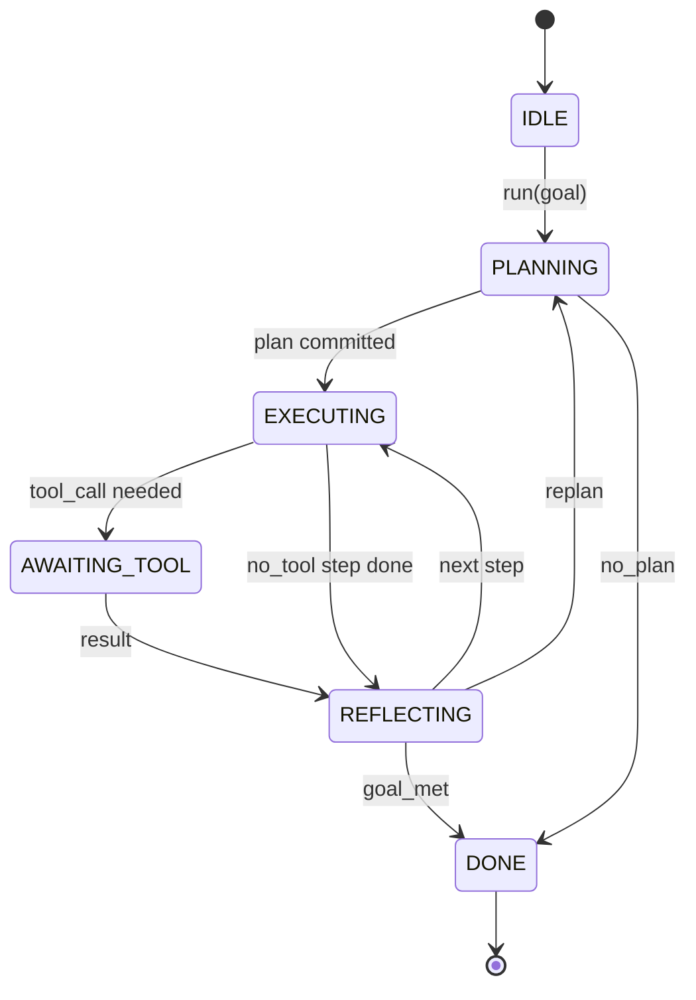

# 智能体测试框架循环契约（Agent Harness Loop Contract）

> 测试框架就是智能体。模型是协处理器。本课冻结了你可以将任何模型连接进来的循环契约。

**类型：** 构建  
**语言：** Python  
**前置知识：** Phase 13 第 01-07 课，Phase 14 第 01 课  
**预计时间：** 约 90 分钟

## 学习目标
- 将智能体测试框架循环指定为带显式转换的确定性状态机。
- 实现十个生命周期钩子主题，运营者可将策略、遥测和护栏连接进来。
- 定义两个拉取点，循环在这里将控制权交回调用者并在新的输入上恢复。
- 在超出时不泄露部分状态的情况下执行每会话预算（轮次、工具调用、挂钟时间）。
- 发送十一种事件类型的类型化流，使下游 UI 和追踪器可以订阅而无需直接检查循环。

## 框架

一个无人值守运行 40 轮的编程智能体不是聊天循环。它是一个状态机，其节点可以被运营者拦截，其边可以被运营者审计。一旦你写下契约，交换模型、工具或策略就不再是重构，而变成了注册调用。

本课构建了这个契约。我们命名了六个状态、十个钩子主题、两个拉取点、十一种事件类型和一个预算信封。测试框架中的其他所有内容（工具注册表、JSON-RPC 传输、调度器、规划器）都接入这个形状。

## 状态

循环有六个状态。五个是活跃的。一个是终止的。



`IDLE` 是唯一合法的入口点。`DONE` 是唯一合法的出口。`AWAITING_TOOL` 是唯一产生拉取点的状态。其他每个转换都是内部的。

状态机是确定性的。给定相同的事件日志，测试框架重新进入相同的状态。这个属性使你可以在不重新调用模型的情况下重放会话进行调试。

## 钩子主题

钩子是运营者进入循环的接口。测试框架触发十个主题。每个主题接受任意数量的订阅者。订阅者按注册顺序触发。订阅者可以修改有效负载、引发异常以中止轮次，或返回哨兵值以跳过下一步。

```text
before_plan         after_plan
before_tool_call    after_tool_call
before_step         after_step
on_error
on_pause
on_budget_exceeded
on_complete
```

这个形状反映了 Claude Code、Cursor 和 OpenCode 在 2025 年中期都收敛到的形态。名称是功能性的，不是品牌化的。阻止 `rm -rf` 的钩子位于 `before_tool_call`。发送 OpenTelemetry span 的钩子位于 `after_step`。在暂停会话上恢复的钩子位于 `on_pause`。

## 拉取点

循环两次交出控制权。第一次是在 `AWAITING_TOOL` 时，此时没有工具结果就无法继续。第二次是在 `on_pause` 时，此时预算耗尽或钩子明确请求人工审查。

拉取点不是异常。它是一个返回。调用者检查测试框架状态，获取测试框架请求的任何内容，并调用 `resume(payload)`。测试框架从停止的地方继续。这与 Python 生成器的形状相同。拉取点上的传输是你的选择。在 TUI 中是按键。在 MCP 上是 `tools/call`。在队列上是任务轮询。

## 事件流

循环在契约中的特定点将事件追加到类型化流中。流是仅追加的，订阅者可以从任何偏移量重放。十一种实现的事件类型是：

- `session.start` — 调用 `run(goal)` 时发出一次
- `plan.draft` — 规划器返回草稿计划时发出
- `plan.commit` — 草稿作为活跃计划提交后发出
- `step.start` — 每个执行步骤开始时发出
- `step.end` — 每个执行步骤结束时发出
- `tool.call` — 需要工具的步骤向调用者交出控制权时发出
- `tool.result` — 带工具结果恢复时发出
- `tool.error` — 带错误恢复或钩子中止调用时发出
- `budget.warn` — 达到预算限制时发出
- `session.pause` — 循环在暂停时交出控制权时发出（预算或钩子）
- `session.complete` — 循环到达 `DONE` 时发出一次

事件不复制钩子有效负载。钩子是命令式的（修改，中止）。事件是观察性的（记录，发送）。将它们视为正交的。

## 预算信封

会话携带三个限制：轮次数、工具调用数、挂钟秒数。每个轮次使轮次数加一。每次工具调用使工具调用数加一。在每次状态转换时检查挂钟时间。当任何限制达到时，循环触发 `on_budget_exceeded`，发出 `budget.warn`，然后在下一个拉取点以预算超出原因转换到 `IDLE`。

预算不是停止开关。它是一个交出控制权。调用者决定是否扩展预算并恢复，或关闭会话。

## 本课不做什么

它不调用模型。它不注册真实工具。它不实现传输。这些是接下来的四课。本课确定了契约，以便接下来的四课可以接入而无需重写。

`main.py` 中的确定性规划器是一个替身。它返回一个包含三个步骤的硬编码计划，其中两个需要工具结果。重点是循环，而非计划。

## 如何阅读代码

`HarnessLoop` 是主类。它保存状态，触发钩子，发出事件。`Budget` 追踪限制。`Event` 是流上的类型化信封。`HookRegistry` 是分发表。`_transition` 是唯一改变状态的函数，所以状态机不变量集中在一个地方。

从上到下阅读 `main.py`。然后阅读 `code/tests/test_loop.py`。测试固定了每次转换和每次钩子触发顺序。

## 进一步探索

在生产中构建测试框架的最难部分不是状态机。而是使契约可执行。契约必须在规划器热重载后存活。必须在工具返回格式错误的 JSON 后存活。必须在钩子在 40 轮会话进行三分之二时在 `before_tool_call` 中引发异常后存活。本课中的测试练习了这些失败模式。运行它们。打破它们。添加案例。

下一课添加工具注册表。之后是 JSON-RPC 传输。之后是调度器。到第 24 课，本文件中的循环将针对真实工具执行真实计划，强制执行真实预算。
