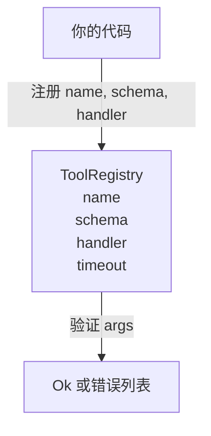

# 带 Schema 验证的工具注册表（Tool Registry with Schema Validation）

> 智能体无法验证的工具就是智能体无法调用的工具。在构建工具之前先构建注册表和 schema 检查器。

**类型：** 构建  
**语言：** Python  
**前置知识：** Phase 13 第 01-07 课，Phase 14 第 01 课  
**预计时间：** 约 90 分钟

## 学习目标
- 保存工具名称 → schema → 处理器的类型化注册表，调度器可以查询一次后信任它。
- 实现覆盖 90% 工具调用实际使用关键字的 JSON Schema 2020-12 子集。
- 返回精确的 json-pointer 形状的错误路径，使模型可以在一轮往返中自我纠正。
- 拒绝未明确覆盖的重新注册，因为静默覆写是生产工具目录漂移的原因。
- 保持验证器纯粹（无 I/O、无时间、无全局变量），使其可以在重放日志上重新运行。

## 为什么注册表在工具之前

2026 年的编程智能体有比模型在单个上下文窗口中能容纳的更多已注册工具。非平凡的测试框架会注册 200 个工具，在任何给定轮次中呈现 10 到 40 个。注册表是"有哪些工具存在"、"其参数采用什么形状"以及"我调用哪个处理器"的真相来源。一旦这三个答案被固定，测试框架的其余部分就可以停止猜测了。

我们要避免的错误是在没有 schema 的情况下发布处理器，或在没有验证的情况下发布 schema。两者都很常见。两者都将下一层（第 23 课的调度器）变成一个猜谜游戏，唯一的失败模式是来自处理器的堆栈跟踪。

## 工具记录的样子

```text
ToolRecord
  name        : str          (唯一，小写字母数字和下划线段，用点分隔，如 snake_case.segment.case)
  description : str          (一行，显示给模型)
  schema      : dict         (JSON Schema 2020-12 子集)
  handler     : Callable     (异步或同步，返回 Any)
  idempotent  : bool         (调度器用于重试决策)
  timeout_ms  : int          (每工具覆盖调度器默认值)
```

schema 是验证器唯一触及的字段。处理器对其不透明。我们故意将它们分离。schema 是数据。处理器是代码。将它们混合会诱使你将验证逻辑放在处理器内，这正是我们要阻止的 bug。

## JSON Schema 2020-12 子集

完整的 2020-12 规范是一篇论文。我们需要八个关键字。

```text
type           string / number / integer / boolean / object / array / null
properties     属性名 -> schema 的映射
required       属性名列表
enum           允许的原始值列表
minLength      整数，适用于字符串
maxLength      整数，适用于字符串
pattern        ECMA-262 兼容正则表达式，适用于字符串
items          应用于每个数组元素的 schema
```

这足以覆盖工具 API 实际需要的内容。我们不添加的关键字（oneOf、anyOf、allOf、$ref、条件）在生产 schema 中是有效的，但会将验证器变成带循环的树遍历器。我们在构建注册表，而非 JSON Schema 引擎。

## Json pointer 错误路径

当验证失败时，验证器返回错误列表。每个错误携带一个进入输入的 json-pointer 路径。指针是斜杠前缀的属性名和数组索引序列。

```text
{"a": {"b": [1, 2, "x"]}}
                    ^
                    /a/b/2
```

模型阅读错误路径比阅读句子更好。如果 schema 要求 `args.user.email` 而模型传了整数，错误应该是 `/user/email`，带 `expected_type: string`。模型在下一次调用中无需自然语言往返就能修复这个问题。

## 注册和覆盖

`register(name, schema, handler, **opts)` 默认拒绝重新注册。调用者必须传入 `override=True` 才能替换。这是运营卫生。代码库的两个部分静默注册同一工具名称是那种在生产中需要一周才能找到的 bug。

注册表暴露三种读取方法。`get(name)` 返回记录或引发异常。`validate(name, args)` 返回 `Ok` 或错误列表。`names()` 按注册顺序返回工具名称。

## 验证器是什么，不是什么

它是对 schema 树的单次遍历，递归的。它是纯粹的。它不调用处理器。它不强制转换类型（字符串 `"42"` 不通过数字 schema）。它不静默截断。

它不是安全边界。恶意处理器在验证通过后仍然可能行为异常。第 23 课的调度器添加了超时和沙箱层。注册表添加形状。

## 形状



## 如何阅读代码

`code/main.py` 定义了 `ToolRegistry`、`ToolRecord`、`ValidationError` 和八个验证器函数。验证器在 `schema["type"]`（或将带 `enum` 的 schema 视为无类型枚举检查）上分发。每个类型验证器返回空列表或 `ValidationError` 列表。顶层遍历器连接错误并在向下递归时添加路径段前缀。

`code/tests/test_registry.py` 涵盖注册、覆盖、验证成功、带路径的验证失败以及子集中的每个关键字。

## 进一步探索

一旦本课落地，你会想要的两个扩展是针对本地定义块的 `$ref` 解析，以及用于严格形状的 `additionalProperties: false`。两者都很小。当工具目录增长超过 50 个工具时，两者都很常见。我们将它们留在课程之外，以保持文件在一次阅读内。

下一课（第 22 课）构建将这个注册表暴露给模型客户端的 JSON-RPC stdio 传输。之后的课（第 23 课）将两者包装在带超时和重试的调度器后面。
