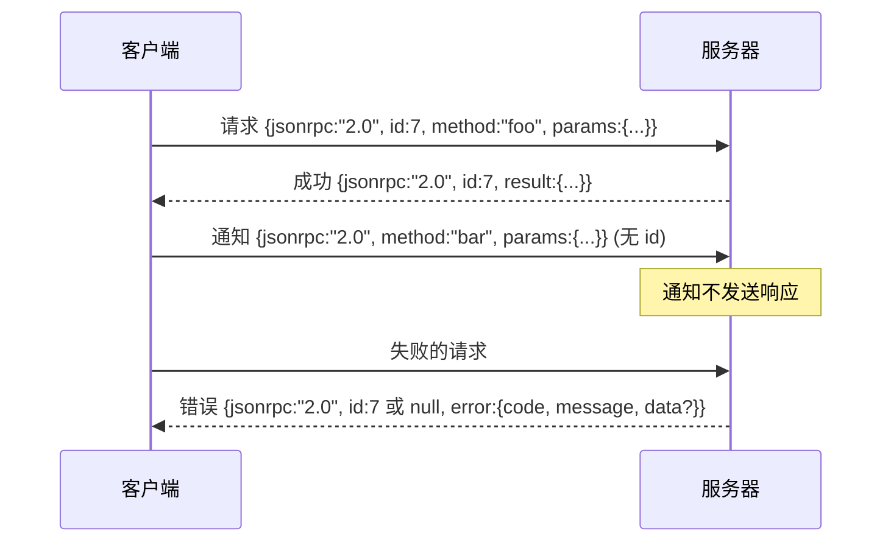

# 基于换行符分隔 Stdio 的 JSON-RPC 2.0（JSON-RPC 2.0 Over Newline-Delimited Stdio）

> 模型客户端和工具服务器之间的传输是基于 stdio 的 JSON-RPC。手动实现一次可以让你理解每个框架层在实现什么。

**类型：** 构建  
**语言：** Python  
**前置知识：** Phase 13 第 01-07 课，Phase 14 第 01 课  
**预计时间：** 约 90 分钟

## 学习目标
- 以换行符分隔的 JSON 格式通过 stdin 和 stdout 实现 JSON-RPC 2.0。
- 映射五个标准错误代码（-32700、-32600、-32601、-32602、-32603）并以正确的语义暴露它们。
- 区分请求、响应、通知和批处理，不引入新的信封键。
- 处理每行一个解析错误，而不污染其余流。
- 使用 io.BytesIO 构建自终止演示，使课程无需生成子进程即可运行。

## 为什么 JSON-RPC 仍然是通用语言

2026 年的编程智能体在单个会话中可能会与十二个工具服务器通信。每个服务器都是独立的进程或远程端点。线格式自 2013 年以来一直保持不变。JSON-RPC 2.0 是一个两页规范。它能存活下来是因为替代方案（gRPC、每次调用 HTTP、自定义二进制格式）都强加了 JSON-RPC 没有的权衡：它们选择流式传输、批处理或传输耦合。JSON-RPC 在 stdio、套接字、websockets 和 HTTP 上是对称的，如果两者都遵守规范，客户端可以驱动它从未见过的服务器。

本课构建 stdio 变体。换行符分隔的 JSON。每个请求是一行。每个响应是一行。传输边界是 `\n`。

## 线形状

存在四种信封形状。两种由客户端发送。两种由服务器发送。



通知没有 `id`。服务器不得对其响应。如果服务器对通知返回响应，客户端无法将其附加到调用站点。这条单一规则保持了框架数学的简单性。

批处理是请求或通知的 JSON 数组。服务器以任意顺序回复响应数组，每个非通知条目一个。如果批处理中的每个条目都是通知，服务器什么都不发送。

## 五个错误代码

```text
-32700  解析错误      JSON 无法解析
-32600  无效请求      信封形状错误
-32601  方法未找到
-32602  无效参数
-32603  内部错误
```

-32000 到 -32099 之间的代码保留给服务器定义的错误。其他所有内容都是应用程序定义的。本课坚持使用这五个。如果你的处理器引发异常，传输将其包装为 -32603，异常类名在 `data.exception` 中。

解析错误有一个特殊规则。响应中的 `id` 是 `null`，因为请求从未解析到足以提取 id。

## 换行符框架和 BytesIO 演示

传输每次读取一行。一行是字节，直到并包括 `\n`。如果一行无法解析，传输写入带 `id: null` 的 -32700 响应并继续。流没有被污染。下一行重新解析。

对于本课，我们将 `io.BytesIO` 对包装为 stdin 和 stdout。服务器读取请求直到 EOF，为每个写入响应，然后返回。客户端读回响应。没有进程生成。没有超时。传输行为与真正的子进程管道相同，因为 Python 的 `io` 接口提供相同的 `.readline()` 和 `.write()` 契约。

## 方法分发

传输不知道哪些方法存在。它移交给测试框架提供的可调用 `handler(method, params)`。处理器返回结果或引发异常。三个异常类暴露特定代码。

```text
MethodNotFound -> -32601
InvalidParams  -> -32602
其他任何       -> -32603，异常名在 data 中
```

传输从不看到工具注册表。注册表位于处理器后面。这是我们想要的分层。传输说 JSON-RPC。注册表说工具形状。调度器（第 23 课）将它们连接在一起。

## 错误时的流行为

```text
客户端写入              服务器读取           服务器写入
---------------          -----------          -------------
{...有效请求...}         解析成功             {...响应，id 匹配...}
{...损坏 json...         解析失败             {id:null, error: -32700}
{...有效请求...}         解析成功             {...响应，id 匹配...}
{...缺少 method...}      无效信封             {id:X, error: -32600}
```

损坏的 JSON 行不会停止循环。缺少 `method` 字段不会停止循环。处理器异常不会停止循环。传输继续读取直到 EOF。

## 通知和不对称流

通知是发后即忘的。测试框架使用通知进行进度事件、取消信号和日志行。通知是长时间运行的工具如何无需每次往返就能流式传输状态更新的方式。

本课实现一个出站通知助手 `write_notification`。服务器在处理请求时使用它发出进度更新。演示展示了该模式：请求进来，处理器发出两个进度通知，然后写入最终响应。

## 如何阅读代码

`code/main.py` 定义了 `StdioTransport`、解析助手（`parse_request`）、三个写入助手（`write_response`、`write_error`、`write_notification`）和分发循环 `serve`。错误代码常量位于模块范围。

`code/tests/test_transport.py` 涵盖了五个错误代码、通知（不写入响应）、批处理（数组输入，数组输出，通知跳过）、损坏 JSON（解析错误然后继续），以及处理器在调用过程中写入通知的不对称流。

## 进一步探索

这个传输对于后续课程已经足够。生产传输添加三件事。存活转发的关联 id 字段（你的 `id` 已经是这个，但在网格中你还需要一个外部追踪 id）。取消通道（类似 `$/cancelRequest` 的通知，带有飞行中调用的 id）。内容类型协商握手，使同一套接字可以同时说 JSON-RPC 和可流式 HTTP。这些都不改变线格式。它们添加元数据。
