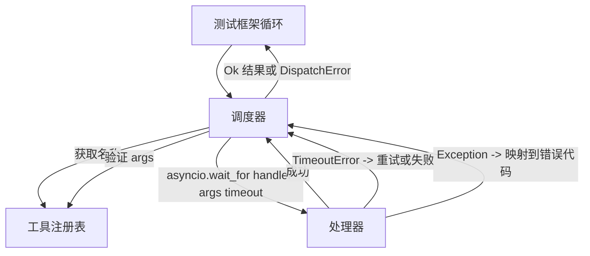
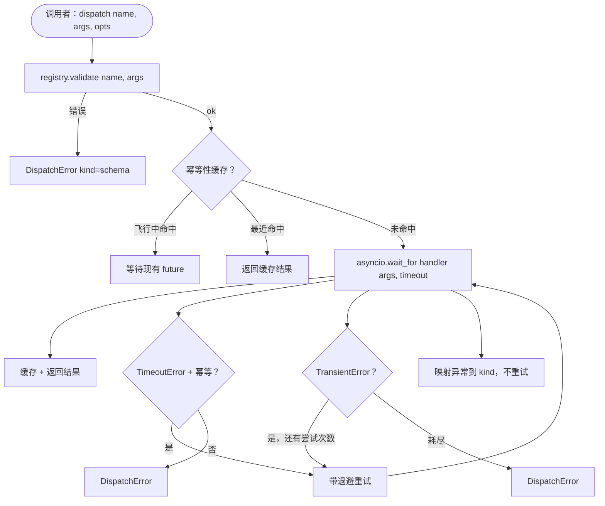

# 函数调用调度器（Function Call Dispatcher）

> 调度器是测试框架为 schema 所做的每个承诺付出代价的地方。超时、重试、去重、错误映射。全部在一条接缝上。

**类型：** 构建  
**语言：** Python  
**前置知识：** Phase 13 第 01-07 课，Phase 14 第 01 课  
**预计时间：** 约 90 分钟

## 学习目标
- 在每次调用的超时中包装工具处理器，该超时返回类型化错误而不是挂起循环。
- 应用带抖动和最大尝试次数的指数退避重试。
- 在幂等键上对重试进行去重，使与慢速原始调用竞争的重试不会运行两次。
- 将处理器异常和传输故障映射到测试框架循环已经理解的单一错误信封。
- 用并发限制限制并行分发，使 40 个工具调用的扇出不会耗尽事件循环。

## 调度器的位置

在测试框架循环（第 20 课）和工具注册表（第 21 课）之间。传输（第 22 课）馈送循环。循环将工具调用交给调度器。调度器调用注册表，运行处理器，并返回结果或 JSON-RPC 形状的错误信封。



调度器是唯一知道计时器、重试和幂等性的层。循环不知道。注册表不知道。处理器不知道。这种隔离就是重点。

## 超时

每个工具有一个默认超时。注册表记录携带 `timeout_ms`。当测试框架传入超时时，调度器从每次调用覆盖中覆盖它。我们使用 `asyncio.wait_for`。超时时，处理器任务被取消，调度器返回 `DispatchError(kind="timeout")`。

对于非幂等工具，超时默认不是可重试的错误。超时的 `db.write` 可能已提交也可能没有提交。重试会重复写入。调度器遵循注册表记录中的 `idempotent` 标志。幂等工具重试。非幂等工具不重试。

## 带指数退避的重试

重试策略最多三次尝试。退避是带抖动的指数级的。

```text
尝试 1  -> 延迟 0
尝试 2  -> 延迟 0.1s * (1 + random[0..0.5])
尝试 3  -> 延迟 0.4s * (1 + random[0..0.5])
```

只有 `timeout` 和 `transient` 错误重试。`schema` 错误、`not_found` 或 `internal` 错误不重试。schema 错误是确定性的。重试不会改变结果，还会烧掉预算。

重试循环尊重来自测试框架的预算。如果调用者的预算剩余工具调用数为零，调度器在第一次尝试时快速失败并返回 `kind="budget_exceeded"`。

## 幂等键去重

当原始调用仍在飞行中时触发的重试是真实的生产 bug。第一次调用在 4.9 秒处挂起（就在超时之下）。重试在 5 秒时触发。现在两个请求竞争同一后端。如果工具是 `payments.charge`，你会收取两次费用。

调度器接受可选的 `idempotency_key`。如果调用到来时相同的键正在飞行中，调度器等待飞行中的 future 并返回其结果。缓存在完成后保持键 60 秒以吸收晚到的重试。

键是调用者的责任。测试框架从规划器派生它：`f"{step_id}:{tool_name}:{hash(args)}"`。调度器不发明键，因为仅从参数派生键会使两个语义不同的调用看起来相同。

## 错误信封

失败的分发返回单一形状。

```text
DispatchError
  kind        : "timeout" | "transient" | "schema" | "not_found" | "internal" | "budget_exceeded"
  message     : str
  attempts    : int
  jsonrpc_code: int   (-32601, -32602, -32603 之一)
```

测试框架循环将 `kind` 映射到下一个状态。`schema` 和 `not_found` 进入 `on_error` 并触发重新规划。`timeout` 和 `transient` 进入 `on_error`，可能根据尝试次数决定是否重新规划。`budget_exceeded` 触发 `on_budget_exceeded`。

## 扇出的并发限制

`gather(*calls)` 同时运行所有协程。有 40 个工具调用时，就是 40 个打开的套接字或 40 个子进程管道。大多数后端不喜欢来自一个客户端的 40 个并行连接。

调度器将 `gather` 包装在信号量中。默认并发限制是 8。每次调用在分发前获取信号量，完成时释放。调用者看到 `gather` 形状的输出，但实际调度是有界的。

## 一次调用的流程



## 如何阅读代码

`code/main.py` 定义了 `Dispatcher`、`DispatchError` 和 `TransientError`。调度器在构造时接受注册表。异步 `dispatch(name, args, ...)` 是唯一的入口点。每次尝试的超时使用 `asyncio.wait_for` 在 `_run_with_retries` 内联应用。`gather_bounded(calls)` 以并发限制运行多个分发。

`code/tests/test_dispatcher.py` 涵盖超时触发、传递性重试、schema 错误不重试、幂等去重（具有相同键的两个并发调用折叠为一个处理器调用），以及并发限制（信号量的实际作用）。

测试使用 `asyncio.sleep(0)` 和基于 `Counter` 的确定性处理器，因此它们在毫秒内完成，不依赖于挂钟计时。

## 进一步探索

生产调度器添加两个扩展。首先，在每次转换时进行结构化日志记录（循环的事件流已经提供了这个功能，但调度器也应该发出 `dispatch.attempt` 和 `dispatch.retry` 事件）。其次，熔断器：在一个窗口内 N 次失败后，工具进入冷却期，在此期间调度立即返回 `kind="circuit_open"` 而不是尝试处理器。两者都可以在这个调度器之上添加，而不改变契约。

第 24 课将调度器粘合到规划-执行智能体，你可以看到所有四个部分运动起来。
