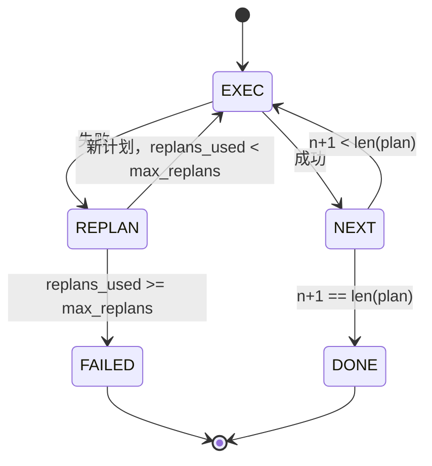

# 规划-执行控制流（Plan-Execute Control Flow）

> 无法在失败后存活的计划是脚本。可以重新规划的脚本是智能体。先构建重新规划器。

**类型：** 构建  
**语言：** Python  
**前置知识：** Phase 13 第 01-07 课，Phase 14 第 01 课  
**预计时间：** 约 90 分钟

## 学习目标
- 将计划表示为有序类型化步骤列表，使执行器可以推理进度和结果。
- 以受控的失败交接回规划器的方式顺序执行步骤。
- 从当前光标处以上下文中包含先前错误的方式重新规划，使下一个计划知晓情况。
- 在每次修订时发出计划差异，使下游追踪器或 UI 可以显示计划为何改变。
- 执行两个预算：硬步骤上限和硬重新规划上限。

## 规划-执行，而非思维链

思维链智能体发出 token 并让循环猜测工具调用在哪里结束。规划-执行智能体先发出结构化计划，然后确定性地执行每个步骤。计划是测试框架可以内省的数据。执行是测试框架通过调度器运行该数据。

两个部分。产生计划的规划器。运行计划的执行器。有趣的工作是当执行器遇到失败时发生的事情。三个选项：

```text
1. 中止         （返回失败，暴露错误）
2. 跳过         （将步骤标记为失败，继续执行其余部分）
3. 重新规划     （将错误交给规划器，从光标处获取新计划）
```

重新规划是将脚本变为智能体的那个。

## 步骤形状

```text
Step
  id              : int           （在计划修订中单调递增）
  tool_name       : str
  args            : dict
  expected_outcome: str           （规划器声明的成功条件）
  result          : Any | None
  error           : str | None
```

`expected_outcome` 是规划器与步骤一起发出的简短句子。它不由执行器强制执行。它用于两件事：重新规划器在修订计划时读取它；事件流发出它，使追踪器可以显示"这个步骤本应做 X"。

## 规划器形状

```python
def planner(goal: str, history: list[Step], last_error: str | None) -> list[Step]:
    ...
```

一个纯函数。`goal` 是用户目标。`history` 是已经执行的步骤（填入了结果和错误）。`last_error` 在第一次调用时为 None，在每次后续调用时为最近的失败消息。规划器从光标处开始返回下一个计划。

规划器不知道执行器。不知道重试。不知道超时。它产生一个计划。就这些。

## 执行器

执行器是一个小型状态机。每个步骤通过调度器运行。结果是三件事之一：成功、可重新规划的失败、致命失败。可重新规划的失败交回给规划器。致命失败（预算超出、重新规划上限达到）返回 `FAILED` 会话结果。



## 修订时的计划差异

当规划器在失败后返回新计划时，执行器发出带三个字段的 `plan.diff` 事件。

```text
removed: 在旧计划中但不在新计划中的步骤 id 列表
added  : 在新计划中但不在旧计划中的步骤 id 列表
revised: tool_name 或 args 改变的步骤 id 列表
```

追踪器或 UI 可以将此渲染为删除步骤上的删除线和添加步骤上的高亮。重点不是差异格式。重点是修订是可见事件，而非静默重写。

## 两个预算，都是硬限制

`max_steps` 限制整个会话中的步骤执行总数，包括重新规划。默认是 12。一个线性五步计划重新规划两次，每次添加三步，达到 16 次执行，超过预算。执行器将拒绝重新规划并返回 FAILED。

`max_replans` 限制第一个计划后规划器被调用的次数。默认是 5。这是更重要的限制。连续五次返回相同损坏计划的规划器否则会循环，直到步骤预算捕获它。限制重新规划使失败更快，原因更清晰。

## 本课中的确定性规划器

本课中我们不调用模型。课程附带了一个基于 `last_error` 选择计划的确定性规划器。

```text
last_error 是 None    -> 发出四步计划
last_error 匹配 X     -> 发出绕过 X 的三步计划
last_error 匹配 Y     -> 发出优雅放弃的两步计划
否则                   -> 返回 [] （信号没有东西可以重新规划）
```

这足以测试执行器在每个转换路径上的行为：成功、一次重新规划、两次重新规划、重新规划耗尽，以及步骤预算耗尽。

## 结果形状

```text
SessionResult
  status      : "completed" | "failed"
  reason      : str     ("goal_met" | "step_budget" | "replan_budget" | "no_plan")
  history     : list[Step]
  revisions   : list[PlanDiff]
  events      : list[Event]
```

第 20 课的测试框架循环可以直接读取这个结果。第 23 课的调度器是执行每个步骤的工具。第 21 课的注册表验证每个步骤的 args。第 22 课的传输会通过 JSON-RPC 将整个流程暴露给模型客户端。

## 如何阅读代码

`code/main.py` 定义了 `PlanExecuteAgent`、`Step`、`PlanDiff`、`SessionResult` 和确定性规划器。执行器是返回 `SessionResult` 的单一 `run(goal)` 方法。计划差异通过比较步骤 id 和 `(tool_name, args)` 元组来计算。

`code/tests/test_agent.py` 涵盖线性成功、一次重新规划的计划中期失败、返回 `failed:replan_budget` 的重新规划耗尽、步骤预算耗尽，以及计划差异事件格式。

## 进一步探索

将这个连接到真实模型后你会想要的两个扩展。首先，部分计划缓存：当计划在六步中的前三步成功然后失败时，你不希望重新运行前三步。执行器已经保存历史记录；规划器只需要读取它。其次，并行分支：当前执行器是严格顺序的。发出独立分支（`gather_step` 而非 `next_step`）的规划器可以通过调度器同时运行两个工具调用。

两者都增加了真正的复杂性。一旦线性执行器被固定，两者都更容易添加。这就是本课所做的。
