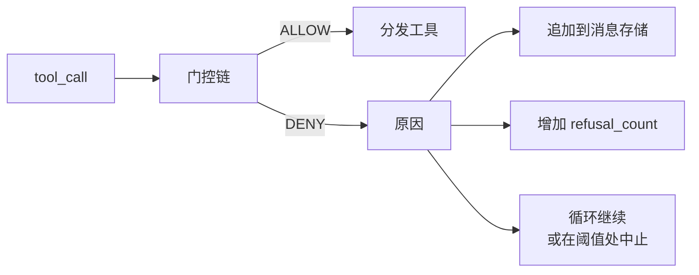
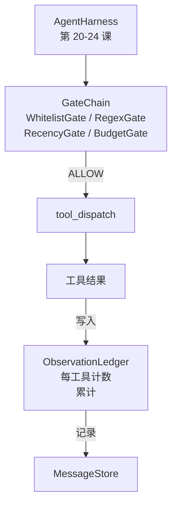

# 压轴项目第 25 课：验证门控和观察预算（Capstone Lesson 25: Verification Gates and the Observation Budget）

> 没有验证层的智能体测试框架是穿着风衣的愿望。本课构建确定性门控链，决定工具调用是否被允许触发，智能体被允许看多少输出，以及循环何时必须停止因为智能体读了太多。链是小型命名门控加上跟踪模型已被展示的每个 token 的观察账本的函数。

**类型：** 构建  
**语言：** Python（标准库）  
**前置知识：** Phase 19 · 20-24（Track A1：智能体循环，工具注册表，消息存储，提示词构建器，模型路由器），Phase 14 · 33（指令作为约束），Phase 14 · 36（范围契约），Phase 14 · 38（验证门控）  
**预计时间：** 约 90 分钟

## 学习目标

- 构建带确定性 `evaluate(call)` 方法的 `VerificationGate` 协议。
- 将预算、时效性、白名单和正则表达式门控组合成带短路语义的链。
- 通过按工具和轮次键控的 `ObservationLedger` 追踪每次观察。
- 当累计观察预算将被超过时拒绝工具调用。
- 暴露下游可观测性可以摄入的结构化 `GateDecision` 记录。

## 问题

当智能体测试框架让模型自由调用工具时，在真实使用的第一个小时内会出现三类 bug。

第一类是无界观察。对 20 万行仓库的 grep 会将半百万 token 的输出转储到下一轮。模型每千字节看一个匹配，其余上下文被浪费。token 账单很大，智能体现在在任务上更差，而非更好。

第二类是陈旧时效性。长时间运行的任务积累了 50 个工具调用。模型像是实时状态一样重新读取第三轮的第一个 read_file。第 47 轮做的编辑从未出现，因为提示词构建器首先序列化了最早的观察。

第三类是特权蔓延。研究任务从调用 `web_search` 开始，然后不知何故最终运行 `shell`，因为模型发明了一个工具名称，测试框架默认为宽松。当有人读取追踪时，一个垃圾文件坐在 /tmp，curl 对私有 API 运行了。

验证门控是测试框架中说不的组件。它不是模型。它不是裁判。它是 `(call, history, ledger)` 的确定性函数，返回 ALLOW 或带原因的 DENY。原因被记录。模型被告知。循环继续或中止。

## 核心概念



门控是任何带 `evaluate(call, ctx) -> GateDecision` 方法的东西。链是有序列表。评估在第一次拒绝时短路。顺序很重要：廉价的结构门控在昂贵的 token 计数门控之前运行。

本课提供四种门控：

- `WhitelistGate`。允许的工具名称是显式集合。外部的任何内容都被拒绝。这是最廉价的门控，首先运行。
- `RegexGate`。工具参数与正则表达式匹配。用于拒绝包含 `rm -rf` 的 shell 调用，或对内部 IP 的 HTTP 调用。纯粹在调用有效负载上。
- `RecencyGate`。模型只看到最近 N 轮的观察。较旧的观察被屏蔽。门控拒绝其结果会扩展已经过期的观察窗口的工具调用。
- `BudgetGate`。模型在整个会话中读取的累计 token 有上限。当账本说上限已达到，每次进一步的工具调用都被拒绝。

观察账本是簿记。每次成功的工具调用写入一行：工具名称、轮次、发出的 token、累计。账本回答两个问题：模型总共看了多少，以及它看了多少工具 X 的内容。预算门控读取前者。你将作为练习编写的每工具预算门控读取后者。

## 架构



测试框架询问链。链要么点头要么拒绝。如果点头，工具运行，账本打点，结果追加到消息存储。如果拒绝，模型收到系统消息形式的拒绝，循环决定是否重试或中止。

## 你将构建什么

实现是单个 `main.py` 加测试。

1. `Observation` 和 `ToolCall` 数据类定义线格式。
2. `ObservationLedger` 记录 `(turn, tool, tokens)` 行，并回答 `cumulative()` 和 `per_tool(name)`。
3. `GateDecision` 携带 `(allow, reason, gate_name)`。
4. `VerificationGate` 是协议。每个门控实现 `evaluate(call, ctx)`。
5. `GateChain` 包装有序列表。它调用每个门控，返回第一个拒绝，或在每个门控通过时返回允许。
6. 演示运行一个小型合成智能体循环。三轮。第三轮触发预算门控，循环报告一个带非零拒绝数的干净拒绝。

token 计数器故意是愚蠢的 `len(text) // 4` 启发式方法。本课的重点是门控管道，而非分词器。在生产中使用真正的分词器。

## 为什么链顺序很重要

拒绝比允许更便宜。`WhitelistGate` 在 O(1) 哈希查找中运行。`RegexGate` 在 O(pattern * argv) 中运行。`RecencyGate` 读取消息存储的一小部分。`BudgetGate` 读取整个账本。你按升序成本排序它们，使被拒绝的调用在做昂贵工作之前短路。

你还按爆炸半径排序它们。白名单是最强的声明：这个工具不在契约中。正则表达式门控是下一个：这个参数不在契约中。时效性在之后：测试框架仍然关心，但调用在结构上是合法的。预算是最后的，因为根据定义，它只在其他所有都通过时触发。

## 这与 Track A 的其余部分如何组合

前面的课程给了你循环、工具注册表、消息存储、提示词构建器和模型路由器。本课在模型和工具之间添加了一层。第 26 课提供调度器在门控链说 ALLOW 后将工具调用交给的沙箱。第 27 课提供将拒绝次数记录为质量信号的评估测试框架。第 28 课将门控决策连接到 OpenTelemetry span。第 29 课将所有内容缝合成一个工作中的编程智能体。

## 运行它

```bash
cd phases/19-capstone-projects/25-verification-gates-observation-budget
python3 code/main.py
python3 -m pytest code/tests/ -v
```

演示打印逐轮追踪，包括每次门控决策，并以零退出。测试涵盖账本、每个单独门控、链短路，以及合成循环端到端。
