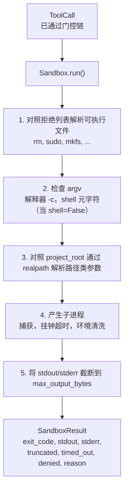
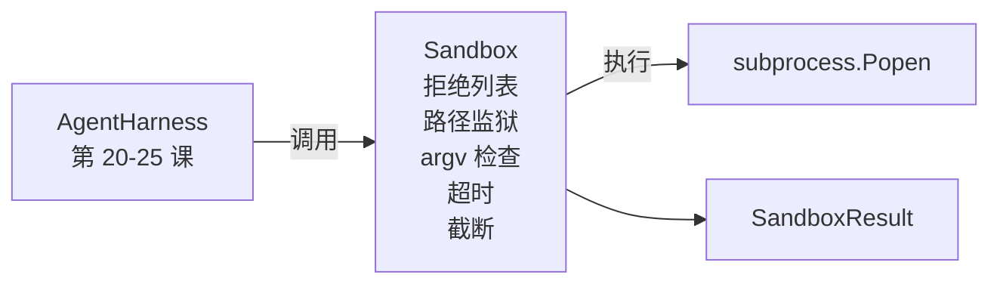

# 压轴项目第 26 课：带拒绝列表和路径监狱的沙箱运行器（Capstone Lesson 26: Sandbox Runner with Denylist and Path Jail）

> 验证门控决定工具调用是否应该运行。沙箱决定当它运行时会发生什么。本课提供一个子进程运行器，它拒绝危险的可执行文件，拒绝危险的 argv 形状，将每个文件路径监禁到项目根目录，截断过大的输出，并在挂钟超时时终止失控进程。它是位于模型和操作系统之间的两层中的第二层。

**类型：** 构建  
**语言：** Python（标准库）  
**前置知识：** Phase 19 · 25（验证门控和观察预算），Phase 14 · 33（指令作为约束），Phase 14 · 38（验证门控）  
**预计时间：** 约 90 分钟

## 学习目标

- 构建包装 `subprocess.run` 的 `Sandbox` 类，带超时、捕获和截断。
- 按名称对照拒绝列表拒绝命令，按结构对照 argv 检查器拒绝命令。
- 拒绝任何解析到声明的项目根目录之外的路径参数。
- 当 shell 模式关闭时拒绝 shell 元字符。
- 返回下游可观测性和评估测试框架可以摄入的结构化 `SandboxResult`。

## 问题

可以执行 shell 的编程智能体可以安装后门、泄露密钥、破坏开发人员的笔记本电脑，并在一轮中产生大额云账单。代价最低的防御是不给它 shell。代价第二低的是一个对精确模式列表说不的沙箱。

智能体追踪中重复出现三类失败。

第一类是危险的可执行文件。在压力下修复路径问题的模型会尝试 `sudo`、`chmod -R 777`、`rm -rf`、`mkfs`、`dd`。这些都不属于智能体运行。拒绝列表按名称和别名捕获它们。

第二类是 argv 技巧。被告知没有 shell 的模型会通过解释器传送攻击：`python3 -c "import os; os.system('rm -rf /')"`, `bash -c '...'`, `node -e '...'`, `perl -e '...'`。沙箱需要知道，任何使用类似 `-c` 标志运行的解释器只不过是带有额外步骤的 shell 调用。

第三类是路径逃逸。模型被告知读取 `./src/main.py` 但却读取了 `../../etc/passwd`。沙箱通过 `os.path.realpath` 解析每个路径参数并断言前缀来监禁它们。

沙箱在操作系统意义上不是安全边界。有代码执行能力的坚定攻击者仍然可以突破。沙箱是开发时护栏：它使常见失败模式变得响亮，并阻止智能体因纯粹的笨拙而造成损害。

## 核心概念



沙箱有四个拒绝轴：名称、argv、路径、结构。每个轴都是调用的纯函数，尚无子进程。子进程只在每个轴都通过后才产生。

`SandboxResult` 退出代码是常规的：0 成功，非零失败，加上三个哨兵代码：denied（-100）、timed_out（-101）和截断（退出代码是真实的，带有标志）。下游课程读取这个结构化结果，而不是解析 stderr。

## 架构



拒绝列表是可执行文件基本名称的 frozenset。别名（`/bin/rm`、`/usr/bin/rm`）都解析为相同的基本名称。argv 检查器知道解释器形状：任何 argv[0] 是解释器且任何后续参数以 `-c` 或 `-e` 开头的 argv 都被拒绝。当调用没有明确请求 shell 时，shell 元字符（`;`、`|`、`&`、`>`、`<`、反引号、`$()`）会导致拒绝。

路径监狱是最微妙的部分。沙箱在构造时接受 `project_root`。任何看起来像路径的参数（包含 `/` 或匹配现有文件）通过 `os.path.realpath` 规范化，然后对照项目根目录的 realpath 检查。如果解析的目标不在根目录下，则拒绝。符号链接逃逸尝试（项目根目录中指向外部的符号链接）通过检查 realpath 而不是字面路径来阻止。

## 你将构建什么

实现是 `main.py` 加测试目录。

1. `SandboxResult` 数据类：exit_code、stdout、stderr、truncated、timed_out、denied、reason、duration_ms。
2. `SandboxConfig` 数据类：project_root、max_output_bytes、timeout_seconds、denylist、interpreter_block。
3. `Sandbox` 类：`run(argv, *, shell=False, cwd=None)` 返回 `SandboxResult`。
4. 内部拒绝助手：`_check_executable_denylist`、`_check_argv_interpreter`、`_check_shell_metachars`、`_check_path_jail`。
5. 带清晰 `truncated` 标志和捕获流中标记行的输出截断。
6. 底部的演示：合法和对抗性调用的序列。每个都显示其结果。

沙箱默认使用 `shell=False` 和 `capture_output=True` 的 `subprocess.run`。挂钟超时使用 `timeout` 参数；在 `TimeoutExpired` 时，沙箱终止进程组并合成 SandboxResult。

## 为什么这不是真正的沙箱

课程沙箱不使用命名空间、cgroups、seccomp、gVisor、Firecracker 或任何内核级隔离。子进程能做的，沙箱就能做。保护是结构性的：智能体被拒绝最常见的危险调用，响亮的拒绝进入可观测性，而不是静默运行。

对于生产智能体，你在顶部分层：在无特权 Docker 容器内运行，在 microVM 内运行，放弃能力，以只读方式挂载项目根目录，以读写方式挂载临时目录，对内存和 CPU 设置 ulimit，将环境清洗到已知安全的白名单。第 29 课做了一些这方面的工作。操作系统隔离超出了本课范围。

## 运行它

```bash
cd phases/19-capstone-projects/26-sandbox-runner-denylist
python3 code/main.py
python3 -m pytest code/tests/ -v
```

演示创建一个临时目录，将一个干净的文件放入其中，然后运行一系列调用。合法调用成功。被拒绝的调用返回带 `denied=True` 和原因的 SandboxResult。超时返回 `timed_out=True`。截断设置 `truncated=True`。演示打印结果的 JSON 表并以零退出。

## 这与 Track A 的其余部分如何组合

第 25 课产生了门控链。第 26 课是门控 ALLOW 后运行的执行器。第 27 课的评估测试框架将沙箱结果与每个任务的预期退出代码进行比较。第 28 课在每个 `Sandbox.run` 调用周围发出 `gen_ai.tool.execution` span。第 29 课的端到端演示通过两层连接一个真实的编程智能体。
